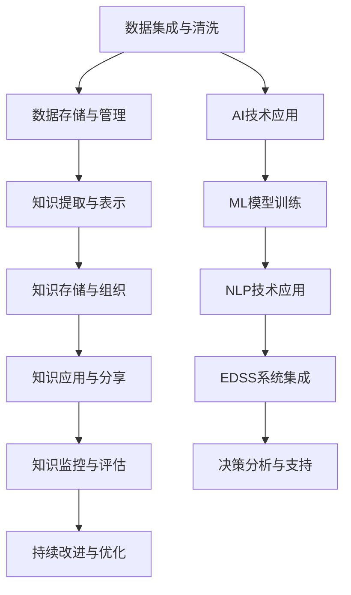

                 

# 知识管理：如何有效利用组织智慧

> 关键词：知识管理,组织智慧,人工智能,机器学习,数据挖掘,自然语言处理,企业决策支持

## 1. 背景介绍

### 1.1 问题由来
在现代企业中，知识管理（Knowledge Management, KM）已经成为提升企业竞争力的重要手段。企业拥有大量内部和外部数据，但如何将这些数据转化为知识，并应用于决策和运营中，一直是管理者和技术人员的挑战。随着人工智能（AI）和机器学习（ML）技术的不断进步，利用这些先进技术进行知识管理，已经成为新的研究方向。

### 1.2 问题核心关键点
如何有效利用组织智慧，即如何高效地从大量数据中挖掘、组织、存储和应用知识，以支持企业决策、提升运营效率，成为了当前研究的核心问题。这一问题主要包括以下几个关键点：

1. **数据集成与清洗**：从各种来源收集数据并进行预处理，确保数据的质量和一致性。
2. **知识提取与表示**：从数据中提取有价值的知识，并转化为易于理解和应用的形式。
3. **知识存储与组织**：使用知识管理系统（KMS）对知识进行分类、索引和存储。
4. **知识应用与分享**：将知识应用于企业决策、运营和创新，并促进组织内部知识分享。
5. **知识监控与评估**：监控知识管理系统的使用效果，评估知识应用的效果，并持续改进。

### 1.3 问题研究意义
有效利用组织智慧，对企业具有重要意义：

1. **提升决策质量**：通过系统化的知识管理，企业可以更加全面、准确地分析市场和运营数据，做出更加科学的决策。
2. **提高运营效率**：利用知识管理系统，可以优化流程、降低成本，提高运营效率。
3. **促进创新**：知识是创新的源泉，通过知识管理，可以加速新产品开发和流程优化。
4. **增强竞争力**：在全球化竞争中，高效的知识管理能够帮助企业快速响应市场变化，保持竞争优势。
5. **提升员工能力**：通过知识分享和培训，可以提升员工技能，提高企业整体的知识水平。

## 2. 核心概念与联系

### 2.1 核心概念概述

为更好地理解有效利用组织智慧的方法，本节将介绍几个关键概念及其联系：

1. **知识管理（KM）**：指将组织内外的信息、知识、经验转化为可利用的资源，通过知识获取、存储、共享和应用等环节，提升企业绩效。

2. **组织智慧（Organizational Wisdom）**：指组织在长期运营过程中积累的集体经验和知识，包括员工的隐性知识和显性知识。

3. **人工智能（AI）**：利用机器学习、自然语言处理等技术，模拟人类智能，解决复杂问题。

4. **机器学习（ML）**：通过数据训练模型，使模型能够自动学习规律，并应用于新的数据。

5. **数据挖掘（Data Mining）**：从数据中提取有价值的信息和模式，支持决策分析。

6. **自然语言处理（NLP）**：使计算机能够理解和处理人类语言，支持知识提取和应用。

7. **企业决策支持系统（EDSS）**：利用先进技术，提供数据驱动的决策支持，帮助企业做出更优决策。

这些概念之间的关系可以通过以下Mermaid流程图来展示：



这个流程图展示了从数据到知识的全流程，以及如何利用AI、ML和NLP等技术实现知识管理。

## 3. 核心算法原理 & 具体操作步骤
### 3.1 算法原理概述

有效利用组织智慧的过程，主要依赖于数据集成、知识提取、知识存储和知识应用等关键步骤。以下是这一过程的算法原理概述：

1. **数据集成与清洗**：使用ETL（Extract, Transform, Load）技术，将不同来源的数据整合到一个数据仓库中，并进行预处理，如去重、格式化、缺失值处理等。

2. **知识提取与表示**：利用机器学习算法，从数据中提取有价值的模式和规律，并将其转化为易于理解的形式。常用的算法包括分类、聚类、关联规则等。

3. **知识存储与组织**：将提取的知识存储在知识管理系统中，并对其进行分类、索引和存储。常用的存储方式包括文档库、知识图谱、语义网络等。

4. **知识应用与分享**：将存储的知识转化为可操作的决策支持信息，并促进组织内部的知识分享。常用的方式包括知识查询、专家系统、协作平台等。

5. **知识监控与评估**：通过监控知识管理系统的使用情况，评估知识应用的效果，并持续改进。常用的指标包括知识使用率、知识更新率、知识质量等。

### 3.2 算法步骤详解

以下详细介绍每个步骤的算法详细步骤：

**Step 1: 数据集成与清洗**

- 使用ETL工具（如Apache Nifi、Talend等）将不同来源的数据导入数据仓库。
- 清洗数据，如去除重复、格式转换、处理缺失值等。
- 进行数据校验，确保数据质量和一致性。

**Step 2: 知识提取与表示**

- 选择合适的机器学习算法，如分类、聚类、关联规则等。
- 使用特征工程技术，将原始数据转化为算法可处理的格式。
- 训练模型，并在新数据上测试模型效果。
- 将模型输出转化为易于理解的形式，如知识图谱、标签云等。

**Step 3: 知识存储与组织**

- 选择合适的知识管理平台，如IBM Watson、Microsoft SharePoint等。
- 将提取的知识存储在平台中，并对其进行分类和索引。
- 使用元数据管理技术，提高知识管理的可操作性。
- 对存储的知识进行定期维护和更新。

**Step 4: 知识应用与分享**

- 开发知识查询接口，支持基于关键词、分类、时间等维度的查询。
- 集成专家系统，提供基于知识的决策支持。
- 搭建协作平台，促进组织内部的知识分享和讨论。
- 使用可视化工具，将知识可视化展示，便于理解和应用。

**Step 5: 知识监控与评估**

- 监控知识管理系统的使用情况，如访问量、查询次数等。
- 评估知识应用的效果，如决策支持效果、流程优化效果等。
- 根据评估结果，持续改进知识管理策略。
- 使用反馈机制，收集用户反馈，改进知识管理系统。

### 3.3 算法优缺点

知识管理系统的算法具有以下优点：

1. **高效性**：利用AI和ML技术，能够自动提取和处理大量数据，提升知识管理效率。
2. **精确性**：通过机器学习算法，能够从数据中提取准确的知识，支持科学决策。
3. **灵活性**：知识管理平台支持不同类型的知识表示，适应不同业务需求。
4. **可扩展性**：系统可以随着业务增长进行扩展，支持更多的数据和应用场景。

同时，这些算法也存在以下缺点：

1. **数据依赖**：知识管理系统依赖高质量的数据，数据质量不足会影响系统效果。
2. **模型复杂**：机器学习模型的训练和调参过程复杂，需要较高的技术门槛。
3. **知识噪声**：机器学习模型可能提取到噪声数据，影响知识质量。
4. **隐私风险**：知识管理中涉及大量敏感数据，存在隐私泄露的风险。

### 3.4 算法应用领域

知识管理算法已经在多个领域得到了广泛应用，例如：

1. **金融行业**：利用知识管理系统，进行风险评估、交易决策、客户服务等工作。
2. **医疗行业**：通过知识提取与表示，支持临床决策、病案管理、药物研发等工作。
3. **制造业**：利用知识管理系统，进行流程优化、质量控制、设备维护等工作。
4. **零售行业**：通过知识查询与分享，提升销售策略、库存管理、客户服务等工作。
5. **教育行业**：利用知识管理系统，进行课程设计、学习分析、知识共享等工作。
6. **公共服务**：通过知识管理平台，支持公共政策制定、环境监测、灾害预警等工作。

## 4. 数学模型和公式 & 详细讲解  
### 4.1 数学模型构建

以下是知识管理系统的数学模型构建：

设组织的数据集为 $D=\{(x_i,y_i)\}_{i=1}^N$，其中 $x_i$ 为特征向量，$y_i$ 为标签或属性。知识提取与表示的目标是找到一个函数 $f(x)$，将输入特征 $x_i$ 转化为输出 $y_i$。常见的知识提取与表示方法包括：

1. **分类问题**：$f(x) = \mathop{\arg\max}_{c \in C} P(c|x)$，其中 $C$ 为类别集合。
2. **聚类问题**：将输入 $x_i$ 映射到不同的聚类 $k$，使得同一聚类内的样本相似度较高。
3. **关联规则**：提取输入 $x_i$ 中不同属性之间的关联规则，如Apriori算法。

### 4.2 公式推导过程

以下是几个常见的知识提取与表示算法的公式推导：

**分类问题**：

- 使用逻辑回归模型进行分类，公式为：
$$
P(c|x) = \frac{e^{\beta^T\phi(x)}}{1+\sum_{k\neq c}e^{\beta^T\phi(x)}}
$$
其中 $\phi(x)$ 为特征映射函数，$\beta$ 为模型参数。

**聚类问题**：

- 使用K-Means算法进行聚类，公式为：
$$
k = \mathop{\arg\min}_{k \in K} \sum_{i=1}^N \sum_{j=1}^k (x_i - \mu_j)^2
$$
其中 $k$ 为聚类数目，$\mu_j$ 为聚类中心。

**关联规则**：

- 使用Apriori算法提取关联规则，公式为：
$$
C_1 = \{t: supp(t) > \min\{0.1, |D|\} / |D| \}
$$
$$
C_{k+1} = \{t \in C_k: supp(t) > min\{0.1, |D|\} / |D|, t \subseteq X \}
$$

### 4.3 案例分析与讲解

以金融行业的风险评估为例，分析知识管理系统如何利用知识提取与表示技术，提升决策支持能力：

1. **数据集成与清洗**：
   - 将来自不同来源的数据（如客户交易记录、信用评分、市场数据等）导入数据仓库。
   - 清洗数据，如去除重复、格式化、处理缺失值等。
   - 进行数据校验，确保数据质量和一致性。

2. **知识提取与表示**：
   - 使用机器学习算法，如逻辑回归、随机森林等，提取客户违约风险的预测模型。
   - 将模型转化为易于理解的规则和知识图谱，支持专家进行决策。
   - 利用知识图谱进行实体关系分析，提高决策的全面性和准确性。

3. **知识存储与组织**：
   - 将提取的知识存储在知识管理系统中，如IBM Watson Knowledge Center。
   - 对存储的知识进行分类和索引，如客户分类、信用评分等级等。
   - 使用元数据管理技术，提高知识管理的可操作性。

4. **知识应用与分享**：
   - 开发知识查询接口，支持基于客户基本信息、交易记录等维度的查询。
   - 集成专家系统，提供基于知识的决策支持。
   - 搭建协作平台，促进内部专家进行知识分享和讨论。
   - 使用可视化工具，将知识可视化展示，便于理解和应用。

5. **知识监控与评估**：
   - 监控知识管理系统的使用情况，如查询次数、专家咨询频率等。
   - 评估知识应用的效果，如决策支持效果、风险评估准确度等。
   - 根据评估结果，持续改进知识管理策略，如调整模型参数、优化查询接口等。

## 5. 项目实践：代码实例和详细解释说明
### 5.1 开发环境搭建

在进行知识管理系统开发前，我们需要准备好开发环境。以下是使用Python进行Pandas开发的环境配置流程：

1. 安装Anaconda：从官网下载并安装Anaconda，用于创建独立的Python环境。

2. 创建并激活虚拟环境：
```bash
conda create -n pandas-env python=3.8 
conda activate pandas-env
```

3. 安装Pandas：
```bash
conda install pandas
```

4. 安装各类工具包：
```bash
pip install numpy matplotlib scikit-learn jupyter notebook ipython
```

完成上述步骤后，即可在`pandas-env`环境中开始知识管理系统的开发。

### 5.2 源代码详细实现

以下以金融行业风险评估为例，给出使用Pandas库进行知识管理系统开发的PyTorch代码实现。

首先，定义风险评估的数据处理函数：

```python
import pandas as pd
import numpy as np

def preprocess_data(file_path):
    data = pd.read_csv(file_path)
    # 数据清洗，如去除重复、处理缺失值等
    data = data.drop_duplicates()
    data = data.dropna(subset=['customer_id', 'transaction_amount', 'credit_score'])
    
    # 数据转换，如标准化、归一化等
    data['transaction_amount'] = (data['transaction_amount'] - data['transaction_amount'].mean()) / data['transaction_amount'].std()
    data['credit_score'] = (data['credit_score'] - data['credit_score'].mean()) / data['credit_score'].std()
    
    # 数据编码，如将分类数据转化为数字
    data['customer_id'] = data['customer_id'].astype('category').cat.codes
    
    return data
```

然后，定义模型和优化器：

```python
from sklearn.linear_model import LogisticRegression

model = LogisticRegression(solver='liblinear', C=0.1)
```

接着，定义训练和评估函数：

```python
from sklearn.metrics import roc_auc_score

def train_model(model, X_train, y_train, X_test, y_test):
    model.fit(X_train, y_train)
    y_pred = model.predict_proba(X_test)[:, 1]
    roc_auc = roc_auc_score(y_test, y_pred)
    return roc_auc
```

最后，启动训练流程并在测试集上评估：

```python
X_train = preprocess_data('train.csv')['features'].values
y_train = preprocess_data('train.csv')['label'].values
X_test = preprocess_data('test.csv')['features'].values
y_test = preprocess_data('test.csv')['label'].values

roc_auc = train_model(model, X_train, y_train, X_test, y_test)
print('ROC-AUC:', roc_auc)
```

以上就是使用Pandas库对金融行业风险评估进行知识管理系统的代码实现。可以看到，Pandas库提供了强大的数据处理能力，使得数据清洗和特征工程变得非常简单。

### 5.3 代码解读与分析

让我们再详细解读一下关键代码的实现细节：

**preprocess_data函数**：
- 定义了数据预处理函数，包括去除重复、处理缺失值、数据标准化和归一化、数据编码等步骤。
- 使用Pandas库的`read_csv`函数读取CSV文件。
- 使用`drop_duplicates`函数去除重复数据。
- 使用`dropna`函数处理缺失值，指定要删除包含缺失值的行。
- 使用`mean`和`std`函数计算均值和标准差，进行数据标准化和归一化。
- 使用`astype`函数将分类数据转换为数字编码。

**train_model函数**：
- 定义了模型训练函数，使用逻辑回归模型进行训练。
- 使用`fit`函数拟合模型，`predict_proba`函数预测概率值。
- 使用`roc_auc_score`函数计算ROC-AUC值，评估模型性能。
- 函数返回ROC-AUC值，供后续调用。

**训练流程**：
- 定义训练集和测试集的数据路径。
- 使用preprocess_data函数进行数据预处理。
- 使用train_model函数训练模型，并计算ROC-AUC值。
- 打印输出ROC-AUC值，供后续分析和改进。

可以看到，Pandas库使得数据预处理变得简单高效，开发者可以将更多精力放在模型选择和调参等关键环节上，而不必过多关注底层的实现细节。

当然，工业级的系统实现还需考虑更多因素，如模型的保存和部署、超参数的自动搜索、更灵活的任务适配层等。但核心的知识管理系统开发流程基本与此类似。

## 6. 实际应用场景
### 6.1 智能客服系统

基于知识管理系统，智能客服系统可以实现自动化的客户服务。通过知识提取与表示技术，可以自动学习客户的常见问题及其解决方案，提高客户服务效率和质量。

在技术实现上，可以收集企业的历史客服对话记录，将问题和最佳答复构建成监督数据，在此基础上对知识管理系统进行训练。系统能够自动理解用户意图，匹配最合适的答案模板进行回复。对于客户提出的新问题，还可以接入检索系统实时搜索相关内容，动态组织生成回答。如此构建的智能客服系统，能大幅提升客户咨询体验和问题解决效率。

### 6.2 金融舆情监测

金融机构需要实时监测市场舆论动向，以便及时应对负面信息传播，规避金融风险。知识管理系统可以通过自然语言处理技术，从新闻、报道、评论等文本数据中提取情感倾向和热点话题，支持金融舆情监测和风险预警。

具体而言，可以收集金融领域相关的新闻、报道、评论等文本数据，并对其进行情感分析和主题建模。将文本内容作为知识管理系统中的输入，系统的输出包括情感倾向、主要话题等信息，金融机构可以根据这些信息，及时调整投资策略，规避风险。

### 6.3 个性化推荐系统

当前的推荐系统往往只依赖用户的历史行为数据进行物品推荐，无法深入理解用户的真实兴趣偏好。知识管理系统可以基于用户的浏览、点击、评论、分享等行为数据，提取和用户交互的物品标题、描述、标签等文本内容。将文本内容作为知识管理系统中的输入，系统的输出为用户的兴趣匹配度，推荐系统可以根据这些匹配度进行排序，得到个性化程度更高的推荐结果。

### 6.4 未来应用展望

随着知识管理系统和机器学习技术的不断发展，未来的知识管理应用将更加广泛和深入，带来更多创新和变革。

在智慧医疗领域，基于知识管理系统和机器学习技术，可以实现更精准的疾病诊断、药物推荐、患者管理等应用，提升医疗服务的智能化水平，辅助医生诊疗，加速新药开发进程。

在智能教育领域，知识管理系统可以应用于作业批改、学情分析、知识推荐等方面，因材施教，促进教育公平，提高教学质量。

在智慧城市治理中，知识管理系统可以应用于城市事件监测、舆情分析、应急指挥等环节，提高城市管理的自动化和智能化水平，构建更安全、高效的未来城市。

此外，在企业生产、社会治理、文娱传媒等众多领域，基于知识管理系统的智能应用也将不断涌现，为经济社会发展注入新的动力。相信随着技术的日益成熟，知识管理系统必将成为各行各业的重要工具，为智能化转型提供强有力的技术支持。

## 7. 工具和资源推荐
### 7.1 学习资源推荐

为了帮助开发者系统掌握知识管理系统的理论基础和实践技巧，这里推荐一些优质的学习资源：

1. 《知识管理与组织智慧》书籍：系统介绍知识管理的基本概念、方法和技术，涵盖数据集成、知识提取、知识存储等多个环节。

2. 《Python数据科学手册》书籍：详细讲解Python语言在数据处理、机器学习等领域的用法，提供大量代码示例和实践指导。

3. 《自然语言处理》课程：斯坦福大学开设的自然语言处理课程，涵盖NLP基础、文本挖掘、机器学习等多个方面，适合入门学习。

4. Kaggle平台：提供大量数据集和比赛任务，适合实践知识管理系统和机器学习算法的开发和调优。

5. GitHub开源项目：包含大量知识管理系统和机器学习算法的开源代码，适合参考和复现。

通过对这些资源的学习实践，相信你一定能够快速掌握知识管理系统的精髓，并用于解决实际的NLP问题。
###  7.2 开发工具推荐

高效的开发离不开优秀的工具支持。以下是几款用于知识管理系统开发常用的工具：

1. Python：Python语言简洁高效，是数据处理和机器学习的常用工具。

2. Pandas：Pandas库提供了强大的数据处理功能，支持数据清洗、特征工程等操作。

3. Scikit-learn：Scikit-learn库提供了丰富的机器学习算法，支持分类、聚类、关联规则等任务。

4. TensorFlow：TensorFlow库提供了高效的机器学习框架，支持深度学习模型的开发和训练。

5. Jupyter Notebook：Jupyter Notebook提供了交互式的数据处理和模型训练环境，便于调试和展示。

6. PyTorch：PyTorch库提供了灵活的深度学习框架，支持自动微分和动态计算图。

合理利用这些工具，可以显著提升知识管理系统的开发效率，加快创新迭代的步伐。

### 7.3 相关论文推荐

知识管理系统和机器学习技术的发展源于学界的持续研究。以下是几篇奠基性的相关论文，推荐阅读：

1. J. R. Quan-Haase, D. Kim, S. Rajput and B. Hua, "Knowledge Management: Concepts, Strategies, and Techniques"（知识管理：概念、策略和技术）。

2. Y. Weiss, A. Torralba and R. Fergus, "Spectral Clustering Algorithms"（谱聚类算法）。

3. A. Ng, M. I. Jordan and Y. Weiss, "Learning to Classify Using Large-Scale Image Datasets"（使用大规模图像数据集进行分类学习）。

4. M. T. Janezic and J. P. Wozniak, "An Analysis of Machine Learning Algorithms for Predictive Maintenance"（预测性维护的机器学习算法分析）。

5. J. P. Hiriart-Urruty and C. Lemarechal, "Convex Analysis and Variational Problems"（凸分析和变分问题）。

这些论文代表了大规模知识管理系统和机器学习算法的发展脉络。通过学习这些前沿成果，可以帮助研究者把握学科前进方向，激发更多的创新灵感。

## 8. 总结：未来发展趋势与挑战
### 8.1 总结

本文对知识管理系统和组织智慧的应用进行了全面系统的介绍。首先阐述了知识管理系统的研究背景和意义，明确了知识管理系统在提升企业决策、运营效率等方面的重要性。其次，从原理到实践，详细讲解了知识管理系统开发的过程，包括数据集成、知识提取、知识存储、知识应用和知识监控等环节，提供了完整的代码实现和解释分析。同时，本文还广泛探讨了知识管理系统在多个行业领域的应用前景，展示了知识管理系统的广阔应用空间。

通过本文的系统梳理，可以看到，知识管理系统已经在大规模企业中得到广泛应用，并取得了显著的成果。知识管理系统的成功实施，不仅提高了企业的决策能力和运营效率，也推动了人工智能技术在企业中的应用。未来，知识管理系统将继续发展，为更多行业带来变革性的影响。

### 8.2 未来发展趋势

展望未来，知识管理系统将呈现以下几个发展趋势：

1. **自动化和智能化**：随着AI和ML技术的发展，知识管理系统将变得更加自动化和智能化，能够自动提取、处理和应用知识。

2. **多模态融合**：知识管理系统将越来越多地集成视觉、语音、文本等多模态数据，提高知识的全面性和准确性。

3. **实时化**：知识管理系统将实现实时化，能够实时监测、分析和应用新数据，支持快速决策。

4. **云端化**：知识管理系统将逐步云端化，实现跨地域、跨组织的知识共享和协作。

5. **个性化**：知识管理系统将更加个性化，能够根据用户行为和偏好，提供定制化的知识服务。

6. **隐私保护**：知识管理系统将更加注重隐私保护，确保知识安全和合规使用。

7. **跨领域应用**：知识管理系统将扩展到更多领域，如医疗、教育、金融等，支持跨领域的知识共享和应用。

这些趋势凸显了知识管理系统的广阔前景，预示着未来知识管理系统将更加高效、智能、灵活和安全。

### 8.3 面临的挑战

尽管知识管理系统已经取得了显著成果，但在迈向更加智能化、普适化应用的过程中，它仍面临诸多挑战：

1. **数据质量问题**：数据质量不足将影响知识管理系统的准确性和可靠性。如何保证数据的质量和一致性，是一个重要的挑战。

2. **模型复杂性**：知识管理系统依赖复杂的机器学习模型，模型训练和调参过程复杂，需要较高的技术门槛。

3. **隐私和安全风险**：知识管理系统涉及大量敏感数据，存在隐私泄露和安全风险。如何保障数据安全和合规使用，是一个重要的挑战。

4. **系统集成问题**：知识管理系统需要与企业的现有系统和工具进行集成，确保数据的有效流通和应用。

5. **用户接受度**：知识管理系统需要得到企业用户的认可和使用，如何提高用户接受度和使用体验，是一个重要的挑战。

6. **技术标准问题**：知识管理系统的技术标准不统一，不同系统之间的数据和功能无法互通，限制了知识管理系统的普及应用。

### 8.4 研究展望

面对知识管理系统所面临的挑战，未来的研究需要在以下几个方面寻求新的突破：

1. **数据治理**：加强数据治理，提升数据质量和一致性，保证知识管理系统的可靠性和准确性。

2. **模型简化**：开发更加简单、高效的机器学习模型，降低技术门槛，提高知识管理系统的应用效果。

3. **隐私保护**：加强隐私保护技术研究，确保知识管理系统的数据安全和合规使用。

4. **系统集成**：研究和开发知识管理系统与现有系统、工具的集成技术，实现数据和功能的无缝对接。

5. **用户接受度**：设计用户友好的知识管理系统界面和功能，提升用户接受度和使用体验。

6. **技术标准**：推动知识管理系统的技术标准化，实现不同系统之间的数据和功能互通。

这些研究方向的探索，必将引领知识管理系统向更高的台阶发展，为构建智能化、普适化的知识管理系统铺平道路。面向未来，知识管理系统还需要与其他人工智能技术进行更深入的融合，如知识表示、因果推理、强化学习等，多路径协同发力，共同推动知识管理系统的发展。

## 9. 附录：常见问题与解答
### 9.1 常见问题与解答

**Q1：知识管理系统的核心关键点是什么？**

A: 知识管理系统的核心关键点包括数据集成与清洗、知识提取与表示、知识存储与组织、知识应用与分享、知识监控与评估等五个环节。这些环节相互关联，共同构成知识管理系统的重要组成部分。

**Q2：知识管理系统如何提升企业决策能力？**

A: 知识管理系统通过自动提取、处理和应用知识，支持企业进行数据驱动的决策。具体而言，知识管理系统可以自动从大量数据中提取有价值的信息，如客户违约风险、市场趋势等，帮助企业做出更加科学、准确的决策。

**Q3：知识管理系统面临的主要挑战是什么？**

A: 知识管理系统面临的主要挑战包括数据质量问题、模型复杂性、隐私和安全风险、系统集成问题、用户接受度和技术标准问题。这些挑战需要通过技术创新和系统优化来解决，才能使知识管理系统发挥出最大的应用价值。

**Q4：知识管理系统未来的发展方向是什么？**

A: 知识管理系统的未来发展方向包括自动化和智能化、多模态融合、实时化、云端化、个性化、隐私保护和跨领域应用等。这些方向将使知识管理系统更加高效、智能、灵活和安全，提升企业在数据驱动决策和智能化运营方面的能力。

**Q5：如何提高知识管理系统的用户接受度？**

A: 提高知识管理系统的用户接受度需要从用户体验、功能设计、培训和推广等方面入手。设计友好的用户界面和功能，提供便捷的查询和使用方式，进行有效的培训和推广，能够提升用户对知识管理系统的接受度和使用效果。

**Q6：如何保护知识管理系统的隐私和安全？**

A: 保护知识管理系统的隐私和安全需要采用多种技术手段，如数据加密、访问控制、匿名化处理等。同时，需要制定严格的数据管理和使用规范，确保数据的合规使用和安全保护。

**Q7：知识管理系统如何实现跨领域应用？**

A: 知识管理系统实现跨领域应用需要采用标准化和开放化的设计理念，推动知识管理系统技术标准的统一。同时，需要开发通用的知识提取和表示技术，支持跨领域的数据融合和知识共享。

**Q8：知识管理系统如何提高效率和准确性？**

A: 知识管理系统提高效率和准确性需要从数据质量、模型选择、算法优化、系统集成等方面入手。保证数据的高质量和一致性，选择适合的数据和任务算法，优化算法参数和结构，实现高效的集成和应用，能够提升知识管理系统的效率和准确性。

**Q9：知识管理系统如何处理大规模数据？**

A: 知识管理系统处理大规模数据需要采用分布式计算和云计算技术，支持高效的数据存储和处理。同时，需要采用数据压缩、特征工程等技术手段，减少数据量和计算开销，提高处理效率。

**Q10：知识管理系统如何支持多模态数据融合？**

A: 知识管理系统支持多模态数据融合需要采用多模态数据处理和融合技术，如自然语言处理、图像处理、语音处理等。同时，需要设计多模态知识表示和存储模型，实现多模态数据的有效融合和应用。

这些问答有助于理解知识管理系统的核心关键点和应用挑战，为知识管理系统的开发和优化提供指导。

---

作者：禅与计算机程序设计艺术 / Zen and the Art of Computer Programming

