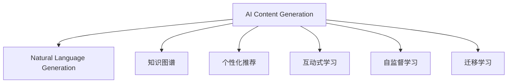

                 

# 知识经济下知识付费的人工智能内容生成技术

## 1. 背景介绍

### 1.1 问题由来
在知识经济时代，人工智能（AI）技术正以前所未有的速度渗透到各个行业，成为推动经济发展和社会进步的重要力量。尤其是人工智能内容生成技术（AI Content Generation, AICG），以其低成本、高效率、高质量的特性，在知识付费、教育培训、媒体出版等多个领域发挥了重要作用。

知识付费，作为一种新兴的商业模式，通过向用户提供优质、专业、个性化的知识内容，满足其深度学习、职业发展、生活娱乐等需求。然而，随着内容生产门槛的降低，用户对内容质量的要求也在不断提升，如何提升内容生成效率和质量，成为行业亟待解决的问题。

### 1.2 问题核心关键点
AI内容生成技术旨在通过机器学习和自然语言处理（NLP）技术，自动化生成高质量、高效率的内容。在知识付费领域，其应用主要包括以下几个方面：
1. **个性化推荐**：根据用户兴趣和行为，智能推荐相关课程、文章、视频等。
2. **智能创作**：利用自然语言生成（NLG）技术，自动撰写高质量的文章、博客、报告等。
3. **互动式学习**：结合AI技术，提供互动式学习体验，如智能对话、自动批改、模拟面试等。

本研究将重点讨论AI内容生成技术在知识付费领域的实际应用，探索如何通过技术手段提升内容质量，降低生产成本，实现高效的知识传播。

### 1.3 问题研究意义
研究AI内容生成技术在知识付费中的应用，对于推动知识付费产业的繁荣，提升用户学习体验，加速知识传播具有重要意义：
1. **提升内容质量**：AI内容生成技术能够根据用户需求，生成高质量、高相关性的内容，提升用户的学习效果和满意度。
2. **降低生产成本**：自动化的内容生成可以大幅减少人力和时间成本，使内容生产变得更加高效和低成本。
3. **个性化推荐**：结合用户行为数据，AI可以提供更加精准、个性化的内容推荐，提升用户体验。
4. **创新商业模式**：通过智能创作和互动学习，AI为知识付费产业带来了新的商业模式，如虚拟讲师、虚拟导师等。

## 2. 核心概念与联系

### 2.1 核心概念概述

为更好地理解AI内容生成技术在知识付费中的应用，本节将介绍几个密切相关的核心概念：

- **人工智能内容生成（AI Content Generation, AICG）**：利用机器学习和自然语言处理技术，自动化生成高质量、高效率的内容。

- **自然语言生成（Natural Language Generation, NLG）**：通过机器学习和统计模型，将结构化数据转换为自然语言文本的过程。

- **知识图谱（Knowledge Graph）**：以图的形式表示实体和概念之间的关系，用于支持知识推理和内容生成。

- **个性化推荐（Personalized Recommendation）**：根据用户兴趣和行为数据，智能推荐相关内容，提升用户满意度。

- **互动式学习（Interactive Learning）**：通过AI技术，提供互动式学习体验，如智能对话、自动批改等，增强学习效果。

- **自监督学习（Self-Supervised Learning）**：利用数据本身的内在关系进行学习，无需人工标注，适用于大规模无监督数据训练。

- **迁移学习（Transfer Learning）**：通过预训练模型迁移，加速新任务的学习过程。

这些核心概念之间的逻辑关系可以通过以下Mermaid流程图来展示：



这个流程图展示了大语言模型的工作原理和优化方向：

1. AI内容生成技术利用自然语言生成模型，将数据转换为自然语言文本。
2. 结合知识图谱，提升内容的准确性和相关性。
3. 通过个性化推荐，提供更加精准的内容推荐。
4. 引入自监督学习和迁移学习，加速模型训练，提升性能。

这些概念共同构成了AI内容生成技术的核心框架，使其能够在知识付费等领域发挥强大的生成能力。通过理解这些核心概念，我们可以更好地把握AI内容生成技术的实施细节和工作机制。

## 3. 核心算法原理 & 具体操作步骤
### 3.1 算法原理概述

AI内容生成技术基于自然语言生成（NLG）模型，其核心原理是通过机器学习技术，将结构化数据（如文本、表格、图像等）转换为自然语言文本。

形式化地，假设输入的数据为 $D=\{x_1, x_2, ..., x_n\}$，其中 $x_i$ 为结构化数据。NLG模型的目标是最大化输出文本与真实文本之间的相似度，即：

$$
\max_{\theta} P_{\theta}(X | D) = \max_{\theta} \frac{P_{\theta}(X, D)}{P(D)} = \max_{\theta} \log P_{\theta}(X | D)
$$

其中 $P_{\theta}(X | D)$ 为模型在输入数据 $D$ 上的条件概率，$P(D)$ 为先验概率，通常为常数。

具体来说，AI内容生成技术分为两个阶段：
1. **预训练阶段**：在大型无标签数据集上进行预训练，学习语言生成规律。
2. **微调阶段**：在特定任务或领域的数据集上进行微调，优化生成效果。

### 3.2 算法步骤详解

AI内容生成技术在知识付费中的应用，一般包括以下几个关键步骤：

**Step 1: 数据收集与预处理**
- 收集目标领域的文本数据，并进行清洗、标注和分词等预处理。
- 对文本进行编码，生成输入向量 $X$。

**Step 2: 构建预训练模型**
- 选择或构建合适的预训练模型，如GPT-3、BERT等，进行大规模预训练。
- 对预训练模型进行微调，以适应特定领域或任务的需求。

**Step 3: 设定优化目标**
- 根据应用场景，设定优化目标函数，如交叉熵损失、BLEU得分等。
- 选择合适的优化器（如Adam、SGD等），设置学习率、批大小等超参数。

**Step 4: 训练与评估**
- 使用训练集进行模型训练，周期性在验证集上评估模型性能。
- 在测试集上对模型进行最终评估，根据优化目标调整超参数。

**Step 5: 内容生成与应用**
- 使用训练好的模型对新的结构化数据进行内容生成。
- 根据应用场景，将生成的内容进行后处理、排版、输出等操作。
- 部署模型到知识付费平台，提供个性化推荐、智能创作等应用服务。

### 3.3 算法优缺点

AI内容生成技术在知识付费中的应用，具有以下优点：
1. **高效性**：利用自动化的内容生成技术，大幅降低了内容生产的时间成本和人力成本。
2. **质量高**：基于预训练和微调的高性能模型，生成的内容具有较高的语言准确性和可读性。
3. **个性化推荐**：能够根据用户兴趣和行为数据，提供精准的内容推荐，提升用户满意度。
4. **可扩展性**：适用于多种内容形式，如文本、图像、视频等，具有良好的扩展性。

同时，该技术也存在一些局限性：
1. **数据依赖**：模型的效果依赖于输入数据的质量和量，对标注数据的获取和处理要求较高。
2. **鲁棒性不足**：生成的内容可能存在一定的误差和歧义，需要人工审核和修正。
3. **知识泛化**：模型对特定领域的知识掌握有限，可能无法生成领域相关的专业内容。
4. **可解释性差**：模型内部的决策过程较为复杂，难以解释生成内容的逻辑和依据。
5. **版权问题**：生成内容的版权归属问题较为复杂，需要考虑法律法规的限制。

尽管存在这些局限性，AI内容生成技术在知识付费领域仍具有巨大的应用前景和广泛的应用场景。

### 3.4 算法应用领域

AI内容生成技术在知识付费领域的应用，覆盖了内容创作、个性化推荐、互动学习等多个方面，具体包括：

- **智能创作**：自动撰写高质量的文章、博客、报告等，提升内容创作效率。
- **个性化推荐**：根据用户行为数据，智能推荐相关课程、文章、视频等，提升用户满意度。
- **互动式学习**：通过智能对话、自动批改等方式，提供互动式学习体验，增强学习效果。
- **虚拟讲师**：利用AI技术，生成虚拟讲师，提供个性化辅导和答疑服务。
- **虚拟导师**：结合知识图谱，提供领域相关的知识导航和问题解答。

## 4. 数学模型和公式 & 详细讲解 & 举例说明

### 4.1 数学模型构建

AI内容生成技术基于自然语言生成（NLG）模型，其数学模型可以表示为：

$$
P_{\theta}(X | D) = \prod_{i=1}^N P_{\theta}(x_i | x_{i-1}, D)
$$

其中 $P_{\theta}(x_i | x_{i-1}, D)$ 为模型在输入数据 $D$ 上的条件概率，$x_i$ 为输入数据的第 $i$ 个位置，$N$ 为输入数据长度。

具体来说，NLG模型通常使用序列生成模型，如循环神经网络（RNN）、长短时记忆网络（LSTM）、Transformer等，通过对输入数据进行编码和解码，生成自然语言文本。

### 4.2 公式推导过程

以下是自然语言生成模型的基本推导过程：

1. **编码器**：将输入数据 $D$ 转换为隐状态 $H$。
   $$
   H = \text{Encoder}(D)
   $$

2. **解码器**：根据隐状态 $H$ 和解码器状态 $S$，生成输出文本 $X$。
   $$
   X = \text{Decoder}(H, S)
   $$

3. **训练目标**：最大化输出文本与真实文本之间的相似度。
   $$
   \max_{\theta} \log P_{\theta}(X | D) = \max_{\theta} \log \prod_{i=1}^N P_{\theta}(x_i | x_{i-1}, D)
   $$

4. **优化算法**：使用梯度下降等优化算法，最小化损失函数。
   $$
   \theta \leftarrow \theta - \eta \nabla_{\theta}\mathcal{L}(\theta)
   $$

其中 $\mathcal{L}(\theta)$ 为损失函数，$\eta$ 为学习率，$\nabla_{\theta}\mathcal{L}(\theta)$ 为损失函数对模型参数 $\theta$ 的梯度。

### 4.3 案例分析与讲解

以智能创作为例，使用NLG模型生成高质量的文章。首先，收集目标领域的文本数据，对其进行清洗、标注和分词等预处理。然后，构建预训练模型（如GPT-3），并对其进行微调，以适应特定领域的需求。最后，设定优化目标函数，如交叉熵损失，使用训练集进行模型训练，周期性在验证集上评估模型性能，最终在测试集上对模型进行最终评估。

在模型训练过程中，可以根据应用场景设置不同的损失函数和优化目标。例如，对于生成文本的情感分类任务，可以使用情感分类损失函数，生成文本的翻译任务，可以使用BLEU得分等。

## 5. 项目实践：代码实例和详细解释说明
### 5.1 开发环境搭建

在进行AI内容生成项目实践前，我们需要准备好开发环境。以下是使用Python进行TensorFlow开发的环境配置流程：

1. 安装Anaconda：从官网下载并安装Anaconda，用于创建独立的Python环境。

2. 创建并激活虚拟环境：
```bash
conda create -n tf-env python=3.8 
conda activate tf-env
```

3. 安装TensorFlow：根据CUDA版本，从官网获取对应的安装命令。例如：
```bash
pip install tensorflow-gpu==2.5
```

4. 安装TensorFlow Addons：提供额外的API和工具，方便模型训练和调试。
```bash
pip install tensorflow-addons==0.15.0
```

5. 安装各类工具包：
```bash
pip install numpy pandas scikit-learn matplotlib tqdm jupyter notebook ipython
```

完成上述步骤后，即可在`tf-env`环境中开始AI内容生成项目的实践。

### 5.2 源代码详细实现

下面我们以自然语言生成（NLG）模型为例，给出使用TensorFlow进行模型训练的PyTorch代码实现。

首先，定义模型结构：

```python
import tensorflow as tf
from tensorflow.keras import layers

class NLGModel(tf.keras.Model):
    def __init__(self, vocab_size, embedding_dim, rnn_units):
        super(NLGModel, self).__init__()
        self.embedding = layers.Embedding(vocab_size, embedding_dim)
        self.rnn = layers.LSTM(rnn_units)
        self.dense = layers.Dense(vocab_size)
    
    def call(self, inputs):
        x = self.embedding(inputs)
        x = self.rnn(x)
        x = self.dense(x)
        return x
```

然后，定义数据集：

```python
class TextDataset(tf.data.Dataset):
    def __init__(self, texts, labels):
        self.texts = texts
        self.labels = labels
        self.vocab = set()
        for text in texts:
            for word in text:
                self.vocab.add(word)
        
    def __len__(self):
        return len(self.texts)
    
    def __getitem__(self, item):
        text = self.texts[item]
        label = self.labels[item]
        return text, label
```

接着，定义模型训练和评估函数：

```python
def train_model(model, dataset, epochs, batch_size, optimizer):
    dataset = dataset.shuffle(10000).batch(batch_size)
    model.compile(optimizer=optimizer, loss='sparse_categorical_crossentropy', metrics=['accuracy'])
    model.fit(dataset, epochs=epochs)
    
def evaluate_model(model, dataset, batch_size):
    dataset = dataset.batch(batch_size)
    loss, accuracy = model.evaluate(dataset)
    print('Loss:', loss)
    print('Accuracy:', accuracy)
```

最后，启动模型训练和评估流程：

```python
vocab_size = len(vocab)
embedding_dim = 256
rnn_units = 128
optimizer = tf.keras.optimizers.Adam()

model = NLGModel(vocab_size, embedding_dim, rnn_units)

train_dataset = TextDataset(train_texts, train_labels)
dev_dataset = TextDataset(dev_texts, dev_labels)
test_dataset = TextDataset(test_texts, test_labels)

train_model(model, train_dataset, epochs=10, batch_size=32, optimizer=optimizer)
evaluate_model(model, dev_dataset, batch_size=32)
evaluate_model(model, test_dataset, batch_size=32)
```

以上就是使用TensorFlow进行自然语言生成模型训练的完整代码实现。可以看到，TensorFlow提供了丰富的API和工具，使得模型训练和评估变得更加简洁高效。

### 5.3 代码解读与分析

让我们再详细解读一下关键代码的实现细节：

**NLGModel类**：
- `__init__`方法：初始化模型参数，包括嵌入层、循环神经网络层和输出层。
- `call`方法：定义模型的前向传播过程，通过嵌入层、循环神经网络和输出层，生成输出文本。

**TextDataset类**：
- `__init__`方法：初始化数据集，包括文本和标签，并构建词汇表。
- `__len__`方法：返回数据集的样本数量。
- `__getitem__`方法：对单个样本进行处理，返回文本和标签。

**train_model和evaluate_model函数**：
- `train_model`函数：使用训练集进行模型训练，并使用Adam优化器进行优化。
- `evaluate_model`函数：在验证集和测试集上评估模型性能，输出损失和准确率。

**模型训练和评估流程**：
- 定义词汇表大小、嵌入维度和循环神经网络单元数。
- 创建模型并编译。
- 创建训练集、验证集和测试集。
- 使用训练集进行模型训练，并使用Adam优化器进行优化。
- 在验证集和测试集上评估模型性能。

可以看到，TensorFlow提供了丰富的工具和API，使得模型训练和评估变得更加简单高效。开发者可以将更多精力放在模型改进和应用场景设计上，而不必过多关注底层实现细节。

当然，工业级的系统实现还需考虑更多因素，如模型的保存和部署、超参数的自动搜索、更灵活的任务适配层等。但核心的模型训练和评估流程基本与此类似。

## 6. 实际应用场景
### 6.1 知识付费平台个性化推荐

AI内容生成技术在知识付费平台上的主要应用是个性化推荐。通过分析用户的历史行为数据，生成与用户兴趣相关的高质量内容，提高用户满意度。

在技术实现上，可以采用协同过滤、内容过滤等推荐算法，结合AI内容生成技术，生成高质量的推荐内容。具体来说，可以采用以下步骤：

1. 收集用户的行为数据，如浏览记录、购买记录、评分记录等。
2. 对数据进行预处理，生成用户-物品的共现矩阵。
3. 利用协同过滤算法，生成用户兴趣向量。
4. 使用AI内容生成模型，根据用户兴趣向量生成相关内容的摘要或标题。
5. 在推荐界面上展示生成的内容摘要或标题，供用户选择。

### 6.2 虚拟讲师与虚拟导师

虚拟讲师和虚拟导师是AI内容生成技术在知识付费平台上的重要应用。通过结合自然语言处理和知识图谱技术，可以生成高质量的虚拟讲师和虚拟导师，提供个性化辅导和答疑服务。

具体来说，可以采用以下步骤：

1. 收集领域相关的知识图谱，构建领域知识库。
2. 使用自然语言处理技术，将用户的问题转换为结构化数据。
3. 使用AI内容生成模型，根据结构化数据生成回答。
4. 结合知识图谱，生成更准确的回答。
5. 在平台上展示虚拟讲师和虚拟导师的回答，供用户参考。

### 6.3 智能创作与互动学习

AI内容生成技术还可以应用于智能创作和互动学习，提供更加多样化的学习体验。

具体来说，可以采用以下步骤：

1. 收集领域相关的文本数据，并进行预处理。
2. 使用AI内容生成模型，自动生成高质量的课程大纲或学习材料。
3. 在平台上展示生成的学习材料，供用户参考。
4. 利用自然语言处理技术，与用户进行智能对话，解答学习问题。
5. 利用自动批改技术，评估用户的作业完成情况。

## 7. 工具和资源推荐
### 7.1 学习资源推荐

为了帮助开发者系统掌握AI内容生成技术的理论基础和实践技巧，这里推荐一些优质的学习资源：

1. 《自然语言生成（NLG）：理论与实践》系列博文：由自然语言生成领域专家撰写，深入浅出地介绍了自然语言生成原理、模型架构和应用场景。

2. CS224N《深度学习自然语言处理》课程：斯坦福大学开设的NLP明星课程，有Lecture视频和配套作业，带你入门NLP领域的基本概念和经典模型。

3. 《深度学习自然语言处理》书籍：斯坦福大学教授陈丹青所著，全面介绍了自然语言处理的基本原理和前沿技术，适合深入学习。

4. HuggingFace官方文档：自然语言处理工具库HuggingFace的官方文档，提供了海量预训练模型和完整的生成样例代码，是上手实践的必备资料。

5. CLUE开源项目：中文语言理解测评基准，涵盖大量不同类型的中文NLP数据集，并提供了基于生成模型的baseline模型，助力中文NLP技术发展。

通过对这些资源的学习实践，相信你一定能够快速掌握AI内容生成技术的精髓，并用于解决实际的NLP问题。

### 7.2 开发工具推荐

高效的开发离不开优秀的工具支持。以下是几款用于AI内容生成开发的常用工具：

1. TensorFlow：基于Python的开源深度学习框架，灵活的计算图，适合快速迭代研究。大部分自然语言生成模型都有TensorFlow版本的实现。

2. PyTorch：基于Python的开源深度学习框架，动态计算图，适合动态生成模型和复杂任务。

3. Transformers库：HuggingFace开发的NLP工具库，集成了众多SOTA自然语言生成模型，支持PyTorch和TensorFlow，是进行生成任务开发的利器。

4. Weights & Biases：模型训练的实验跟踪工具，可以记录和可视化模型训练过程中的各项指标，方便对比和调优。与主流深度学习框架无缝集成。

5. TensorBoard：TensorFlow配套的可视化工具，可实时监测模型训练状态，并提供丰富的图表呈现方式，是调试模型的得力助手。

6. Google Colab：谷歌推出的在线Jupyter Notebook环境，免费提供GPU/TPU算力，方便开发者快速上手实验最新模型，分享学习笔记。

合理利用这些工具，可以显著提升AI内容生成任务的开发效率，加快创新迭代的步伐。

### 7.3 相关论文推荐

自然语言生成技术的发展源于学界的持续研究。以下是几篇奠基性的相关论文，推荐阅读：

1. Attention is All You Need（即Transformer原论文）：提出了Transformer结构，开启了自然语言生成领域的预训练大模型时代。

2. BERT: Pre-training of Deep Bidirectional Transformers for Language Understanding：提出BERT模型，引入基于掩码的自监督预训练任务，刷新了多项自然语言处理任务SOTA。

3. Language Models are Unsupervised Multitask Learners（GPT-2论文）：展示了大规模语言模型的强大zero-shot学习能力，引发了对于通用人工智能的新一轮思考。

4. Prefix-Tuning: Optimizing Continuous Prompts for Generation：引入基于连续型Prompt的生成范式，为如何充分利用预训练知识提供了新的思路。

5. AdaLoRA: Adaptive Low-Rank Adaptation for Parameter-Efficient Fine-Tuning：使用自适应低秩适应的生成方法，在参数效率和生成精度之间取得了新的平衡。

这些论文代表了大语言模型生成技术的发展脉络。通过学习这些前沿成果，可以帮助研究者把握学科前进方向，激发更多的创新灵感。

## 8. 总结：未来发展趋势与挑战

### 8.1 总结

本文对AI内容生成技术在知识付费中的应用进行了全面系统的介绍。首先阐述了AI内容生成技术的背景和重要性，明确了其在提升内容质量、降低生产成本、个性化推荐等方面的独特价值。其次，从原理到实践，详细讲解了AI内容生成技术的数学模型和核心算法，给出了模型训练和评估的完整代码实例。同时，本文还广泛探讨了AI内容生成技术在知识付费领域的实际应用，展示了其强大的生成能力。

通过本文的系统梳理，可以看到，AI内容生成技术正在成为知识付费产业的重要引擎，极大地提升了内容生成效率和质量，满足了用户的多样化需求。未来，伴随AI技术的发展，自然语言生成技术将在更多领域得到应用，为人类认知智能的进化带来深远影响。

### 8.2 未来发展趋势

展望未来，AI内容生成技术在知识付费领域将呈现以下几个发展趋势：

1. **技术自动化**：随着技术进步，越来越多的内容生成任务将实现自动化，大大降低人力成本。
2. **个性化推荐**：结合用户行为数据和AI生成内容，提供更加精准、个性化的推荐，提升用户满意度。
3. **智能创作**：AI内容生成技术将更加智能，能够自动撰写高质量的文章、报告、课程等，提升内容创作效率。
4. **跨模态生成**：结合图像、视频等多模态数据，生成更加多样、丰富的内容。
5. **多语言生成**：支持多种语言的生成，提供全球化的内容服务。

以上趋势凸显了AI内容生成技术的广阔前景。这些方向的探索发展，必将进一步提升知识付费产业的生产效率和用户体验，为人类知识传播带来新的突破。

### 8.3 面临的挑战

尽管AI内容生成技术在知识付费领域取得了显著成效，但在迈向更加智能化、普适化应用的过程中，它仍面临诸多挑战：

1. **数据依赖**：模型的效果依赖于输入数据的质量和量，对标注数据的获取和处理要求较高。
2. **鲁棒性不足**：生成的内容可能存在一定的误差和歧义，需要人工审核和修正。
3. **知识泛化**：模型对特定领域的知识掌握有限，可能无法生成领域相关的专业内容。
4. **可解释性差**：模型内部的决策过程较为复杂，难以解释生成内容的逻辑和依据。
5. **版权问题**：生成内容的版权归属问题较为复杂，需要考虑法律法规的限制。

尽管存在这些挑战，AI内容生成技术在知识付费领域仍具有巨大的应用前景和广泛的应用场景。

### 8.4 研究展望

面对AI内容生成技术所面临的挑战，未来的研究需要在以下几个方面寻求新的突破：

1. **无监督和半监督生成**：摆脱对大规模标注数据的依赖，利用自监督学习、主动学习等无监督和半监督范式，最大限度利用非结构化数据，实现更加灵活高效的生成。
2. **多语言和多模态生成**：结合图像、视频、音频等多模态数据，生成更加多样、丰富的内容。
3. **知识图谱与生成融合**：结合领域知识图谱，提升生成内容的准确性和相关性。
4. **交互式生成**：结合自然语言处理和知识推理，实现与用户的交互式生成，提供更加个性化的服务。
5. **生成模型的可解释性**：增强生成模型的可解释性，使用户能够理解生成内容的逻辑和依据。
6. **生成内容的版权保护**：研究生成内容的版权保护技术，确保内容的合法合规使用。

这些研究方向将引领AI内容生成技术迈向更高的台阶，为构建安全、可靠、可解释、可控的智能系统铺平道路。面向未来，AI内容生成技术还需要与其他人工智能技术进行更深入的融合，如知识表示、因果推理、强化学习等，多路径协同发力，共同推动自然语言理解和智能交互系统的进步。只有勇于创新、敢于突破，才能不断拓展AI内容生成技术的边界，让智能技术更好地造福人类社会。

## 9. 附录：常见问题与解答

**Q1：如何选择合适的自然语言生成模型？**

A: 选择合适的自然语言生成模型需要考虑以下几个因素：
1. **模型类型**：选择合适的模型类型，如RNN、LSTM、Transformer等，根据任务特性进行选择。
2. **参数规模**：考虑模型的参数规模，参数越多，模型性能越高，但计算成本也越高。
3. **训练数据**：考虑模型训练数据的规模和质量，数据越多，模型性能越好。
4. **应用场景**：考虑模型在特定应用场景中的表现，如情感分类、摘要生成、对话生成等。
5. **超参数调整**：根据应用场景，调整模型的超参数，如学习率、批大小等。

**Q2：自然语言生成模型在知识付费中的应用有哪些？**

A: 自然语言生成模型在知识付费中的应用主要包括以下几个方面：
1. **个性化推荐**：根据用户行为数据，生成高质量的推荐内容。
2. **智能创作**：自动撰写高质量的文章、报告、课程等。
3. **虚拟讲师与虚拟导师**：生成虚拟讲师和虚拟导师，提供个性化辅导和答疑服务。
4. **互动式学习**：提供智能对话、自动批改等服务，增强学习效果。
5. **虚拟助教**：提供虚拟助教，解答用户的学习问题。

**Q3：自然语言生成模型在训练过程中如何防止过拟合？**

A: 防止自然语言生成模型过拟合的方法包括：
1. **数据增强**：通过回译、近义替换等方式扩充训练集。
2. **正则化**：使用L2正则、Dropout等技术，防止模型过度适应训练集。
3. **对抗训练**：引入对抗样本，提高模型鲁棒性。
4. **提前停止**：在验证集上监测模型性能，提前停止训练，避免过拟合。
5. **模型裁剪**：对模型进行裁剪，减少参数量，提高模型泛化能力。

这些方法可以结合使用，根据具体任务和数据特点进行灵活选择。

**Q4：自然语言生成模型在实际应用中需要注意哪些问题？**

A: 自然语言生成模型在实际应用中需要注意以下几个问题：
1. **数据质量**：模型的效果依赖于输入数据的质量和量，对标注数据的获取和处理要求较高。
2. **鲁棒性**：生成的内容可能存在一定的误差和歧义，需要人工审核和修正。
3. **知识泛化**：模型对特定领域的知识掌握有限，可能无法生成领域相关的专业内容。
4. **可解释性**：模型内部的决策过程较为复杂，难以解释生成内容的逻辑和依据。
5. **版权问题**：生成内容的版权归属问题较为复杂，需要考虑法律法规的限制。

这些问题需要通过技术手段和项目管理手段进行综合解决，确保模型在实际应用中的稳定性和可靠性。

**Q5：自然语言生成模型在应用过程中如何提升用户体验？**

A: 提升自然语言生成模型的用户体验需要从以下几个方面入手：
1. **个性化推荐**：根据用户行为数据，生成高质量的推荐内容，提高用户满意度。
2. **智能创作**：自动撰写高质量的文章、报告、课程等，提升内容创作效率。
3. **虚拟讲师与虚拟导师**：生成虚拟讲师和虚拟导师，提供个性化辅导和答疑服务。
4. **互动式学习**：利用自然语言处理技术，与用户进行智能对话，解答学习问题。
5. **自动批改**：利用自然语言处理技术，评估用户的作业完成情况。

通过这些方法，可以提升用户的学习体验，增强其对平台的粘性。

---

作者：禅与计算机程序设计艺术 / Zen and the Art of Computer Programming

