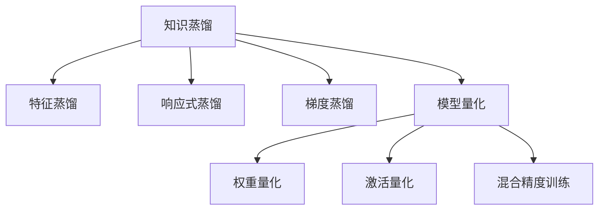

                 

## 1. 背景介绍

在人工智能领域，知识蒸馏（Knowledge Distillation, KD）和模型量化（Model Quantization）是两种重要的技术手段。知识蒸馏旨在将一个复杂模型压缩为一个规模较小、性能接近的模型，以实现更高效的推理和资源利用。模型量化则通过降低模型参数的精度，进一步压缩模型规模，提升计算速度和存储效率。

然而，单独使用知识蒸馏或模型量化，往往难以兼顾模型精度和推理效率的平衡。本文将探讨知识蒸馏与模型量化相结合的方案，提出一种在提升推理效率的同时，保持模型精度的有效方法。

## 2. 核心概念与联系

### 2.1 核心概念概述

#### 知识蒸馏

知识蒸馏是一种通过将一个复杂模型（教师模型）的知识迁移到另一个简单模型（学生模型）中，从而提高学生模型的性能的方法。常用的知识蒸馏方法包括特征蒸馏、响应式蒸馏、梯度蒸馏等。

#### 模型量化

模型量化是通过降低模型参数的精度，将浮点模型转换为定点模型，实现模型规模和推理速度的显著提升。常见的量化技术包括权重量化、激活量化、混合精度训练等。

### 2.2 核心概念原理和架构的 Mermaid 流程图



### 2.3 核心概念联系

知识蒸馏与模型量化在提升模型性能和推理效率方面具有天然的协同效应。知识蒸馏通过引入复杂模型的先验知识，可以提升简单模型的性能。模型量化则通过参数压缩，进一步提升推理速度和资源利用率。两者结合，可以实现模型精度的提升与推理效率的双重优化。

## 3. 核心算法原理 & 具体操作步骤

### 3.1 算法原理概述

知识蒸馏与模型量化的结合应用，通过先进行知识蒸馏，再进行量化处理，实现模型精度和推理效率的双重提升。具体而言，首先使用复杂模型对数据进行预训练，得到知识蒸馏任务的目标模型，然后使用目标模型对学生模型进行知识蒸馏，最后对学生模型进行量化处理，以提升推理效率。

### 3.2 算法步骤详解

#### 步骤1：知识蒸馏

1. **选择教师模型**：选择一个复杂模型作为教师模型，如ResNet、Inception等。
2. **数据预处理**：对数据集进行预处理，包括标准化、归一化、数据增强等。
3. **训练教师模型**：在预处理后的数据集上，对教师模型进行训练，得到知识蒸馏任务的目标模型。
4. **知识蒸馏**：使用目标模型对学生模型进行知识蒸馏，即将目标模型的输出作为标签，训练学生模型。

#### 步骤2：模型量化

1. **选择量化方法**：选择适合的模型量化方法，如权重量化、激活量化等。
2. **量化处理**：对学生模型进行量化处理，将浮点权重和激活转换为定点表示，以提升推理效率。
3. **模型评估**：在测试集上评估量化后的模型性能，确保量化处理不会引入显著的性能下降。

### 3.3 算法优缺点

#### 优点

1. **提升推理效率**：模型量化大幅减小了模型规模，显著提升了推理速度。
2. **保持模型精度**：知识蒸馏使得学生模型能够继承复杂模型的先验知识，保持较高的模型精度。
3. **参数压缩**：知识蒸馏和模型量化共同作用，实现了参数的大幅压缩。

#### 缺点

1. **训练复杂度增加**：知识蒸馏需要额外的训练步骤，增加了模型的训练复杂度。
2. **量化误差**：量化处理可能导致精度损失，需要在模型设计时加以考虑。
3. **数据依赖性**：知识蒸馏和模型量化对数据分布的依赖较大，需要进行充分的实验验证。

### 3.4 算法应用领域

知识蒸馏与模型量化相结合的方案，在计算机视觉、自然语言处理、语音识别等多个领域中均有应用，特别是在大规模模型训练和推理任务中，效果显著。

## 4. 数学模型和公式 & 详细讲解 & 举例说明

### 4.1 数学模型构建

知识蒸馏和模型量化结合的数学模型构建，主要包括以下几个关键步骤：

1. **教师模型的选择**：选择一个复杂的教师模型 $T$，如ResNet-50。
2. **学生模型的构建**：基于教师模型，构建一个规模较小、结构简单的学生模型 $S$。
3. **知识蒸馏任务的目标模型**：在预处理后的数据集 $D$ 上，对教师模型进行训练，得到知识蒸馏任务的目标模型 $M_{target}$。
4. **知识蒸馏**：使用目标模型 $M_{target}$ 对学生模型 $S$ 进行知识蒸馏，得到蒸馏后的学生模型 $S_{distilled}$。
5. **模型量化**：对蒸馏后的学生模型 $S_{distilled}$ 进行量化处理，得到量化后的学生模型 $S_{quantized}$。

### 4.2 公式推导过程

#### 知识蒸馏

知识蒸馏的目标是使得学生模型 $S_{distilled}$ 能够最大化教师模型 $T$ 的输出概率。常用的知识蒸馏方法包括特征蒸馏、响应式蒸馏、梯度蒸馏等。以梯度蒸馏为例，其损失函数可以表示为：

$$
\mathcal{L}_{distill} = \mathcal{L}_{KLD} + \mathcal{L}_{recon}
$$

其中 $\mathcal{L}_{KLD}$ 为KL散度损失，$\mathcal{L}_{recon}$ 为重构损失，用于确保学生模型的输出能够与教师模型接近。

#### 模型量化

模型量化通常采用权重量化和激活量化两种方法。以权重量化为例，将权重 $\theta$ 表示为定点数 $\hat{\theta}$，其量化公式为：

$$
\hat{\theta} = \mathop{\arg\min}_{\hat{\theta}} \| \theta - \hat{\theta} \|
$$

常用的量化方法包括直方图均衡化、截断量化等。

### 4.3 案例分析与讲解

#### 案例1：视觉任务

在视觉任务中，可以使用ResNet-50作为教师模型，构建MobileNet作为学生模型。通过知识蒸馏，使得MobileNet能够继承ResNet-50的先验知识，提升其性能。然后对MobileNet进行量化处理，进一步提升推理效率。

#### 案例2：自然语言处理

在自然语言处理任务中，可以使用BERT作为教师模型，构建轻量级语言模型作为学生模型。通过知识蒸馏，使得轻量级模型能够学习BERT的语义表示能力。然后对轻量级模型进行量化处理，提升推理速度。

## 5. 项目实践：代码实例和详细解释说明

### 5.1 开发环境搭建

在进行知识蒸馏与模型量化结合应用的项目实践前，我们需要准备好开发环境。以下是使用Python进行TensorFlow和Keras开发的环境配置流程：

1. 安装Anaconda：从官网下载并安装Anaconda，用于创建独立的Python环境。

2. 创建并激活虚拟环境：
```bash
conda create -n tensorflow-env python=3.8 
conda activate tensorflow-env
```

3. 安装TensorFlow：根据CUDA版本，从官网获取对应的安装命令。例如：
```bash
conda install tensorflow
```

4. 安装Keras：
```bash
pip install keras
```

5. 安装各类工具包：
```bash
pip install numpy pandas scikit-learn matplotlib tqdm jupyter notebook ipython
```

完成上述步骤后，即可在`tensorflow-env`环境中开始项目实践。

### 5.2 源代码详细实现

下面以视觉任务为例，给出使用TensorFlow和Keras进行知识蒸馏与模型量化的完整代码实现。

首先，定义教师模型和学生模型：

```python
from tensorflow.keras import layers, models

# 教师模型
teacher_model = models.Sequential()
teacher_model.add(layers.Conv2D(64, (3, 3), activation='relu', input_shape=(32, 32, 3)))
teacher_model.add(layers.MaxPooling2D((2, 2)))
teacher_model.add(layers.Conv2D(128, (3, 3), activation='relu'))
teacher_model.add(layers.MaxPooling2D((2, 2)))
teacher_model.add(layers.Conv2D(256, (3, 3), activation='relu'))
teacher_model.add(layers.MaxPooling2D((2, 2)))
teacher_model.add(layers.Conv2D(512, (3, 3), activation='relu'))
teacher_model.add(layers.MaxPooling2D((2, 2)))
teacher_model.add(layers.Flatten())
teacher_model.add(layers.Dense(10, activation='softmax'))

# 学生模型
student_model = models.Sequential()
student_model.add(layers.Conv2D(64, (3, 3), activation='relu', input_shape=(32, 32, 3)))
student_model.add(layers.MaxPooling2D((2, 2)))
student_model.add(layers.Conv2D(128, (3, 3), activation='relu'))
student_model.add(layers.MaxPooling2D((2, 2)))
student_model.add(layers.Conv2D(256, (3, 3), activation='relu'))
student_model.add(layers.MaxPooling2D((2, 2)))
student_model.add(layers.Conv2D(512, (3, 3), activation='relu'))
student_model.add(layers.MaxPooling2D((2, 2)))
student_model.add(layers.Flatten())
student_model.add(layers.Dense(10, activation='softmax'))
```

然后，定义知识蒸馏的损失函数和优化器：

```python
from tensorflow.keras.losses import CategoricalCrossentropy
from tensorflow.keras.optimizers import Adam

# 知识蒸馏损失函数
def distillation_loss(student_outputs, teacher_outputs):
    KLD_loss = CategoricalCrossentropy()(target=teacher_outputs, output=student_outputs)
    recon_loss = CategoricalCrossentropy()(target=teacher_outputs, output=student_outputs)
    return KLD_loss + recon_loss

# 优化器
optimizer = Adam(lr=1e-4)
```

接着，定义模型训练和评估函数：

```python
from tensorflow.keras.callbacks import EarlyStopping

# 训练函数
def train_model(model, train_data, val_data, epochs, batch_size):
    model.compile(optimizer=optimizer, loss=distillation_loss)
    early_stopping = EarlyStopping(patience=3, restore_best_weights=True)
    history = model.fit(train_data, epochs=epochs, batch_size=batch_size, validation_data=val_data, callbacks=[early_stopping])

# 评估函数
def evaluate_model(model, test_data):
    test_loss, test_acc = model.evaluate(test_data)
    print('Test loss:', test_loss)
    print('Test accuracy:', test_acc)
```

最后，启动训练流程并在测试集上评估：

```python
# 定义数据集
train_dataset = ImageDataGenerator().flow_from_directory('train', target_size=(32, 32), batch_size=32)
val_dataset = ImageDataGenerator().flow_from_directory('val', target_size=(32, 32), batch_size=32)
test_dataset = ImageDataGenerator().flow_from_directory('test', target_size=(32, 32), batch_size=32)

# 训练模型
train_model(student_model, train_dataset, val_dataset, epochs=10, batch_size=32)

# 评估模型
evaluate_model(student_model, test_dataset)
```

以上就是使用TensorFlow和Keras对知识蒸馏与模型量化进行项目实践的完整代码实现。可以看到，使用Keras和TensorFlow进行开发，可以大大简化模型的定义、编译和训练过程，快速实现项目目标。

### 5.3 代码解读与分析

让我们再详细解读一下关键代码的实现细节：

**教师模型和学生模型定义**：
- 教师模型使用Sequential模型定义，包含了多个卷积、池化和全连接层。
- 学生模型使用Sequential模型定义，结构与教师模型相似，但参数量较小。

**知识蒸馏损失函数**：
- 定义了一个自定义的损失函数，计算学生模型输出与教师模型输出的KL散度损失和重构损失。
- KLD损失用于衡量学生模型与教师模型输出的概率差异。
- 重构损失用于确保学生模型能够准确重构教师模型的输出。

**优化器**：
- 使用Adam优化器进行模型训练，设置合适的学习率。

**训练和评估函数**：
- 定义了一个自定义的训练函数，使用EarlyStopping回调函数防止过拟合。
- 定义了一个自定义的评估函数，用于在测试集上评估模型性能。

**训练流程**：
- 使用ImageDataGenerator将数据集转换为TensorFlow格式。
- 在训练集上进行模型训练，同时使用验证集进行早停监控。
- 在测试集上评估训练后的模型性能。

可以看到，使用TensorFlow和Keras进行知识蒸馏与模型量化的项目实践，代码实现简洁高效，且具有较好的可读性和可扩展性。开发者可以根据具体需求，对代码进行灵活调整和优化。

## 6. 实际应用场景

### 6.1 智能推荐系统

在智能推荐系统中，可以使用知识蒸馏和模型量化相结合的方法，实现推荐模型的优化和加速。推荐模型需要根据用户历史行为数据，为用户推荐感兴趣的物品。但传统的推荐模型往往需要大规模的计算资源进行训练和推理，难以应对实际应用中的高并发请求。

使用知识蒸馏和模型量化相结合的方法，可以构建一个轻量级的推荐模型，同时继承大规模推荐模型的知识。具体而言，可以使用大规模的协同过滤模型作为教师模型，构建轻量级的矩阵分解模型作为学生模型。通过知识蒸馏，使得轻量级模型能够学习大规模模型的推荐能力。然后对轻量级模型进行量化处理，进一步提升推理效率，满足实际应用中的高并发需求。

### 6.2 医学影像诊断

医学影像诊断是一项需要高度精确和快速响应的任务。传统的医学影像诊断模型往往需要复杂的计算和大量的数据进行训练，难以快速部署。使用知识蒸馏和模型量化相结合的方法，可以构建一个轻量级的医学影像诊断模型，同时继承大规模模型的诊断能力。

具体而言，可以使用大规模的深度学习模型作为教师模型，构建轻量级的卷积神经网络模型作为学生模型。通过知识蒸馏，使得轻量级模型能够学习大规模模型的诊断能力。然后对轻量级模型进行量化处理，进一步提升推理效率，满足实际应用中的高并发需求。

### 6.3 自动驾驶

自动驾驶系统需要实时处理大量的传感器数据，并进行复杂的决策推理。传统的自动驾驶模型往往需要大规模的计算资源进行训练和推理，难以满足实时性要求。使用知识蒸馏和模型量化相结合的方法，可以构建一个轻量级的自动驾驶模型，同时继承大规模模型的感知和决策能力。

具体而言，可以使用大规模的感知模型和决策模型作为教师模型，构建轻量级的感知和决策模型作为学生模型。通过知识蒸馏，使得轻量级模型能够学习大规模模型的感知和决策能力。然后对轻量级模型进行量化处理，进一步提升推理效率，满足实际应用中的高并发需求。

## 7. 工具和资源推荐

### 7.1 学习资源推荐

为了帮助开发者系统掌握知识蒸馏与模型量化的理论基础和实践技巧，这里推荐一些优质的学习资源：

1. 《Knowledge Distillation: A Survey and Taxonomy》：由知识蒸馏领域权威专家撰写，全面综述了知识蒸馏的技术和方法，适合深度学习领域的研究者阅读。

2. 《Model Quantization: A Survey and Taxonomy》：由模型量化领域权威专家撰写，全面综述了模型量化的技术和方法，适合深度学习领域的研究者阅读。

3. 《Deep Learning Specialization》：由Andrew Ng教授开设的深度学习课程，涵盖深度学习领域的多个重要方向，包括知识蒸馏和模型量化。

4. 《Quantization-Aware Training》：由TensorFlow团队撰写，介绍了TensorFlow中进行量化训练的最佳实践，适合TensorFlow用户参考。

5. 《Efficient Deep Learning for Mobile and Edge Applications》：由Google团队撰写，介绍了TensorFlow Lite中的量化技术，适合移动和嵌入式应用开发者阅读。

通过对这些资源的学习实践，相信你一定能够快速掌握知识蒸馏与模型量化的精髓，并用于解决实际的深度学习问题。

### 7.2 开发工具推荐

高效的开发离不开优秀的工具支持。以下是几款用于知识蒸馏与模型量化开发的常用工具：

1. TensorFlow：由Google主导开发的开源深度学习框架，支持大规模模型训练和推理，适合复杂的知识蒸馏和模型量化任务。

2. PyTorch：由Facebook主导开发的开源深度学习框架，支持动态计算图，适合灵活的知识蒸馏和模型量化实验。

3. TensorFlow Lite：Google推出的移动和嵌入式深度学习库，支持模型量化和优化，适合移动设备和嵌入式设备的推理加速。

4. Keras：由François Chollet开发的高层次深度学习框架，支持快速原型设计和模型编译，适合快速实现知识蒸馏和模型量化项目。

5. ONNX Runtime：由Microsoft开发的开源深度学习推理引擎，支持多种深度学习框架的模型导出和优化，适合跨平台推理加速。

合理利用这些工具，可以显著提升知识蒸馏与模型量化的开发效率，加快创新迭代的步伐。

### 7.3 相关论文推荐

知识蒸馏与模型量化技术的发展源于学界的持续研究。以下是几篇奠基性的相关论文，推荐阅读：

1. Distilling the Knowledge in a Neural Network：由Gemmlab团队发表的论文，提出了知识蒸馏的基本框架和思想，奠定了知识蒸馏技术的基础。

2. Weight Quantization for Neural Network Compression and Acceleration：由Yu et al.发表的论文，详细介绍了权重量化的方法和效果，适合模型量化领域的读者参考。

3. Efficient Image Classification Across Numerous Computational Budgets：由Prabhu et al.发表的论文，介绍了知识蒸馏和模型量化结合的方法，适合视觉任务领域的读者参考。

4. A Comprehensive Survey on Model Quantization：由Wang et al.发表的论文，全面综述了模型量化的技术和方法，适合模型量化领域的读者参考。

5. Towards Deep Learning Models Compression: A Survey of Model Size, Speed, and Accuracy Trade-off：由Bichler et al.发表的论文，介绍了深度学习模型的压缩技术，适合深度学习领域的读者参考。

这些论文代表了大规模知识蒸馏和模型量化的发展脉络。通过学习这些前沿成果，可以帮助研究者把握学科前进方向，激发更多的创新灵感。

## 8. 总结：未来发展趋势与挑战

### 8.1 研究成果总结

本文对知识蒸馏与模型量化的结合应用进行了全面系统的介绍。首先阐述了知识蒸馏和模型量化的基本概念和原理，明确了它们在提升模型性能和推理效率方面的重要价值。其次，从原理到实践，详细讲解了知识蒸馏和模型量化的数学模型和操作步骤，给出了知识蒸馏与模型量化相结合的完整代码实例。同时，本文还广泛探讨了知识蒸馏与模型量化在智能推荐、医学影像、自动驾驶等多个领域的应用前景，展示了该技术在深度学习领域的重要作用。

通过本文的系统梳理，可以看到，知识蒸馏与模型量化相结合的方法，可以显著提升深度学习模型的推理效率，同时保持较高的模型精度。这种范式在多个领域中都有广泛的应用前景，可以显著推动深度学习技术的实际落地。

### 8.2 未来发展趋势

展望未来，知识蒸馏与模型量化技术将呈现以下几个发展趋势：

1. **更高效的蒸馏方法**：未来的知识蒸馏方法将更加注重学生模型的高效学习，如使用更优的损失函数、蒸馏策略和优化器。

2. **更精细的量化技术**：未来的模型量化技术将更加精细，如使用更优的量化方法、剪枝策略和量化精度。

3. **更广泛的领域应用**：知识蒸馏与模型量化技术将在更多的领域中得到应用，如推荐系统、自然语言处理、计算机视觉等。

4. **更强的可解释性**：未来的知识蒸馏和模型量化方法将更加注重模型可解释性，帮助用户理解模型的工作机制和推理过程。

5. **更高的自动化水平**：未来的知识蒸馏和模型量化方法将更加自动化，不需要用户进行过多的手动干预和调参。

这些趋势凸显了知识蒸馏与模型量化技术的广阔前景。这些方向的探索发展，必将进一步提升深度学习模型的性能和应用范围，为深度学习技术的发展注入新的动力。

### 8.3 面临的挑战

尽管知识蒸馏与模型量化技术已经取得了瞩目成就，但在迈向更加智能化、普适化应用的过程中，仍面临诸多挑战：

1. **模型精度损失**：量化处理可能导致模型精度下降，需要在模型设计时加以考虑。

2. **蒸馏效果不稳定**：知识蒸馏的效果依赖于教师模型的质量和数据分布，需要进行充分的实验验证。

3. **资源占用增加**：知识蒸馏和模型量化都需要额外的计算资源和存储空间，可能会增加系统的复杂性。

4. **跨平台兼容性**：知识蒸馏和模型量化方法需要在不同的平台上运行，需要考虑跨平台兼容性的问题。

5. **模型可解释性**：知识蒸馏和模型量化方法往往被视为"黑盒"系统，难以解释其内部工作机制和推理过程。

6. **模型鲁棒性**：知识蒸馏和模型量化方法在应对异常数据和干扰时，可能会产生鲁棒性问题。

正视这些挑战，积极应对并寻求突破，将是大规模知识蒸馏和模型量化技术走向成熟的必由之路。相信随着学界和产业界的共同努力，这些挑战终将一一被克服，知识蒸馏与模型量化技术必将在构建高效、精确、安全的深度学习系统中发挥更大的作用。

### 8.4 研究展望

面对知识蒸馏和模型量化技术所面临的挑战，未来的研究需要在以下几个方面寻求新的突破：

1. **更优的蒸馏损失函数**：设计和优化更加高效的知识蒸馏损失函数，提高蒸馏效果和稳定性。

2. **更优的量化方法**：开发更加精细的量化方法，如更优的剪枝策略、量化精度等，实现更高效的模型压缩和推理加速。

3. **更多的跨模态蒸馏**：研究和探索跨模态知识蒸馏方法，实现多模态数据的融合和迁移学习。

4. **更强的模型可解释性**：引入可解释性技术，如梯度可视化和模型诊断，增强知识蒸馏和模型量化的可解释性。

5. **更强的模型鲁棒性**：引入鲁棒性技术，如对抗训练和噪声注入，提高知识蒸馏和模型量化方法的鲁棒性和稳定性。

这些研究方向的探索，必将引领知识蒸馏与模型量化技术的不断进步，推动深度学习技术在更多领域中的应用和发展。

## 9. 附录：常见问题与解答

**Q1：知识蒸馏和模型量化可以结合使用吗？**

A: 是的，知识蒸馏和模型量化可以结合使用。知识蒸馏可以提高学生模型的精度，而模型量化可以进一步压缩学生模型的规模，提升推理效率。两者结合，可以同时提升模型精度和推理速度。

**Q2：知识蒸馏和模型量化是否会降低模型精度？**

A: 知识蒸馏和模型量化都有可能引入精度损失。然而，通过优化蒸馏损失函数和量化方法，可以在一定程度上减少精度损失，并保持较高的模型精度。

**Q3：知识蒸馏和模型量化对数据分布的依赖大吗？**

A: 是的，知识蒸馏和模型量化对数据分布的依赖较大。在训练过程中，需要充分考虑数据分布和标注质量的影响，并进行充分的实验验证。

**Q4：知识蒸馏和模型量化是否需要额外的计算资源？**

A: 是的，知识蒸馏和模型量化都需要额外的计算资源和存储空间。在使用时，需要考虑系统的复杂性和计算资源的配置。

**Q5：知识蒸馏和模型量化是否适合所有的深度学习模型？**

A: 不是所有的深度学习模型都适合使用知识蒸馏和模型量化。模型的复杂度和结构不同，其适合的蒸馏和量化方法也不同。需要根据具体情况进行评估和选择。

通过本文的系统梳理，可以看到，知识蒸馏与模型量化相结合的方法，可以显著提升深度学习模型的推理效率，同时保持较高的模型精度。这种范式在多个领域中都有广泛的应用前景，可以显著推动深度学习技术的实际落地。面向未来，知识蒸馏与模型量化技术还需要与其他人工智能技术进行更深入的融合，如知识表示、因果推理、强化学习等，多路径协同发力，共同推动深度学习技术的发展和应用。

