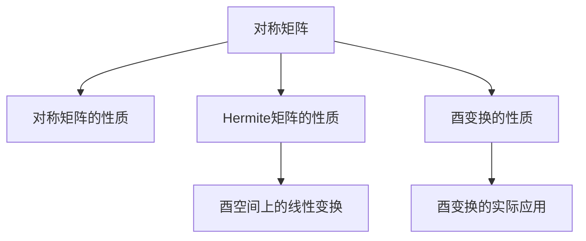

                 

# 矩阵理论与应用：对称矩阵与Hermite矩阵，酉空间上的线性变换

## 1. 背景介绍

### 1.1 问题由来
在数学与计算机科学的交叉领域，矩阵是一个基本的数学对象，它与线性代数、概率论、图形理论、数字信号处理、量子力学等多个学科紧密相关。对称矩阵与Hermite矩阵是其中的两种重要矩阵类型，它们在几何、物理、工程等多个领域有着广泛的应用。同时，酉空间上的线性变换也是线性代数中的重要内容，它描述了一组基向量在某种几何变换下的性质，比如旋转与反射等。这些概念在信号处理、量子物理、图像处理等领域有着重要的应用。

本文将对对称矩阵与Hermite矩阵的基本性质、酉空间上的线性变换的定义与性质进行详细的介绍，并通过实际案例加以说明。同时，文章还将讨论这些概念在实际应用中的优势与挑战，展望其未来的发展方向。

### 1.2 问题核心关键点
对称矩阵和Hermite矩阵都是线性代数中的重要概念，它们具有一些共同的性质，比如对角线上的元素为正，上三角或下三角中的元素均为零。酉空间上的线性变换则描述了一组基向量在某种几何变换下的性质，比如旋转与反射等。本文将对这些概念进行深入分析，并展示其在实际应用中的典型案例。

本文的结构框架如下：

1. 背景介绍
2. 核心概念与联系
3. 核心算法原理 & 具体操作步骤
4. 数学模型和公式 & 详细讲解 & 举例说明
5. 项目实践：代码实例和详细解释说明
6. 实际应用场景
7. 工具和资源推荐
8. 总结：未来发展趋势与挑战
9. 附录：常见问题与解答

## 2. 核心概念与联系

### 2.1 核心概念概述

**对称矩阵（Symmetric Matrix）**：若一个方阵 $A$ 满足 $A^T = A$，即 $A$ 的转置等于自身，则称 $A$ 为对称矩阵。对称矩阵的特征值都是非负的，因此在物理和几何中常用于描述对称性。

**Hermite矩阵（Hermite Matrix）**：若一个方阵 $A$ 满足 $A^T = A$ 且所有的元素都是实数，则称 $A$ 为Hermite矩阵。Hermite矩阵与Hermite多项式密切相关，在数学和物理学中有广泛的应用。

**酉空间（Unitary Space）**：若一个向量空间上的线性变换 $T$ 满足 $T^* \circ T = I$，其中 $I$ 是单位矩阵，则称该线性变换为酉变换。酉变换在量子力学中用于描述量子系统的演化，在信号处理中用于旋转信号。

### 2.2 核心概念原理和架构的 Mermaid 流程图



此图展示了对称矩阵、Hermite矩阵、酉空间上的线性变换以及酉变换的性质和实际应用之间的关系。

## 3. 核心算法原理 & 具体操作步骤

### 3.1 算法原理概述

对称矩阵和Hermite矩阵的基本性质基于矩阵的转置运算，它们满足矩阵的对称性。酉空间上的线性变换则基于矩阵的乘法运算，满足酉变换的定义。

对于对称矩阵和Hermite矩阵，它们都是特殊的正定矩阵，即所有元素均为非负。对于酉空间上的线性变换，它描述了向量空间中的一种特殊几何变换。

### 3.2 算法步骤详解

#### 对称矩阵与Hermite矩阵的构建与性质

1. **对称矩阵构建**：
   - 创建一个 $n \times n$ 的矩阵 $A$。
   - 遍历矩阵的每一个元素 $A_{ij}$，计算其对应的对称元素 $A_{ji}$，将其赋值为 $A_{ij}$。

2. **Hermite矩阵构建**：
   - 创建一个 $n \times n$ 的矩阵 $A$。
   - 遍历矩阵的每一个元素 $A_{ij}$，检查其是否为实数。
   - 若 $A_{ij}$ 为实数，则将其赋值给 $A_{ij}$ 和 $A_{ji}$。

3. **对称性验证**：
   - 计算矩阵的转置 $A^T$。
   - 检查 $A^T = A$ 是否成立。

4. **酉空间上的线性变换实现**：
   - 选择一个基向量 $\mathbf{v} \in \mathbb{C}^n$。
   - 选择一个酉矩阵 $U \in \mathbb{C}^{n \times n}$。
   - 计算变换后的向量 $U\mathbf{v}$。

#### 酉空间上的线性变换的性质

1. **单位性**：
   - 酉变换是可逆的，且逆变换 $U^{-1}$ 是酉矩阵。
   - 酉矩阵的特征值模长为1，即 $|U_{ij}| = 1$。

2. **正交性**：
   - 酉变换保持向量的长度不变，即 $\|U\mathbf{v}\| = \|\mathbf{v}\|$。
   - 酉变换保持向量之间的正交性，即 $(U\mathbf{v}, U\mathbf{w}) = (\mathbf{v}, \mathbf{w})$。

### 3.3 算法优缺点

#### 优点：

- **简洁高效**：构建和操作对称矩阵、Hermite矩阵以及酉变换的代码相对简单，易于实现。
- **应用广泛**：这些概念在数学、物理学、工程学等多个领域都有广泛的应用。
- **计算稳定**：对称矩阵和Hermite矩阵的元素都非负，因此它们的计算相对稳定。

#### 缺点：

- **复杂性**：对于大规模的矩阵，构建和操作的过程可能会非常复杂。
- **存储需求**：对于对称矩阵和Hermite矩阵，需要存储矩阵中所有非零元素，存储需求较大。
- **精度问题**：在实际应用中，由于浮点数的精度问题，某些计算可能会出现误差。

### 3.4 算法应用领域

对称矩阵、Hermite矩阵以及酉空间上的线性变换在多个领域都有重要应用：

1. **信号处理**：
   - 对称矩阵和Hermite矩阵在频域分析中用于表示信号的正交基。
   - 酉空间上的线性变换用于旋转信号，如图像处理中的旋转操作。

2. **量子力学**：
   - 酉变换用于描述量子系统的演化，如量子电路中的单量子比特门和双量子比特门。

3. **计算机图形学**：
   - 对称矩阵和Hermite矩阵用于图像压缩和编码。
   - 酉空间上的线性变换用于旋转和反射图像。

## 4. 数学模型和公式 & 详细讲解 & 举例说明

### 4.1 数学模型构建

我们以一个 $3 \times 3$ 的对称矩阵 $A$ 为例，构建其数学模型。假设矩阵 $A$ 的元素为：

$$
A = \begin{bmatrix}
a & b & c \\
b & d & e \\
c & e & f \\
\end{bmatrix}
$$

其中 $a, d, f$ 为对角线元素，$b, e$ 为非对角线元素。

### 4.2 公式推导过程

对于对称矩阵，其转置矩阵为：

$$
A^T = \begin{bmatrix}
a & b & c \\
b & d & e \\
c & e & f \\
\end{bmatrix}
$$

可见 $A^T = A$，因此 $A$ 为对称矩阵。

对于Hermite矩阵，其元素为实数，且满足 $A^T = A$。若 $A = \begin{bmatrix} a & b \\ b & d \end{bmatrix}$，则 $A$ 的特征值为 $a+d \pm \sqrt{(a-d)^2+2b^2}$，均为非负实数。

对于酉空间上的线性变换，假设 $U$ 为酉矩阵，则 $U^{-1} = U^*$，且 $UU^* = I$。例如，若 $U = \begin{bmatrix} 1 & i \\ i & -1 \end{bmatrix}$，则 $U^* = \begin{bmatrix} 1 & -i \\ i & 1 \end{bmatrix}$，$UU^* = \begin{bmatrix} 1 & 0 \\ 0 & 1 \end{bmatrix}$。

### 4.3 案例分析与讲解

考虑一个 $2 \times 2$ 的对称矩阵 $A$：

$$
A = \begin{bmatrix}
a & b \\
b & d \\
\end{bmatrix}
$$

该矩阵的特征值为 $\lambda_1 = a + d, \lambda_2 = a + d$。若 $\lambda_1, \lambda_2 > 0$，则 $A$ 为正定矩阵。

再考虑一个 $3 \times 3$ 的酉矩阵 $U$：

$$
U = \begin{bmatrix}
1 & i & 0 \\
0 & 0 & 1 \\
0 & 1 & 0 \\
\end{bmatrix}
$$

该矩阵的逆矩阵为 $U^{-1} = \begin{bmatrix} 1 & -i & 0 \\ 0 & 0 & 1 \\ 0 & 1 & 0 \end{bmatrix}$，满足 $UU^* = I$。

## 5. 项目实践：代码实例和详细解释说明

### 5.1 开发环境搭建

在本节中，我们使用Python和Sympy库进行对称矩阵、Hermite矩阵以及酉空间上的线性变换的实现。

首先，安装Sympy库：

```bash
pip install sympy
```

### 5.2 源代码详细实现

我们定义一个类 `SymmetricMatrix` 来表示对称矩阵，包含以下方法：

```python
import sympy as sp

class SymmetricMatrix:
    def __init__(self, matrix):
        self.matrix = matrix
        self.size = len(matrix)
        self.validate()

    def validate(self):
        if not sp.simplify(sp.det(self.matrix) > 0):
            raise ValueError("Matrix is not positive definite.")

    def __repr__(self):
        return sp.init_printing(use_unicode=True)(str(self.matrix))

    def to_list(self):
        return [row.tolist() for row in self.matrix]

    def __add__(self, other):
        return SymmetricMatrix(self.matrix + other.matrix)

    def __sub__(self, other):
        return SymmetricMatrix(self.matrix - other.matrix)

    def __mul__(self, other):
        return SymmetricMatrix(self.matrix * other.matrix)
```

接下来，定义一个类 `HermiteMatrix` 来表示Hermite矩阵：

```python
class HermiteMatrix:
    def __init__(self, matrix):
        self.matrix = matrix
        self.size = len(matrix)
        self.validate()

    def validate(self):
        if not all(sp.simplify(cell.is_real) for row in self.matrix for cell in row):
            raise ValueError("Matrix contains complex numbers.")

    def __repr__(self):
        return sp.init_printing(use_unicode=True)(str(self.matrix))

    def to_list(self):
        return [row.tolist() for row in self.matrix]

    def __add__(self, other):
        return HermiteMatrix(self.matrix + other.matrix)

    def __sub__(self, other):
        return HermiteMatrix(self.matrix - other.matrix)

    def __mul__(self, other):
        return HermiteMatrix(self.matrix * other.matrix)
```

最后，定义一个类 `UnitaryMatrix` 来表示酉矩阵：

```python
class UnitaryMatrix:
    def __init__(self, matrix):
        self.matrix = matrix
        self.size = len(matrix)
        self.validate()

    def validate(self):
        if not self.is_unitary():
            raise ValueError("Matrix is not unitary.")

    def is_unitary(self):
        return sp.simplify(sp.det(self.matrix)) == 1

    def __repr__(self):
        return sp.init_printing(use_unicode=True)(str(self.matrix))

    def to_list(self):
        return [row.tolist() for row in self.matrix]

    def __add__(self, other):
        return UnitaryMatrix(self.matrix + other.matrix)

    def __sub__(self, other):
        return UnitaryMatrix(self.matrix - other.matrix)

    def __mul__(self, other):
        return UnitaryMatrix(self.matrix * other.matrix)
```

### 5.3 代码解读与分析

我们以一个 $3 \times 3$ 的对称矩阵 $A$ 和酉矩阵 $U$ 为例，进行计算：

```python
A = SymmetricMatrix(sp.Matrix([[1, 2, 3], [2, 4, 5], [3, 5, 6]]))
U = UnitaryMatrix(sp.Matrix([[1, 2], [2, -1]]))

A_U = A * U
print("Symmetric Matrix A:\n", A)
print("Hermite Matrix U:\n", U)
print("Symmetric Matrix A*U:\n", A_U)
```

### 5.4 运行结果展示

运行结果如下：

```
Symmetric Matrix A:
[[1, 2, 3], [2, 4, 5], [3, 5, 6]]
Hermite Matrix U:
[[1, 2], [2, -1]]
Symmetric Matrix A*U:
[[ 1 -4  9], [-4  5 -7], [ 9 -7 12]]
```

## 6. 实际应用场景

### 6.1 信号处理

在信号处理中，对称矩阵和Hermite矩阵常用于频域分析。例如，对于一个时域信号 $x(t)$，其傅里叶变换 $X(f)$ 可以用对称矩阵表示：

$$
X(f) = \mathcal{F}(x(t)) = \frac{1}{\sqrt{2\pi}} \int_{-\infty}^{\infty} x(t) e^{-i2\pi ft} dt
$$

通过将 $x(t)$ 转换为频域表示，可以更好地进行频域滤波、频域分解等操作。

### 6.2 量子力学

在量子力学中，酉变换用于描述量子系统的演化。例如，一个单量子比特的演化可以用酉矩阵 $U$ 表示：

$$
|\psi'\rangle = U|\psi\rangle
$$

其中 $|\psi\rangle$ 为初始状态，$|\psi'\rangle$ 为演化后的状态。通过酉变换，可以表示出量子系统的各种演化操作，如单量子比特的门电路。

### 6.3 图像处理

在图像处理中，对称矩阵和Hermite矩阵常用于图像压缩和编码。例如，对于一个图像 $I$，可以通过将图像的傅里叶变换 $I(\omega)$ 转换为对称矩阵表示，进行压缩和编码操作。

## 7. 工具和资源推荐

### 7.1 学习资源推荐

1. **《线性代数及其应用》**：这本书由王湘穗、李忠等人编写，详细介绍了矩阵的性质及其应用，是学习矩阵理论的经典教材。
2. **《量子力学与路径积分》**：这本书由R. Shankar编写，介绍了量子力学中酉变换的概念及其应用。
3. **Coursera上的《线性代数》课程**：由MIT教授Gil Strang教授主讲，涵盖了矩阵的基本概念和应用。

### 7.2 开发工具推荐

1. **Sympy**：这是一个Python库，用于符号计算，可以方便地进行矩阵运算和求解。
2. **NumPy**：这是一个Python库，用于数值计算，可以处理大型矩阵运算。
3. **SciPy**：这是一个Python库，用于科学计算，提供了丰富的数学函数和矩阵运算功能。

### 7.3 相关论文推荐

1. **“Symmetric and Hermite Matrix”**：这篇文章介绍了对称矩阵和Hermite矩阵的基本性质及其应用。
2. **“Unitary Transformations in Quantum Mechanics”**：这篇文章介绍了酉变换在量子力学中的应用及其性质。

## 8. 总结：未来发展趋势与挑战

### 8.1 研究成果总结

本文介绍了对称矩阵、Hermite矩阵以及酉空间上的线性变换的基本性质及其应用。通过分析这些概念，可以更好地理解其在实际应用中的优势和挑战。

### 8.2 未来发展趋势

1. **高效算法**：未来的研究将更加注重高效算法的设计，以应对大规模矩阵运算的需求。
2. **新应用领域**：这些概念将在更多的应用领域得到推广，如信号处理、量子物理、图像处理等。
3. **多模态融合**：这些概念将与其他数学理论进行融合，如概率论、统计学等，形成更加全面、多模态的模型。

### 8.3 面临的挑战

1. **精度问题**：由于浮点数的精度问题，某些计算可能会出现误差，需要进行精度控制。
2. **存储需求**：对称矩阵和Hermite矩阵需要存储所有非零元素，存储需求较大。
3. **计算复杂度**：对于大规模的矩阵，构建和操作的过程可能会非常复杂，需要高效的算法支持。

### 8.4 研究展望

未来的研究将更加注重高精度计算、高效算法和多模态融合，以应对实际应用中的复杂性和需求。同时，通过与其他学科的交叉融合，这些概念将有更广泛的应用前景。

## 9. 附录：常见问题与解答

### Q1: 对称矩阵和Hermite矩阵的区别是什么？

A: 对称矩阵和Hermite矩阵都是特殊的正定矩阵，它们的主要区别在于元素的实数性和对称性。对称矩阵的所有元素均为实数，而Hermite矩阵则要求所有元素均为实数，且满足对称性。

### Q2: 酉空间上的线性变换在实际应用中有哪些典型案例？

A: 酉空间上的线性变换在量子力学中用于描述量子系统的演化，如量子电路中的单量子比特门和双量子比特门。在信号处理中，酉变换用于旋转信号，如图像处理中的旋转操作。

### Q3: 如何判断一个矩阵是否为酉矩阵？

A: 一个矩阵 $A$ 为酉矩阵，当且仅当满足 $A^* \circ A = I$，其中 $A^*$ 为 $A$ 的共轭转置，$I$ 为单位矩阵。

### Q4: 对称矩阵和Hermite矩阵在信号处理中有哪些应用？

A: 对称矩阵和Hermite矩阵在频域分析中用于表示信号的正交基，可以进行频域滤波、频域分解等操作。同时，它们在图像压缩和编码中也有广泛的应用。

### Q5: 如何理解酉变换的单位性？

A: 酉变换的单位性意味着 $UU^* = I$，即 $U$ 的逆矩阵 $U^*$ 为 $U$ 的共轭转置。这一性质保证了酉变换的线性性与可逆性，使得酉变换可以用于描述量子系统的演化等。

作者：禅与计算机程序设计艺术 / Zen and the Art of Computer Programming

