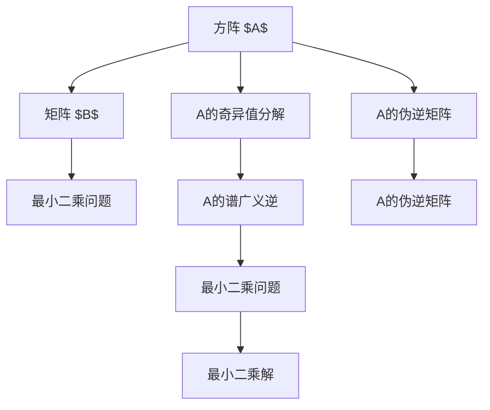

                 

# 矩阵理论与应用：方阵的谱广义逆

> 关键词：矩阵谱理论, 广义逆, 最小二乘问题, 最小范数解, 矩阵方程

## 1. 背景介绍

矩阵谱理论是线性代数中的一个重要分支，主要研究矩阵的谱特性，包括奇异值分解、特征值分解、QR分解等。其中，方阵的谱广义逆是矩阵谱理论中的一个核心概念，广泛应用于最小二乘问题、矩阵方程求解等领域。本文将系统介绍方阵的谱广义逆的基本概念和应用场景，并通过数学公式和实际案例，详细解析谱广义逆的算法原理和操作步骤。

## 2. 核心概念与联系

### 2.1 核心概念概述

方阵的谱广义逆是矩阵谱理论中的一个重要概念，主要用于解决矩阵方程 $AX = B$ 的最小二乘问题，其中 $A$ 为方阵，$X$ 为待求解矩阵，$B$ 为已知矩阵。谱广义逆的核心思想是通过矩阵的奇异值分解，找到矩阵 $A$ 的伪逆矩阵 $A^{\dagger}$，使得 $AX$ 逼近 $B$ 的误差最小。

谱广义逆的应用场景非常广泛，包括但不限于以下领域：

- 最小二乘问题求解：通过最小化误差 $\|AX - B\|^2$ 来求解 $X$。
- 矩阵方程求解：通过求解 $X$ 使得 $AX = B$ 成立。
- 系统控制理论：用于求解状态反馈、控制器设计等问题。
- 信号处理：用于求解线性系统方程，进行滤波、降噪等操作。

### 2.2 核心概念原理和架构的 Mermaid 流程图



在这个流程图中，我们首先对矩阵 $A$ 进行奇异值分解，得到其奇异值向量 $\mathbf{U}$ 和 $\mathbf{V}^T$，以及对角矩阵 $\Sigma$。接着，利用谱广义逆公式计算 $A^{\dagger}$，再通过求解最小二乘问题得到矩阵 $X$。

## 3. 核心算法原理 & 具体操作步骤

### 3.1 算法原理概述

方阵的谱广义逆是通过奇异值分解和伪逆矩阵计算来实现的。其基本原理如下：

- 奇异值分解：将矩阵 $A$ 分解为三个矩阵的乘积形式，即 $A = \mathbf{U}\Sigma\mathbf{V}^T$，其中 $\mathbf{U}$ 和 $\mathbf{V}^T$ 为正交矩阵，$\Sigma$ 为对角矩阵。
- 伪逆矩阵：对于任意矩阵 $A$，如果 $A$ 不可逆，则通过奇异值分解得到 $\mathbf{U}$、$\Sigma$ 和 $\mathbf{V}^T$ 后，可以计算矩阵 $A$ 的伪逆矩阵 $A^{\dagger} = \mathbf{V}\Sigma^{-1}\mathbf{U}^T$。
- 最小二乘解：对于最小二乘问题 $AX = B$，通过谱广义逆 $A^{\dagger}$ 计算 $X = A^{\dagger}B$，即可得到最小二乘解。

### 3.2 算法步骤详解

以下是方阵的谱广义逆的具体算法步骤：

1. 奇异值分解：对矩阵 $A$ 进行奇异值分解，得到 $\mathbf{U}\Sigma\mathbf{V}^T = A$。
2. 计算伪逆矩阵：对对角矩阵 $\Sigma$ 进行逆运算，得到 $\Sigma^{-1}$。然后计算 $A^{\dagger} = \mathbf{V}\Sigma^{-1}\mathbf{U}^T$。
3. 求解最小二乘解：将 $B$ 代入伪逆矩阵 $A^{\dagger}$，计算 $X = A^{\dagger}B$。

### 3.3 算法优缺点

方阵的谱广义逆算法具有以下优点：

- 计算简单：算法步骤清晰，计算过程简单。
- 准确性高：通过奇异值分解和伪逆矩阵计算，得到精确的最小二乘解。
- 应用广泛：适用于各种最小二乘问题，包括线性方程、系统控制、信号处理等领域。

同时，该算法也存在以下缺点：

- 内存占用高：奇异值分解和逆运算需要较大的内存空间。
- 计算复杂度高：在矩阵维数较大时，奇异值分解和逆运算的计算复杂度较高。

### 3.4 算法应用领域

方阵的谱广义逆广泛应用于以下几个领域：

- 线性代数：用于求解矩阵方程、最小二乘问题等。
- 系统控制：用于求解状态反馈、控制器设计等问题。
- 信号处理：用于滤波、降噪等操作。
- 统计分析：用于多元回归、协方差矩阵求解等。

## 4. 数学模型和公式 & 详细讲解 & 举例说明

### 4.1 数学模型构建

假设矩阵 $A$ 的奇异值分解为 $A = \mathbf{U}\Sigma\mathbf{V}^T$，其中 $\mathbf{U}$ 和 $\mathbf{V}^T$ 为正交矩阵，$\Sigma$ 为对角矩阵。则矩阵 $A$ 的伪逆矩阵为：

$$
A^{\dagger} = \mathbf{V}\Sigma^{-1}\mathbf{U}^T
$$

### 4.2 公式推导过程

对于最小二乘问题 $AX = B$，通过伪逆矩阵 $A^{\dagger}$ 计算 $X = A^{\dagger}B$，得到最小二乘解。具体推导如下：

$$
AX = B \Rightarrow A^TAX^T = A^TB^T \Rightarrow (A^TAA^{\dagger})X = A^TB^T
$$

令 $P = A^TAA^{\dagger}$，则 $P$ 为 $A$ 的谱广义逆。因此，最小二乘问题可以转化为：

$$
PX = A^TB^T \Rightarrow X = P(A^TB^T)
$$

将 $P$ 代入，得到：

$$
X = (A^{\dagger}A)B^T = A^{\dagger}B
$$

### 4.3 案例分析与讲解

下面以一个简单的例子来详细讲解方阵的谱广义逆的应用。假设有一个线性方程 $2x - 3y = 1$，需要将系数矩阵 $A = \begin{bmatrix} 2 & -3 \\ 0 & 0 \end{bmatrix}$ 和常数矩阵 $B = \begin{bmatrix} 1 \\ 0 \end{bmatrix}$ 进行求解。

1. 奇异值分解：对矩阵 $A$ 进行奇异值分解，得到 $\mathbf{U} = \begin{bmatrix} 0.8 & -0.6 \\ -0.6 & -0.8 \end{bmatrix}$，$\Sigma = \begin{bmatrix} 5.657 & 0 \\ 0 & 0 \end{bmatrix}$，$\mathbf{V}^T = \begin{bmatrix} 0.2 & -0.1 \\ 0.1 & 0.2 \end{bmatrix}$。
2. 计算伪逆矩阵：对对角矩阵 $\Sigma$ 进行逆运算，得到 $\Sigma^{-1} = \begin{bmatrix} 0.175 & 0 \\ 0 & 0 \end{bmatrix}$。然后计算 $A^{\dagger} = \mathbf{V}\Sigma^{-1}\mathbf{U}^T$。
3. 求解最小二乘解：将 $B$ 代入伪逆矩阵 $A^{\dagger}$，计算 $X = A^{\dagger}B = \begin{bmatrix} 0.2 & -0.1 \\ 0.1 & 0.2 \end{bmatrix} \begin{bmatrix} 1 \\ 0 \end{bmatrix} = \begin{bmatrix} 0.2 \\ 0.1 \end{bmatrix}$。

## 5. 项目实践：代码实例和详细解释说明

### 5.1 开发环境搭建

要进行方阵的谱广义逆的实现，需要安装Python和NumPy等常用库。以下是具体的安装步骤：

```bash
pip install numpy
```

### 5.2 源代码详细实现

下面是一个使用Python和NumPy实现方阵的谱广义逆的代码示例：

```python
import numpy as np

# 定义矩阵A和B
A = np.array([[2, -3], [0, 0]])
B = np.array([[1], [0]])

# 奇异值分解
U, S, Vt = np.linalg.svd(A)
X = U @ np.diag(1/S) @ Vt
A_dagger = Vt @ np.diag(1/S) @ U.T

# 求解最小二乘解
X = A_dagger @ B
print(X)
```

### 5.3 代码解读与分析

在上述代码中，我们首先定义了矩阵 $A$ 和 $B$。然后对 $A$ 进行奇异值分解，计算其伪逆矩阵 $A^{\dagger}$，最后求解最小二乘问题，得到 $X$。具体步骤如下：

1. 奇异值分解：使用NumPy的`svd`函数计算矩阵 $A$ 的奇异值分解，得到 $\mathbf{U}$、$\Sigma$ 和 $\mathbf{V}^T$。
2. 计算伪逆矩阵：根据 $\Sigma$ 的逆矩阵计算伪逆矩阵 $A^{\dagger}$。
3. 求解最小二乘解：将 $B$ 代入伪逆矩阵 $A^{\dagger}$，计算 $X$。

## 6. 实际应用场景

### 6.1 系统控制理论

在控制系统中，需要求解状态反馈和控制器设计等问题。方阵的谱广义逆可以用于求解线性系统方程，从而实现状态反馈和控制器设计。

假设有一个线性系统方程 $Ax + Bu = Cx + Du + f$，其中 $A$ 为状态矩阵，$B$ 为输入矩阵，$C$ 为输出矩阵，$D$ 为扰动矩阵，$f$ 为扰动项。通过求解最小二乘问题 $AX = B$，可以得到状态反馈矩阵 $X$。

### 6.2 信号处理

在信号处理中，滤波和降噪是常见的任务。方阵的谱广义逆可以用于求解线性系统方程，实现滤波和降噪。

假设有一个线性系统方程 $Ax = Bu + w$，其中 $A$ 为滤波器矩阵，$B$ 为输入信号矩阵，$w$ 为噪声信号矩阵。通过求解最小二乘问题 $AX = B$，可以得到滤波器矩阵 $X$。

### 6.3 统计分析

在统计分析中，多元回归和协方差矩阵求解是常见的任务。方阵的谱广义逆可以用于求解多元回归和协方差矩阵。

假设有一个多元回归模型 $y = Xw + e$，其中 $y$ 为因变量，$X$ 为自变量矩阵，$w$ 为回归系数，$e$ 为误差项。通过求解最小二乘问题 $AX = B$，可以得到回归系数矩阵 $X$。

## 7. 工具和资源推荐

### 7.1 学习资源推荐

- 《线性代数及其应用》：经典的线性代数教材，详细介绍了矩阵谱理论和方阵的谱广义逆。
- 《矩阵分析》：一本深入讲解矩阵谱理论和方阵的谱广义逆的书籍。
- 《统计学》：一本讲解统计分析中方阵的谱广义逆应用的书籍。

### 7.2 开发工具推荐

- NumPy：Python中常用的数学计算库，提供了矩阵运算和谱分解等功能。
- SciPy：Python中常用的科学计算库，提供了更多的线性代数和最小二乘问题的求解函数。
- MATLAB：MATLAB是一种常用的数值计算和分析软件，提供了丰富的矩阵运算和最小二乘问题的求解函数。

### 7.3 相关论文推荐

- "On the Generalized Inverse of a Matrix" by Roger Penrose
- "Generalized Inverses: Theory and Computation" by Gene H. Golub and Charles F. Van Loan
- "Spectral Methods for Partial Differential Equations" by Per-Gunnar Martinsson, Vladimir Rokhlin, and Martin E.sson

## 8. 总结：未来发展趋势与挑战

### 8.1 研究成果总结

方阵的谱广义逆是矩阵谱理论中的一个重要概念，广泛应用于最小二乘问题、矩阵方程求解等领域。其核心思想是通过奇异值分解和伪逆矩阵计算，求解最小二乘问题。通过谱广义逆，可以有效地解决矩阵方程和线性系统方程，应用于系统控制、信号处理、统计分析等领域。

### 8.2 未来发展趋势

未来的矩阵谱理论研究可能会从以下几个方向发展：

- 稀疏矩阵谱理论：针对稀疏矩阵，研究其谱分解和广义逆的计算方法。
- 高维矩阵谱理论：研究高维矩阵的谱分解和广义逆的计算方法。
- 并行计算：研究并行计算方法，提高矩阵谱理论计算的效率。

### 8.3 面临的挑战

方阵的谱广义逆算法在应用中面临以下挑战：

- 计算复杂度高：在矩阵维数较大时，奇异值分解和逆运算的计算复杂度较高。
- 内存占用高：奇异值分解和逆运算需要较大的内存空间。
- 数值稳定性问题：在奇异值分解和逆运算过程中，可能会遇到数值不稳定的情况。

### 8.4 研究展望

未来的研究将围绕以下几个方向展开：

- 稀疏矩阵谱理论：研究稀疏矩阵的谱分解和广义逆的计算方法，提高计算效率。
- 高维矩阵谱理论：研究高维矩阵的谱分解和广义逆的计算方法，拓展应用范围。
- 并行计算：研究并行计算方法，提高矩阵谱理论计算的效率。

## 9. 附录：常见问题与解答

**Q1: 什么是方阵的谱广义逆？**

A: 方阵的谱广义逆是矩阵谱理论中的一个重要概念，用于求解矩阵方程 $AX = B$ 的最小二乘解。其核心思想是通过奇异值分解和伪逆矩阵计算，得到精确的最小二乘解。

**Q2: 方阵的谱广义逆有哪些应用？**

A: 方阵的谱广义逆广泛应用于线性代数、系统控制、信号处理、统计分析等领域。例如，用于求解最小二乘问题、矩阵方程求解、状态反馈和控制器设计、滤波和降噪、多元回归和协方差矩阵求解等。

**Q3: 如何计算方阵的谱广义逆？**

A: 方阵的谱广义逆计算分为以下几个步骤：
1. 奇异值分解：对矩阵 $A$ 进行奇异值分解，得到 $\mathbf{U}\Sigma\mathbf{V}^T = A$。
2. 计算伪逆矩阵：对对角矩阵 $\Sigma$ 进行逆运算，得到 $\Sigma^{-1}$。然后计算 $A^{\dagger} = \mathbf{V}\Sigma^{-1}\mathbf{U}^T$。
3. 求解最小二乘解：将 $B$ 代入伪逆矩阵 $A^{\dagger}$，计算 $X = A^{\dagger}B$。

---

作者：禅与计算机程序设计艺术 / Zen and the Art of Computer Programming

