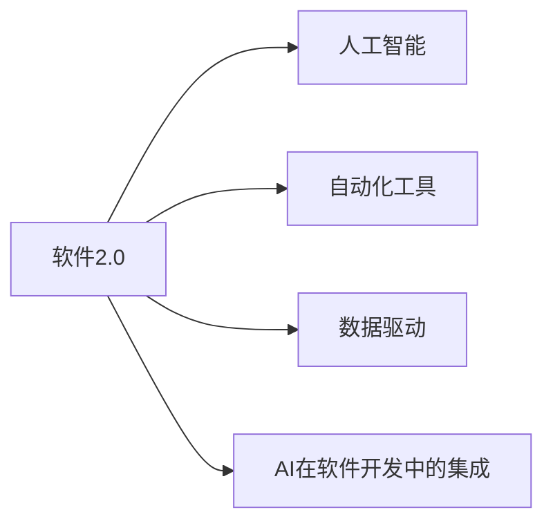

                 

# 短期内软件2.0将在哪些领域率先普及?

> 关键词：软件2.0, 普及, 人工智能, 自动化, 数据驱动, 互联网, 行业应用, 战略优势, 变革推动

## 1. 背景介绍

### 1.1 问题由来

随着人工智能（AI）技术的飞速发展，"软件2.0"（Software 2.0）概念应运而生。与以编码为中心的传统"软件1.0"不同，"软件2.0"以AI为引擎，强调通过机器学习和自动化提升软件开发生产力，降低开发和运营成本，推动业务创新。

软件2.0不仅是技术革命，更是产业变革。它将AI技术与软件开发紧密结合，使得软件开发变得更加智能化、自动化，为各行各业带来了新的发展机遇。

### 1.2 问题核心关键点

软件2.0的核心在于利用AI技术驱动软件开发生产力的提升，涉及自动化工具的开发、数据驱动的模型训练、AI在软件开发中的集成等多个层面。

实现软件2.0的关键点包括：
- **自动化工具的开发**：如代码生成器、测试工具、代码质量分析器等，降低人类编写和维护代码的工作量。
- **数据驱动的模型训练**：基于已有数据和需求，训练AI模型，辅助软件设计和开发。
- **AI在软件开发中的集成**：如AI辅助的编程、自动重构、智能调试、需求分析等。

### 1.3 问题研究意义

研究软件2.0的普及领域，对推动AI技术在软件开发中的应用、提升软件产业效率、促进经济社会发展具有重要意义。

1. **推动AI技术应用**：帮助AI技术从实验室走向现实生产环境，在更广泛的场景中发挥其潜力。
2. **提升软件产业效率**：通过自动化和智能化手段，降低开发和运营成本，加速产品迭代周期。
3. **促进经济社会发展**：在各行业引入软件2.0，推动数字化转型，提升整体生产力水平。
4. **增强企业战略优势**：掌握软件2.0技术，可以构建竞争优势，引领行业趋势。
5. **推动行业变革**：软件2.0的普及，将促进原有行业规则和模式的变化，催生新的业务和市场机会。

## 2. 核心概念与联系

### 2.1 核心概念概述

软件2.0融合了人工智能、软件开发和数据分析等多个领域，涉及的技术概念众多。

- **软件2.0**：以AI为核心的软件开发范式，强调自动化和智能化，降低开发和运营成本，提高效率。
- **人工智能**：通过机器学习和深度学习等技术，使机器具备模拟人类智能的能力。
- **自动化工具**：如代码生成器、测试工具、版本控制系统等，减少手动操作，提升开发效率。
- **数据驱动**：基于数据训练AI模型，辅助软件开发和决策。
- **AI在软件开发中的集成**：如代码智能推荐、智能调试、需求分析等。

这些概念之间的联系可以通过以下Mermaid流程图来展示：



此图展示了大软件2.0中各概念之间的相互依赖关系。人工智能为软件2.0提供了智能化的基础，自动化工具和数据驱动则是实现智能化的方法，而AI在软件开发中的集成则展示了这些技术的应用。

## 3. 核心算法原理 & 具体操作步骤

### 3.1 算法原理概述

软件2.0的核心算法原理基于AI技术在软件开发中的应用。以下详细介绍基于机器学习和自动化技术的核心算法。

### 3.2 算法步骤详解

#### 3.2.1 数据准备
- **数据采集**：从已有代码库、项目文档、需求文档、用户反馈等来源收集数据。
- **数据预处理**：清洗、归一化、分词等预处理，确保数据质量。
- **数据标注**：给数据打上标签，如代码风格、质量、复杂度等，用于模型训练。

#### 3.2.2 模型训练
- **选择模型**：根据任务需求选择合适的模型，如回归模型、分类模型、聚类模型等。
- **模型训练**：使用准备好的数据训练模型，调整超参数以优化模型性能。
- **模型评估**：使用测试数据集评估模型效果，调整模型以提高准确性。

#### 3.2.3 模型集成与部署
- **模型集成**：将训练好的模型集成到开发流程中，如代码质量分析、代码自动生成、代码智能推荐等。
- **部署上线**：将模型部署到生产环境，监控其性能，处理异常情况。

### 3.3 算法优缺点

#### 3.3.1 优点
- **提升开发效率**：自动化工具和AI模型能够快速处理大量代码和数据，减少人工操作。
- **降低成本**：通过智能决策，减少错误和返工，降低开发和运营成本。
- **增强准确性**：AI模型能够识别和修复代码中的潜在问题，提升代码质量。
- **支持个性化**：根据项目需求和开发团队特点，定制化解决方案。

#### 3.3.2 缺点
- **依赖数据质量**：模型性能受数据质量影响，需要高质量的标注数据。
- **模型训练复杂**：需要专业的数据科学家和工程师进行模型训练和调优。
- **可能存在偏见**：AI模型可能学习到数据中的偏见，影响模型决策。
- **技术门槛高**：需要掌握AI和软件开发知识，对技术要求较高。

### 3.4 算法应用领域

软件2.0技术可以在多个领域中得到广泛应用。以下是几个典型的应用场景：

#### 3.4.1 软件开发
- **代码质量分析**：使用AI模型检测代码质量问题，如代码风格、重复代码、复杂度等。
- **代码生成与重构**：基于需求描述，自动生成代码或进行代码重构。
- **需求分析与理解**：使用自然语言处理技术，自动分析和理解项目需求。

#### 3.4.2 测试与部署
- **自动化测试**：使用AI模型自动化生成测试用例，加速测试过程。
- **持续集成与部署**：通过AI模型优化持续集成和部署流程，提升部署效率。

#### 3.4.3 项目管理
- **项目进度预测**：使用AI模型预测项目进度和风险，提高项目管理效率。
- **资源分配**：基于项目需求和团队能力，智能分配资源。

#### 3.4.4 安全与合规
- **代码审计**：使用AI模型自动审计代码，检测潜在安全漏洞和合规问题。
- **风险评估**：使用AI模型评估代码安全风险，提高系统安全性。

## 4. 数学模型和公式 & 详细讲解 & 举例说明

### 4.1 数学模型构建

软件2.0中常用的数学模型包括回归模型、分类模型、聚类模型等。

#### 4.1.1 回归模型
回归模型用于预测数值型数据，如代码复杂度、缺陷率等。

$$
\hat{y} = \theta_0 + \sum_{i=1}^n \theta_i x_i
$$

其中，$\hat{y}$ 为预测值，$\theta_0$ 为截距，$\theta_i$ 为回归系数，$x_i$ 为自变量。

#### 4.1.2 分类模型
分类模型用于将数据分为多个类别，如代码质量分类、功能分类等。

$$
P(y|x) = \frac{exp(\theta_0 + \sum_{i=1}^n \theta_i x_i)}{\sum_{k=1}^K exp(\theta_k + \sum_{i=1}^n \theta_i x_i)}
$$

其中，$y$ 为类别标签，$x$ 为输入特征，$K$ 为类别数。

#### 4.1.3 聚类模型
聚类模型用于将数据分为若干个组，如相似代码块、模块等。

$$
\hat{x}_k = \sum_{i=1}^n \theta_{ik} x_i
$$

其中，$\hat{x}_k$ 为聚类结果，$x_i$ 为数据点，$\theta_{ik}$ 为聚类系数。

### 4.2 公式推导过程

以回归模型为例，详细介绍其推导过程。

**假设数据集为** $(x_i,y_i)$，其中 $x_i$ 为输入特征，$y_i$ 为目标值，$i=1,\ldots,N$。

**回归模型的目标**：最小化预测值与真实值之间的误差。

**误差函数**：
$$
L(\theta) = \frac{1}{2N} \sum_{i=1}^N (y_i - \hat{y}_i)^2
$$

其中，$\theta = (\theta_0,\theta_1,\ldots,\theta_n)$ 为模型参数。

**梯度下降法**：
$$
\theta_j \leftarrow \theta_j - \frac{\alpha}{N} \sum_{i=1}^N (y_i - \hat{y}_i)x_{ij}
$$

其中，$\alpha$ 为学习率。

通过迭代更新参数 $\theta$，最小化损失函数 $L(\theta)$，从而得到最优回归模型。

### 4.3 案例分析与讲解

以代码质量分析为例，展示如何使用回归模型评估代码质量。

假设有一个代码库，包含多条代码行。通过统计每条代码行的复杂度、重复率、函数大小等特征，得到一个特征向量 $x_i$。目标是预测每条代码行的质量 $y_i$，其中 $y_i=0$ 表示代码质量较好，$y_i=1$ 表示代码质量较差。

#### 4.3.1 数据准备
- **数据采集**：从代码库中收集每条代码行的特征和质量标签。
- **数据预处理**：对数据进行清洗、归一化、分词等预处理。
- **数据标注**：将每条代码行的质量标签标注出来。

#### 4.3.2 模型训练
- **选择模型**：选择线性回归模型。
- **模型训练**：使用训练数据集训练模型，调整超参数以优化模型性能。
- **模型评估**：使用测试数据集评估模型效果，调整模型以提高准确性。

#### 4.3.3 模型应用
- **代码质量评估**：将新代码行的特征输入模型，得到其质量评估结果。
- **代码优化建议**：根据评估结果，提供代码优化建议。

## 5. 项目实践：代码实例和详细解释说明

### 5.1 开发环境搭建

#### 5.1.1 Python环境
- **安装Python**：选择Python 3.7或以上版本。
- **安装pip**：在Linux或MacOS上使用 `sudo apt-get install python-pip`，在Windows上使用 `python -m ensurepip --upgrade`。
- **安装虚拟环境**：使用 `virtualenv venv` 创建虚拟环境，激活环境 `source venv/bin/activate`。

#### 5.1.2 安装依赖
- **安装TensorFlow**：`pip install tensorflow==2.x`
- **安装scikit-learn**：`pip install scikit-learn`
- **安装pandas**：`pip install pandas`

### 5.2 源代码详细实现

以线性回归模型为例，展示代码实现。

```python
import numpy as np
from sklearn.linear_model import LinearRegression
from sklearn.metrics import mean_squared_error

# 准备数据
X = np.array([[1, 2], [2, 4], [3, 6], [4, 8]])
y = np.array([1, 3, 5, 7])

# 训练模型
model = LinearRegression()
model.fit(X, y)

# 预测新数据
X_new = np.array([[5, 10]])
y_pred = model.predict(X_new)

# 评估模型
mse = mean_squared_error(y, y_pred)
print("均方误差: {:.2f}".format(mse))
```

### 5.3 代码解读与分析

#### 5.3.1 数据准备
- **特征**：选择每条代码行的复杂度、重复率、函数大小等作为输入特征。
- **标签**：使用代码质量标签作为输出目标。

#### 5.3.2 模型训练
- **模型选择**：选择线性回归模型。
- **模型训练**：使用 `fit` 方法训练模型，调整超参数以优化模型性能。

#### 5.3.3 模型评估
- **评估指标**：使用均方误差（MSE）作为评估指标。
- **模型输出**：根据新数据的输入特征，预测代码质量。

## 6. 实际应用场景

### 6.1 软件开发

#### 6.1.1 代码质量分析
- **功能**：检测代码质量问题，如代码风格、重复代码、复杂度等。
- **实现**：使用回归模型或分类模型，对代码特征进行预测。

#### 6.1.2 代码生成与重构
- **功能**：自动生成代码或进行代码重构。
- **实现**：使用代码生成器或重构工具，基于需求描述自动生成代码。

#### 6.1.3 需求分析与理解
- **功能**：自动分析和理解项目需求。
- **实现**：使用自然语言处理技术，对需求文档进行语义分析。

### 6.2 测试与部署

#### 6.2.1 自动化测试
- **功能**：自动生成测试用例，加速测试过程。
- **实现**：使用测试生成器，根据测试场景生成测试数据。

#### 6.2.2 持续集成与部署
- **功能**：优化持续集成和部署流程，提升部署效率。
- **实现**：使用自动化工具，自动构建、测试和部署软件。

### 6.3 项目管理

#### 6.3.1 项目进度预测
- **功能**：预测项目进度和风险。
- **实现**：使用回归模型，基于历史数据预测项目进度。

#### 6.3.2 资源分配
- **功能**：基于项目需求和团队能力，智能分配资源。
- **实现**：使用优化算法，最大化资源利用率。

### 6.4 安全与合规

#### 6.4.1 代码审计
- **功能**：自动审计代码，检测潜在安全漏洞和合规问题。
- **实现**：使用代码审计工具，对代码进行静态分析。

#### 6.4.2 风险评估
- **功能**：评估代码安全风险，提高系统安全性。
- **实现**：使用安全评估模型，识别和修复潜在安全漏洞。

## 7. 工具和资源推荐

### 7.1 学习资源推荐

#### 7.1.1 TensorFlow官方文档
- **链接**：[https://www.tensorflow.org/](https://www.tensorflow.org/)
- **内容**：详细介绍TensorFlow的API、模型、训练和优化技术。

#### 7.1.2 scikit-learn官方文档
- **链接**：[https://scikit-learn.org/stable/documentation.html](https://scikit-learn.org/stable/documentation.html)
- **内容**：涵盖机器学习模型的实现与应用。

#### 7.1.3 GitHub上的开源项目
- **链接**：[https://github.com](https://github.com)
- **内容**：提供丰富的开源项目，包括软件2.0的实现与应用案例。

### 7.2 开发工具推荐

#### 7.2.1 Visual Studio Code
- **链接**：[https://code.visualstudio.com/](https://code.visualstudio.com/)
- **内容**：一个轻量级、功能强大的代码编辑器，支持多种编程语言和框架。

#### 7.2.2 PyCharm
- **链接**：[https://www.jetbrains.com/pycharm/](https://www.jetbrains.com/pycharm/)
- **内容**：一个专业的Python IDE，提供强大的代码调试和分析工具。

#### 7.2.3 Jupyter Notebook
- **链接**：[https://jupyter.org/](https://jupyter.org/)
- **内容**：一个交互式编程环境，支持Markdown和LaTeX，便于编写和分享代码。

### 7.3 相关论文推荐

#### 7.3.1 软件2.0的文献
- **论文1**：《Software 2.0: Automating Software Engineering with Machine Learning》，IEEE Software 2018年11月刊。
- **论文2**：《Software 2.0: The Next Generation of Software Engineering with Machine Learning》，ACM Computing Surveys 2019年6月刊。
- **论文3**：《A Survey of Software 2.0 Technologies and Applications》，IEEE Transactions on Software Engineering 2020年3月刊。

这些文献介绍了软件2.0的发展历程、关键技术和应用场景，有助于深入理解软件2.0的核心概念和技术细节。

## 8. 总结：未来发展趋势与挑战

### 8.1 研究成果总结

软件2.0在多个领域中得到了广泛应用，取得了一些显著成果：

1. **提升开发效率**：自动化工具和AI模型能够快速处理大量代码和数据，减少人工操作。
2. **降低成本**：通过智能决策，减少错误和返工，降低开发和运营成本。
3. **增强准确性**：AI模型能够识别和修复代码中的潜在问题，提升代码质量。
4. **支持个性化**：根据项目需求和开发团队特点，定制化解决方案。

### 8.2 未来发展趋势

软件2.0技术将在未来继续发展，呈现以下几个趋势：

1. **智能化水平提升**：AI模型将更加智能，具备更强的自主决策能力。
2. **自动化工具完善**：工具将更加智能，具备更强的自适应性和灵活性。
3. **数据驱动更加深入**：数据将更加全面和精细，推动模型性能提升。
4. **跨领域融合**：与其他技术（如区块链、物联网等）融合，拓展应用场景。
5. **伦理与安全保障**：加强数据隐私保护和模型安全，保障用户权益。

### 8.3 面临的挑战

尽管软件2.0技术发展迅速，但仍面临一些挑战：

1. **数据质量和标注**：高质量的数据和标注是模型性能提升的关键，获取数据和标注的难度较大。
2. **模型解释性**：AI模型决策过程缺乏可解释性，难以理解和调试。
3. **技术门槛**：对技术要求较高，需要具备多学科知识。
4. **资源消耗**：模型训练和推理需要大量计算资源，对硬件要求较高。
5. **安全与隐私**：模型可能学习到数据中的有害信息，存在安全风险。

### 8.4 研究展望

未来，软件2.0技术需要在以下几个方面进行深入研究：

1. **模型优化**：优化模型结构，降低计算复杂度，提升模型性能。
2. **工具集成**：将工具集成到开发流程中，提供一站式解决方案。
3. **多模态融合**：将视觉、语音、文本等多模态数据结合，拓展应用场景。
4. **跨领域应用**：在更多领域中推广应用，推动行业变革。
5. **伦理与隐私**：研究模型伦理和隐私保护技术，确保安全可靠。

## 9. 附录：常见问题与解答

### 9.1 常见问题

#### 9.1.1 软件2.0和软件1.0的区别是什么？

**回答**：软件2.0以AI为引擎，通过自动化和智能化提升开发效率和代码质量，而软件1.0以编码为中心，强调编码技巧和流程。

#### 9.1.2 软件2.0的优缺点是什么？

**回答**：优点是提升开发效率、降低成本、增强准确性、支持个性化。缺点是依赖高质量数据、技术门槛高、资源消耗大、可能存在偏见。

#### 9.1.3 软件2.0的应用场景有哪些？

**回答**：软件开发、测试与部署、项目管理、安全与合规等。

#### 9.1.4 软件2.0的开发环境搭建需要注意哪些问题？

**回答**：选择合适版本的Python和依赖，创建虚拟环境，安装必要的开发工具。

#### 9.1.5 软件2.0的代码实例中使用了哪些技术？

**回答**：TensorFlow、scikit-learn、numpy等。

#### 9.1.6 软件2.0的模型训练和评估方法是什么？

**回答**：使用回归模型、分类模型、聚类模型等，评估指标包括均方误差、准确率等。

---

作者：禅与计算机程序设计艺术 / Zen and the Art of Computer Programming

