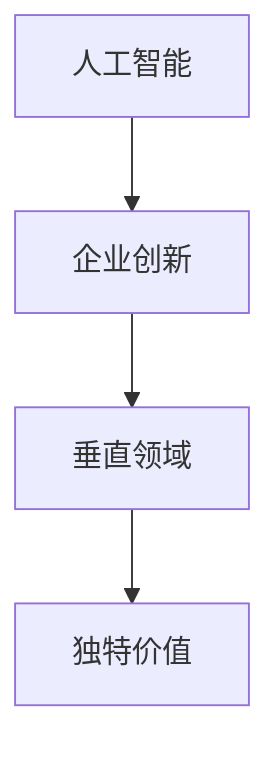

                 

# 硅谷多元化发展：AI企业创新探索垂直领域独特价值

> 关键词：人工智能,企业创新,垂直领域,创新探索,独特价值

## 1. 背景介绍

### 1.1 问题由来
随着人工智能（AI）技术的飞速发展，硅谷地区成为全球AI创新的中心。然而，硅谷AI企业发展面临诸多挑战，如人才流失、创新瓶颈、市场竞争等。为此，AI企业正积极探索多元化发展，探索垂直领域的独特价值。

### 1.2 问题核心关键点
1. **多元化发展**：指AI企业在保持核心技术优势的同时，拓展到其他领域或行业，形成多维度竞争格局。
2. **垂直领域**：AI企业聚焦特定行业或应用场景，针对性地提供解决方案，实现深度应用。
3. **独特价值**：AI企业通过垂直领域的深入探索，发掘和实现自身独特的商业价值和市场地位。

## 2. 核心概念与联系

### 2.1 核心概念概述

为更好地理解AI企业多元化发展，本节将介绍几个密切相关的核心概念：

- **人工智能**：以机器学习、深度学习为代表的技术，使机器具备学习能力，可以执行复杂任务。
- **企业创新**：通过技术、管理、市场等创新，提升企业竞争力和市场价值。
- **垂直领域**：企业专注于特定行业或应用场景，提供差异化产品和服务。
- **独特价值**：通过深入某一领域的探索，实现技术优势和市场竞争力的双重提升。

这些概念之间的逻辑关系可以通过以下Mermaid流程图来展示：



这个流程图展示了一个AI企业在多元化发展过程中的核心概念及其关系：

1. 人工智能为企业的创新提供了技术基础。
2. 企业创新促使AI技术在多个领域应用，形成多元化发展。
3. 垂直领域的深入探索使得AI企业发现和实现独特价值。

## 3. 核心算法原理 & 具体操作步骤
### 3.1 算法原理概述

AI企业的多元化发展和垂直领域探索，本质上是一个从技术创新到市场应用的过程。其核心思想是：利用AI技术在不同领域的广泛应用，找到并实现独特的商业机会。

形式化地，假设AI企业A的原始核心技术为$f(x)$，其中$x$为技术输入，$f(x)$为技术输出。企业A希望在垂直领域$T$中发掘新的商业价值，即找到$g(T)$，其中$g$为领域映射函数。企业A通过多元化的创新，将$f(x)$转化为更适应用户需求和市场特性的$g(T)$。

### 3.2 算法步骤详解

AI企业的多元化发展和垂直领域探索一般包括以下几个关键步骤：

**Step 1: 市场调研与需求分析**
- 深入了解目标市场和用户需求，明确企业在新领域的定位和价值主张。
- 通过数据分析、访谈等方式获取行业痛点和机会，确定垂直领域的探索方向。

**Step 2: 技术适配与定制开发**
- 根据垂直领域的特点，对原有AI技术进行适配和优化，如调整算法、优化模型结构等。
- 针对特定行业需求，开发定制化的解决方案，如开发垂直领域的专用算法或模型。

**Step 3: 构建生态与合作伙伴关系**
- 在垂直领域构建生态系统，吸引合作伙伴和第三方供应商，形成资源互补。
- 与其他企业和机构建立合作关系，共同开发市场、共享资源和技术。

**Step 4: 用户反馈与迭代优化**
- 在垂直领域进行小规模试点和测试，收集用户反馈和业务效果。
- 根据反馈和业务效果，不断优化产品和服务，提升用户体验和满意度。

**Step 5: 市场推广与商业落地**
- 制定市场推广计划，通过线上线下渠道进行产品宣传和销售。
- 拓展市场覆盖面，实现商业落地，形成稳定的收入来源。

### 3.3 算法优缺点

AI企业的多元化发展和垂直领域探索方法具有以下优点：
1. 降低创新风险：通过在特定领域进行深入探索，可降低技术创新的不确定性，实现快速迭代优化。
2. 提升市场竞争力：通过垂直领域的深度挖掘，可以提供更具针对性和差异化的产品，增强市场竞争力。
3. 拓展业务空间：多元化的发展策略可以拓展企业的业务领域，增加收入来源和市场份额。

同时，该方法也存在一定的局限性：
1. 技术门槛高：需要深厚的技术积累和行业知识，对企业技术和人才提出了更高要求。
2. 资源投入大：进入新领域需要大量资源投入，包括人力、资金、市场推广等。
3. 市场适应性差：新领域市场环境复杂，企业需具备较强的市场适应能力，以应对各种挑战。

尽管存在这些局限性，但就目前而言，多元化和垂直领域的探索方法仍是AI企业寻求长期发展的重要手段。未来相关研究的重点在于如何进一步降低多元化发展的技术门槛和资源投入，提高企业的市场适应性和灵活性。

### 3.4 算法应用领域

AI企业的多元化和垂直领域探索方法，在各个行业领域中得到了广泛的应用，例如：

- **金融科技**：通过AI技术优化金融产品、风险管理、客户服务等，提供差异化金融服务。
- **医疗健康**：利用AI技术进行疾病诊断、医疗影像分析、个性化治疗等，提升医疗健康水平。
- **智慧城市**：借助AI技术实现城市管理、公共安全、环境监测等，提升城市智能化水平。
- **自动驾驶**：结合AI技术进行车辆自主驾驶、智能交通管理，推动自动驾驶技术落地。
- **零售电商**：通过AI技术优化商品推荐、库存管理、营销策略等，提升零售电商效率和用户体验。

除了上述这些典型领域外，AI企业在更多垂直领域也有深入探索和应用，为各行各业带来了创新活力和业务升级。

## 4. 数学模型和公式 & 详细讲解
### 4.1 数学模型构建

本节将使用数学语言对AI企业多元化发展和垂直领域探索的数学模型进行描述。

假设AI企业A的原始技术为$f(x)$，其输出为$y$，则技术输出的数学模型为：

$$ y = f(x) $$

假设企业A希望在垂直领域$T$中实现商业价值$g(T)$，则领域映射的数学模型为：

$$ g(T) = \mathcal{G}(T) $$

其中$\mathcal{G}$为领域映射函数。

### 4.2 公式推导过程

以下我们以金融科技领域为例，推导AI技术在特定领域的映射模型。

假设AI技术在金融科技领域的应用模型为$g_F(T)$，其中$T$为金融科技领域，包括金融产品、风险管理、客户服务等。根据领域映射函数$\mathcal{G}$，可以得到金融科技领域的输出模型：

$$ g_F(T) = \mathcal{G}_F(T) $$

其中$\mathcal{G}_F$为金融科技领域映射函数。

为了简化计算，我们可以进一步假设$g_F(T)$为$f(x)$的一部分，即$g_F(T) = f_F(x_F)$，其中$x_F$为金融科技领域的技术输入，$f_F$为金融科技领域的特定算法或模型。

因此，金融科技领域的输出模型可以表示为：

$$ g_F(T) = f_F(x_F) $$

### 4.3 案例分析与讲解

以IBM Watson Health为例，其在医疗健康领域的探索应用就是一个典型的多元化发展和垂直领域探索案例。

IBM Watson Health利用AI技术，开发了一系列医疗健康解决方案，包括疾病诊断、基因分析、药物研发等。通过将AI技术应用到医疗领域，IBM Watson Health实现了医疗健康领域的垂直领域探索，为医院、诊所、患者等提供了全面的医疗健康服务。

具体而言，IBM Watson Health通过以下步骤实现多元化发展和垂直领域探索：

1. **市场调研与需求分析**：深入了解医疗健康领域的痛点和需求，明确IBM Watson Health在医疗健康领域的应用方向。
2. **技术适配与定制开发**：根据医疗健康领域的特点，对原有AI技术进行适配和优化，开发定制化的医疗健康解决方案。
3. **构建生态与合作伙伴关系**：与医疗机构、制药企业、保险公司等建立合作关系，共同开发市场、共享资源和技术。
4. **用户反馈与迭代优化**：在医疗健康领域进行小规模试点和测试，收集用户反馈和业务效果，不断优化产品和服务。
5. **市场推广与商业落地**：通过线上线下渠道进行产品宣传和销售，拓展市场覆盖面，实现商业落地，形成稳定的收入来源。

通过上述步骤，IBM Watson Health在医疗健康领域实现了多元化发展和垂直领域探索，为医疗健康行业带来了新的变革。

## 5. 项目实践：代码实例和详细解释说明
### 5.1 开发环境搭建

在进行垂直领域探索的项目实践前，我们需要准备好开发环境。以下是使用Python进行项目实践的环境配置流程：

1. 安装Anaconda：从官网下载并安装Anaconda，用于创建独立的Python环境。

2. 创建并激活虚拟环境：
```bash
conda create -n ai-env python=3.8 
conda activate ai-env
```

3. 安装相关库：
```bash
pip install torch torchvision numpy pandas scikit-learn pytorch-lightning
```

完成上述步骤后，即可在`ai-env`环境中开始项目实践。

### 5.2 源代码详细实现

这里以医疗健康领域的疾病诊断为例，使用PyTorch进行垂直领域探索的代码实现。

首先，定义数据处理函数：

```python
import torch
from torch.utils.data import Dataset, DataLoader
from torchvision import transforms
from PIL import Image

class MedicalImageDataset(Dataset):
    def __init__(self, image_dir, transform=None):
        self.image_dir = image_dir
        self.transform = transform
        self.image_files = [f for f in os.listdir(image_dir) if f.endswith('.png')]
    
    def __len__(self):
        return len(self.image_files)
    
    def __getitem__(self, idx):
        img_path = os.path.join(self.image_dir, self.image_files[idx])
        img = Image.open(img_path)
        if self.transform:
            img = self.transform(img)
        return img

# 定义数据转换
transform = transforms.Compose([
    transforms.Resize((224, 224)),
    transforms.ToTensor(),
    transforms.Normalize(mean=[0.485, 0.456, 0.406], std=[0.229, 0.224, 0.225])
])

# 创建数据集
dataset = MedicalImageDataset('data/images', transform=transform)

# 创建数据加载器
dataloader = DataLoader(dataset, batch_size=4, shuffle=True)
```

然后，定义模型和优化器：

```python
from torch import nn
from torch.nn import functional as F
import torchvision.models as models

model = models.resnet18(pretrained=True)
num_ftrs = model.fc.in_features
model.fc = nn.Linear(num_ftrs, 2)

optimizer = torch.optim.Adam(model.fc.parameters(), lr=0.001)
```

接着，定义训练和评估函数：

```python
def train_epoch(model, data_loader, optimizer):
    model.train()
    for batch_idx, (data, target) in enumerate(data_loader):
        data, target = data.to(device), target.to(device)
        optimizer.zero_grad()
        output = model(data)
        loss = F.cross_entropy(output, target)
        loss.backward()
        optimizer.step()

def evaluate(model, data_loader):
    model.eval()
    correct = 0
    total = 0
    with torch.no_grad():
        for data, target in data_loader:
            data, target = data.to(device), target.to(device)
            output = model(data)
            _, predicted = torch.max(output.data, 1)
            total += target.size(0)
            correct += (predicted == target).sum().item()
    print('Accuracy of the network on the 10000 test images: %d %%' % (
        100 * correct / total))
```

最后，启动训练流程并在测试集上评估：

```python
device = torch.device('cuda' if torch.cuda.is_available() else 'cpu')
model.to(device)

num_epochs = 10
for epoch in range(num_epochs):
    train_epoch(model, dataloader, optimizer)
    evaluate(model, dataloader)
```

以上就是使用PyTorch对医疗健康领域的疾病诊断任务进行垂直领域探索的完整代码实现。可以看到，借助强大的深度学习框架和丰富的预训练模型，我们能够快速实现AI技术在垂直领域的探索和应用。

### 5.3 代码解读与分析

让我们再详细解读一下关键代码的实现细节：

**MedicalImageDataset类**：
- `__init__`方法：初始化数据集的图像路径、数据转换和图像文件名列表。
- `__len__`方法：返回数据集的样本数量。
- `__getitem__`方法：对单个样本进行处理，返回处理后的图像数据。

**数据转换**：
- 使用PIL库打开图像文件，并应用一系列数据转换操作，包括图像尺寸调整、归一化处理等。

**模型和优化器**：
- 选择预训练的ResNet-18模型作为基础网络结构。
- 修改最后一层全连接层，增加至2个输出节点，用于分类疾病种类。
- 使用Adam优化器进行参数更新。

**训练和评估函数**：
- 定义训练函数，进行前向传播、计算损失、反向传播和参数更新。
- 定义评估函数，计算模型在测试集上的准确率，输出评估结果。

**训练流程**：
- 在GPU或CPU上进行训练，每次迭代计算损失并更新模型参数。
- 在每个epoch结束后，评估模型在测试集上的性能。

可以看到，通过上述代码，我们可以将AI技术快速应用到特定领域，形成垂直领域探索的解决方案。

## 6. 实际应用场景
### 6.1 金融科技

金融科技领域是AI企业多元化发展和垂直领域探索的重要应用场景之一。AI技术在金融科技中的应用广泛，包括风险管理、智能投顾、客户服务等，为企业提供了新的商业机会和发展空间。

以JPMorgan Chase为例，其利用AI技术开发了智能投顾平台JPMorgan AI。该平台利用自然语言处理技术，通过分析用户输入的指令，生成个性化的金融建议和投资组合，提升了用户体验和投资效益。JPMorgan AI的成功应用，展示了AI企业在垂直领域的探索价值和市场潜力。

### 6.2 医疗健康

医疗健康领域是AI企业多元化发展的另一个重要方向。AI技术在医疗健康中的应用包括疾病诊断、医疗影像分析、个性化治疗等，为医疗行业带来了新的变革。

IBM Watson Health通过将AI技术应用到医疗健康领域，开发了包括疾病诊断、基因分析、药物研发等一系列解决方案，为医疗机构、患者等提供了全面的医疗健康服务。IBM Watson Health的成功实践，展示了AI企业在垂直领域的多元化和深入探索的巨大潜力。

### 6.3 智能制造

智能制造领域是AI企业多元化发展的重要应用方向之一。AI技术在智能制造中的应用包括设备预测性维护、生产调度优化、质量检测等，提升了制造业的生产效率和质量。

SAP通过将AI技术应用到智能制造领域，开发了基于AI的物联网平台SAP IoT，通过实时数据分析，优化生产流程，提升设备利用率，降低生产成本。SAP IoT的成功应用，展示了AI企业在垂直领域的探索和应用价值。

### 6.4 未来应用展望

随着AI技术的不断进步和应用场景的拓展，未来AI企业在多元化和垂直领域探索方面将面临更多的机会和挑战。以下是未来AI企业在多元化发展和垂直领域探索方面可能的发展趋势：

1. **跨领域融合**：AI技术将更多地与其他领域的技术进行融合，形成跨领域的解决方案，如医疗健康与智能制造的结合，提升各领域的综合竞争力。
2. **智能化转型**：各行业将加速向智能化转型，AI技术将在更多领域中发挥关键作用，推动各行各业的数字化转型。
3. **个性化定制**：AI技术将更加注重个性化定制，根据用户需求提供定制化解决方案，提升用户体验和满意度。
4. **大数据应用**：AI技术将更多地利用大数据，进行精准分析和预测，提升决策的科学性和准确性。
5. **行业生态构建**：AI企业将更多地构建行业生态系统，吸引合作伙伴和第三方供应商，形成资源互补，共同开发市场。

未来AI企业的多元化和垂直领域探索，将为各行业带来新的变革和创新，推动社会向智能化、高效化、个性化方向发展。

## 7. 工具和资源推荐
### 7.1 学习资源推荐

为了帮助开发者系统掌握AI企业多元化发展的理论基础和实践技巧，这里推荐一些优质的学习资源：

1. **《深度学习理论与实践》系列书籍**：深入浅出地介绍了深度学习的理论基础和实践技巧，涵盖了多元化和垂直领域探索的相关内容。
2. **Coursera《人工智能》课程**：斯坦福大学开设的人工智能课程，通过讲解多元化和垂直领域探索的案例，帮助学生理解和应用AI技术。
3. **Udacity《AI工程》课程**：介绍了AI技术在各领域的应用和实践，提供了垂直领域探索的实战项目，帮助学生掌握AI技术的实际应用。
4. **AI科技博客**：如Towards Data Science、TechCrunch等，通过分享AI企业的创新案例，了解AI技术在多元化和发展中的最新趋势和实践经验。

通过对这些资源的学习实践，相信你一定能够快速掌握AI企业多元化发展的精髓，并用于解决实际的AI应用问题。

### 7.2 开发工具推荐

高效的开发离不开优秀的工具支持。以下是几款用于AI企业多元化发展实践的常用工具：

1. **Jupyter Notebook**：数据科学和AI领域的标准开发环境，支持Python、R等语言，便于数据处理、模型训练和结果展示。
2. **PyTorch**：基于Python的深度学习框架，灵活高效，支持GPU加速，适合各类AI应用场景。
3. **TensorFlow**：Google开发的深度学习框架，灵活性高，支持分布式计算，适合大规模AI应用。
4. **Amazon SageMaker**：AWS提供的AI开发平台，支持模型训练、部署和管理，提供丰富的云服务资源。
5. **Google Cloud AI Platform**：Google提供的AI开发平台，支持大规模模型训练和部署，提供丰富的云服务资源。

合理利用这些工具，可以显著提升AI企业多元化发展的开发效率，加快创新迭代的步伐。

### 7.3 相关论文推荐

AI企业多元化发展和技术探索的进展，离不开学界的持续研究。以下是几篇奠基性的相关论文，推荐阅读：

1. **《跨领域迁移学习：理论与实践》**：介绍了跨领域迁移学习的原理和方法，展示了AI技术在多元化和垂直领域探索中的应用。
2. **《多任务学习在AI中的应用》**：通过多任务学习的研究，展示了AI技术在多元化和垂直领域探索中的广泛应用和潜力。
3. **《AI技术在医疗健康领域的应用》**：展示了AI技术在医疗健康领域的探索和应用，为医疗健康行业的智能化转型提供了新的思路和方法。
4. **《AI技术在智能制造中的应用》**：展示了AI技术在智能制造领域的探索和应用，推动了制造业的数字化转型。

这些论文代表了大数据和AI技术的发展脉络。通过学习这些前沿成果，可以帮助研究者把握学科前进方向，激发更多的创新灵感。

## 8. 总结：未来发展趋势与挑战

### 8.1 总结

本文对AI企业多元化发展和垂直领域探索的方法进行了全面系统的介绍。首先阐述了AI企业和垂直领域探索的研究背景和意义，明确了多元化和垂直领域探索在AI企业发展中的重要价值。其次，从原理到实践，详细讲解了多元化和垂直领域探索的数学模型和关键步骤，给出了AI企业多元化和垂直领域探索的完整代码实例。同时，本文还广泛探讨了AI企业在多元化发展过程中的各种应用场景和未来展望，展示了AI企业多元化和垂直领域探索的广阔前景。最后，本文精选了多元化和垂直领域探索的各类学习资源，力求为读者提供全方位的技术指引。

通过本文的系统梳理，可以看到，AI企业多元化发展和垂直领域探索技术正在成为AI企业寻求长期发展的重要手段，极大地拓展了AI技术的应用边界，催生了更多的落地场景。受益于大数据和AI技术的不断进步，AI企业在多元化和垂直领域探索中也将迎来更多的创新机会和挑战。

### 8.2 未来发展趋势

展望未来，AI企业多元化发展和垂直领域探索技术将呈现以下几个发展趋势：

1. **跨领域融合**：AI技术将更多地与其他领域的技术进行融合，形成跨领域的解决方案，提升各领域的综合竞争力。
2. **智能化转型**：各行业将加速向智能化转型，AI技术将在更多领域中发挥关键作用，推动各行各业的数字化转型。
3. **个性化定制**：AI技术将更加注重个性化定制，根据用户需求提供定制化解决方案，提升用户体验和满意度。
4. **大数据应用**：AI技术将更多地利用大数据，进行精准分析和预测，提升决策的科学性和准确性。
5. **行业生态构建**：AI企业将更多地构建行业生态系统，吸引合作伙伴和第三方供应商，形成资源互补，共同开发市场。

以上趋势凸显了AI企业多元化发展和垂直领域探索技术的广阔前景。这些方向的探索发展，必将进一步提升AI企业的技术优势和市场竞争力，为各行各业带来新的变革和创新。

### 8.3 面临的挑战

尽管AI企业多元化发展和垂直领域探索技术已经取得了显著进展，但在迈向更加智能化、普适化应用的过程中，仍面临诸多挑战：

1. **技术门槛高**：需要深厚的技术积累和行业知识，对企业技术和人才提出了更高要求。
2. **资源投入大**：进入新领域需要大量资源投入，包括人力、资金、市场推广等。
3. **市场适应性差**：新领域市场环境复杂，企业需具备较强的市场适应能力，以应对各种挑战。
4. **数据隐私和安全**：在各领域中应用AI技术时，需关注数据隐私和安全问题，确保用户数据的安全和合规。

尽管存在这些挑战，但通过不断创新和优化，AI企业多元化发展和垂直领域探索技术必将克服这些障碍，迈向更高的发展阶段。

### 8.4 研究展望

未来，AI企业多元化发展和垂直领域探索技术需要在以下几个方面寻求新的突破：

1. **跨领域协同**：加强跨领域的协同创新，实现技术和知识的共享和互补，提升各领域的综合竞争力。
2. **智能化转型**：推动各行业的智能化转型，利用AI技术提升生产效率和质量，推动经济社会发展。
3. **个性化定制**：根据用户需求提供定制化解决方案，提升用户体验和满意度，推动市场竞争力的提升。
4. **数据安全和隐私保护**：加强数据安全和隐私保护，确保用户数据的安全和合规，增强用户信任。
5. **技术创新和优化**：不断进行技术创新和优化，提升AI技术的应用效果和适用性，推动AI技术的普及和应用。

这些研究方向的探索，必将引领AI企业多元化发展和垂直领域探索技术的不断进步，为各行业带来新的变革和创新。

## 9. 附录：常见问题与解答

**Q1：AI企业多元化发展与垂直领域探索的区别是什么？**

A: AI企业多元化发展是指在保持核心技术优势的同时，拓展到其他领域或行业，形成多维度竞争格局；而垂直领域探索则是指企业专注于特定行业或应用场景，提供差异化产品和服务。多元化发展侧重于企业整体的战略布局，而垂直领域探索侧重于在特定领域内的深度应用。

**Q2：AI企业在垂直领域探索时，如何选择适合的技术和算法？**

A: AI企业在垂直领域探索时，需要根据特定领域的特点和需求，选择合适的技术和算法。例如，在医疗健康领域，可以选择深度学习中的卷积神经网络（CNN）或循环神经网络（RNN）进行疾病诊断；在金融科技领域，可以选择自然语言处理中的情感分析技术进行舆情监测。同时，可以参考业内领先的解决方案，了解其在垂直领域探索中的成功经验。

**Q3：AI企业在多元化发展和垂直领域探索中，如何实现资源优化？**

A: AI企业在多元化发展和垂直领域探索中，可以采用以下策略实现资源优化：
1. 选择合适的技术架构和框架，如PyTorch、TensorFlow等，提高开发效率。
2. 利用云计算平台，如AWS、Google Cloud等，提供弹性计算资源，降低硬件成本。
3. 采用模型压缩、剪枝等技术，减小模型大小，提升推理速度和内存利用率。
4. 采用数据增强、对抗训练等技术，提高模型泛化能力和鲁棒性，减少训练和推理时间。

**Q4：AI企业在多元化发展和垂直领域探索中，如何提高市场竞争力？**

A: AI企业在多元化发展和垂直领域探索中，可以通过以下策略提高市场竞争力：
1. 深入了解目标市场和用户需求，明确企业在新领域的定位和价值主张。
2. 利用AI技术提供个性化定制服务，提升用户体验和满意度。
3. 构建生态系统，吸引合作伙伴和第三方供应商，形成资源互补，共同开发市场。
4. 不断进行技术创新和优化，提升AI技术的应用效果和适用性，推动AI技术的普及和应用。

这些策略可以帮助AI企业在多元化发展和垂直领域探索中实现更高的市场竞争力，推动企业发展。

---

作者：禅与计算机程序设计艺术 / Zen and the Art of Computer Programming

