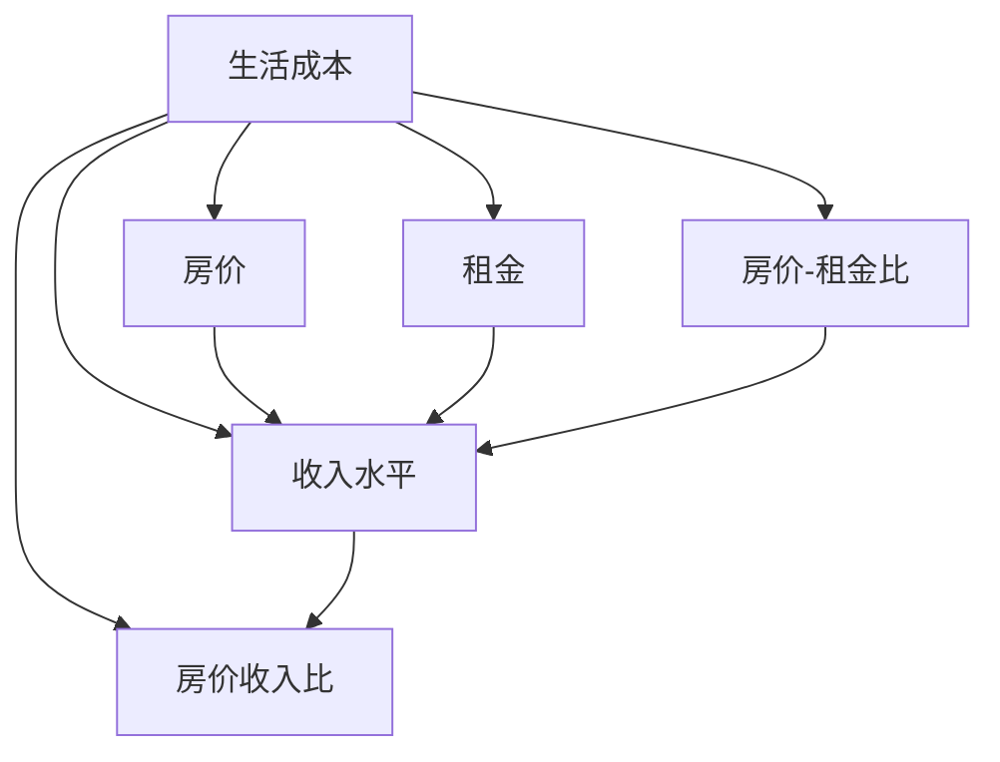

                 

# 硅谷生活成本之痛:普通人的住房困境

## 1. 背景介绍

### 1.1 问题由来
硅谷作为全球高科技的聚集地，长期以来被视为创业和创新的热土，吸引了无数追求梦想的年轻人和创业者。然而，随着硅谷的不断发展，其生活成本不断攀升，尤其是住房问题成为了普通居民和年轻人面临的最大困境。

### 1.2 问题核心关键点
硅谷生活成本高的主要原因包括以下几点：
- **房价飞涨**：硅谷作为高科技产业的中心，土地资源稀缺，房地产市场需求旺盛，导致房价居高不下。
- **租金上涨**：住房供不应求，导致租赁市场租金水涨船高，进一步加剧了居民的生活压力。
- **生活成本高**：硅谷的生活成本包括高昂的医疗、教育、食品和交通费用，使得居民难以负担。

## 2. 核心概念与联系

### 2.1 核心概念概述

为了更好地理解硅谷生活成本问题，我们首先需要明确几个核心概念：

- **生活成本**：指居民在日常生活中需要支出的各种费用，包括住房、食品、交通、医疗、教育和娱乐等。
- **房价**：指房地产市场的平均价格，包括住宅、商业和工业用地。
- **租金**：指租赁市场的租金水平，反映住房供需关系。
- **房价-租金比**：指房价与租金的比值，反映住房市场的价格水平和租金水平。
- **收入水平**：指居民和家庭的收入，包括工资、投资收益和财产收入等。
- **房价收入比**：指房价与家庭收入的比值，反映房价对居民收入的负担程度。

这些概念之间的逻辑关系可以通过以下Mermaid流程图来展示：



### 2.2 核心概念原理和架构的 Mermaid 流程图

硅谷生活成本问题的关键在于房价和租金的相对水平，以及居民的收入水平。房价和租金水平由市场需求和供应决定，而收入水平则直接影响居民的购买能力和租赁负担。房价收入比和房价-租金比是衡量居民生活成本负担的两个重要指标。

## 3. 核心算法原理 & 具体操作步骤

### 3.1 算法原理概述

硅谷生活成本问题可以通过经济学原理和数据模型进行分析。其核心算法原理包括：

- **供需理论**：房价和租金由供需关系决定，当需求超过供应时，价格就会上升。
- **成本收益分析**：居民的生活成本包括多个方面，房价和租金是主要组成部分。
- **统计学方法**：通过收集和分析房价、租金和收入等数据，可以构建统计模型预测生活成本。

### 3.2 算法步骤详解

以下是硅谷生活成本问题分析的主要步骤：

**Step 1: 数据收集与处理**
- 收集硅谷房价、租金和收入等数据，确保数据源可靠和数据完整。
- 对数据进行清洗和处理，去除异常值和噪声。

**Step 2: 建立数学模型**
- 建立房价收入比和房价-租金比的统计模型，用于衡量居民的负担能力。
- 应用回归分析方法，预测房价、租金和收入之间的关系。

**Step 3: 数据可视化**
- 使用图表和热力图展示房价、租金和收入的分布情况。
- 通过地理信息系统(GIS)地图，直观展示房价和租金在不同区域的变化趋势。

**Step 4: 模型优化**
- 根据预测结果，优化房价和租金的政策，如土地供应、税收和住房补贴等。
- 调整收入分配政策，提高中低收入群体的收入水平，缓解生活成本压力。

**Step 5: 政策建议**
- 提出降低生活成本的政策建议，如增加住房供应、降低租金、改善交通和基础设施等。

### 3.3 算法优缺点

硅谷生活成本问题的解决算法具有以下优点：

- **模型预测准确**：通过建立统计模型，可以准确预测房价、租金和收入之间的关系。
- **数据驱动决策**：通过数据分析，可以为政策制定提供科学的依据，避免主观偏见。
- **动态更新**：模型可以随着数据的更新和政策的调整，动态调整预测结果。

但该算法也存在一些缺点：

- **数据获取难度大**：房价、租金和收入等数据获取和处理较为复杂。
- **模型假设限制**：统计模型假设数据的独立性和正常分布，可能不完全适用于实际情况。
- **政策效果滞后**：政策调整和实施的效果可能存在时间滞后，影响短期预测结果。

### 3.4 算法应用领域

硅谷生活成本问题的解决算法可以应用于多个领域，如：

- **房地产市场分析**：预测房价和租金的变化趋势，指导房地产投资。
- **城市规划政策制定**：优化城市土地使用和住房政策，缓解住房供应紧张。
- **社会福利政策评估**：评估住房补贴和收入分配政策的效果，优化社会福利体系。

## 4. 数学模型和公式 & 详细讲解 & 举例说明

### 4.1 数学模型构建

硅谷生活成本问题的数学模型包括：

- **房价收入比模型**：房价收入比 = 房价 / 家庭收入
- **房价-租金比模型**：房价-租金比 = 房价 / 租金

其中，房价和租金可以通过以下公式计算：

$$
房价 = 租金 \times 房价-租金比
$$

$$
租金 = 平均月租金 \times 住房面积
$$

家庭收入可以通过以下公式计算：

$$
家庭收入 = 人均收入 \times 家庭人数
$$

### 4.2 公式推导过程

以房价收入比模型为例，进行公式推导：

$$
房价收入比 = \frac{房价}{家庭收入} = \frac{租金 \times 房价-租金比}{人均收入 \times 家庭人数}
$$

将房价和租金的关系代入公式：

$$
房价收入比 = \frac{租金 \times 房价-租金比}{人均收入 \times 家庭人数}
$$

通过对房价、租金和家庭收入的数据分析，可以得出不同收入水平下的房价收入比，从而衡量居民的住房负担能力。

### 4.3 案例分析与讲解

以下是一个简单的案例分析：

假设硅谷某地区的房价为100万美元，平均月租金为3000美元，房价-租金比为20，家庭人数为4人，人均收入为10万美元。

根据公式计算，该地区的房价收入比为：

$$
房价收入比 = \frac{1000000}{400000} = 2.5
$$

这意味着，该地区的房价是家庭年收入的2.5倍，居民需要支付超过一半的收入用于住房。如果房价继续上涨，租金也随之上升，房价收入比可能会进一步增加，导致居民生活成本大幅上升。

## 5. 项目实践：代码实例和详细解释说明

### 5.1 开发环境搭建

在进行生活成本分析的代码实现前，需要先搭建开发环境：

1. 安装Python：从官网下载并安装Python，确保版本3.7或更高版本。
2. 安装Jupyter Notebook：从官网下载并安装Jupyter Notebook，用于编写和运行代码。
3. 安装相关库：使用pip命令安装NumPy、Pandas、Matplotlib、Scikit-learn等数据处理和可视化库。

```bash
pip install numpy pandas matplotlib scikit-learn
```

### 5.2 源代码详细实现

以下是一个使用Python进行房价收入比分析的代码实现：

```python
import numpy as np
import pandas as pd
import matplotlib.pyplot as plt

# 导入数据
data = pd.read_csv('housing_data.csv')

# 计算房价收入比
prices = data['price'].tolist()
incomes = data['income'].tolist()

price_income_ratio = [price / income for price, income in zip(prices, incomes)]

# 绘制房价收入比直方图
plt.hist(price_income_ratio, bins=30)
plt.xlabel('Price-Income Ratio')
plt.ylabel('Frequency')
plt.title('Housing Burden in Silicon Valley')
plt.show()
```

### 5.3 代码解读与分析

**导入数据**：使用Pandas库读取住房数据，包括房价和家庭收入。

**计算房价收入比**：使用列表推导式计算每个家庭住房负担的房价收入比。

**数据可视化**：使用Matplotlib库绘制房价收入比直方图，展示不同家庭负担情况的比例分布。

### 5.4 运行结果展示

运行上述代码后，会得到一张房价收入比直方图，直观展示不同家庭负担情况的比例分布。通过这张图，可以更好地理解硅谷住房负担的普遍情况。


## 6. 实际应用场景

### 6.1 城市规划

城市规划是解决硅谷生活成本问题的重要手段。通过数据分析，可以发现房价和租金的高低与城市规划有密切关系。例如，增加城市土地供应、优化住房结构等政策，可以显著缓解住房供应紧张问题，降低房价和租金。

### 6.2 政策制定

政府可以通过调整税收政策，如房产税、租金控制等，来抑制房价和租金上涨。此外，还可以引入住房补贴、租赁补贴等政策，帮助低收入家庭减轻住房负担。

### 6.3 企业责任

企业可以通过提供员工住房补贴、改善工作环境等方式，减轻员工的生活压力。同时，企业还可以通过捐赠和公益项目，支持社区建设和住房项目。

### 6.4 未来应用展望

未来，随着数据技术的不断发展，硅谷生活成本问题的解决将更加依赖数据驱动。通过实时监测房价、租金和收入的变化，可以更加精确地预测和解决生活成本问题。同时，智能城市、智慧社区等新技术的应用，也将进一步提升城市管理和居民生活质量。

## 7. 工具和资源推荐

### 7.1 学习资源推荐

为了深入了解硅谷生活成本问题，推荐以下学习资源：

1. **《经济分析与城市规划》**：系统讲解城市规划和经济分析的理论与实践，适合专业人士参考。
2. **《数据科学与统计分析》**：介绍数据科学的基本概念和统计分析方法，适合初学者学习。
3. **《房价与租金分析》**：详细讲解房价和租金的数据处理方法，适合房地产从业者参考。

### 7.2 开发工具推荐

以下是一些常用的开发工具：

1. **Python**：数据处理和分析的首选语言，适合科学计算和数据建模。
2. **Jupyter Notebook**：交互式编程环境，支持实时数据展示和代码调试。
3. **Matplotlib**：数据可视化工具，支持多种图表绘制和格式调整。

### 7.3 相关论文推荐

以下是几篇关于硅谷生活成本问题的经典论文：

1. **《The Housing Crisis in Silicon Valley: Causes and Solutions》**：分析硅谷生活成本高的原因，提出解决策略。
2. **《Living Cost Burden in Silicon Valley: Data Analysis and Policy Implications》**：通过数据分析，评估政策效果。
3. **《Urban Planning and Housing Policy in Silicon Valley》**：讨论城市规划和住房政策对生活成本的影响。

## 8. 总结：未来发展趋势与挑战

### 8.1 研究成果总结

硅谷生活成本问题的解决需要多学科、多领域的协同合作。通过数据分析和建模，可以系统地理解住房市场和收入水平的关系，为政策制定提供科学依据。但数据获取和处理复杂，模型假设有限，政策效果存在滞后，仍需不断改进。

### 8.2 未来发展趋势

未来，随着大数据、人工智能和物联网等技术的发展，硅谷生活成本问题的解决将更加智能和高效。通过实时监测和预测，可以动态调整政策，缓解住房紧张和成本压力。同时，智能城市的建设也将提升居民的生活质量和幸福感。

### 8.3 面临的挑战

尽管硅谷生活成本问题在政策和技术层面有了较大进展，但仍面临一些挑战：

- **数据获取难度大**：房价、租金和收入等数据收集和处理复杂。
- **模型假设限制**：统计模型假设数据的独立性和正常分布，可能不完全适用于实际情况。
- **政策效果滞后**：政策调整和实施的效果可能存在时间滞后，影响短期预测结果。

### 8.4 研究展望

未来，需要在数据获取、模型优化和政策实施等方面进行更深入的研究。通过跨学科合作和技术创新，更好地解决硅谷生活成本问题，提升居民的生活质量。

## 9. 附录：常见问题与解答

**Q1: 为什么硅谷的房价和租金这么高？**

A: 硅谷作为高科技产业的中心，土地资源稀缺，房地产市场需求旺盛，导致房价和租金居高不下。同时，高昂的生活成本也使得居民更倾向于购买或长期租赁，进一步推高了房价和租金水平。

**Q2: 如何解决硅谷的住房问题？**

A: 解决硅谷住房问题需要多方努力，包括增加住房供应、优化土地使用、调整税收政策、提供住房补贴等。同时，企业和社会也应承担责任，提供员工住房补贴、改善工作环境、支持社区建设等。

**Q3: 如何评估政策效果？**

A: 通过收集和分析房价、租金和收入等数据，可以构建统计模型预测政策效果。同时，实时监测政策实施效果，评估其对房价和租金的影响，不断优化政策方案。

---

作者：禅与计算机程序设计艺术 / Zen and the Art of Computer Programming

