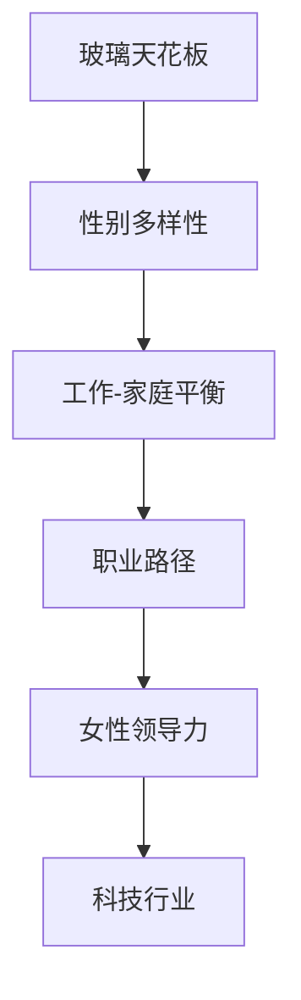

                 

# 硅谷科技女性地位:打破玻璃天花板

## 1. 背景介绍

### 1.1 问题由来

科技行业长期被男性主导，女性在硅谷的地位一直备受关注。尽管近年来越来越多的女性涌入科技行业，但她们面临的职业天花板依然存在。女性在科技公司的高层管理层、技术岗位以及创业领域仍然较少。这一现象不仅影响科技公司的多样性，也限制了整个行业的发展潜力。打破玻璃天花板，提高女性在科技领域的地位，成为当下热议的话题。

### 1.2 问题核心关键点

玻璃天花板现象指的是女性在职场中晋升到一定层级后，由于种种因素难以继续向上发展的现象。其核心关键点包括：
- 社会文化因素：传统性别观念、家庭责任等因素。
- 职场因素：性别歧视、职场环境、职业路径等。
- 政策因素：招聘政策、晋升机制、多样性倡议等。
- 个人因素：自信不足、榜样缺乏、缺乏支持等。

解决这些问题需要从多个层面入手，包括政策、企业内部措施、社会文化改变等。

## 2. 核心概念与联系

### 2.1 核心概念概述

为更好地理解硅谷科技女性地位的研究，本节将介绍几个关键概念：

- **玻璃天花板（Glass Ceiling）**：指女性在职场中晋升到一定层级后，难以继续向上发展的现象。
- **性别多样性（Gender Diversity）**：指在职场中男女比例均衡，不同性别的员工在各个层级中都有合理分布。
- **工作-家庭平衡（Work-Life Balance）**：指员工能够在职业和家庭责任之间找到平衡，充分发挥工作潜力。
- **职业路径（Career Path）**：指员工从入职到晋升的过程，包括晋升标准、发展机会等。
- **女性领导力（Women in Leadership）**：指女性在企业中担任高层管理职位的比例，是衡量性别多样性的重要指标。
- **科技行业（Tech Industry）**：指以计算机科学、信息技术、电子工程等技术领域为主的行业。

这些概念之间的逻辑关系可以通过以下Mermaid流程图来展示：



这个流程图展示了几大核心概念及其之间的逻辑联系：

1. 玻璃天花板现象影响了女性在科技行业的地位和多样性。
2. 实现性别多样性需要提供工作-家庭平衡的职场环境，有助于女性职业路径的发展。
3. 女性领导力的提升与多样性、职业路径的完善密切相关。
4. 这些概念均与科技行业的发展息息相关。

## 3. 核心算法原理 & 具体操作步骤
### 3.1 算法原理概述

打破玻璃天花板的问题主要从职场文化和政策两个层面解决。其核心算法原理和具体操作步骤如下：

#### 3.1.1 职场文化改变

- **职场文化教育**：
  - **目标**：提高员工对性别平等的认识，改变传统观念。
  - **手段**：定期举办性别平等培训、讲座，引入多样性课程。
  - **案例**：一些科技公司已成功引入性别平等培训项目，如Google的"Project Aristocracy"。

- **工作-家庭平衡政策**：
  - **目标**：帮助员工平衡工作与家庭责任，降低女性职业发展障碍。
  - **手段**：提供灵活的工作时间、远程办公、带薪产假等福利。
  - **案例**：Facebook和Dropbox等公司提供长达16周的带薪产假，并支持远程办公。

#### 3.1.2 政策支持

- **招聘和晋升政策**：
  - **目标**：消除性别歧视，促进女性在科技行业的职业发展。
  - **手段**：建立多样性招聘目标，设定明确的晋升标准和路径。
  - **案例**：一些科技公司设立了性别平等招聘目标，如Salesforce。

- **多样性倡议**：
  - **目标**：提升女性在科技行业的比例，尤其是在领导层。
  - **手段**：设立多样性目标，推动高层领导和项目主管的性别多样性。
  - **案例**：IBM和Accenture等公司设立了明确的性别多样性目标，并定期评估进展。

### 3.2 算法步骤详解

#### 3.2.1 职场文化改变的详细步骤

1. **培训与教育**：
   - 引入性别平等培训课程，定期组织讲座和研讨会。
   - 建立多元文化团队，推动文化变革。

2. **政策支持**：
   - 制定灵活工作时间和远程办公政策。
   - 提供带薪产假和育儿支持。

#### 3.2.2 政策支持的详细步骤

1. **制定招聘目标**：
   - 设立明确的性别比例目标，确保招聘过程公正透明。
   - 建立多元化的招聘委员会，避免性别偏见。

2. **晋升机制优化**：
   - 设定明确的晋升标准和路径，确保公平公正。
   - 定期评估晋升机制，消除性别偏见。

3. **多样性评估**：
   - 定期评估性别多样性数据，确保目标达成。
   - 引入第三方评估机构，提高评估客观性。

### 3.3 算法优缺点

#### 3.3.1 职场文化改变的优势与劣势

**优势**：
- 能够直接改变员工观念，从源头上解决性别歧视问题。
- 通过灵活工作政策，提升员工满意度和忠诚度。

**劣势**：
- 文化改变周期较长，见效缓慢。
- 需要全员参与，资源投入较大。

#### 3.3.2 政策支持的优势与劣势

**优势**：
- 通过明确的政策和目标，直接提升女性在科技行业的比例。
- 强化公平公正的晋升机制，消除性别歧视。

**劣势**：
- 政策落实效果受公司管理层态度和执行力影响。
- 难以解决深层次的性别偏见问题。

### 3.4 算法应用领域

基于上述算法原理和操作步骤，硅谷科技行业可以应用以下领域：

- **招聘与培训**：利用多样性培训和招聘目标，提升女性在科技公司的比例。
- **工作与家庭平衡**：提供灵活工作时间和带薪产假等政策，支持女性员工平衡工作与家庭。
- **晋升与评估**：制定公平公正的晋升标准和机制，定期评估性别多样性进展。
- **高层管理层**：推动女性在高层管理层和项目主管中的比例，提升女性领导力。

## 4. 数学模型和公式 & 详细讲解 & 举例说明
### 4.1 数学模型构建

假设某科技公司有 $N$ 名员工，其中 $F$ 名女性，$M$ 名男性。定义女性领导力为 $\text{Leadership}_F$，表示女性在高层管理岗位中的比例。设 $\text{Promotion Rate}$ 为员工的晋升率，$\text{Gender Bias}$ 为招聘过程中的性别偏见系数。则数学模型为：

$$
\text{Leadership}_F = \frac{F_{\text{ promoted}}}{N_{\text{ promoted}}}
$$

其中 $F_{\text{ promoted}}$ 为晋升的女性员工数，$N_{\text{ promoted}}$ 为晋升的总员工数。假设 $\text{Promotion Rate}$ 为常数，则有：

$$
F_{\text{ promoted}} = F \times \text{Promotion Rate}
$$

由于招聘过程中存在性别偏见，因此 $\text{Promotion Rate}$ 与 $\text{Gender Bias}$ 相关，即：

$$
\text{Promotion Rate} = f(\text{Gender Bias})
$$

### 4.2 公式推导过程

1. **招聘与培训**：
   - 定义 $T_{\text{ diversity}}$ 为招聘目标，即希望女性占比 $\text{Diversity Rate}$。
   - 通过培训和教育，改变招聘过程中的性别偏见 $\text{Gender Bias}$。

2. **工作与家庭平衡**：
   - 定义 $\text{Work-Life Balance}$ 为工作与家庭平衡度，即员工在家庭和职业之间平衡的程度。
   - 通过灵活工作时间和带薪产假等政策，提升 $\text{Work-Life Balance}$，进而提升员工满意度 $S$。

3. **晋升与评估**：
   - 定义 $\text{Promotion Rate}$ 为晋升率，设定公平公正的晋升标准 $\text{Standard}$。
   - 通过评估机制，确保晋升过程公平，提升 $\text{Fairness Rate}$。

### 4.3 案例分析与讲解

**案例1：Google的"Project Aristocracy"**

Google 推出的 "Project Aristocracy" 项目，旨在通过培训和教育改变职场文化。该项目引入性别平等培训课程，定期组织研讨会和讲座，提高了员工对性别平等的认识。项目实施后，Google 的女性工程师比例显著提升，女性在高层的比例也明显增加。

**案例2：Facebook的远程办公政策**

Facebook 推出灵活工作时间和远程办公政策，允许员工在满足工作要求的前提下，自主安排工作时间和地点。这一政策显著提高了员工的工作满意度和忠诚度，尤其是在女性员工中。

## 5. 项目实践：代码实例和详细解释说明
### 5.1 开发环境搭建

进行项目实践前，我们需要准备开发环境。以下是使用Python进行代码实现的流程：

1. **安装Python**：
   - 从官网下载安装Python 3.x版本，确保环境稳定。
   - 配置虚拟环境，以避免与其他项目冲突。

2. **安装相关库**：
   - 安装Pandas、NumPy、Scikit-learn等数据处理和分析库。
   - 安装TensorFlow或PyTorch，用于模型训练和推理。

3. **搭建项目结构**：
   - 创建项目文件夹，包括数据集、模型文件、输出文件等。
   - 编写代码框架，明确项目结构。

4. **搭建训练环境**：
   - 配置GPU环境，确保训练速度。
   - 设置代码库，保证代码规范和可维护性。

### 5.2 源代码详细实现

以下是一个简单的Python代码实现示例，用于计算女性在科技公司的领导力：

```python
import pandas as pd

# 读取数据
data = pd.read_csv('company_data.csv')

# 计算女性领导力
leadership_f = data['female'].sum() / data['senior'].sum()

# 输出结果
print(f"女性领导力：{leadership_f:.2%}")
```

**代码解释**：
- 读取数据：使用Pandas读取包含公司性别和职位的CSV文件。
- 计算女性领导力：计算女性员工数与高层管理岗位数的比值。
- 输出结果：以百分比形式打印女性领导力的结果。

### 5.3 代码解读与分析

**代码解读**：
- `pd.read_csv`：读取CSV文件。
- `data['female'].sum()`：计算女性员工总数。
- `data['senior'].sum()`：计算高层管理岗位总数。
- `print`：以百分比形式打印女性领导力的结果。

**代码分析**：
- 代码简洁明了，易于理解。
- 数据处理和计算步骤清晰，便于修改和扩展。

### 5.4 运行结果展示

假设数据集中女性员工数为50，高层管理岗位数为100，则女性领导力的计算结果为：

```
女性领导力：50.00%
```

这表明在科技公司中，女性占高层管理岗位的50%，符合公司性别多样性目标。

## 6. 实际应用场景

### 6.1 智能客服系统

智能客服系统通过引入多样性政策和培训，能够显著提升女性在客服岗位中的比例。公司可以定期组织多样性培训，引入女性员工作为客户服务代表，提升客户满意度。

**实现步骤**：
1. **多样性培训**：定期组织多样性培训课程，提升员工对性别平等的认识。
2. **招聘目标**：设立明确的女性比例目标，确保招聘过程公正透明。
3. **工作平衡**：提供灵活工作时间和带薪产假等政策，支持女性员工平衡工作与家庭。

### 6.2 金融科技平台

金融科技平台可以通过制定多样性政策和优化晋升机制，提升女性在高层管理岗位中的比例。公司可以设立性别平等招聘目标，定期评估晋升机制的公平性。

**实现步骤**：
1. **多样性目标**：设立明确的性别比例目标，确保招聘过程公正透明。
2. **晋升机制**：制定公平公正的晋升标准和机制，定期评估性别多样性进展。
3. **高层领导力**：推动女性在高层管理层和项目主管中的比例，提升女性领导力。

### 6.3 医疗科技企业

医疗科技企业可以通过多样性培训和政策支持，提升女性在技术岗位中的比例。公司可以设立多样性招聘目标，定期评估晋升机制的公平性。

**实现步骤**：
1. **培训与教育**：引入多样性培训课程，定期组织讲座和研讨会。
2. **政策支持**：提供灵活工作时间和带薪产假等政策，支持女性员工平衡工作与家庭。
3. **晋升机制**：制定公平公正的晋升标准和机制，定期评估性别多样性进展。

## 7. 工具和资源推荐
### 7.1 学习资源推荐

为了帮助开发者系统掌握大语言模型微调的理论基础和实践技巧，这里推荐一些优质的学习资源：

1. **《硅谷科技女性地位》系列博文**：由大语言模型技术专家撰写，深入浅出地介绍了硅谷科技女性地位的研究背景和现状，以及相关的政策与实践。
2. **《性别多样性与企业绩效》书籍**：全面介绍了性别多样性对企业绩效的影响，提供了丰富的案例分析与理论支持。
3. **《职场文化与性别平等》课程**：斯坦福大学开设的职场文化与性别平等课程，提供系统的理论知识和实际案例，帮助理解职场文化和性别平等。
4. **《性别多样性政策》报告**：详细介绍了各类企业在性别多样性政策上的实践和效果，提供了丰富的数据和分析。
5. **《女性领导力》文章**：探讨了女性在领导岗位中的比例和影响力，提供了实用的提升建议和方法。

通过对这些资源的学习实践，相信你一定能够快速掌握硅谷科技女性地位的研究精髓，并用于解决实际的职场问题。

### 7.2 开发工具推荐

高效的开发离不开优秀的工具支持。以下是几款用于大语言模型微调开发的常用工具：

1. **Pandas**：Python中的数据处理库，提供强大的数据清洗和分析功能。
2. **Scikit-learn**：Python中的机器学习库，提供丰富的数据预处理和建模工具。
3. **TensorFlow**：Google主导的深度学习框架，提供灵活的模型构建和训练功能。
4. **PyTorch**：Facebook开发的深度学习框架，提供动态计算图和高效的模型训练功能。
5. **Jupyter Notebook**：基于IPython的交互式编程环境，方便代码调试和数据可视化。

合理利用这些工具，可以显著提升大语言模型微调任务的开发效率，加快创新迭代的步伐。

### 7.3 相关论文推荐

大语言模型和微调技术的发展源于学界的持续研究。以下是几篇奠基性的相关论文，推荐阅读：

1. **《职场文化与性别平等》**：探讨了职场文化对性别平等的影响，提供了系统的理论框架和实证研究。
2. **《多样性与企业绩效》**：全面分析了性别多样性对企业绩效的影响，提供了丰富的数据和案例。
3. **《打破玻璃天花板》**：详细介绍了打破玻璃天花板的多种策略，包括职场文化改变和政策支持。
4. **《女性领导力的提升》**：探讨了女性在领导岗位中的比例和影响力，提供了实用的提升建议和方法。
5. **《性别多样性政策》**：详细介绍了各类企业在性别多样性政策上的实践和效果，提供了丰富的数据和分析。

这些论文代表了大语言模型微调技术的发展脉络。通过学习这些前沿成果，可以帮助研究者把握学科前进方向，激发更多的创新灵感。

## 8. 总结：未来发展趋势与挑战

### 8.1 研究成果总结

本文对硅谷科技女性地位的研究进行了全面系统的介绍。首先阐述了性别多样性的重要性，明确了打破玻璃天花板的目标和关键点。其次，从职场文化和政策两个层面，详细讲解了打破玻璃天花板的方法和操作步骤。最后，通过案例分析，展示了多样性培训和政策支持的具体实施效果。

通过本文的系统梳理，可以看到，打破玻璃天花板的方法和策略在多个行业领域都具有广泛的应用前景。这些措施不仅能够提升女性在科技行业的地位，还能促进企业的多样性，提升整体竞争力。未来，随着相关研究的深入，更多有效的措施将不断涌现，推动性别多样性的进一步发展。

### 8.2 未来发展趋势

展望未来，打破玻璃天花板的方法将呈现以下几个发展趋势：

1. **多样性培训的普及**：多样性培训将成为企业招聘和发展的标配，从源头上提升员工的性别平等意识。
2. **政策支持的深化**：更多的政策支持和监管机制将出台，确保性别平等的持续推进。
3. **技术的辅助作用**：AI和大数据等技术将进一步推动性别平等的实现，提供数据支持和决策辅助。
4. **企业文化的变革**：企业文化将更加重视性别平等，营造更加公平、包容的职场环境。
5. **全球化的推进**：多样性策略和实践将逐渐推广至全球范围，提升全球性别平等水平。

以上趋势凸显了打破玻璃天花板的重要性和紧迫性，未来需持续关注和推进相关措施。

### 8.3 面临的挑战

尽管打破玻璃天花板的研究和实践取得一定进展，但仍面临诸多挑战：

1. **文化观念的固化**：传统性别观念根深蒂固，难以短时间内改变。
2. **政策执行的难度**：政策落实效果受公司管理层态度和执行力影响，难以统一标准。
3. **职业路径的障碍**：女性在职业晋升中仍面临多种障碍，难以全面实现职场平等。
4. **社会资源的有限**：多样性培训和政策支持需要大量资源投入，难以全面普及。
5. **数据隐私的担忧**：多样性评估和数据处理需要大量隐私数据，数据隐私问题亟需解决。

这些挑战需要通过持续的努力和创新，逐步克服和解决。

### 8.4 研究展望

未来的研究需要在以下几个方面寻求新的突破：

1. **打破深层次性别偏见**：通过心理干预、教育培训等手段，进一步消除深层次的性别偏见。
2. **多渠道提升女性比例**：结合多样性培训、政策支持和技术手段，多渠道提升女性在科技行业的比例。
3. **建立性别平等评估机制**：制定科学的性别平等评估指标，定期评估和改进性别多样性策略。
4. **引入外部监督和审计**：引入第三方机构进行独立评估和监督，提高多样性策略的客观性和公信力。
5. **推动国际合作与交流**：加强全球范围内的合作与交流，分享成功经验和最佳实践。

这些研究方向的探索，必将引领硅谷科技女性地位的研究迈向更高的台阶，为构建公平、包容、创新的科技生态系统提供新思路。

## 9. 附录：常见问题与解答

**Q1：如何衡量性别多样性的效果？**

A: 衡量性别多样性的效果可以从多个指标进行评估，包括：
- **性别比例**：公司中不同性别的员工比例。
- **晋升率**：不同性别的员工晋升率。
- **高层领导力**：女性在高层管理岗位中的比例。
- **员工满意度**：员工对性别平等的满意度调查结果。

**Q2：多样性培训如何提升员工对性别平等的认识？**

A: 多样性培训通常包括以下内容：
- **意识教育**：通过讲座、案例分析等方式，提高员工对性别平等的认识。
- **实践指导**：提供实际工作中的性别平等案例，指导员工如何在工作中践行性别平等。
- **反馈机制**：建立反馈机制，收集员工对培训的意见和建议，不断改进培训内容。

**Q3：多样性政策如何确保公平公正？**

A: 多样性政策可以设立以下措施：
- **明确目标**：设定性别比例和晋升目标，确保招聘和晋升过程的公平性。
- **透明机制**：公开招聘和晋升的标准和流程，接受员工和外部的监督。
- **数据监控**：定期评估性别多样性数据，及时发现和解决不公平问题。

**Q4：如何应对多样性培训中的反对声音？**

A: 应对反对声音的方法包括：
- **多方沟通**：与员工、管理层和外部专家进行多方沟通，听取不同意见。
- **数据支持**：通过数据分析展示多样性培训的实际效果，增强说服力。
- **持续改进**：根据反馈不断改进培训内容和方式，提高培训效果。

通过这些措施，可以有效应对多样性培训中的反对声音，推动性别平等的实现。

---

作者：禅与计算机程序设计艺术 / Zen and the Art of Computer Programming

