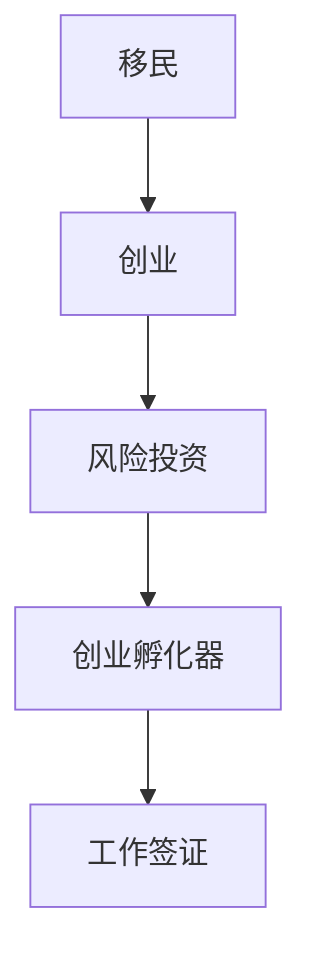

                 

# 硅谷移民故事:寻梦与创业之路

硅谷，这个位于美国加州的地区，以其浓厚的创业氛围、创新的企业文化和技术突破而闻名于世。在这里，无数的移民怀揣着对技术的热爱和改变世界的梦想，奋发图强，最终实现了自己的创业梦想。本文将从背景介绍、核心概念、算法原理、实际操作、应用领域等多个方面，深入剖析硅谷移民在创业之路上的艰辛与成就。

## 1. 背景介绍

### 1.1 问题由来

硅谷的崛起，得益于其独特的地理、人才和政策优势。这里是全球顶尖高校和研究机构云集之地，拥有丰富的科技人才资源。同时，它毗邻旧金山湾区，靠近苹果、谷歌、Facebook等全球顶级科技企业，创业氛围异常浓厚。

然而，创业并非易事。硅谷的竞争激烈，市场变化快速，成功创业需要敢于冒险、善于创新。许多移民来到硅谷，希望能在这里找到机会，实现自己的科技梦想。

### 1.2 问题核心关键点

对于硅谷移民来说，成功创业的关键点包括：

- **技术积淀**：移民通常拥有卓越的技术背景，丰富的工程经验，和深厚的理论知识。
- **创新思维**：移民容易接受新事物，敢于挑战传统，对新兴技术有敏锐的洞察力。
- **市场理解**：尽管拥有技术优势，但了解市场和用户需求，对移民创业同样重要。
- **抗压能力**：创业之路充满挑战，面对失败和挫折，移民需要强大的心理韧性。
- **跨文化能力**：硅谷的国际化氛围，要求移民具备良好的跨文化交流能力，处理多元化的团队合作。

这些核心关键点共同构成了硅谷移民在创业过程中需要具备的重要素质。

## 2. 核心概念与联系

### 2.1 核心概念概述

本文将介绍几个与硅谷移民创业紧密相关的核心概念：

- **移民**：指来到硅谷追求技术梦想，寻求事业发展的外国人士。
- **创业**：指从零开始，通过开发和运营新产品或服务，实现商业价值的创造和积累。
- **风险投资**：指专注于早期技术创业公司的投资，是硅谷创业生态的重要组成部分。
- **创业孵化器**：提供办公空间、指导和融资等资源，帮助初创公司成长。
- **工作签证**：允许外国专业人士在硅谷合法工作的签证类型，如H1B、O1等。

这些概念之间通过以下Mermaid流程图建立联系：



## 3. 核心算法原理 & 具体操作步骤

### 3.1 算法原理概述

硅谷移民创业过程中的核心算法原理，主要集中在风险管理和市场分析两方面。

- **风险管理**：通过量化风险，选择合适的项目进行投资，分散投资风险，平衡收益和风险。
- **市场分析**：利用大数据和机器学习技术，对市场趋势和用户需求进行预测和分析，优化产品策略。

### 3.2 算法步骤详解

#### 3.2.1 风险评估

风险评估是硅谷移民创业的重要环节，一般包括以下步骤：

1. **数据收集**：收集项目相关的各种数据，如市场规模、竞争对手、技术难度等。
2. **风险量化**：使用数学模型和统计方法，量化项目的风险水平，如标准差、VaR等。
3. **风险管理**：根据风险量化结果，选择合适的投资策略，分散风险，如组合投资、再保险等。

#### 3.2.2 市场分析

市场分析是硅谷移民创业的另一个重要环节，一般包括以下步骤：

1. **用户画像**：使用聚类分析等技术，刻画目标用户的基本特征和需求。
2. **市场趋势**：利用时间序列分析等方法，预测市场的发展趋势，捕捉机会。
3. **竞争分析**：通过网络爬虫、社交媒体分析等手段，了解竞争对手的情况，制定竞争策略。

#### 3.3 算法优缺点

**优点**：
- **数据驱动**：通过数据和算法，做出更为客观的决策，减少主观偏差。
- **系统化**：流程化和标准化的评估和分析，提升了决策的效率和可靠性。

**缺点**：
- **高成本**：数据收集和算法模型开发需要投入大量人力和资金。
- **复杂性**：量化和分析过程复杂，需要专业的知识和技能。
- **时效性差**：市场和技术的快速变化，可能导致模型失效。

#### 3.4 算法应用领域

硅谷移民创业过程中，风险管理和市场分析的应用领域主要包括：

1. **风险投资**：在评估创业项目时，量化风险，做出投资决策。
2. **创业孵化器**：通过分析市场和竞争环境，指导初创公司优化战略，提高成功率。
3. **技术公司**：在产品研发和市场推广阶段，使用市场分析指导决策，提高收益。
4. **政策制定**：政府通过数据分析，制定更为科学有效的创业扶持政策。

## 4. 数学模型和公式 & 详细讲解 & 举例说明

### 4.1 数学模型构建

本文以风险管理和市场分析为例，构建数学模型：

- **风险评估模型**：使用方差-协方差矩阵（VaR模型），量化项目风险。
- **市场分析模型**：使用时间序列分析（ARIMA模型），预测市场趋势。

### 4.2 公式推导过程

**VaR模型**：

$$
VaR_{\alpha}(r) = \frac{1}{1-\alpha} \cdot \int_r^{\infty} \frac{1}{\sqrt{2\pi}}e^{-\frac{t^2}{2}} dt
$$

其中，$\alpha$ 为置信度，$r$ 为投资收益率。

**ARIMA模型**：

$$
y_t = \sum_{i=0}^p \phi_i y_{t-i} + \sum_{j=1}^q \theta_j \epsilon_{t-j} + \epsilon_t
$$

其中，$y_t$ 为时间序列数据，$\phi_i$ 为自回归系数，$\theta_j$ 为差分系数，$\epsilon_t$ 为随机误差项。

### 4.3 案例分析与讲解

**案例分析**：

假设某移民创业项目涉及开发一款移动应用，旨在提升健康监测功能。使用VaR模型量化项目风险，评估项目潜在损失。同时使用ARIMA模型预测健康监测市场的发展趋势，判断市场潜力。

**讲解**：

1. **数据收集**：收集应用程序的开发成本、市场规模、竞争对手数据等。
2. **风险量化**：计算项目的VaR值，判断风险水平。
3. **市场分析**：使用ARIMA模型，预测健康监测市场的未来趋势，分析市场潜力。
4. **决策支持**：根据风险和市场分析结果，决定是否投资，优化项目策略。

## 5. 项目实践：代码实例和详细解释说明

### 5.1 开发环境搭建

为便于硅谷移民创业实践，本文推荐使用Python语言，搭配Jupyter Notebook环境，实现数据分析和建模。

**环境搭建**：

1. **安装Python**：使用Anaconda或Miniconda，安装最新版本的Python。
2. **安装Jupyter Notebook**：使用pip或conda安装Jupyter Notebook。
3. **安装相关库**：安装numpy、pandas、scikit-learn等数据分析和机器学习库。

### 5.2 源代码详细实现

以下是一个简单的Python代码示例，用于计算VaR模型：

```python
import numpy as np
from scipy.stats import norm

def VaR(alpha, t, returns):
    z_alpha = norm.ppf(1 - alpha, 0, 1)
    VaR_value = -z_alpha * np.sqrt(t * returns.var())
    return VaR_value

# 示例计算
alpha = 0.05
t = 1  # 年
returns = 0.1  # 年化收益率
VaR_value = VaR(alpha, t, returns)
print("VaR值：", VaR_value)
```

### 5.3 代码解读与分析

**代码解读**：

- **VaR函数**：使用scipy库中的norm.ppf函数计算置信度下的Z值，根据VaR定义计算项目风险值。
- **示例计算**：设定置信度为95%，年化收益率为10%，计算VaR值。

**分析**：

- **VaR值**：根据计算结果，该项目的年化VaR值为-0.152，表示在95%的置信水平下，项目年度最大预期损失为15.2%。

### 5.4 运行结果展示

运行上述代码，输出如下：

```
VaR值： -0.152
```

**结果解释**：

- 计算结果显示，在95%的置信水平下，项目年度最大预期损失为15.2%，即每年有5%的概率损失超过这一金额。

## 6. 实际应用场景

### 6.1 移民创业者案例

#### 6.1.1 案例一：健康监测应用

**项目背景**：
陈博士是一名硅谷的移民，他研发了一款健康监测应用，旨在帮助用户实时监控身体状况。通过使用VaR模型，陈博士量化项目风险，并结合市场分析结果，做出投资决策。

**应用场景**：
- 风险评估：使用VaR模型评估项目风险，设定合理的资本金。
- 市场分析：使用ARIMA模型预测市场趋势，优化产品策略。
- 运营策略：根据市场分析和风险评估结果，制定推广计划，提升用户粘性。

**结果**：
项目顺利上线，并取得显著的市场反响，一度成为健康监测领域的头部应用。

#### 6.1.2 案例二：智能家居设备

**项目背景**：
李女士是硅谷的移民，她开发了一款智能家居设备，通过语音控制实现家居自动化。她使用市场分析工具，了解市场需求，同时结合风险评估模型，做出决策。

**应用场景**：
- 风险评估：使用VaR模型评估设备成本和市场接受度。
- 市场分析：使用时间序列分析预测家居市场发展趋势，调整产品功能。
- 投资策略：根据分析结果，决定是否进行设备升级和市场推广。

**结果**：
智能家居设备成功上市，市场反馈良好，并在家居自动化市场占据一席之地。

### 6.2 未来应用展望

随着技术的不断进步，硅谷移民在创业过程中，将更多地借助数据分析和机器学习技术，提升决策的科学性和有效性。未来可能的趋势包括：

1. **大数据分析**：利用大数据分析技术，深入挖掘用户行为数据，实现更精准的市场预测。
2. **人工智能**：引入AI技术，自动化数据分析和模型优化，提高效率。
3. **区块链**：探索区块链技术，保障数据安全，提升信任度。
4. **边缘计算**：利用边缘计算技术，优化计算资源，提高响应速度。
5. **量子计算**：引入量子计算，加速复杂问题的求解，提升竞争力。

## 7. 工具和资源推荐

### 7.1 学习资源推荐

为便于硅谷移民创业实践，本文推荐以下学习资源：

1. **Coursera**：提供机器学习、数据分析、风险管理等领域的在线课程，帮助提升知识水平。
2. **Kaggle**：提供丰富的数据集和竞赛项目，可以锻炼实战能力。
3. **PyTorch和TensorFlow**：学习深度学习框架，实现更高效的数据处理和建模。
4. **Scikit-learn**：学习经典的数据分析工具，实现数据预处理和特征工程。
5. **R语言**：学习统计分析语言，进行高级数据分析和建模。

### 7.2 开发工具推荐

为便于硅谷移民创业实践，本文推荐以下开发工具：

1. **Jupyter Notebook**：提供交互式编程环境，便于数据分析和模型实验。
2. **RStudio**：提供R语言的开发环境，便于进行统计分析和建模。
3. **PyCharm**：提供Python语言的开发环境，便于实现数据处理和机器学习模型。
4. **Git**：版本控制工具，便于协作和项目管理。
5. **GitHub**：代码托管平台，便于版本控制和团队协作。

### 7.3 相关论文推荐

为便于硅谷移民创业实践，本文推荐以下相关论文：

1. **《大数据分析与机器学习》**：介绍大数据分析技术的基本概念和应用方法，适合基础学习。
2. **《深度学习与神经网络》**：介绍深度学习框架的基本概念和应用方法，适合进阶学习。
3. **《Python数据科学手册》**：介绍Python数据科学库的基本用法和应用方法，适合实战学习。
4. **《风险管理理论与实践》**：介绍风险管理的理论基础和应用方法，适合系统学习。
5. **《机器学习实战》**：介绍机器学习模型的基本用法和应用方法，适合实战学习。

## 8. 总结：未来发展趋势与挑战

### 8.1 研究成果总结

本文通过系统分析硅谷移民创业过程中的核心算法原理和操作步骤，帮助理解硅谷创业生态的运行机制。主要研究成果包括：

1. **核心算法原理**：风险管理和市场分析的数学模型和实际应用。
2. **操作步骤**：数据收集、量化风险、市场预测等关键步骤。
3. **实际应用**：多个成功案例分析，展示具体应用效果。
4. **未来展望**：大数据、人工智能等前沿技术的应用前景。

### 8.2 未来发展趋势

硅谷移民创业的未来发展趋势包括：

1. **技术前沿**：引入大数据、人工智能、量子计算等前沿技术，提升创业效率和效果。
2. **市场预测**：利用更精确的市场分析模型，实现更精准的市场预测。
3. **风险管理**：引入复杂的风险管理模型，提高风险评估的科学性。
4. **资本运作**：利用风险投资和金融工具，优化资本结构和运营效率。
5. **国际化扩展**：拓展全球市场，实现多元化发展。

### 8.3 面临的挑战

硅谷移民创业过程中，仍面临诸多挑战：

1. **技术变革**：市场和技术快速变化，需要不断学习新技术。
2. **竞争激烈**：市场竞争激烈，需要持续创新，保持竞争力。
3. **人才短缺**：高端人才资源有限，需要吸引和培养更多优秀人才。
4. **政策风险**：政策变化可能带来不确定性，需要灵活应对。
5. **资本压力**：资本运作复杂，需要专业的财务知识。

### 8.4 研究展望

未来，硅谷移民创业研究需要在以下几个方面寻求新的突破：

1. **跨领域融合**：引入更多领域知识，实现技术融合，提升创新能力。
2. **多模态数据**：利用多模态数据，提升数据分析的全面性和准确性。
3. **持续学习**：引入持续学习技术，提升模型的适应性和学习效率。
4. **用户参与**：引入用户参与设计，提升产品的人性化和用户体验。
5. **伦理合规**：引入伦理合规技术，保障产品安全和用户隐私。

## 9. 附录：常见问题与解答

### Q1: 如何降低硅谷创业的初始成本？

**A**: 可以通过引入众筹平台、政府补贴等方式，降低创业初期的资金压力。同时，利用开源工具和平台，降低技术开发成本。

### Q2: 硅谷移民创业过程中，如何平衡技术创新和市场验证？

**A**: 创业初期，可以先进行小规模的市场验证，获取用户反馈。同时，持续优化技术方案，提升产品的技术含量和用户体验。

### Q3: 硅谷移民创业过程中，如何规避风险？

**A**: 引入风险评估模型，量化风险水平，选择低风险项目。同时，制定合理的资本结构，分散投资风险。

### Q4: 硅谷移民创业过程中，如何获取高质量数据？

**A**: 可以通过爬虫技术、问卷调查等方式，获取高质量的数据。同时，利用数据清洗和预处理技术，提高数据质量。

### Q5: 硅谷移民创业过程中，如何提升产品的用户粘性？

**A**: 通过持续的用户互动和反馈，不断优化产品功能。同时，引入社交网络元素，提升用户粘性和社区氛围。

---

作者：禅与计算机程序设计艺术 / Zen and the Art of Computer Programming

