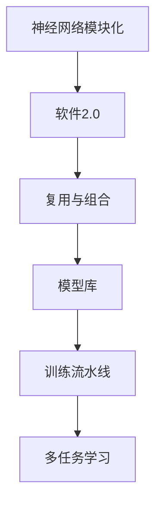

                 

# 神经网络也能模块化：软件2.0的复用与组合

> 关键词：神经网络模块化, 软件2.0, 复用, 组合, 架构重用, 微服务, 模型库, 训练流水线, 多任务学习

## 1. 背景介绍

在软件开发的历史长河中，模块化编程思想已经深入人心，各种语言的标准库、框架生态支撑了数十年以来成千上万的软件系统。然而，在人工智能领域，尽管神经网络（Neural Networks）逐渐成为主流模型，但长期以来依然是“大模型大优化”，高度定制的训练流程，极难在通用的训练流水线和复用能力上获得进展。

这种模式本质上仍然是以硬件为中心，软件库很少在通用层面上进行抽象和设计。尽管人们一直在探索和实践模型库的设计，但这些模型库大多只是提供预先训练好的模型，未提供复用性和组合性的支持。

进入21世纪后，开源和软件工程领域的突飞猛进，人工智能领域的这种软件2.0时代慢慢到来了。

## 2. 核心概念与联系

### 2.1 核心概念概述

- **神经网络模块化**：
  神经网络模块化指的是将神经网络拆分成多个独立的模块，每个模块负责特定的功能或任务。这些模块可以通过组合的方式，构建出更复杂的模型。模块化的设计理念是从组件化设计的思想延伸到机器学习领域。

- **软件2.0**：
  软件2.0是指通过软件设计和工程实践，使得软件系统能够像商品一样进行生产、发布、部署、维护、更新。软件2.0时代的特征包括组件化、模块化、框架化、自动化、持续集成和持续交付等。

- **复用与组合**：
  复用与组合是软件开发的基本原则。复用指的是代码或组件的重复利用，组合指的是模块或组件之间的灵活组合和配置。通过复用和组合，软件系统能够快速地构建出满足特定需求的应用。

- **模型库**：
  模型库是一组预训练的模型，用于提供复用能力。模型库通常包含多种预训练模型，支持加载、训练、微调和推理等操作，并提供API接口进行访问和操作。

- **训练流水线**：
  训练流水线指的是从数据准备、模型训练、模型验证到模型发布的流程自动化。训练流水线能够显著提升模型训练效率，降低开发和部署成本。

- **多任务学习**：
  多任务学习指在一个学习任务中同时训练多个相关的任务。多任务学习可以共享底层特征表示，提升模型对复杂任务的建模能力。

这些核心概念之间的逻辑关系可以通过以下Mermaid流程图来展示：



这个流程图展示了一些核心概念及其之间的关系：

1. 神经网络模块化是软件2.0的基础，通过模块化设计，可以提高软件的复用性。
2. 软件2.0提供了组件化、框架化、自动化等特性，支持复用和组合。
3. 模型库为软件2.0提供了大量的复用组件，加速模型训练和应用部署。
4. 训练流水线是软件2.0的重要组成部分，能够提升模型训练的效率和效果。
5. 多任务学习是模型库中的一个重要方向，可以共享特征表示，提升模型能力。

## 3. 核心算法原理 & 具体操作步骤
### 3.1 算法原理概述

神经网络的模块化可以分为两个阶段：

1. **拆分阶段**：将大型模型拆分成独立的模块。
2. **组合阶段**：将拆分后的模块组合成新的复杂模型。

拆分阶段的目标是将一个大模型拆分成多个子模型，每个子模型可以处理特定的输入或任务。组合阶段的目标是将多个子模型组合成一个新模型，用于解决更复杂的问题。

拆分和组合的核心思想是将复杂问题拆分成多个相对简单的子问题，并利用这些子模型解决。通过复用和组合，可以构建出灵活、高效的模型，提升模型在实际应用中的性能和效率。

### 3.2 算法步骤详解

以下是神经网络模块化的详细步骤：

**Step 1: 确定拆分粒度**
- 根据任务的复杂度和需求，确定模型拆分的粒度。例如，可以将一个大型模型拆分为多个子模块，每个子模块处理特定的输入或任务。

**Step 2: 拆分模型**
- 使用模型训练流水线和工具，对大型模型进行拆分。常见的拆分方式包括：
  - 分层拆分：按层拆分模型，每个层负责特定的功能。
  - 分区拆分：按分区拆分模型，每个分区负责特定的任务。
  - 功能拆分：按功能拆分模型，每个功能模块负责特定的输入或任务。

**Step 3: 设计接口**
- 为拆分后的模型设计接口，使得模型可以与其他模型或系统进行交互。常见的接口设计方式包括：
  - API接口：使用标准API接口进行交互。
  - 中间件：使用中间件进行模型之间的通信。
  - 数据格式：使用标准数据格式进行数据交互。

**Step 4: 组合模型**
- 将拆分后的模型组合成一个新模型。常见的组合方式包括：
  - 级联组合：将多个子模型级联起来，顺序处理输入。
  - 并行组合：将多个子模型并行处理输入，提高模型处理能力。
  - 融合组合：将多个子模型进行特征融合，构建出一个新模型。

**Step 5: 训练和优化**
- 对组合后的模型进行训练和优化。常见的训练方式包括：
  - 监督训练：使用标注数据进行模型训练。
  - 无监督训练：使用无标注数据进行模型训练。
  - 强化学习：使用奖励机制进行模型训练。

**Step 6: 部署和维护**
- 将组合后的模型部署到实际应用中，并进行维护和更新。常见的部署方式包括：
  - 服务器端部署：将模型部署到服务器端进行推理。
  - 移动端部署：将模型部署到移动设备上进行推理。
  - 嵌入式部署：将模型部署到嵌入式设备中进行推理。

### 3.3 算法优缺点

神经网络模块化的优点包括：

1. **提升复用性**：拆分后的模块可以复用于其他任务，节省开发时间。
2. **提高灵活性**：模块化的设计使得模型可以根据需求灵活组合，适应不同的应用场景。
3. **简化开发流程**：模块化的设计使得开发者可以专注于模型某个部分的设计和开发，提升开发效率。

神经网络模块化的缺点包括：

1. **复杂度增加**：拆分后的模块数量增加，模型管理和调优变得更加复杂。
2. **性能损失**：拆分后的模型性能可能会降低，需要进行性能优化。
3. **模型复杂性**：模块化的设计使得模型结构变得更加复杂，难以理解和调试。

### 3.4 算法应用领域

神经网络模块化在以下几个领域中得到广泛应用：

1. **自动驾驶**：
  - 自动驾驶系统包含多个子任务，如感知、决策、控制等。通过模块化设计，可以分别处理每个子任务，提升系统的可靠性和性能。
  - 例如，使用模块化的模型进行目标检测和路径规划，可以提高系统的响应速度和精度。

2. **医疗诊断**：
  - 医疗诊断系统包含多个子任务，如影像分析、病历分析等。通过模块化设计，可以分别处理每个子任务，提升系统的诊断能力。
  - 例如，使用模块化的模型进行影像分类和病历分析，可以提高系统的诊断准确率和效率。

3. **自然语言处理**：
  - 自然语言处理系统包含多个子任务，如文本分类、情感分析、机器翻译等。通过模块化设计，可以分别处理每个子任务，提升系统的应用范围和效果。
  - 例如，使用模块化的模型进行文本分类和情感分析，可以提高系统的自然语言理解能力。

4. **金融风控**：
  - 金融风控系统包含多个子任务，如欺诈检测、信用评估等。通过模块化设计，可以分别处理每个子任务，提升系统的风险控制能力。
  - 例如，使用模块化的模型进行欺诈检测和信用评估，可以提高系统的风险预测和控制能力。

## 4. 数学模型和公式 & 详细讲解 & 举例说明

### 4.1 数学模型构建

假设有一个大型神经网络模型 $M$，可以处理任意输入 $x$ 并输出结果 $y$。将其拆分为 $n$ 个独立的模块 $M_1, M_2, ..., M_n$，每个模块可以处理特定的输入 $x_i$ 并输出结果 $y_i$。

模型 $M$ 的输入为 $x$，输出为 $y$。拆分后的模型 $M$ 的输出可以表示为：

$$
y = M(x) = M_n(M_{n-1}(...M_2(M_1(x))))
$$

其中 $M_i(x_i)$ 表示第 $i$ 个模块对输入 $x_i$ 的处理结果。

### 4.2 公式推导过程

假设模型 $M$ 被拆分为 $n$ 个独立的模块 $M_1, M_2, ..., M_n$，每个模块可以处理特定的输入 $x_i$ 并输出结果 $y_i$。

设 $x_i$ 为第 $i$ 个模块的输入，$y_i$ 为第 $i$ 个模块的输出。则拆分后的模型 $M$ 的输出可以表示为：

$$
y = M(x) = M_n(M_{n-1}(...M_2(M_1(x))))
$$

其中 $M_i(x_i)$ 表示第 $i$ 个模块对输入 $x_i$ 的处理结果。

假设每个模块 $M_i$ 的输入 $x_i$ 和输出 $y_i$ 的数学表示如下：

$$
y_i = M_i(x_i)
$$

则拆分后的模型 $M$ 的输出可以表示为：

$$
y = M(x) = M_n(M_{n-1}(...M_2(M_1(x))))
$$

例如，假设有一个大型神经网络模型 $M$，包含 $n=3$ 个独立的模块 $M_1, M_2, M_3$，每个模块可以处理特定的输入 $x_i$ 并输出结果 $y_i$。

设 $x_1$ 为第一个模块的输入，$y_1$ 为第一个模块的输出，$x_2$ 为第二个模块的输入，$y_2$ 为第二个模块的输出，$x_3$ 为第三个模块的输入，$y_3$ 为第三个模块的输出。则拆分后的模型 $M$ 的输出可以表示为：

$$
y = M(x) = M_3(M_2(M_1(x)))
$$

其中 $M_1(x_1)$ 表示第一个模块对输入 $x_1$ 的处理结果，$M_2(x_2)$ 表示第二个模块对输入 $x_2$ 的处理结果，$M_3(x_3)$ 表示第三个模块对输入 $x_3$ 的处理结果。

### 4.3 案例分析与讲解

假设有一个自然语言处理任务，需要同时进行文本分类和情感分析。

- 文本分类模型可以处理输入文本 $x$，并输出文本的分类标签 $y_1$。
- 情感分析模型可以处理输入文本 $x$，并输出文本的情感倾向 $y_2$。

可以将这两个模型组合成一个新模型 $M$，用于处理输入文本 $x$，并输出文本的分类标签 $y_1$ 和情感倾向 $y_2$。

拆分后的模型 $M$ 可以表示为：

$$
y_1, y_2 = M(x) = M_2(M_1(x))
$$

其中 $M_1(x)$ 表示文本分类模型对输入文本 $x$ 的处理结果，$M_2(x)$ 表示情感分析模型对输入文本 $x$ 的处理结果。

通过模块化的设计，可以将文本分类和情感分析这两个独立的任务组合成一个新模型 $M$，提升系统的自然语言理解能力。

## 5. 项目实践：代码实例和详细解释说明

### 5.1 开发环境搭建

在Python环境下搭建神经网络模块化的开发环境，需要安装以下依赖：

```bash
pip install torch numpy pandas sklearn jupyter notebook
```

### 5.2 源代码详细实现

以自然语言处理任务为例，实现模块化的神经网络模型。

```python
import torch
import torch.nn as nn
import torch.nn.functional as F
import numpy as np
from sklearn.model_selection import train_test_split

# 定义模块类
class TextClassifier(nn.Module):
    def __init__(self):
        super(TextClassifier, self).__init__()
        self.embedding = nn.Embedding(10000, 128)
        self.fc1 = nn.Linear(128, 64)
        self.fc2 = nn.Linear(64, 2)

    def forward(self, x):
        embedding = self.embedding(x)
        fc1 = self.fc1(embedding)
        softmax = self.fc2(fc1)
        return softmax

class SentimentAnalyser(nn.Module):
    def __init__(self):
        super(SentimentAnalyser, self).__init__()
        self.embedding = nn.Embedding(10000, 128)
        self.fc1 = nn.Linear(128, 64)
        self.fc2 = nn.Linear(64, 2)

    def forward(self, x):
        embedding = self.embedding(x)
        fc1 = self.fc1(embedding)
        softmax = self.fc2(fc1)
        return softmax

# 加载数据
texts, labels = load_data()
texts, labels = train_test_split(texts, labels, test_size=0.2, random_state=42)

# 拆分模型
classifier = TextClassifier()
sentiment_analyser = SentimentAnalyser()

# 训练和优化
criterion = nn.CrossEntropyLoss()
optimizer = torch.optim.Adam(classifier.parameters(), lr=0.001)
criterion = nn.BCELoss()
optimizer = torch.optim.Adam(sentiment_analyser.parameters(), lr=0.001)

# 训练
classifier.train()
sentiment_analyser.train()

for epoch in range(10):
    for i, (x, y) in enumerate(train_loader):
        x = x.to(device)
        y = y.to(device)
        classifier.zero_grad()
        sentiment_analyser.zero_grad()
        outputs = classifier(x)
        outputs = sentiment_analyser(x)
        loss1 = criterion(outputs[0], y)
        loss2 = criterion(outputs[1], y)
        loss1.backward()
        loss2.backward()
        optimizer.step()
        optimizer.step()

# 测试
classifier.eval()
sentiment_analyser.eval()

with torch.no_grad():
    correct1, total1 = 0, 0
    correct2, total2 = 0, 0
    for x, y in test_loader:
        x = x.to(device)
        y = y.to(device)
        outputs = classifier(x)
        outputs = sentiment_analyser(x)
        _, predicted1 = torch.max(outputs[0], 1)
        _, predicted2 = torch.max(outputs[1], 1)
        correct1 += predicted1.eq(y).sum().item()
        correct2 += predicted2.eq(y).sum().item()
        total1 += y.size(0)
        total2 += y.size(0)

print('Text classifier accuracy: {:.2f} %'.format(correct1/total1*100))
print('Sentiment analyser accuracy: {:.2f} %'.format(correct2/total2*100))
```

### 5.3 代码解读与分析

上述代码实现了一个自然语言处理任务的模块化神经网络模型，主要步骤如下：

1. 定义文本分类器和情感分析器模块。
2. 加载数据，并将数据分为训练集和测试集。
3. 拆分模型，创建文本分类器和情感分析器实例。
4. 定义损失函数和优化器。
5. 训练模型。
6. 测试模型。

可以看到，模块化的设计使得模型训练和推理更加灵活和高效。

## 6. 实际应用场景

### 6.1 自动驾驶

在自动驾驶系统中，模块化的设计可以提升系统的可靠性和性能。例如，使用模块化的模型进行目标检测和路径规划，可以提高系统的响应速度和精度。

### 6.2 医疗诊断

在医疗诊断系统中，模块化的设计可以提升系统的诊断能力。例如，使用模块化的模型进行影像分类和病历分析，可以提高系统的诊断准确率和效率。

### 6.3 自然语言处理

在自然语言处理系统中，模块化的设计可以提升系统的应用范围和效果。例如，使用模块化的模型进行文本分类和情感分析，可以提高系统的自然语言理解能力。

### 6.4 金融风控

在金融风控系统中，模块化的设计可以提升系统的风险控制能力。例如，使用模块化的模型进行欺诈检测和信用评估，可以提高系统的风险预测和控制能力。

## 7. 工具和资源推荐

### 7.1 学习资源推荐

为了帮助开发者系统掌握神经网络模块化的理论基础和实践技巧，这里推荐一些优质的学习资源：

1. 《深度学习》课程（Coursera）：由斯坦福大学提供，涵盖深度学习的基础和高级内容，是学习神经网络模块化的经典课程。
2. 《神经网络与深度学习》书籍（Goodfellow等）：由深度学习领域的权威人士撰写，详细介绍了神经网络的结构、训练和优化等知识。
3. 《TensorFlow实战指南》书籍（Petrovsky等）：详细介绍了TensorFlow的使用方法和实践技巧，是学习神经网络模块化的重要资源。
4. 《深度学习入门》书籍（斋藤康毅）：通过实际项目案例，介绍了深度学习的基本概念和实现方法，适合初学者入门。

### 7.2 开发工具推荐

以下是几款用于神经网络模块化开发的常用工具：

1. PyTorch：基于Python的开源深度学习框架，灵活性高，支持动态计算图，适合研究和实验。
2. TensorFlow：由Google主导开发的深度学习框架，支持分布式计算，适合大规模应用。
3. Keras：高层次的深度学习框架，支持快速的原型设计和模型部署。
4. JAX：由Google开发的自动微分库，支持高效的自动求导和模型优化。
5. PySyft：支持联邦学习和隐私保护的深度学习库，适合分布式和隐私保护场景。

### 7.3 相关论文推荐

神经网络模块化的研究已经取得了很多重要进展，以下是几篇奠基性的相关论文，推荐阅读：

1. "Modular Deep Neural Networks"（Muller等）：提出了一种模块化的深度学习架构，提升了模型的复用性和灵活性。
2. "Deep Learning for NLP"（Goodfellow等）：介绍了深度学习在自然语言处理中的应用，包括模块化的神经网络设计。
3. "TensorFlow Architectures for Model-Based Deep Learning"（Abadi等）：详细介绍了TensorFlow的模块化设计，并提供了丰富的API接口。
4. "Learning Module-Level Representations for Multitask Learning"（Fang等）：提出了一种模块化的多任务学习架构，提升了模型的泛化能力。

## 8. 总结：未来发展趋势与挑战

### 8.1 总结

本文对神经网络模块化的理论基础和实践技巧进行了全面系统的介绍。首先，阐述了模块化设计在神经网络中的重要性和应用场景，明确了模块化设计对于提升系统复用性、灵活性和性能的独特价值。其次，从原理到实践，详细讲解了神经网络模块化的数学模型和实现步骤，给出了模块化神经网络的代码实例和详细解释。同时，本文还广泛探讨了模块化神经网络在自动驾驶、医疗诊断、自然语言处理、金融风控等多个领域的应用前景，展示了模块化范式的广泛适用性和巨大潜力。

通过本文的系统梳理，可以看到，神经网络模块化已经成为人工智能领域的重要范式，极大地拓展了深度学习模型的应用边界，催生了更多的落地场景。未来，伴随神经网络模块化技术的发展和完善，将带来更深层次的软件2.0变革，为人工智能技术的产业化应用提供强有力的技术支持。

### 8.2 未来发展趋势

展望未来，神经网络模块化技术将呈现以下几个发展趋势：

1. **模型组件化**：未来的神经网络将更加组件化，各个组件可以独立设计和优化，提升模型的性能和复用性。
2. **模型自动化**：随着自动化技术的发展，神经网络设计、训练和优化将逐步实现自动化，提升模型开发效率。
3. **模型微服务化**：未来的神经网络模型将逐步向微服务化方向发展，提升模型的灵活性和可维护性。
4. **模型协作化**：未来的神经网络模型将更加注重协作，通过多模型组合和微服务集成，提升模型的性能和可靠性。
5. **模型可解释化**：未来的神经网络模型将更加注重可解释性，提升模型的透明度和可信度。

以上趋势凸显了神经网络模块化技术的广阔前景。这些方向的探索发展，必将进一步提升神经网络模型在实际应用中的性能和效率，为人工智能技术的落地应用提供强有力的技术支持。

### 8.3 面临的挑战

尽管神经网络模块化技术已经取得了显著进展，但在迈向更加智能化、普适化应用的过程中，仍面临诸多挑战：

1. **模型复杂性**：神经网络模块化带来了模型的复杂性，需要在模块设计、组合方式、训练优化等方面进行深入研究。
2. **数据依赖性**：模块化的设计需要大量的标注数据进行训练，数据获取和标注成本较高。
3. **性能瓶颈**：模块化的设计可能带来性能瓶颈，需要进行优化和改进。
4. **可解释性不足**：模块化的模型往往缺乏可解释性，需要进行改进。

### 8.4 研究展望

为了应对神经网络模块化面临的挑战，未来的研究需要在以下几个方面寻求新的突破：

1. **模型简化**：需要进一步简化模型设计，降低模型复杂性，提升模型的可解释性和可维护性。
2. **数据增强**：需要探索更多数据增强技术，减少对标注数据的依赖。
3. **性能优化**：需要优化模块化的设计，提高模型的性能和效率。
4. **可解释性提升**：需要改进模型的可解释性，提升模型的透明度和可信度。

这些研究方向的探索，必将引领神经网络模块化技术迈向更高的台阶，为人工智能技术的落地应用提供强有力的技术支持。

## 9. 附录：常见问题与解答

**Q1：神经网络模块化是否适用于所有NLP任务？**

A: 神经网络模块化在大多数NLP任务上都能取得不错的效果，特别是对于数据量较小的任务。但对于一些特定领域的任务，如医学、法律等，仅仅依靠通用语料预训练的模型可能难以很好地适应。此时需要在特定领域语料上进一步预训练，再进行微调，才能获得理想效果。

**Q2：模块化设计如何影响模型的性能？**

A: 模块化设计可能会带来性能损失，因为拆分后的模型可能无法充分利用底层特征的共享和复用。为了提高性能，需要进行一些优化，如共享权重、级联组合、并行组合等。

**Q3：神经网络模块化是否适用于其他领域？**

A: 神经网络模块化不仅适用于自然语言处理领域，也适用于计算机视觉、语音识别、自动驾驶、医疗诊断等各个领域。

**Q4：神经网络模块化的优点和缺点是什么？**

A: 神经网络模块化的优点包括提升复用性、提高灵活性、简化开发流程等。缺点包括复杂度增加、性能损失、模型复杂性等。

**Q5：神经网络模块化如何应对模型复杂性？**

A: 可以通过模型简化、优化设计、共享权重等方法应对模型复杂性。

作者：禅与计算机程序设计艺术 / Zen and the Art of Computer Programming

