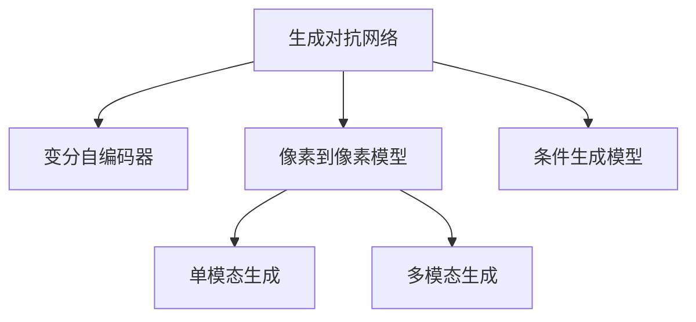

                 

# 神经网络在图像生成中的应用

> 关键词：神经网络,图像生成,生成对抗网络(GANs),变分自编码器(VAEs),像素到像素,深度学习

## 1. 背景介绍

### 1.1 问题由来
随着深度学习技术的迅猛发展，神经网络在图像生成领域取得了令人瞩目的成果。生成对抗网络(GANs)和变分自编码器(VAEs)等生成模型，能够从噪声或随机向量出发，生成与训练数据分布一致的图像。这些生成模型为艺术创作、游戏、虚拟现实等场景带来了新的可能性，也推动了计算机视觉、模式识别等领域的深度研究。

然而，当前的生成模型在生成质量、多样性、鲁棒性等方面仍存在不少问题。生成对抗网络虽然能够生成高质量的图像，但训练过程不稳定，容易陷入模式崩溃。变分自编码器虽然能够生成较为逼真的图像，但存在生成噪声分布固定的问题，导致生成的图像多样性不足。此外，生成模型的训练成本较高，对硬件资源要求严苛。

## 2. 核心概念与联系

### 2.1 核心概念概述

为更好地理解神经网络在图像生成中的应用，本节将介绍几个密切相关的核心概念：

- 生成对抗网络（Generative Adversarial Networks, GANs）：由Isola等人于2014年提出的生成模型，通过两个神经网络（生成器和判别器）对抗训练，使得生成器可以生成逼真的图像，而判别器可以区分真实图像和生成图像。

- 变分自编码器（Variational Autoencoder, VAEs）：由Kingma等人于2013年提出的生成模型，通过最大化生成数据的似然分布与真实数据分布之间的KL散度，实现对噪声或随机向量生成图像的目标。

- 像素到像素模型（Pixel-to-Pixel Models）：如U-Net、pix2pix等模型，通过卷积神经网络（Convolutional Neural Network, CNN）结构，直接将输入图像像素映射到输出图像像素，实现图像生成、修复、转换等任务。

- 条件生成模型（Conditional Generative Models）：在图像生成中引入条件信息，如标签、文本描述等，引导生成模型按照特定条件生成图像。常见的有conditional GANs、conditional VAEs等。

- 单模态生成与多模态生成：生成模型根据输入信息种类的不同，可分为单模态生成和多模态生成。单模态生成通常以图像、声音、文本等信息为输入，生成相应类型的输出。多模态生成则同时处理来自多个模态的信息，实现跨模态的信息融合和生成。

这些核心概念之间的逻辑关系可以通过以下Mermaid流程图来展示：



这个流程图展示了大语言模型微调的核心概念及其之间的关系：

1. 生成对抗网络通过对抗训练生成高质量的图像。
2. 变分自编码器通过最大化KL散度优化生成分布，实现图像生成。
3. 像素到像素模型直接生成图像像素，实现图像生成、修复、转换等任务。
4. 条件生成模型通过引入条件信息，增强生成过程的指导性。
5. 单模态生成和多模态生成分别处理不同模态的信息，实现多样化的生成任务。

这些概念共同构成了图像生成的技术框架，使其能够在各种场景下发挥强大的生成能力。通过理解这些核心概念，我们可以更好地把握生成模型的原理和应用方向。

## 3. 核心算法原理 & 具体操作步骤
### 3.1 算法原理概述

神经网络在图像生成中的应用，本质上是一个通过学习图像分布生成新图像的过程。其核心思想是：将生成模型的输出与真实图像样本之间的差异最小化，使得生成模型的分布与真实图像分布尽可能一致。

形式化地，假设生成模型为 $G_\theta$，其中 $\theta$ 为模型参数。生成模型的目标是最小化生成图像 $G_\theta(z)$ 与真实图像 $x$ 之间的差异，即：

$$
\theta^* = \mathop{\arg\min}_{\theta} \mathbb{E}_{x \sim p(x)}[\mathcal{L}(G_\theta(z), x)]
$$

其中 $\mathcal{L}$ 为损失函数，用于衡量生成图像和真实图像之间的差异。常见的损失函数包括均方误差损失、感知损失等。

训练过程通常包括两个部分：

- 生成器（Generator）：将随机噪声 $z$ 映射为逼真的图像 $G_\theta(z)$。
- 判别器（Discriminator）：区分真实图像 $x$ 和生成图像 $G_\theta(z)$，尽可能提高判别能力。

通过这两个部分之间的对抗训练，生成器不断优化，生成更加逼真的图像。判别器也不断提升，更好地区分真实图像和生成图像。

### 3.2 算法步骤详解

神经网络在图像生成中的应用，主要分为以下几个步骤：

**Step 1: 准备数据集**
- 收集图像数据集，划分为训练集、验证集和测试集。通常要求数据集多样性丰富，覆盖各种图像类型、光照、角度等。

**Step 2: 选择生成器模型**
- 选择合适的生成器模型，如生成对抗网络（GANs）、变分自编码器（VAEs）、像素到像素模型等。
- 对于GANs，选择生成器和判别器的结构，如DCGAN、WGAN、Conditional GANs等。

**Step 3: 设置训练超参数**
- 选择合适的优化器及其参数，如Adam、SGD等，设置学习率、批大小、迭代轮数等。
- 设置正则化技术及强度，包括权重衰减、Dropout、Early Stopping等。
- 确定冻结生成器参数的策略，如仅训练顶层，或全部参数都参与训练。

**Step 4: 执行对抗训练**
- 将训练集数据分批次输入生成器和判别器，前向传播计算损失函数。
- 反向传播计算参数梯度，根据设定的优化算法和学习率更新模型参数。
- 周期性在验证集上评估生成器和判别器的性能，根据性能指标决定是否触发Early Stopping。
- 重复上述步骤直到满足预设的迭代轮数或Early Stopping条件。

**Step 5: 测试和部署**
- 在测试集上评估生成模型的性能，对比生成前后的质量提升。
- 使用生成模型对新图像进行生成，集成到实际的应用系统中。
- 持续收集新的数据，定期重新训练模型，以适应数据分布的变化。

以上是神经网络在图像生成中的应用的一般流程。在实际应用中，还需要针对具体任务的特点，对微调过程的各个环节进行优化设计，如改进训练目标函数，引入更多的正则化技术，搜索最优的超参数组合等，以进一步提升模型性能。

### 3.3 算法优缺点

神经网络在图像生成中的应用具有以下优点：

- 生成效果好：生成对抗网络等模型能够生成高质量、高逼真度的图像。
- 生成速度快：生成过程较训练过程时间短，模型能够快速生成新图像。
- 适用范围广：适用于各种图像生成任务，如图像修复、图像转换、图像生成等。

同时，该方法也存在一些局限性：

- 训练复杂：生成模型需要大量标注数据，训练过程容易陷入模式崩溃。
- 对硬件要求高：模型参数多，计算量大，需要高性能GPU/TPU等设备。
- 存在模型缺陷：生成过程不稳定，容易受到噪声、参数变化等干扰。

尽管存在这些局限性，但就目前而言，神经网络在图像生成中的应用已经成为主流范式，带动了图像生成领域的发展。未来相关研究的重点在于如何进一步降低训练复杂度，提高生成多样性，同时兼顾生成质量和效率。

### 3.4 算法应用领域

神经网络在图像生成中的应用已经涵盖了多个领域，例如：

- 图像修复：利用生成模型对损坏或缺失的图像进行修复。
- 图像转换：将一张图像转换为另一种风格、颜色、角度等。
- 图像生成：生成逼真、高质量的图像，用于游戏、虚拟现实等场景。
- 图像风格迁移：将一张图像的风格迁移到另一张图像上，实现视觉效果的混合。
- 图像超分辨率：将低分辨率图像提升为高分辨率图像，获得更清晰的视觉效果。

此外，神经网络在图像生成中的应用还在不断拓展，如医学图像生成、超现实艺术创作、虚拟人物生成等，为计算机视觉和艺术领域带来了新的创新点。

## 4. 数学模型和公式 & 详细讲解 & 举例说明

### 4.1 数学模型构建

本节将使用数学语言对神经网络在图像生成中的应用进行更加严格的刻画。

假设生成模型为 $G_\theta$，其中 $\theta$ 为模型参数。假设训练集为 $D=\{(x_i,y_i)\}_{i=1}^N, x_i \in \mathcal{X}, y_i \in \mathcal{Y}$。

定义生成模型 $G_\theta$ 在输入 $z$ 上的损失函数为 $\ell(G_\theta(z),x)$，则在数据集 $D$ 上的经验风险为：

$$
\mathcal{L}(\theta) = \frac{1}{N}\sum_{i=1}^N \ell(G_\theta(z),x_i)
$$

其中 $z$ 为随机噪声向量，$\mathcal{X}$ 为输入空间，$\mathcal{Y}$ 为输出空间，$\theta$ 为模型参数。

生成模型的目标是最小化经验风险，即找到最优参数：

$$
\theta^* = \mathop{\arg\min}_{\theta} \mathcal{L}(\theta)
$$

在实践中，我们通常使用基于梯度的优化算法（如SGD、Adam等）来近似求解上述最优化问题。设 $\eta$ 为学习率，$\lambda$ 为正则化系数，则参数的更新公式为：

$$
\theta \leftarrow \theta - \eta \nabla_{\theta}\mathcal{L}(\theta) - \eta\lambda\theta
$$

其中 $\nabla_{\theta}\mathcal{L}(\theta)$ 为损失函数对参数 $\theta$ 的梯度，可通过反向传播算法高效计算。

### 4.2 公式推导过程

以下我们以生成对抗网络（GANs）为例，推导对抗训练的损失函数及其梯度的计算公式。

假设生成器为 $G_\theta(z)$，判别器为 $D_\phi(x)$。定义生成器在噪声向量 $z$ 上的生成图像 $G_\theta(z)$，判别器在图像 $x$ 上的判别概率 $D_\phi(x)$。

生成器的损失函数为生成图像与真实图像之间的均方误差损失，即：

$$
\ell_G(G_\theta(z),x) = \frac{1}{N}\sum_{i=1}^N (G_\theta(z) - x_i)^2
$$

判别器的损失函数为生成图像和真实图像的判别概率之和减去1，即：

$$
\ell_D(G_\theta(z),x) = \frac{1}{N}\sum_{i=1}^N (D_\phi(x_i) + (1-D_\phi(G_\theta(z_i))) - 1)
$$

则生成对抗网络的联合损失函数为：

$$
\mathcal{L}(\theta,\phi) = \frac{1}{N}\sum_{i=1}^N \ell_G(G_\theta(z_i),x_i) + \frac{1}{N}\sum_{i=1}^N \ell_D(G_\theta(z_i),x_i)
$$

根据链式法则，联合损失函数对参数 $\theta$ 的梯度为：

$$
\frac{\partial \mathcal{L}(\theta,\phi)}{\partial \theta} = -\frac{1}{N}\sum_{i=1}^N (D_\phi(x_i) + (1-D_\phi(G_\theta(z_i))) - 1) \frac{\partial G_\theta(z_i)}{\partial \theta} + \frac{1}{N}\sum_{i=1}^N (G_\theta(z_i) - x_i)^2 \frac{\partial G_\theta(z_i)}{\partial \theta}
$$

其中 $\frac{\partial G_\theta(z_i)}{\partial \theta}$ 可进一步递归展开，利用自动微分技术完成计算。

在得到联合损失函数的梯度后，即可带入参数更新公式，完成模型的迭代优化。重复上述过程直至收敛，最终得到适应生成任务的模型参数 $\theta^*$ 和 $\phi^*$。

## 5. 项目实践：代码实例和详细解释说明
### 5.1 开发环境搭建

在进行生成模型实践前，我们需要准备好开发环境。以下是使用Python进行TensorFlow开发的环境配置流程：

1. 安装Anaconda：从官网下载并安装Anaconda，用于创建独立的Python环境。

2. 创建并激活虚拟环境：
```bash
conda create -n tf-env python=3.8 
conda activate tf-env
```

3. 安装TensorFlow：根据CUDA版本，从官网获取对应的安装命令。例如：
```bash
conda install tensorflow -c tf -c conda-forge
```

4. 安装各类工具包：
```bash
pip install numpy pandas scikit-learn matplotlib tqdm jupyter notebook ipython
```

完成上述步骤后，即可在`tf-env`环境中开始生成模型实践。

### 5.2 源代码详细实现

下面我以生成对抗网络（GANs）为例，给出使用TensorFlow实现生成图像的PyTorch代码实现。

首先，定义生成器和判别器的模型结构：

```python
import tensorflow as tf
from tensorflow.keras import layers

def make_generator_model():
    model = tf.keras.Sequential()
    model.add(layers.Dense(256, use_bias=False, input_shape=(100,)))
    model.add(layers.BatchNormalization())
    model.add(layers.LeakyReLU())

    model.add(layers.Dense(512, use_bias=False))
    model.add(layers.BatchNormalization())
    model.add(layers.LeakyReLU())

    model.add(layers.Dense(1024, use_bias=False))
    model.add(layers.BatchNormalization())
    model.add(layers.LeakyReLU())

    model.add(layers.Dense(784, activation='tanh'))
    model.add(layers.Reshape((28, 28, 1)))
    return model

def make_discriminator_model():
    model = tf.keras.Sequential()
    model.add(layers.Conv2D(64, (3, 3), strides=(2, 2), padding='same',
                           input_shape=[28, 28, 1]))
    model.add(layers.LeakyReLU())
    model.add(layers.Dropout(0.3))

    model.add(layers.Conv2D(128, (3, 3), strides=(2, 2), padding='same'))
    model.add(layers.LeakyReLU())
    model.add(layers.Dropout(0.3))

    model.add(layers.Flatten())
    model.add(layers.Dense(1))
    return model
```

然后，定义损失函数和优化器：

```python
cross_entropy = tf.keras.losses.BinaryCrossentropy(from_logits=True)

def generator_loss(fake_output):
    return cross_entropy(tf.ones_like(fake_output), fake_output)

def discriminator_loss(real_output, fake_output):
    real_loss = cross_entropy(tf.ones_like(real_output), real_output)
    fake_loss = cross_entropy(tf.zeros_like(fake_output), fake_output)
    return real_loss + fake_loss

generator_optimizer = tf.keras.optimizers.Adam(1e-4)
discriminator_optimizer = tf.keras.optimizers.Adam(1e-4)
```

接着，定义训练和评估函数：

```python
@tf.function
def train_step(images):
    noise = tf.random.normal([BATCH_SIZE, 100])

    with tf.GradientTape() as gen_tape, tf.GradientTape() as disc_tape:
        generated_images = generator(noise, training=True)

        real_output = discriminator(images, training=True)
        fake_output = discriminator(generated_images, training=True)

        gen_loss = generator_loss(fake_output)
        disc_loss = discriminator_loss(real_output, fake_output)

    gradients_of_generator = gen_tape.gradient(gen_loss, generator.trainable_variables)
    gradients_of_discriminator = disc_tape.gradient(disc_loss, discriminator.trainable_variables)

    generator_optimizer.apply_gradients(zip(gradients_of_generator, generator.trainable_variables))
    discriminator_optimizer.apply_gradients(zip(gradients_of_discriminator, discriminator.trainable_variables))
```

最后，启动训练流程并在测试集上评估：

```python
epochs = 50
steps_per_epoch = 2800

for epoch in range(epochs):
    for step in range(steps_per_epoch):
        batch = train_dataset[step]
        train_step(batch)

    print("Epoch", epoch+1, "completed.")
    print("Test images:")
    test_images = generated_images[:25]
    plt.figure(figsize=(4, 4))
    for i in range(test_images.shape[0]):
        plt.subplot(5, 5, i+1)
        plt.imshow(test_images[i, :, :, 0] * 255, cmap=plt.cm.binary)
        plt.title(np.round(epoch, 2))
    plt.show()
```

以上就是使用TensorFlow对GANs进行图像生成的完整代码实现。可以看到，得益于TensorFlow的强大封装，我们可以用相对简洁的代码完成GANs模型的加载和训练。

### 5.3 代码解读与分析

让我们再详细解读一下关键代码的实现细节：

**make_generator_model和make_discriminator_model函数**：
- `make_generator_model`方法：定义生成器模型的结构，包括全连接层、批量归一化、LeakyReLU等。
- `make_discriminator_model`方法：定义判别器模型的结构，包括卷积层、LeakyReLU、Dropout等。

**cross_entropy损失函数**：
- 定义了一个二分类交叉熵损失函数，用于衡量生成图像和真实图像之间的差异。

**train_step函数**：
- 定义训练过程的每一步操作，包括前向传播计算损失函数、反向传播计算梯度、应用梯度优化器等。

**训练流程**：
- 定义总的epoch数和batch size，开始循环迭代
- 每个epoch内，在训练集上训练，输出当前epoch的测试集生成图像
- 重复上述步骤直至收敛

可以看到，TensorFlow配合Keras等框架使得GANs生成模型的代码实现变得简洁高效。开发者可以将更多精力放在数据处理、模型改进等高层逻辑上，而不必过多关注底层的实现细节。

当然，工业级的系统实现还需考虑更多因素，如模型的保存和部署、超参数的自动搜索、更灵活的任务适配层等。但核心的生成模型训练范式基本与此类似。

## 6. 实际应用场景
### 6.1 自动绘画

基于GANs等生成模型，自动绘画工具能够根据用户输入的文字描述，生成符合描述的绘画作品。这种技术在艺术创作、图像生成等方面具有广泛的应用前景。

例如，在艺术创作中，艺术家可以通过输入具体的场景、人物、情感等信息，让生成模型自动生成符合描述的绘画作品。这不仅能提升创作效率，还能拓展艺术家的创意空间。

在图像生成中，用户可以输入简单的形状描述，如"一条蓝色的曲线"，生成器会自动生成对应的曲线图像，用于游戏场景设计、工业设计等领域。

### 6.2 医学图像增强

医学图像增强是医学影像领域的一个重要研究方向，通过生成模型对医学图像进行增强，可以提升图像的清晰度、对比度等质量指标，辅助医生的诊断和治疗决策。

例如，在X光图像增强中，生成模型可以从低分辨率图像中生成高分辨率图像，显著提升图像的细节信息。在CT图像增强中，生成模型可以生成更清晰的器官图像，辅助医生进行更精确的诊断。

在病理图像增强中，生成模型可以将模糊的细胞图像清晰化，提升病理诊断的准确性。

### 6.3 图像超分辨率

图像超分辨率是指将低分辨率图像提升为高分辨率图像，通过生成模型可以实现这一目标。生成模型可以从噪声图像中生成清晰图像，提高图像的分辨率和细节信息。

例如，在视频会议中，低分辨率图像会降低视频质量，通过图像超分辨率技术，可以提升视频清晰度，增强用户体验。

在图像编辑中，生成模型可以生成高质量的超分辨率图像，用于图像修复、图像增强等领域。

### 6.4 未来应用展望

随着生成模型的不断发展，未来在图像生成领域的应用将更加广泛和深入。

在智慧城市治理中，生成模型可以生成城市街景、建筑物、交通场景等虚拟图像，用于模拟城市规划、交通管理等领域。

在影视制作中，生成模型可以生成逼真的动画、特效、背景等，降低影视制作成本，提升视觉效果。

在教育培训中，生成模型可以生成虚拟教师、虚拟教室、虚拟实验等，提升教学效果和学习体验。

此外，生成模型在自然灾害预测、天气预报、生物信息学等领域也将发挥重要作用。相信随着生成模型的不断进步，其在图像生成领域的应用将不断扩展，带来更加丰富的应用场景。

## 7. 工具和资源推荐
### 7.1 学习资源推荐

为了帮助开发者系统掌握生成模型的理论基础和实践技巧，这里推荐一些优质的学习资源：

1. 《Generative Adversarial Networks: An Overview》：由Goodfellow等人撰写，系统介绍了GANs的原理、算法和应用，是GANs领域的经典入门读物。

2. 《The Elements of Style for TensorFlow 2.0》：由Keras团队成员撰写的TensorFlow深度学习入门书籍，详细介绍了TensorFlow 2.0的API使用，并结合实例演示生成模型训练。

3. 《Learning Deep Generative Models for Imagenet》：由Goodfellow等人撰写的论文，介绍了使用变分自编码器对ImageNet数据集进行生成模型的训练，刷新了图像生成任务的效果。

4. 《Deep Learning with Python》：由Francois Chollet撰写的深度学习入门书籍，详细介绍了Keras框架的使用，包括生成模型的设计和训练。

5. 《PyTorch Lightning》：由Kai Striega开发的深度学习框架，提供了大量的生成模型模板和代码示例，可以快速上手生成模型开发。

通过对这些资源的学习实践，相信你一定能够快速掌握生成模型的精髓，并用于解决实际的图像生成问题。
###  7.2 开发工具推荐

高效的开发离不开优秀的工具支持。以下是几款用于生成模型开发的常用工具：

1. TensorFlow：由Google主导开发的开源深度学习框架，生产部署方便，适合大规模工程应用。提供了丰富的生成模型资源。

2. PyTorch：基于Python的开源深度学习框架，灵活动态的计算图，适合快速迭代研究。大部分生成模型都有PyTorch版本的实现。

3. Keras：由Francois Chollet开发的深度学习框架，封装了TensorFlow、Theano等后端，提供了便捷的API，易于上手。

4. Weights & Biases：模型训练的实验跟踪工具，可以记录和可视化模型训练过程中的各项指标，方便对比和调优。与主流深度学习框架无缝集成。

5. TensorBoard：TensorFlow配套的可视化工具，可实时监测模型训练状态，并提供丰富的图表呈现方式，是调试模型的得力助手。

6. Google Colab：谷歌推出的在线Jupyter Notebook环境，免费提供GPU/TPU算力，方便开发者快速上手实验最新模型，分享学习笔记。

合理利用这些工具，可以显著提升生成模型开发的效率，加快创新迭代的步伐。

### 7.3 相关论文推荐

生成模型的发展源于学界的持续研究。以下是几篇奠基性的相关论文，推荐阅读：

1. Generative Adversarial Nets（GANs）论文：由Goodfellow等人于2014年提出的生成对抗网络，奠定了GANs的基础，开启了生成模型的新篇章。

2. Variational Autoencoder（VAEs）论文：由Kingma等人于2013年提出的变分自编码器，通过最大化生成数据的似然分布与真实数据分布之间的KL散度，实现对噪声或随机向量生成图像的目标。

3. Pixel-to-Pixel Networks for Image Generation：由Isola等人于2017年提出的像素到像素网络，通过卷积神经网络结构，直接将输入图像像素映射到输出图像像素，实现图像生成、修复、转换等任务。

4. Conditional Generative Adversarial Nets（conditional GANs）论文：由Mirza等人于2014年提出的条件生成对抗网络，引入条件信息，增强生成过程的指导性。

5. Pixel-to-Pixel Generative Models from Partial Observations：由Isola等人于2018年提出的像素到像素生成模型，利用部分观察图像进行生成。

这些论文代表了大语言模型微调技术的发展脉络。通过学习这些前沿成果，可以帮助研究者把握学科前进方向，激发更多的创新灵感。

## 8. 总结：未来发展趋势与挑战

### 8.1 总结

本文对神经网络在图像生成中的应用进行了全面系统的介绍。首先阐述了生成对抗网络、变分自编码器、像素到像素模型等生成模型及其核心思想，明确了生成模型在图像生成中的独特价值。其次，从原理到实践，详细讲解了生成模型的数学原理和关键步骤，给出了生成模型任务开发的完整代码实例。同时，本文还广泛探讨了生成模型在自动绘画、医学图像增强、图像超分辨率等多个场景中的应用前景，展示了生成模型范式的巨大潜力。此外，本文精选了生成模型的各类学习资源，力求为读者提供全方位的技术指引。

通过本文的系统梳理，可以看到，神经网络在图像生成中的应用已经成为主流范式，极大推动了计算机视觉、模式识别等领域的发展。未来相关研究的重点在于如何进一步降低生成模型的训练复杂度，提高生成图像的多样性和质量，同时兼顾生成速度和效率。

### 8.2 未来发展趋势

展望未来，神经网络在图像生成中的应用将呈现以下几个发展趋势：

1. 生成质量不断提升：随着生成模型的不断优化，生成的图像质量将不断提高，更加逼真、细腻。

2. 生成过程更加稳定：生成对抗网络等模型将不再容易陷入模式崩溃，生成过程将更加稳定可靠。

3. 生成效率逐步提升：通过改进训练算法和模型结构，生成模型的生成速度将进一步提升，实时生成变得更加可能。

4. 生成多样性更加丰富：引入更多条件信息、多样化的噪声分布，生成图像的多样性将更加丰富，适用于更多样化的应用场景。

5. 生成模型应用广泛：生成模型将在更多领域得到应用，如医疗、金融、教育等，带来新的创新点。

6. 生成技术融合发展：生成模型将与更多前沿技术进行融合，如增强现实、虚拟现实、遥感图像等，拓展生成模型的应用范围。

以上趋势凸显了神经网络在图像生成领域的广阔前景。这些方向的探索发展，必将进一步提升生成模型的性能和应用范围，为计算机视觉和艺术领域带来新的突破。

### 8.3 面临的挑战

尽管神经网络在图像生成中的应用已经取得了显著成果，但在迈向更加智能化、普适化应用的过程中，它仍面临着诸多挑战：

1. 生成模型对标注数据的依赖：生成模型通常需要大量标注数据，获取高质量标注数据的成本较高。

2. 生成模型的训练复杂度：生成模型训练过程复杂，容易陷入模式崩溃。

3. 生成模型的计算资源要求高：模型参数多，计算量大，需要高性能GPU/TPU等设备。

4. 生成模型的生成噪声分布固定：变分自编码器等模型生成噪声分布固定，生成的图像多样性不足。

5. 生成模型的稳定性和可控性：生成对抗网络等模型生成过程不稳定，容易受到噪声、参数变化等干扰。

6. 生成模型的伦理和安全性问题：生成模型生成的图像可能包含有害信息，带来安全隐患。

7. 生成模型的公平性和可解释性：生成模型生成的图像可能存在偏见，难以解释其生成过程和决策逻辑。

8. 生成模型的实时性和资源效率：生成模型生成的图像时间较长，效率较低，无法满足实时性需求。

这些挑战需要研究者们共同面对，通过不断优化模型结构和训练算法，引入更多先验知识，提高模型的生成质量和效率，以实现更好的人机协同。

### 8.4 研究展望

面对神经网络在图像生成应用中面临的挑战，未来的研究需要在以下几个方面寻求新的突破：

1. 无监督和半监督学习：探索无监督和半监督生成模型，降低生成模型对标注数据的依赖。

2. 生成模型的公平性和可解释性：引入更多的先验知识，如因果推断、逻辑规则等，提高生成模型的公平性和可解释性。

3. 生成模型的跨模态融合：将生成模型与其他模态（如声音、视频）进行融合，实现多模态生成。

4. 生成模型的实时性和资源效率：通过改进模型结构、优化计算图等手段，提升生成模型的实时性和资源效率，实现更高效的应用。

5. 生成模型的伦理和安全：建立生成模型生成过程的伦理导向，使用对抗样本等手段提高生成模型的鲁棒性，避免有害信息生成。

6. 生成模型的跨领域迁移：将生成模型应用于更多领域，如医疗、金融、教育等，推动生成模型的广泛应用。

这些研究方向的探索，必将引领神经网络在图像生成领域迈向更高的台阶，为计算机视觉和艺术领域带来新的创新点。

## 9. 附录：常见问题与解答

**Q1：生成对抗网络GANs的基本原理是什么？**

A: 生成对抗网络GANs的基本原理是通过两个神经网络（生成器和判别器）进行对抗训练，使得生成器可以生成逼真的图像，而判别器可以区分真实图像和生成图像。生成器通过反向传播不断优化，提升生成图像的逼真度，判别器也通过反向传播不断优化，提升判别真实图像和生成图像的能力。两个网络通过对抗训练不断迭代，直到生成器生成的图像足够逼真，判别器无法区分真实和生成图像。

**Q2：在训练生成对抗网络GANs时，如何选择生成器和判别器的结构？**

A: 生成器和判别器的结构选择是一个重要的问题，直接影响到GANs的训练效果。通常情况下，生成器结构较为复杂，包含多个卷积层、全连接层、激活函数等，旨在尽可能还原真实图像。判别器结构较为简单，通常为一个或多个卷积层和全连接层，用于判断图像的逼真性。在实际应用中，生成器和判别器的结构可以根据具体任务进行调整，如增加或减少层数、更改激活函数等。

**Q3：在生成对抗网络GANs中，如何避免模式崩溃（mode collapse）问题？**

A: 模式崩溃是指生成器在训练过程中，生成图像的种类变得非常少，甚至只生成同一种类型的图像。为了避免模式崩溃问题，可以采取以下措施：
1. 增加训练样本数量：通过增加训练样本数量，使生成器能够学习更多的图像类型。
2. 引入噪声：通过在生成器输入中添加噪声，使生成器能够生成更多的图像类型。
3. 改变生成器的结构：通过增加或减少生成器的层数、改变激活函数等，改变生成器的生成能力。
4. 引入条件信息：通过引入标签、文本描述等条件信息，指导生成器生成更多类型的图像。

**Q4：生成对抗网络GANs和变分自编码器VAEs在生成图像时的主要区别是什么？**

A: 生成对抗网络GANs和变分自编码器VAEs在生成图像时的主要区别在于生成过程和损失函数的不同。GANs通过对抗训练，使生成器生成逼真的图像，判别器判断图像的真实性，两个网络相互对抗，不断优化。VAEs通过最大化生成数据的似然分布与真实数据分布之间的KL散度，学习生成噪声分布，从而生成逼真的图像。GANs生成图像质量较高，但训练过程不稳定，容易陷入模式崩溃；VAEs生成图像质量较好，但生成的图像多样性不足。

**Q5：生成对抗网络GANs和变分自编码器VAEs在实际应用中，各有什么优缺点？**

A: 生成对抗网络GANs和变分自编码器VAEs在实际应用中各有优缺点。GANs的主要优点在于生成图像质量较高，能够生成逼真的图像，且训练过程较为稳定。其缺点在于训练过程复杂，对标注数据的依赖较大，容易陷入模式崩溃。VAEs的主要优点在于生成图像质量较好，生成的图像多样性较高，且训练过程较为稳定。其缺点在于生成的图像质量较低，生成噪声分布固定，生成的图像多样性不足。

综上所述，GANs适用于生成高质量、高逼真度的图像，但训练过程复杂，容易陷入模式崩溃；VAEs适用于生成多样性较高的图像，但生成的图像质量较低。在实际应用中，可以根据具体需求选择合适的生成模型。

