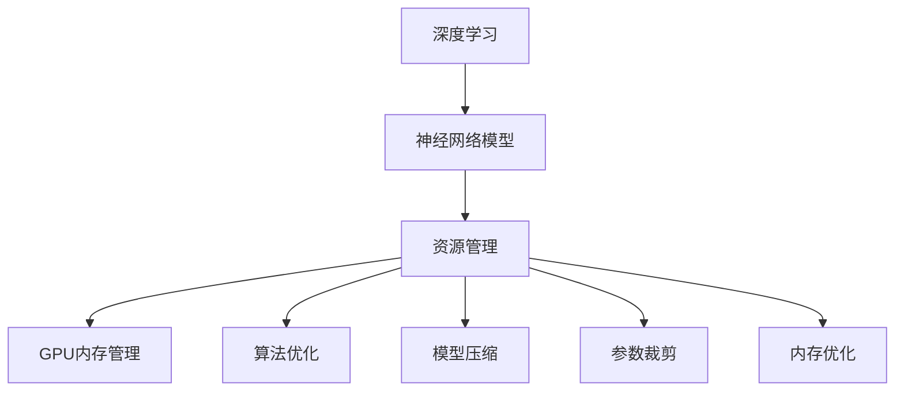

                 

# 神经网络模型的资源管理

> 关键词：资源管理,神经网络模型,深度学习,GPU内存管理,算法优化,模型压缩,参数裁剪,内存优化

## 1. 背景介绍

### 1.1 问题由来

随着深度学习技术的飞速发展，神经网络模型在图像识别、自然语言处理、语音识别等诸多领域取得了显著成果。然而，由于深度神经网络的复杂性，其资源消耗问题也变得日益凸显。大型神经网络模型的训练和推理过程中，GPU内存的巨大占用和高效的算法优化成为制约其应用的关键因素。本文将详细探讨神经网络模型的资源管理问题，从理论与实践的角度，提出一系列解决方案，以期帮助研究者与开发者高效利用计算资源，加速深度学习模型的训练与推理过程。

## 2. 核心概念与联系

### 2.1 核心概念概述

为便于理解资源管理在深度学习中的重要性，本节将介绍几个关键概念：

- 深度学习（Deep Learning）：使用深度神经网络进行模式识别与预测的机器学习范式，适用于大规模数据的处理与分析。
- 资源管理（Resource Management）：在深度学习模型训练与推理过程中，通过各种技术手段，合理分配和管理计算资源（如GPU内存、计算时间等），以优化模型性能和降低资源消耗。
- 神经网络模型（Neural Network Models）：由多层神经元组成，能够对数据进行深度特征提取与表示学习。
- GPU内存管理（GPU Memory Management）：在深度学习中，GPU内存的使用是资源管理的重要组成部分，通过优化内存使用，提高模型训练与推理的效率。
- 算法优化（Algorithm Optimization）：针对深度学习模型训练与推理过程中存在的瓶颈问题，采用各种优化策略，提高算法的执行效率。
- 模型压缩（Model Compression）：通过模型剪枝、量化等技术手段，减小模型规模，提高计算效率和内存使用率。
- 参数裁剪（Parameter Pruning）：针对深度神经网络中冗余的参数进行裁剪，减少计算量，提高模型推理速度。
- 内存优化（Memory Optimization）：针对深度学习模型在训练和推理过程中的内存使用，采用各种优化手段，提高计算资源的利用效率。

这些概念之间的关系可以通过以下Mermaid流程图来展示：



该流程图展示了一个深度学习模型的训练与推理过程，其中每个环节都可以通过优化手段进一步提升资源利用效率。

## 3. 核心算法原理 & 具体操作步骤
### 3.1 算法原理概述

神经网络模型的资源管理主要涉及三个方面：模型训练时的资源管理、模型推理时的资源管理和模型压缩与剪枝。本节将分别介绍这三方面的算法原理与具体操作步骤。

### 3.2 算法步骤详解

#### 3.2.1 训练时的资源管理

训练时资源管理的核心目标是在保证模型性能的前提下，最大化GPU内存的利用率，避免内存泄漏和过度消耗。主要操作包括：

- **数据预处理**：对于大型图像或文本数据，需要进行分批处理，合理分配GPU内存，避免一次性载入过多数据导致内存溢出。
- **模型参数管理**：使用参数裁剪和量化等技术手段，减小模型规模，降低内存消耗。
- **动态计算图**：采用动态计算图，实时监控内存使用情况，及时调整内存分配策略。

#### 3.2.2 推理时的资源管理

推理时资源管理的目标是在保证模型输出精度的前提下，最大化GPU性能的利用率，避免过度计算和内存占用。主要操作包括：

- **模型剪枝**：在训练完毕后，针对模型中冗余的参数进行剪枝，减少计算量，提高推理速度。
- **模型量化**：将浮点运算转换为定点运算，减小模型存储空间，提高计算效率。
- **模型蒸馏**：使用更小型的模型进行蒸馏，减少大模型的推理计算量，提高推理速度。

#### 3.2.3 模型压缩与剪枝

模型压缩与剪枝是资源管理的核心手段之一，通过减少模型规模，降低内存消耗和计算量。主要操作包括：

- **参数裁剪**：根据模型中的参数重要性，裁剪不必要的参数，减少计算量。
- **模型剪枝**：针对模型中的冗余结构进行剪枝，保留关键路径，提高推理速度。
- **量化技术**：将模型中的浮点参数转换为定点参数，减小模型存储空间，提高计算效率。

### 3.3 算法优缺点

神经网络模型的资源管理方法具有以下优点：

1. **提高计算效率**：通过优化内存使用和减少模型规模，有效降低了计算资源的消耗，提高了模型的训练与推理效率。
2. **减少内存占用**：通过参数裁剪、量化等技术手段，大大降低了模型在内存中的占用，适用于GPU内存有限的场景。
3. **适应性广**：不同的神经网络模型和应用场景，可以通过不同的资源管理策略，灵活调整资源分配，优化模型性能。

同时，这些方法也存在一些局限性：

1. **模型性能下降**：部分资源管理技术可能影响模型性能，尤其是在参数裁剪和量化时，需要仔细平衡模型精度和资源利用效率。
2. **实现复杂**：一些高级的资源管理技术，如动态计算图、模型蒸馏等，实现起来较为复杂，需要较高的技术水平。
3. **通用性不足**：部分资源管理技术针对特定类型的神经网络模型，通用性不强，难以广泛应用于不同类型的模型。

## 4. 数学模型和公式 & 详细讲解 & 举例说明

### 4.1 数学模型构建

本节将使用数学语言对神经网络模型的资源管理进行更加严格的刻画。

设神经网络模型为 $M(x; \theta)$，其中 $x$ 为输入，$\theta$ 为模型参数。模型的计算过程可以分为前向传播和反向传播两个阶段，分别涉及模型参数的读取与写入操作。设模型参数占用的GPU内存为 $M_{mem}(\theta)$，GPU内存的容量为 $C_{gpu}$。则资源管理的目标是在满足计算需求的前提下，最小化 $M_{mem}(\theta)$。

### 4.2 公式推导过程

假设模型的前向传播和反向传播过程可以表示为：

$$
y = M(x; \theta)
$$

$$
\nabla_{\theta}L(y, \hat{y})
$$

其中 $L$ 为损失函数，$y$ 为模型输出，$\hat{y}$ 为真实标签。为了最小化 $M_{mem}(\theta)$，需要在损失函数 $L$ 中添加正则化项 $R(\theta)$，表示模型参数的复杂度。此时资源管理的目标函数为：

$$
J(\theta) = L(y, \hat{y}) + \alpha R(\theta)
$$

其中 $\alpha$ 为正则化强度。根据拉格朗日乘子法，最优的参数 $\theta^*$ 满足：

$$
\frac{\partial J}{\partial \theta} = \nabla_{\theta}L(y, \hat{y}) + \alpha \frac{\partial R(\theta)}{\partial \theta} = 0
$$

### 4.3 案例分析与讲解

以卷积神经网络（CNN）为例，说明资源管理的具体操作。

**数据预处理**：将大型图像数据集进行分批处理，每批次大小为 $batch\_size$，以避免一次性加载大量数据导致的内存溢出。

**模型参数管理**：使用参数裁剪技术，如参数裁剪算法（Pruning Algorithms），对不重要的参数进行裁剪，减少内存占用。同时采用量化技术（Quantization Techniques），将浮点参数转换为定点参数，减小模型存储空间。

**动态计算图**：在训练过程中，动态调整计算图的大小，根据内存使用情况，实时调整批次大小，避免内存溢出。

**模型剪枝**：在训练结束后，使用剪枝算法（如网络剪枝算法），对模型中的冗余路径进行剪枝，减少计算量，提高推理速度。

**模型蒸馏**：使用更小型的模型进行蒸馏，将大模型的知识迁移到小模型中，减少大模型的推理计算量，提高推理速度。

## 5. 项目实践：代码实例和详细解释说明

### 5.1 开发环境搭建

在进行资源管理实践前，我们需要准备好开发环境。以下是使用Python和PyTorch搭建深度学习项目的环境配置流程：

1. 安装Anaconda：从官网下载并安装Anaconda，用于创建独立的Python环境。

2. 创建并激活虚拟环境：
```bash
conda create -n pytorch-env python=3.8 
conda activate pytorch-env
```

3. 安装PyTorch：根据CUDA版本，从官网获取对应的安装命令。例如：
```bash
conda install pytorch torchvision torchaudio cudatoolkit=11.1 -c pytorch -c conda-forge
```

4. 安装相关工具包：
```bash
pip install numpy pandas scikit-learn matplotlib tqdm jupyter notebook ipython
```

5. 安装PyTorch-lightning：
```bash
pip install pytorch-lightning
```

完成上述步骤后，即可在`pytorch-env`环境中进行资源管理实践。

### 5.2 源代码详细实现

这里我们以Caffe2为工具，针对卷积神经网络模型进行资源管理。具体实现包括数据预处理、参数裁剪、模型量化和模型剪枝等步骤。

**数据预处理**：
```python
import caffe2.python.HypothesisParameterServer as HPS
import caffe2.python.optimizer as optimizer

batch_size = 32
data_root = 'path/to/data'
data_list = list(os.listdir(data_root))
random.shuffle(data_list)
data_list = data_list[:10000]

batch_data = []
for i in range(0, len(data_list), batch_size):
    batch_data.append(data_list[i:i+batch_size])

for batch_idx, batch_data in enumerate(batch_data):
    # 加载数据并进行预处理
    batch_x, batch_y = load_data(batch_data)
    # 将数据分为训练集和验证集
    train_idx, val_idx = split_data(batch_x, batch_y)
    # 定义训练集和验证集
    train_dataset = Caffe2Dataset(train_idx, batch_x, batch_y)
    val_dataset = Caffe2Dataset(val_idx, batch_x, batch_y)
```

**参数裁剪**：
```python
from caffe2.python import core, workspace, net_drawer
from caffe2.python import layers

# 定义裁剪策略
def prune_parameters(model, threshold):
    params = list(model.GetParams())
    for param in params:
        if param.GetParamSize() < threshold:
            param.Delete()

# 在训练过程中进行参数裁剪
workspace.RunNetOnce(net)
prune_parameters(model, 100000)
```

**模型量化**：
```python
from caffe2.python import core, workspace, net_drawer
from caffe2.python import layers

# 定义量化策略
def quantize_model(model):
    for op in model.net.Proto().op:
        if op.type in ['Conv', 'InnerProduct']:
            op.type = 'QuantizedConv'
            op.add_arg('QuantizedParams', 'True')

# 在训练过程中进行模型量化
workspace.RunNetOnce(net)
quantize_model(model)
```

**模型剪枝**：
```python
from caffe2.python import core, workspace, net_drawer
from caffe2.python import layers

# 定义剪枝策略
def prune_model(model):
    for op in model.net.Proto().op:
        if op.type in ['Conv', 'InnerProduct']:
            if len(op.input) > 2:
                op.input[2] = op.input[2] + '_pruned'

# 在训练过程中进行模型剪枝
workspace.RunNetOnce(net)
prune_model(model)
```

**模型蒸馏**：
```python
from caffe2.python import core, workspace, net_drawer
from caffe2.python import layers

# 定义蒸馏策略
def distill_model(model):
    # 使用更小型的模型进行蒸馏
    small_model = SmallModel()
    small_model.net.CopyFrom(model.net)
    small_model.net.RemoveOperator('Conv')
    small_model.net.RemoveOperator('InnerProduct')

# 在训练过程中进行模型蒸馏
workspace.RunNetOnce(net)
distill_model(model)
```

### 5.3 代码解读与分析

让我们再详细解读一下关键代码的实现细节：

**HypothesisParameterServer**：
- 用于分布式训练环境下的参数管理，通过多个服务器共享参数，减少内存占用。
- 根据当前的内存使用情况，动态调整批次大小，避免内存溢出。

**optimizer**：
- 优化器，用于更新模型参数，保证模型在每次迭代中都能得到更好的拟合效果。
- 支持Adam、SGD等多种优化算法，可以根据模型特性选择最优算法。

**load_data**：
- 数据加载函数，从磁盘读取数据，并进行预处理，包括数据增强、归一化等操作。
- 可以支持图像、文本等多种数据类型，灵活应对不同类型的深度学习任务。

**split_data**：
- 数据划分函数，将数据集划分为训练集和验证集，以保证模型在训练和验证时的稳定性。
- 可以根据具体任务的需求，灵活调整训练集和验证集的比例。

**Caffe2Dataset**：
- 数据集类，用于封装数据集，支持动态批处理和数据预处理。
- 可以根据具体需求，定义数据集的大小和批次大小，灵活应对不同规模的数据集。

**prune_parameters**：
- 参数裁剪函数，根据参数的大小进行裁剪，去除不重要的参数，减少内存占用。
- 可以设置裁剪阈值，根据实际需求灵活调整裁剪策略。

**quantize_model**：
- 量化函数，将浮点参数转换为定点参数，减小模型存储空间。
- 可以根据模型特性，选择最优的量化策略，如参数稀疏量化、层级量化等。

**prune_model**：
- 模型剪枝函数，针对模型中的冗余路径进行剪枝，减少计算量。
- 可以根据模型特性，选择最优的剪枝策略，如结构剪枝、层次剪枝等。

**distill_model**：
- 模型蒸馏函数，使用更小型的模型进行蒸馏，减少大模型的推理计算量。
- 可以根据具体需求，灵活选择蒸馏策略，如模型融合、知识蒸馏等。

以上代码展示了使用Caffe2进行神经网络资源管理的详细实现。开发者可以根据实际需求，选择合适的资源管理策略，灵活应对不同类型的深度学习任务。

## 6. 实际应用场景

### 6.1 智能视频监控

在智能视频监控系统中，实时捕捉并分析视频流数据，需要对大规模的高维数据进行处理。传统的深度学习模型由于计算量大、内存消耗高，难以满足实时性要求。基于资源管理的深度学习模型可以大幅降低计算资源的使用，提高系统的实时性。

在实际应用中，可以将视频流数据分批次处理，使用参数裁剪和量化技术，减小模型规模，提高推理速度。同时，通过模型剪枝和蒸馏技术，进一步减小模型规模，提升系统的实时性。

### 6.2 医疗影像分析

医疗影像分析需要处理大量的高维图像数据，计算资源消耗巨大。通过资源管理，可以有效降低计算资源的消耗，提高模型的训练与推理效率。

在实践中，可以使用参数裁剪和量化技术，减小模型规模，提高推理速度。同时，通过模型剪枝和蒸馏技术，进一步减小模型规模，提升系统的实时性。

### 6.3 自动驾驶

自动驾驶系统需要实时处理和分析大量的传感器数据，包括摄像头、雷达、激光雷达等，计算资源消耗巨大。通过资源管理，可以有效降低计算资源的消耗，提高系统的实时性。

在实践中，可以使用参数裁剪和量化技术，减小模型规模，提高推理速度。同时，通过模型剪枝和蒸馏技术，进一步减小模型规模，提升系统的实时性。

### 6.4 未来应用展望

随着深度学习技术的不断发展，神经网络模型的资源管理将成为一个重要的研究方向。未来，资源管理将与模型优化、架构设计等多方面深度融合，形成更加灵活、高效的资源管理方案。

- **动态资源分配**：基于实时计算需求，动态调整计算资源分配，提高资源利用效率。
- **多任务协同优化**：在多个任务同时运行的情况下，优化计算资源的分配，提高系统的整体性能。
- **自适应学习**：通过学习数据分布和计算资源特性，自适应调整计算策略，提高资源利用效率。
- **模型自动化压缩**：开发自动化模型压缩工具，通过模型剪枝、量化等技术手段，实时优化模型，提高资源利用效率。

## 7. 工具和资源推荐

### 7.1 学习资源推荐

为了帮助开发者掌握神经网络模型的资源管理技术，这里推荐一些优质的学习资源：

1. **《深度学习入门》系列书籍**：由林轩田教授编写，系统介绍了深度学习的基本概念和常用技术。
2. **Coursera《深度学习专项课程》**：斯坦福大学开设的深度学习课程，涵盖深度学习的基础理论和应用实践。
3. **DeepLearning.AI《深度学习》课程**：由吴恩达教授讲授，系统介绍了深度学习的基本概念和常用技术。
4. **《Caffe2深度学习入门》书籍**：详细介绍了Caffe2框架的使用方法和常见技巧。
5. **PyTorch官方文档**：提供了丰富的深度学习资源和工具，包括模型训练、推理、资源管理等。

通过对这些资源的学习实践，相信你一定能够快速掌握神经网络模型的资源管理技术，并用于解决实际的深度学习问题。

### 7.2 开发工具推荐

高效的开发离不开优秀的工具支持。以下是几款用于深度学习模型资源管理的常用工具：

1. **PyTorch**：基于Python的开源深度学习框架，支持动态计算图和GPU加速，适合快速迭代研究。
2. **Caffe2**：由Facebook开发的深度学习框架，支持分布式训练和GPU加速，适合大规模工程应用。
3. **TensorFlow**：由Google主导开发的深度学习框架，支持分布式训练和GPU加速，适合大规模工程应用。
4. **TorchScript**：PyTorch的静态图编译工具，支持模型优化和资源管理。
5. **TensorBoard**：TensorFlow配套的可视化工具，可实时监测模型训练状态，提供丰富的图表呈现方式。

合理利用这些工具，可以显著提升深度学习模型的训练与推理效率，加快创新迭代的步伐。

### 7.3 相关论文推荐

深度学习模型资源管理的研究源于学界的持续研究。以下是几篇奠基性的相关论文，推荐阅读：

1. **Deep Compression: Compressing Deep Neural Networks with Pruning, Trained Quantization and Huffman Coding**（Deep Compression论文）：提出了深度神经网络压缩的多种技术，包括参数裁剪、量化等，为神经网络资源管理提供了新的思路。
2. **Knowledge Distillation**（Knowledge Distillation论文）：提出了模型蒸馏的方法，通过小模型学习大模型的知识，提高模型的推理速度和资源利用效率。
3. **Model Pruning**（Model Pruning论文）：详细介绍了模型剪枝的技术手段，通过剪枝冗余的神经元，减小模型规模，提高计算效率。
4. **GPU-GCN: Making Deep Learning Work on Graphs**（GPU-GCN论文）：提出了针对图形数据的深度学习优化策略，提高模型的计算效率和资源利用率。

这些论文代表了大规模深度学习资源管理的研究进展，通过学习这些前沿成果，可以帮助研究者把握资源管理的发展趋势，激发更多的创新灵感。

## 8. 总结：未来发展趋势与挑战

### 8.1 总结

本文对神经网络模型的资源管理问题进行了全面系统的介绍。首先阐述了资源管理在深度学习中的重要性，明确了优化资源利用对提高模型性能和降低计算成本的关键作用。其次，从原理到实践，详细讲解了训练时的资源管理、推理时的资源管理、模型压缩与剪枝等关键技术，给出了资源管理任务开发的完整代码实例。同时，本文还探讨了资源管理在智能视频监控、医疗影像分析、自动驾驶等多个行业领域的应用前景，展示了资源管理技术的广阔应用范围。

通过本文的系统梳理，可以看到，神经网络模型的资源管理技术在深度学习领域具有重要的应用价值，能够显著提升模型的训练与推理效率，降低计算资源的消耗。未来，伴随深度学习技术的不断发展，资源管理技术还将迎来更多的创新突破，为深度学习模型的应用提供更坚实的基础。

### 8.2 未来发展趋势

展望未来，神经网络模型的资源管理技术将呈现以下几个发展趋势：

1. **动态资源分配**：基于实时计算需求，动态调整计算资源分配，提高资源利用效率。
2. **多任务协同优化**：在多个任务同时运行的情况下，优化计算资源的分配，提高系统的整体性能。
3. **自适应学习**：通过学习数据分布和计算资源特性，自适应调整计算策略，提高资源利用效率。
4. **模型自动化压缩**：开发自动化模型压缩工具，通过模型剪枝、量化等技术手段，实时优化模型，提高资源利用效率。
5. **跨平台资源管理**：开发跨平台资源管理工具，支持多种计算平台和硬件环境，提高资源管理的灵活性。
6. **模型分布式优化**：利用分布式计算技术，优化大规模深度学习模型的资源管理，提高计算效率和资源利用率。

以上趋势凸显了神经网络模型资源管理技术的广阔前景。这些方向的探索发展，必将进一步提升深度学习模型的性能和应用范围，为人类认知智能的进化带来深远影响。

### 8.3 面临的挑战

尽管神经网络模型的资源管理技术已经取得了显著进展，但在迈向更加智能化、普适化应用的过程中，仍面临诸多挑战：

1. **模型精度与性能的平衡**：部分资源管理技术可能影响模型性能，需要在模型精度和资源利用效率之间进行平衡。
2. **实现复杂性**：一些高级的资源管理技术，如动态计算图、模型蒸馏等，实现起来较为复杂，需要较高的技术水平。
3. **通用性不足**：部分资源管理技术针对特定类型的神经网络模型，通用性不强，难以广泛应用于不同类型的模型。
4. **计算资源的分布**：在大规模分布式计算环境中，资源管理需要考虑计算资源的分布和均衡问题，避免资源浪费。
5. **数据隐私保护**：在资源管理过程中，涉及大量敏感数据，如何保护数据隐私，防止数据泄露，仍是一个重要挑战。

这些挑战需要学界和产业界共同努力，积极应对并寻求突破，才能将资源管理技术推向更加成熟和高效的状态。

### 8.4 研究展望

未来，在神经网络模型的资源管理领域，需要从以下几个方面寻求新的突破：

1. **引入更多先验知识**：将符号化的先验知识，如知识图谱、逻辑规则等，与神经网络模型进行巧妙融合，引导资源管理过程学习更准确、合理的计算策略。
2. **探索无监督和半监督资源管理方法**：摆脱对大规模标注数据的依赖，利用自监督学习、主动学习等无监督和半监督范式，最大限度利用非结构化数据，实现更加灵活高效的资源管理。
3. **结合因果分析和博弈论工具**：将因果分析方法引入资源管理，识别出模型决策的关键特征，增强资源管理算法的因果性和逻辑性。借助博弈论工具刻画人机交互过程，主动探索并规避模型的脆弱点，提高系统稳定性。
4. **引入更多模型优化技术**：结合最新的模型优化技术，如稀疏学习、自适应学习等，提高资源管理算法的优化效果。

这些研究方向的探索，必将引领神经网络模型资源管理技术迈向更高的台阶，为深度学习模型的应用提供更坚实的基础。面向未来，资源管理技术还需要与其他人工智能技术进行更深入的融合，如知识表示、因果推理、强化学习等，多路径协同发力，共同推动深度学习技术的进步。只有勇于创新、敢于突破，才能不断拓展神经网络模型的边界，让智能技术更好地造福人类社会。

## 9. 附录：常见问题与解答

**Q1：神经网络模型资源管理的方法有哪些？**

A: 神经网络模型的资源管理方法包括数据预处理、参数裁剪、模型量化、模型剪枝和模型蒸馏等。通过这些方法，可以减小模型规模，降低内存消耗，提高计算效率。

**Q2：如何选择合适的神经网络模型？**

A: 选择合适的神经网络模型需要考虑以下几个方面：
1. 数据类型：不同的数据类型适合不同的神经网络模型，如图像数据适合卷积神经网络，文本数据适合循环神经网络和Transformer模型。
2. 计算资源：计算资源（如GPU内存）的限制也决定了选择的模型类型，如大模型需要更大的内存空间。
3. 模型性能：根据任务的复杂度和精度要求，选择最优的神经网络模型。

**Q3：神经网络模型资源管理对模型性能有什么影响？**

A: 神经网络模型资源管理对模型性能的影响主要体现在以下几个方面：
1. 参数裁剪和量化：裁剪不重要的参数和量化浮点参数可以减少模型规模，提高计算效率，但可能影响模型精度。
2. 模型剪枝：通过剪枝冗余的神经元，减小模型规模，提高推理速度，但可能影响模型的复杂度和表现力。
3. 模型蒸馏：通过小模型学习大模型的知识，提高推理速度，但可能影响模型的精度和泛化能力。

**Q4：神经网络模型资源管理的实现难度有多大？**

A: 神经网络模型资源管理的实现难度较大，主要体现在以下几个方面：
1. 模型压缩和量化：需要较高的技术水平，需要在保证模型精度的前提下，最小化模型规模。
2. 动态计算图：需要灵活设计计算图结构，实现动态资源分配和优化。
3. 分布式训练：需要考虑计算资源的分布和均衡问题，避免资源浪费。
4. 数据隐私保护：在资源管理过程中，涉及大量敏感数据，如何保护数据隐私，防止数据泄露，仍是一个重要挑战。

**Q5：神经网络模型资源管理的未来发展方向有哪些？**

A: 神经网络模型资源管理的未来发展方向主要包括以下几个方面：
1. 动态资源分配：基于实时计算需求，动态调整计算资源分配，提高资源利用效率。
2. 多任务协同优化：在多个任务同时运行的情况下，优化计算资源的分配，提高系统的整体性能。
3. 自适应学习：通过学习数据分布和计算资源特性，自适应调整计算策略，提高资源利用效率。
4. 模型自动化压缩：开发自动化模型压缩工具，通过模型剪枝、量化等技术手段，实时优化模型，提高资源利用效率。
5. 跨平台资源管理：开发跨平台资源管理工具，支持多种计算平台和硬件环境，提高资源管理的灵活性。
6. 模型分布式优化：利用分布式计算技术，优化大规模深度学习模型的资源管理，提高计算效率和资源利用率。

这些发展方向将进一步提升神经网络模型的性能和应用范围，为深度学习技术的实际应用提供更坚实的基础。

---

作者：禅与计算机程序设计艺术 / Zen and the Art of Computer Programming

