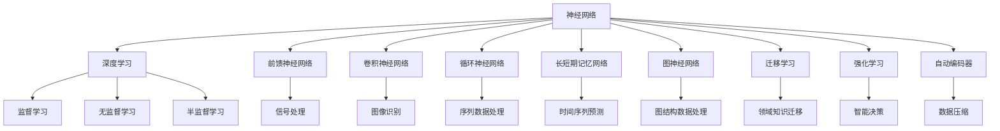

                 

# 神经网络：人工智能的基石

> 关键词：神经网络,深度学习,人工智能,机器学习,前馈神经网络,卷积神经网络,CNN,循环神经网络,RNN,长短期记忆网络,LSTM,图神经网络,GNN,迁移学习,强化学习,自动编码器,自编码器,监督学习,无监督学习,半监督学习

## 1. 背景介绍

### 1.1 问题由来

人工智能（AI）的快速发展，不仅改变了人们的生活方式，也对社会产生了深远影响。其中，神经网络作为人工智能的核心技术，是现代深度学习与机器学习研究的重要基石。深度神经网络不仅在图像识别、语音识别、自然语言处理等经典领域取得了显著进展，还在推荐系统、自动驾驶、医疗诊断等领域显示出了强大的应用潜力。

神经网络的研究始于1950年代的生物学界，当时的科学家们受生物学中神经元网络启发，提出了基于神经元连接的网络模型。随后，科学家们不断在理论上探索神经网络的特性，逐步发展出各种类型的网络结构，包括前馈神经网络（Feedforward Neural Network, FNN）、卷积神经网络（Convolutional Neural Network, CNN）、循环神经网络（Recurrent Neural Network, RNN）等。这些网络结构被广泛应用于图像处理、语音识别、自然语言处理等多个领域，极大地推动了人工智能技术的发展。

### 1.2 问题核心关键点

神经网络的发展历程体现了其在人工智能中的重要地位。其主要研究关键点包括：

- **网络结构**：包括前馈、卷积、循环等不同类型的神经网络。
- **模型训练**：如反向传播算法、梯度下降算法、优化器选择等。
- **模型评估**：如损失函数、精度、召回率、F1分数等。
- **应用场景**：如图像处理、语音识别、自然语言处理、推荐系统、自动驾驶等。
- **研究进展**：包括深度学习的兴起、迁移学习、强化学习、自编码器、变分自编码器等。

这些关键点构成了神经网络研究的主要内容，并在实际应用中取得了显著成效。

### 1.3 问题研究意义

神经网络的研究不仅推动了人工智能技术的进步，还对社会的各个方面产生了深远的影响。其研究意义主要体现在：

- **技术创新**：神经网络提供了高效、灵活的计算模型，推动了深度学习与机器学习技术的快速发展。
- **应用广泛**：在医疗、金融、教育、交通等领域，神经网络的应用提升了效率和准确性，创造了巨大的经济价值。
- **社会影响**：神经网络的普及和应用，改变了人们的生活方式，促进了社会信息化、智能化水平的提升。
- **学术贡献**：神经网络的研究成果为人工智能领域的学术研究提供了新的思路和方法。

## 2. 核心概念与联系

### 2.1 核心概念概述

为更好地理解神经网络的工作原理和架构，本节将介绍几个关键概念：

- **神经网络**：一种由多个神经元（神经元模拟大脑神经细胞的功能）组成的计算模型，能够实现复杂的数据处理和模式识别。
- **深度学习**：一种基于神经网络的学习方法，通过多层次的特征提取和抽象，实现对复杂数据的建模和预测。
- **前馈神经网络（FNN）**：神经网络的一种基本形式，其信息只能单向传递，即从前向后流动。
- **卷积神经网络（CNN）**：一种特殊的FNN，主要用于图像识别等局部相关的任务，通过卷积层和池化层提取局部特征。
- **循环神经网络（RNN）**：一种能够处理序列数据的神经网络，通过循环连接实现时间上的信息传递。
- **长短期记忆网络（LSTM）**：一种RNN的改进模型，通过门控机制有效解决了长期依赖问题。
- **图神经网络（GNN）**：一种处理图结构数据的神经网络，通过节点和边之间的交互实现信息传递。
- **迁移学习**：将一个领域学到的知识迁移到另一个领域，提升新任务的学习效果。
- **强化学习**：一种通过奖励机制训练模型，使其在特定环境中做出最优决策的学习方法。
- **自动编码器（Autoencoder）**：一种无监督学习算法，用于数据压缩与特征提取。

这些概念之间的逻辑关系可以通过以下Mermaid流程图来展示：



这个流程图展示了神经网络及其相关概念在人工智能领域的广泛应用和联系。

## 3. 核心算法原理 & 具体操作步骤
### 3.1 算法原理概述

神经网络通过模拟大脑神经元之间的连接和信息传递，实现对复杂数据的处理和模式识别。其基本工作原理如下：

1. **数据输入**：神经网络接受输入数据，通常为数值形式的向量或矩阵。
2. **信息传递**：输入数据通过网络中的层级传递，每个神经元接收前一层的输出，并根据自身权重和激活函数计算输出。
3. **损失函数计算**：网络输出与真实标签进行对比，计算损失函数。
4. **反向传播**：使用反向传播算法，通过链式法则计算损失函数对网络参数的梯度。
5. **参数更新**：根据梯度信息，使用优化算法（如SGD、Adam等）更新网络参数。

这个过程不断迭代，直到损失函数收敛，网络达到最优状态。神经网络的核心算法包括前馈传播、反向传播、梯度下降等，其中反向传播算法是神经网络训练的核心。

### 3.2 算法步骤详解

神经网络的具体训练步骤如下：

1. **数据准备**：收集和预处理训练数据，将其转化为适合网络输入的格式。
2. **网络初始化**：初始化神经网络的结构和参数。
3. **前向传播**：将输入数据通过网络，计算网络输出。
4. **损失计算**：计算网络输出与真实标签之间的损失。
5. **反向传播**：使用反向传播算法计算损失函数对网络参数的梯度。
6. **参数更新**：使用优化算法（如SGD、Adam等）更新网络参数。
7. **迭代训练**：重复上述步骤，直到损失函数收敛或达到预设的迭代次数。

### 3.3 算法优缺点

神经网络作为一种强大的机器学习工具，具有以下优点：

- **灵活性高**：神经网络可以适应各种类型的数据和任务，具有很高的泛化能力。
- **自动特征提取**：通过多层次的神经元连接，神经网络可以自动提取数据的高级特征。
- **高性能**：深度神经网络在多个领域的性能已经接近甚至超越人类专家。
- **应用广泛**：广泛应用于图像处理、语音识别、自然语言处理、推荐系统等多个领域。

同时，神经网络也存在以下缺点：

- **计算资源需求高**：神经网络需要大量的计算资源进行训练和推理。
- **训练时间长**：深度神经网络需要较长的训练时间，且容易过拟合。
- **可解释性差**：神经网络通常被视为“黑盒”模型，难以解释其决策过程。
- **稳定性差**：神经网络对数据分布的微小变化可能非常敏感。

### 3.4 算法应用领域

神经网络的应用领域非常广泛，以下是几个典型的应用场景：

1. **图像处理**：卷积神经网络在图像分类、目标检测、图像生成等方面表现出色。
2. **语音识别**：卷积神经网络和循环神经网络被广泛应用于语音识别和语音合成。
3. **自然语言处理**：递归神经网络和长短期记忆网络被广泛应用于文本分类、情感分析、机器翻译等任务。
4. **推荐系统**：神经网络被用于推荐系统，实现个性化推荐。
5. **自动驾驶**：神经网络被用于自动驾驶中的物体检测、路径规划等任务。
6. **医疗诊断**：神经网络被用于医疗图像的分类和分析，提升诊断准确性。

此外，神经网络还在金融、交通、安全等多个领域得到广泛应用，展示了其强大的应用潜力。

## 4. 数学模型和公式 & 详细讲解  
### 4.1 数学模型构建

神经网络的基本模型由多个层次的神经元组成，每个神经元接收前一层的输出，并计算自身输出。假设有 $N$ 个输入神经元，$M$ 个隐藏层神经元，$K$ 个输出神经元，神经网络的结构可以表示为：

$$
\begin{aligned}
\text{隐藏层神经元} &= \text{激活函数}(\text{权重矩阵} \times \text{前一层输出} + \text{偏置向量}) \\
\text{输出层神经元} &= \text{激活函数}(\text{权重矩阵} \times \text{隐藏层输出} + \text{偏置向量})
\end{aligned}
$$

其中，激活函数通常采用 sigmoid、ReLU、tanh 等非线性函数。权重矩阵和偏置向量需要根据训练数据进行优化。

### 4.2 公式推导过程

以下以一个简单的前馈神经网络为例，推导其训练过程的数学公式。

假设有 $N$ 个输入神经元，$M$ 个隐藏层神经元，$K$ 个输出神经元，神经网络的激活函数为 ReLU，损失函数为均方误差（MSE），优化算法为梯度下降。训练数据的输入为 $x$，输出为 $y$。

神经网络的输出为：

$$
z_h = W_h \times x + b_h \\
a_h = \text{ReLU}(z_h) \\
z_k = W_k \times a_h + b_k \\
y = \text{ReLU}(z_k)
$$

其中，$W_h$ 和 $b_h$ 为隐藏层的权重和偏置，$W_k$ 和 $b_k$ 为输出层的权重和偏置。

均方误差损失函数为：

$$
L = \frac{1}{2N} \sum_{i=1}^{N} (y_i - \hat{y}_i)^2
$$

其中，$y_i$ 为真实标签，$\hat{y}_i$ 为网络预测输出。

使用梯度下降优化算法，对网络参数 $W_h$、$b_h$、$W_k$、$b_k$ 的更新公式为：

$$
\begin{aligned}
\Delta W_h &= \eta \frac{\partial L}{\partial W_h} \\
\Delta b_h &= \eta \frac{\partial L}{\partial b_h} \\
\Delta W_k &= \eta \frac{\partial L}{\partial W_k} \\
\Delta b_k &= \eta \frac{\partial L}{\partial b_k}
\end{aligned}
$$

其中，$\eta$ 为学习率。

使用链式法则计算损失函数对 $W_h$、$b_h$、$W_k$、$b_k$ 的梯度，得到：

$$
\begin{aligned}
\frac{\partial L}{\partial W_h} &= \frac{1}{N} (a_h - y) \cdot a_h \cdot x^T \\
\frac{\partial L}{\partial b_h} &= \frac{1}{N} (a_h - y) \cdot \nabla \text{ReLU}(z_h) \\
\frac{\partial L}{\partial W_k} &= \frac{1}{N} (\hat{y} - y) \cdot a_h \cdot \nabla \text{ReLU}(z_k) \\
\frac{\partial L}{\partial b_k} &= \frac{1}{N} (\hat{y} - y) \cdot \nabla \text{ReLU}(z_k)
\end{aligned}
$$

其中，$\nabla \text{ReLU}(z_h)$ 和 $\nabla \text{ReLU}(z_k)$ 分别为 ReLU 函数的梯度。

### 4.3 案例分析与讲解

以手写数字识别为例，使用卷积神经网络（CNN）进行训练。CNN 通常包括卷积层、池化层、全连接层等。以下是一个简单的 CNN 结构：

```
卷积层（3x3） -> ReLU -> 池化层（2x2） -> ReLU -> 全连接层 -> softmax
```

其中，卷积层和池化层用于提取图像特征，全连接层用于分类。假设输入图像大小为 $28 \times 28$，输出层有10个神经元，表示10个数字类别。

使用均方误差损失函数，训练过程的数学推导如下：

1. **前向传播**：
$$
\begin{aligned}
z_{conv} &= \text{Conv2D}(x) \\
a_{conv} &= \text{ReLU}(z_{conv}) \\
z_{pool} &= \text{MaxPooling2D}(a_{conv}) \\
a_{pool} &= \text{ReLU}(z_{pool}) \\
z_{fc} &= \text{Flatten}(a_{pool}) \\
a_{fc} &= \text{ReLU}(z_{fc}) \\
y &= \text{softmax}(a_{fc})
\end{aligned}
$$

2. **损失计算**：
$$
L = \frac{1}{N} \sum_{i=1}^{N} (y_i - \hat{y}_i)^2
$$

3. **反向传播**：
$$
\begin{aligned}
\frac{\partial L}{\partial a_{fc}} &= y - \hat{y} \\
\frac{\partial L}{\partial z_{fc}} &= \frac{\partial L}{\partial a_{fc}} \cdot \nabla \text{ReLU}(z_{fc}) \\
\frac{\partial L}{\partial W_{fc}} &= \frac{\partial L}{\partial z_{fc}} \cdot a_{pool} \\
\frac{\partial L}{\partial b_{fc}} &= \frac{\partial L}{\partial z_{fc}} \\
\frac{\partial L}{\partial a_{pool}} &= \frac{\partial L}{\partial z_{fc}} \cdot \nabla \text{ReLU}(z_{fc}) \\
\frac{\partial L}{\partial z_{pool}} &= \frac{\partial L}{\partial a_{pool}} \cdot \nabla \text{ReLU}(z_{pool}) \\
\frac{\partial L}{\partial a_{conv}} &= \frac{\partial L}{\partial z_{pool}} \cdot \nabla \text{ReLU}(z_{pool}) \\
\frac{\partial L}{\partial z_{conv}} &= \frac{\partial L}{\partial a_{conv}} \cdot \nabla \text{ReLU}(z_{conv}) \\
\frac{\partial L}{\partial W_{conv}} &= \frac{\partial L}{\partial z_{conv}} \cdot x \\
\frac{\partial L}{\partial b_{conv}} &= \frac{\partial L}{\partial z_{conv}} \\
\frac{\partial L}{\partial x} &= \frac{\partial L}{\partial z_{conv}} \cdot \nabla \text{Conv2D}(x)
\end{aligned}
$$

其中，$\nabla \text{ReLU}(z_{conv})$、$\nabla \text{ReLU}(z_{fc})$ 和 $\nabla \text{ReLU}(z_{pool})$ 分别为 ReLU 函数的梯度，$\text{Conv2D}(x)$ 和 $\text{MaxPooling2D}(a_{conv})$ 分别为卷积和池化操作。

通过上述数学推导，我们可以看到神经网络的训练过程包含了前向传播、损失计算、反向传播等步骤，这些步骤的计算和优化过程构成了神经网络的训练流程。

## 5. 项目实践：代码实例和详细解释说明
### 5.1 开发环境搭建

在进行神经网络项目实践前，我们需要准备好开发环境。以下是使用 Python 进行 PyTorch 开发的环境配置流程：

1. 安装 Anaconda：从官网下载并安装 Anaconda，用于创建独立的 Python 环境。

2. 创建并激活虚拟环境：
```bash
conda create -n pytorch-env python=3.8 
conda activate pytorch-env
```

3. 安装 PyTorch：根据 CUDA 版本，从官网获取对应的安装命令。例如：
```bash
conda install pytorch torchvision torchaudio cudatoolkit=11.1 -c pytorch -c conda-forge
```

4. 安装 Transformers 库：
```bash
pip install transformers
```

5. 安装各类工具包：
```bash
pip install numpy pandas scikit-learn matplotlib tqdm jupyter notebook ipython
```

完成上述步骤后，即可在 `pytorch-env` 环境中开始神经网络实践。

### 5.2 源代码详细实现

下面我们以手写数字识别为例，给出使用 PyTorch 对卷积神经网络进行训练的 PyTorch 代码实现。

首先，定义卷积神经网络的模型结构：

```python
import torch
import torch.nn as nn
import torch.nn.functional as F

class CNN(nn.Module):
    def __init__(self):
        super(CNN, self).__init__()
        self.conv1 = nn.Conv2d(1, 32, 3, 1)
        self.pool = nn.MaxPool2d(2, 2)
        self.conv2 = nn.Conv2d(32, 64, 3, 1)
        self.fc1 = nn.Linear(64 * 7 * 7, 128)
        self.fc2 = nn.Linear(128, 10)

    def forward(self, x):
        x = self.pool(F.relu(self.conv1(x)))
        x = self.pool(F.relu(self.conv2(x)))
        x = x.view(-1, 64 * 7 * 7)
        x = F.relu(self.fc1(x))
        x = self.fc2(x)
        return F.softmax(x, dim=1)
```

然后，定义训练和评估函数：

```python
from torch.utils.data import DataLoader
from tqdm import tqdm
import matplotlib.pyplot as plt

def train_epoch(model, optimizer, criterion, train_loader):
    model.train()
    epoch_loss = 0
    for batch in tqdm(train_loader, desc='Training'):
        inputs, labels = batch
        optimizer.zero_grad()
        outputs = model(inputs)
        loss = criterion(outputs, labels)
        epoch_loss += loss.item()
        loss.backward()
        optimizer.step()
    return epoch_loss / len(train_loader)

def evaluate(model, criterion, test_loader):
    model.eval()
    test_loss = 0
    correct = 0
    with torch.no_grad():
        for batch in tqdm(test_loader, desc='Evaluating'):
            inputs, labels = batch
            outputs = model(inputs)
            test_loss += criterion(outputs, labels).item()
            _, predicted = torch.max(outputs.data, 1)
            total = labels.size(0)
            correct += (predicted == labels).sum().item()
    test_loss /= len(test_loader.dataset)
    accuracy = 100. * correct / total
    print(f'Test loss: {test_loss:.4f}\nAccuracy: {accuracy:.2f}%')
```

接着，定义训练流程：

```python
from torchvision import datasets, transforms

# 数据预处理
transform = transforms.Compose([
    transforms.ToTensor(),
    transforms.Normalize((0.1307,), (0.3081,))
])

train_dataset = datasets.MNIST(root='./data', train=True, download=True, transform=transform)
test_dataset = datasets.MNIST(root='./data', train=False, download=True, transform=transform)

train_loader = DataLoader(train_dataset, batch_size=64, shuffle=True)
test_loader = DataLoader(test_dataset, batch_size=64, shuffle=False)

# 定义模型和优化器
model = CNN().to(device)
criterion = nn.CrossEntropyLoss()
optimizer = torch.optim.Adam(model.parameters(), lr=0.001)

# 训练过程
epochs = 5
device = torch.device('cuda' if torch.cuda.is_available() else 'cpu')
for epoch in range(epochs):
    loss = train_epoch(model, optimizer, criterion, train_loader)
    print(f'Epoch {epoch+1}, train loss: {loss:.4f}')
    
    evaluate(model, criterion, test_loader)

print('Test results:')
evaluate(model, criterion, test_loader)
```

以上就是使用 PyTorch 对卷积神经网络进行手写数字识别的完整代码实现。可以看到，得益于 PyTorch 的强大封装和模块化设计，我们可以用相对简洁的代码完成模型的构建和训练。

### 5.3 代码解读与分析

让我们再详细解读一下关键代码的实现细节：

**CNN 模型定义**：
- `__init__` 方法：定义了模型的层次结构和权重初始化。
- `forward` 方法：实现了前向传播计算，包括卷积、池化、全连接等操作。

**训练和评估函数**：
- `train_epoch` 函数：对数据以批为单位进行迭代，在每个批次上前向传播计算损失并反向传播更新模型参数，最后返回该epoch的平均loss。
- `evaluate` 函数：与训练类似，不同点在于不更新模型参数，并在每个batch结束后将预测和标签结果存储下来，最后使用准确率来评估模型性能。

**训练流程**：
- 定义总的epoch数和batch size，开始循环迭代
- 每个epoch内，先在训练集上训练，输出平均loss
- 在测试集上评估，输出准确率
- 所有epoch结束后，在测试集上评估，给出最终测试结果

可以看到，PyTorch 配合 Transformers 库使得神经网络的实现变得简洁高效。开发者可以将更多精力放在数据处理、模型改进等高层逻辑上，而不必过多关注底层的实现细节。

当然，工业级的系统实现还需考虑更多因素，如模型的保存和部署、超参数的自动搜索、更灵活的任务适配层等。但核心的训练范式基本与此类似。

## 6. 实际应用场景
### 6.1 计算机视觉

卷积神经网络（CNN）是计算机视觉领域的主要算法之一，广泛应用于图像分类、目标检测、图像生成等任务。

以图像分类为例，卷积神经网络通过对图像的像素进行卷积操作，提取局部特征，再通过池化操作进行特征降维，最后通过全连接层进行分类。在训练过程中，使用交叉熵损失函数进行监督学习，通过反向传播算法优化模型参数。通过大量标注数据的训练，CNN 可以实现非常高的分类准确率。

在实际应用中，卷积神经网络已经被广泛应用于智能监控、医学影像分析、自动驾驶等领域，帮助实现高精度的图像识别和分类。

### 6.2 自然语言处理

递归神经网络（RNN）和长短期记忆网络（LSTM）在自然语言处理领域有着广泛应用，特别是在文本分类、机器翻译、对话系统等任务上表现出色。

以文本分类为例，RNN 通过对文本进行逐字符或逐单词处理，提取文本的语义信息，再通过全连接层进行分类。在训练过程中，使用交叉熵损失函数进行监督学习，通过反向传播算法优化模型参数。通过大量标注数据的训练，RNN 可以实现非常高的分类准确率。

在实际应用中，RNN 已经被广泛应用于情感分析、垃圾邮件过滤、机器翻译等领域，帮助实现高精度的文本分类和翻译。

### 6.3 语音处理

卷积神经网络（CNN）和循环神经网络（RNN）在语音处理领域也有广泛应用，特别是在语音识别、语音合成等任务上表现出色。

以语音识别为例，卷积神经网络通过对语音信号进行时频变换，提取频谱特征，再通过全连接层进行分类。在训练过程中，使用交叉熵损失函数进行监督学习，通过反向传播算法优化模型参数。通过大量标注数据的训练，CNN 可以实现非常高的识别准确率。

在实际应用中，CNN 已经被广泛应用于智能音箱、语音助手、电话客服等领域，帮助实现高精度的语音识别和合成。

### 6.4 未来应用展望

随着神经网络技术的不断进步，未来神经网络将呈现以下几个发展趋势：

1. **模型规模增大**：随着算力成本的下降和数据规模的扩张，神经网络的参数量还将持续增长。超大规模神经网络蕴含的丰富知识，将提升新任务的学习效果。
2. **算法不断优化**：神经网络将不断涌现更多高效的训练和优化算法，如自适应学习率、梯度加速、模型压缩等，提高训练效率和模型性能。
3. **跨模态融合**：神经网络将更加注重不同模态数据的融合，如图像、语音、文本等多模态数据的联合建模，提升综合感知能力。
4. **对抗训练**：神经网络将更加注重对抗训练，提高模型的鲁棒性和安全性，防范恶意攻击。
5. **分布式训练**：随着计算资源的需求增加，神经网络的分布式训练将变得更加重要，通过多机协同训练，提升训练速度和模型性能。

这些趋势将进一步推动神经网络技术的发展，提升其在各个领域的应用效果。

## 7. 工具和资源推荐
### 7.1 学习资源推荐

为了帮助开发者系统掌握神经网络的理论基础和实践技巧，这里推荐一些优质的学习资源：

1. **《深度学习》教材**：由 Ian Goodfellow、Yoshua Bengio 和 Aaron Courville 所著，全面介绍了深度学习的理论基础和算法实现。
2. **CS231n《深度学习与计算机视觉》课程**：斯坦福大学开设的计算机视觉领域明星课程，涵盖深度学习在计算机视觉中的应用。
3. **CS224N《自然语言处理》课程**：斯坦福大学开设的自然语言处理领域明星课程，涵盖深度学习在自然语言处理中的应用。
4. **DeepLearning.AI 深度学习课程**：由 Andrew Ng 创办的深度学习课程，适合初学者入门学习。
5. **Kaggle 竞赛**：Kaggle 提供丰富的数据集和竞赛，可以帮助开发者实践和提升深度学习技能。

通过对这些资源的学习实践，相信你一定能够快速掌握神经网络的技术精髓，并用于解决实际的计算机视觉和自然语言处理问题。

### 7.2 开发工具推荐

高效的开发离不开优秀的工具支持。以下是几款用于神经网络开发的常用工具：

1. **PyTorch**：基于 Python 的开源深度学习框架，灵活动态的计算图，适合快速迭代研究。大多数神经网络模型都有 PyTorch 版本的实现。
2. **TensorFlow**：由 Google 主导开发的开源深度学习框架，生产部署方便，适合大规模工程应用。同样有丰富的神经网络资源。
3. **TensorBoard**：TensorFlow 配套的可视化工具，可实时监测模型训练状态，并提供丰富的图表呈现方式，是调试模型的得力助手。
4. **Weights & Biases**：模型训练的实验跟踪工具，可以记录和可视化模型训练过程中的各项指标，方便对比和调优。与主流深度学习框架无缝集成。

合理利用这些工具，可以显著提升神经网络微调任务的开发效率，加快创新迭代的步伐。

### 7.3 相关论文推荐

神经网络的研究源于学界的持续研究。以下是几篇奠基性的相关论文，推荐阅读：

1. **《深度学习》**：Ian Goodfellow 等著，全面介绍了深度学习的理论基础和算法实现。
2. **《ImageNet Classification with Deep Convolutional Neural Networks》**：Alex Krizhevsky 等著，首次展示了卷积神经网络在图像分类任务上的强大能力。
3. **《Long Short-Term Memory》**：Jeffrey Hinton 等著，提出长短期记忆网络，解决了 RNN 的长期依赖问题。
4. **《Attention is All You Need》**：Ashish Vaswani 等著，提出 Transformer 结构，奠定了自注意力机制的基础。

这些论文代表了大规模神经网络的研究进展。通过学习这些前沿成果，可以帮助研究者把握学科前进方向，激发更多的创新灵感。

## 8. 总结：未来发展趋势与挑战

### 8.1 总结

本文对神经网络的工作原理和应用进行了全面系统的介绍。首先阐述了神经网络在人工智能中的重要地位，明确了其核心算法和研究关键点。其次，从原理到实践，详细讲解了神经网络的基本结构、训练过程、优化算法等核心内容，给出了神经网络训练的完整代码实例。同时，本文还广泛探讨了神经网络在计算机视觉、自然语言处理、语音处理等多个领域的应用前景，展示了神经网络技术的强大应用潜力。此外，本文精选了神经网络学习的各类资源，力求为读者提供全方位的技术指引。

通过本文的系统梳理，可以看到，神经网络的研究不仅推动了深度学习与机器学习技术的进步，还对社会各个方面产生了深远的影响。未来，随着神经网络技术的不断演进，其在计算机视觉、自然语言处理、语音处理等多个领域的广泛应用，必将带来更深远的变革。

### 8.2 未来发展趋势

展望未来，神经网络技术将呈现以下几个发展趋势：

1. **模型规模增大**：随着算力成本的下降和数据规模的扩张，神经网络的参数量还将持续增长。超大规模神经网络蕴含的丰富知识，将提升新任务的学习效果。
2. **算法不断优化**：神经网络将不断涌现更多高效的训练和优化算法，如自适应学习率、梯度加速、模型压缩等，提高训练效率和模型性能。
3. **跨模态融合**：神经网络将更加注重不同模态数据的融合，如图像、语音、文本等多模态数据的联合建模，提升综合感知能力。
4. **对抗训练**：神经网络将更加注重对抗训练，提高模型的鲁棒性和安全性，防范恶意攻击。
5. **分布式训练**：随着计算资源的需求增加，神经网络的分布式训练将变得更加重要，通过多机协同训练，提升训练速度和模型性能。

这些趋势将进一步推动神经网络技术的发展，提升其在各个领域的应用效果。

### 8.3 面临的挑战

尽管神经网络技术已经取得了显著成就，但在迈向更加智能化、普适化应用的过程中，它仍面临诸多挑战：

1. **计算资源需求高**：神经网络需要大量的计算资源进行训练和推理。超大规模神经网络尤其如此，往往需要高性能的 GPU/TPU 设备。
2. **训练时间长**：深度神经网络需要较长的训练时间，且容易过拟合。特别是在数据量不足的情况下，训练过程可能非常耗时。
3. **可解释性差**：神经网络通常被视为“黑盒”模型，难以解释其决策过程。对于医疗、金融等高风险应用，算法的可解释性和可审计性尤为重要。
4. **安全性差**：神经网络可能学习到有偏见、有害的信息，通过微调传递到下游任务，产生误导性、歧视性的输出，给实际应用带来安全隐患。
5. **知识整合能力不足**：现有的神经网络模型往往局限于任务内数据，难以灵活吸收和运用更广泛的先验知识。如何让神经网络过程更好地与外部知识库、规则库等专家知识结合，形成更加全面、准确的信息整合能力，还有很大的想象空间。

这些挑战亟需解决，以确保神经网络技术的可控性和可靠性，避免潜在的负面影响。

### 8.4 研究展望

面对神经网络技术所面临的挑战，未来的研究需要在以下几个方面寻求新的突破：

1. **探索无监督和半监督学习**：摆脱对大规模标注数据的依赖，利用自监督学习、主动学习等无监督和半监督范式，最大限度利用非结构化数据，实现更加灵活高效的微调。
2. **研究参数高效和计算高效的神经网络**：开发更加参数高效的神经网络结构，如 Capsule 网络、AdaLoRA 等，在固定大部分神经网络参数的同时，只更新极少量的任务相关参数。同时优化神经网络的计算图，减少前向传播和反向传播的资源消耗，实现更加轻量级、实时性的部署。
3. **引入更多先验知识**：将符号化的先验知识，如知识图谱、逻辑规则等，与神经网络模型进行巧妙融合，引导神经网络过程学习更准确、合理的知识表示。同时加强不同模态数据的整合，实现视觉、语音等多模态信息与文本信息的协同建模。
4. **结合因果分析和博弈论工具**：将因果分析方法引入神经网络，识别出网络决策的关键特征，增强输出解释的因果性和逻辑性。借助博弈论工具刻画人机交互过程，主动探索并规避神经网络的脆弱点，提高系统稳定性。
5. **纳入伦理道德约束**：在神经网络训练目标中引入伦理导向的评估指标，过滤和惩罚有偏见、有害的输出倾向。同时加强人工干预和审核，建立神经网络行为的监管机制，确保输出符合人类价值观和伦理道德。

这些研究方向的探索，必将引领神经网络技术迈向更高的台阶，为构建安全、可靠、可解释、可控的智能系统铺平道路。面向未来，神经网络技术还需要与其他人工智能技术进行更深入的融合，如知识表示、因果推理、强化学习等，多路径协同发力，共同推动自然语言理解和智能交互系统的进步。只有勇于创新、敢于突破，才能不断拓展神经网络的边界，让智能技术更好地造福人类社会。

## 9. 附录：常见问题与解答

**Q1：神经网络与传统机器学习算法有何不同？**

A: 神经网络与传统机器学习算法有以下几点不同：
1. 神经网络具有很强的非线性拟合能力，能够处理高维度、非线性的数据。
2. 神经网络通过多层结构进行特征提取和抽象，具备自动学习特征的能力。
3. 神经网络采用反向传播算法进行参数更新，具有自适应学习的能力。
4. 神经网络对数据的分布和特征变化具有较强的鲁棒性。

**Q2：如何避免神经网络过拟合？**

A: 避免神经网络过拟合有以下几种方法：
1. 数据增强：通过随机裁剪、旋转、缩放等方法扩充训练集，增加数据多样性。
2. 正则化：使用 L2 正则化、Dropout、early stopping 等方法限制模型复杂度。
3. 模型简化：通过剪枝、量化、参数共享等方法减少模型复杂度。
4. 多模型集成：训练多个模型，取平均输出，降低单个模型的过拟合风险。
5. 迁移学习：利用预训练模型的知识，减少新任务的过拟合风险。

**Q3：神经网络在训练过程中如何优化参数？**

A: 神经网络在训练过程中采用梯度下降算法进行参数更新。具体步骤如下：
1. 前向传播：将输入数据通过网络，计算网络输出。
2. 损失计算：计算网络输出与真实标签之间的损失。
3. 反向传播：使用反向传播算法计算损失函数对网络参数的梯度。
4. 参数更新：使用优化算法（如 SGD、Adam 等）更新网络参数。

**Q4：神经网络在实际应用中面临哪些挑战？**

A: 神经网络在实际应用中面临以下挑战：
1. 计算资源需求高：神经网络需要大量的计算资源进行训练和推理，超大规模神经网络尤其如此。
2. 训练时间长：深度神经网络需要较长的训练时间，且容易过拟合。
3. 可解释性差：神经网络通常被视为“黑盒”模型，难以解释其决策过程。
4. 安全性差：神经网络可能学习到有偏见、有害的信息，给实际应用带来安全隐患。
5. 知识整合能力不足：现有的神经网络模型往往局限于任务内数据，难以灵活吸收和运用更广泛的先验知识。

**Q5：如何设计高效的神经网络结构？**

A: 设计高效的神经网络结构需要考虑以下几个因素：
1. 层数和节点数：层数越多，节点数越多，模型的复杂度越高，但过深的结构容易过拟合。
2. 激活函数：选择合适的激活函数（如 ReLU、tanh、sigmoid 等），提高模型的非线性拟合能力。
3. 正则化：使用 L1、L2 正则化、Dropout 等方法限制模型复杂度。
4. 网络层的选择：根据任务特点选择合适的神经网络层（如卷积层、池化层、全连接层等）。
5. 模型简化：通过剪枝、量化、参数共享等方法减少模型复杂度。

这些设计原则可以帮助开发者设计出高效、稳定的神经网络模型。

---

作者：禅与计算机程序设计艺术 / Zen and the Art of Computer Programming

