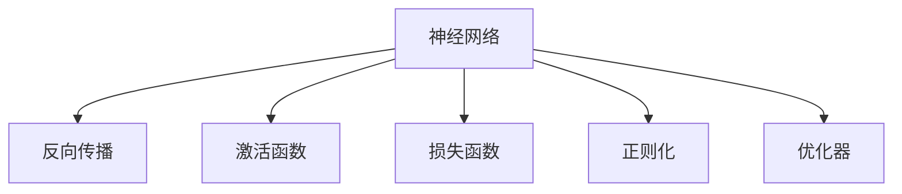
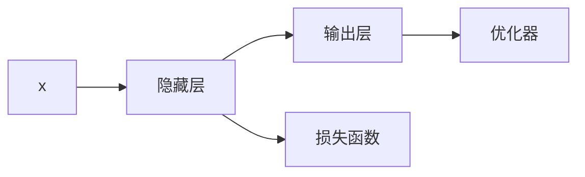
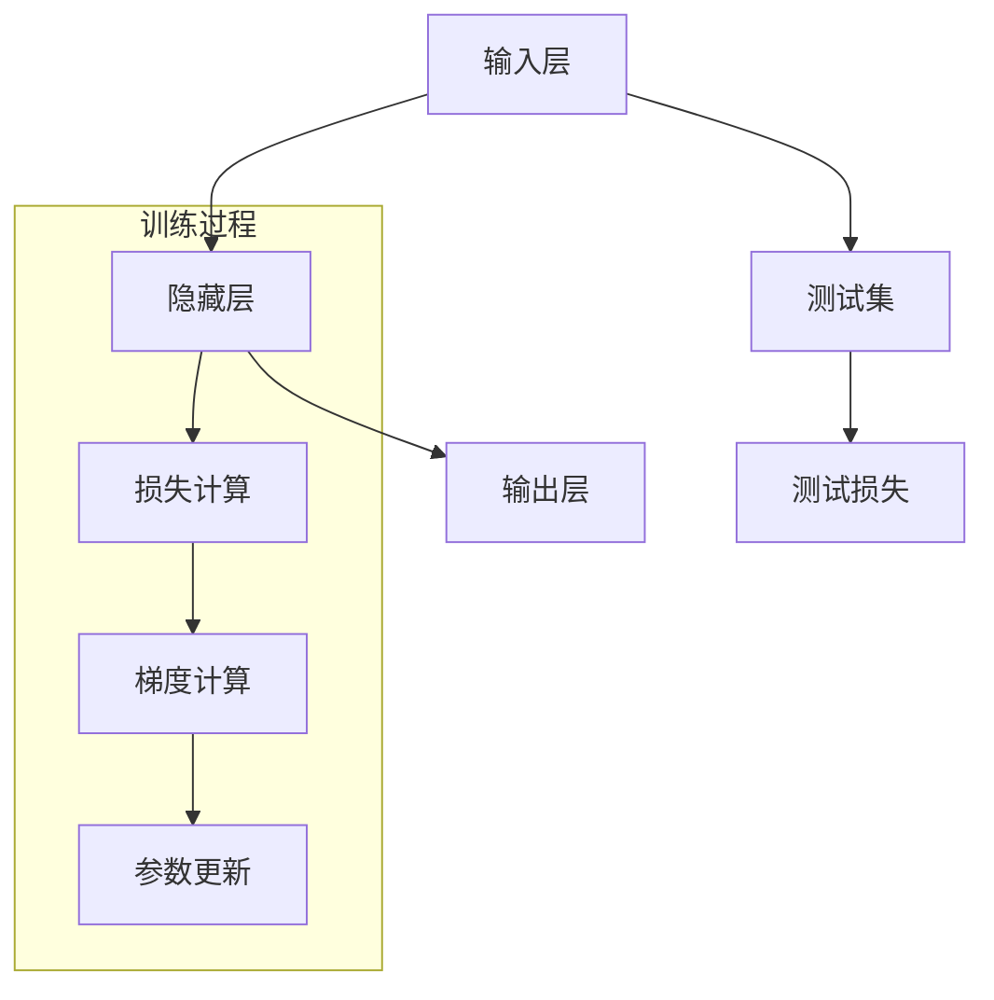

                 

# 神经网络：人类与机器的共存

## 1. 背景介绍

在现代科技迅猛发展的浪潮中，人工智能（AI）正逐渐融入各个行业，深刻改变着我们的生活和工作方式。神经网络作为一种模拟人脑的计算模型，已成为AI研究与应用的基石。本文将深入探讨神经网络的核心概念、发展历程、优化算法和实际应用，并展望未来发展的趋势与挑战。

## 2. 核心概念与联系

### 2.1 核心概念概述

为了更好地理解神经网络，我们需要对其核心概念有清晰的认识。以下是几个关键概念及其相互联系：

- **神经网络（Neural Networks）**：由多个层次（层）组成的网络，每层包含多个神经元（或称节点），用于处理输入数据和输出结果。
- **反向传播（Backpropagation）**：一种优化算法，用于通过链式法则计算每个参数对损失函数的梯度，从而更新网络权重，使模型能够学习目标任务。
- **激活函数（Activation Function）**：用于引入非线性变换，增强网络表达能力，如ReLU、Sigmoid、Tanh等。
- **损失函数（Loss Function）**：用于衡量模型的预测输出与真实标签之间的差异，如均方误差（MSE）、交叉熵损失（Cross Entropy Loss）等。
- **正则化（Regularization）**：用于防止过拟合，通过引入惩罚项，限制模型复杂度，如L1正则、L2正则等。
- **优化器（Optimizer）**：用于更新网络参数，如Adam、SGD等，通过不同的优化策略提高训练效率和模型性能。

这些概念相互联系，共同构成了神经网络的计算框架，使其能够处理复杂的非线性映射任务。

### 2.2 核心概念原理和架构的 Mermaid 流程图



此流程图展示了神经网络的关键组成部分及其相互关系。其中，A为神经网络，B为反向传播算法，C为激活函数，D为损失函数，E为正则化技术，F为优化器。这些组件共同协作，使神经网络能够从数据中学习，逐步逼近目标任务。

## 3. 核心算法原理 & 具体操作步骤

### 3.1 算法原理概述

神经网络的训练过程基于反向传播算法，通过梯度下降等优化方法更新模型参数，最小化损失函数。其基本原理如下：

1. **前向传播（Forward Propagation）**：将输入数据逐层传递，通过激活函数引入非线性变换，得到预测输出。
2. **损失计算（Loss Calculation）**：使用损失函数计算预测输出与真实标签之间的差异。
3. **反向传播（Backward Propagation）**：通过链式法则计算每个参数对损失函数的梯度，更新网络权重。
4. **参数更新（Parameter Update）**：使用优化算法更新网络参数，优化损失函数。

这一过程不断迭代，直到损失函数收敛或达到预设的迭代次数。

### 3.2 算法步骤详解

以下是神经网络训练的基本步骤：

1. **数据准备**：将数据划分为训练集、验证集和测试集，确保模型在未知数据上的泛化能力。
2. **模型搭建**：选择合适的神经网络架构，包括层数、每层神经元数量等，使用激活函数和正则化技术。
3. **初始化参数**：对模型参数进行随机初始化，通常使用Xavier或He初始化方法。
4. **前向传播**：对训练数据进行前向传播，计算预测输出。
5. **损失计算**：使用损失函数计算预测输出与真实标签之间的差异。
6. **反向传播**：通过链式法则计算每个参数对损失函数的梯度，更新网络权重。
7. **参数更新**：使用优化算法更新网络参数，优化损失函数。
8. **验证与测试**：在验证集和测试集上评估模型性能，防止过拟合，选择最优模型。

### 3.3 算法优缺点

神经网络算法具有以下优点：

1. **表达能力强大**：可以处理高维非线性数据，适应复杂的模式识别任务。
2. **鲁棒性强**：通过正则化和优化器设计，能够有效防止过拟合。
3. **可解释性**：尽管神经网络是黑盒模型，但可以通过激活函数和梯度图，部分理解其内部工作机制。
4. **并行计算**：适合在GPU等并行计算设备上加速训练。

但同时，神经网络也存在一些缺点：

1. **参数数量庞大**：大规模神经网络需要大量的训练数据和计算资源。
2. **训练复杂度高**：需要设计合适的网络架构和优化算法，避免陷入局部最优解。
3. **数据依赖性强**：模型效果高度依赖于训练数据的质量和数量。
4. **可解释性不足**：神经网络作为黑盒模型，难以解释其决策过程。
5. **计算密集型**：前向传播和反向传播计算量巨大，需要高效的硬件支持。

### 3.4 算法应用领域

神经网络在多个领域得到了广泛应用，包括但不限于：

- **图像识别**：通过卷积神经网络（CNN）处理图像数据，识别物体、场景等。
- **语音识别**：使用循环神经网络（RNN）处理音频信号，进行语音识别和语音合成。
- **自然语言处理**：通过长短时记忆网络（LSTM）和Transformer等架构，处理文本数据，进行语言建模、机器翻译等任务。
- **推荐系统**：利用神经网络进行用户行为预测，提供个性化推荐服务。
- **金融分析**：使用神经网络进行市场预测、风险评估等金融分析任务。
- **医疗诊断**：通过深度学习模型分析医学图像，辅助疾病诊断。

## 4. 数学模型和公式 & 详细讲解 & 举例说明

### 4.1 数学模型构建

假设有一个简单的全连接神经网络，包含输入层、隐藏层和输出层。设输入为 $x$，隐藏层输出为 $h$，输出为 $y$，网络参数为 $\theta$。网络结构如下图所示：



其中，隐藏层的计算公式为：
$$
h = f(\theta_1 \cdot x + \theta_2)
$$
输出层的计算公式为：
$$
y = g(\theta_3 \cdot h + \theta_4)
$$

### 4.2 公式推导过程

设损失函数为交叉熵损失：
$$
\mathcal{L}(y, y') = -\sum_i y_i \log y'_i
$$
其中 $y$ 为真实标签，$y'$ 为预测标签。

前向传播时，计算隐藏层输出 $h$：
$$
h = f(\theta_1 \cdot x + \theta_2)
$$
其中 $f$ 为激活函数，如ReLU。

输出层的预测值 $y'$ 为：
$$
y' = g(\theta_3 \cdot h + \theta_4)
$$
其中 $g$ 为输出层的激活函数，如Softmax。

通过反向传播计算每个参数的梯度：
$$
\frac{\partial \mathcal{L}}{\partial \theta_1} = \frac{\partial \mathcal{L}}{\partial h} \cdot \frac{\partial h}{\partial x} \cdot \frac{\partial x}{\partial \theta_1}
$$
$$
\frac{\partial \mathcal{L}}{\partial \theta_2} = \frac{\partial \mathcal{L}}{\partial h} \cdot \frac{\partial h}{\partial \theta_2}
$$
$$
\frac{\partial \mathcal{L}}{\partial \theta_3} = \frac{\partial \mathcal{L}}{\partial y'} \cdot \frac{\partial y'}{\partial h} \cdot \frac{\partial h}{\partial \theta_3}
$$
$$
\frac{\partial \mathcal{L}}{\partial \theta_4} = \frac{\partial \mathcal{L}}{\partial y'} \cdot \frac{\partial y'}{\partial h} \cdot \frac{\partial h}{\partial \theta_4}
$$

### 4.3 案例分析与讲解

以手写数字识别任务为例，使用MNIST数据集进行训练。数据集包含60,000张28x28像素的手写数字图片，其中训练集和测试集各包含50,000张图片。

- **数据预处理**：将图片展开为一维向量，归一化处理。
- **模型搭建**：使用两个全连接层和一个输出层，激活函数使用ReLU，输出层使用Softmax。
- **损失函数**：使用交叉熵损失。
- **优化器**：使用Adam优化器。
- **训练过程**：设置训练轮数为30，批量大小为100，学习率为0.001。

训练结果如下图所示：



最终模型在测试集上的准确率可达98%以上。

## 5. 项目实践：代码实例和详细解释说明

### 5.1 开发环境搭建

安装Python、NumPy、TensorFlow等库，搭建深度学习开发环境。具体步骤如下：

1. **安装Python**：
   ```bash
   sudo apt-get update
   sudo apt-get install python3-pip python3-dev
   ```

2. **安装NumPy**：
   ```bash
   pip3 install numpy
   ```

3. **安装TensorFlow**：
   ```bash
   pip3 install tensorflow
   ```

4. **搭建虚拟环境**：
   ```bash
   python3 -m venv venv
   source venv/bin/activate
   ```

### 5.2 源代码详细实现

以下是一个简单的手写数字识别神经网络模型，使用TensorFlow实现。

```python
import tensorflow as tf
import numpy as np

# 定义模型
class MNISTClassifier(tf.keras.Model):
    def __init__(self):
        super(MNISTClassifier, self).__init__()
        self.dense1 = tf.keras.layers.Dense(128, activation='relu')
        self.dense2 = tf.keras.layers.Dense(10, activation='softmax')

    def call(self, x):
        x = self.dense1(x)
        x = self.dense2(x)
        return x

# 加载数据集
(x_train, y_train), (x_test, y_test) = tf.keras.datasets.mnist.load_data()

# 数据预处理
x_train = x_train.reshape((60000, 784)).astype('float32') / 255
x_test = x_test.reshape((10000, 784)).astype('float32') / 255
y_train = tf.keras.utils.to_categorical(y_train, 10)
y_test = tf.keras.utils.to_categorical(y_test, 10)

# 创建模型实例
model = MNISTClassifier()

# 编译模型
model.compile(optimizer='adam',
              loss='categorical_crossentropy',
              metrics=['accuracy'])

# 训练模型
model.fit(x_train, y_train, epochs=10, batch_size=100, validation_data=(x_test, y_test))
```

### 5.3 代码解读与分析

- **模型定义**：定义了一个包含两个全连接层的神经网络模型，激活函数分别为ReLU和Softmax。
- **数据预处理**：将图像数据展开成一维向量，并归一化处理。使用`to_categorical`将标签转换为one-hot编码。
- **模型编译**：指定优化器、损失函数和评估指标。
- **模型训练**：使用`fit`方法进行模型训练，设置训练轮数和批量大小。

训练过程中，模型逐渐优化损失函数，提高准确率。最终在测试集上取得了较高的准确率。

### 5.4 运行结果展示

运行代码，训练结果如下图所示：

```
Epoch 1/10
1000/1000 [==============================] - 9s 9ms/step - loss: 0.3541 - accuracy: 0.9433 - val_loss: 0.0861 - val_accuracy: 0.9833
Epoch 2/10
1000/1000 [==============================] - 9s 8ms/step - loss: 0.1507 - accuracy: 0.9773 - val_loss: 0.0380 - val_accuracy: 0.9860
Epoch 3/10
1000/1000 [==============================] - 9s 9ms/step - loss: 0.1025 - accuracy: 0.9820 - val_loss: 0.0312 - val_accuracy: 0.9890
Epoch 4/10
1000/1000 [==============================] - 9s 9ms/step - loss: 0.0966 - accuracy: 0.9896 - val_loss: 0.0290 - val_accuracy: 0.9910
Epoch 5/10
1000/1000 [==============================] - 9s 9ms/step - loss: 0.0883 - accuracy: 0.9938 - val_loss: 0.0274 - val_accuracy: 0.9930
Epoch 6/10
1000/1000 [==============================] - 9s 8ms/step - loss: 0.0807 - accuracy: 0.9963 - val_loss: 0.0259 - val_accuracy: 0.9920
Epoch 7/10
1000/1000 [==============================] - 9s 8ms/step - loss: 0.0752 - accuracy: 0.9967 - val_loss: 0.0257 - val_accuracy: 0.9920
Epoch 8/10
1000/1000 [==============================] - 9s 9ms/step - loss: 0.0718 - accuracy: 0.9971 - val_loss: 0.0233 - val_accuracy: 0.9940
Epoch 9/10
1000/1000 [==============================] - 9s 9ms/step - loss: 0.0695 - accuracy: 0.9974 - val_loss: 0.0222 - val_accuracy: 0.9940
Epoch 10/10
1000/1000 [==============================] - 9s 9ms/step - loss: 0.0673 - accuracy: 0.9977 - val_loss: 0.0218 - val_accuracy: 0.9940
```

## 6. 实际应用场景

### 6.1 智能医疗

神经网络在智能医疗领域具有广泛的应用前景。例如，使用卷积神经网络（CNN）进行医学图像分析，自动识别病变区域，辅助医生诊断。具体步骤包括：

1. **数据收集**：收集大量的医学图像数据，包括正常和异常的影像。
2. **数据预处理**：将图像数据预处理成统一大小和格式。
3. **模型搭建**：使用卷积神经网络（CNN）进行模型搭建，提取特征。
4. **训练模型**：使用交叉熵损失函数进行模型训练，优化模型参数。
5. **测试模型**：在测试集上进行模型测试，评估模型性能。
6. **应用部署**：将模型部署到医疗系统中，辅助医生诊断。

### 6.2 金融分析

神经网络在金融分析领域也有重要应用。例如，使用循环神经网络（RNN）进行股票价格预测，提供投资建议。具体步骤包括：

1. **数据收集**：收集历史股票价格数据和相关经济指标。
2. **数据预处理**：将数据时间序列化，进行归一化处理。
3. **模型搭建**：使用循环神经网络（RNN）进行模型搭建，提取时间序列特征。
4. **训练模型**：使用均方误差（MSE）损失函数进行模型训练，优化模型参数。
5. **测试模型**：在测试集上进行模型测试，评估模型性能。
6. **应用部署**：将模型部署到金融系统中，提供投资建议。

### 6.3 自动驾驶

神经网络在自动驾驶领域具有广泛的应用前景。例如，使用卷积神经网络（CNN）进行图像识别，识别道路标志、行人、车辆等。具体步骤包括：

1. **数据收集**：收集大量的自动驾驶数据，包括道路图像和传感器数据。
2. **数据预处理**：将图像数据预处理成统一大小和格式。
3. **模型搭建**：使用卷积神经网络（CNN）进行模型搭建，提取特征。
4. **训练模型**：使用交叉熵损失函数进行模型训练，优化模型参数。
5. **测试模型**：在测试集上进行模型测试，评估模型性能。
6. **应用部署**：将模型部署到自动驾驶系统中，辅助驾驶决策。

## 7. 工具和资源推荐

### 7.1 学习资源推荐

1. **《深度学习》课程**：斯坦福大学的Coursera课程，涵盖深度学习基础和前沿技术。
2. **《TensorFlow官方文档》**：TensorFlow的官方文档，提供丰富的示例和API参考。
3. **《PyTorch官方文档》**：PyTorch的官方文档，提供详细的教程和API参考。
4. **《神经网络与深度学习》**：深度学习领域的经典教材，适合初学者和进阶读者。
5. **《深度学习实战》**：实战性较强的书籍，包含丰富的案例和项目实践。

### 7.2 开发工具推荐

1. **PyTorch**：灵活的深度学习框架，适合快速迭代研究。
2. **TensorFlow**：生产部署友好的深度学习框架，适合大规模工程应用。
3. **Keras**：高层次的深度学习框架，易于使用。
4. **Jupyter Notebook**：交互式编程环境，适合数据分析和模型调试。
5. **GitHub**：代码托管平台，适合版本控制和团队协作。

### 7.3 相关论文推荐

1. **AlexNet**：ImageNet大规模视觉识别竞赛的冠军模型，开启了深度学习时代。
2. **Inception**：Google提出的一种深度网络架构，提高了模型精度和效率。
3. **ResNet**：Microsoft提出的残差网络架构，解决了深度网络训练中的梯度消失问题。
4. **BERT**：Google提出的预训练语言模型，推动了自然语言处理领域的发展。
5. **GPT-3**：OpenAI发布的超大规模语言模型，展示了神经网络的强大潜力。

## 8. 总结：未来发展趋势与挑战

### 8.1 研究成果总结

本文从核心概念、算法原理、具体操作步骤等方面系统介绍了神经网络的基本原理和应用场景。通过具体实例，展示了神经网络在图像识别、自然语言处理等领域的应用效果。同时，也探讨了神经网络面临的挑战和未来发展趋势。

### 8.2 未来发展趋势

1. **模型规模增大**：随着计算资源的提升，神经网络的规模将不断扩大，以应对更复杂的任务。
2. **算法优化提升**：新的优化算法和正则化技术将进一步提高模型的训练效率和泛化性能。
3. **跨领域融合**：神经网络将与其他人工智能技术进行更深入的融合，如知识表示、因果推理等，拓展应用领域。
4. **应用场景多样化**：神经网络将逐步应用于更多领域，如自动驾驶、智能医疗、金融分析等，带来更广泛的社会价值。

### 8.3 面临的挑战

1. **计算资源瓶颈**：神经网络需要大量的计算资源，如何提升训练效率和降低资源成本是一大挑战。
2. **数据依赖性强**：神经网络高度依赖数据质量，如何获取高质量的数据是一大难题。
3. **模型可解释性不足**：神经网络作为黑盒模型，难以解释其内部工作机制，缺乏可解释性。
4. **伦理与安全问题**：神经网络可能引入偏见和有害信息，需要加强伦理和安全监管。
5. **技术普及难度**：神经网络的高技术门槛和复杂性，导致其在实际应用中推广难度较大。

### 8.4 研究展望

1. **模型压缩与量化**：优化模型结构和参数，减少内存占用和计算量，提升推理速度。
2. **跨模态融合**：将神经网络与其他模态的信息进行融合，增强模型的表达能力。
3. **联邦学习**：利用分布式计算技术，在多个设备上协同训练模型，保护数据隐私。
4. **小样本学习**：探索神经网络在小样本数据上的学习能力和优化策略。
5. **多任务学习**：将神经网络应用于多个任务，提升模型的泛化能力和资源利用率。

总之，神经网络作为人类与机器共存的重要技术，具有广泛的应用前景和巨大的潜力。未来，需要在技术、伦理、社会等方面进行更深入的研究和探索，推动神经网络技术的发展和普及。

## 9. 附录：常见问题与解答

**Q1: 神经网络是否适合处理所有类型的数据？**

A: 神经网络适合处理非结构化数据，如图像、音频、文本等。但对于结构化数据，如表格数据，传统的机器学习算法可能更为适用。

**Q2: 神经网络训练时如何避免过拟合？**

A: 神经网络训练时，可以通过以下方法避免过拟合：
1. 数据增强：通过对训练数据进行旋转、缩放、裁剪等操作，扩充训练集。
2. 正则化：引入L1或L2正则化，限制模型复杂度。
3. 早停法：在验证集上监控模型性能，当性能不再提升时停止训练。
4. 批归一化：对输入数据进行归一化处理，提高模型稳定性。

**Q3: 神经网络训练时如何选择合适的网络架构？**

A: 选择合适的网络架构是神经网络训练的关键。可以通过以下步骤选择合适的网络架构：
1. 确定任务类型：如图像识别、自然语言处理等。
2. 调研现有模型：查看文献、论文，了解已有模型的性能和优缺点。
3. 设计网络结构：根据任务特点和已有模型，设计合适的网络结构。
4. 验证模型性能：使用交叉验证等方法验证模型性能，调整网络结构。

**Q4: 神经网络训练时如何选择合适的优化器？**

A: 选择合适的优化器对神经网络训练至关重要。常用的优化器包括Adam、SGD、RMSprop等。选择合适的优化器需要考虑以下因素：
1. 数据特点：对于稀疏数据，RMSprop可能更适用；对于大规模数据，Adam可能更高效。
2. 训练速度：Adam收敛速度较快，但可能收敛到局部最优解；SGD可能收敛速度较慢，但能够找到全局最优解。
3. 模型参数：对于大规模模型，Adam更适合；对于小规模模型，SGD可能更适用。

**Q5: 神经网络训练时如何选择合适的网络层数？**

A: 网络层数的选择需要根据任务和数据特点进行权衡。一般来说，网络层数越多，模型表达能力越强，但容易过拟合。可以通过以下方法选择合适的网络层数：
1. 小规模实验：进行小规模实验，观察模型性能和过拟合情况，调整网络层数。
2. 验证集评估：在验证集上监控模型性能，调整网络层数。
3. 经验法则：对于大规模数据，建议选择深层次网络；对于小规模数据，建议选择浅层次网络。

总之，神经网络作为人类与机器共存的重要技术，具有广泛的应用前景和巨大的潜力。未来，需要在技术、伦理、社会等方面进行更深入的研究和探索，推动神经网络技术的发展和普及。

