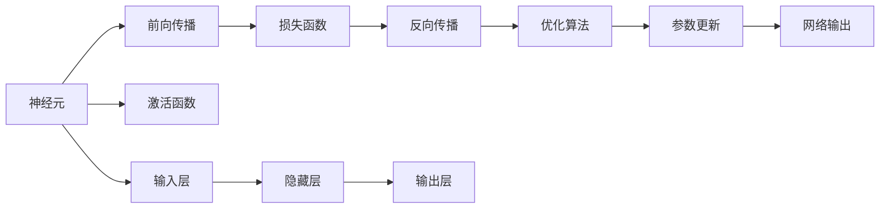

                 

# 神经网络：人类智慧的延伸

## 1. 背景介绍

### 1.1 问题由来

在人工智能（AI）的飞速发展中，神经网络（Neural Networks）作为其中的关键技术之一，正逐渐成为人类智慧的延伸。它通过模拟人脑神经元之间的连接，构建起可以处理复杂任务的计算模型。从图像识别到语音识别，从自然语言处理到自动驾驶，神经网络的应用无所不在。

近年来，神经网络的性能不断提升，得益于更强大的计算能力、更丰富的数据资源以及更先进的算法技术。然而，神经网络并非完美无瑕，其在处理复杂任务时仍存在许多局限性，如过拟合、计算成本高、可解释性差等。此外，神经网络的设计和调参也极具挑战性，需要深度学习从业者具备扎实的数学和编程基础。

本文将系统地介绍神经网络的原理与实践，帮助读者全面理解这一颠覆性技术，并掌握其应用方法。

### 1.2 问题核心关键点

神经网络的核心在于其能够处理非线性关系和复杂的模式识别。其工作原理包括前向传播、反向传播以及参数更新等步骤，通过大量的训练数据优化模型参数，从而实现对特定任务的精准预测。

神经网络的核心要点包括：
- **多层感知机(Multilayer Perceptron, MLP)**：基本的网络结构，由多个线性变换和激活函数组成。
- **卷积神经网络(Convolutional Neural Networks, CNN)**：应用于图像处理和计算机视觉任务，通过卷积和池化操作提取局部特征。
- **循环神经网络(Recurrent Neural Networks, RNN)**：处理序列数据，如自然语言、时间序列等，通过循环结构记忆历史信息。
- **深度学习框架**：如TensorFlow、PyTorch等，提供了便捷的网络构建、训练和推理功能。
- **优化算法**：如梯度下降、Adam、Adagrad等，用于最小化损失函数，优化模型参数。

神经网络的应用广泛，涵盖计算机视觉、自然语言处理、信号处理等多个领域。其基本设计思想将大幅改变我们对复杂问题的处理方式。

## 2. 核心概念与联系

### 2.1 核心概念概述

为了更好地理解神经网络，我们首先介绍几个关键概念：

- **神经元(Neuron)**：神经网络的基本单元，接收输入信号并产生输出。
- **激活函数(Activation Function)**：引入非线性因素，增强网络的表达能力。
- **损失函数(Loss Function)**：衡量模型预测与真实标签之间的差异。
- **前向传播(Forward Propagation)**：将输入数据通过网络逐层传递，计算输出结果。
- **反向传播(Backward Propagation)**：通过误差反向传播，更新网络参数。
- **优化算法(Optimizer)**：如梯度下降、Adam等，用于最小化损失函数，更新模型参数。

这些概念共同构成了神经网络的核心框架，使其能够处理非线性问题，实现复杂模式的识别和预测。

### 2.2 核心概念原理和架构的 Mermaid 流程图



这个流程图展示了神经网络的基本流程：输入数据经过网络逐层传递，最终输出结果。其中，激活函数引入了非线性，优化算法用于参数更新，损失函数衡量预测误差，反向传播用于误差反向传播。

## 3. 核心算法原理 & 具体操作步骤

### 3.1 算法原理概述

神经网络通过前向传播和反向传播两个阶段进行学习。前向传播将输入数据通过网络逐层传递，计算输出结果；反向传播则通过误差反向传播，更新网络参数，使模型逐渐逼近真实标签。

具体步骤如下：
1. **前向传播**：将输入数据通过网络逐层传递，计算每个神经元的输出。
2. **计算损失函数**：将输出结果与真实标签进行比较，计算损失函数。
3. **反向传播**：将损失函数通过网络反向传播，计算每个参数的梯度。
4. **参数更新**：使用优化算法更新模型参数，减小损失函数。

这一过程通过大量的训练数据进行迭代优化，最终使神经网络能够对新数据进行精准预测。

### 3.2 算法步骤详解

**Step 1: 定义神经网络结构**
- 选择合适的网络结构，如多层感知机、卷积神经网络、循环神经网络等。
- 定义输入层、隐藏层和输出层的维度。

**Step 2: 初始化模型参数**
- 使用随机值或预训练权重初始化模型参数。

**Step 3: 定义损失函数**
- 选择适合任务的损失函数，如均方误差、交叉熵等。

**Step 4: 前向传播**
- 输入数据通过网络逐层传递，计算每个神经元的输出。
- 使用激活函数处理每一层输出，引入非线性因素。

**Step 5: 反向传播**
- 计算损失函数，通过误差反向传播计算每个参数的梯度。
- 使用优化算法更新模型参数，最小化损失函数。

**Step 6: 重复迭代**
- 重复前向传播和反向传播过程，直到达到预设的迭代次数或损失函数收敛。

### 3.3 算法优缺点

神经网络具有以下优点：
- **强大的表达能力**：通过多层结构和大规模参数，能够处理复杂的非线性关系。
- **适应性强**：能够自动调整网络结构，适用于各种不同的任务。
- **广泛应用**：广泛应用于计算机视觉、自然语言处理、信号处理等领域。

同时，神经网络也存在一些局限性：
- **计算成本高**：需要大量的计算资源进行训练和推理。
- **可解释性差**：黑盒模型难以解释内部工作机制。
- **过拟合风险**：在训练数据不足时容易过拟合。

### 3.4 算法应用领域

神经网络在多个领域中得到了广泛应用：

- **计算机视觉**：图像分类、目标检测、图像分割等任务。
- **自然语言处理**：机器翻译、情感分析、语音识别等任务。
- **信号处理**：语音信号处理、图像处理、视频处理等任务。
- **医疗领域**：疾病诊断、基因组学、生物信息学等任务。
- **金融领域**：风险评估、市场预测、信用评估等任务。
- **游戏领域**：自动驾驶、机器人控制、虚拟现实等任务。

## 4. 数学模型和公式 & 详细讲解 & 举例说明

### 4.1 数学模型构建

神经网络的形式化定义如下：
- 输入数据：$x = (x_1, x_2, ..., x_n)$，其中 $x_i$ 为第 $i$ 个输入特征。
- 权重参数：$w_1, w_2, ..., w_m$，其中 $w_i$ 为第 $i$ 个权重。
- 偏置项：$b_1, b_2, ..., b_m$，其中 $b_i$ 为第 $i$ 个偏置项。
- 激活函数：$f(\cdot)$，用于引入非线性因素。
- 输出：$y$，即神经网络对输入数据的预测结果。

根据上述定义，神经网络的输出可以表示为：

$$
y = f(\sum_{i=1}^m w_ix_i + b_i)
$$

其中，$f(\cdot)$ 为激活函数，$\sum_{i=1}^m w_ix_i + b_i$ 为线性变换。

### 4.2 公式推导过程

以多层感知机（MLP）为例，推导其输出公式。

假设输入数据为 $x$，网络结构如下：

```
输入层 -> 隐藏层 -> 输出层
```

其中，隐藏层有 $h$ 个神经元，每个神经元的权重为 $w$，偏置项为 $b$。激活函数为 $f(\cdot)$，输出层有 $o$ 个神经元，每个神经元的权重为 $u$，偏置项为 $v$。则输出结果可以表示为：

$$
y = f(\sum_{i=1}^h w_i f(\sum_{j=1}^h u_j f(\sum_{k=1}^n v_k x_k + b_k)) + v_h)
$$

其中，$w_i$ 和 $u_j$ 分别为隐藏层和输出层的权重，$b_k$ 和 $v_h$ 分别为隐藏层和输出层的偏置项。

### 4.3 案例分析与讲解

以手写数字识别为例，展示神经网络的训练过程。

首先，定义神经网络结构，如输入层为28x28的图像像素，输出层为10个神经元，每个神经元对应一个数字。隐藏层可以根据经验设定为若干个神经元。

接着，初始化权重和偏置项，使用随机值进行初始化。

然后，定义损失函数，如交叉熵损失函数。

进行前向传播，将输入图像通过网络逐层传递，计算每个神经元的输出。

计算损失函数，将输出结果与真实标签进行比较，计算损失函数。

通过反向传播，计算每个参数的梯度。

使用优化算法，如Adam，更新模型参数，最小化损失函数。

重复以上步骤，直到达到预设的迭代次数或损失函数收敛。

最终，训练好的神经网络可以对手写数字进行精准识别。

## 5. 项目实践：代码实例和详细解释说明

### 5.1 开发环境搭建

在进行神经网络开发前，我们需要准备好开发环境。以下是使用Python进行TensorFlow开发的环境配置流程：

1. 安装Anaconda：从官网下载并安装Anaconda，用于创建独立的Python环境。

2. 创建并激活虚拟环境：
```bash
conda create -n tensorflow-env python=3.8 
conda activate tensorflow-env
```

3. 安装TensorFlow：根据CUDA版本，从官网获取对应的安装命令。例如：
```bash
conda install tensorflow tensorflow-cpu -c conda-forge
```

4. 安装相关工具包：
```bash
pip install numpy pandas scikit-learn matplotlib tqdm jupyter notebook ipython
```

完成上述步骤后，即可在`tensorflow-env`环境中开始神经网络开发。

### 5.2 源代码详细实现

下面以手写数字识别为例，给出使用TensorFlow进行神经网络开发的完整代码实现。

```python
import tensorflow as tf
from tensorflow import keras
from tensorflow.keras import layers

# 加载MNIST数据集
mnist = keras.datasets.mnist
(train_images, train_labels), (test_images, test_labels) = mnist.load_data()

# 数据预处理
train_images = train_images.reshape(train_images.shape[0], 28, 28, 1).astype('float32')
test_images = test_images.reshape(test_images.shape[0], 28, 28, 1).astype('float32')
train_images, test_images = train_images / 255.0, test_images / 255.0

# 定义神经网络模型
model = keras.Sequential([
    layers.Conv2D(32, (3, 3), activation='relu', input_shape=(28, 28, 1)),
    layers.MaxPooling2D((2, 2)),
    layers.Flatten(),
    layers.Dense(128, activation='relu'),
    layers.Dense(10)
])

# 编译模型
model.compile(optimizer='adam',
              loss=tf.keras.losses.SparseCategoricalCrossentropy(from_logits=True),
              metrics=['accuracy'])

# 训练模型
model.fit(train_images, train_labels, epochs=10, 
          validation_data=(test_images, test_labels))

# 评估模型
test_loss, test_acc = model.evaluate(test_images, test_labels)
print('Test accuracy:', test_acc)
```

以上代码展示了从数据加载、预处理、模型定义、编译、训练到评估的完整流程。

### 5.3 代码解读与分析

让我们再详细解读一下关键代码的实现细节：

**神经网络模型定义**：
- 使用`Sequential`模型，依次添加卷积层、池化层、全连接层等。
- 卷积层使用`Conv2D`，指定卷积核大小、数量和激活函数。
- 池化层使用`MaxPooling2D`，指定池化大小。
- 全连接层使用`Dense`，指定输出维度和激活函数。

**数据预处理**：
- 将图像数据reshape为网络可接受的形状，并归一化到0-1之间。
- 使用`from_logits=True`定义损失函数，直接输出logits而不是概率。

**模型训练**：
- 使用`fit`方法训练模型，指定训练轮数和验证集。
- 使用`validation_data`参数指定验证集。

**模型评估**：
- 使用`evaluate`方法评估模型性能，返回损失和准确率。
- 打印测试集上的准确率。

在TensorFlow中，神经网络的开发和训练过程非常便捷，开发者可以根据需要灵活调整网络结构和超参数，快速迭代模型性能。

## 6. 实际应用场景

### 6.1 计算机视觉

神经网络在计算机视觉领域的应用非常广泛，如图像分类、目标检测、图像分割等任务。通过卷积神经网络（CNN）等结构，神经网络能够高效地提取图像特征，实现精准分类。

以图像分类为例，神经网络通过卷积层提取图像特征，通过池化层减小特征尺寸，通过全连接层进行分类预测。在训练过程中，通过反向传播更新网络参数，逐步优化模型性能。最终，训练好的神经网络可以对新图像进行分类预测，实现自动识别和标注。

### 6.2 自然语言处理

神经网络在自然语言处理领域的应用也非常广泛，如机器翻译、情感分析、语音识别等任务。通过循环神经网络（RNN）、长短期记忆网络（LSTM）等结构，神经网络能够处理序列数据，实现复杂的自然语言处理任务。

以机器翻译为例，神经网络通过编码器将源语言句子转换为向量表示，通过解码器将向量转换为目标语言句子。在训练过程中，通过反向传播更新网络参数，逐步优化模型性能。最终，训练好的神经网络可以对新句子进行翻译，实现自动翻译。

### 6.3 信号处理

神经网络在信号处理领域的应用包括语音信号处理、图像处理、视频处理等任务。通过卷积神经网络（CNN）等结构，神经网络能够高效地提取信号特征，实现复杂信号处理任务。

以语音信号处理为例，神经网络通过卷积层提取语音特征，通过池化层减小特征尺寸，通过全连接层进行分类预测。在训练过程中，通过反向传播更新网络参数，逐步优化模型性能。最终，训练好的神经网络可以对新语音信号进行分类预测，实现自动语音识别。

### 6.4 未来应用展望

随着神经网络的不断发展，其在各领域的实际应用将越来越广泛，未来的前景非常广阔：

- **自动驾驶**：神经网络可以实现车辆定位、车道保持、行人检测等任务，提升驾驶安全性。
- **医疗诊断**：神经网络可以实现疾病预测、基因组分析等任务，提升医疗诊断的精准度。
- **金融预测**：神经网络可以实现股票预测、信用评估等任务，提升金融预测的准确性。
- **工业控制**：神经网络可以实现设备故障预测、工艺优化等任务，提升工业生产的自动化和智能化水平。
- **智能家居**：神经网络可以实现语音控制、图像识别等任务，提升家居生活的智能化水平。

## 7. 工具和资源推荐

### 7.1 学习资源推荐

为了帮助开发者系统掌握神经网络的技术基础和实践技巧，这里推荐一些优质的学习资源：

1. 《深度学习》课程（CS231n）：斯坦福大学开设的计算机视觉课程，涵盖了卷积神经网络、目标检测、图像分割等前沿话题。

2. 《自然语言处理综述》（CS224n）：斯坦福大学开设的自然语言处理课程，介绍了深度学习在NLP中的广泛应用。

3. 《深度学习框架教程》：TensorFlow、PyTorch等深度学习框架的官方文档，提供了详细的教程和示例。

4. 《神经网络与深度学习》：Michael Nielsen所著的入门级深度学习书籍，详细介绍了神经网络的基本原理和应用。

5. 《深度学习实战》：Ian Goodfellow所著的深度学习实战书籍，提供了丰富的代码示例和实战案例。

通过对这些资源的学习实践，相信你一定能够快速掌握神经网络的精髓，并用于解决实际的计算机视觉、自然语言处理等任务。

### 7.2 开发工具推荐

高效的开发离不开优秀的工具支持。以下是几款用于神经网络开发的常用工具：

1. TensorFlow：由Google主导开发的开源深度学习框架，生产部署方便，适合大规模工程应用。

2. PyTorch：Facebook开发的开源深度学习框架，灵活性高，适合快速迭代研究。

3. Keras：高层次的深度学习API，提供便捷的模型构建和训练功能。

4. Weights & Biases：模型训练的实验跟踪工具，可以记录和可视化模型训练过程中的各项指标，方便对比和调优。

5. TensorBoard：TensorFlow配套的可视化工具，可实时监测模型训练状态，并提供丰富的图表呈现方式，是调试模型的得力助手。

6. Jupyter Notebook：交互式编程环境，适合快速迭代和共享代码。

合理利用这些工具，可以显著提升神经网络的开发效率，加快创新迭代的步伐。

### 7.3 相关论文推荐

神经网络的研究源于学界的持续探索。以下是几篇奠基性的相关论文，推荐阅读：

1. 《神经网络与深度学习》（Nielsen）：介绍了神经网络的基本原理和应用，是深度学习的入门经典。

2. 《卷积神经网络》（LeNet-5）：Yann LeCun等人提出的经典卷积神经网络模型，奠定了计算机视觉深度学习的基础。

3. 《长短期记忆网络》（LSTM）：Sepp Hochreiter和Jürgen Schmidhuber提出的长短期记忆网络，广泛应用于自然语言处理等序列任务。

4. 《深度残差网络》（ResNet）：Kaiming He等人提出的深度残差网络，通过残差连接解决深度神经网络的退化问题，取得了显著的性能提升。

5. 《神经网络中的表示学习》（A3C）：OpenAI提出的异步分布式优化算法，实现了大规模神经网络的训练。

6. 《注意力机制》（Attention Mechanism）：Andrew Ng等人提出的注意力机制，提升了神经网络对复杂输入的处理能力。

这些论文代表了神经网络技术的发展脉络，是深度学习领域的经典之作，值得深入阅读和研究。

## 8. 总结：未来发展趋势与挑战

### 8.1 总结

本文对神经网络的基本原理和实践进行了全面系统的介绍。首先，阐述了神经网络作为人类智慧延伸的重要意义，明确了神经网络在处理复杂任务中的强大能力。其次，从原理到实践，详细讲解了神经网络的核心概念和操作流程，给出了完整的代码实例。同时，本文还广泛探讨了神经网络在计算机视觉、自然语言处理、信号处理等多个领域的应用前景，展示了神经网络技术的广阔前景。最后，本文精选了神经网络的各类学习资源，力求为读者提供全方位的技术指引。

通过本文的系统梳理，可以看到，神经网络作为人工智能的核心技术，正逐步成为解决复杂问题的利器。其强大的表达能力和适应性，使其在各领域中展现出巨大的潜力。未来，随着神经网络的不断演进，相信人工智能技术将在更多领域大放异彩。

### 8.2 未来发展趋势

展望未来，神经网络技术将呈现以下几个发展趋势：

1. **更强大的表达能力**：随着计算能力的提升和模型结构的优化，神经网络的表达能力将进一步增强，能够处理更复杂、更抽象的输入。

2. **更高效的训练方法**：未来将涌现更多高效的训练方法，如自监督学习、自适应学习率等，降低训练成本，提高训练速度。

3. **更广泛的领域应用**：神经网络将在更多领域中得到应用，如金融、医疗、智能制造等，为各行各业带来变革性影响。

4. **更强的可解释性**：通过引入可解释性技术，如可视化、因果分析等，提升神经网络的透明度，增强其决策的可解释性。

5. **更灵活的网络结构**：未来将出现更多灵活的网络结构，如自适应网络、可重构网络等，增强神经网络的适应性和可调性。

6. **更高效的硬件支持**：随着专用硬件的发展，如GPU、TPU等，神经网络的计算效率将进一步提升，降低资源成本。

这些趋势将使神经网络技术在更多领域中发挥更大的作用，推动人工智能技术的进步和普及。

### 8.3 面临的挑战

尽管神经网络技术已经取得了瞩目成就，但在迈向更加智能化、普适化应用的过程中，仍面临诸多挑战：

1. **计算资源瓶颈**：神经网络的高计算成本成为其大规模部署的瓶颈，未来需要更加高效、低成本的硬件支持。

2. **模型鲁棒性不足**：在面对复杂输入和异常数据时，神经网络容易发生过拟合和泛化能力不足的问题。

3. **数据隐私和安全**：神经网络对数据的依赖使其容易受到数据泄露和安全攻击的影响，需要更加严格的数据保护措施。

4. **模型可解释性差**：神经网络的黑盒特性使其难以解释内部决策机制，增加了应用的复杂性和风险。

5. **模型复杂度高**：大规模神经网络的训练和推理计算量大，需要更加高效的训练方法和硬件支持。

6. **跨领域应用难度大**：神经网络在跨领域应用的迁移能力有限，需要进一步提升模型的通用性和适应性。

正视这些挑战，积极应对并寻求突破，将使神经网络技术在未来实现更大突破。

### 8.4 研究展望

面对神经网络面临的挑战，未来的研究需要在以下几个方面寻求新的突破：

1. **更高效的网络结构**：开发更高效、更轻量级的神经网络结构，降低计算成本，提高计算效率。

2. **更灵活的训练方法**：引入更多灵活、高效的训练方法，如自监督学习、半监督学习等，降低对标注数据的依赖。

3. **更强大的可解释性**：引入更多可解释性技术，提升神经网络的透明度和可解释性。

4. **更广泛的应用场景**：在更多领域中探索神经网络的应用，提升其在各领域中的性能和应用效果。

5. **跨领域迁移能力**：开发更强的跨领域迁移能力，增强神经网络在不同任务之间的适应性。

6. **伦理和安全保障**：引入伦理和安全约束，确保神经网络的应用符合社会价值观和法律法规。

这些研究方向将引领神经网络技术的未来发展，为构建更加智能、可靠、可控的人工智能系统铺平道路。

## 9. 附录：常见问题与解答

**Q1: 神经网络的结构和参数是如何确定的？**

A: 神经网络的结构和参数是通过训练数据进行优化的。在训练过程中，神经网络通过前向传播计算输出，并通过反向传播计算每个参数的梯度。优化算法（如梯度下降、Adam等）根据梯度更新参数，使得神经网络的输出逼近真实标签。训练过程中，需要选择合适的网络结构（如卷积神经网络、循环神经网络等），并根据任务特点设定参数维度和初始值。

**Q2: 神经网络的训练过程中，如何避免过拟合？**

A: 神经网络的过拟合可以通过以下方法进行缓解：
1. 数据增强：通过旋转、翻转、裁剪等方式扩充训练数据。
2. 正则化：引入L2正则、Dropout等技术，防止模型过拟合。
3. 早停法（Early Stopping）：在验证集上监控模型性能，在性能不再提升时停止训练。
4. 模型集成：通过多个模型投票或平均输出，减小过拟合风险。
5. 对抗训练：引入对抗样本，提高模型鲁棒性。

这些方法可以结合使用，根据具体任务和数据特点进行选择。

**Q3: 神经网络在推理时如何处理输入数据？**

A: 神经网络在推理时，通常需要处理输入数据的预处理过程。具体步骤如下：
1. 数据预处理：将输入数据转换为网络可接受的格式，如归一化、标准化等。
2. 前向传播：将预处理后的输入数据通过网络逐层传递，计算每个神经元的输出。
3. 解码输出：通过输出层得到最终的预测结果，如分类、回归等。

在实际应用中，可能需要对输入数据进行更加复杂的操作，如图像识别中的图像预处理、自然语言处理中的分词和词嵌入等。

**Q4: 神经网络在实际应用中如何保证性能和可靠性？**

A: 神经网络在实际应用中，需要综合考虑以下几个方面以确保性能和可靠性：
1. 数据质量：保证训练数据的质量和多样性，避免数据偏见和噪声。
2. 模型验证：通过交叉验证、A/B测试等方式，验证模型的性能和稳定性。
3. 模型监控：实时监控模型在生产环境中的表现，及时发现和修复问题。
4. 模型更新：定期更新模型参数，适应数据分布的变化。
5. 模型压缩：通过模型压缩、剪枝等技术，减小模型大小，提升计算效率。

这些措施可以保证神经网络在实际应用中的性能和可靠性，确保其能够稳定、高效地运行。

**Q5: 神经网络在实际应用中如何解决计算成本高的问题？**

A: 神经网络的高计算成本可以通过以下方法进行缓解：
1. 模型压缩：通过剪枝、量化等技术，减小模型大小，提高计算效率。
2. 硬件优化：使用GPU、TPU等专用硬件，提升计算速度。
3. 分布式训练：通过多机分布式训练，提升训练速度和效率。
4. 模型融合：将多个小模型融合为一个高效的大模型，降低计算成本。
5. 模型蒸馏：通过教师-学生模型蒸馏技术，将大型模型转换为小模型，降低计算成本。

这些方法可以结合使用，根据具体应用场景进行选择，以达到最佳的计算效率和成本控制效果。

---

作者：禅与计算机程序设计艺术 / Zen and the Art of Computer Programming

