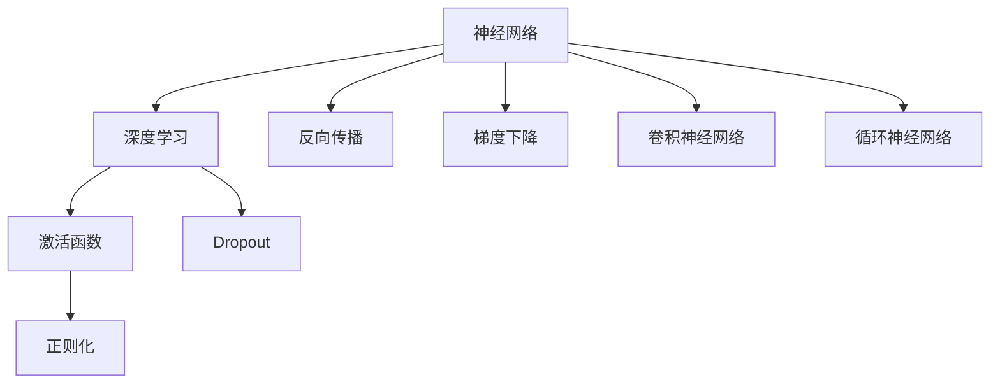

                 

# 神经网络：开启智能新纪元

> 关键词：神经网络,深度学习,机器学习,人工智能,大数据,算法优化,应用场景,优化技术

## 1. 背景介绍

### 1.1 问题由来

随着大数据和互联网技术的快速发展，人工智能（AI）成为驱动社会进步的重要力量。其中，神经网络作为深度学习的基础，通过对数据进行层次化抽象，从而实现对复杂问题的智能建模和求解。从最初的感知机（Perceptron），到多层感知器（MLP），再到卷积神经网络（CNN）、循环神经网络（RNN）等，神经网络的发展伴随着AI技术的不断成熟。

### 1.2 问题核心关键点

神经网络的核心思想是通过多层非线性变换将输入数据映射到输出空间。其中，最核心的组件是神经元，通过权重矩阵和偏置向量实现输入与输出的映射。这一过程主要通过反向传播算法完成，即利用链式法则将输出误差回传到各层，从而调整权重和偏置，不断优化模型的表现。

### 1.3 问题研究意义

神经网络技术在工业界和学术界得到了广泛应用，从图像识别、语音识别到自然语言处理（NLP）、推荐系统等领域，神经网络已经成为解决复杂问题的有效工具。神经网络的研究不仅推动了AI技术的进步，也带来了对大数据处理、算法优化等领域的深刻影响。通过理解神经网络的工作原理和优化方法，我们可以更好地掌握AI技术的核心，推动智能系统的进一步发展。

## 2. 核心概念与联系

### 2.1 核心概念概述

为更好地理解神经网络的基本原理和优化方法，本节将介绍几个关键概念及其相互联系：

- 神经网络（Neural Network, NN）：以神经元为基本单元，通过多层非线性变换实现对复杂问题的建模和求解。
- 深度学习（Deep Learning, DL）：一种特殊的机器学习技术，通过多层神经网络实现对高维数据的表示学习和模式识别。
- 反向传播（Backpropagation）：一种算法，通过将输出误差回传到输入端，逐层调整权重和偏置，优化模型的训练效果。
- 梯度下降（Gradient Descent）：一种优化算法，通过不断迭代更新参数，使得损失函数最小化。
- 激活函数（Activation Function）：用于神经元输出的非线性变换，如sigmoid、ReLU等，增强模型的表达能力。
- 正则化（Regularization）：通过添加正则项，防止模型过拟合，提高泛化能力。
- Dropout：一种随机失活技术，通过随机丢弃一部分神经元，增加模型的鲁棒性。
- 卷积神经网络（Convolutional Neural Network, CNN）：一种特殊的神经网络，用于处理网格结构数据，如图像和视频。
- 循环神经网络（Recurrent Neural Network, RNN）：一种特殊的网络结构，用于处理序列数据，如自然语言和音频。

这些概念通过以下Mermaid流程图展示其相互联系：



这个流程图展示了神经网络在深度学习中的应用范围，以及其核心组件和算法的相互关系。

## 3. 核心算法原理 & 具体操作步骤

### 3.1 算法原理概述

神经网络的基本原理是通过多层神经元对输入数据进行非线性变换，从而实现对复杂问题的建模和求解。其核心思想是利用链式法则，将输出误差逐层回传到输入端，通过梯度下降等优化算法，不断调整权重和偏置，使得模型的损失函数最小化，从而提升模型的泛化能力和准确性。

具体来说，神经网络包括输入层、隐藏层和输出层。输入层将原始数据映射为特征向量，隐藏层通过非线性变换提取特征，输出层将特征向量映射为模型预测结果。通过反向传播算法，计算输出误差对隐藏层和输入层的贡献，并利用梯度下降等优化算法调整各层参数，逐步优化模型的性能。

### 3.2 算法步骤详解

神经网络的训练主要包括以下几个关键步骤：

**Step 1: 数据预处理**
- 对原始数据进行标准化、归一化等预处理操作，使其适合神经网络的输入要求。
- 划分训练集、验证集和测试集，准备训练数据和标注数据。

**Step 2: 模型搭建**
- 根据任务需求，选择合适的网络结构，如CNN、RNN等，定义输入层、隐藏层和输出层的节点数、激活函数等参数。
- 利用Keras、TensorFlow等深度学习框架搭建模型，并初始化模型参数。

**Step 3: 损失函数设计**
- 根据任务类型，选择合适的损失函数，如均方误差、交叉熵等，用于衡量模型预测与真实标签之间的差异。
- 添加正则化项，如L2正则、Dropout等，防止模型过拟合。

**Step 4: 模型训练**
- 定义优化器，如Adam、SGD等，设置学习率、批大小等超参数。
- 使用梯度下降等优化算法，对模型参数进行迭代优化，最小化损失函数。
- 在每个epoch结束时，在验证集上评估模型性能，防止过拟合。

**Step 5: 模型评估与部署**
- 在测试集上评估模型性能，对比训练前后的精度提升。
- 使用训练好的模型进行推理预测，部署到实际应用系统中。
- 持续收集新数据，定期重新训练模型，以适应数据分布的变化。

以上是神经网络训练的一般流程。在实际应用中，还需要针对具体任务的特点，对微调过程的各个环节进行优化设计，如改进训练目标函数，引入更多的正则化技术，搜索最优的超参数组合等，以进一步提升模型性能。

### 3.3 算法优缺点

神经网络技术具有以下优点：
1. 强大的表达能力：多层非线性变换使得神经网络能够适应复杂的高维数据分布。
2. 良好的泛化能力：通过反向传播和梯度下降等优化算法，神经网络可以自动提取数据中的关键特征，提高泛化性能。
3. 较好的抗干扰能力：通过激活函数和正则化等技术，神经网络能够提高模型的鲁棒性。
4. 高效的应用场景：神经网络在图像识别、语音识别、自然语言处理等领域，已经展现出了巨大的应用潜力。

同时，神经网络也存在一定的局限性：
1. 数据依赖性高：神经网络的训练需要大量的标注数据，对标注成本和数据质量要求较高。
2. 参数量大：大规模神经网络需要大量的计算资源和存储空间，训练和推理速度较慢。
3. 模型复杂度高：神经网络的结构复杂，难以解释其内部工作机制，存在“黑盒”问题。
4. 过拟合风险：神经网络容易陷入过拟合，特别是在训练数据较少的情况下。
5. 依赖模型选择：不同的任务需要选择不同的神经网络结构，需要经验和大量实验支持。

尽管存在这些局限性，但神经网络作为深度学习的基础，已经成为解决复杂问题的有力工具。未来研究的方向在于如何进一步优化神经网络的结构和参数，提高其训练效率和泛化性能，同时增强其可解释性和鲁棒性。

### 3.4 算法应用领域

神经网络技术在各个领域得到了广泛应用，以下是几个典型应用场景：

- 计算机视觉：神经网络在图像识别、物体检测、人脸识别等领域已经达到了最先进的水平。例如，ResNet、Inception等卷积神经网络结构，在ImageNet等大规模数据集上取得了优异性能。
- 自然语言处理：神经网络在语言模型、机器翻译、文本分类等领域展现了强大的语言处理能力。例如，BERT、GPT等预训练语言模型，在NLP领域刷新了多项最先进指标。
- 语音识别：神经网络在语音识别、语音合成、情感分析等领域取得了显著进展。例如，DeepSpeech、WaveNet等深度学习模型，在语音处理任务中表现优异。
- 推荐系统：神经网络在推荐系统、广告投放等领域得到应用。例如，通过协同过滤和深度学习相结合的方法，可以提高推荐精度和效果。
- 自动驾驶：神经网络在自动驾驶、无人驾驶等领域得到了广泛应用。例如，通过感知、决策和控制等环节，实现车辆自主导航。

除了这些领域，神经网络还在金融预测、医疗诊断、游戏AI等诸多领域展示了其强大的应用潜力。随着技术的不断发展，神经网络的应用范围将进一步扩展。

## 4. 数学模型和公式 & 详细讲解

### 4.1 数学模型构建

神经网络的数学模型通常由输入层、隐藏层和输出层组成。其核心数学表达式包括激活函数、权重矩阵、偏置向量和损失函数。

设神经网络的输入为 $x$，输出为 $y$，隐藏层的激活函数为 $f$，权重矩阵为 $W$，偏置向量为 $b$。则隐藏层的计算过程如下：

$$
h = f(W_{1}x + b_{1})
$$

其中 $W_{1}$ 和 $b_{1}$ 分别为第一层隐藏层的权重矩阵和偏置向量。

输出层的计算过程如下：

$$
y = f(W_{2}h + b_{2})
$$

其中 $W_{2}$ 和 $b_{2}$ 分别为输出层的权重矩阵和偏置向量。

### 4.2 公式推导过程

以一个简单的三层神经网络为例，推导其训练过程的数学表达式。

设输入数据为 $x$，输出标签为 $y$，隐藏层节点数为 $n$。神经网络的激活函数为 $f$，损失函数为 $L$，优化器为 $O$。则训练过程的数学表达式如下：

1. 前向传播

$$
h_1 = f(W_{1}x + b_{1})
$$

$$
h_2 = f(W_{2}h_1 + b_{2})
$$

$$
y = f(W_{3}h_2 + b_{3})
$$

2. 损失函数

$$
L = L(y, \hat{y}) = \frac{1}{2}(y - \hat{y})^2
$$

其中 $\hat{y}$ 为模型的预测输出。

3. 反向传播

$$
\frac{\partial L}{\partial W_{3}} = \nabla_{W_{3}}L = \delta_{y} \nabla_{h_2}L
$$

$$
\frac{\partial L}{\partial b_{3}} = \nabla_{b_{3}}L = \delta_{y} \nabla_{h_2}L
$$

$$
\frac{\partial L}{\partial W_{2}} = \nabla_{W_{2}}L = \delta_{h_2} \nabla_{h_1}L
$$

$$
\frac{\partial L}{\partial b_{2}} = \nabla_{b_{2}}L = \delta_{h_2} \nabla_{h_1}L
$$

$$
\frac{\partial L}{\partial W_{1}} = \nabla_{W_{1}}L = \delta_{h_1} \nabla_{x}L
$$

$$
\frac{\partial L}{\partial b_{1}} = \nabla_{b_{1}}L = \delta_{h_1} \nabla_{x}L
$$

其中 $\delta$ 为误差梯度，通过链式法则逐层计算得到。

4. 梯度下降

$$
W_{i} \leftarrow W_{i} - \eta \nabla_{W_{i}}L
$$

$$
b_{i} \leftarrow b_{i} - \eta \nabla_{b_{i}}L
$$

其中 $\eta$ 为学习率。

### 4.3 案例分析与讲解

以图像识别为例，分析神经网络在计算机视觉中的具体应用。

1. 输入数据：图像数据集中的像素值作为神经网络的输入。

2. 隐藏层：通过卷积层、池化层等操作提取图像特征。

3. 输出层：将特征向量映射为图像类别标签，如人、车、建筑等。

4. 损失函数：常用的损失函数为交叉熵损失函数。

5. 优化器：常用的优化器为Adam、SGD等。

通过神经网络对图像数据的学习，模型能够自动提取图像中的关键特征，从而实现对图像的准确识别。

## 5. 项目实践：代码实例和详细解释说明

### 5.1 开发环境搭建

在进行神经网络项目开发前，我们需要准备好开发环境。以下是使用Python进行TensorFlow和Keras开发的环境配置流程：

1. 安装Anaconda：从官网下载并安装Anaconda，用于创建独立的Python环境。

2. 创建并激活虚拟环境：
```bash
conda create -n tensorflow-env python=3.8 
conda activate tensorflow-env
```

3. 安装TensorFlow：根据CUDA版本，从官网获取对应的安装命令。例如：
```bash
conda install tensorflow -c pytorch -c conda-forge
```

4. 安装Keras：
```bash
pip install keras
```

5. 安装各类工具包：
```bash
pip install numpy pandas scikit-learn matplotlib tqdm jupyter notebook ipython
```

完成上述步骤后，即可在`tensorflow-env`环境中开始神经网络开发。

### 5.2 源代码详细实现

这里我们以手写数字识别为例，给出使用TensorFlow和Keras对神经网络进行训练的Python代码实现。

首先，定义手写数字识别数据集：

```python
from tensorflow.keras.datasets import mnist
(x_train, y_train), (x_test, y_test) = mnist.load_data()

x_train = x_train.reshape(-1, 28*28)
x_test = x_test.reshape(-1, 28*28)
x_train = x_train / 255.0
x_test = x_test / 255.0
y_train = to_categorical(y_train)
y_test = to_categorical(y_test)
```

然后，定义神经网络模型：

```python
from tensorflow.keras.models import Sequential
from tensorflow.keras.layers import Dense, Flatten

model = Sequential([
    Flatten(input_shape=(28, 28)),
    Dense(128, activation='relu'),
    Dense(10, activation='softmax')
])
```

接着，定义损失函数和优化器：

```python
from tensorflow.keras.losses import categorical_crossentropy
from tensorflow.keras.optimizers import Adam

model.compile(loss=categorical_crossentropy, optimizer=Adam(lr=0.001), metrics=['accuracy'])
```

最后，启动训练流程并在测试集上评估：

```python
model.fit(x_train, y_train, epochs=10, batch_size=32, validation_data=(x_test, y_test))
test_loss, test_acc = model.evaluate(x_test, y_test)
print(f'Test accuracy: {test_acc:.4f}')
```

以上就是使用TensorFlow和Keras对手写数字识别神经网络进行训练和评估的完整代码实现。可以看到，借助Keras的高层抽象和TensorFlow的计算图能力，神经网络模型的搭建和训练变得非常简洁高效。

### 5.3 代码解读与分析

让我们再详细解读一下关键代码的实现细节：

**MNIST数据集**：
- 使用Keras内置的MNIST数据集，加载手写数字图像和标签数据。
- 将图像数据展平为一维向量，并进行归一化处理。
- 将标签数据进行独热编码，使得模型能够直接处理类别变量。

**模型定义**：
- 使用Sequential模型定义神经网络结构，包括一个输入层、一个隐藏层和一个输出层。
- 输入层将原始图像数据展平为一维向量。
- 隐藏层通过128个神经元进行特征提取，使用ReLU激活函数。
- 输出层通过10个神经元输出数字类别标签，使用softmax激活函数。

**损失函数和优化器**：
- 定义交叉熵损失函数，用于衡量模型预测与真实标签之间的差异。
- 使用Adam优化器，设置学习率为0.001。

**训练过程**：
- 使用fit方法对模型进行训练，设置epoch数为10，batch大小为32。
- 在每个epoch结束时，使用test方法在测试集上评估模型性能。
- 输出测试集上的准确率，即模型识别数字的正确率。

可以看到，借助Keras和TensorFlow等深度学习框架，神经网络的开发和训练变得非常便捷高效。开发者可以将更多精力放在数据预处理、模型改进等高层逻辑上，而不必过多关注底层的实现细节。

当然，工业级的系统实现还需考虑更多因素，如模型的保存和部署、超参数的自动搜索、更灵活的网络结构等。但核心的神经网络训练流程基本与此类似。

## 6. 实际应用场景

### 6.1 图像识别

神经网络在图像识别领域已经取得了巨大成功。例如，卷积神经网络（CNN）通过卷积层和池化层，提取图像中的局部特征，再通过全连接层进行分类，已经实现了对图像的精确识别。例如，在ImageNet数据集上，ResNet、Inception等神经网络结构已经取得了最先进的图像识别精度。

### 6.2 语音识别

神经网络在语音识别领域也表现出色。例如，深度学习模型如DeepSpeech、WaveNet等，通过对语音信号进行频谱分析和声学模型训练，实现了对语音的准确转录和合成。这些技术已经被广泛应用于语音助手、智能音箱等设备中。

### 6.3 自然语言处理

神经网络在自然语言处理（NLP）领域也有广泛应用。例如，循环神经网络（RNN）通过时间序列建模，可以处理序列数据，如自然语言和音频。基于RNN和LSTM等结构，神经网络已经实现了对文本的情感分析、机器翻译、文本分类等任务。例如，BERT、GPT等预训练语言模型，已经在NLP领域刷新了多项最先进指标。

### 6.4 未来应用展望

随着神经网络技术的不断发展，其在各个领域的应用前景将更加广阔。未来，神经网络将在以下方向进一步探索：

1. 自然语言生成：通过神经网络生成自然流畅的文本内容，应用于聊天机器人、自动摘要等场景。
2. 语音情感识别：通过神经网络对语音信号进行情感分析，应用于情感分析、情绪管理等场景。
3. 医学影像分析：通过神经网络对医学影像进行智能分析，应用于疾病诊断、手术辅助等场景。
4. 智能制造：通过神经网络对工业数据进行智能分析，应用于生产优化、质量控制等场景。
5. 自动驾驶：通过神经网络对传感器数据进行智能分析，应用于自动驾驶、无人驾驶等场景。

未来，随着算力、数据和算法的发展，神经网络的应用将更加广泛和深入，成为驱动社会进步的重要力量。

## 7. 工具和资源推荐

### 7.1 学习资源推荐

为了帮助开发者系统掌握神经网络的理论基础和实践技巧，这里推荐一些优质的学习资源：

1. 《深度学习》系列书籍：由Ian Goodfellow、Yoshua Bengio、Aaron Courville等作者所著，全面介绍了深度学习的基本概念和前沿技术。
2. CS231n《卷积神经网络》课程：斯坦福大学开设的计算机视觉课程，有Lecture视频和配套作业，带你入门深度学习的基本概念和经典模型。
3. Deep Learning Specialization：由Andrew Ng教授主讲，涵盖了深度学习的基本概念、算法和应用，是深度学习的入门经典。
4. TensorFlow官方文档：TensorFlow的官方文档，提供了大量深度学习模型的示例和教程，是深度学习开发的必备资料。
5. PyTorch官方文档：PyTorch的官方文档，提供了深度学习模型的封装和优化方法，是深度学习开发的强大工具。

通过对这些资源的学习实践，相信你一定能够快速掌握神经网络的基本原理和优化方法，并用于解决实际的深度学习问题。

### 7.2 开发工具推荐

高效的开发离不开优秀的工具支持。以下是几款用于神经网络开发的常用工具：

1. TensorFlow：由Google主导开发的开源深度学习框架，生产部署方便，适合大规模工程应用。
2. PyTorch：由Facebook主导开发的开源深度学习框架，灵活易用，适合快速迭代研究。
3. Keras：高层次的深度学习框架，提供强大的模型搭建和训练功能，适合快速原型开发。
4. Jupyter Notebook：交互式开发环境，支持代码块、图形显示等，方便进行数据处理和模型验证。
5. Visual Studio Code：轻量级开发工具，支持代码高亮、调试、版本控制等，是开发者的好伙伴。

合理利用这些工具，可以显著提升神经网络的开发效率，加快创新迭代的步伐。

### 7.3 相关论文推荐

神经网络技术的发展源于学界的持续研究。以下是几篇奠基性的相关论文，推荐阅读：

1. 《深度学习》书籍：Ian Goodfellow、Yoshua Bengio、Aaron Courville等著，全面介绍了深度学习的基本概念和前沿技术。
2. 《ImageNet Large Scale Visual Recognition Challenge》：Alex Krizhevsky等著，介绍了卷积神经网络在图像识别领域的突破性进展。
3. 《Sequence to Sequence Learning with Neural Networks》：Ilya Sutskever、Oriol Vinyals、Quoc V. Le著，介绍了神经网络在自然语言处理领域的创新应用。
4. 《Attention is All You Need》：Ashish Vaswani等著，介绍了Transformer结构在自然语言处理领域的革命性作用。
5. 《Deep Residual Learning for Image Recognition》：Kaiming He、Xiangyu Zhang、Shaoqing Ren、Jian Sun著，介绍了深度残差网络在图像识别领域的优越性能。

这些论文代表了大神经网络技术的发展脉络。通过学习这些前沿成果，可以帮助研究者把握学科前进方向，激发更多的创新灵感。

## 8. 总结：未来发展趋势与挑战

### 8.1 总结

本文对神经网络的基本原理和优化方法进行了全面系统的介绍。首先阐述了神经网络在深度学习中的核心地位，明确了其在计算机视觉、语音识别、自然语言处理等领域的重要应用。其次，从原理到实践，详细讲解了神经网络的数学模型和训练流程，给出了神经网络项目开发的完整代码实例。同时，本文还探讨了神经网络在多个领域的实际应用场景，展示了其强大的应用潜力。最后，本文精选了神经网络技术的各类学习资源，力求为读者提供全方位的技术指引。

通过本文的系统梳理，可以看到，神经网络作为深度学习的基础，已经成为解决复杂问题的有力工具。其强大的表达能力和泛化能力，使其在图像识别、语音识别、自然语言处理等领域展现了卓越的性能。未来，随着神经网络技术的不断进步，其在更多领域的应用将进一步拓展，推动人工智能技术的全面发展。

### 8.2 未来发展趋势

展望未来，神经网络技术将呈现以下几个发展趋势：

1. 模型规模持续增大：随着算力、数据和算法的发展，神经网络的参数量将不断增加，模型规模将越来越大。超大模型带来的强大表达能力，将为解决更复杂的问题提供更多可能性。

2. 训练效率和泛化能力提升：未来神经网络将引入更多的优化算法和正则化技术，提高训练效率和泛化能力，减少过拟合风险。同时，更多的预训练和微调技术也将被引入，提升模型的鲁棒性和可解释性。

3. 多模态学习：未来神经网络将融合视觉、语音、文本等多种模态信息，实现跨模态的智能分析。例如，基于多模态学习的图像生成、语音情感识别等技术将进一步发展。

4. 自适应学习：未来神经网络将具备更多的自适应能力，能够根据环境变化动态调整模型参数，实现更加灵活的智能应用。例如，基于自适应学习的自动驾驶、智能推荐等应用将进一步普及。

5. 可解释性增强：未来神经网络将更加注重模型的可解释性，通过引入因果推断、符号推理等技术，提升模型的透明性和可解释性。例如，基于可解释性的推荐系统、智能诊断等应用将更加广泛。

这些趋势表明，神经网络技术在未来的应用将更加广泛和深入，推动人工智能技术的全面发展。

### 8.3 面临的挑战

尽管神经网络技术已经取得了显著进展，但在迈向更加智能化、普适化应用的过程中，它仍面临诸多挑战：

1. 数据依赖性高：神经网络的训练需要大量的标注数据，数据获取和标注成本较高。如何利用无监督学习、半监督学习等技术，降低对标注数据的依赖，是未来的重要研究方向。

2. 模型复杂度高：神经网络的结构复杂，难以解释其内部工作机制，存在“黑盒”问题。如何提高模型的可解释性和透明性，是未来需要重点解决的问题。

3. 计算资源消耗大：神经网络在训练和推理过程中，计算资源消耗大，需要高效的硬件支持和算法优化。如何优化神经网络的计算图，提高训练和推理效率，是未来需要解决的问题。

4. 鲁棒性不足：神经网络在面对噪声、对抗样本等干扰时，容易出现误判。如何提高模型的鲁棒性和抗干扰能力，是未来需要解决的问题。

5. 泛化能力有限：神经网络在面对新任务和新数据时，泛化能力有限。如何增强模型的泛化能力，使其能够在新的数据和任务上取得优异表现，是未来需要解决的问题。

6. 伦理和法律风险：神经网络的应用涉及数据隐私、伦理道德等多个方面，存在一定的法律风险。如何构建安全、可靠、可解释的神经网络系统，是未来需要重点解决的问题。

### 8.4 研究展望

面对神经网络面临的这些挑战，未来的研究需要在以下几个方面寻求新的突破：

1. 探索无监督和半监督学习：通过引入无监督学习、半监督学习等技术，降低对标注数据的依赖，利用非结构化数据进行模型训练。

2. 研究参数高效和计算高效的模型结构：开发更加参数高效和计算高效的神经网络结构，提高模型的训练效率和推理速度。

3. 引入因果推断和符号推理：通过引入因果推断和符号推理技术，增强模型的透明性和可解释性，提升模型的泛化能力。

4. 融合多模态数据：将视觉、语音、文本等多种模态数据融合，实现跨模态的智能分析，提升模型的综合表现。

5. 构建自适应学习模型：通过引入自适应学习技术，实现模型的动态调整，适应环境变化，提高模型的灵活性和鲁棒性。

6. 强化伦理和法律监管：在神经网络的设计和应用过程中，注重数据隐私、伦理道德等法律问题，构建安全、可靠、可解释的智能系统。

这些研究方向将引领神经网络技术迈向更高的台阶，为构建更加智能化、普适化的智能系统铺平道路。面向未来，神经网络技术需要与其他人工智能技术进行更深入的融合，如知识表示、因果推理、强化学习等，多路径协同发力，共同推动人工智能技术的全面发展。

## 9. 附录：常见问题与解答

**Q1：神经网络模型如何训练？**

A: 神经网络模型的训练主要包括以下几个关键步骤：

1. 数据预处理：对原始数据进行标准化、归一化等预处理操作，使其适合神经网络的输入要求。
2. 模型搭建：根据任务需求，选择合适的网络结构，定义输入层、隐藏层和输出层的节点数、激活函数等参数。
3. 损失函数设计：根据任务类型，选择合适的损失函数，如均方误差、交叉熵等，用于衡量模型预测与真实标签之间的差异。
4. 优化器选择：常用的优化器为Adam、SGD等，设置学习率、批大小等超参数。
5. 模型训练：使用梯度下降等优化算法，对模型参数进行迭代优化，最小化损失函数。
6. 模型评估：在测试集上评估模型性能，对比训练前后的精度提升。

这些步骤通常使用Keras、TensorFlow等深度学习框架实现，代码实现非常简洁高效。

**Q2：神经网络模型的参数量如何控制？**

A: 神经网络模型的参数量主要取决于网络结构和层数。过多的参数量会带来计算资源消耗大、训练速度慢等问题。以下是几种控制模型参数量的方法：

1. 减少网络层数：通过减少网络的层数，控制模型的参数量。例如，减少卷积神经网络的卷积层数和池化层数。
2. 使用参数共享：通过共享卷积核和权重矩阵，减少参数量。例如，在卷积神经网络中使用全连接层共享权重。
3. 使用正则化技术：通过L2正则、Dropout等正则化技术，控制模型参数量。例如，在神经网络中使用L2正则约束权重矩阵的范数。
4. 使用低秩矩阵：通过低秩矩阵分解，减少参数量。例如，在神经网络中使用矩阵分解技术，将权重矩阵分解为低秩矩阵。
5. 使用模型压缩技术：通过模型压缩技术，如剪枝、量化、稀疏化等，减少参数量。例如，在神经网络中使用剪枝技术，去除冗余参数。

这些方法在实际应用中需根据具体任务和数据特点进行选择。通过合理的参数控制，可以提高神经网络的训练效率和推理速度，降低计算资源消耗。

**Q3：神经网络模型如何避免过拟合？**

A: 过拟合是神经网络训练中常见的问题。以下是几种避免过拟合的方法：

1. 数据增强：通过数据增强技术，扩充训练集。例如，对图像数据进行旋转、缩放、翻转等操作，增加训练集的多样性。
2. 正则化技术：通过L2正则、Dropout等正则化技术，防止模型过拟合。例如，在神经网络中使用L2正则约束权重矩阵的范数。
3. 早停法（Early Stopping）：在训练过程中，定期在验证集上评估模型性能，一旦性能不再提升，立即停止训练。例如，在神经网络中使用早停法，避免模型在训练集上过拟合。
4. 模型简化：通过简化网络结构，减少参数量，提高泛化能力。例如，在神经网络中使用较简单的模型结构，如LeNet、AlexNet等。
5. 数据集划分：通过合理划分训练集、验证集和测试集，避免模型在训练集上过拟合。例如，在神经网络中划分数据集，设置合理的比例。

这些方法在实际应用中需根据具体任务和数据特点进行选择。通过合理的过拟合控制，可以提高神经网络的泛化能力和鲁棒性，提升模型的实际应用效果。

**Q4：神经网络模型在实际应用中如何部署？**

A: 将训练好的神经网络模型部署到实际应用中，需要以下步骤：

1. 模型保存：将训练好的模型保存为模型文件，支持后续的推理预测。
2. 模型加载：在应用系统中加载保存好的模型文件，生成推理模型。
3. 推理预测：通过推理模型，对输入数据进行前向传播，得到模型的输出结果。
4. 结果处理：对模型的输出结果进行后处理，转换为实际应用所需的数据格式。
5. 接口集成：将推理模型集成到应用系统中，提供API接口供其他系统调用。
6. 监控评估：实时监测模型推理过程中的各项指标，设置异常告警阈值，确保系统稳定性。

这些步骤通常使用TensorFlow、Keras等深度学习框架实现，代码实现非常简洁高效。

通过合理的模型部署，可以提高神经网络的推理速度和稳定性，提升系统的实际应用效果。

---

作者：禅与计算机程序设计艺术 / Zen and the Art of Computer Programming

