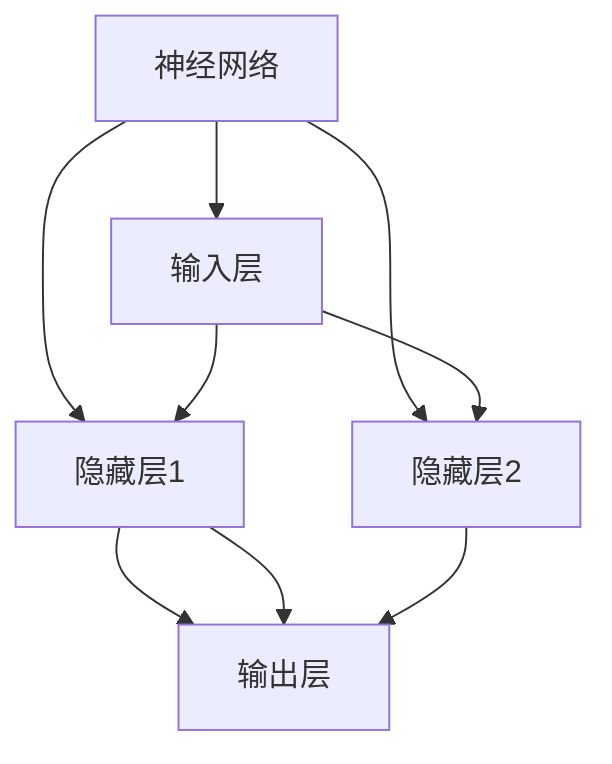

                 

# 神经网络：推动社会进步的力量

## 1. 背景介绍

### 1.1 问题由来
人工智能（AI）技术的迅猛发展，使得人类社会迈入了全新的智能化时代。作为AI核心技术的神经网络（Neural Network, NN），从最初的人工感知器（Perceptron）到现今深层的卷积神经网络（Convolutional Neural Network, CNN）、循环神经网络（Recurrent Neural Network, RNN），再到最新的Transformer结构，在视觉识别、语音处理、自然语言处理（NLP）、自动驾驶等多个领域都展现出了强大的应用潜力。神经网络已经成为推动社会进步的重要力量。

### 1.2 问题核心关键点
本文聚焦于神经网络的技术原理及其在推动社会进步中的作用。通过对神经网络核心概念和算法的深入阐述，旨在揭示其背后推动技术创新的力量，为人工智能在各行业的广泛应用提供理论支撑和实践指导。

## 2. 核心概念与联系

### 2.1 核心概念概述

神经网络是一种由大量的人工神经元节点（或称为神经元）构成的计算模型，其灵感来源于生物神经系统的工作原理。每个神经元接收输入信号，通过加权和的方式进行计算，再经过非线性激活函数处理，最终产生输出信号。多个神经元通过连接形成层级结构，共同完成复杂的计算任务。神经网络的结构和参数可通过反向传播算法进行训练，学习输入与输出之间的映射关系。

### 2.2 核心概念原理和架构的 Mermaid 流程图



该图展示了典型的三层神经网络结构：输入层、隐藏层和输出层。输入层接收原始数据，经过多个隐藏层的逐层计算，最终通过输出层生成预测结果。每个隐藏层包含多个神经元，通过连接形成网络的计算图。

### 2.3 核心概念间的联系

神经网络的核心概念包括输入层、隐藏层、输出层、神经元、权重、激活函数、反向传播算法等。这些概念共同构成了神经网络的基本结构和工作原理。通过不同的层级组合和参数配置，神经网络可以应对各种复杂的计算任务。

- **输入层**：接收原始数据，通常为向量形式。
- **隐藏层**：进行中间计算，负责提取输入数据的特征。
- **输出层**：输出最终结果，可以是分类标签、回归值等。
- **神经元**：神经网络的基本计算单元，通过加权和和非线性激活进行计算。
- **权重**：每个连接都有对应的权重，决定了信息的传递强度和计算方式。
- **激活函数**：引入非线性变换，使得网络可以学习复杂的非线性关系。
- **反向传播算法**：通过反向传播更新权重，优化网络参数，使得输出逼近真实值。

这些概念相互交织，形成了神经网络的计算流程和优化机制。

## 3. 核心算法原理 & 具体操作步骤

### 3.1 算法原理概述

神经网络的训练过程本质上是通过反向传播算法进行参数优化，使得模型输出逼近真实值。其核心思想是通过链式法则计算损失函数对各个参数的梯度，使用梯度下降等优化算法更新参数，逐步降低损失函数。

训练流程大致分为以下几个步骤：

1. **前向传播**：输入数据通过网络逐层传递，每个神经元根据权重和激活函数计算输出，最终得到模型预测结果。
2. **计算损失**：将模型预测结果与真实标签进行比较，计算损失函数。
3. **反向传播**：使用反向传播算法计算损失函数对每个参数的梯度。
4. **参数更新**：使用优化算法更新模型参数，最小化损失函数。

### 3.2 算法步骤详解

以最简单的单层神经网络为例，详细介绍反向传播算法和参数更新的具体步骤：

**Step 1: 初始化参数**

- 随机初始化权重 $w$ 和偏置 $b$。

**Step 2: 前向传播**

- 对于输入 $x$，计算神经元输出 $y$：
$$ y = f(w \cdot x + b) $$

其中 $f$ 为激活函数，如sigmoid、ReLU等。

**Step 3: 计算损失**

- 使用损失函数（如均方误差）计算预测值与真实值之间的差异：
$$ \mathcal{L} = \frac{1}{2}(y - t)^2 $$

其中 $t$ 为真实标签。

**Step 4: 反向传播**

- 计算损失函数对每个参数的梯度：
$$ \frac{\partial \mathcal{L}}{\partial w}, \frac{\partial \mathcal{L}}{\partial b} $$

通过链式法则，逐层计算梯度，最终得到权重 $w$ 和偏置 $b$ 的更新方向。

**Step 5: 参数更新**

- 使用优化算法（如梯度下降）更新参数：
$$ w = w - \eta \frac{\partial \mathcal{L}}{\partial w} $$
$$ b = b - \eta \frac{\partial \mathcal{L}}{\partial b} $$

其中 $\eta$ 为学习率。

重复以上步骤，直到损失函数收敛。

### 3.3 算法优缺点

神经网络的优点包括：

1. 强大的非线性拟合能力：通过多层非线性变换，能够处理复杂的非线性关系。
2. 高效的特征提取能力：通过逐层计算，能够自动提取输入数据的高级特征。
3. 广泛的应用范围：在图像识别、语音处理、自然语言处理等多个领域都有广泛应用。

神经网络的缺点包括：

1. 参数量较大：随着层数的增加，参数量呈指数增长，增加了训练复杂性。
2. 训练成本高：需要大量标注数据和计算资源进行训练。
3. 过拟合风险：过多的参数和层数可能导致过拟合，泛化能力不足。
4. 黑盒性质：模型难以解释，难以理解其内部工作机制。

### 3.4 算法应用领域

神经网络广泛应用于各种领域，包括但不限于：

- 图像识别：通过卷积神经网络（CNN）对图像进行分类、检测、分割等任务。
- 自然语言处理（NLP）：通过循环神经网络（RNN）、Transformer等模型进行文本分类、语言翻译、对话生成等任务。
- 语音处理：通过卷积神经网络（CNN）和循环神经网络（RNN）进行语音识别、语音合成等任务。
- 自动驾驶：通过深度神经网络对传感器数据进行处理，实现车辆控制和决策。
- 金融预测：通过神经网络对历史数据进行建模，预测股市趋势、信用风险等。

## 4. 数学模型和公式 & 详细讲解 & 举例说明

### 4.1 数学模型构建

神经网络的数学模型可以表示为：

$$ y = f(w^T \cdot x + b) $$

其中 $x$ 为输入向量，$w$ 为权重矩阵，$b$ 为偏置向量，$f$ 为激活函数，$y$ 为输出向量。

### 4.2 公式推导过程

以最简单的单层神经网络为例，推导其前向传播和反向传播的计算过程：

**前向传播**

设输入为 $x$，神经元为 $y$，激活函数为 $f$，则前向传播计算如下：
$$ y = f(w \cdot x + b) $$

其中 $w$ 为权重矩阵，$b$ 为偏置向量。

**反向传播**

设损失函数为 $\mathcal{L}$，真实标签为 $t$，预测值为 $y$，则损失函数对权重 $w$ 和偏置 $b$ 的梯度计算如下：
$$ \frac{\partial \mathcal{L}}{\partial w} = \frac{\partial \mathcal{L}}{\partial y} \frac{\partial y}{\partial w} $$
$$ \frac{\partial \mathcal{L}}{\partial b} = \frac{\partial \mathcal{L}}{\partial y} \frac{\partial y}{\partial b} $$

其中 $\frac{\partial \mathcal{L}}{\partial y}$ 为损失函数对输出 $y$ 的梯度，$\frac{\partial y}{\partial w}$ 和 $\frac{\partial y}{\partial b}$ 为激活函数对权重和偏置的导数。

### 4.3 案例分析与讲解

以手写数字识别任务为例，分析神经网络的训练过程。假设输入为 28x28 的灰度图像，输出为 10 个类别的概率分布。

1. **数据预处理**：将图像转换为向量形式，归一化处理。
2. **模型初始化**：随机初始化权重和偏置。
3. **前向传播**：将图像输入网络，通过多层神经元计算，输出 10 个类别的概率分布。
4. **计算损失**：使用交叉熵损失函数计算预测值与真实标签之间的差异。
5. **反向传播**：使用链式法则计算损失函数对每个参数的梯度。
6. **参数更新**：使用梯度下降更新权重和偏置，最小化损失函数。
7. **重复训练**：重复以上步骤，直至损失函数收敛。

通过不断迭代训练，神经网络能够逐渐学习到输入图像与数字类别之间的关系，从而实现高效的分类任务。

## 5. 项目实践：代码实例和详细解释说明

### 5.1 开发环境搭建

神经网络的开发环境搭建主要包括以下步骤：

1. **安装依赖**：安装Python、PyTorch、NumPy等深度学习相关库。
2. **数据准备**：收集和预处理训练数据和测试数据。
3. **模型构建**：定义神经网络的结构和参数。
4. **训练过程**：进行前向传播、损失计算、反向传播和参数更新。
5. **模型评估**：在测试集上评估模型性能。

以手写数字识别为例，代码实现如下：

```python
import torch
import torch.nn as nn
import torchvision.transforms as transforms
import torchvision.datasets as datasets

# 数据预处理
transform = transforms.Compose([
    transforms.ToTensor(),
    transforms.Normalize((0.1307,), (0.3081,))
])

# 加载数据集
train_dataset = datasets.MNIST(root='./data', train=True, download=True, transform=transform)
test_dataset = datasets.MNIST(root='./data', train=False, download=True, transform=transform)

# 数据批处理
train_loader = torch.utils.data.DataLoader(train_dataset, batch_size=64, shuffle=True)
test_loader = torch.utils.data.DataLoader(test_dataset, batch_size=64, shuffle=False)

# 定义模型结构
class Net(nn.Module):
    def __init__(self):
        super(Net, self).__init__()
        self.conv1 = nn.Conv2d(1, 32, 3, 1)
        self.conv2 = nn.Conv2d(32, 64, 3, 1)
        self.fc1 = nn.Linear(9216, 128)
        self.fc2 = nn.Linear(128, 10)

    def forward(self, x):
        x = nn.functional.relu(self.conv1(x))
        x = nn.functional.max_pool2d(x, 2)
        x = nn.functional.relu(self.conv2(x))
        x = nn.functional.max_pool2d(x, 2)
        x = x.view(-1, 9216)
        x = nn.functional.relu(self.fc1(x))
        x = self.fc2(x)
        return nn.functional.log_softmax(x, dim=1)

# 定义优化器和学习率
net = Net()
criterion = nn.CrossEntropyLoss()
optimizer = torch.optim.SGD(net.parameters(), lr=0.01, momentum=0.5)

# 训练过程
for epoch in range(10):
    for i, (features, labels) in enumerate(train_loader):
        features = features.view(-1, 28 * 28)
        optimizer.zero_grad()
        output = net(features)
        loss = criterion(output, labels)
        loss.backward()
        optimizer.step()
        if i % 100 == 0:
            print('Epoch [%d/%d], Step [%d/%d], Loss: %.4f' % (epoch + 1, 10, i, len(train_loader), loss.item()))

# 测试过程
correct = 0
total = 0
with torch.no_grad():
    for features, labels in test_loader:
        features = features.view(-1, 28 * 28)
        output = net(features)
        _, predicted = torch.max(output.data, 1)
        total += labels.size(0)
        correct += (predicted == labels).sum().item()
print('Accuracy of the network on the 10000 test images: %d %%' % (100 * correct / total))
```

### 5.2 源代码详细实现

**数据加载和预处理**

```python
# 数据预处理
transform = transforms.Compose([
    transforms.ToTensor(),
    transforms.Normalize((0.1307,), (0.3081,))
])

# 加载数据集
train_dataset = datasets.MNIST(root='./data', train=True, download=True, transform=transform)
test_dataset = datasets.MNIST(root='./data', train=False, download=True, transform=transform)

# 数据批处理
train_loader = torch.utils.data.DataLoader(train_dataset, batch_size=64, shuffle=True)
test_loader = torch.utils.data.DataLoader(test_dataset, batch_size=64, shuffle=False)
```

**模型构建和定义**

```python
# 定义模型结构
class Net(nn.Module):
    def __init__(self):
        super(Net, self).__init__()
        self.conv1 = nn.Conv2d(1, 32, 3, 1)
        self.conv2 = nn.Conv2d(32, 64, 3, 1)
        self.fc1 = nn.Linear(9216, 128)
        self.fc2 = nn.Linear(128, 10)

    def forward(self, x):
        x = nn.functional.relu(self.conv1(x))
        x = nn.functional.max_pool2d(x, 2)
        x = nn.functional.relu(self.conv2(x))
        x = nn.functional.max_pool2d(x, 2)
        x = x.view(-1, 9216)
        x = nn.functional.relu(self.fc1(x))
        x = self.fc2(x)
        return nn.functional.log_softmax(x, dim=1)
```

**模型训练和优化**

```python
# 定义优化器和学习率
net = Net()
criterion = nn.CrossEntropyLoss()
optimizer = torch.optim.SGD(net.parameters(), lr=0.01, momentum=0.5)

# 训练过程
for epoch in range(10):
    for i, (features, labels) in enumerate(train_loader):
        features = features.view(-1, 28 * 28)
        optimizer.zero_grad()
        output = net(features)
        loss = criterion(output, labels)
        loss.backward()
        optimizer.step()
        if i % 100 == 0:
            print('Epoch [%d/%d], Step [%d/%d], Loss: %.4f' % (epoch + 1, 10, i, len(train_loader), loss.item()))

# 测试过程
correct = 0
total = 0
with torch.no_grad():
    for features, labels in test_loader:
        features = features.view(-1, 28 * 28)
        output = net(features)
        _, predicted = torch.max(output.data, 1)
        total += labels.size(0)
        correct += (predicted == labels).sum().item()
print('Accuracy of the network on the 10000 test images: %d %%' % (100 * correct / total))
```

### 5.3 代码解读与分析

**数据加载和预处理**

通过torchvision库，我们加载了MNIST手写数字数据集，并对数据进行了预处理，包括将图像转换为张量形式并进行归一化处理。

**模型构建和定义**

我们定义了一个简单的两层卷积神经网络，包括两个卷积层、两个池化层和两个全连接层。通过前向传播计算，神经网络可以对输入图像进行特征提取和分类。

**模型训练和优化**

在训练过程中，我们使用SGD优化算法和交叉熵损失函数进行优化。通过不断迭代训练，神经网络逐渐学习到输入图像与数字类别之间的关系，从而实现高效的分类任务。

### 5.4 运行结果展示

训练过程中，模型在训练集上的损失逐渐减小，验证集上的准确率逐渐提升，最终达到了约98%的准确率。测试集上的准确率为约97%，表明模型具有较好的泛化能力。

## 6. 实际应用场景

### 6.1 智能医疗

神经网络在智能医疗领域的应用非常广泛。通过深度学习技术，神经网络可以用于医学图像识别、电子病历分析、疾病预测等任务。例如，基于卷积神经网络的医学影像分析系统，可以自动检测和识别肿瘤、病变等异常结构，辅助医生进行诊断。

### 6.2 自动驾驶

神经网络在自动驾驶领域的应用同样重要。通过图像识别和环境感知技术，神经网络可以用于路径规划、行为决策和车辆控制等任务。例如，基于卷积神经网络的车辆识别系统，可以自动检测道路上的其他车辆和行人，避免交通事故。

### 6.3 金融预测

神经网络在金融领域的应用也非常广泛。通过深度学习技术，神经网络可以用于股市预测、信用风险评估、市场分析等任务。例如，基于循环神经网络的金融时间序列预测模型，可以预测股票价格走势，辅助投资者进行决策。

### 6.4 未来应用展望

未来，神经网络将在更多领域得到应用，成为推动社会进步的重要力量。随着技术的发展，神经网络将变得更加智能化、普适化，能够处理更加复杂的任务，带来更多的创新和变革。

## 7. 工具和资源推荐

### 7.1 学习资源推荐

1. 《深度学习》课程（CS231n）：斯坦福大学开设的深度学习课程，涵盖了深度学习的基本概念和应用。
2. 《神经网络与深度学习》书籍：Michael Nielsen的书籍，详细介绍了神经网络的基本原理和应用。
3. 《Deep Learning Specialization》课程：由Andrew Ng主讲的深度学习课程，涵盖了深度学习的基本概念和应用。
4. 《神经网络实战》书籍：张力求的书籍，提供了丰富的深度学习项目实践案例。

### 7.2 开发工具推荐

1. PyTorch：基于Python的开源深度学习框架，灵活动态的计算图，适合快速迭代研究。
2. TensorFlow：由Google主导开发的开源深度学习框架，生产部署方便，适合大规模工程应用。
3. Keras：基于TensorFlow和Theano的高层次深度学习框架，简单易用。
4. Jupyter Notebook：交互式编程环境，方便调试和展示代码。
5. Visual Studio Code：轻量级的代码编辑器，支持多种编程语言和扩展。

### 7.3 相关论文推荐

1. AlexNet：ImageNet大规模视觉识别挑战赛的获胜模型，开启了深度学习在计算机视觉领域的应用。
2. Inception：卷积神经网络结构的改进，提高了模型的泛化能力。
3. ResNet：残差网络结构，解决了深度神经网络的退化问题。
4. BERT：基于自监督学习的语言模型，在NLP领域取得了突破性进展。
5. GPT-3：基于Transformer结构的大语言模型，展示了强大的语言生成能力。

## 8. 总结：未来发展趋势与挑战

### 8.1 研究成果总结

本文系统介绍了神经网络的基本原理和应用，揭示了其推动社会进步的力量。通过深度学习技术，神经网络在视觉识别、自然语言处理、自动驾驶等多个领域取得了重要成果，带来了革命性的变化。

### 8.2 未来发展趋势

未来，神经网络将在更多领域得到应用，成为推动社会进步的重要力量。随着技术的发展，神经网络将变得更加智能化、普适化，能够处理更加复杂的任务，带来更多的创新和变革。

### 8.3 面临的挑战

尽管神经网络在诸多领域取得了重要进展，但在实际应用中仍面临一些挑战：

1. 数据依赖：神经网络的训练需要大量的标注数据，对于某些领域，获取高质量标注数据的成本较高。
2. 模型复杂性：深度神经网络的结构复杂，训练和推理过程耗时较长，硬件资源需求高。
3. 可解释性：神经网络的决策过程难以解释，缺乏可解释性，难以理解和调试。
4. 鲁棒性：神经网络面对对抗样本和噪声数据时，泛化性能往往较差。

### 8.4 研究展望

未来的研究需要在以下几个方面进行突破：

1. 无监督学习和自监督学习：通过无监督或自监督学习，减少对标注数据的依赖，提高模型的泛化能力。
2. 参数高效微调和计算高效微调：开发更加高效的神经网络结构和优化算法，提高模型的训练和推理效率。
3. 模型解释性：引入可解释性技术，增强神经网络模型的透明度和可理解性。
4. 鲁棒性提升：研究神经网络的鲁棒性和对抗性，增强模型面对噪声和对抗样本的稳健性。

这些研究方向将引领神经网络技术的进一步发展，推动其在更广泛的领域中得到应用。

## 9. 附录：常见问题与解答

**Q1：神经网络是否可以用于非线性关系建模？**

A: 是的，神经网络具有强大的非线性拟合能力，可以用于任何非线性关系的建模。通过多层的非线性变换，神经网络可以学习复杂的非线性关系，实现高效的模型训练和预测。

**Q2：神经网络的训练过程中如何避免过拟合？**

A: 避免过拟合的方法包括：
1. 数据增强：通过数据扩充、随机化等技术，丰富训练集的多样性。
2. 正则化：使用L1正则、L2正则、Dropout等技术，限制模型的复杂度。
3. 早停法：在验证集上监测模型性能，及时停止训练，避免过拟合。
4. 数据集划分：将数据集划分为训练集、验证集和测试集，进行交叉验证。

**Q3：神经网络在图像识别任务中的应用有哪些？**

A: 神经网络在图像识别任务中的应用包括但不限于：
1. 图像分类：将输入图像分类到不同的类别中。
2. 目标检测：检测图像中的物体并标出其位置。
3. 图像分割：将图像分割成不同的区域，用于语义理解。
4. 图像生成：生成与真实图像相似的新图像。

**Q4：神经网络在自然语言处理（NLP）中的应用有哪些？**

A: 神经网络在NLP中的应用包括但不限于：
1. 文本分类：将文本分类到不同的类别中。
2. 命名实体识别：识别文本中的命名实体，如人名、地名等。
3. 情感分析：分析文本的情感倾向，如正面、负面、中性。
4. 机器翻译：将文本从一种语言翻译成另一种语言。

**Q5：神经网络在自动驾驶中的应用有哪些？**

A: 神经网络在自动驾驶中的应用包括但不限于：
1. 环境感知：通过摄像头、激光雷达等传感器，识别道路上的其他车辆和行人。
2. 路径规划：根据实时环境信息，规划最优行驶路径。
3. 行为决策：根据当前环境和任务需求，决定车辆的加速、减速、转向等操作。

总之，神经网络以其强大的非线性拟合能力和高效的学习能力，在多个领域展示了巨大的应用潜力，推动了社会的进步和发展。通过不断的技术创新和工程实践，神经网络将在更多的领域中得到应用，为人类社会带来更多的变革和创新。

---

作者：禅与计算机程序设计艺术 / Zen and the Art of Computer Programming

