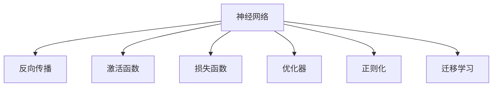

                 

# 神经网络：推动社会进步的力量

## 1. 背景介绍

### 1.1 问题由来

自上世纪80年代以来，人工智能（AI）的发展已经取得了一系列的突破性进展。深度学习作为AI领域的一个重要分支，尤其是神经网络的发展，在多个领域如计算机视觉、自然语言处理、语音识别等方面取得了革命性的成果。神经网络不仅在学术界引起了巨大的轰动，还在工业界得到了广泛的应用。

### 1.2 问题核心关键点

神经网络的核心在于它能够通过学习大量的数据，自动发现特征和规律，从而实现对新数据的预测和分类。神经网络的强大之处在于其可以处理非结构化数据，如图像、文本、语音等，并且能够通过微调来适应特定的应用场景。

## 2. 核心概念与联系

### 2.1 核心概念概述

为更好地理解神经网络的核心概念，本节将介绍几个密切相关的核心概念：

- **神经网络（Neural Network）**：基于生物神经网络的计算模型，通过大量的人工神经元（节点），模拟人类神经系统的工作方式，实现数据的处理和分析。
- **反向传播（Backpropagation）**：神经网络中的一种训练算法，通过误差反向传播，调整神经元之间的权重和偏差，从而优化网络性能。
- **激活函数（Activation Function）**：神经元在计算时使用的非线性函数，如Sigmoid、ReLU、Tanh等，用于引入非线性变换，增强网络的表达能力。
- **损失函数（Loss Function）**：用于衡量模型输出与真实值之间差异的函数，如均方误差（MSE）、交叉熵（Cross-Entropy）等，用于指导模型的训练。
- **优化器（Optimizer）**：用于调整网络参数，以最小化损失函数，常见的优化器如SGD、Adam等，其具体选择取决于问题的复杂度和数据规模。
- **正则化（Regularization）**：用于防止过拟合，常见的正则化方法如L1、L2正则化、Dropout等，对模型进行约束。
- **迁移学习（Transfer Learning）**：通过将在大规模数据集上预训练的模型知识，迁移到小规模数据集上的特定任务中，从而加速模型训练和提高性能。

这些核心概念之间的逻辑关系可以通过以下Mermaid流程图来展示：



这个流程图展示了几何神经网络的核心概念及其之间的关系：神经网络通过反向传播算法和优化器进行训练；激活函数用于增强网络的非线性表达能力；损失函数用于评估模型性能；正则化用于防止过拟合；迁移学习则将预训练的知识应用于特定任务中。

## 3. 核心算法原理 & 具体操作步骤
### 3.1 算法原理概述

神经网络的核心算法原理基于反向传播算法，通过不断调整神经元之间的权重和偏差，最小化损失函数，从而实现对新数据的预测和分类。其基本流程如下：

1. **前向传播（Forward Propagation）**：将输入数据送入网络，通过一系列的线性变换和非线性变换，得到网络的输出。
2. **计算损失（Loss Calculation）**：将网络的输出与真实值进行比较，计算出损失函数。
3. **反向传播（Backward Propagation）**：根据损失函数的梯度，反向传播误差，调整每个神经元的权重和偏差。
4. **更新权重（Weight Update）**：通过优化器更新权重，使损失函数逐渐减小，网络性能逐渐提升。

### 3.2 算法步骤详解

神经网络的训练步骤如下：

1. **数据准备**：准备训练数据集和测试数据集，并进行数据预处理，如标准化、归一化等。
2. **模型定义**：定义神经网络的结构，包括神经元的数量、层数、激活函数、损失函数和优化器等。
3. **模型训练**：将训练数据集输入神经网络，通过前向传播和反向传播更新权重，不断迭代优化网络。
4. **模型评估**：将测试数据集输入神经网络，计算模型的损失函数，评估模型性能。
5. **模型保存**：保存训练好的模型，以便后续使用。

### 3.3 算法优缺点

神经网络具有以下优点：

- **自适应性**：能够自动学习数据的特征和规律，无需手动设计特征提取器。
- **泛化能力**：通过反向传播算法和大规模数据集的训练，能够适应新数据，实现泛化。
- **非线性能力**：通过激活函数引入非线性变换，能够处理复杂的非线性关系。

同时，神经网络也存在以下缺点：

- **过拟合**：在大规模数据集上训练时，容易出现过拟合现象。
- **计算复杂度**：神经网络的计算复杂度较高，需要大量的计算资源。
- **模型可解释性**：由于神经网络的复杂性，其内部工作机制难以解释，增加了模型的不可解释性。

### 3.4 算法应用领域

神经网络在多个领域得到了广泛的应用，例如：

- **计算机视觉**：如图像分类、目标检测、人脸识别等。
- **自然语言处理**：如机器翻译、文本分类、情感分析等。
- **语音识别**：如语音识别、语音合成、语音情感识别等。
- **推荐系统**：如电商推荐、新闻推荐、视频推荐等。
- **医疗**：如医学图像分析、疾病诊断、药物发现等。

## 4. 数学模型和公式 & 详细讲解 & 举例说明

### 4.1 数学模型构建

神经网络的数学模型由输入层、隐藏层和输出层组成。假设输入层有$n$个输入特征，隐藏层有$m$个神经元，输出层有$l$个神经元。输入层到隐藏层的权重矩阵为$W_h \in \mathbb{R}^{m \times n}$，隐藏层到输出层的权重矩阵为$W_o \in \mathbb{R}^{l \times m}$，激活函数为$\sigma$，损失函数为$L$。则前向传播的过程可以表示为：

$$
\begin{aligned}
z_h &= W_h x + b_h \\
h &= \sigma(z_h) \\
z_o &= W_o h + b_o \\
y &= \sigma(z_o)
\end{aligned}
$$

其中$x \in \mathbb{R}^n$为输入，$b_h \in \mathbb{R}^m$和$b_o \in \mathbb{R}^l$为偏置向量，$y \in \mathbb{R}^l$为输出。

### 4.2 公式推导过程

假设有一个二分类问题，损失函数为交叉熵损失，则训练神经网络的优化目标是：

$$
\min_{W_h, W_o, b_h, b_o} L(y, \hat{y}) = \min_{W_h, W_o, b_h, b_o} -\frac{1}{N}\sum_{i=1}^N y_i \log \hat{y_i} + (1-y_i) \log(1-\hat{y_i})
$$

其中$y$为真实标签，$\hat{y}$为模型预测输出。使用梯度下降算法，可以得到每个参数的更新公式：

$$
\begin{aligned}
\Delta W_h &= \eta \frac{\partial L}{\partial W_h} = \eta \frac{1}{N} \sum_{i=1}^N (h_i - y_i) (x_i)^\top \\
\Delta b_h &= \eta \frac{\partial L}{\partial b_h} = \eta \frac{1}{N} \sum_{i=1}^N (h_i - y_i) \\
\Delta W_o &= \eta \frac{\partial L}{\partial W_o} = \eta \frac{1}{N} \sum_{i=1}^N (y_i - \hat{y_i}) h_i^\top \\
\Delta b_o &= \eta \frac{\partial L}{\partial b_o} = \eta \frac{1}{N} \sum_{i=1}^N (y_i - \hat{y_i})
\end{aligned}
$$

其中$\eta$为学习率，$\Delta W_h$、$\Delta b_h$、$\Delta W_o$和$\Delta b_o$分别为权重和偏置的更新量。

### 4.3 案例分析与讲解

以图像分类任务为例，假设有一个包含10个类别的MNIST数据集，共有6万个训练样本。使用一个包含两个隐藏层、每个隐藏层有100个神经元的神经网络进行训练。

- **数据准备**：将MNIST数据集划分为训练集和测试集，并进行标准化处理。
- **模型定义**：定义神经网络的结构，包括两个隐藏层，每个隐藏层有100个神经元，使用ReLU作为激活函数，输出层有10个神经元，使用Softmax作为激活函数。
- **模型训练**：使用交叉熵损失函数和Adam优化器，在训练集上进行迭代训练。
- **模型评估**：在测试集上进行评估，计算模型的准确率。

## 5. 项目实践：代码实例和详细解释说明
### 5.1 开发环境搭建

在进行神经网络项目实践前，需要先准备好开发环境。以下是使用Python进行TensorFlow开发的开发环境配置流程：

1. 安装Anaconda：从官网下载并安装Anaconda，用于创建独立的Python环境。

2. 创建并激活虚拟环境：
```bash
conda create -n tf-env python=3.8 
conda activate tf-env
```

3. 安装TensorFlow：根据CUDA版本，从官网获取对应的安装命令。例如：
```bash
pip install tensorflow
```

4. 安装必要的库：
```bash
pip install numpy pandas scikit-learn matplotlib
```

5. 安装TensorBoard：用于可视化训练过程和结果。
```bash
pip install tensorboard
```

完成上述步骤后，即可在`tf-env`环境中开始神经网络项目的开发。

### 5.2 源代码详细实现

下面以图像分类任务为例，给出使用TensorFlow实现神经网络的完整代码实现。

```python
import tensorflow as tf
import numpy as np
import matplotlib.pyplot as plt

# 准备数据集
(x_train, y_train), (x_test, y_test) = tf.keras.datasets.mnist.load_data()
x_train = x_train / 255.0
x_test = x_test / 255.0

# 定义模型
model = tf.keras.Sequential([
    tf.keras.layers.Flatten(input_shape=(28, 28)),
    tf.keras.layers.Dense(128, activation='relu'),
    tf.keras.layers.Dense(10, activation='softmax')
])

# 定义损失函数和优化器
loss_fn = tf.keras.losses.SparseCategoricalCrossentropy()
optimizer = tf.keras.optimizers.Adam()

# 定义模型训练函数
def train_step(x, y):
    with tf.GradientTape() as tape:
        logits = model(x, training=True)
        loss_value = loss_fn(y, logits)
    gradients = tape.gradient(loss_value, model.trainable_variables)
    optimizer.apply_gradients(zip(gradients, model.trainable_variables))
    return loss_value

# 训练模型
EPOCHS = 10
BATCH_SIZE = 32

for epoch in range(EPOCHS):
    for i in range(0, len(x_train), BATCH_SIZE):
        x_batch = x_train[i:i+BATCH_SIZE]
        y_batch = y_train[i:i+BATCH_SIZE]
        loss = train_step(x_batch, y_batch)
        print(f"Epoch {epoch+1}, Loss: {loss.numpy()}")

# 评估模型
test_loss = loss_fn(y_test, model.predict(x_test)).numpy()
print(f"Test Loss: {test_loss}")

# 可视化训练结果
plt.plot(history.history['loss'])
plt.xlabel('Epoch')
plt.ylabel('Loss')
plt.show()
```

以上代码实现了基本的神经网络模型，并使用TensorFlow的Keras API进行训练和评估。

### 5.3 代码解读与分析

让我们再详细解读一下关键代码的实现细节：

**数据准备**：
- `mnist.load_data()`函数从TensorFlow的数据集中加载MNIST数据集，包含训练集和测试集。
- `x_train`和`y_train`为训练集的输入和输出，`x_test`和`y_test`为测试集的输入和输出。
- `x_train`和`x_test`进行归一化处理，将像素值归一化到0到1之间。

**模型定义**：
- `tf.keras.Sequential`函数定义了一个序列化的神经网络模型，包含一个Flatten层将输入展平，两个Dense层分别作为隐藏层和输出层。
- 隐藏层有128个神经元，使用ReLU作为激活函数，输出层有10个神经元，使用Softmax作为激活函数。

**训练函数**：
- `train_step`函数实现了反向传播算法和梯度下降优化器的过程。
- `tf.GradientTape`上下文管理器记录了模型在训练过程中的梯度信息，`model(x, training=True)`表示模型在训练模式下运行。
- `loss_fn(y, logits)`计算交叉熵损失，`optimizer.apply_gradients(zip(gradients, model.trainable_variables))`更新模型参数。

**模型训练**：
- `EPOCHS`和`BATCH_SIZE`定义了训练的轮数和每个批次的大小。
- 通过循环迭代训练集中的数据，每次更新模型参数，记录训练过程中的损失值。

**模型评估**：
- `loss_fn(y_test, model.predict(x_test))`计算测试集的交叉熵损失。

**可视化结果**：
- 使用Matplotlib可视化训练过程中的损失值。

## 6. 实际应用场景
### 6.1 智能推荐系统

智能推荐系统通过神经网络模型，对用户的浏览历史、兴趣偏好、评价等数据进行分析和处理，从而为用户推荐感兴趣的物品。智能推荐系统在电商、社交媒体、视频网站等领域得到了广泛的应用。

以电商推荐系统为例，假设有一个电商平台，用户浏览了10个商品，这些商品属于5个不同的类别。可以使用一个包含两个隐藏层、每个隐藏层有100个神经元的神经网络进行训练。模型可以学习到用户对不同类别的兴趣偏好，从而为用户推荐相似的商品。

### 6.2 医学影像诊断

医学影像诊断是一个复杂且重要的任务，传统的基于规则的方法往往难以应对复杂的多模态数据。神经网络通过深度学习，可以从大量医学影像中自动提取特征和规律，进行疾病的诊断和治疗方案的推荐。

以乳腺癌诊断为例，假设有一个包含1000张乳腺癌影像的训练集和测试集，每个影像的大小为256x256。可以使用一个包含三个隐藏层、每个隐藏层有128个神经元的神经网络进行训练。模型可以学习到乳腺癌的特征，从而自动诊断影像中的病变情况，并推荐治疗方案。

### 6.3 自然语言处理

自然语言处理（NLP）是神经网络的重要应用领域，包括文本分类、情感分析、机器翻译等。神经网络通过学习大量的语言数据，能够自动理解语言的结构和规律，从而实现对新文本的分类和生成。

以情感分析为例，假设有一个包含10000条评论的数据集，每条评论的情感标签为正面、负面或中性。可以使用一个包含两个隐藏层、每个隐藏层有128个神经元的神经网络进行训练。模型可以学习到评论的情感倾向，从而自动判断评论的情感标签。

## 7. 工具和资源推荐
### 7.1 学习资源推荐

为了帮助开发者系统掌握神经网络的理论基础和实践技巧，这里推荐一些优质的学习资源：

1. 《深度学习》书籍：Ian Goodfellow等人所著，系统介绍了深度学习的原理和应用，是神经网络学习的必读之作。
2. CS231n《深度学习视觉识别》课程：斯坦福大学开设的计算机视觉课程，涵盖了神经网络在图像识别任务中的应用。
3. CS224n《深度学习自然语言处理》课程：斯坦福大学开设的NLP课程，涵盖神经网络在自然语言处理中的应用。
4. TensorFlow官方文档：TensorFlow的官方文档，提供了详细的API文档和教程，适合初学者和进阶者学习。
5. PyTorch官方文档：PyTorch的官方文档，提供了丰富的代码示例和教程，适合初学者和进阶者学习。

通过对这些资源的学习实践，相信你一定能够快速掌握神经网络的核心概念和实际应用。

### 7.2 开发工具推荐

高效的开发离不开优秀的工具支持。以下是几款用于神经网络开发的常用工具：

1. TensorFlow：由Google主导开发的深度学习框架，支持分布式训练和生产部署，适合大规模工程应用。
2. PyTorch：由Facebook主导开发的深度学习框架，灵活性和易用性较高，适合学术研究和原型开发。
3. Keras：基于TensorFlow和Theano的高层API，提供了简单易用的神经网络模型，适合快速原型开发。
4. Jupyter Notebook：交互式的Python开发环境，支持代码编写、数据可视化等操作，适合学习研究和协作开发。
5. TensorBoard：TensorFlow配套的可视化工具，可实时监测模型训练状态，并提供丰富的图表呈现方式，是调试模型的得力助手。

合理利用这些工具，可以显著提升神经网络模型的开发效率，加快创新迭代的步伐。

### 7.3 相关论文推荐

神经网络的发展源于学界的持续研究。以下是几篇奠基性的相关论文，推荐阅读：

1. 《ImageNet Classification with Deep Convolutional Neural Networks》：AlexNet论文，提出了深度卷积神经网络，为计算机视觉领域带来了新的突破。
2. 《Deep Residual Learning for Image Recognition》：ResNet论文，提出了残差连接，解决了深度神经网络训练过程中的梯度消失问题。
3. 《Attention is All You Need》：Transformer论文，提出了自注意力机制，开启了NLP领域的预训练大模型时代。
4. 《Natural Language Processing (almost) from Scratch》：论文介绍了如何从零开始构建一个完整的NLP模型，适合学习者了解神经网络在NLP中的应用。

这些论文代表了大神经网络的研究发展脉络。通过学习这些前沿成果，可以帮助研究者把握学科前进方向，激发更多的创新灵感。

## 8. 总结：未来发展趋势与挑战

### 8.1 总结

本文对神经网络的核心概念和实际应用进行了全面系统的介绍。首先阐述了神经网络的发展历程和重要性，明确了神经网络在数据处理和智能决策中的核心作用。其次，从原理到实践，详细讲解了神经网络的基本原理和训练流程，给出了神经网络项目开发的完整代码实例。同时，本文还广泛探讨了神经网络在智能推荐、医学影像诊断、自然语言处理等多个领域的应用前景，展示了神经网络技术的广阔前景。最后，本文精选了神经网络的各类学习资源，力求为读者提供全方位的技术指引。

通过本文的系统梳理，可以看到，神经网络作为推动社会进步的重要力量，正在深刻改变着我们的生活和工作方式。其强大的泛化能力和非线性表达能力，使其成为处理复杂多变数据的利器。未来，伴随神经网络技术的不断演进，相信其将在更多的领域展现出巨大的潜力，为人类社会带来更美好的未来。

### 8.2 未来发展趋势

展望未来，神经网络技术将呈现以下几个发展趋势：

1. **大规模化**：神经网络的参数规模将进一步扩大，模型结构将更加复杂，以应对更加复杂的任务需求。
2. **自监督学习**：神经网络将更多地利用无监督学习方法进行预训练，减少对大量标注数据的依赖。
3. **联邦学习**：分布式神经网络技术将得到更广泛的应用，使得神经网络能够在本地设备上训练，保护数据隐私。
4. **迁移学习**：神经网络将在不同的任务和领域中实现迁移学习，提高模型的泛化能力和适应性。
5. **混合智能**：神经网络将与其他AI技术（如强化学习、知识图谱等）进行深度融合，提升智能系统的综合能力。
6. **可解释性**：神经网络的可解释性将得到更多的关注，研究人员将开发更易于理解和解释的神经网络模型。

这些趋势凸显了神经网络技术的广阔前景。未来的研究需要在这些方向上持续发力，不断提升神经网络模型的性能和应用范围。

### 8.3 面临的挑战

尽管神经网络技术已经取得了瞩目成就，但在迈向更加智能化、普适化应用的过程中，它仍面临着诸多挑战：

1. **计算资源消耗**：神经网络的计算复杂度较高，需要大量的计算资源，如何优化计算效率是一个重要挑战。
2. **模型可解释性**：神经网络的复杂性导致其难以解释，如何提升模型的可解释性是一个重要问题。
3. **数据隐私保护**：神经网络在大规模数据集上训练时，数据隐私保护是一个重要问题，如何保证数据安全是一个重要挑战。
4. **泛化能力**：神经网络在处理小样本数据时，容易出现过拟合现象，如何提升模型的泛化能力是一个重要问题。
5. **鲁棒性**：神经网络面对噪声和异常数据时，鲁棒性较低，如何提升模型的鲁棒性是一个重要问题。
6. **伦理道德**：神经网络在大规模应用时，可能会产生伦理道德问题，如何保护用户隐私和权益是一个重要问题。

这些挑战凸显了神经网络技术的发展困境，未来需要更多的研究来应对和解决这些问题。

### 8.4 研究展望

面对神经网络技术面临的种种挑战，未来的研究需要在以下几个方面寻求新的突破：

1. **优化算法**：开发更高效的优化算法，提升神经网络训练的效率和效果。
2. **模型压缩**：开发更高效的模型压缩技术，减少神经网络的计算量和存储空间。
3. **自适应学习**：开发自适应学习算法，使神经网络能够更好地适应不同的数据分布。
4. **联邦学习**：研究联邦学习技术，使神经网络能够在分布式环境中进行训练，保护数据隐私。
5. **可解释性**：研究可解释性技术，使神经网络能够更好地解释其决策过程，增强用户信任。
6. **混合智能**：研究混合智能技术，使神经网络能够与其他AI技术进行深度融合，提升智能系统的综合能力。

这些研究方向将引领神经网络技术的未来发展，为构建安全、可靠、高效、智能的神经网络系统提供重要支撑。面向未来，神经网络技术需要更多的创新和突破，才能真正实现其社会进步的力量。

## 9. 附录：常见问题与解答

**Q1：神经网络如何处理输入数据？**

A: 神经网络通过前向传播算法对输入数据进行处理，将输入数据通过一系列的线性变换和非线性变换，得到网络的输出。输入数据可以是图像、文本、音频等不同类型的数据，神经网络能够自动提取数据特征，进行分类、识别、生成等任务。

**Q2：神经网络如何进行训练？**

A: 神经网络通过反向传播算法和优化器进行训练。训练过程分为前向传播和反向传播两个步骤，前向传播将输入数据送入网络，得到网络的输出；反向传播根据输出结果计算误差，调整每个神经元的权重和偏差，最小化损失函数。常见的优化器包括SGD、Adam等，学习率、批次大小、迭代轮数等超参数的调整对训练效果有重要影响。

**Q3：神经网络在实际应用中需要注意哪些问题？**

A: 神经网络在实际应用中需要注意以下几个问题：

1. **数据准备**：数据集的质量和数量对神经网络的训练效果有重要影响，需要清洗、标准化、归一化等预处理操作。
2. **模型结构**：模型结构的选择对神经网络的性能有重要影响，需要根据任务需求和数据特点选择适当的模型结构。
3. **超参数调整**：学习率、批次大小、迭代轮数等超参数的调整对神经网络的训练效果有重要影响，需要经过多次实验进行调参。
4. **模型评估**：模型训练完成后，需要进行评估，计算模型在测试集上的性能指标，判断模型的泛化能力。
5. **模型部署**：模型训练完成后，需要进行部署，将模型转换为标准化的服务接口，方便调用和集成。

这些问题都需要在实际应用中得到充分的考虑和处理，才能保证神经网络的性能和效果。

---

作者：禅与计算机程序设计艺术 / Zen and the Art of Computer Programming

