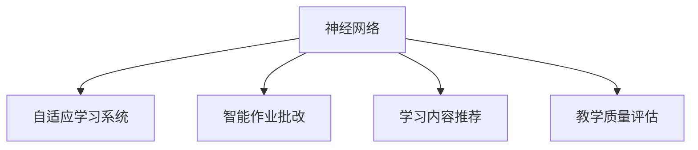

                 

# 神经网络：教育领域的变革

## 1. 背景介绍

### 1.1 问题由来
近年来，人工智能(AI)在教育领域的应用逐渐兴起，成为变革教育方式、提高教学质量的重要工具。人工智能技术，尤其是深度学习模型的引入，为教育者提供了更高效、个性化的教学手段。其中，神经网络(Neural Networks)作为一种模拟人脑工作机制的计算模型，已经在教育领域展现了巨大的潜力，从自适应学习系统到智能作业批改，从个性化学习路径规划到教育内容的智能推荐，神经网络正在为教育带来深刻的变革。

### 1.2 问题核心关键点
神经网络在教育领域的应用主要集中在以下几个方面：

- **自适应学习系统**：通过数据分析，实时调整教学内容和方法，根据学生的学习进度和理解程度，提供个性化的学习建议和反馈。
- **智能作业批改**：利用神经网络对学生作业进行自动化评分，快速反馈学生的学习情况，减轻教师工作负担。
- **学习内容推荐**：基于学生的学习历史和兴趣爱好，推荐适宜的学习资源和材料，提升学习效果。
- **教学质量评估**：通过大数据分析，评估教师的教学效果和学生的学习成果，提供教学改进建议。

### 1.3 问题研究意义
神经网络在教育领域的应用，不仅能够提高教学效率和质量，还能够提供个性化的学习体验，满足不同学生的学习需求，为教育公平和普惠教育提供新的可能性。同时，神经网络技术的应用也为教育内容的更新和优化提供了新的手段，有助于提高教育资源的利用效率。因此，研究神经网络在教育领域的应用，对于推动教育信息化和智能化进程，具有重要意义。

## 2. 核心概念与联系

### 2.1 核心概念概述

为更好地理解神经网络在教育领域的应用，本节将介绍几个密切相关的核心概念：

- **神经网络**：一种基于人工神经元网络的计算模型，能够模拟人脑的信息处理和决策过程。神经网络由多个层次的神经元组成，通过训练数据不断调整权重和偏置，从而学习复杂的模式和关系。
- **自适应学习系统**：利用人工智能技术，根据学生的学习行为和反馈，动态调整教学内容和策略，提供个性化的学习建议和资源推荐。
- **智能作业批改**：通过深度学习模型对学生作业进行自动化评分和反馈，提高批改效率和准确性，同时减轻教师的工作负担。
- **学习内容推荐**：基于学生的学习历史和兴趣，利用神经网络对学习内容进行推荐，帮助学生发现并利用适宜的学习资源，提升学习效果。
- **教学质量评估**：通过大数据分析和深度学习模型，评估教师的教学效果和学生的学习成果，提供教学改进建议。

这些核心概念之间的逻辑关系可以通过以下Mermaid流程图来展示：



这个流程图展示了几大核心概念之间的联系：

1. 神经网络作为基础技术，支持自适应学习系统、智能作业批改、学习内容推荐和教学质量评估。
2. 自适应学习系统利用神经网络进行个性化推荐和动态调整教学策略。
3. 智能作业批改基于神经网络进行自动化评分和反馈。
4. 学习内容推荐通过神经网络推荐适宜的学习资源。
5. 教学质量评估利用神经网络进行大数据分析，提供教学改进建议。

这些概念共同构成了神经网络在教育领域的应用框架，使其能够在教育信息化和智能化中发挥重要作用。

## 3. 核心算法原理 & 具体操作步骤
### 3.1 算法原理概述

神经网络在教育领域的应用，主要是基于其强大的数据处理和模式识别能力。神经网络通过学习大量的训练数据，自动提取数据中的特征和规律，并能够进行高精度的预测和分类。在教育领域，神经网络主要应用于以下几个方面：

- **学生学习行为分析**：通过分析学生的在线学习行为，如登录时间、浏览页面、答题情况等，利用神经网络构建学习行为模型，预测学生的学习状态和需求。
- **个性化学习路径规划**：根据学生的学习行为和成绩，利用神经网络生成个性化的学习路径和建议，帮助学生提升学习效果。
- **学习内容推荐**：通过分析学生的学习历史和兴趣，利用神经网络对学习资源进行推荐，提高学习资源的利用率。
- **作业批改和反馈**：利用神经网络对学生作业进行自动化评分，并生成个性化的反馈和改进建议。
- **教学质量评估**：通过大数据分析和神经网络模型，评估教师的教学效果和学生的学习成果，提供教学改进建议。

### 3.2 算法步骤详解

以下是神经网络在教育领域应用的典型步骤：

**Step 1: 数据收集和预处理**
- 收集学生学习行为数据、学习内容数据、作业数据、教师教学数据等。
- 对数据进行清洗、标注、归一化等预处理，确保数据的准确性和一致性。

**Step 2: 选择合适的神经网络模型**
- 根据具体应用场景和任务需求，选择合适的神经网络架构，如前馈神经网络、卷积神经网络、循环神经网络等。
- 设计合适的输入、输出层结构，以及激活函数、损失函数等关键组件。

**Step 3: 模型训练和优化**
- 利用收集到的数据对神经网络进行训练，调整模型的权重和偏置，最小化预测误差。
- 使用合适的优化算法，如随机梯度下降、Adam、Adagrad等，提高模型训练效率。
- 应用正则化技术，如L2正则、Dropout、Early Stopping等，防止过拟合。

**Step 4: 模型评估和部署**
- 在验证集上评估模型性能，如准确率、召回率、F1值等指标。
- 对模型进行优化，调整超参数，进一步提高模型效果。
- 将训练好的模型部署到实际应用场景中，如自适应学习系统、智能作业批改系统、学习内容推荐系统等。

**Step 5: 持续学习和优化**
- 根据实际应用中的反馈和数据分析，持续收集新数据，对模型进行微调。
- 引入新算法和模型，不断优化模型的预测能力和应用效果。

### 3.3 算法优缺点

神经网络在教育领域的应用具有以下优点：
1. 强大的数据处理能力：神经网络能够处理大规模、复杂的数据，从中提取有用信息，为个性化学习推荐和教学质量评估提供支持。
2. 高效的学习和推荐：基于神经网络的学习路径规划和内容推荐，能够快速响应学生的学习需求，提供个性化建议。
3. 自动化的作业批改和反馈：利用神经网络对作业进行自动化评分，减轻教师工作负担，提高作业批改效率。
4. 客观的教学质量评估：通过大数据分析和神经网络模型，评估教师的教学效果和学生的学习成果，提供教学改进建议。

同时，神经网络在教育领域的应用也存在一些局限性：
1. 数据依赖性高：神经网络的性能依赖于高质量、大规模的数据，获取和处理这些数据需要大量的时间和资源。
2. 模型复杂度高：神经网络模型的训练和优化复杂度高，需要专业知识和技术支持。
3. 透明性不足：神经网络模型的决策过程复杂，难以解释和调试，教师和学生可能难以理解其内部工作机制。
4. 过拟合风险：神经网络在训练过程中可能过拟合，导致模型泛化性能差，影响实际应用效果。

尽管存在这些局限性，但就目前而言，神经网络在教育领域的应用范式已经成为推动教育信息化和智能化进程的重要力量。未来相关研究的重点在于如何进一步降低数据获取成本，提高模型的可解释性和泛化能力，同时兼顾教学质量评估和个性化学习推荐等关键应用需求。

### 3.4 算法应用领域

神经网络在教育领域的应用已经涵盖了多个方面，包括但不限于以下几个主要领域：

- **自适应学习系统**：通过分析学生的学习行为和成绩，利用神经网络生成个性化的学习建议和路径，帮助学生提升学习效果。
- **智能作业批改**：利用深度学习模型对学生作业进行自动化评分，并提供个性化的反馈和改进建议。
- **学习内容推荐**：基于学生的学习历史和兴趣，利用神经网络推荐适宜的学习资源和材料，提升学习效果。
- **教学质量评估**：通过大数据分析和神经网络模型，评估教师的教学效果和学生的学习成果，提供教学改进建议。
- **学习分析系统**：分析学生的学习行为和成绩，利用神经网络生成学习报告和建议，帮助教师了解学生的学习状态。
- **虚拟教师**：利用自然语言处理和深度学习技术，构建虚拟教师，提供自动化的教学辅导和互动。

这些应用领域涵盖了教育信息化的各个方面，展示了神经网络在教育领域广泛的应用前景和潜力。随着神经网络技术的不断进步，未来在教育领域的应用将更加多样化和智能化。

## 4. 数学模型和公式 & 详细讲解 & 举例说明

### 4.1 数学模型构建

在本节中，我们将使用数学语言对神经网络在教育领域的应用进行更加严格的刻画。

假设神经网络模型为 $M_{\theta}(x)$，其中 $x$ 为输入数据，$\theta$ 为模型参数。设学生学习行为数据为 $X$，学习内容数据为 $Y$，教师教学数据为 $T$。

神经网络的学习目标是通过最小化损失函数 $\mathcal{L}(\theta)$，使模型预测输出 $M_{\theta}(x)$ 尽可能逼近真实标签 $y$。

### 4.2 公式推导过程

以学习内容推荐为例，我们将推导神经网络模型的预测函数及其梯度计算公式。

假设神经网络模型为 $M_{\theta}(x)$，其中 $x$ 为学生的学习历史和兴趣向量，$\theta$ 为模型参数。学习内容推荐的目标是预测学生可能感兴趣的学习内容 $y$，定义为学习内容的标签。

神经网络模型的预测函数可以表示为：

$$
M_{\theta}(x) = f_{\theta}(X)
$$

其中 $f_{\theta}(\cdot)$ 为神经网络模型的前向传播函数，$\theta$ 为模型参数。

假设学习内容的真实标签 $y$ 已知，则神经网络的损失函数为：

$$
\mathcal{L}(\theta) = -\log \mathbb{P}(M_{\theta}(x)=y)
$$

其中 $\mathbb{P}(\cdot)$ 为神经网络模型的概率分布函数，可以表示为：

$$
\mathbb{P}(M_{\theta}(x)=y) = \frac{1}{Z} \exp\left(\sum_{i=1}^n \theta_i^T \cdot g_i(x)\right)
$$

其中 $Z$ 为归一化因子，$g_i(x)$ 为神经网络的特征表示函数，$n$ 为特征的数量。

神经网络的梯度计算公式为：

$$
\frac{\partial \mathcal{L}(\theta)}{\partial \theta} = -\frac{1}{Z} \exp\left(\sum_{i=1}^n \theta_i^T \cdot g_i(x)\right) \cdot \left(\frac{\partial \sum_{i=1}^n \theta_i^T \cdot g_i(x)}{\partial \theta}\right)
$$

通过上述公式，我们可以使用深度学习框架（如TensorFlow、PyTorch等）计算神经网络的梯度和更新参数，从而实现学习内容推荐等教育应用。

### 4.3 案例分析与讲解

下面我们以自适应学习系统的实现为例，介绍如何利用神经网络构建学生学习行为分析模型，生成个性化学习建议。

假设我们收集到了以下学生学习行为数据：

- 学习时间：每天学习时长，以小时为单位。
- 学习内容：每天学习的主要内容，如数学、英语、科学等。
- 成绩：每次测试的成绩。

我们将这些数据作为输入，利用神经网络生成学生学习状态和建议。

具体步骤如下：

1. **数据准备**：将学生学习行为数据和成绩数据组成训练集 $D$，划分为训练集、验证集和测试集。
2. **模型设计**：选择神经网络模型（如多层感知器），设计输入层、隐藏层和输出层的结构。
3. **模型训练**：在训练集上对神经网络进行训练，调整模型参数，最小化预测误差。
4. **模型评估**：在验证集上评估模型性能，如准确率、召回率等指标。
5. **模型部署**：将训练好的模型部署到实际应用中，根据学生的学习行为和成绩，生成个性化的学习建议。

例如，在输入层，我们设计了三个神经元，分别对应学习时间、学习内容和成绩。在隐藏层，我们设计了两个神经元，用于提取输入特征。在输出层，我们设计了一个神经元，用于生成个性化学习建议。

神经网络的损失函数可以表示为：

$$
\mathcal{L}(\theta) = -\log \mathbb{P}(y|\theta)
$$

其中 $y$ 为学生的个性化学习建议，$\mathbb{P}(\cdot|\theta)$ 为神经网络的预测概率分布函数。

通过上述公式，我们可以使用深度学习框架（如TensorFlow、PyTorch等）计算神经网络的梯度和更新参数，从而实现自适应学习系统的构建。

## 5. 项目实践：代码实例和详细解释说明

### 5.1 开发环境搭建

在进行神经网络应用实践前，我们需要准备好开发环境。以下是使用Python进行TensorFlow开发的环境配置流程：

1. 安装Anaconda：从官网下载并安装Anaconda，用于创建独立的Python环境。

2. 创建并激活虚拟环境：
```bash
conda create -n tf-env python=3.8 
conda activate tf-env
```

3. 安装TensorFlow：根据CUDA版本，从官网获取对应的安装命令。例如：
```bash
pip install tensorflow
```

4. 安装TensorFlow Addons：
```bash
pip install tensorflow-addons
```

5. 安装各类工具包：
```bash
pip install numpy pandas scikit-learn matplotlib tqdm jupyter notebook ipython
```

完成上述步骤后，即可在`tf-env`环境中开始神经网络应用实践。

### 5.2 源代码详细实现

下面我们以学习内容推荐为例，给出使用TensorFlow实现神经网络模型的完整代码实现。

首先，定义数据处理函数：

```python
import tensorflow as tf
from tensorflow.keras import layers

def create_dataset(X, y, batch_size=32, shuffle=True):
    dataset = tf.data.Dataset.from_tensor_slices((X, y))
    dataset = dataset.shuffle(buffer_size=1024) if shuffle else dataset
    dataset = dataset.batch(batch_size)
    return dataset
```

然后，定义神经网络模型：

```python
class NeuralNetwork(tf.keras.Model):
    def __init__(self, input_size, hidden_size, output_size):
        super(NeuralNetwork, self).__init__()
        self.input_size = input_size
        self.hidden_size = hidden_size
        self.output_size = output_size
        self.fc1 = layers.Dense(hidden_size, activation='relu')
        self.fc2 = layers.Dense(output_size, activation='softmax')
    
    def call(self, x):
        x = self.fc1(x)
        x = self.fc2(x)
        return x
```

接着，定义训练和评估函数：

```python
def train_model(model, train_dataset, validation_dataset, epochs=10, batch_size=32, learning_rate=0.001):
    optimizer = tf.keras.optimizers.Adam(learning_rate=learning_rate)
    loss_fn = tf.keras.losses.SparseCategoricalCrossentropy(from_logits=True)
    metrics = [tf.keras.metrics.SparseCategoricalAccuracy()]
    
    model.compile(optimizer=optimizer, loss=loss_fn, metrics=metrics)
    
    history = model.fit(train_dataset, validation_data=validation_dataset, epochs=epochs, batch_size=batch_size, verbose=2)
    return model, history

def evaluate_model(model, test_dataset, batch_size=32):
    test_dataset = test_dataset.batch(batch_size)
    predictions = model.predict(test_dataset, verbose=0)
    predictions = tf.argmax(predictions, axis=1)
    labels = test_dataset.labels
    metrics = tf.keras.metrics.SparseCategoricalAccuracy()
    metrics.update_state(predictions, labels)
    return metrics.result().numpy()
```

最后，启动训练流程并在测试集上评估：

```python
from sklearn.model_selection import train_test_split

# 假设已有的学生学习行为数据和成绩数据为X和y
X_train, X_test, y_train, y_test = train_test_split(X, y, test_size=0.2, random_state=42)

# 创建训练集和验证集
train_dataset = create_dataset(X_train, y_train)
validation_dataset = create_dataset(X_test, y_test)

# 创建神经网络模型
model = NeuralNetwork(input_size=X_train.shape[1], hidden_size=32, output_size=y_train.shape[1])

# 训练模型
model, history = train_model(model, train_dataset, validation_dataset)

# 在测试集上评估模型
test_metrics = evaluate_model(model, test_dataset)

print(f"Test metrics: {test_metrics}")
```

以上就是使用TensorFlow实现神经网络学习内容推荐系统的完整代码实现。可以看到，利用TensorFlow的强大封装，我们可以用相对简洁的代码完成神经网络的训练和应用。

### 5.3 代码解读与分析

让我们再详细解读一下关键代码的实现细节：

**create_dataset函数**：
- 定义数据集的生成函数，根据输入数据和标签生成TensorFlow的数据集，支持批量、洗牌等操作。

**NeuralNetwork类**：
- 定义神经网络模型的类，包括输入层、隐藏层和输出层的结构。
- 使用Keras的Dense层实现全连接神经网络。

**train_model函数**：
- 定义模型的训练函数，包括优化器、损失函数和评价指标的选择。
- 使用Keras的compile方法配置模型，并通过fit方法进行训练。

**evaluate_model函数**：
- 定义模型的评估函数，使用Keras的metrics模块计算评估指标。
- 在测试集上调用predict方法进行预测，并计算评估指标。

**训练流程**：
- 将学生学习行为数据和成绩数据分成训练集和测试集。
- 创建训练集和验证集的数据集对象。
- 创建神经网络模型。
- 调用train_model函数进行模型训练，返回训练后的模型和训练记录。
- 在测试集上调用evaluate_model函数评估模型性能。

可以看到，TensorFlow提供了强大的工具和库，使得神经网络模型的实现变得简单高效。开发者可以更多地关注模型设计、数据处理等高层逻辑，而不必过多关注底层的实现细节。

当然，工业级的系统实现还需考虑更多因素，如模型的保存和部署、超参数的自动搜索、更灵活的任务适配层等。但核心的神经网络应用流程基本与此类似。

## 6. 实际应用场景
### 6.1 智能教育平台

智能教育平台是一种基于神经网络技术的自适应学习系统，能够根据学生的学习行为和成绩，生成个性化的学习建议和路径，提升学习效果。智能教育平台利用神经网络分析学生的在线学习数据，如登录时间、浏览页面、答题情况等，生成学习行为模型。基于该模型，平台能够动态调整教学内容和策略，提供个性化的学习建议和资源推荐。

例如，某学生每天在线学习时间较短，浏览数学页面较多，但数学成绩不佳。智能教育平台可以分析该学生的学习行为，识别出其对数学的掌握情况，生成个性化的学习建议和资源推荐，如推荐数学辅导视频、数学练习题等，帮助学生提升数学成绩。

### 6.2 智能作业批改系统

智能作业批改系统利用神经网络对学生作业进行自动化评分和反馈，减轻教师工作负担，提高作业批改效率。智能作业批改系统通常包含以下步骤：

1. **数据收集**：收集学生提交的作业数据，包括文本、图像、音频等。
2. **预处理**：对作业数据进行预处理，如去除噪声、分词、标准化等。
3. **模型训练**：利用神经网络对作业数据进行训练，生成评分模型和反馈模型。
4. **作业评分**：将学生提交的作业数据输入评分模型，生成评分结果。
5. **反馈生成**：利用反馈模型生成个性化的反馈和改进建议。
6. **结果输出**：将评分结果和反馈生成结果输出给教师和学生。

例如，某学生在提交的数学作业中出现了多处错误，智能作业批改系统可以分析其答题过程，识别出错误类型，生成个性化的反馈和改进建议，如提示注意书写规范、解释错误原因等，帮助学生纠正错误。

### 6.3 学习内容推荐系统

学习内容推荐系统基于神经网络对学习资源进行推荐，帮助学生发现并利用适宜的学习资源，提升学习效果。学习内容推荐系统通常包含以下步骤：

1. **数据收集**：收集学生的学习历史和兴趣数据，包括已学习的课程、浏览的页面、评论的评论等。
2. **特征提取**：将学生的学习历史和兴趣数据转换为神经网络的输入特征。
3. **模型训练**：利用神经网络对学习资源进行训练，生成推荐模型。
4. **资源推荐**：将学生的数据输入推荐模型，生成推荐结果。
5. **结果输出**：将推荐结果输出给学生，展示推荐的课程、页面、视频等学习资源。

例如，某学生在某个课程上表现不佳，学习内容推荐系统可以分析其学习历史和兴趣数据，推荐相关的学习资源，如补充教材、习题集、视频教程等，帮助学生提升学习效果。

### 6.4 未来应用展望

神经网络在教育领域的应用前景广阔，未来将有更多创新应用的涌现，为教育带来更深远的影响。

在智慧教育领域，基于神经网络的教育平台将进一步智能化、个性化，提供更为精准的教学建议和资源推荐，提升教育质量。

在虚拟教师方面，利用神经网络和自然语言处理技术，构建虚拟教师，提供自动化的教学辅导和互动，实现教学资源的全球共享。

在智能学习分析方面，通过大数据分析和神经网络模型，评估教师的教学效果和学生的学习成果，提供教学改进建议，优化教学过程。

此外，在智慧校园、智能辅导、教育数据分析等众多领域，神经网络技术的应用也将不断拓展，为教育信息化的发展注入新的动力。

## 7. 工具和资源推荐
### 7.1 学习资源推荐

为了帮助开发者系统掌握神经网络在教育领域的应用，这里推荐一些优质的学习资源：

1. **《深度学习》课程**：斯坦福大学开设的深度学习课程，涵盖深度学习的基本概念、算法和应用，包括神经网络、卷积神经网络、循环神经网络等。
2. **《深度学习框架TensorFlow》书籍**：TensorFlow官方文档，详细介绍TensorFlow的使用方法和最佳实践。
3. **《TensorFlow实战》书籍**：TensorFlow实战书籍，结合实际案例，讲解TensorFlow的开发和应用。
4. **Kaggle竞赛平台**：Kaggle平台上有大量神经网络教育应用的竞赛和项目，可以学习和实践。
5. **Coursera《机器学习》课程**：Coursera平台上的机器学习课程，由Andrew Ng主讲，涵盖机器学习的基本概念和算法。

通过对这些资源的学习实践，相信你一定能够快速掌握神经网络在教育领域的应用，并用于解决实际的NLP问题。
###  7.2 开发工具推荐

高效的开发离不开优秀的工具支持。以下是几款用于神经网络教育应用开发的常用工具：

1. **TensorFlow**：由Google主导开发的深度学习框架，功能丰富，易于使用，适合大规模工程应用。
2. **PyTorch**：由Facebook主导开发的深度学习框架，灵活动态的计算图，适合快速迭代研究。
3. **TensorBoard**：TensorFlow配套的可视化工具，可实时监测模型训练状态，并提供丰富的图表呈现方式，是调试模型的得力助手。
4. **Weights & Biases**：模型训练的实验跟踪工具，可以记录和可视化模型训练过程中的各项指标，方便对比和调优。
5. **Jupyter Notebook**：Python的交互式编程环境，支持多语言编程和数据可视化，适合快速原型开发和实验。

合理利用这些工具，可以显著提升神经网络在教育领域的应用开发效率，加快创新迭代的步伐。

### 7.3 相关论文推荐

神经网络在教育领域的应用源于学界的持续研究。以下是几篇奠基性的相关论文，推荐阅读：

1. **《深度学习在教育中的应用》**：探讨深度学习在教育中的各种应用，包括自适应学习系统、智能作业批改、学习内容推荐等。
2. **《基于深度学习的个性化学习推荐》**：研究基于神经网络的个性化学习推荐算法，提升学习资源的利用率。
3. **《智能作业批改系统的研究》**：分析智能作业批改系统的设计思路和实现方法，评估其性能和效果。
4. **《学习行为分析与个性化学习推荐》**：探讨如何利用神经网络分析学生的学习行为，生成个性化的学习建议和资源推荐。
5. **《教育大数据分析与神经网络模型》**：研究如何利用大数据分析和神经网络模型，评估教学效果和学生学习成果，提供教学改进建议。

这些论文代表了大规模神经网络在教育领域应用的理论基础和实践成果，对于深入理解神经网络教育应用具有重要意义。

## 8. 总结：未来发展趋势与挑战

### 8.1 总结

本文对神经网络在教育领域的应用进行了全面系统的介绍。首先阐述了神经网络在教育信息化和智能化进程中的重要作用，明确了神经网络技术在个性化学习、智能作业批改、学习内容推荐等方面的潜力。其次，从原理到实践，详细讲解了神经网络的数学模型和算法步骤，给出了神经网络教育应用的完整代码实例。同时，本文还广泛探讨了神经网络在智能教育平台、智能作业批改系统、学习内容推荐系统等实际应用场景中的应用前景，展示了神经网络在教育领域的广阔应用空间。

通过本文的系统梳理，可以看到，神经网络在教育领域的应用已经成为推动教育信息化和智能化进程的重要力量。得益于神经网络强大的数据处理能力和预测能力，未来的教育应用将更加智能、个性化和高效。

### 8.2 未来发展趋势

展望未来，神经网络在教育领域的应用将呈现以下几个发展趋势：

1. **智能化和个性化**：神经网络技术将进一步智能化、个性化，提供更为精准的教学建议和资源推荐，提升教育质量。
2. **多模态融合**：神经网络将融合视觉、听觉等多模态数据，实现更加全面的学习分析和个性化推荐。
3. **自适应学习系统**：神经网络将与自适应学习系统结合，动态调整教学内容和策略，提供个性化的学习建议和资源推荐。
4. **智能作业批改**：神经网络将应用于智能作业批改系统，提供自动化的评分和反馈，减轻教师工作负担，提高作业批改效率。
5. **学习内容推荐**：神经网络将应用于学习内容推荐系统，帮助学生发现并利用适宜的学习资源，提升学习效果。
6. **教学质量评估**：神经网络将应用于教学质量评估，通过大数据分析和模型评估，提供教学改进建议。

这些趋势凸显了神经网络在教育领域的应用前景和潜力。随着神经网络技术的不断进步，未来在教育领域的应用将更加多样化和智能化，为教育信息化的发展注入新的动力。

### 8.3 面临的挑战

尽管神经网络在教育领域的应用已经取得一定成果，但在迈向更加智能化、普适化应用的过程中，它仍面临着诸多挑战：

1. **数据依赖性高**：神经网络的性能依赖于高质量、大规模的数据，获取和处理这些数据需要大量的时间和资源。
2. **模型复杂度高**：神经网络模型的训练和优化复杂度高，需要专业知识和技术支持。
3. **透明性不足**：神经网络模型的决策过程复杂，难以解释和调试，教师和学生可能难以理解其内部工作机制。
4. **过拟合风险**：神经网络在训练过程中可能过拟合，导致模型泛化性能差，影响实际应用效果。
5. **资源需求大**：神经网络应用需要高性能的计算资源，如GPU/TPU等，增加了教育资源的投入。

尽管存在这些挑战，但随着神经网络技术的不断成熟和优化，未来的教育应用将更加高效、智能和个性化，为教育公平和普惠教育提供新的可能性。

### 8.4 研究展望

面对神经网络在教育领域应用所面临的挑战，未来的研究需要在以下几个方面寻求新的突破：

1. **数据获取和处理**：探索如何降低神经网络对标注数据的依赖，利用无监督学习和半监督学习等技术，获取更多高质量数据。
2. **模型可解释性**：研究如何增强神经网络模型的可解释性，使其决策过程透明化，便于教师和学生理解和调试。
3. **多模态融合**：研究如何融合视觉、听觉等多模态数据，实现更加全面的学习分析和个性化推荐。
4. **自适应学习系统**：研究如何利用神经网络构建自适应学习系统，动态调整教学内容和策略，提供个性化的学习建议和资源推荐。
5. **智能作业批改**：研究如何利用神经网络实现智能作业批改，提供自动化的评分和反馈，减轻教师工作负担，提高作业批改效率。
6. **教学质量评估**：研究如何利用大数据分析和神经网络模型，评估教学效果和学生学习成果，提供教学改进建议。

这些研究方向的探索，必将引领神经网络在教育领域的应用迈向更高的台阶，为教育信息化和智能化进程带来新的突破。

## 9. 附录：常见问题与解答

**Q1：神经网络在教育领域的应用是否适用于所有教育场景？**

A: 神经网络在教育领域的应用主要集中在在线教育、自适应学习系统、智能作业批改等方面。对于一些传统的、线下的教育场景，如课堂教学、实验实践等，神经网络的应用效果可能不如预期。因此，神经网络在教育领域的应用需要根据具体教育场景进行选择和优化。

**Q2：神经网络在教育领域的应用是否需要大量标注数据？**

A: 神经网络在教育领域的应用通常需要高质量、大规模的标注数据。标注数据的获取和处理是神经网络应用的关键步骤。如果标注数据不足，神经网络模型的性能可能会受到影响。因此，收集和处理高质量的标注数据是神经网络在教育领域应用的前提。

**Q3：神经网络在教育领域的应用是否会对学生隐私造成风险？**

A: 神经网络在教育领域的应用可能会涉及学生隐私数据。为了保护学生隐私，需要在数据收集、存储、处理等环节采取严格的隐私保护措施，如数据加密、匿名化、访问控制等。同时，在模型训练和应用过程中，也需要对学生数据进行敏感性分析，避免数据滥用和泄露。

**Q4：神经网络在教育领域的应用是否会降低教师的工作量？**

A: 神经网络在教育领域的应用可以减轻教师的部分工作负担，如作业批改、学习内容推荐等。然而，教师仍需投入大量精力进行数据收集、标注、模型训练和优化等任务。因此，神经网络在教育领域的应用需要教师的积极参与和支持。

**Q5：神经网络在教育领域的应用是否会对学生学习效果产生影响？**

A: 神经网络在教育领域的应用可以提升学生的学习效果，特别是对于自适应学习系统、智能作业批改等应用，能够提供个性化的教学建议和反馈。然而，神经网络的应用效果也取决于数据的质量和模型的训练优化情况。因此，需要持续监控和评估神经网络应用的效果，及时调整和优化模型。

通过这些常见问题的解答，可以看到，神经网络在教育领域的应用已经展现出广阔的应用前景和潜力。未来随着技术的发展和应用的深化，神经网络在教育领域的应用将更加广泛和深入，为教育公平和普惠教育提供新的可能性。

