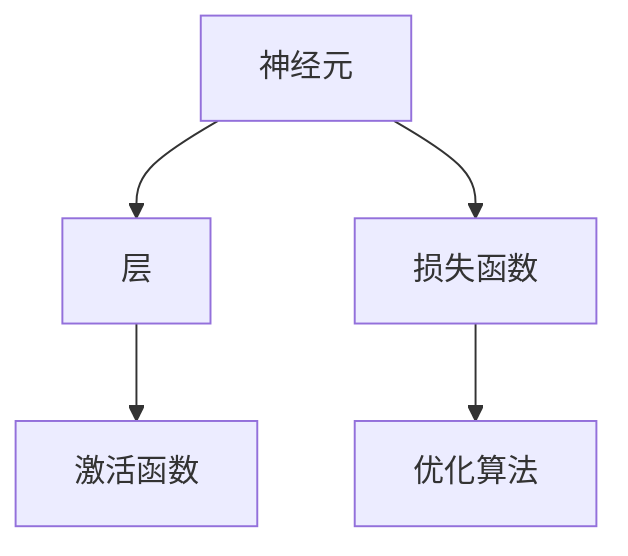

                 

# 神经网络：机器学习的新范式

## 1. 背景介绍

### 1.1 问题由来

随着人工智能技术的不断进步，机器学习（Machine Learning, ML）已成为当前最热门和最具影响力的技术之一。然而，传统的ML算法，如线性回归、决策树、支持向量机等，在处理复杂问题时往往表现有限。神经网络（Neural Networks, NNs）的引入，带来了全新的解决思路和突破性进展。

神经网络通过模拟人脑神经元的工作方式，构建了一个由大量人工神经元组成的复杂网络。在输入数据的作用下，网络会自动学习数据的特征表示，并输出预测结果。这一过程被称为前向传播和反向传播，其中前向传播计算网络的输出，反向传播则用于更新网络权重，最小化预测误差。

神经网络不仅在图像识别、语音识别、自然语言处理等诸多领域取得了突破性进展，还逐渐渗透到工业、医疗、金融等领域，成为驱动行业智能化升级的重要力量。然而，神经网络内部黑盒性质和训练过程中出现的过拟合等问题，也给实际应用带来了不少挑战。

### 1.2 问题核心关键点

神经网络的核心在于其强大的特征提取能力和自适应学习机制。具体来说，神经网络能够通过反向传播算法，自动调整权重，优化模型，实现对复杂数据的有效建模和预测。

神经网络的成功应用依赖于以下几个关键因素：
1. **数据预处理**：高质量的数据是神经网络训练的基础。数据需要经过清洗、归一化、特征工程等预处理步骤，以确保训练效果。
2. **模型结构设计**：神经网络的架构设计直接影响其性能和泛化能力。选择合适的层数、节点数、激活函数等，能够提升模型的训练效果。
3. **损失函数选择**：损失函数用于衡量模型预测与真实标签之间的差距。不同的任务和模型需要不同的损失函数，如交叉熵、均方误差等。
4. **优化算法选择**：优化算法用于最小化损失函数，调整模型参数。常见的优化算法包括SGD、Adam等，选择适当的算法对模型训练至关重要。
5. **正则化技术**：为了防止过拟合，神经网络常常使用正则化技术，如L2正则、Dropout等。

神经网络通过不断地调整权重，优化模型，在训练过程中逐步学习数据的特征表示，并输出预测结果。然而，这一过程复杂且耗时，需要大量计算资源和精细的参数调整。

### 1.3 问题研究意义

研究神经网络及其相关算法，对于推动机器学习技术的发展，解决实际问题具有重要意义：

1. **提升数据建模能力**：神经网络能够高效地处理复杂数据，通过特征提取和模型学习，提升数据建模能力，为更多应用场景提供技术支持。
2. **降低开发成本**：神经网络通过自动化的特征学习和模型调整，降低了人工干预的需求，简化了模型开发流程，降低了开发成本。
3. **促进技术创新**：神经网络的研究带动了深度学习、自然语言处理、计算机视觉等多个领域的创新，推动了整个科技界的进步。
4. **推动产业升级**：神经网络在医疗、金融、制造等众多领域的应用，加速了行业的智能化升级，提升了生产效率和经济效益。

神经网络在技术上的突破和应用上的成功，使其成为了当前AI领域的主流范式，为未来科技的发展奠定了坚实的基础。

## 2. 核心概念与联系

### 2.1 核心概念概述

神经网络的核心概念包括神经元、层、激活函数、损失函数、优化算法等。以下将对这些概念进行详细解释，并展示它们之间的联系。

- **神经元（Neuron）**：神经网络的基本组成单元，类似于人脑中的神经元。每个神经元接收输入信号，进行加权求和并经过激活函数处理后输出结果。
- **层（Layer）**：由多个神经元组成的网络层，用于实现数据的逐层抽象和特征提取。常见的层包括输入层、隐藏层、输出层等。
- **激活函数（Activation Function）**：用于非线性变换，引入非线性特征。常见的激活函数有Sigmoid、ReLU、Tanh等。
- **损失函数（Loss Function）**：衡量模型预测与真实标签之间的差距，用于优化模型参数。常见的损失函数包括交叉熵、均方误差等。
- **优化算法（Optimizer）**：用于最小化损失函数，更新模型参数。常见的优化算法包括SGD、Adam、Adagrad等。

这些概念通过前向传播和反向传播的方式紧密联系起来，共同构建了一个高效、灵活的神经网络模型。

### 2.2 核心概念原理和架构的 Mermaid 流程图

以下是使用Mermaid绘制的神经网络核心概念之间的联系图：



在上述图表中，神经元通过层进行抽象，并经过激活函数引入非线性特征。损失函数用于衡量模型预测与真实标签之间的差距，而优化算法用于更新模型参数，最小化损失函数。

### 2.3 核心概念之间的联系

神经网络的核心概念之间存在紧密的联系，通过这些概念的组合和协作，神经网络实现了对数据的有效建模和预测。

- **神经元和层**：神经元是神经网络的基本组成单元，通过层进行组合，形成复杂的神经网络模型。层实现了数据的逐层抽象和特征提取，使模型能够逐步深入数据的内在结构。
- **激活函数**：激活函数通过非线性变换，增强了模型的表达能力，使其能够适应更复杂的数据分布。
- **损失函数和优化算法**：损失函数用于衡量模型预测与真实标签之间的差距，优化算法则用于调整模型参数，最小化损失函数。这一过程通过反向传播算法实现，自动调整权重，优化模型。

这些概念共同构成了神经网络的核心架构，使其具备了强大的数据建模和预测能力。

## 3. 核心算法原理 & 具体操作步骤

### 3.1 算法原理概述

神经网络的训练过程包括前向传播和反向传播两个阶段。在前向传播阶段，模型接收输入数据，通过前向传播计算输出结果。在反向传播阶段，模型计算损失函数，通过反向传播更新权重，最小化预测误差。

神经网络的训练过程主要包括以下几个步骤：

1. **数据预处理**：对输入数据进行清洗、归一化、特征工程等预处理步骤，确保数据质量。
2. **模型初始化**：随机初始化神经网络的权重和偏置，为训练过程提供初始状态。
3. **前向传播**：将输入数据输入模型，通过层和激活函数计算输出结果。
4. **计算损失**：将模型输出结果与真实标签进行比较，计算损失函数值。
5. **反向传播**：通过反向传播算法计算梯度，更新模型权重和偏置。
6. **优化模型**：使用优化算法最小化损失函数，更新模型参数。
7. **评估模型**：在验证集和测试集上评估模型性能，调整超参数和模型结构。

这一过程通过不断迭代，逐步优化模型，提升其预测性能。

### 3.2 算法步骤详解

以下是对神经网络训练过程的详细步骤详解：

**Step 1: 数据预处理**

数据预处理是神经网络训练的基础。常见的预处理步骤包括：

1. 数据清洗：删除异常数据、缺失值等噪声，保证数据质量。
2. 数据归一化：对数据进行归一化处理，使其符合0-1或-1之间的标准分布，提升模型训练速度。
3. 特征工程：提取数据的特征表示，如文本数据的词嵌入、图像数据的卷积特征等，提升模型表达能力。

在实际应用中，数据预处理需要根据具体任务和数据特点进行设计和优化。

**Step 2: 模型初始化**

模型初始化是神经网络训练的第一步。常见的初始化方法包括：

1. 随机初始化：对模型权重和偏置进行随机初始化，保证模型具有良好的初始状态。
2. Xavier初始化：对权重进行缩放初始化，使其符合数据分布，提升模型训练效果。
3. He初始化：对权重进行缩放初始化，使其符合激活函数的输出分布，提升模型训练效果。

在实际应用中，模型初始化需要根据具体任务和数据特点进行选择和优化。

**Step 3: 前向传播**

前向传播是神经网络计算输出的过程。在输入数据的作用下，模型通过层和激活函数计算输出结果。

前向传播的具体步骤如下：

1. 将输入数据输入模型，通过输入层和隐藏层进行逐层处理，提取数据的特征表示。
2. 对每层神经元的加权和进行激活函数处理，得到输出结果。
3. 将隐藏层的输出结果作为下一层的输入，进行逐层计算，直到输出层得到最终的预测结果。

前向传播计算过程可以通过矩阵乘法和向量加法实现，具有高效的计算性能。

**Step 4: 计算损失**

计算损失是神经网络训练的关键步骤。常见的损失函数包括交叉熵、均方误差等。

损失函数的具体计算步骤如下：

1. 将模型输出结果与真实标签进行比较，计算预测误差。
2. 使用损失函数衡量预测误差，得到损失函数值。

在实际应用中，选择合适的损失函数对模型训练至关重要，不同的任务和模型需要不同的损失函数。

**Step 5: 反向传播**

反向传播是神经网络训练的核心步骤。通过反向传播，模型可以自动调整权重和偏置，优化模型参数。

反向传播的具体步骤如下：

1. 计算损失函数对输出结果的梯度，得到误差信号。
2. 通过链式法则，计算每一层神经元的梯度，得到误差信号的逐层传递。
3. 使用梯度下降等优化算法，更新模型权重和偏置，最小化损失函数。

反向传播算法通过反向传播误差信号，实现对权重和偏置的自动调整，提升模型训练效果。

**Step 6: 优化模型**

优化模型是神经网络训练的最终步骤。通过优化算法，最小化损失函数，提升模型性能。

优化模型的具体步骤如下：

1. 使用优化算法如SGD、Adam等，更新模型权重和偏置，最小化损失函数。
2. 根据模型性能，调整学习率和迭代次数等超参数，优化模型训练效果。
3. 在验证集和测试集上评估模型性能，调整模型结构和超参数，提升模型泛化能力。

优化模型需要根据具体任务和数据特点进行设计和优化，以实现最优的训练效果。

### 3.3 算法优缺点

神经网络在机器学习领域具有强大的数据建模和预测能力，但也存在一些局限性：

**优点：**

1. **强大的特征提取能力**：神经网络能够自动学习数据的特征表示，无需手动设计特征工程，提升模型训练效果。
2. **灵活的模型架构**：神经网络的层数和节点数可灵活调整，适应不同的任务需求。
3. **高效的计算性能**：前向传播和反向传播计算过程具有高效的计算性能，适用于大规模数据处理。
4. **广泛的适用性**：神经网络在图像识别、语音识别、自然语言处理等多个领域取得了突破性进展，具有广泛的应用前景。

**缺点：**

1. **黑盒性质**：神经网络的内部工作机制不透明，难以理解和解释模型的决策过程。
2. **过拟合风险**：神经网络在训练过程中容易出现过拟合问题，需要大量的标注数据和正则化技术进行缓解。
3. **计算资源消耗大**：神经网络的训练和推理需要大量的计算资源和存储空间，对硬件要求较高。
4. **模型复杂度**：神经网络的模型复杂度较高，设计和调整过程复杂，需要大量的时间和经验。

尽管存在这些局限性，但神经网络以其强大的数据建模能力和广泛的适用性，成为了机器学习领域的主流范式，为未来科技的发展提供了重要的技术支撑。

### 3.4 算法应用领域

神经网络在诸多领域取得了广泛应用，以下是一些主要的应用领域：

1. **计算机视觉**：神经网络在图像识别、物体检测、图像分割等领域取得了突破性进展。常见的应用包括人脸识别、物体识别、图像分类等。
2. **自然语言处理**：神经网络在自然语言处理领域的应用包括机器翻译、文本分类、情感分析等。通过文本编码和序列建模，神经网络实现了对自然语言的有效建模和预测。
3. **语音识别**：神经网络在语音识别领域的应用包括语音转文本、情感识别等。通过声学建模和语言建模，神经网络实现了对语音信号的有效建模和预测。
4. **推荐系统**：神经网络在推荐系统中的应用包括用户推荐、商品推荐等。通过用户行为和物品属性的建模，神经网络实现了对用户需求的有效预测和推荐。
5. **医疗诊断**：神经网络在医疗诊断领域的应用包括疾病诊断、基因分析等。通过医疗影像和基因数据的建模，神经网络实现了对疾病和基因表达的有效预测和分析。

随着神经网络技术的不断进步，其应用范围将进一步拓展，为更多领域带来智能化的解决方案。

## 4. 数学模型和公式 & 详细讲解 & 举例说明

### 4.1 数学模型构建

神经网络的核心数学模型包括前向传播和反向传播两个过程。以下是神经网络的数学模型构建和推导过程。

**前向传播**：

设神经网络模型由 $N$ 层组成，每层有 $n_i$ 个神经元，则前向传播的数学模型如下：

$$
\begin{aligned}
&h_1 = \sigma(W_1 x + b_1) \\
&h_2 = \sigma(W_2 h_1 + b_2) \\
&\vdots \\
&h_N = \sigma(W_N h_{N-1} + b_N)
\end{aligned}
$$

其中，$x$ 为输入数据，$W_i$ 和 $b_i$ 分别为第 $i$ 层的权重和偏置，$\sigma$ 为激活函数。

**反向传播**：

设损失函数为 $L(y,\hat{y})$，其中 $y$ 为真实标签，$\hat{y}$ 为模型预测结果。则反向传播的数学模型如下：

$$
\begin{aligned}
&\frac{\partial L}{\partial \hat{y}} = \frac{\partial L}{\partial z} \frac{\partial z}{\partial h_N} \frac{\partial h_N}{\partial z} \\
&\frac{\partial L}{\partial z} = \frac{\partial L}{\partial h_N} \frac{\partial h_N}{\partial z} \\
&\vdots \\
&\frac{\partial L}{\partial z_1} = \frac{\partial L}{\partial h_2} \frac{\partial h_2}{\partial z_1}
\end{aligned}
$$

其中，$\frac{\partial L}{\partial z_i}$ 为误差信号，$\frac{\partial z}{\partial h_i}$ 为激活函数的导数，$\frac{\partial h_i}{\partial z_{i-1}}$ 为权重矩阵的导数。

通过反向传播，神经网络可以自动调整权重和偏置，最小化预测误差，提升模型性能。

### 4.2 公式推导过程

以下是神经网络前向传播和反向传播的公式推导过程：

**前向传播**：

设神经网络模型由 $N$ 层组成，每层有 $n_i$ 个神经元，则前向传播的数学模型如下：

$$
\begin{aligned}
&h_1 = \sigma(W_1 x + b_1) \\
&h_2 = \sigma(W_2 h_1 + b_2) \\
&\vdots \\
&h_N = \sigma(W_N h_{N-1} + b_N)
\end{aligned}
$$

其中，$x$ 为输入数据，$W_i$ 和 $b_i$ 分别为第 $i$ 层的权重和偏置，$\sigma$ 为激活函数。

**反向传播**：

设损失函数为 $L(y,\hat{y})$，其中 $y$ 为真实标签，$\hat{y}$ 为模型预测结果。则反向传播的数学模型如下：

$$
\begin{aligned}
&\frac{\partial L}{\partial \hat{y}} = \frac{\partial L}{\partial z} \frac{\partial z}{\partial h_N} \frac{\partial h_N}{\partial z} \\
&\frac{\partial L}{\partial z} = \frac{\partial L}{\partial h_N} \frac{\partial h_N}{\partial z} \\
&\vdots \\
&\frac{\partial L}{\partial z_1} = \frac{\partial L}{\partial h_2} \frac{\partial h_2}{\partial z_1}
\end{aligned}
$$

其中，$\frac{\partial L}{\partial z_i}$ 为误差信号，$\frac{\partial z}{\partial h_i}$ 为激活函数的导数，$\frac{\partial h_i}{\partial z_{i-1}}$ 为权重矩阵的导数。

通过反向传播，神经网络可以自动调整权重和偏置，最小化预测误差，提升模型性能。

### 4.3 案例分析与讲解

以图像识别任务为例，分析神经网络的前向传播和反向传播过程：

**前向传播**：

设神经网络模型由 $N$ 层组成，每层有 $n_i$ 个神经元，则前向传播的数学模型如下：

$$
\begin{aligned}
&h_1 = \sigma(W_1 x + b_1) \\
&h_2 = \sigma(W_2 h_1 + b_2) \\
&\vdots \\
&h_N = \sigma(W_N h_{N-1} + b_N)
\end{aligned}
$$

其中，$x$ 为输入图像数据，$W_i$ 和 $b_i$ 分别为第 $i$ 层的权重和偏置，$\sigma$ 为激活函数。

**反向传播**：

设损失函数为 $L(y,\hat{y})$，其中 $y$ 为真实标签，$\hat{y}$ 为模型预测结果。则反向传播的数学模型如下：

$$
\begin{aligned}
&\frac{\partial L}{\partial \hat{y}} = \frac{\partial L}{\partial z} \frac{\partial z}{\partial h_N} \frac{\partial h_N}{\partial z} \\
&\frac{\partial L}{\partial z} = \frac{\partial L}{\partial h_N} \frac{\partial h_N}{\partial z} \\
&\vdots \\
&\frac{\partial L}{\partial z_1} = \frac{\partial L}{\partial h_2} \frac{\partial h_2}{\partial z_1}
\end{aligned}
$$

其中，$\frac{\partial L}{\partial z_i}$ 为误差信号，$\frac{\partial z}{\partial h_i}$ 为激活函数的导数，$\frac{\partial h_i}{\partial z_{i-1}}$ 为权重矩阵的导数。

通过反向传播，神经网络可以自动调整权重和偏置，最小化预测误差，提升模型性能。

## 5. 项目实践：代码实例和详细解释说明

### 5.1 开发环境搭建

在进行神经网络开发前，我们需要准备好开发环境。以下是使用Python进行TensorFlow开发的环境配置流程：

1. 安装Anaconda：从官网下载并安装Anaconda，用于创建独立的Python环境。

2. 创建并激活虚拟环境：
```bash
conda create -n tf-env python=3.8 
conda activate tf-env
```

3. 安装TensorFlow：根据CUDA版本，从官网获取对应的安装命令。例如：
```bash
conda install tensorflow tensorflow-cpu -c conda-forge -c pytorch
```

4. 安装必要的工具包：
```bash
pip install numpy pandas scikit-learn matplotlib tensorflow-datasets tensorflow-hub
```

完成上述步骤后，即可在`tf-env`环境中开始神经网络开发。

### 5.2 源代码详细实现

这里我们以手写数字识别任务为例，给出使用TensorFlow进行神经网络训练的代码实现。

首先，定义数据处理函数：

```python
import tensorflow as tf
from tensorflow.keras.datasets import mnist
from tensorflow.keras.utils import to_categorical

(train_images, train_labels), (test_images, test_labels) = mnist.load_data()

def data_preprocess(x):
    x = x.reshape(-1, 28 * 28) / 255.0
    return x

train_images = data_preprocess(train_images)
test_images = data_preprocess(test_images)
train_labels = to_categorical(train_labels)
test_labels = to_categorical(test_labels)

batch_size = 32
```

然后，定义神经网络模型：

```python
model = tf.keras.models.Sequential([
    tf.keras.layers.Flatten(input_shape=(28, 28)),
    tf.keras.layers.Dense(128, activation='relu'),
    tf.keras.layers.Dense(10, activation='softmax')
])
```

接着，定义优化器：

```python
optimizer = tf.keras.optimizers.Adam(learning_rate=0.001)
```

然后，定义损失函数：

```python
loss_fn = tf.keras.losses.CategoricalCrossentropy(from_logits=True)
```

最后，进行模型训练：

```python
model.compile(optimizer=optimizer, loss=loss_fn, metrics=['accuracy'])

epochs = 10
history = model.fit(train_images, train_labels, batch_size=batch_size, epochs=epochs, validation_data=(test_images, test_labels))
```

以上就是使用TensorFlow对手写数字识别任务进行神经网络训练的完整代码实现。可以看到，TensorFlow提供了丰富的API和工具，使得神经网络模型的构建和训练变得简单高效。

### 5.3 代码解读与分析

让我们再详细解读一下关键代码的实现细节：

**数据预处理**：
- `mnist.load_data()`：加载手写数字识别数据集，包含训练集和测试集。
- `data_preprocess()`：对图像数据进行预处理，包括归一化和扁平化。
- `to_categorical()`：将标签数据进行独热编码。

**神经网络模型**：
- `Sequential()`：定义顺序模型，方便按顺序添加各层。
- `Flatten()`：将输入数据扁平化，适配全连接层。
- `Dense()`：定义全连接层，其中第一个层有128个神经元，使用ReLU激活函数。
- `Dense()`：定义输出层，有10个神经元，使用softmax激活函数。

**优化器**：
- `Adam()`：定义Adam优化器，学习率为0.001。

**损失函数**：
- `CategoricalCrossentropy()`：定义交叉熵损失函数，用于多分类问题。

**模型训练**：
- `compile()`：编译模型，指定优化器、损失函数和评估指标。
- `fit()`：训练模型，指定训练集、验证集、批次大小和迭代次数。

在实际应用中，还需要根据具体任务和数据特点进行优化调整，如超参数调优、正则化技术、数据增强等，以提升模型性能。

## 6. 实际应用场景

### 6.1 图像识别

神经网络在图像识别领域的应用广泛而深入。基于神经网络的图像识别模型，能够高效地提取图像特征，并进行准确的分类和识别。

在实践中，可以将图像数据输入神经网络模型，通过前向传播计算输出结果。然后，使用损失函数计算预测误差，通过反向传播更新权重和偏置，最小化预测误差。经过多次迭代，神经网络模型能够逐步提升对图像特征的提取能力和分类准确率。

### 6.2 自然语言处理

神经网络在自然语言处理领域的应用包括机器翻译、文本分类、情感分析等。通过文本编码和序列建模，神经网络实现了对自然语言的有效建模和预测。

在实践中，可以将文本数据输入神经网络模型，通过前向传播计算输出结果。然后，使用损失函数计算预测误差，通过反向传播更新权重和偏置，最小化预测误差。经过多次迭代，神经网络模型能够逐步提升对文本特征的提取能力和预测准确率。

### 6.3 语音识别

神经网络在语音识别领域的应用包括语音转文本、情感识别等。通过声学建模和语言建模，神经网络实现了对语音信号的有效建模和预测。

在实践中，可以将语音信号输入神经网络模型，通过前向传播计算输出结果。然后，使用损失函数计算预测误差，通过反向传播更新权重和偏置，最小化预测误差。经过多次迭代，神经网络模型能够逐步提升对语音信号的提取能力和识别准确率。

### 6.4 未来应用展望

随着神经网络技术的不断进步，其应用范围将进一步拓展，为更多领域带来智能化的解决方案。

在智慧医疗领域，神经网络能够实现疾病诊断、基因分析等应用，辅助医生进行精准诊疗，提升医疗服务质量。

在智能交通领域，神经网络能够实现交通流量预测、自动驾驶等应用，提高交通系统的运行效率和安全性。

在金融领域，神经网络能够实现信用评估、风险管理等应用，提升金融服务水平，降低金融风险。

在教育领域，神经网络能够实现智能推荐、自动批改等应用，提高教学质量和效率。

神经网络在更多领域的广泛应用，将推动人工智能技术的深入发展，为人类社会的智能化升级提供强大的技术支撑。

## 7. 工具和资源推荐

### 7.1 学习资源推荐

为了帮助开发者系统掌握神经网络的理论基础和实践技巧，这里推荐一些优质的学习资源：

1. 《深度学习》课程：斯坦福大学开设的深度学习课程，系统讲解了深度学习的基本概念和算法，适合入门学习。

2. 《神经网络与深度学习》书籍：深度学习领域的经典教材，详细介绍了神经网络和深度学习的基本原理和算法。

3. TensorFlow官方文档：TensorFlow的官方文档，提供了丰富的API和工具，是学习神经网络开发的必备资料。

4. PyTorch官方文档：PyTorch的官方文档，提供了丰富的API和工具，是学习神经网络开发的另一重要资源。

5. GitHub上的开源项目：GitHub上众多高质量的开源项目，提供了丰富的实践经验和代码示例，适合学习和参考。

通过对这些资源的学习实践，相信你一定能够快速掌握神经网络的理论基础和实践技巧，并用于解决实际的AI问题。

### 7.2 开发工具推荐

高效的开发离不开优秀的工具支持。以下是几款用于神经网络开发常用的工具：

1. TensorFlow：由Google主导开发的深度学习框架，功能强大，支持分布式计算，适用于大规模工程应用。

2. PyTorch：由Facebook主导开发的深度学习框架，灵活高效，适用于研究和原型开发。

3. Keras：高层次的深度学习框架，简单易用，提供了丰富的预训练模型和工具，适合快速原型开发。

4. Jupyter Notebook：基于Web的交互式编程环境，方便开发和调试，支持可视化展示。

5. TensorBoard：TensorFlow配套的可视化工具，实时监测模型训练状态，提供丰富的图表呈现方式。

6. Weights & Biases：模型训练的实验跟踪工具，可以记录和可视化模型训练过程中的各项指标，方便对比和调优。

合理利用这些工具，可以显著提升神经网络开发和训练的效率，加速创新迭代的步伐。

### 7.3 相关论文推荐

神经网络技术的发展离不开学界的持续研究。以下是几篇奠基性的相关论文，推荐阅读：

1. Deep Learning（深度学习）：Hinton等人在2012年提出的深度学习理论，奠定了神经网络在AI领域的基础。

2. ImageNet Classification with Deep Convolutional Neural Networks（卷积神经网络与ImageNet图像分类）：AlexNet在2012年ImageNet竞赛中取得了突破性进展，标志着卷积神经网络的崛起。

3. Long Short-Term Memory（长短期记忆网络）：Hochreiter和Schmidhuber在1997年提出的长短期记忆网络，提升了神经网络在时间序列数据上的建模能力。

4. Attention is All You Need（注意力机制）：Vaswani等人在2017年提出的注意力机制，使神经网络在自然语言处理等领域取得了突破性进展。

5. Generative Adversarial Networks（生成对抗网络）：Goodfellow等人在2014年提出的生成对抗网络，使神经网络在生成式模型和图像生成等方面取得了重要突破。

这些论文代表了大神经网络技术的发展脉络。通过学习这些前沿成果，可以帮助研究者把握学科前进方向，激发更多的创新灵感。

## 8. 总结：未来发展趋势与挑战

### 8.1 研究成果总结

神经网络技术的迅猛发展，推动了深度学习、计算机视觉、自然语言处理等多个领域的创新，为未来科技的发展奠定了坚实的基础。以下是一些关键的研究成果：

1. 深度神经网络模型在图像识别、语音识别、自然语言处理等领域取得了突破性进展，提升了各领域的自动化和智能化水平。

2. 长短期记忆网络和注意力机制等新架构，提升了神经网络在时间序列数据和自然语言处理等任务上的建模能力。

3. 生成对抗网络和自监督学习等新方法，提升了神经网络在生成式建模和预训练上的效果。

4. 神经网络在医疗、金融、教育等垂直领域的应用，推动了行业的智能化升级，提升了效率和质量。

### 8.2 未来发展趋势

展望未来，神经网络技术将呈现以下几个发展趋势：

1. **更高效的模型架构**：随着硬件性能的提升和算法优化的深入，未来的神经网络模型将更加高效、灵活，具有更强的表达能力和泛化能力。

2. **更强的自适应学习能力**：未来的神经网络将具备更强的自适应学习能力，能够更加灵活地应对不同领域和任务的需求。

3. **更广泛的应用场景**：神经网络将进一步拓展到医疗、交通、金融、教育等更多领域，为各行各业带来智能化解决方案。

4. **更强大的解释能力**：未来的神经网络将具备更强的可解释能力，能够提供更加透明、可信的决策过程，提升应用的可信度和可控性。

5. **更智能的协同系统**：未来的神经网络将与自然语言处理、计算机视觉、知识图谱等技术进行更深入的融合，构建更加智能的协同系统。

### 8.3 面临的挑战

尽管神经网络技术取得了显著成就，但在迈向更加智能化、普适化应用的过程中，仍面临一些挑战：

1. **计算资源消耗大**：神经网络的训练和推理需要大量的计算资源和存储空间，对硬件要求较高。

2. **数据依赖性强**：神经网络模型依赖大量的标注数据进行训练，标注成本高，数据获取困难。

3. **过拟合风险**：神经网络在训练过程中容易出现过拟合问题，需要大量的标注数据和正则化技术进行缓解。

4. **模型复杂度高**：神经网络的模型复杂度较高，设计和调整过程复杂，需要大量的时间和经验。

5. **解释性不足**：神经网络模型通常缺乏可解释性，难以理解和解释模型的决策过程。

尽管存在这些挑战，但通过不断优化模型架构、改进训练方法、加强数据标注等措施，神经网络技术仍有望克服这些瓶颈，进一步推动AI技术的深入发展。

### 8.4 研究展望

未来的神经网络技术研究将聚焦于以下几个方向：

1. **参数高效的神经网络**：开发更加参数高效的神经网络，提升模型训练和推理的效率，降低计算资源消耗。

2. **可解释的神经网络**：研究可解释的神经网络，提升模型的透明度和可信度，满足高风险应用的需求。

3. **多模态神经网络**：研究多模态神经网络，将视觉、语音、文本等多种模态信息进行融合，提升模型的表达能力和泛化能力。

4. **因果推断神经网络**：研究因果推断神经网络，提升模型对因果关系的建模能力，解决因果推断和对抗攻击等问题。

5. **协同优化神经网络**：研究协同优化神经网络，与自然语言处理、知识图谱等技术进行更深入的融合，构建更加智能的协同系统。

通过在这些方向上的持续探索和研究，神经网络技术有望在未来的智能化应用中发挥更大的作用，推动人工智能技术向更高的台阶迈进。

## 9. 附录：常见问题与解答

**Q1：什么是神经网络？**

A: 神经网络是一种模拟人脑神经元工作方式的计算模型，由大量神经元组成，通过前向传播和反向传播进行训练和预测。

**Q2：神经网络的训练过程包括哪些步骤？**

A: 神经网络的训练过程包括数据预处理、模型初始化、前向传播、计算损失、反向传播、优化模型等步骤。

**Q3：如何选择神经网络的结构？**

A: 选择神经网络的结构需要根据具体任务和数据特点进行设计。一般建议从简单到复杂逐步增加层数和节点数，并使用正则化技术防止过拟合。

**Q4：如何防止神经网络的过拟合？**

A: 防止神经网络的过拟合需要选择合适的损失函数、正则化技术、数据增强等方法。常见的正则化技术包括L2正则、Dropout、Early Stopping等。

**Q5：如何提升神经网络的泛化能力？**

A: 提升神经网络的泛化能力需要选择合适的优化算法、超参数调优、数据增强等方法。常见的优化算法包括SGD、Adam等，超参数调优需要结合交叉验证等技术进行优化。

通过以上问题的解答，相信你能够更好地理解神经网络的基本概念和训练过程，为神经网络的应用实践提供指导。

---

作者：禅与计算机程序设计艺术 / Zen and the Art of Computer Programming

