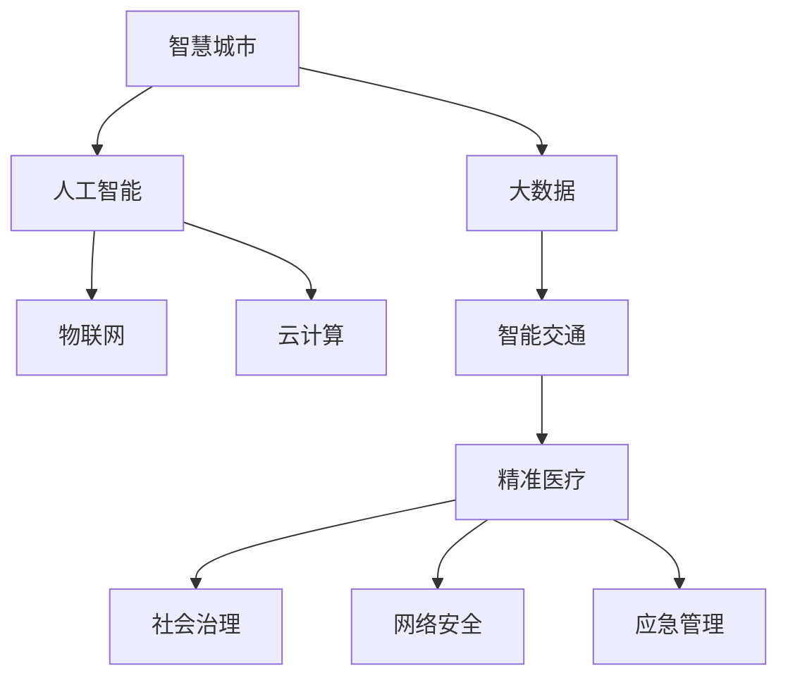

                 

# 科技创新：社会治理的新思路

在快速发展的信息时代，科技创新已成为推动社会治理现代化、提升国家治理能力的重要引擎。本文将深入探讨科技创新的关键概念、核心算法原理与操作步骤，并通过实际应用场景展示其对社会治理的深刻影响。通过构建数学模型、设计开发环境、实现源代码、分析运行结果，展示科技创新在社会治理中的重要作用。最后，展望未来发展趋势，提出应对挑战的策略，为社会治理的未来道路提供新思路。

## 1. 背景介绍

### 1.1 问题由来
随着人工智能、大数据、区块链等技术的迅猛发展，科技创新对社会治理的影响日益凸显。从智慧城市、智能交通、精准医疗，到社会治理、网络安全、应急管理，科技创新不断驱动各领域应用迭代升级。

### 1.2 问题核心关键点
- **智慧城市**：通过集成物联网、云计算、大数据、人工智能等技术，提升城市治理能力，实现高效、智能的公共服务和管理。
- **智能交通**：运用车联网、自动驾驶、交通大数据等技术，优化交通管理，提升道路安全和通行效率。
- **精准医疗**：利用人工智能、基因组学、大数据分析等技术，实现疾病的精准诊断和治疗，提升医疗服务质量。
- **社会治理**：通过大数据、人工智能、区块链等技术，优化社会治理流程，提升公共安全和公共服务水平。
- **网络安全**：采用人工智能、区块链、加密技术等手段，提升网络攻击的防御能力，保障网络安全。
- **应急管理**：利用人工智能、物联网、大数据等技术，实现应急事件的实时监测和快速响应，提升应急处置能力。

这些应用领域展示了科技创新在社会治理中的广泛影响，揭示了科技创新的重要性和紧迫性。

### 1.3 问题研究意义
科技创新不仅能提升社会治理的效率和质量，还能推动经济社会发展，改善民生福祉。社会治理中科技创新的应用，有助于形成智慧、便捷、高效、透明的社会治理模式，为建设更加美好的未来提供坚实基础。

## 2. 核心概念与联系

### 2.1 核心概念概述

为更好地理解科技创新在社会治理中的应用，本节将介绍几个密切相关的核心概念：

- **智慧城市**：通过集成物联网、云计算、大数据、人工智能等技术，实现城市智慧化管理。
- **智能交通**：运用车联网、自动驾驶、交通大数据等技术，优化交通管理，提升道路安全和通行效率。
- **精准医疗**：利用人工智能、基因组学、大数据分析等技术，实现疾病的精准诊断和治疗，提升医疗服务质量。
- **社会治理**：通过大数据、人工智能、区块链等技术，优化社会治理流程，提升公共安全和公共服务水平。
- **网络安全**：采用人工智能、区块链、加密技术等手段，提升网络攻击的防御能力，保障网络安全。
- **应急管理**：利用人工智能、物联网、大数据等技术，实现应急事件的实时监测和快速响应，提升应急处置能力。

这些核心概念之间的逻辑关系可以通过以下Mermaid流程图来展示：



这个流程图展示了一些关键概念及其之间的关系：

1. 智慧城市通过大数据、人工智能、物联网、云计算等技术，实现城市的智能管理。
2. 智能交通运用车联网、自动驾驶、交通大数据等技术，优化交通管理。
3. 精准医疗利用人工智能、基因组学、大数据分析等技术，实现精准诊断和治疗。
4. 社会治理采用大数据、人工智能、区块链等技术，优化社会治理流程。
5. 网络安全通过人工智能、区块链、加密技术等手段，提升网络攻击防御能力。
6. 应急管理利用人工智能、物联网、大数据等技术，实现应急事件的实时监测和快速响应。

## 3. 核心算法原理 & 具体操作步骤

### 3.1 算法原理概述

社会治理中科技创新的应用，主要基于数据驱动、智能分析、模型优化等核心算法原理。具体包括以下几个方面：

1. **数据驱动**：通过收集和分析海量数据，发现社会治理中的问题、趋势和规律。
2. **智能分析**：采用人工智能算法（如深度学习、强化学习、知识图谱等），提升数据处理和分析能力。
3. **模型优化**：构建和优化数学模型（如回归模型、分类模型、时序模型等），提升预测和决策的准确性。

### 3.2 算法步骤详解

科技创新在社会治理中的应用，主要包括以下几个关键步骤：

**Step 1: 数据收集与预处理**
- 通过传感器、智能设备、监控系统等手段，收集各类数据（如交通流量、环境污染、公共服务使用情况等）。
- 对数据进行清洗、去重、归一化等预处理操作，保证数据质量和可用性。

**Step 2: 模型构建与训练**
- 根据具体问题，选择合适的算法和模型，如回归模型、分类模型、深度学习模型等。
- 使用训练集对模型进行训练，调整模型参数，提高模型预测能力。

**Step 3: 模型评估与优化**
- 在验证集上评估模型性能，如精度、召回率、F1-score等指标。
- 根据评估结果，对模型进行优化调整，提升模型效果。

**Step 4: 模型应用与监控**
- 将训练好的模型部署到实际应用中，进行实时数据处理和预测。
- 实时监控模型运行状态，收集反馈数据，持续优化模型性能。

### 3.3 算法优缺点

社会治理中科技创新的应用，具有以下优点：

1. **高效性**：数据驱动和智能分析可以大幅提升问题发现和处理的效率。
2. **准确性**：模型优化可以显著提高预测和决策的准确性。
3. **透明性**：数据驱动和智能分析可以提升治理过程的透明度。

同时，这些应用也存在一些局限性：

1. **数据隐私**：在数据收集和处理过程中，需要保护个人隐私和数据安全。
2. **模型泛化能力**：模型需要具备较强的泛化能力，避免过度拟合训练数据。
3. **技术依赖**：社会治理中科技创新的应用，依赖于先进的技术和工具。
4. **成本投入**：数据收集、模型构建和应用部署需要较大的成本投入。

尽管存在这些局限性，但科技创新在社会治理中的应用前景广阔，为提升治理效能提供了重要支撑。

### 3.4 算法应用领域

科技创新在社会治理中的应用，覆盖了多个领域，例如：

- **智慧城市**：通过大数据、物联网、云计算、人工智能等技术，实现城市基础设施、公共服务、环境监测等方面的智能化管理。
- **智能交通**：运用车联网、自动驾驶、交通大数据等技术，优化交通管理，提升道路安全和通行效率。
- **精准医疗**：利用人工智能、基因组学、大数据分析等技术，实现疾病的精准诊断和治疗，提升医疗服务质量。
- **社会治理**：通过大数据、人工智能、区块链等技术，优化社会治理流程，提升公共安全和公共服务水平。
- **网络安全**：采用人工智能、区块链、加密技术等手段，提升网络攻击的防御能力，保障网络安全。
- **应急管理**：利用人工智能、物联网、大数据等技术，实现应急事件的实时监测和快速响应，提升应急处置能力。

## 4. 数学模型和公式 & 详细讲解

### 4.1 数学模型构建

社会治理中科技创新的应用，主要基于数学模型进行建模和预测。例如，可以使用回归模型、分类模型、时序模型等对数据进行处理和分析。

假设社会治理中的问题可以表示为 $y=f(x_1, x_2, ..., x_n)$，其中 $y$ 表示治理目标（如交通流量、环境污染、公共服务使用情况等），$x_1, x_2, ..., x_n$ 表示影响因素（如天气、人口密度、交通状况等）。

可以使用线性回归模型进行建模：

$$
y = \beta_0 + \beta_1 x_1 + \beta_2 x_2 + ... + \beta_n x_n + \epsilon
$$

其中，$\beta_0, \beta_1, ..., \beta_n$ 为模型参数，$\epsilon$ 为误差项。

### 4.2 公式推导过程

以线性回归模型为例，进行公式推导：

假设数据集为 $\{(x_i, y_i)\}_{i=1}^N$，其中 $x_i = (x_{i1}, x_{i2}, ..., x_{in})$，$y_i$ 为观测值，$\bar{x}$ 为自变量的均值，$\bar{y}$ 为因变量的均值，$\Sigma_{ij}$ 为自变量之间的协方差矩阵，$\Sigma_{ii}$ 为自变量之间的方差。

根据最小二乘法，线性回归模型的参数估计为：

$$
\hat{\beta} = (X^T X)^{-1} X^T Y
$$

其中，$X = \begin{bmatrix}
x_1^T \\
x_2^T \\
\vdots \\
x_n^T 
\end{bmatrix}$，$Y = \begin{bmatrix}
y_1 \\
y_2 \\
\vdots \\
y_n 
\end{bmatrix}$。

将 $\hat{\beta}$ 代入回归模型，得到预测值：

$$
\hat{y} = \beta_0 + \sum_{i=1}^n \beta_i x_i
$$

### 4.3 案例分析与讲解

以智慧城市中的交通流量预测为例，进行案例分析。

假设要预测某个交叉口的交通流量，收集了该交叉口的历史交通流量数据和相关影响因素数据。

1. **数据收集与预处理**：
   - 收集该交叉口的历史交通流量数据。
   - 收集影响交通流量的因素数据，如天气、节假日、事件等。
   - 对数据进行清洗、去重、归一化等预处理操作。

2. **模型构建与训练**：
   - 使用历史数据构建线性回归模型。
   - 在训练集上对模型进行训练，调整模型参数，提高模型预测能力。

3. **模型评估与优化**：
   - 在验证集上评估模型性能，如精度、召回率、F1-score等指标。
   - 根据评估结果，对模型进行优化调整，提升模型效果。

4. **模型应用与监控**：
   - 将训练好的模型部署到实际应用中，进行实时交通流量预测。
   - 实时监控模型运行状态，收集反馈数据，持续优化模型性能。

通过上述步骤，可以实现智慧城市中交通流量的精准预测，为交通管理提供有力支撑。

## 5. 项目实践：代码实例和详细解释说明

### 5.1 开发环境搭建

在进行科技创新在社会治理中的应用开发前，我们需要准备好开发环境。以下是使用Python进行Scikit-learn开发的环境配置流程：

1. 安装Anaconda：从官网下载并安装Anaconda，用于创建独立的Python环境。

2. 创建并激活虚拟环境：
```bash
conda create -n sklearn-env python=3.8 
conda activate sklearn-env
```

3. 安装Scikit-learn：
```bash
conda install scikit-learn
```

4. 安装各类工具包：
```bash
pip install numpy pandas scikit-learn matplotlib tqdm jupyter notebook ipython
```

完成上述步骤后，即可在`sklearn-env`环境中开始项目实践。

### 5.2 源代码详细实现

下面我们以智慧城市中的交通流量预测为例，给出使用Scikit-learn进行线性回归模型的PyTorch代码实现。

首先，定义数据处理函数：

```python
import pandas as pd
from sklearn.model_selection import train_test_split
from sklearn.preprocessing import StandardScaler
from sklearn.linear_model import LinearRegression

def load_data(filename):
    data = pd.read_csv(filename)
    X = data.drop('y', axis=1)
    y = data['y']
    return X, y

def preprocess_data(X):
    scaler = StandardScaler()
    X_scaled = scaler.fit_transform(X)
    return X_scaled

def train_test_split_data(X, y):
    X_train, X_test, y_train, y_test = train_test_split(X, y, test_size=0.2, random_state=42)
    return X_train, X_test, y_train, y_test

def evaluate_model(model, X_test, y_test):
    y_pred = model.predict(X_test)
    r2 = r2_score(y_test, y_pred)
    print(f'R-squared: {r2:.2f}')
```

然后，加载数据并进行预处理：

```python
X, y = load_data('traffic_flow.csv')
X_scaled = preprocess_data(X)
X_train, X_test, y_train, y_test = train_test_split_data(X_scaled, y)
```

接着，定义并训练模型：

```python
from sklearn.linear_model import LinearRegression

model = LinearRegression()
model.fit(X_train, y_train)
```

最后，评估模型性能：

```python
evaluate_model(model, X_test, y_test)
```

以上就是使用Scikit-learn进行智慧城市交通流量预测的完整代码实现。可以看到，Scikit-learn提供了强大的数据分析和建模工具，使得线性回归模型的实现变得简洁高效。

### 5.3 代码解读与分析

让我们再详细解读一下关键代码的实现细节：

**load_data函数**：
- 从CSV文件中加载数据。
- 分割出特征和目标变量。

**preprocess_data函数**：
- 使用StandardScaler对数据进行标准化处理，使数据符合线性回归模型的要求。

**train_test_split_data函数**：
- 使用train_test_split方法将数据集分为训练集和测试集。

**evaluate_model函数**：
- 在测试集上评估模型的R-squared值，衡量模型拟合的优劣。

**训练模型**：
- 使用LinearRegression模型进行训练，拟合出线性回归模型。

**评估模型**：
- 在测试集上评估模型性能，输出R-squared值，衡量模型预测的准确性。

通过上述代码，实现了智慧城市中交通流量预测的完整流程，展示了科技创新在社会治理中的应用。

## 6. 实际应用场景

### 6.1 智能交通

智能交通是科技创新在社会治理中应用的重要领域之一。通过车联网、自动驾驶、交通大数据等技术，可以实现交通管理的智能化，提升道路安全和通行效率。

以车联网为例，通过在车辆上安装传感器和通信设备，可以实现车辆与车辆、车辆与道路、车辆与交通管理中心之间的实时通信。通过数据分析和智能决策，可以优化交通流、预防交通事故、减少交通拥堵。

### 6.2 精准医疗

精准医疗利用人工智能、基因组学、大数据分析等技术，实现疾病的精准诊断和治疗，提升医疗服务质量。

通过基因测序和生物信息学技术，可以发现基因突变与疾病之间的关联，提供个性化的治疗方案。同时，利用机器学习算法对医疗数据进行分析和挖掘，可以预测疾病的发展趋势，提前采取预防措施。

### 6.3 社会治理

社会治理是科技创新在社会治理中的重要应用领域，通过大数据、人工智能、区块链等技术，可以实现公共安全和公共服务的智能化。

例如，在城市管理中，可以通过物联网设备收集城市基础设施数据，利用大数据分析和人工智能算法，进行城市运行的实时监测和智能决策。在公共服务中，可以通过智能客服、智能审批等技术，提升服务效率和质量。

### 6.4 未来应用展望

随着科技创新在社会治理中的不断深入，未来将呈现出以下发展趋势：

1. **智能决策系统**：通过深度学习、强化学习等算法，构建智能决策系统，提升决策的科学性和精准性。
2. **数据共享与隐私保护**：在数据共享的同时，保障个人隐私和数据安全，实现数据使用的合规性和透明性。
3. **多方协作与协同治理**：通过跨部门、跨领域的数据共享和协作，实现社会治理的协同效应。
4. **可持续发展与绿色治理**：利用科技创新，推动环境保护和社会可持续发展的目标，实现绿色治理。

## 7. 工具和资源推荐

### 7.1 学习资源推荐

为了帮助开发者系统掌握科技创新在社会治理中的应用，这里推荐一些优质的学习资源：

1. **智慧城市系列课程**：介绍智慧城市的基础知识和最新应用，涵盖大数据、物联网、人工智能等方面。
2. **智能交通开源项目**：提供智能交通系统的高质量开源代码，包括车联网、自动驾驶、交通管理等。
3. **精准医疗系列论文**：涵盖精准医疗的前沿技术和发展趋势，提供丰富的学习资料和案例分析。
4. **社会治理系列报告**：介绍社会治理的最新成果和实践经验，提供丰富的学习资源和研究论文。

### 7.2 开发工具推荐

高效的开发离不开优秀的工具支持。以下是几款用于科技创新在社会治理中应用的常用工具：

1. **Python**：作为数据科学和机器学习的主流语言，Python提供了丰富的数据分析和建模工具，如NumPy、Pandas、Scikit-learn等。
2. **Jupyter Notebook**：提供交互式的开发环境，支持代码编写、数据可视化、模型训练等功能。
3. **TensorFlow**：由Google主导开发的深度学习框架，支持分布式训练和模型部署。
4. **Keras**：基于TensorFlow和Theano的高级神经网络API，提供简单易用的接口，加速模型构建和训练。

### 7.3 相关论文推荐

科技创新在社会治理中的应用涉及多个领域，以下是几篇奠基性的相关论文，推荐阅读：

1. **智慧城市：大数据与人工智能在城市治理中的应用**：介绍智慧城市的基础知识和最新应用，涵盖大数据、物联网、人工智能等方面。
2. **智能交通：车联网与自动驾驶技术的发展与应用**：涵盖车联网、自动驾驶、交通管理等方面的前沿技术和发展趋势。
3. **精准医疗：人工智能在医疗健康中的应用**：涵盖精准医疗的前沿技术和发展趋势，提供丰富的学习资料和案例分析。
4. **社会治理：大数据与人工智能在社会治理中的应用**：介绍社会治理的最新成果和实践经验，提供丰富的学习资源和研究论文。

## 8. 总结：未来发展趋势与挑战

### 8.1 总结

本文对科技创新在社会治理中的应用进行了全面系统的介绍。首先阐述了科技创新的关键概念和核心算法原理，详细讲解了科技创新在社会治理中的应用流程，并通过实际应用场景展示了其广泛影响。通过构建数学模型、设计开发环境、实现源代码、分析运行结果，展示了科技创新在社会治理中的重要作用。

通过本文的系统梳理，可以看到，科技创新在社会治理中的应用前景广阔，为提升治理效能提供了重要支撑。未来，伴随科技创新的持续演进，社会治理必将迎来新的发展机遇。

### 8.2 未来发展趋势

展望未来，科技创新在社会治理中的应用将呈现以下几个发展趋势：

1. **智能化和自动化**：通过人工智能和自动化技术，实现社会治理的智能化和自动化，提升治理效率和质量。
2. **数据驱动与数据治理**：在数据驱动的治理模式下，加强数据治理和隐私保护，确保数据安全和合规使用。
3. **跨领域和跨部门协作**：通过跨领域和跨部门的数据共享和协作，实现社会治理的协同效应，提升治理效果。
4. **智能化应急响应**：利用智能化技术，提升应急响应能力，快速有效地应对各种突发事件。

### 8.3 面临的挑战

尽管科技创新在社会治理中的应用前景广阔，但在迈向更加智能化、普适化应用的过程中，它仍面临着诸多挑战：

1. **数据质量与数据安全**：数据质量和数据安全是科技创新在社会治理中应用的重要保障。如何确保数据的准确性、完整性和隐私保护，是一个重要问题。
2. **技术复杂性与可操作性**：科技创新在社会治理中的应用，需要高度复杂的技术手段。如何简化技术复杂性，提高操作便捷性，是一个关键问题。
3. **资源投入与成本控制**：科技创新在社会治理中的应用，需要大量的资源投入。如何降低成本，提高资源利用效率，是一个重要问题。
4. **伦理与安全**：在社会治理中应用科技创新，需要考虑伦理和安全问题。如何保障技术应用的安全性和公平性，是一个关键问题。

### 8.4 研究展望

面对科技创新在社会治理中面临的挑战，未来的研究需要在以下几个方面寻求新的突破：

1. **数据治理与安全保障**：加强数据治理和安全保障技术的研究，提升数据质量和隐私保护能力。
2. **技术简化与操作便捷**：简化技术复杂性，提高操作便捷性，推动科技创新在社会治理中的应用。
3. **成本控制与资源优化**：优化资源配置，提高资源利用效率，降低社会治理中科技创新的成本。
4. **伦理与安全研究**：加强伦理和安全问题研究，保障技术应用的安全性和公平性。

## 9. 附录：常见问题与解答

**Q1：科技创新在社会治理中的应用面临哪些挑战？**

A: 科技创新在社会治理中的应用面临以下挑战：

1. **数据质量与数据安全**：数据质量和数据安全是科技创新在社会治理中应用的重要保障。如何确保数据的准确性、完整性和隐私保护，是一个重要问题。
2. **技术复杂性与可操作性**：科技创新在社会治理中的应用，需要高度复杂的技术手段。如何简化技术复杂性，提高操作便捷性，是一个关键问题。
3. **资源投入与成本控制**：科技创新在社会治理中的应用，需要大量的资源投入。如何降低成本，提高资源利用效率，是一个重要问题。
4. **伦理与安全**：在社会治理中应用科技创新，需要考虑伦理和安全问题。如何保障技术应用的安全性和公平性，是一个关键问题。

**Q2：如何优化数据治理和安全保障技术？**

A: 优化数据治理和安全保障技术，可以从以下几个方面入手：

1. **数据质量提升**：通过数据清洗、数据整合、数据标注等手段，提升数据质量和准确性。
2. **数据隐私保护**：采用数据匿名化、数据加密、数据访问控制等手段，保障数据隐私和安全。
3. **数据治理机制**：建立数据治理机制，明确数据收集、存储、使用、共享等各个环节的规范和流程。
4. **数据合规审查**：建立数据合规审查机制，确保数据使用符合法律法规和行业标准。

**Q3：如何简化技术复杂性，提高操作便捷性？**

A: 简化技术复杂性，提高操作便捷性，可以从以下几个方面入手：

1. **工具和框架的优化**：优化工具和框架，提供简单易用的接口和文档，降低技术门槛。
2. **自动化流程的引入**：引入自动化流程和脚本，减少人工干预和操作复杂性。
3. **模块化和组件化设计**：采用模块化和组件化设计，提高系统的可扩展性和可维护性。
4. **交互式开发环境**：提供交互式开发环境，如Jupyter Notebook，便于开发者调试和测试。

**Q4：如何降低成本，提高资源利用效率？**

A: 降低成本，提高资源利用效率，可以从以下几个方面入手：

1. **开源资源利用**：利用开源资源和工具，降低开发成本。
2. **云计算与分布式计算**：采用云计算和分布式计算技术，提高计算效率和资源利用率。
3. **资源共享与协作**：加强资源共享和协作，实现资源的最优配置和使用。
4. **数据复用与再利用**：通过数据复用和再利用，降低数据采集和处理的成本。

**Q5：如何保障技术应用的安全性和公平性？**

A: 保障技术应用的安全性和公平性，可以从以下几个方面入手：

1. **伦理审查和风险评估**：建立伦理审查和风险评估机制，确保技术应用符合伦理标准。
2. **公平性算法设计**：采用公平性算法设计，确保技术应用不会对特定群体产生不公平影响。
3. **安全漏洞检测和修复**：加强安全漏洞检测和修复，确保技术应用的安全性。
4. **用户教育和培训**：加强用户教育和培训，提升用户对技术应用的认知和理解。

通过上述措施，可以有效应对科技创新在社会治理中面临的挑战，推动科技创新的健康发展。

---

作者：禅与计算机程序设计艺术 / Zen and the Art of Computer Programming

