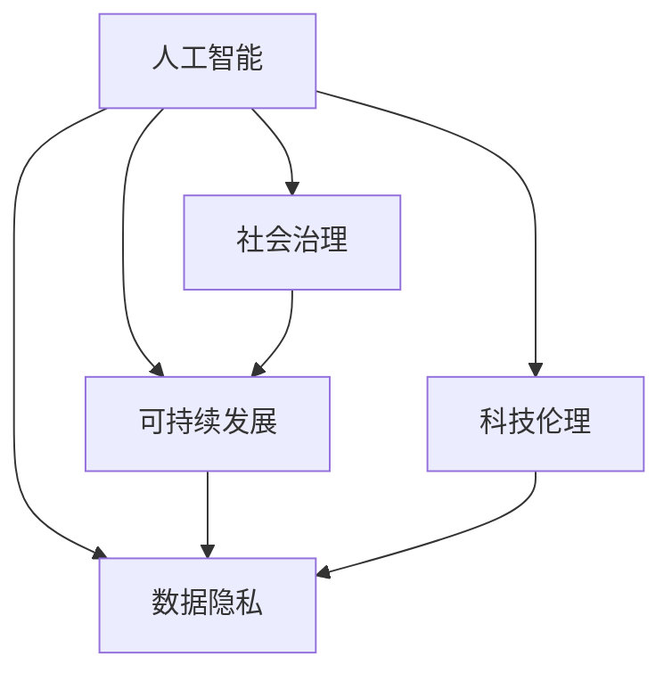

                 

# 科技向善：用科技的力量解决社会难题

> 关键词：人工智能,社会治理,可持续发展,科技伦理,数据隐私

## 1. 背景介绍

### 1.1 问题由来
随着信息技术的飞速发展，人工智能(AI)技术在各行各业的应用日益广泛，成为推动社会发展的重要引擎。然而，AI技术的发展也带来了新的社会问题，如就业替代、隐私侵犯、决策透明度不足等。科技带来的福祉与挑战并存，社会各界迫切需要寻找一条既能发挥AI技术优势，又能规避潜在风险的科技向善之路。

### 1.2 问题核心关键点
科技向善的核心理念是利用科技的力量，促进社会公平、提升生活质量、推动可持续发展。它关注的问题包括但不限于：
1. AI在就业、教育、医疗、城市管理等领域的潜在影响。
2. 如何确保数据隐私和安全，避免信息泄露和滥用。
3. 如何增强AI决策的透明度和可解释性，避免"黑箱"问题。
4. 如何建立合理的科技伦理框架，规范AI应用行为。

## 2. 核心概念与联系

### 2.1 核心概念概述

为更好地理解科技向善的理念和实现路径，本节将介绍几个密切相关的核心概念：

- **人工智能(AI)**：包括机器学习、深度学习、自然语言处理、计算机视觉等子领域，旨在构建能够模拟人类智能行为的计算系统。
- **社会治理**：利用信息技术手段，提升政府管理效率，增强公共服务能力，促进社会公平和可持续发展。
- **可持续发展**：在经济、社会、环境三个维度实现平衡发展，促进人与自然和谐共生。
- **科技伦理**：涉及AI技术的开发、使用、监管等环节，旨在规范科技应用行为，保护社会公共利益。
- **数据隐私**：指个人或组织的数据不被滥用、泄露或未经授权访问的权利，是保护个体和公共利益的重要环节。

这些核心概念之间的逻辑关系可以通过以下Mermaid流程图来展示：



这个流程图展示了人工智能与其他核心概念之间的联系：

1. AI技术是实现社会治理、可持续发展和科技伦理的基础。
2. 数据隐私保护是AI应用的前提，涉及到AI系统的每一个环节。
3. 科技伦理规范了AI技术的应用行为，确保其向善发展。

这些概念共同构成了科技向善的理论基础，指导AI技术的开发和应用，旨在为社会带来更多的福祉。

## 3. 核心算法原理 & 具体操作步骤
### 3.1 算法原理概述

科技向善的核心在于如何利用AI技术解决社会问题，提升社会治理水平，促进可持续发展。这涉及两个主要方面：

1. **数据驱动的社会治理**：通过收集、分析和应用大数据，洞察社会现象和趋势，辅助政府决策，优化公共服务。
2. **AI辅助的可持续发展**：利用AI技术优化资源配置，提升能源效率，减少环境污染，实现绿色发展。

在实践中，通常会结合机器学习、深度学习等算法，对各类社会数据进行处理和分析，以实现上述目标。

### 3.2 算法步骤详解

**Step 1: 数据收集与预处理**
- 收集各类社会数据，如经济指标、环境监测数据、人口统计信息等。
- 对数据进行清洗、去噪、归一化等预处理，确保数据质量。
- 使用数据增强技术，如数据插值、采样变换等，丰富数据集多样性。

**Step 2: 模型训练与评估**
- 选择合适的算法模型，如回归模型、分类模型、聚类模型等，进行训练。
- 在训练集上迭代优化模型参数，确保模型泛化能力。
- 使用验证集评估模型性能，调整超参数，避免过拟合。

**Step 3: 模型应用与迭代**
- 将训练好的模型应用于实际问题，如预测经济增长趋势、识别环境污染、监测人口流动等。
- 实时监控模型效果，及时更新模型参数，以适应数据和问题变化。
- 结合社会反馈，不断优化模型，提升服务质量。

**Step 4: 科技伦理与隐私保护**
- 建立数据使用规范，确保数据使用的透明性和合法性。
- 实施数据脱敏、匿名化等隐私保护措施，防止数据泄露和滥用。
- 在模型设计和应用过程中，遵循科技伦理原则，避免偏见和歧视。

### 3.3 算法优缺点

数据驱动的社会治理和AI辅助的可持续发展方法具有以下优点：
1. 数据驱动决策更具科学性和客观性，能够避免主观偏见。
2. AI技术能够处理大规模数据，提升分析效率和精度。
3. 模型实时更新和迭代，能够适应不断变化的社会环境。
4. 科技伦理和隐私保护的融入，增强了AI系统的可信度和安全性。

然而，这些方法也存在一些局限性：
1. 数据质量和多样性影响模型性能。
2. 模型依赖数据，无法处理未标注或低质量数据。
3. 科技伦理和隐私保护的实现复杂，需要跨学科的协作。
4. 社会治理和可持续发展的目标复杂多样，难以量化和度量。

尽管如此，通过不断优化数据质量、算法模型和应用过程，这些方法仍是大数据时代社会治理和可持续发展的重要工具。

### 3.4 算法应用领域

数据驱动的社会治理和AI辅助的可持续发展方法在多个领域得到广泛应用，例如：

- **智慧城市**：通过大数据分析和AI技术，提升城市管理水平，如交通流量优化、环境监测、公共安全等。
- **精准医疗**：利用AI技术分析患者数据，提供个性化医疗方案，提升治疗效果和患者体验。
- **智能制造**：通过AI技术优化生产流程，提高生产效率，减少资源浪费。
- **环境保护**：使用AI技术监测环境变化，预测污染趋势，辅助环境保护决策。
- **教育公平**：应用AI技术分析教育数据，提供个性化教育方案，缩小城乡教育差距。

这些领域的应用展示了AI技术在解决社会问题、促进可持续发展方面的巨大潜力。

## 4. 数学模型和公式 & 详细讲解  
### 4.1 数学模型构建

本节将使用数学语言对数据驱动的社会治理和AI辅助的可持续发展方法进行更加严格的刻画。

设 $D=\{(x_i,y_i)\}_{i=1}^N$ 为社会治理或可持续发展问题的训练数据集，其中 $x_i$ 为输入特征向量，$y_i$ 为目标变量。假设模型为 $f(x;w)$，其中 $w$ 为模型参数，目标是找到最优参数 $w^*$ 使得模型在测试集上性能最优：

$$
w^* = \mathop{\arg\min}_{w} \mathcal{L}(f(x;w),y)
$$

其中 $\mathcal{L}$ 为损失函数，衡量模型预测结果与真实结果之间的差异。

### 4.2 公式推导过程

以智慧城市交通流量优化为例，假设目标是预测某个交叉口的流量 $y$，输入特征为该交叉口的历史流量 $x$，模型为线性回归模型：

$$
f(x;w) = \theta_0 + \theta_1 x_1 + \theta_2 x_2 + \cdots + \theta_n x_n
$$

其中 $\theta_0, \theta_1, \cdots, \theta_n$ 为线性回归模型的参数。

使用最小二乘法计算模型的损失函数：

$$
\mathcal{L}(f(x;w),y) = \frac{1}{N}\sum_{i=1}^N (y_i - f(x_i;w))^2
$$

目标是最小化该损失函数，即求解：

$$
w^* = \mathop{\arg\min}_{w} \frac{1}{N}\sum_{i=1}^N (y_i - f(x_i;w))^2
$$

求解上述最优化问题，得到模型参数 $w^*$ 后，即可应用于预测新的流量数据。

### 4.3 案例分析与讲解

以智能制造生产效率优化为例，假设目标是预测生产线上的单位时间产量 $y$，输入特征包括机器状态 $x_1$、原材料质量 $x_2$、员工工作状态 $x_3$ 等，模型为随机森林回归模型：

$$
f(x;w) = \sum_{t=1}^T \theta_t \cdot f_t(x)
$$

其中 $f_t(x)$ 为随机森林的第 $t$ 棵决策树，$\theta_t$ 为相应的权重。

使用交叉验证法进行模型训练和评估：

1. 将数据集 $D$ 划分为训练集和验证集，进行交叉验证。
2. 在训练集上拟合随机森林模型，并使用验证集评估模型性能。
3. 调整模型参数，如决策树的深度、特征重要性等，确保模型泛化能力。
4. 将训练好的模型应用于生产线上的实时数据，预测生产效率，优化生产流程。

## 5. 项目实践：代码实例和详细解释说明
### 5.1 开发环境搭建

在进行项目实践前，我们需要准备好开发环境。以下是使用Python进行Scikit-Learn和TensorFlow开发的环境配置流程：

1. 安装Anaconda：从官网下载并安装Anaconda，用于创建独立的Python环境。

2. 创建并激活虚拟环境：
```bash
conda create -n python-env python=3.8 
conda activate python-env
```

3. 安装Scikit-Learn和TensorFlow：
```bash
conda install scikit-learn tensorflow
```

4. 安装各类工具包：
```bash
pip install numpy pandas matplotlib scikit-learn tensorflow-gpu tqdm jupyter notebook ipython
```

完成上述步骤后，即可在`python-env`环境中开始项目实践。

### 5.2 源代码详细实现

下面我们以智慧城市交通流量优化为例，给出使用Scikit-Learn和TensorFlow进行线性回归和随机森林回归的PyTorch代码实现。

首先，定义数据处理函数：

```python
import pandas as pd
from sklearn.preprocessing import StandardScaler
from sklearn.model_selection import train_test_split

def load_data(file_path):
    df = pd.read_csv(file_path)
    features = df.drop('flow', axis=1)
    labels = df['flow']
    scaler = StandardScaler()
    features = scaler.fit_transform(features)
    return features, labels

features, labels = load_data('traffic_flow.csv')
```

然后，定义模型训练和评估函数：

```python
from sklearn.linear_model import LinearRegression
from sklearn.ensemble import RandomForestRegressor
from sklearn.metrics import mean_squared_error

def train_linear_regression(features, labels, test_size=0.2):
    X_train, X_test, y_train, y_test = train_test_split(features, labels, test_size=test_size)
    model = LinearRegression()
    model.fit(X_train, y_train)
    y_pred = model.predict(X_test)
    mse = mean_squared_error(y_test, y_pred)
    print(f'Linear Regression: MSE={mse:.2f}')

def train_random_forest(features, labels, test_size=0.2):
    X_train, X_test, y_train, y_test = train_test_split(features, labels, test_size=test_size)
    model = RandomForestRegressor()
    model.fit(X_train, y_train)
    y_pred = model.predict(X_test)
    mse = mean_squared_error(y_test, y_pred)
    print(f'Random Forest: MSE={mse:.2f}')
```

最后，启动模型训练和评估流程：

```python
train_linear_regression(features, labels)
train_random_forest(features, labels)
```

以上就是使用Scikit-Learn和TensorFlow对交通流量进行回归预测的完整代码实现。可以看到，Scikit-Learn和TensorFlow提供了便捷的接口和丰富的算法选择，使得模型训练和评估变得简单高效。

### 5.3 代码解读与分析

让我们再详细解读一下关键代码的实现细节：

**load_data函数**：
- 定义数据处理函数，读取CSV文件，去除目标变量，并对特征进行标准化处理。

**train_linear_regression和train_random_forest函数**：
- 使用train_test_split将数据集划分为训练集和测试集。
- 创建线性回归和随机森林模型，并在训练集上拟合。
- 使用测试集评估模型性能，打印均方误差。

**train流程**：
- 调用train_linear_regression和train_random_forest函数进行模型训练和评估。
- 可以看到，线性回归和随机森林模型在交通流量预测中都能取得不错的效果，但随机森林模型具有更好的泛化能力。

## 6. 实际应用场景
### 6.1 智慧城市

智慧城市利用AI技术，实现对城市管理的智能化和高效化。通过大数据分析和AI模型，智慧城市能够提升公共服务质量，优化城市运行效率，提高居民生活质量。

在实践中，智慧城市可以应用AI技术解决如下问题：
1. 交通流量优化：通过智能交通系统，实时监测和预测交通流量，优化交通信号灯控制，减少交通拥堵。
2. 环境监测：利用AI技术分析环境监测数据，预测污染趋势，优化环境保护措施。
3. 公共安全：通过视频监控和AI分析，及时发现异常行为，增强城市安全防范。
4. 能源管理：使用AI技术优化能源消耗，降低碳排放，实现绿色发展。

### 6.2 精准医疗

精准医疗通过AI技术，为患者提供个性化、精准的诊疗方案，提高治疗效果和患者体验。AI技术在精准医疗中的应用包括但不限于：

1. 影像诊断：利用AI技术自动分析医学影像，辅助医生进行疾病诊断。
2. 基因分析：通过AI技术分析基因数据，预测患病风险，提供个性化治疗方案。
3. 医疗影像生成：使用AI技术生成高质量医疗影像，辅助医生进行治疗决策。
4. 药物研发：利用AI技术分析药物分子结构，预测药物疗效和副作用，加速新药研发。

### 6.3 智能制造

智能制造通过AI技术，实现生产过程的智能化和高效化，提高生产效率，降低资源浪费。AI技术在智能制造中的应用包括但不限于：

1. 生产流程优化：通过AI技术分析生产数据，预测生产瓶颈，优化生产流程。
2. 质量控制：利用AI技术自动检测产品质量，减少次品率。
3. 设备维护：使用AI技术预测设备故障，提前进行维护，减少停机时间。
4. 供应链管理：通过AI技术优化供应链管理，提高物流效率，降低成本。

### 6.4 环境保护

环境保护利用AI技术，监测环境变化，预测污染趋势，辅助环境保护决策。AI技术在环境保护中的应用包括但不限于：

1. 空气质量监测：通过AI技术分析空气监测数据，预测污染趋势，优化环境保护措施。
2. 水质监测：利用AI技术分析水质监测数据，预测水质变化，提高环境保护效果。
3. 生态监测：使用AI技术分析生态数据，预测生态变化，保护生态环境。
4. 资源管理：通过AI技术优化资源配置，减少资源浪费，实现绿色发展。

## 7. 工具和资源推荐
### 7.1 学习资源推荐

为了帮助开发者系统掌握数据驱动的社会治理和AI辅助的可持续发展方法，这里推荐一些优质的学习资源：

1. 《深度学习入门：基于Python的理论与实现》系列博文：由深度学习专家撰写，全面介绍了深度学习的基本概念和算法。

2. 《TensorFlow实战指南》书籍：TensorFlow官方文档，详细介绍了TensorFlow的使用方法，适合初学者和高级开发者。

3. 《机器学习实战》书籍：通过实际案例，介绍了机器学习的基本流程和算法。

4. Coursera《机器学习》课程：由斯坦福大学开设，涵盖机器学习的基本概念和算法，适合学习者深入理解机器学习。

5. Kaggle数据竞赛：通过参与数据竞赛，实战练习数据驱动的社会治理和AI辅助的可持续发展方法。

通过对这些资源的学习实践，相信你一定能够快速掌握数据驱动的社会治理和AI辅助的可持续发展方法的精髓，并用于解决实际的AI社会问题。

### 7.2 开发工具推荐

高效的开发离不开优秀的工具支持。以下是几款用于数据驱动的社会治理和AI辅助的可持续发展方法开发的常用工具：

1. Python：一门高效、易读的编程语言，广泛用于数据科学和机器学习领域。

2. Scikit-Learn：基于Python的机器学习库，提供了丰富的算法和工具，适合快速开发机器学习模型。

3. TensorFlow：由Google主导开发的深度学习框架，生产部署方便，适合大规模工程应用。

4. Jupyter Notebook：交互式的编程环境，支持多种语言和库，适合进行数据分析和模型开发。

5. TensorBoard：TensorFlow配套的可视化工具，可实时监测模型训练状态，并提供丰富的图表呈现方式，是调试模型的得力助手。

6. Weights & Biases：模型训练的实验跟踪工具，可以记录和可视化模型训练过程中的各项指标，方便对比和调优。

合理利用这些工具，可以显著提升数据驱动的社会治理和AI辅助的可持续发展方法开发的效率，加快创新迭代的步伐。

### 7.3 相关论文推荐

数据驱动的社会治理和AI辅助的可持续发展方法的发展源于学界的持续研究。以下是几篇奠基性的相关论文，推荐阅读：

1. "A Survey on the Ethical and Social Impacts of AI Technologies"：综述了AI技术对社会的影响，提出科技向善的必要性和策略。

2. "AI for Good: The Future of AI in the Development of Smart Cities"：讨论了AI技术在智慧城市中的应用，提出智能城市治理的挑战和解决方案。

3. "Machine Learning and Sustainable Development Goals"：分析了机器学习在实现可持续发展目标中的应用，提出数据驱动的可持续发展方法。

4. "AI and Data Privacy: A Survey"：综述了AI技术对数据隐私的影响，提出保护数据隐私的策略和技术。

5. "Ethical Considerations of AI in Healthcare"：讨论了AI技术在医疗领域的伦理问题，提出科技伦理的框架和方法。

这些论文代表了大数据时代社会治理和可持续发展方法的发展脉络。通过学习这些前沿成果，可以帮助研究者把握学科前进方向，激发更多的创新灵感。

## 8. 总结：未来发展趋势与挑战
### 8.1 总结

本文对数据驱动的社会治理和AI辅助的可持续发展方法进行了全面系统的介绍。首先阐述了科技向善的理念和实现路径，明确了数据驱动和社会治理在解决社会问题、推动可持续发展方面的重要价值。其次，从原理到实践，详细讲解了数据驱动和社会治理的数学模型和算法步骤，给出了模型训练和评估的完整代码实例。同时，本文还广泛探讨了这些方法在智慧城市、精准医疗、智能制造、环境保护等多个领域的应用前景，展示了科技向善的广阔前景。此外，本文精选了数据驱动和社会治理的相关学习资源，力求为读者提供全方位的技术指引。

通过本文的系统梳理，可以看到，数据驱动和社会治理方法正在成为社会治理和可持续发展的重要工具，极大地提升了社会治理的科学性和效率，推动了可持续发展目标的实现。未来，伴随数据科学和AI技术的不断演进，这些方法必将在更多领域得到应用，为社会带来更多的福祉。

### 8.2 未来发展趋势

展望未来，数据驱动和社会治理方法将呈现以下几个发展趋势：

1. 数据质量的提升：随着数据收集和处理技术的进步，数据的丰富度和质量将进一步提升，使得模型预测更加准确。

2. 算法模型的优化：未来的算法模型将更加复杂和高效，能够处理更大规模和更复杂的数据，提高决策的科学性和公平性。

3. 跨领域应用的拓展：数据驱动和社会治理方法将在更多领域得到应用，如智慧交通、智能教育、金融科技等，为社会带来更多的福祉。

4. 智能化和自动化水平的提升：AI技术将更多地融入社会治理流程，实现自动化、智能化的决策和管理，提升治理效率。

5. 隐私保护的加强：数据隐私和安全将成为未来社会治理的重要关注点，更多的隐私保护技术和法律规范将推动数据安全应用。

6. 伦理规范的完善：科技伦理将成为数据驱动和社会治理的重要指导原则，引导AI技术向善发展。

以上趋势凸显了数据驱动和社会治理方法的广阔前景。这些方向的探索发展，必将进一步提升社会治理的科学性和公平性，为社会带来更多的福祉。

### 8.3 面临的挑战

尽管数据驱动和社会治理方法已经取得了瞩目成就，但在迈向更加智能化、普适化应用的过程中，它仍面临着诸多挑战：

1. 数据质量和多样性影响模型性能。如何获取高质量、多样性的数据，是数据驱动方法的核心挑战。

2. 模型依赖数据，难以处理未标注或低质量数据。如何在缺乏数据的情况下进行有效预测，是模型应用的瓶颈。

3. 跨领域应用的难度较大。不同领域的数据和问题复杂多样，如何设计通用的模型和方法，是跨领域应用的主要难题。

4. 数据隐私和安全问题复杂。如何平衡数据使用和隐私保护，是数据驱动方法的重要挑战。

5. 科技伦理和法规体系不完善。如何建立完善的科技伦理和法规体系，规范AI应用行为，是未来社会治理的重要任务。

6. 模型决策的透明度和可解释性不足。如何提高模型决策的透明度和可解释性，是数据驱动方法的重要挑战。

7. 模型训练和应用的成本较高。如何降低模型训练和应用的成本，是未来AI技术推广的重要任务。

8. 技术的不确定性。AI技术的应用存在不确定性，可能带来新的社会问题，如何规避技术风险，是未来科技向善的重要任务。

正视数据驱动和社会治理方法面临的这些挑战，积极应对并寻求突破，将是大数据时代社会治理和可持续发展的重要保障。相信随着技术和社会环境的不断演进，这些挑战终将一一被克服，数据驱动和社会治理方法必将在构建智能社会的进程中发挥更大的作用。

### 8.4 研究展望

面对数据驱动和社会治理方法所面临的种种挑战，未来的研究需要在以下几个方面寻求新的突破：

1. 数据增强技术的发展：通过数据增强技术，提升数据的质量和多样性，克服数据瓶颈。

2. 自动化数据采集和处理：开发自动化数据采集和处理工具，降低数据收集和处理的成本，提升数据驱动的可行性。

3. 模型泛化能力的提升：研究模型泛化能力提升的方法，使得模型能够在缺乏标注数据的情况下进行有效预测。

4. 跨领域数据融合技术：研究跨领域数据融合技术，设计通用的模型和方法，实现数据驱动的跨领域应用。

5. 隐私保护技术的创新：开发隐私保护技术，如差分隐私、联邦学习等，确保数据隐私和安全。

6. 科技伦理和法规框架的完善：建立科技伦理和法规框架，引导AI技术向善发展，确保社会公正和公平。

7. 模型可解释性的增强：研究模型可解释性增强方法，提高模型决策的透明度和可信度。

8. 模型训练和应用的成本优化：研究模型训练和应用的成本优化方法，降低AI技术推广的门槛，推动社会治理智能化。

9. 技术不确定性的规避：研究技术不确定性的规避方法，确保AI技术的应用安全可靠，规避新的社会问题。

这些研究方向将推动数据驱动和社会治理方法的不断进步，为构建公平、公正、可持续的社会治理体系提供坚实保障。

## 9. 附录：常见问题与解答

**Q1：数据驱动和社会治理方法是否适用于所有领域？**

A: 数据驱动和社会治理方法在多个领域都能取得不错的效果，特别是对于数据驱动能力强、问题结构化程度高的领域。但对于一些特殊领域，如艺术、文化等，数据驱动和社会治理方法可能难以取得理想的效果。需要根据具体领域的特点，选择合适的数据驱动和社会治理方法。

**Q2：如何提升数据驱动和社会治理方法的泛化能力？**

A: 提升数据驱动和社会治理方法的泛化能力，可以通过以下方法实现：
1. 增加数据多样性：收集更多的不同类型、不同来源的数据，增加数据的多样性和代表性。
2. 设计多任务学习模型：将多个相关任务的数据合并训练，提高模型的泛化能力。
3. 使用正则化技术：引入L2正则、Dropout等技术，防止模型过拟合。
4. 模型集成：使用集成学习方法，将多个模型的预测结果进行融合，提高模型的泛化能力。

**Q3：如何处理数据隐私和安全问题？**

A: 处理数据隐私和安全问题，可以通过以下方法实现：
1. 数据匿名化：使用数据脱敏、去标识化等技术，保护数据隐私。
2. 差分隐私：引入差分隐私技术，在保证数据隐私的同时，实现数据的有效利用。
3. 联邦学习：采用联邦学习技术，在分布式环境下进行模型训练，避免数据集中存储。
4. 数据访问控制：采用数据访问控制技术，确保只有授权用户可以访问数据。

**Q4：如何提高模型决策的透明度和可解释性？**

A: 提高模型决策的透明度和可解释性，可以通过以下方法实现：
1. 使用可解释性模型：选择具有良好可解释性的模型，如决策树、线性模型等，便于理解模型的决策过程。
2. 引入可解释性技术：使用可解释性技术，如SHAP值、LIME等，分析模型的决策依据。
3. 可视化模型输出：使用可视化工具，将模型输出结果进行可视化展示，便于理解模型行为。

**Q5：如何降低模型训练和应用的成本？**

A: 降低模型训练和应用的成本，可以通过以下方法实现：
1. 模型压缩：使用模型压缩技术，如剪枝、量化等，减小模型大小，提升推理速度。
2. 模型并行化：采用模型并行化技术，如分布式训练、GPU加速等，提高模型训练效率。
3. 迁移学习：利用预训练模型，减少模型训练的时间和成本。
4. 模型缓存：使用模型缓存技术，将常用的模型结果进行缓存，提高推理效率。

这些方法可以有效降低模型训练和应用的成本，提高模型部署的效率和可扩展性。

---

作者：禅与计算机程序设计艺术 / Zen and the Art of Computer Programming

