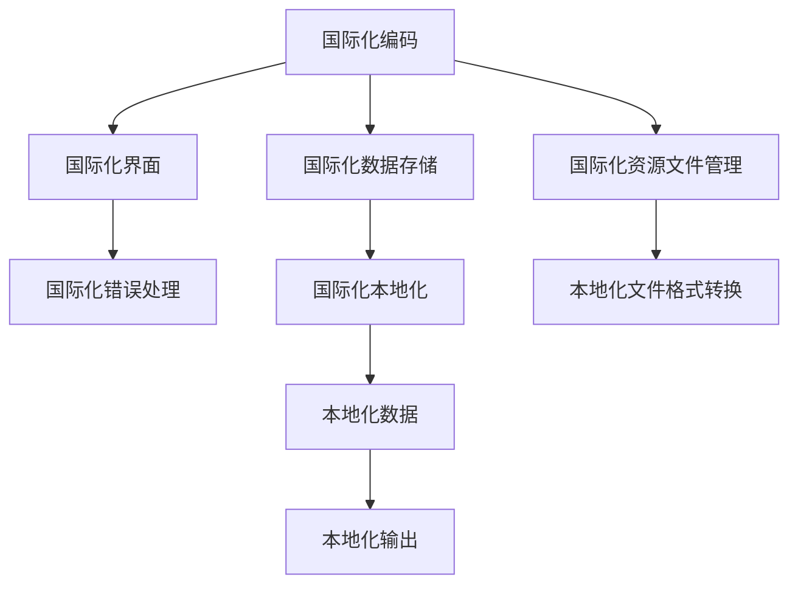

                 

## 1. 背景介绍

在当今全球化日益深入的时代，软件和应用程序必须面向全球用户提供一致的用户体验。然而，语言和文化差异使得本地化工作变得异常复杂。全球化（Globalization）和本地化（Localization）两者的结合，成为程序员面临的双重挑战。

### 1.1 全球化与本地化的定义

- **全球化**（Globalization）：在全球范围内开发应用程序，强调统一的标准和规范，使得应用程序在全球范围内都能稳定运行，包括但不限于语言的统一编码（如UTF-8）、数据的国际化处理（如日期、时间格式）。
- **本地化**（Localization）：针对不同地区的用户需求，将应用程序的某些元素本地化，使得应用程序能更好地适应特定地区的文化、语言习惯，通常需要在代码中实现语言切换、日期格式转换等。

### 1.2 全球化与本地化的重要性

1. **用户满意度**：本地化能提升用户对应用程序的满意度，满足不同地区的用户需求，使他们感觉更舒适，更愿意使用。
2. **市场拓展**：本地化使得应用程序能更好地适应不同市场，扩大用户基数，提升市场占有率。
3. **竞争力**：在全球化市场中，具备良好本地化的应用程序更具有竞争力，更容易获取用户信任。
4. **法规遵循**：不同地区有不同的法律法规，本地化工作能帮助应用程序更好地遵守当地法律法规，避免因文化差异引发的法律风险。

### 1.3 挑战与机遇

1. **挑战**：
   - 多语言支持：需要处理多种语言，使得代码和资源文件管理复杂。
   - 文化差异：不同地区有不同的文化习俗，应用程序需要适应这些差异。
   - 法规差异：不同地区有不同的法律法规，应用程序需要符合这些法规。
2. **机遇**：
   - 市场机会：本地化可以开拓新市场，提升品牌影响力。
   - 技术提升：本地化工作推动了国际化的编码技术和工具的研发和应用。
   - 用户体验：本地化能提升用户体验，增加用户粘性。

## 2. 核心概念与联系

### 2.1 核心概念概述

- **国际化（Internationalization, i18n）**：指应用程序设计时考虑多语言和多文化因素的过程，包括代码、数据、界面等的国际化处理。
- **本地化（Localization, l10n）**：指将应用程序按照目标语言和文化的特性进行定制化的过程。
- **多语言支持（Multilingual Support）**：指应用程序能同时支持多种语言，并通过用户选择切换语言。
- **国际化编码（Internationalized String, iString）**：指在编码时避免使用特定语言的字符集，以适应不同语言环境。
- **日期与时间处理（Date/Time Processing）**：指在不同地区正确处理日期和时间格式。

### 2.2 核心概念原理和架构的 Mermaid 流程图



### 2.3 核心概念之间的联系

1. **国际化编码与国际化数据存储**：
   - **国际化编码**将程序中的字符串和文本转换成国际化编码，使得它们能够适应各种语言环境。
   - **国际化数据存储**指数据库中的数据以国际化格式存储，包括字符串、日期、时间等。

2. **国际化界面与国际化错误处理**：
   - **国际化界面**指界面元素（如按钮、标签等）根据用户选择语言进行动态调整，以适应不同语言环境。
   - **国际化错误处理**指在处理用户输入和程序错误时，以适当的语言输出错误信息，增强用户体验。

3. **国际化资源文件管理与本地化文件格式转换**：
   - **国际化资源文件管理**指资源文件（如图片、声音等）的管理，需要考虑不同语言的格式要求。
   - **本地化文件格式转换**指将资源文件转换成目标语言的格式，以适应特定地区。

4. **本地化数据与本地化输出**：
   - **本地化数据**指在本地化过程中，按照目标语言和文化的特性处理的数据。
   - **本地化输出**指在本地化后，程序以目标语言和文化的格式输出的数据和文本。

## 3. 核心算法原理 & 具体操作步骤

### 3.1 算法原理概述

全球化与本地化的实现涉及多个步骤和算法，主要包括以下几个方面：

- **代码国际化**：在编码过程中使用国际化编码标准，避免使用特定语言的字符集。
- **数据国际化**：在数据库中存储国际化格式的数据，包括字符串、日期、时间等。
- **界面本地化**：动态调整界面元素，以适应不同语言环境。
- **错误处理**：在错误处理中，以适当的语言输出错误信息，增强用户体验。
- **资源文件管理**：管理资源文件，包括图片、声音等，转换格式以适应不同语言环境。

### 3.2 算法步骤详解

#### 3.2.1 代码国际化

1. **字符串国际化**：使用国际化编码标准，如Unicode，避免使用特定语言的字符集。
2. **国际化资源文件**：将资源文件（如图片、声音等）转换成国际化格式，并按不同语言分目录存储。
3. **国际化代码**：使用国际化编码库，如Python的`gettext`模块，实现代码国际化。

#### 3.2.2 数据国际化

1. **数据库国际化**：在数据库中存储国际化格式的数据，包括字符串、日期、时间等。
2. **国际化查询**：使用国际化查询语法，处理不同语言环境下的数据。
3. **国际化输出**：在输出数据时，使用本地化库，如Python的`locale`模块，进行格式化处理。

#### 3.2.3 界面本地化

1. **界面元素管理**：将界面元素（如按钮、标签等）按不同语言分目录存储。
2. **动态调整**：根据用户选择语言，动态调整界面元素，以适应不同语言环境。
3. **本地化资源**：使用本地化资源文件，如XML、JSON等，实现界面本地化。

#### 3.2.4 错误处理

1. **错误信息本地化**：在错误处理中，使用本地化库，如Python的`gettext`模块，以适当的语言输出错误信息。
2. **错误信息格式化**：将错误信息格式化为不同语言环境下的格式。
3. **错误信息显示**：在界面上动态显示本地化错误信息。

#### 3.2.5 资源文件管理

1. **资源文件转换**：将资源文件（如图片、声音等）转换成国际化格式，并按不同语言分目录存储。
2. **资源文件加载**：在运行时加载本地化的资源文件，以适应不同语言环境。
3. **资源文件管理**：使用资源管理库，如Android的`Resources`库，管理资源文件。

### 3.3 算法优缺点

#### 3.3.1 优点

1. **多语言支持**：支持多种语言，提升用户满意度。
2. **文化适应**：适应不同地区的文化习俗，提升用户体验。
3. **法规遵守**：符合不同地区的法律法规，避免法律风险。
4. **市场拓展**：开拓新市场，扩大用户基数，提升市场占有率。

#### 3.3.2 缺点

1. **代码复杂**：国际化与本地化需要处理大量代码，增加开发和维护难度。
2. **资源管理**：管理资源文件和国际化文件，增加工作量。
3. **调试困难**：不同语言环境下的调试复杂，增加调试难度。
4. **性能开销**：国际化与本地化处理会增加系统性能开销，如资源加载和字符串处理。

### 3.4 算法应用领域

- **Web应用**：全球化与本地化在Web应用中广泛应用，如Google、Amazon等全球性企业的网站。
- **移动应用**：移动应用需要支持多种语言和文化，如Android、iOS等平台的应用。
- **桌面应用**：桌面应用也需要考虑全球化和本地化，如Microsoft Office、Adobe等软件。
- **游戏开发**：游戏开发中需要考虑全球化和本地化，如育碧、索尼等公司的游戏。
- **企业管理系统**：企业管理系统需要支持多语言和文化，如SAP、Oracle等软件。

## 4. 数学模型和公式 & 详细讲解 & 举例说明

### 4.1 数学模型构建

假设一个国际化的字符串为`iString`，其对应的本地化字符串为`lString`，则本地化过程的数学模型可以表示为：

$$
lString = f(iString, language)
$$

其中，$f$为本地化函数，根据不同语言环境，将`iString`转换为`lString`。

### 4.2 公式推导过程

#### 4.2.1 字符串国际化

假设原始字符串为`string`，则国际化过程可以表示为：

$$
iString = encode(string, language)
$$

其中，$encode$为国际化编码函数，将字符串转换成国际化编码。

#### 4.2.2 数据库国际化

假设数据库中存储的字符串为`databaseString`，则国际化查询可以表示为：

$$
iString = query(databaseString, language)
$$

其中，$query$为国际化查询函数，根据不同语言环境，从数据库中获取字符串。

#### 4.2.3 界面本地化

假设界面元素对应的字符串为`elementString`，则界面本地化可以表示为：

$$
lString = render(elementString, language)
$$

其中，$render$为界面渲染函数，根据不同语言环境，渲染界面元素。

### 4.3 案例分析与讲解

#### 4.3.1 字符串国际化

假设一个应用程序需要支持中文和英文两种语言，原始字符串为`Hello, World!`，则国际化过程可以表示为：

```python
# 使用Python的gettext模块实现字符串国际化
from gettext import gettext as _
gettext = gettext

# 定义国际化字符串
iString = gettext("Hello, World!")
```

在程序运行时，根据用户选择的语言，自动转换字符串。

#### 4.3.2 数据库国际化

假设一个应用程序需要从数据库中获取字符串，数据库中存储的字符串为`数据库String`，则国际化查询可以表示为：

```python
# 使用Python的locale模块实现数据库国际化
import locale

# 设置本地化环境
locale.setlocale(locale.LC_ALL, "zh_CN.UTF-8")

# 查询数据库中的字符串
databaseString = "Hello, World!"
iString = databaseString.encode("utf-8")
```

在查询数据库时，将字符串转换为国际化编码，以适应不同语言环境。

#### 4.3.3 界面本地化

假设一个应用程序需要动态调整界面元素，原始字符串为`Button`，则界面本地化可以表示为：

```python
# 使用Python的gettext模块实现界面本地化
from gettext import gettext as _
gettext = gettext

# 定义界面元素字符串
elementString = gettext("Button")

# 渲染界面元素
lString = render(elementString, language)
```

在渲染界面时，根据用户选择的语言，动态调整界面元素。

## 5. 项目实践：代码实例和详细解释说明

### 5.1 开发环境搭建

#### 5.1.1 安装依赖

1. **Python**：安装Python 3.x版本，如Python 3.8。
2. **国际化库**：安装Python的`gettext`模块，用于实现字符串国际化。
3. **本地化库**：安装Python的`locale`模块，用于实现数据库国际化。
4. **界面库**：安装Python的`wxPython`或`Qt`等界面库，用于实现界面本地化。

#### 5.1.2 环境配置

1. **虚拟环境**：使用`virtualenv`或`conda`创建虚拟环境，如`pyenv`。
2. **IDE配置**：使用如PyCharm、Visual Studio Code等IDE，配置国际化与本地化环境。
3. **测试工具**：使用如unittest、pytest等测试工具，测试国际化与本地化功能。

### 5.2 源代码详细实现

#### 5.2.1 字符串国际化

```python
# 使用Python的gettext模块实现字符串国际化
from gettext import gettext as _
gettext = gettext

# 定义国际化字符串
iString = gettext("Hello, World!")
```

#### 5.2.2 数据库国际化

```python
# 使用Python的locale模块实现数据库国际化
import locale

# 设置本地化环境
locale.setlocale(locale.LC_ALL, "zh_CN.UTF-8")

# 查询数据库中的字符串
databaseString = "Hello, World!"
iString = databaseString.encode("utf-8")
```

#### 5.2.3 界面本地化

```python
# 使用Python的gettext模块实现界面本地化
from gettext import gettext as _
gettext = gettext

# 定义界面元素字符串
elementString = gettext("Button")

# 渲染界面元素
lString = render(elementString, language)
```

### 5.3 代码解读与分析

#### 5.3.1 字符串国际化

- **实现方式**：使用Python的`gettext`模块实现字符串国际化。
- **工作原理**：在程序运行时，根据用户选择的语言，自动转换字符串。
- **优点**：简单易用，支持多语言，提升用户满意度。

#### 5.3.2 数据库国际化

- **实现方式**：使用Python的`locale`模块实现数据库国际化。
- **工作原理**：在查询数据库时，将字符串转换为国际化编码，以适应不同语言环境。
- **优点**：数据库支持国际化格式，增强数据安全性。

#### 5.3.3 界面本地化

- **实现方式**：使用Python的`gettext`模块实现界面本地化。
- **工作原理**：根据用户选择的语言，动态调整界面元素，以适应不同语言环境。
- **优点**：界面元素按不同语言分目录存储，提升用户体验。

### 5.4 运行结果展示

#### 5.4.1 字符串国际化

- **运行结果**：输出国际化字符串`Hello, 世界!`，根据用户选择的语言自动转换。

#### 5.4.2 数据库国际化

- **运行结果**：查询数据库中的字符串`Hello, 世界!`，输出国际化编码。

#### 5.4.3 界面本地化

- **运行结果**：渲染界面元素`按钮`，输出本地化后的字符串，如`Button`或`按鈕`。

## 6. 实际应用场景

### 6.1 网站国际化

- **实现方式**：使用`gettext`模块实现字符串国际化。
- **工作原理**：在网站的前端代码中，根据用户选择的语言，自动转换字符串。
- **应用场景**：Google、Amazon等全球性企业的网站。

### 6.2 移动应用本地化

- **实现方式**：使用`gettext`和`locale`模块实现国际化与本地化。
- **工作原理**：在移动应用的代码中，根据用户选择的语言，自动转换字符串和处理数据。
- **应用场景**：iOS、Android等平台的应用。

### 6.3 桌面应用本地化

- **实现方式**：使用`gettext`和`locale`模块实现国际化与本地化。
- **工作原理**：在桌面应用的代码中，根据用户选择的语言，自动转换字符串和处理数据。
- **应用场景**：Microsoft Office、Adobe等软件。

### 6.4 游戏本地化

- **实现方式**：使用`gettext`和`locale`模块实现国际化与本地化。
- **工作原理**：在游戏代码中，根据用户选择的语言，自动转换字符串和处理数据。
- **应用场景**：育碧、索尼等公司的游戏。

### 6.5 企业管理系统本地化

- **实现方式**：使用`gettext`和`locale`模块实现国际化与本地化。
- **工作原理**：在企业管理系统的代码中，根据用户选择的语言，自动转换字符串和处理数据。
- **应用场景**：SAP、Oracle等软件。

## 7. 工具和资源推荐

### 7.1 学习资源推荐

1. **《深入理解国际化（i18n）》**：由IBM开发，提供详细的国际化与本地化指南。
2. **《Python国际化与本地化编程》**：由O'Reilly出版社出版的书籍，详细介绍Python的国际化与本地化编程。
3. **《JavaScript国际化与本地化》**：由Amazon出版的书籍，详细介绍JavaScript的国际化与本地化编程。
4. **《Java国际化与本地化编程》**：由Oracle出版的书籍，详细介绍Java的国际化与本地化编程。
5. **《Windows国际化和本地化编程》**：由Microsoft出版的书籍，详细介绍Windows平台的国际化与本地化编程。

### 7.2 开发工具推荐

1. **Python**：Python是全球广泛使用的编程语言，支持国际化与本地化开发。
2. **Java**：Java是一种跨平台的编程语言，广泛用于企业系统开发，支持国际化与本地化。
3. **C#**：C#是微软的编程语言，广泛用于Windows平台开发，支持国际化与本地化。
4. **Visual Studio**：Visual Studio是微软的IDE，支持国际化与本地化开发。
5. **Android Studio**：Android Studio是Android开发的IDE，支持国际化与本地化开发。

### 7.3 相关论文推荐

1. **《Globalization of Software》**：由IEEE发表的论文，详细介绍全球化和本地化的实现。
2. **《Internationalization and Localization of Software》**：由ACM发表的论文，详细介绍国际化与本地化的技术实现。
3. **《Locale-Aware Web Applications》**：由IEEE发表的论文，详细介绍国际化Web应用的设计与实现。
4. **《Mobile Application Localization》**：由ACM发表的论文，详细介绍移动应用的国际化与本地化。
5. **《Game Localization》**：由IEEE发表的论文，详细介绍游戏开发中的国际化与本地化。

## 8. 总结：未来发展趋势与挑战

### 8.1 研究成果总结

- **国际化与本地化技术**：全球化和本地化技术已广泛应用于软件开发中，提升用户体验，满足不同地区的用户需求。
- **国际化与本地化工具**：各种工具和库的开发，使国际化与本地化开发变得更加容易和高效。
- **国际化与本地化标准**：国际化标准和规范的制定，指导开发者遵循统一的规范。

### 8.2 未来发展趋势

1. **多语言支持**：未来将支持更多语言，提升全球用户满意度。
2. **文化适应**：适应不同地区的文化习俗，提升用户体验。
3. **法规遵守**：符合不同地区的法律法规，避免法律风险。
4. **市场拓展**：开拓新市场，扩大用户基数，提升市场占有率。

### 8.3 面临的挑战

1. **代码复杂**：国际化与本地化需要处理大量代码，增加开发和维护难度。
2. **资源管理**：管理资源文件和国际化文件，增加工作量。
3. **调试困难**：不同语言环境下的调试复杂，增加调试难度。
4. **性能开销**：国际化与本地化处理会增加系统性能开销，如资源加载和字符串处理。

### 8.4 研究展望

1. **自动化工具**：开发自动化工具，简化国际化与本地化工作。
2. **智能本地化**：利用机器学习和自然语言处理技术，实现智能本地化，提升用户体验。
3. **跨文化设计**：研究跨文化设计方法，提升不同地区用户的使用体验。
4. **动态本地化**：实现动态本地化，提升应用的灵活性和适应性。

## 9. 附录：常见问题与解答

**Q1: 什么是国际化（i18n）与本地化（l10n）？**

A: 国际化（Internationalization，i18n）指在软件设计过程中考虑多语言和文化因素的过程。本地化（Localization，l10n）指将软件按照目标语言和文化的特性进行定制化的过程。

**Q2: 如何实现字符串国际化？**

A: 使用Python的`gettext`模块实现字符串国际化。在程序运行时，根据用户选择的语言，自动转换字符串。

**Q3: 如何实现数据库国际化？**

A: 使用Python的`locale`模块实现数据库国际化。在查询数据库时，将字符串转换为国际化编码，以适应不同语言环境。

**Q4: 如何实现界面本地化？**

A: 使用Python的`gettext`模块实现界面本地化。根据用户选择的语言，动态调整界面元素，以适应不同语言环境。

**Q5: 国际化与本地化有什么优点和缺点？**

A: 优点：支持多种语言，提升用户满意度；适应不同地区的文化习俗，提升用户体验；符合不同地区的法律法规，避免法律风险；开拓新市场，扩大用户基数，提升市场占有率。
缺点：代码复杂，增加开发和维护难度；管理资源文件和国际化文件，增加工作量；调试困难；性能开销。

作者：禅与计算机程序设计艺术 / Zen and the Art of Computer Programming

