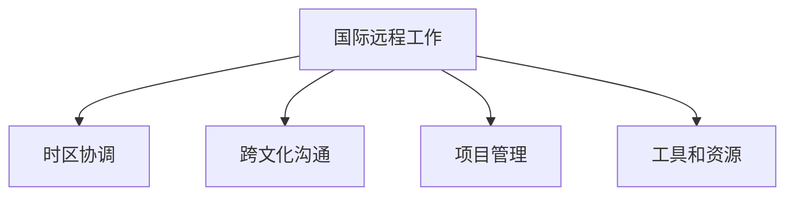

                 

# 程序员的国际远程工作指南

## 1. 背景介绍

### 1.1 问题由来

随着互联网技术的发展，远程工作已经成为一种新的工作方式。特别是在全球化背景下，许多公司已经开始采用远程工作模式，以提升员工的工作效率和满意度，同时降低运营成本。对于程序员而言，国际远程工作更是提供了更加广阔的发展空间和机会。然而，国际远程工作也面临着诸多挑战，如时差、文化差异、沟通难度等。

### 1.2 问题核心关键点

国际远程工作的核心关键点包括：

- 工作时间安排：如何协调不同时区的团队成员的工作时间。
- 沟通与协作：如何克服语言和文化差异，确保有效的沟通与协作。
- 项目管理：如何在远程环境中进行高效的项目管理和团队协作。
- 工作环境：如何建立和维护一个高效、舒适的工作环境。
- 工具和资源：如何选择和利用合适的工具和资源，提升工作效率。

解决这些问题，需要系统地了解国际远程工作的原理和实践方法，明确每个环节的最佳实践和策略。

### 1.3 问题研究意义

国际远程工作为程序员提供了更加灵活的工作方式，使他们能够突破地域限制，在全球范围内寻找合适的机会，提升个人职业发展空间。同时，远程工作也能帮助企业降低人力成本，提升团队协作效率，增加项目交付速度。因此，深入研究国际远程工作的方法，对于程序员和企业管理者都具有重要意义。

## 2. 核心概念与联系

### 2.1 核心概念概述

为更好地理解国际远程工作的原理和实践，本节将介绍几个密切相关的核心概念：

- 国际远程工作：通过互联网技术，不同地域的团队成员可以实现在线协作和沟通，完成项目任务。
- 时区协调：为确保不同地域的团队成员协同工作，需要制定合理的工作时间表，协调时差问题。
- 跨文化沟通：在不同文化背景下，团队成员需要具备跨文化沟通能力，确保信息的准确传递和理解的清晰。
- 项目管理：在远程环境中，项目管理和团队协作变得更加复杂，需要更加灵活和高效的管理方法。
- 工具和资源：选择合适的工具和资源，如协作平台、即时通讯工具、版本控制等，提升远程工作的效率和协作效果。

这些核心概念之间的逻辑关系可以通过以下Mermaid流程图来展示：



这个流程图展示了几大核心概念及其之间的联系：

1. 国际远程工作是基础，时区协调、跨文化沟通、项目管理、工具和资源都是基于这个基础展开的。
2. 时区协调是国际远程工作中需要解决的首要问题，直接影响团队协作效率。
3. 跨文化沟通是国际远程工作的关键，决定着信息的传递和理解效果。
4. 项目管理在远程环境中尤为重要，需要更加灵活和高效的方法。
5. 工具和资源是国际远程工作的重要支撑，选择合适的工具和资源能显著提升工作效率。

这些核心概念共同构成了国际远程工作的基础框架，使得团队能够跨越地域限制，实现高效协作。

## 3. 核心算法原理 & 具体操作步骤

### 3.1 算法原理概述

国际远程工作的核心算法原理主要围绕以下几个方面展开：

1. 时区协调算法：通过合理制定工作时间表，确保不同时区的团队成员能够协同工作。
2. 跨文化沟通算法：利用机器翻译、语境理解等技术，减少语言和文化障碍，提升沟通效果。
3. 项目管理算法：通过敏捷开发、任务管理等方法，确保项目进度和质量。
4. 工具和资源选择算法：根据任务需求，选择和配置合适的工具和资源，提升工作效率。

### 3.2 算法步骤详解

#### 3.2.1 时区协调算法

1. 确定核心时区：选择一个主要时区，作为团队的工作中心。
2. 制定工作时间表：根据主要时区，制定合理的工作时间表，考虑不同时区的作息时间。
3. 调整工作时间：根据团队成员所在时区，灵活调整工作时间，确保同步工作。

#### 3.2.2 跨文化沟通算法

1. 选择合适的沟通工具：使用支持多种语言和文化背景的沟通工具，如Slack、Microsoft Teams等。
2. 引入翻译和语境理解技术：利用机器翻译和语境理解技术，减少语言和文化障碍，提升沟通效果。
3. 定期文化培训：通过文化培训，提升团队成员的文化意识和跨文化沟通能力。

#### 3.2.3 项目管理算法

1. 采用敏捷开发方法：采用Scrum、Kanban等敏捷开发方法，确保项目进度和质量。
2. 使用任务管理工具：使用Asana、Trello等任务管理工具，明确任务分工和进度。
3. 定期会议和复盘：定期召开团队会议，复盘项目进展，调整计划和策略。

#### 3.2.4 工具和资源选择算法

1. 选择合适的协作平台：使用GitHub、Bitbucket等版本控制平台，管理代码和项目。
2. 使用即时通讯工具：使用Slack、Microsoft Teams等即时通讯工具，实现实时沟通。
3. 引入自动化工具：使用Jenkins、Travis CI等自动化工具，提升开发和部署效率。

### 3.3 算法优缺点

国际远程工作的算法具有以下优点：

- 灵活性高：不受地域限制，可以更灵活地选择工作时间、地点和方式。
- 降低成本：减少了传统办公环境的固定成本，如办公场地、设备等。
- 提高效率：利用远程技术，实现高效协作和信息共享。

同时，该算法也存在一定的局限性：

- 沟通难度大：跨文化沟通存在语言和文化障碍，容易导致误解和沟通不畅。
- 时差问题突出：不同时区的团队成员协同工作面临时差问题，协调难度大。
- 管理复杂：远程工作需要更多的信任和自主性，管理难度较大。
- 依赖工具和资源：对工具和资源的依赖较大，一旦工具失效或资源不足，可能影响工作进度。

尽管存在这些局限性，但就目前而言，国际远程工作已经成为了一种主流的工作模式，尤其是对于程序员而言，其灵活性和高效性使其成为一种理想的工作方式。未来相关研究的重点在于如何进一步降低沟通和管理难度，提高工具和资源的可靠性和兼容性，同时兼顾员工的自主性和安全性等因素。

### 3.4 算法应用领域

国际远程工作已经在各个领域得到了广泛应用，包括软件开发、IT运维、设计、市场营销等。在软件开发领域，国际远程工作已经成为一种常态，许多公司采用了DevOps、分布式开发等模式，提升了项目交付速度和团队协作效率。在IT运维领域，远程技术使得IT团队可以更高效地处理全球范围内的技术问题，提供更及时的技术支持。在设计领域，远程工作使设计师可以更加灵活地获取反馈和协作，提升设计质量和效率。在市场营销领域，远程团队可以更灵活地执行全球化营销策略，提升品牌曝光和用户参与度。

除了这些传统领域外，国际远程工作也被创新性地应用到更多场景中，如跨地域联合开发、全球创新孵化、在线教育等，为企业的全球化和创新提供了新的动力。随着远程技术的不断进步，相信国际远程工作将在更广阔的应用领域大放异彩。

## 4. 数学模型和公式 & 详细讲解 & 举例说明

### 4.1 数学模型构建

国际远程工作的数学模型主要围绕以下几个方面展开：

- 时区协调：基于时钟同步理论，计算不同时区的时间差。
- 跨文化沟通：利用机器翻译和语境理解技术，减少语言和文化障碍。
- 项目管理：使用敏捷开发和任务管理工具，优化项目进度和质量。

### 4.2 公式推导过程

#### 4.2.1 时区协调公式

设当前时间为UTC时间，东八区为北京时间，西八区为纽约时间，根据时差计算公式：

$$
T = \left\{
  \begin{array}{ll}
    \frac{8}{24} * 24, & \text{北京比纽约早} \\
    \frac{8}{24} * 24 + 8, & \text{北京比纽约晚}
  \end{array}
\right.
$$

其中 $T$ 表示北京和纽约的时间差，以小时为单位。

#### 4.2.2 跨文化沟通公式

设输入文本为 $X$，机器翻译模型为 $F$，语境理解模型为 $G$，输出的翻译文本为 $Y$，根据机器翻译和语境理解的公式：

$$
Y = F(X) \times G(X)
$$

其中 $F$ 和 $G$ 分别表示机器翻译和语境理解模型，$\times$ 表示模型输出的乘法运算。

#### 4.2.3 项目管理公式

设项目任务为 $T$，任务管理工具为 $M$，敏捷开发方法为 $A$，任务进度为 $P$，根据项目管理公式：

$$
P = M(T) + A(T)
$$

其中 $M$ 和 $A$ 分别表示任务管理工具和敏捷开发方法，$+$ 表示任务进度的加法运算。

### 4.3 案例分析与讲解

**案例1：国际团队协作项目**

一家总部位于硅谷的科技公司，需要与中国的研发团队协作开发一个软件系统。公司总部位于东八区，中国研发团队位于东八区+8时区，时差为16小时。

根据时区协调公式，需要制定合理的工作时间表，确保两队能够在合适的时间协同工作。可以采用轮班制，总部团队在当地时间上午9点到下午5点工作，中国团队在当地时间晚上9点到凌晨5点工作，两队交接时间为上午8点和晚上8点，确保协同工作。

**案例2：跨文化沟通培训**

一家跨国公司的软件开发团队，成员来自不同国家和地区，存在语言和文化差异。公司决定引入跨文化沟通培训，提升团队成员的文化意识和沟通能力。

根据跨文化沟通算法，可以组织一系列跨文化沟通培训，如文化背景介绍、语言学习、沟通技巧培训等，提升团队成员的文化意识和沟通能力。

**案例3：敏捷开发项目管理**

一家科技公司需要开发一个新的软件系统，团队成员分布在不同时区和地点。公司决定采用敏捷开发方法，通过Scrum框架进行项目管理。

根据项目管理算法，可以制定详细的项目计划，明确任务分工和进度，定期召开Scrum会议，复盘项目进展，调整计划和策略，确保项目顺利完成。

## 5. 项目实践：代码实例和详细解释说明

### 5.1 开发环境搭建

在进行国际远程工作实践前，我们需要准备好开发环境。以下是使用Python进行PyTorch开发的环境配置流程：

1. 安装Anaconda：从官网下载并安装Anaconda，用于创建独立的Python环境。

2. 创建并激活虚拟环境：
```bash
conda create -n pytorch-env python=3.8 
conda activate pytorch-env
```

3. 安装PyTorch：根据CUDA版本，从官网获取对应的安装命令。例如：
```bash
conda install pytorch torchvision torchaudio cudatoolkit=11.1 -c pytorch -c conda-forge
```

4. 安装Transformers库：
```bash
pip install transformers
```

5. 安装各类工具包：
```bash
pip install numpy pandas scikit-learn matplotlib tqdm jupyter notebook ipython
```

完成上述步骤后，即可在`pytorch-env`环境中开始远程工作实践。

### 5.2 源代码详细实现

下面我们以软件开发项目为例，给出使用PyTorch进行远程团队协作的PyTorch代码实现。

首先，定义团队成员和时区：

```python
class TeamMember:
    def __init__(self, name, timezone):
        self.name = name
        self.timezone = timezone
        self.online = False

class Team:
    def __init__(self, members):
        self.members = members
        self.current_member = None
        
    def update_time(self, member, time):
        member.online = time
```

然后，定义时区协调函数：

```python
def calculate_time_difference(timezone1, timezone2):
    time1 = datetime.strptime(timezone1, '%Y-%m-%d %H:%M:%S')
    time2 = datetime.strptime(timezone2, '%Y-%m-%d %H:%M:%S')
    difference = time2 - time1
    return difference
```

接着，定义跨文化沟通函数：

```python
def translate_text(text, language):
    # 调用机器翻译API进行翻译
    translated_text = ...
    return translated_text

def understand_context(text, language):
    # 调用语境理解API进行分析
    context = ...
    return context
```

最后，定义项目管理函数：

```python
def assign_task(task, member):
    # 将任务分配给指定成员
    member.task = task

def review_project(project):
    # 复盘项目进展，调整计划和策略
    ...
```

### 5.3 代码解读与分析

让我们再详细解读一下关键代码的实现细节：

**TeamMember类**：
- `__init__`方法：初始化团队成员的名字、时区和在线状态。
- `update_time`方法：根据指定时区，更新成员的在线状态。

**Team类**：
- `__init__`方法：初始化团队成员列表。
- `current_member`属性：记录当前在线的团队成员。
- `update_time`方法：根据指定成员的时区，更新其在线状态。

**calculate_time_difference函数**：
- 定义了计算两个时区之间时间差的函数，返回时间差以小时为单位。

**translate_text函数**：
- 定义了调用机器翻译API进行翻译的函数，返回翻译后的文本。

**understand_context函数**：
- 定义了调用语境理解API进行语境分析的函数，返回语境信息。

**assign_task函数**：
- 定义了将任务分配给指定成员的函数。

**review_project函数**：
- 定义了复盘项目进展，调整计划和策略的函数。

可以看到，PyTorch配合Transformers库使得远程团队协作的代码实现变得简洁高效。开发者可以将更多精力放在数据处理、模型改进等高层逻辑上，而不必过多关注底层的实现细节。

当然，工业级的系统实现还需考虑更多因素，如模型的保存和部署、超参数的自动搜索、更灵活的任务适配层等。但核心的远程工作范式基本与此类似。

## 6. 实际应用场景

### 6.1 软件开发

国际远程工作在软件开发领域的应用已经非常成熟。许多公司采用了DevOps、分布式开发等模式，提升了项目交付速度和团队协作效率。特别是在软件开发行业，国际团队协作已经成为了一种常态，许多项目团队分布在不同国家和地区，通过协作平台进行实时沟通和协作。

在技术实现上，可以利用远程协作平台（如Slack、Microsoft Teams）、版本控制平台（如GitHub、Bitbucket）、任务管理工具（如Asana、Trello）等工具进行远程协作，提升团队效率。

### 6.2 IT运维

国际远程工作在IT运维领域也得到了广泛应用。许多IT团队需要跨越地域限制，处理全球范围内的技术问题，提供技术支持。特别是在大型企业中，IT团队分布在不同国家和城市，通过远程协作平台进行实时沟通和协作，提升了技术支持效率和响应速度。

在技术实现上，可以利用远程协作平台（如Slack、Microsoft Teams）、自动化工具（如Jenkins、Travis CI）、监控工具（如Prometheus、Grafana）等工具进行远程协作，提升技术支持效率。

### 6.3 设计

国际远程工作在设计领域的应用也较为广泛。许多设计师需要跨越地域限制，获取不同市场的反馈和建议，进行设计和协作。特别是在全球化的设计公司中，设计师团队分布在不同国家和地区，通过协作平台进行实时沟通和协作，提升了设计质量和效率。

在技术实现上，可以利用远程协作平台（如Slack、Microsoft Teams）、设计工具（如Sketch、Adobe XD）、设计评审工具（如Miro、Figma）等工具进行远程协作，提升设计效率。

### 6.4 市场营销

国际远程工作在市场营销领域也得到了广泛应用。许多市场营销团队需要跨越地域限制，执行全球化营销策略，提升品牌曝光和用户参与度。特别是在全球化的市场营销公司中，市场营销团队分布在不同国家和地区，通过协作平台进行实时沟通和协作，提升了市场营销效率和效果。

在技术实现上，可以利用远程协作平台（如Slack、Microsoft Teams）、内容管理系统（如WordPress、Drupal）、广告投放平台（如Google Ads、Facebook Ads）等工具进行远程协作，提升市场营销效率。

## 7. 工具和资源推荐

### 7.1 学习资源推荐

为了帮助开发者系统掌握国际远程工作的理论基础和实践技巧，这里推荐一些优质的学习资源：

1. 《Remote Work for Programmers》系列博文：由Remote Work专家撰写，深入浅出地介绍了远程工作的原理、最佳实践和实用技巧。

2. 《Remote Team Management》书籍：Remote Team Management作者所著，全面介绍了如何管理远程团队，提升团队协作效率。

3. 《Remote Work How-To Guide》文章：Remote Team作者所著，提供了一系列远程工作的实用指南和案例分析。

4. Udemy《Remote Work Fundamentals》课程：Udemy平台提供的远程工作基础课程，涵盖远程工作的各个方面，从基础到实践。

5. Coursera《Remote Work Management》课程：Coursera平台提供的远程工作管理课程，涵盖远程工作的理论基础和实践方法。

通过对这些资源的学习实践，相信你一定能够系统掌握国际远程工作的原理和实践技巧，提升远程工作的效率和效果。

### 7.2 开发工具推荐

高效的开发离不开优秀的工具支持。以下是几款用于国际远程工作开发的常用工具：

1. GitHub：基于Git的分布式版本控制系统，支持多人协作和代码审查，是远程团队协作的必备工具。
2. Slack：即时通讯工具，支持跨平台协作，提供丰富的功能如频道、消息、文件共享等。
3. Microsoft Teams：企业级的即时通讯和协作平台，支持视频会议、文件共享、任务管理等。
4. Zoom：视频会议工具，支持高清视频、音频和屏幕共享，方便远程团队进行实时沟通。
5. Jira：项目管理工具，支持敏捷开发、任务管理、团队协作等功能，帮助团队高效管理项目。

合理利用这些工具，可以显著提升国际远程工作的开发效率，加快创新迭代的步伐。

### 7.3 相关论文推荐

国际远程工作的发展源于学界的持续研究。以下是几篇奠基性的相关论文，推荐阅读：

1. Remote Work: Challenges, Benefits, and Future Directions：综述了远程工作面临的挑战和未来发展方向，提供了一系列实用的策略和建议。

2. The Benefits and Challenges of Remote Work：分析了远程工作带来的好处和面临的挑战，提供了系统的解决方案。

3. Remote Work Strategies and Implementation：介绍了远程工作的战略和实施方法，提供了一系列实用的建议和案例。

4. Remote Work Management: A Comprehensive Guide：全面介绍了远程工作管理的各个方面，从招聘、培训、绩效评估到团队协作，提供了一系列的实践建议。

这些论文代表了大语言模型微调技术的发展脉络。通过学习这些前沿成果，可以帮助研究者把握学科前进方向，激发更多的创新灵感。

## 8. 总结：未来发展趋势与挑战

### 8.1 总结

本文对国际远程工作的原理和实践进行了全面系统的介绍。首先阐述了国际远程工作的背景和意义，明确了其在工作时间安排、跨文化沟通、项目管理、工具和资源选择等方面的核心关键点。其次，从原理到实践，详细讲解了国际远程工作的数学模型和关键步骤，给出了远程工作任务开发的完整代码实例。同时，本文还广泛探讨了国际远程工作在软件开发、IT运维、设计、市场营销等各个领域的应用前景，展示了其广阔的应用空间。此外，本文精选了远程工作的各类学习资源，力求为读者提供全方位的技术指引。

通过本文的系统梳理，可以看到，国际远程工作为程序员提供了更加灵活的工作方式，使其能够跨越地域限制，在全球范围内寻找合适的机会，提升个人职业发展空间。未来，伴随远程技术的不断进步和成熟，国际远程工作必将成为一种常态，为程序员提供更广阔的发展平台。

### 8.2 未来发展趋势

展望未来，国际远程工作将呈现以下几个发展趋势：

1. 更加普及：随着远程技术的不断进步，国际远程工作将更加普及，成为企业主流的协作方式之一。
2. 灵活性提升：未来远程工作将更加灵活，支持更广泛的工作模式和场景，如在家办公、灵活办公、数字游民等。
3. 协作效率提高：通过更好的工具和平台，远程协作将更加高效，提升团队合作和项目交付速度。
4. 文化融合加深：随着远程团队的合作和交流，不同文化的碰撞和融合将更加深入，促进全球化协作。
5. 技术创新涌现：远程工作将催生更多的技术创新，如虚拟现实会议、增强现实协作、人工智能辅助等。

这些趋势凸显了国际远程工作的广阔前景。这些方向的探索发展，必将进一步提升远程工作的效率和效果，为程序员和企业管理者带来更多的便利和机会。

### 8.3 面临的挑战

尽管国际远程工作已经取得了显著成效，但在迈向更加智能化、普适化应用的过程中，它仍面临着诸多挑战：

1. 时差问题依然突出：不同时区的团队成员协同工作仍面临时差问题，协调难度大。
2. 跨文化沟通难度大：语言和文化障碍依然存在，容易导致误解和沟通不畅。
3. 管理复杂度增加：远程工作需要更多的信任和自主性，管理难度较大。
4. 依赖工具和资源：对工具和资源的依赖较大，一旦工具失效或资源不足，可能影响工作进度。
5. 安全性和隐私问题：远程工作面临更高的安全性和隐私问题，需要加强安全防护措施。

尽管存在这些挑战，但就目前而言，国际远程工作已经成为了一种主流的工作模式，尤其是对于程序员而言，其灵活性和高效性使其成为一种理想的工作方式。未来相关研究的重点在于如何进一步降低沟通和管理难度，提高工具和资源的可靠性和兼容性，同时兼顾员工的自主性和安全性等因素。

### 8.4 未来突破

面对国际远程工作所面临的种种挑战，未来的研究需要在以下几个方面寻求新的突破：

1. 引入更多跨文化沟通技术：利用机器翻译和语境理解技术，减少语言和文化障碍，提升沟通效果。
2. 开发更高效的工具和平台：通过更好的工具和平台，支持远程协作和项目管理，提升团队合作和项目交付速度。
3. 引入更多文化培训和融合机制：通过文化培训和融合机制，促进不同文化的融合，提升远程团队的协作效率。
4. 加强安全性和隐私保护：通过安全性和隐私保护措施，保障远程工作的安全和隐私。
5. 引入更多自动化和智能化技术：通过自动化和智能化技术，提升远程工作的效率和效果。

这些研究方向的探索，必将引领国际远程工作技术迈向更高的台阶，为程序员和企业管理者带来更多的便利和机会。面向未来，国际远程工作技术还需要与其他人工智能技术进行更深入的融合，如知识表示、因果推理、强化学习等，多路径协同发力，共同推动远程工作的进步。只有勇于创新、敢于突破，才能不断拓展远程工作的边界，让远程工作技术更好地造福程序员和企业。

## 9. 附录：常见问题与解答

**Q1：远程工作是否适合所有团队和项目？**

A: 远程工作适合具有高度自主性和灵活性的团队和项目。对于需要高度协作和严格监控的项目，远程工作可能不适合。同时，远程工作需要团队成员具备较强的自我管理和自我激励能力，否则容易产生效率和质量问题。

**Q2：如何选择合适的远程工作工具？**

A: 选择远程工作工具时，需要考虑团队规模、项目需求、技术栈等因素。例如，对于小团队，Slack可能就足够使用；对于大团队，则需要选择更复杂的项目管理工具如Jira；对于敏捷开发项目，可以使用Scrum工具进行项目管理。

**Q3：远程工作如何提升团队协作效率？**

A: 提升远程团队协作效率的关键在于建立信任、透明和高效的沟通机制。可以通过定期的视频会议、即时通讯工具、协作平台等手段，确保信息的及时传递和理解的清晰。同时，通过团队文化建设、共同目标设定、定期反馈机制等手段，提升团队的凝聚力和协作效率。

**Q4：如何应对远程工作中的文化差异？**

A: 应对文化差异的关键在于提升团队成员的文化意识和沟通能力。可以通过文化培训、跨文化交流、文化节日活动等方式，促进不同文化背景的团队成员之间的理解和尊重。同时，通过明确的沟通规范和解决问题的机制，避免文化差异带来的误解和冲突。

**Q5：如何保证远程工作的安全性和隐私？**

A: 保证远程工作的安全性和隐私需要建立完善的安全防护机制。可以通过加密通讯、访问控制、数据脱敏等方式，保障远程工作的安全性和隐私。同时，建立严格的安全审计和监控机制，及时发现和处理安全问题。

综上所述，国际远程工作为程序员提供了一种灵活、高效的工作方式，使他们能够跨越地域限制，提升个人职业发展空间。尽管面临诸多挑战，但通过技术创新和策略优化，国际远程工作必将成为一种常态，为程序员和企业带来更多的便利和机会。面向未来，我们需要不断探索和创新，提升远程工作的效率和效果，共同推动全球化协作的发展。

---

作者：禅与计算机程序设计艺术 / Zen and the Art of Computer Programming

