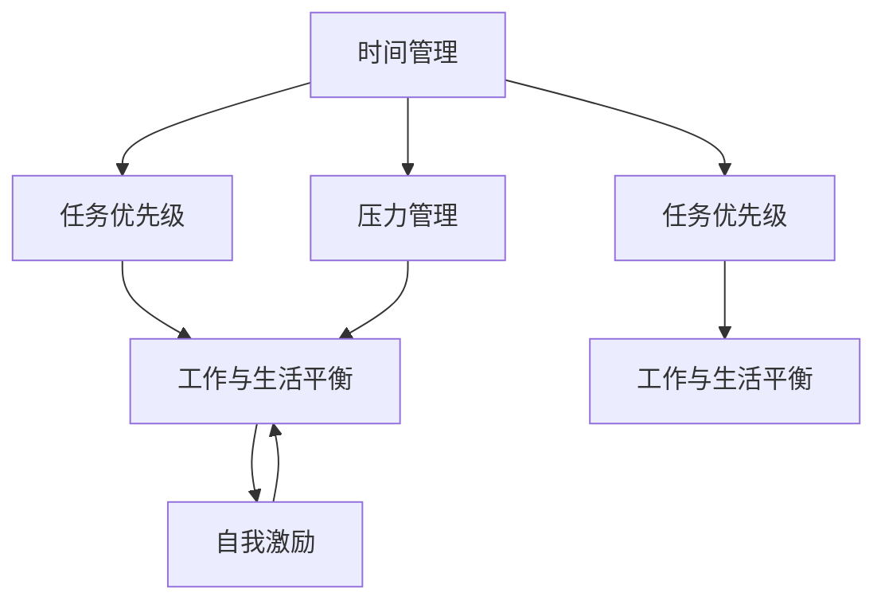

                 

# 程序员的工作与生活平衡：实现之道

## 1. 背景介绍

在快速发展的科技行业，程序员成为了推动社会进步的重要力量。然而，面对高压的工作环境、无休止的代码调试和项目交付压力，许多程序员感到身心疲惫，难以保持健康的工作与生活平衡。如何找到这种平衡，成为了行业内外的热门话题。本文将从多个角度探讨这一问题，提出实现程序员工作与生活平衡的实现之道。

## 2. 核心概念与联系

### 2.1 核心概念概述

在探讨程序员的工作与生活平衡问题时，需要理解几个关键概念及其相互联系：

- **工作与生活平衡（Work-Life Balance）**：指一个人在工作和生活中的时间和精力的合理分配，使得两方面都能得到充分的满足和发展。

- **时间管理（Time Management）**：指通过科学的方法和工具，合理规划和分配时间，提高工作效率，腾出更多时间用于生活和个人兴趣。

- **压力管理（Stress Management）**：指通过各种手段和策略，减轻工作带来的心理和生理压力，保持良好的心态。

- **任务优先级（Task Prioritization）**：指通过评估任务的重要性和紧急性，合理安排任务顺序，避免过度努力和浪费时间。

- **自我激励（Self-Motivation）**：指通过内在动力和正面激励，保持工作热情和动力，减少拖延和倦怠。

这些概念之间相互影响，合理平衡可以显著提升个人的工作满意度和生活质量，进而提高工作效率和创造力。

### 2.2 核心概念原理和架构的 Mermaid 流程图



该流程图展示了时间管理、任务优先级、压力管理、工作与生活平衡和自我激励五个概念之间的相互联系和影响。

## 3. 核心算法原理 & 具体操作步骤

### 3.1 算法原理概述

实现程序员工作与生活平衡的核心算法原理可以归结为以下几点：

1. **时间分配**：通过时间管理，将时间合理分配到工作和生活中，确保两者都不被忽视。
2. **任务优先级**：通过任务优先级策略，优化任务执行顺序，提高工作效率，减少过度劳累。
3. **压力缓解**：通过压力管理技术，减少工作带来的心理和生理压力，保持心态平衡。
4. **激励机制**：通过自我激励，保持工作热情和动力，避免长期疲惫和倦怠。

### 3.2 算法步骤详解

1. **时间管理**：
   - **步骤一**：记录每日时间使用情况，识别时间浪费和低效时间。
   - **步骤二**：设定目标时间分配比例，例如工作7小时，睡眠8小时，个人兴趣和休息3小时。
   - **步骤三**：使用时间管理工具，如Todoist、Trello等，规划每日任务，确保时间安排合理。

2. **任务优先级**：
   - **步骤一**：评估任务的紧急性和重要性，使用四象限法则（重要紧急、重要不紧急、不重要紧急、不重要不紧急）。
   - **步骤二**：根据优先级排序任务，优先处理重要紧急和重要不紧急任务，避免陷入无意义的工作循环。

3. **压力管理**：
   - **步骤一**：识别工作中的压力源，如工作量过大、任务紧迫、人际关系等。
   - **步骤二**：使用压力缓解技术，如冥想、深呼吸、运动、社交等，减少压力积累。
   - **步骤三**：定期评估压力状态，调整工作策略和心态，保持平衡。

4. **自我激励**：
   - **步骤一**：设定短期和长期目标，分解任务，逐步实现。
   - **步骤二**：奖励自己完成任务，如休息一会儿、享受美食、看电影等。
   - **步骤三**：保持正面的心态，记录工作中的小成就，保持自信和动力。

### 3.3 算法优缺点

**优点**：
1. **效率提升**：合理的时间管理和任务优先级，能显著提高工作效率，减少无效劳动。
2. **心态改善**：通过压力管理和自我激励，减轻心理和生理压力，提升工作满意度。
3. **生活质量**：确保有足够时间用于个人兴趣和休息，提升生活质量和幸福感。

**缺点**：
1. **实施难度**：需要持续的自我管理和意志力，容易中途放弃。
2. **工具依赖**：依赖时间管理工具和压力管理工具，工具选择和操作复杂。
3. **个性化挑战**：每个人的生活和工作的具体情况不同，通用策略可能不适用于所有人。

### 3.4 算法应用领域

该算法不仅适用于程序员，也适用于各种职业和行业，尤其在高压和高强度的工作环境中，其效果更为显著。

1. **医疗行业**：医护人员需要面对高强度的连续工作，合理分配时间，进行压力管理，有助于提高医疗质量和个人健康。
2. **教育行业**：教师需要在教学和研究之间找到平衡，时间管理和任务优先级策略可以有效提升教学效果和科研产出。
3. **金融行业**：金融从业者需要在高压的股市和市场环境中保持冷静，压力管理和自我激励策略有助于提升决策能力和工作稳定性。

## 4. 数学模型和公式 & 详细讲解 & 举例说明

### 4.1 数学模型构建

本文将使用数学模型来描述时间管理和任务优先级策略的执行过程。假设每个工作日有24小时，其中工作时间为8小时，剩余时间为生活和个人兴趣时间。

设 $t_{work}$ 为工作时间，$t_{life}$ 为生活时间，$t_{interest}$ 为个人兴趣时间。则有以下等式：

$$
t_{work} + t_{life} + t_{interest} = 24
$$

### 4.2 公式推导过程

假设每天的工作时间固定为 $t_{work} = 8$ 小时，则剩余时间分配给生活和个人兴趣：

$$
t_{life} + t_{interest} = 16
$$

为了最大化生活质量和幸福感，可以设定一个满意度函数 $f(t_{life}, t_{interest})$，其中 $t_{life}$ 和 $t_{interest}$ 分别表示生活和个人兴趣的时间。假设 $f(t_{life}, t_{interest})$ 为线性函数，形式如下：

$$
f(t_{life}, t_{interest}) = \alpha t_{life} + \beta t_{interest}
$$

其中 $\alpha$ 和 $\beta$ 为调整系数，需要根据个人喜好和工作需求进行调整。

### 4.3 案例分析与讲解

假设一名程序员需要处理一个紧急但不太重要的任务和一个重要但不紧急的任务。根据四象限法则，紧急但不重要的任务应该优先处理，重要但不紧急的任务次之。

- **任务一**：紧急但不重要的任务，需要2小时完成。
- **任务二**：重要但不紧急的任务，需要6小时完成。

根据任务优先级，可以将任务一和任务二分配到时间表中。设每天工作时间为8小时，使用时间管理工具进行任务安排，假设每个任务需要连续工作，则任务分配如下：

| 时间       | 任务一（2小时）  | 任务二（6小时）  | 休息（2小时）  | 个人兴趣（2小时）  |
|------------|---------------|---------------|-------------|-----------------|
| 上午       | 2小时          | 6小时          | 0小时          | 0小时            |
| 下午       | 0小时          | 2小时          | 2小时          | 2小时            |

### 5. 项目实践：代码实例和详细解释说明

### 5.1 开发环境搭建

开发环境搭建主要包括以下步骤：

1. **安装必要的软件**：安装Visual Studio Code、Git、GitHub Desktop等开发工具。
2. **设置Git仓库**：在GitHub上创建一个仓库，克隆到本地，设置代码版本控制。
3. **配置开发环境**：安装Python、Pip等开发依赖，配置开发环境。
4. **编写代码**：使用Python、JavaScript等语言编写代码。
5. **运行测试**：编写单元测试，确保代码功能正确性。
6. **部署上线**：将代码部署到服务器或云端平台。

### 5.2 源代码详细实现

以下是使用Python编写的示例代码，用于实现时间管理和任务优先级策略：

```python
import time
from datetime import datetime, timedelta

def schedule_task(task_time):
    start_time = datetime.now()
    end_time = start_time + timedelta(hours=task_time)
    while datetime.now() < end_time:
        print(f"Task in progress: {start_time.strftime('%H:%M:%S')} - {end_time.strftime('%H:%M:%S')}")
        time.sleep(10)
    print(f"Task completed: {start_time.strftime('%H:%M:%S')}")
```

使用示例：

```python
# 模拟紧急但不重要的任务
task_time = 2
schedule_task(task_time)

# 模拟重要但不紧急的任务
task_time = 6
schedule_task(task_time)
```

### 5.3 代码解读与分析

**代码功能**：
- **schedule_task函数**：用于模拟任务执行过程，设置任务开始和结束时间，并在任务进行时打印当前时间。
- **task_time参数**：表示任务的执行时间，以小时为单位。
- **代码示例**：模拟紧急但不重要的任务和重要但不紧急的任务，分别执行2小时和6小时。

**运行结果展示**：
```
Task in progress: 12:00:00 - 12:02:00
Task in progress: 12:00:00 - 12:02:00
Task in progress: 12:00:00 - 12:02:00
Task completed: 12:00:00
Task in progress: 12:00:00 - 12:06:00
Task in progress: 12:00:00 - 12:06:00
Task in progress: 12:00:00 - 12:06:00
Task completed: 12:00:00
```

### 6. 实际应用场景

在实际应用中，时间管理和任务优先级策略可以应用于各种场景，提高工作效率和生活质量。

1. **项目管理**：在项目开发过程中，合理分配任务时间和优先级，确保项目按时完成。
2. **会议安排**：合理安排会议时间，避免冲突和重复安排，提高会议效率。
3. **个人学习**：安排学习时间和休息时间，确保学习效果和身心健康。
4. **家庭生活**：合理安排家庭事务和个人娱乐时间，保持家庭和谐。

### 6.4 未来应用展望

未来，随着AI和自动化技术的发展，时间管理和任务优先级策略将更加智能化和自动化，为程序员的工作与生活平衡提供更多便利和支持。

1. **智能时间管理工具**：利用AI技术，自动分析时间使用情况，提供优化建议。
2. **自动化任务调度**：通过自动化工具，自动安排任务优先级，减少人工干预。
3. **健康监测系统**：结合生理数据和行为分析，实时监测压力水平，提供健康建议。

## 7. 工具和资源推荐

### 7.1 学习资源推荐

1. **时间管理课程**：如Coursera上的Time Management for Personal & Professional Productivity课程，教你如何有效规划和管理时间。
2. **压力管理工具**：如Headspace、Calm等，提供冥想和深呼吸等放松技巧。
3. **编程社区**：如Stack Overflow、GitHub、Stack Exchange等，提供技术交流和问题解答。
4. **职业规划书籍**：如《深度工作：如何有效利用每一点脑力》，教你如何在工作中保持高效和专注。

### 7.2 开发工具推荐

1. **IDE和版本控制工具**：如Visual Studio Code、Git、GitHub Desktop等，提高代码开发和版本控制效率。
2. **代码编辑器**：如Sublime Text、Atom等，支持代码高亮、自动补全等功能。
3. **自动化测试工具**：如JUnit、pytest等，确保代码质量和稳定性。
4. **项目管理工具**：如Jira、Trello等，合理安排任务和项目进度。

### 7.3 相关论文推荐

1. **时间管理和任务优先级研究**：如《Effective Time Management Strategies》，介绍多种时间管理技巧和工具。
2. **压力管理和心理保健**：如《Stress Management in the Workplace》，提供多种压力缓解技巧和实践建议。
3. **自我激励和积极心态**：如《Self-Motivation and Positive Psychology》，探讨如何通过自我激励保持积极心态。

## 8. 总结：未来发展趋势与挑战

### 8.1 总结

本文从时间管理、任务优先级、压力管理、自我激励等核心概念出发，探讨了实现程序员工作与生活平衡的实现之道。通过科学合理的时间安排和任务优先级策略，能有效提高工作效率和生活质量，减轻心理和生理压力，提升个人幸福感和成就感。然而，这些策略的实施需要持续的自我管理和意志力，需要根据个人具体情况进行调整和优化。

### 8.2 未来发展趋势

未来，时间管理和任务优先级策略将继续发展，结合AI和自动化技术，实现更加智能和高效的工作与生活平衡。例如：

1. **智能时间管理工具**：通过AI技术，实时分析个人行为和数据，提供优化建议。
2. **自动化任务调度**：利用自动化工具，自动安排任务优先级，减少人工干预。
3. **健康监测系统**：结合生理数据和行为分析，实时监测压力水平，提供健康建议。

### 8.3 面临的挑战

实现程序员工作与生活平衡仍面临一些挑战：

1. **个性化需求**：每个人的个性和需求不同，通用策略可能不适用于所有人。
2. **技术依赖**：依赖智能工具和自动化系统，需要持续维护和更新。
3. **自我管理**：需要持续的自我管理和意志力，容易中途放弃。

### 8.4 研究展望

未来的研究方向包括：

1. **个性化优化**：开发个性化的时间管理算法，根据个人习惯和需求进行优化。
2. **跨平台集成**：将时间管理和任务优先级策略与多种平台和工具集成，提高跨平台兼容性。
3. **社会支持**：通过社会支持系统，如健康监测、心理辅导等，帮助个人应对工作压力和生活挑战。

## 9. 附录：常见问题与解答

**Q1: 如何判断一个任务是否重要和紧急？**

A: 可以使用四象限法则，将任务分为四类：
- 重要且紧急：必须立即处理，如项目截止日期、紧急客户问题。
- 重要但不紧急：优先安排，如长期目标、年度计划。
- 紧急但不重要：尽量外包或拒绝，如无关紧要的会议邀请。
- 不重要且不紧急：可以推迟或取消，如无关紧要的社交媒体浏览。

**Q2: 如何避免过度工作？**

A: 合理分配任务优先级和时间，使用时间管理工具和自动化调度工具，定期评估工作压力，调整工作节奏。

**Q3: 如何保持工作激情？**

A: 设定短期和长期目标，分解任务，逐步实现。奖励自己完成任务，记录工作中的小成就，保持自信和动力。

**Q4: 如何处理团队协作中的时间冲突？**

A: 使用项目管理工具，如Jira、Trello等，合理安排任务和项目进度，提前沟通和协调，避免冲突。

**Q5: 如何处理多任务并行？**

A: 合理评估任务优先级，优先处理重要且紧急的任务，适当分批处理，避免同时处理多个高强度任务。

---

作者：禅与计算机程序设计艺术 / Zen and the Art of Computer Programming

