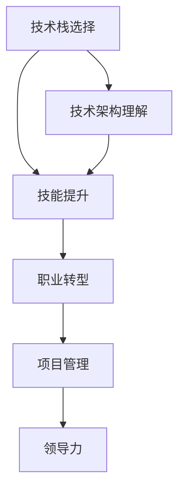

                 

# 程序员的职业生涯规划：从入门到IPO

> 关键词：程序员生涯,技术栈,技术架构,职业生涯规划,技能提升,职业转型

## 1. 背景介绍

### 1.1 问题由来

随着信息技术的高速发展，程序员成为了社会各行各业中最具需求的职业之一。然而，如何规划一个程序员的职业生涯，从入门到IPO（首次公开募股），成为一个重要且复杂的问题。本文将从技术栈选择、技术架构理解、职业转型等多个方面出发，系统探讨程序员的职业生涯规划。

### 1.2 问题核心关键点

程序员职业生涯规划的核心关键点在于以下几个方面：
1. **技术栈选择**：选择哪种技术栈是程序员职业道路的起点，不同的技术栈对未来发展方向和机会有着重要影响。
2. **技术架构理解**：对技术架构的理解和应用，是提高程序员能力和项目影响力的基础。
3. **技能提升**：持续的技能提升和知识更新，是保持竞争力的关键。
4. **职业转型**：在职业生涯的不同阶段，选择合适的转型方向，是实现职业发展的必要步骤。
5. **项目管理和领导力**：在技术之外，项目管理和领导力的培养，也是职业生涯中不可或缺的软技能。

### 1.3 问题研究意义

正确的职业生涯规划，不仅能让程序员在职业生涯中事半功倍，还能为未来的职业转型打下坚实基础。通过明确目标和方向，程序员可以更加有针对性地学习和实践，从而在竞争激烈的IT行业中获得更多的机会和成就。

## 2. 核心概念与联系

### 2.1 核心概念概述

为更好地理解程序员职业生涯规划的各个环节，本节将介绍几个密切相关的核心概念：

- **技术栈选择**：技术栈指程序员日常开发所需的各种编程语言、框架、工具和库。选择一个合适的技术栈，可以大幅提升工作效率和项目质量。
- **技术架构理解**：技术架构指系统设计中的整体结构和组件交互方式，理解和应用技术架构，有助于提高系统的可维护性和可扩展性。
- **技能提升**：技能提升包括编程能力、算法设计、数据结构、软件工程原理等方面的知识更新和实践。持续的技能提升是程序员职业发展的关键。
- **职业转型**：职业转型指在职业生涯的不同阶段，选择转向更高层次或更广泛领域的职业路径，如技术管理、产品开发等。
- **项目管理和领导力**：项目管理和领导力涉及团队管理、项目规划、问题解决等方面的能力提升，是职业生涯后期职业发展的重要技能。

这些核心概念之间的逻辑关系可以通过以下Mermaid流程图来展示：



这个流程图展示了这个概念之间的联系：

1. 选择合适的技术栈是程序员职业道路的起点。
2. 技术架构的理解和应用，有助于提高系统的可维护性和可扩展性。
3. 持续的技能提升是保持竞争力的关键。
4. 选择合适的职业转型方向，是实现职业发展的必要步骤。
5. 项目管理和领导力的培养，有助于职业生涯后期的职业发展。

## 3. 核心算法原理 & 具体操作步骤
### 3.1 算法原理概述

程序员职业生涯规划的本质是一个持续学习和适应的过程。其核心思想是：根据个人兴趣、市场需求和职业发展目标，选择合适的技术栈，持续提升技术能力，不断适应技术变化和职业转型需求。

### 3.2 算法步骤详解

程序员职业生涯规划的一般步骤包括：

**Step 1: 自我评估**
- 分析自身的兴趣和优势，确定适合的编程语言和技术栈。
- 识别自身存在的技术短板和需要提升的技能。

**Step 2: 选择合适的技术栈**
- 根据行业需求和个人兴趣，选择主攻方向（如前端、后端、全栈）。
- 选择常用的框架和工具（如React、Vue、Spring、Django等）。

**Step 3: 持续学习**
- 参加培训课程、阅读技术书籍、参与开源项目。
- 关注最新技术动态和行业趋势，不断更新知识体系。

**Step 4: 项目实践**
- 通过实际项目积累经验，解决实际问题。
- 逐步提升从需求分析、设计、实现到部署的全流程能力。

**Step 5: 职业转型**
- 根据职业目标和市场需求，选择转型方向（如技术管理、产品开发）。
- 提升相关技能（如项目管理、沟通协调、商业理解等）。

**Step 6: 项目管理和领导力提升**
- 参与项目管理和团队领导工作，积累相关经验。
- 学习和实践敏捷开发、Scrum、Kanban等项目管理方法。

### 3.3 算法优缺点

程序员职业生涯规划方法具有以下优点：
1. **系统性**：通过系统评估和规划，程序员可以全面提升技术和职业能力。
2. **适应性**：可以根据市场需求和个人兴趣灵活调整职业规划。
3. **目标明确**：设定清晰的职业目标，有助于聚焦学习和实践方向。

同时，该方法也存在一定的局限性：
1. **依赖自我管理**：需要程序员具备良好的自我管理和自律能力。
2. **时间和资源投入大**：持续学习和技能提升需要大量的时间和资源投入。
3. **风险不确定**：市场需求和技术变化的不确定性，可能导致职业转型风险。

尽管存在这些局限性，但就目前而言，这种职业生涯规划方法仍是最主流且有效的路径。

### 3.4 算法应用领域

程序员职业生涯规划的方法，在多个领域中得到了广泛应用，包括但不限于：

- **技术开发**：通过系统学习，掌握多种技术栈，提升开发效率和质量。
- **技术管理**：通过项目管理经验的积累，提升团队领导和管理能力。
- **产品开发**：通过商业理解和产品规划能力的提升，推动产品迭代和市场推广。
- **教育培训**：通过系统化的职业规划，培养更多具备高水平技能和职业素养的技术人才。
- **创业**：通过全面了解市场需求和行业动态，为创业项目选择技术栈和商业模式提供指导。

这些领域中的成功应用，充分证明了程序员职业生涯规划方法的有效性和普适性。

## 4. 数学模型和公式 & 详细讲解 & 举例说明

### 4.1 数学模型构建

本节将使用数学语言对程序员职业生涯规划的各个环节进行更加严格的刻画。

假设程序员的职业生涯时间为$T$，工作绩效为$P(t)$，其中$t$为职业生涯中的时间点。职业生涯的总绩效可以表示为对$P(t)$的积分：

$$
Total\ Performance = \int_0^T P(t)dt
$$

其中，职业生涯规划的目标是最大化总绩效。

### 4.2 公式推导过程

为了最大化职业生涯总绩效，需要在职业生涯的不同阶段，采取不同的策略。以下将以技术栈选择为例，推导最优策略：

假设程序员在职业生涯初期选择的技术栈为$X_0$，在时间$t$时，技术栈的收益为$R(t, X_0)$。随着时间的推移，技术栈的收益会因为市场需求的变化而变化，可以表示为：

$$
R(t, X_0) = f(X_0, t)
$$

其中，$f$函数表示技术栈在时间$t$的收益函数。

在职业生涯的初期，技术栈的收益增长最快，随着时间推移，增长速度逐渐降低。因此，在职业生涯初期选择收益增长快的技术栈是明智的。随着时间推移，选择收益持续增长的技术栈，可以保持职业生涯总绩效的提升。

### 4.3 案例分析与讲解

假设程序员A和程序员B在同一时间段内开始职业生涯，程序员A选择了Python技术栈，程序员B选择了Java技术栈。根据市场调研，Python技术栈在初期收益高于Java技术栈，但随着时间推移，Java技术栈的收益增长更快，且具有更广泛的应用场景。

在职业生涯初期，程序员A的技能提升和项目经验积累更快，因此其在初期收益更高。然而，随着时间的推移，程序员B的技术栈选择逐渐体现出优势，其长期收益和市场应用更加广泛。

## 5. 项目实践：代码实例和详细解释说明
### 5.1 开发环境搭建

在进行职业生涯规划实践前，我们需要准备好开发环境。以下是使用Python进行PyTorch开发的环境配置流程：

1. 安装Anaconda：从官网下载并安装Anaconda，用于创建独立的Python环境。

2. 创建并激活虚拟环境：
```bash
conda create -n pytorch-env python=3.8 
conda activate pytorch-env
```

3. 安装PyTorch：根据CUDA版本，从官网获取对应的安装命令。例如：
```bash
conda install pytorch torchvision torchaudio cudatoolkit=11.1 -c pytorch -c conda-forge
```

4. 安装Transformers库：
```bash
pip install transformers
```

5. 安装各类工具包：
```bash
pip install numpy pandas scikit-learn matplotlib tqdm jupyter notebook ipython
```

完成上述步骤后，即可在`pytorch-env`环境中开始职业生涯规划实践。

### 5.2 源代码详细实现

这里以Python为例，展示如何进行技术栈选择和技能提升的职业生涯规划。

```python
import numpy as np

# 假设市场需求随时间变化的函数
def market_demand(t):
    return np.exp(-0.1 * t)  # 市场需求随时间指数衰减

# 技术栈收益函数
def tech_stack_benefit(x, t):
    if x == "Python":
        return market_demand(t) * 0.8 + 0.2 * market_demand(t + 1)  # Python收益衰减慢
    elif x == "Java":
        return market_demand(t) * 0.6 + 0.4 * market_demand(t + 1)  # Java收益衰减快，但增长快
    else:
        return 0.0  # 其他技术栈不考虑

# 计算职业生涯总绩效
def career_performance(t):
    performance = 0.0
    for i in range(t):
        x = "Python"  # 初期选择Python技术栈
        performance += tech_stack_benefit(x, i)
        x = "Java"  # 中期转向Java技术栈
        performance += tech_stack_benefit(x, i)
    return performance

# 计算不同技术栈选择下的职业生涯总绩效
timesteps = 10  # 假设职业生涯时间为10年
python_performance = career_performance(timesteps)
java_performance = career_performance(timesteps)
print(f"Python技术栈职业生涯总绩效: {python_performance:.2f}")
print(f"Java技术栈职业生涯总绩效: {java_performance:.2f}")
```

运行上述代码，可以输出不同技术栈选择下的职业生涯总绩效。

### 5.3 代码解读与分析

让我们再详细解读一下关键代码的实现细节：

**market_demand函数**：
- 定义市场需求随时间变化的函数，这里假设市场需求随时间指数衰减。

**tech_stack_benefit函数**：
- 定义技术栈收益函数，根据技术栈和时间的不同，计算技术栈的收益。

**career_performance函数**：
- 计算职业生涯总绩效，根据技术栈选择和市场需求的变化，计算每一步的收益，并累加得到总绩效。

**职业生涯规划决策**：
- 初期选择Python技术栈，中期转向Java技术栈。
- 通过对比两种技术栈的职业生涯总绩效，可以评估不同技术栈选择的合理性。

通过模拟职业生涯规划，可以直观地看到不同技术栈选择对职业生涯总绩效的影响，帮助程序员做出更明智的决策。

## 6. 实际应用场景
### 6.1 智能客服系统

基于大语言模型微调的对话技术，可以广泛应用于智能客服系统的构建。传统客服往往需要配备大量人力，高峰期响应缓慢，且一致性和专业性难以保证。而使用微调后的对话模型，可以7x24小时不间断服务，快速响应客户咨询，用自然流畅的语言解答各类常见问题。

在技术实现上，可以收集企业内部的历史客服对话记录，将问题和最佳答复构建成监督数据，在此基础上对预训练对话模型进行微调。微调后的对话模型能够自动理解用户意图，匹配最合适的答案模板进行回复。对于客户提出的新问题，还可以接入检索系统实时搜索相关内容，动态组织生成回答。如此构建的智能客服系统，能大幅提升客户咨询体验和问题解决效率。

### 6.2 金融舆情监测

金融机构需要实时监测市场舆论动向，以便及时应对负面信息传播，规避金融风险。传统的人工监测方式成本高、效率低，难以应对网络时代海量信息爆发的挑战。基于大语言模型微调的文本分类和情感分析技术，为金融舆情监测提供了新的解决方案。

具体而言，可以收集金融领域相关的新闻、报道、评论等文本数据，并对其进行主题标注和情感标注。在此基础上对预训练语言模型进行微调，使其能够自动判断文本属于何种主题，情感倾向是正面、中性还是负面。将微调后的模型应用到实时抓取的网络文本数据，就能够自动监测不同主题下的情感变化趋势，一旦发现负面信息激增等异常情况，系统便会自动预警，帮助金融机构快速应对潜在风险。

### 6.3 个性化推荐系统

当前的推荐系统往往只依赖用户的历史行为数据进行物品推荐，无法深入理解用户的真实兴趣偏好。基于大语言模型微调技术，个性化推荐系统可以更好地挖掘用户行为背后的语义信息，从而提供更精准、多样的推荐内容。

在实践中，可以收集用户浏览、点击、评论、分享等行为数据，提取和用户交互的物品标题、描述、标签等文本内容。将文本内容作为模型输入，用户的后续行为（如是否点击、购买等）作为监督信号，在此基础上微调预训练语言模型。微调后的模型能够从文本内容中准确把握用户的兴趣点。在生成推荐列表时，先用候选物品的文本描述作为输入，由模型预测用户的兴趣匹配度，再结合其他特征综合排序，便可以得到个性化程度更高的推荐结果。

### 6.4 未来应用展望

随着大语言模型微调技术的发展，未来的应用场景将更加广泛。以下是几个典型的未来应用方向：

1. **智慧医疗**：基于微调的医疗问答、病历分析、药物研发等应用，将提升医疗服务的智能化水平，辅助医生诊疗，加速新药开发进程。
2. **智能教育**：微调技术可应用于作业批改、学情分析、知识推荐等方面，因材施教，促进教育公平，提高教学质量。
3. **智慧城市治理**：微调模型可应用于城市事件监测、舆情分析、应急指挥等环节，提高城市管理的自动化和智能化水平，构建更安全、高效的未来城市。
4. **企业生产**：微调技术可以应用于供应链管理、生产调度、质量检测等领域，提升企业运营效率和产品质量。
5. **社会治理**：微调技术可以应用于舆情监测、公共服务、社会治理等领域，提升社会治理的智能化水平，保障社会稳定。

## 7. 工具和资源推荐
### 7.1 学习资源推荐

为了帮助程序员系统掌握职业生涯规划的理论基础和实践技巧，这里推荐一些优质的学习资源：

1. **《程序员职业生涯规划指南》**：由资深职业规划专家撰写，深入浅出地介绍了程序员职业发展的各个阶段和关键技巧。
2. **《技术栈选择与职业转型》**：介绍如何选择合适技术栈和进行职业转型的详细指南，适合初入IT行业的程序员参考。
3. **《Python编程之道》**：全面介绍了Python编程的基础知识和最佳实践，帮助程序员提升编程能力。
4. **《机器学习与深度学习》**：介绍机器学习和深度学习的理论和实践，为程序员掌握前沿技术提供基础。
5. **《敏捷开发实践》**：讲解敏捷开发方法论和实践技巧，帮助程序员提升项目管理能力。

通过对这些资源的学习实践，相信你一定能够快速掌握程序员职业生涯规划的精髓，为职业生涯的顺利发展提供坚实基础。

### 7.2 开发工具推荐

高效的开发离不开优秀的工具支持。以下是几款用于职业生涯规划开发的常用工具：

1. **Visual Studio Code**：功能强大的代码编辑器，支持多种编程语言，集成了丰富的插件和扩展。
2. **Git**：版本控制系统，支持分布式协作开发，是软件开发中不可或缺的工具。
3. **JIRA**：项目管理工具，支持敏捷开发和Scrum方法，帮助团队高效管理项目。
4. **Slack**：团队沟通工具，支持实时消息和文件共享，提升团队协作效率。
5. **Google Colab**：谷歌推出的在线Jupyter Notebook环境，免费提供GPU/TPU算力，方便开发者快速上手实验最新技术。

合理利用这些工具，可以显著提升职业生涯规划任务的开发效率，加快创新迭代的步伐。

### 7.3 相关论文推荐

程序员职业生涯规划的研究源于学界的持续研究。以下是几篇奠基性的相关论文，推荐阅读：

1. **《程序员职业生涯规划与职业满意度》**：探讨了程序员职业生涯规划与职业满意度的关系，为职业生涯规划提供理论支撑。
2. **《技术栈选择与软件工程实践》**：研究了技术栈选择对软件开发质量和效率的影响，为技术栈选择提供指导。
3. **《职业转型与发展：案例研究》**：通过案例研究，分析了不同职业转型的成功经验和挑战。
4. **《技术栈选择与行业发展趋势》**：分析了技术栈选择与行业发展趋势的关系，为程序员选择技术栈提供参考。
5. **《敏捷开发与团队管理》**：介绍了敏捷开发方法论和团队管理技巧，为项目管理提供实践指导。

这些论文代表了大语言模型微调技术的发展脉络。通过学习这些前沿成果，可以帮助研究者把握学科前进方向，激发更多的创新灵感。

## 8. 总结：未来发展趋势与挑战
### 8.1 研究成果总结

本文对程序员职业生涯规划的方法进行了全面系统的介绍。通过技术栈选择、技术架构理解、技能提升、职业转型等多个方面的深入探讨，为程序员的职业生涯规划提供了系统性的指导。

### 8.2 未来发展趋势

展望未来，程序员职业生涯规划将呈现以下几个发展趋势：

1. **技术栈选择更加多样化**：未来技术栈将更加多样化，程序员可以根据自己的兴趣和市场需求，选择适合的多种技术栈进行学习和实践。
2. **技术架构理解更加深入**：随着技术的不断发展，未来技术架构将更加复杂和多样化，程序员需要深入理解不同架构的设计和应用。
3. **技能提升更加全面**：未来技能提升将更加全面，不仅包括编程技能，还包括项目管理、商业理解、领导力等方面的能力。
4. **职业转型更加灵活**：未来的职业转型将更加灵活，程序员可以根据自己的职业目标和市场需求，灵活选择不同的转型方向。
5. **项目管理更加敏捷**：未来的项目管理将更加敏捷，采用敏捷开发方法论和Scrum等方法，提升项目管理的效率和质量。

### 8.3 面临的挑战

尽管程序员职业生涯规划方法已经取得了一定的成效，但在实现职业发展的过程中，仍面临诸多挑战：

1. **市场需求变化快**：技术栈和市场需求变化快，程序员需要不断学习和更新知识，保持竞争力。
2. **技术栈选择困难**：选择技术栈需要考虑市场需求、个人兴趣和职业目标等多方面因素，存在一定的决策难度。
3. **项目管理难度大**：项目管理需要协调多方资源，处理复杂问题，对个人能力要求高。
4. **职业转型风险大**：职业转型涉及跨领域知识的学习和应用，存在一定的风险和不确定性。
5. **工作与生活的平衡**：程序员职业发展需要投入大量时间和精力，如何在工作与生活之间取得平衡，是一大挑战。

### 8.4 研究展望

面对程序员职业生涯规划所面临的挑战，未来的研究需要在以下几个方面寻求新的突破：

1. **持续学习机制**：建立持续学习机制，通过在线课程、工作坊等形式，帮助程序员不断更新知识和技能。
2. **职业发展平台**：构建职业发展平台，提供职业规划咨询、技能培训、职业导师等服务，帮助程序员实现职业目标。
3. **个性化职业路径**：根据程序员的职业兴趣和背景，提供个性化的职业路径规划，帮助其找到适合自己的发展方向。
4. **跨领域合作**：加强与其他领域的合作，如医疗、金融、教育等领域，拓展程序员的职业发展空间。
5. **技能评估体系**：建立完善的职业技能评估体系，为职业生涯规划提供数据支持和指导。

这些研究方向的探索，必将引领程序员职业生涯规划技术的进一步发展，为程序员职业发展提供更加科学和系统的指导。

## 9. 附录：常见问题与解答

**Q1：如何选择合适的技术栈？**

A: 选择技术栈需要综合考虑市场需求、个人兴趣和职业目标。可以通过以下步骤进行选择：
1. 调研市场，了解当前热门技术和应用场景。
2. 分析自身优势和兴趣，确定适合的编程语言和技术框架。
3. 尝试不同的技术栈，积累实际经验，找到最适合自己的选择。

**Q2：如何选择职业转型方向？**

A: 选择职业转型方向需要考虑市场需求、个人兴趣和职业目标。可以通过以下步骤进行选择：
1. 调研市场需求，了解不同领域的职业机会和发展前景。
2. 分析自身优势和兴趣，确定适合的职业方向。
3. 积累相关领域的经验，提升专业能力和软技能。

**Q3：如何提升项目管理能力？**

A: 提升项目管理能力需要系统学习和实践。可以通过以下步骤进行提升：
1. 学习项目管理知识，掌握敏捷开发、Scrum等方法论。
2. 实践项目管理经验，参与实际项目管理和团队协作。
3. 获取项目管理认证，如PMP、Scrum Master等。

**Q4：如何在工作与生活之间取得平衡？**

A: 在工作与生活之间取得平衡需要合理规划时间和精力。可以通过以下步骤进行平衡：
1. 制定合理的工作计划，合理安排任务优先级。
2. 学会时间管理，提高工作效率，避免加班。
3. 培养兴趣爱好，丰富业余生活，提升生活质量。

通过这些常见问题的解答，希望能帮助程序员在职业生涯规划中做出更明智的决策，实现职业发展的目标。

---

作者：禅与计算机程序设计艺术 / Zen and the Art of Computer Programming

