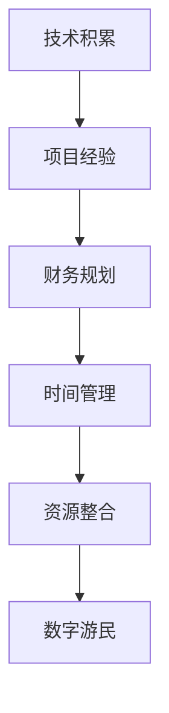

                 

# 程序员的财务自由：数字游民生活

数字游民（Digital Nomad）已经成为当前时代的一个热门标签，尤其对于程序员这一职业群体来说，它代表着一种全新的生活方式和工作模式。本文将深入探讨程序员如何通过掌握技术、运用智慧和整合资源，实现财务自由，进而过上数字游民生活。文章将分为以下几部分：背景介绍、核心概念与联系、核心算法原理及操作步骤、数学模型和公式推导、项目实践、实际应用场景、工具和资源推荐、总结、未来发展趋势与挑战以及常见问题解答。

## 1. 背景介绍

### 1.1 问题由来
随着互联网和信息技术的飞速发展，传统的全职工作模式正在逐渐被远程办公、灵活工作时间、自由职业等新型工作模式所取代。尤其是在软件开发和IT行业，越来越多的程序员开始追求一种更加自由、灵活的工作方式，从而涌现出了数字游民这一新兴群体。数字游民通常指的是那些利用互联网和通讯技术，不受地域限制，可以在全球任何地方工作和生活的人。

### 1.2 问题核心关键点
实现财务自由和成为数字游民，是许多程序员追求的终极目标。但这一目标的实现并不简单，需要程序员掌握多种技能、有效管理财务，并构建一套系统化的方法论。关键点包括：

1. **技术积累**：具备扎实的编程能力和技术栈知识，能够解决复杂的技术问题。
2. **项目经验**：通过实际项目积累经验，建立自己的项目组合，提升市场竞争力。
3. **财务规划**：制定合理的财务计划，控制开支，增加被动收入。
4. **时间管理**：高效管理时间，确保工作与生活平衡，享受游民生活。
5. **资源整合**：利用技术手段和平台，整合各种资源，提升工作效率和收益。

## 2. 核心概念与联系

### 2.1 核心概念概述

为更好地理解程序员实现财务自由和数字游民生活的方法论，本节将介绍几个关键概念：

- **财务自由**：指个人或家庭的收入主要来源于被动收入（如投资、版权、专利等），而不再依赖于主动收入（如工资、奖金等）。
- **数字游民**：利用互联网和通讯技术，不受地域限制，可以在全球任何地方工作和生活的人。
- **技术栈知识**：指程序员掌握的各种编程语言、框架、工具和算法等。
- **项目组合**：程序员通过多个项目积累经验，提升市场竞争力。
- **被动收入**：指不需要投入大量时间和精力，就能持续获得收入的渠道，如投资回报、网站广告、软件开发包等。
- **财务规划**：通过科学合理地规划收入和支出，达到财务自由的目标。

### 2.2 核心概念原理和架构的 Mermaid 流程图



这个流程图展示了程序员实现财务自由和数字游民生活的核心概念及其之间的联系。从技术积累到项目经验，再到财务规划和时间管理，最后整合资源，最终实现数字游民生活。

## 3. 核心算法原理 & 具体操作步骤

### 3.1 算法原理概述

程序员实现财务自由和数字游民生活的方法论，本质上是一种多目标优化算法。目标包括提升技术能力、积累项目经验、管理财务、高效时间利用和整合资源，最终达到财务自由和游民生活的状态。

### 3.2 算法步骤详解

**Step 1: 技术积累**
- **学习新技能**：定期参加在线课程、技术会议和研讨会，学习最新的编程语言、框架和工具。
- **参与开源项目**：积极参与GitHub等平台的开源项目，提升代码质量和项目管理能力。
- **实际项目实战**：通过实际项目积累经验，提升解决复杂问题的能力。

**Step 2: 项目经验**
- **构建项目组合**：选择有潜力的项目，开发并发布到GitHub、博客等平台，展示自己的技术实力。
- **获取反馈**：积极与社区交流，获取用户和同行的反馈，不断改进和优化项目。
- **优化简历**：将项目经验整合到简历中，提升在求职和合作中的竞争力。

**Step 3: 财务规划**
- **预算管理**：制定月度和年度预算，控制开支，增加储蓄。
- **多元化收入**：通过投资、自由职业、博客、视频课程等方式增加被动收入。
- **财务分析**：定期分析财务状况，调整投资策略，优化财务结构。

**Step 4: 时间管理**
- **优先级排序**：使用优先级矩阵或四象限法则，优先处理重要且紧急的任务。
- **时间块管理**：将工作时间划分为若干时间块，集中处理类似任务，提升效率。
- **休息与放松**：合理安排休息时间，避免过度劳累，保持身心健康。

**Step 5: 资源整合**
- **利用工具和平台**：使用Trello、Notion、Slack等工具提高团队协作效率，使用Stripe、PayPal等平台进行财务管理。
- **建立网络**：积极参加行业会议、交流活动，与同行建立联系，获取更多合作机会。
- **持续学习**：利用Coursera、Udemy等平台，持续学习新知识和技能，保持竞争力。

### 3.3 算法优缺点

**优点：**
- **灵活性高**：不受地域限制，可以全球工作和生活，享受不同文化和环境。
- **工作效率高**：通过时间管理和资源整合，提升工作效率，增加产出。
- **多元化收入**：通过多种收入来源，降低风险，增加财务稳定性。

**缺点：**
- **自律要求高**：需要高度自律，确保工作时间和生活时间的平衡。
- **风险较高**：自由职业和被动收入不稳定，需要具备较强的风险管理能力。
- **社交障碍**：长时间远程工作可能减少面对面的社交机会。

### 3.4 算法应用领域

基于上述方法论，程序员可以在多个领域实现财务自由和数字游民生活，例如：

- **软件开发**：通过自由职业项目、开源贡献和技术博客，增加收入来源。
- **数据分析**：利用数据分析技能，提供定制化服务，建立稳定的客户群体。
- **产品经理**：通过管理产品团队，推动产品创新，获得高额薪酬和股票激励。
- **设计师**：通过远程设计服务，为全球客户提供高性价比的视觉设计服务。
- **内容创作者**：通过撰写博客、视频、播客等，积累粉丝，获得广告、赞助和打赏收入。

## 4. 数学模型和公式 & 详细讲解 & 举例说明

### 4.1 数学模型构建

为方便讨论，假设程序员的时间、技能和资源投入为X，产出的财务收入为Y。构建一个简单的数学模型，来表示这一过程：

$$ Y = f(X) $$

其中，$f(X)$为投入产出函数，表示投入X所得到的产出Y。

### 4.2 公式推导过程

- **技术积累**：设程序员每年投入$X_t$学习新技能和参与项目，则每年的技术提升可以表示为：

$$ \Delta X_t = \alpha \times X_t $$

其中$\alpha$为技术积累的转换效率，通常$\alpha$小于1。

- **项目经验**：设程序员每年完成$N_p$个项目，每个项目带来的收入为$I_p$，则项目经验带来的总收入为：

$$ Y_p = N_p \times I_p $$

- **财务规划**：设每年预算为$B$，节省率为$r$，则每年净增收入为：

$$ Y_f = B \times (1 - r) $$

- **时间管理**：设每年有效工作时间为$T_w$，时间管理提升率为$\beta$，则每年通过时间管理增加的收入为：

$$ Y_m = \beta \times T_w $$

- **资源整合**：设每年通过资源整合增加的收入为$Y_r$，则总产出为：

$$ Y = Y_p + Y_f + Y_m + Y_r $$

### 4.3 案例分析与讲解

假设一位程序员每年投入10%的时间学习新技能和参与项目，完成5个项目，每个项目带来10000美元的收入。每年预算为20000美元，节省率为20%，有效工作时间为2000小时，时间管理提升率为15%，通过资源整合增加的收入为5000美元。

代入公式计算：

$$ Y_p = 5 \times 10000 = 50000 $$
$$ Y_f = 20000 \times (1 - 0.2) = 16000 $$
$$ Y_m = 0.15 \times 2000 = 300 $$
$$ Y = 50000 + 16000 + 300 + 5000 = 71100 $$

通过上述模型，可以看到，这位程序员每年有望增加近71000美元的收入，从而逐步实现财务自由，过上数字游民生活。

## 5. 项目实践：代码实例和详细解释说明

### 5.1 开发环境搭建

为了便于项目管理和测试，可以使用Jupyter Notebook搭建开发环境。安装Python、Pip、Anaconda等工具，搭建虚拟环境，并使用Jupyter Notebook进行代码编写和测试。

### 5.2 源代码详细实现

以下是一个简单的Python代码示例，用于计算程序员的总收入：

```python
from sympy import symbols, Rational

# 定义变量
X_t, N_p, I_p, B, r, T_w, beta, Y_r = symbols('X_t N_p I_p B r T_w beta Y_r')

# 技术积累
delta_X_t = Rational(1, 10) * X_t

# 项目经验
Y_p = N_p * I_p

# 财务规划
Y_f = B * (1 - r)

# 时间管理
Y_m = beta * T_w

# 资源整合
Y_r = Y_r

# 总产出
Y = Y_p + Y_f + Y_m + Y_r

# 代入具体数值
Y.subs({X_t: 10, N_p: 5, I_p: 10000, B: 20000, r: 0.2, T_w: 2000, beta: 0.15, Y_r: 5000})
```

### 5.3 代码解读与分析

以上代码通过符号计算，计算了程序员的总收入。其中，`Rational`用于精确表示分数，`subs`方法用于替换变量值。

## 6. 实际应用场景

### 6.1 软件开发

软件开发是程序员实现财务自由和数字游民生活的典型场景。例如，通过Freelancer、Upwork等平台接自由职业项目，提升技术栈，展示项目成果，增加收入。

### 6.2 数据分析

数据分析师可以利用数据分析技能，提供定制化服务，建立稳定的客户群体。例如，通过Kaggle等平台接数据分析项目，提供数据可视化和报告，获得高额报酬。

### 6.3 产品经理

产品经理通过管理产品团队，推动产品创新，获得高额薪酬和股票激励。例如，加入初创公司，从0到1打造产品，获得股权激励和长期报酬。

### 6.4 设计师

设计师通过远程设计服务，为全球客户提供高性价比的视觉设计服务。例如，使用Behance展示作品，通过Upwork等平台接设计项目，提升品牌知名度和收入。

### 6.5 内容创作者

内容创作者通过撰写博客、视频、播客等，积累粉丝，获得广告、赞助和打赏收入。例如，通过Medium、YouTube等平台发布内容，获得稳定收入。

## 7. 工具和资源推荐

### 7.1 学习资源推荐

- **Coursera**：提供大量计算机科学和编程课程，帮助程序员掌握新技术。
- **Udemy**：提供丰富的自由职业和远程工作课程，帮助程序员提升技能。
- **GitHub**：提供开源项目平台，帮助程序员积累项目经验。
- **Kaggle**：提供数据科学竞赛平台，帮助数据分析师提升技术能力。

### 7.2 开发工具推荐

- **Git**：版本控制工具，帮助程序员管理代码。
- **Jupyter Notebook**：数据科学和编程工具，支持代码编写、数据可视化和互动分析。
- **Trello**：项目管理工具，帮助程序员规划任务和团队协作。
- **Notion**：笔记和知识管理工具，帮助程序员记录和整理信息。
- **Slack**：即时通讯工具，帮助程序员高效沟通。

### 7.3 相关论文推荐

- **《The Programmer's Financial Freedom》**：探讨程序员实现财务自由的策略和方法。
- **《Digital Nomad Handbook》**：提供数字游民生活方式和工作的详细指南。
- **《How to Build a Freelance Business》**：提供自由职业和远程工作管理的实用技巧。

## 8. 总结：未来发展趋势与挑战

### 8.1 研究成果总结

本文通过数学模型和案例分析，展示了程序员实现财务自由和数字游民生活的多目标优化方法。通过技术积累、项目经验、财务规划、时间管理和资源整合，程序员可以逐步实现财务自由，过上数字游民生活。

### 8.2 未来发展趋势

未来，随着远程工作和自由职业的普及，数字游民将成为常态。程序员可以通过不断学习和技术迭代，积累更多项目经验，提升收入水平，享受更自由、更高效的工作和生活方式。

### 8.3 面临的挑战

- **技术迭代快速**：新技术和工具不断涌现，程序员需要不断学习和适应。
- **市场竞争激烈**：自由职业市场竞争激烈，需要具备更高的竞争力和市场敏感度。
- **社交隔离问题**：长时间远程工作可能导致社交障碍，需要积极应对。
- **健康管理问题**：长时间工作可能导致健康问题，需要合理安排工作和休息时间。

### 8.4 研究展望

未来，数字游民技术将不断发展，为程序员提供更多支持。例如，通过AI工具辅助项目管理、自动化代码测试、智能财务分析等，进一步提升工作效率和收入水平。

## 9. 附录：常见问题与解答

**Q1：程序员实现财务自由和数字游民生活的关键是什么？**

A: 实现财务自由和数字游民生活的关键在于不断积累技术栈知识、项目经验，有效管理财务和时间，整合各种资源。

**Q2：程序员应该如何选择项目？**

A: 选择有潜力、市场需求大、技术难度适中的项目。同时，可以通过GitHub等平台展示项目成果，吸引更多客户。

**Q3：如何管理时间？**

A: 使用时间块管理、优先级排序等方法，合理安排工作和生活时间，确保高效工作，享受游民生活。

**Q4：如何降低风险？**

A: 多元化收入来源，通过投资、自由职业、博客、视频课程等方式增加收入。同时，保持财务储备，应对突发情况。

**Q5：如何应对社交隔离问题？**

A: 积极参加行业会议、交流活动，与同行建立联系，利用在线平台与客户和团队沟通。

作者：禅与计算机程序设计艺术 / Zen and the Art of Computer Programming

