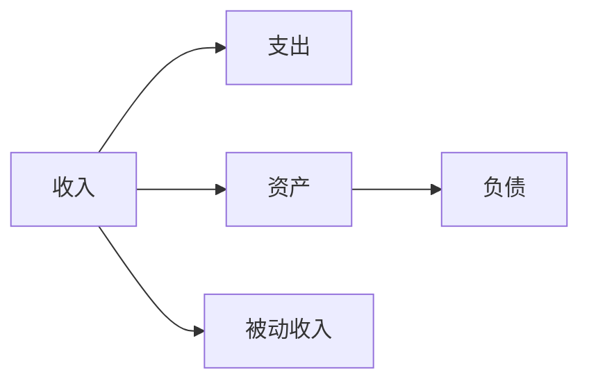

                 

# 程序员的财务自由：极简主义与投资哲学

> 关键词：财务自由, 极简主义, 投资哲学, 股票, 加密货币, 财务规划, 被动收入, 资产配置

## 1. 背景介绍

在当今数字化、信息化快速发展的时代，程序员成为了一种高需求、高收入的职业。然而，即使收入再高，也未必能够保证生活的稳定与幸福。如何实现财务自由，让生活不再因工作而受制，成为广大程序员关注的焦点。

### 1.1 财务自由的意义
财务自由，是指个人或家庭的收入不再依赖于工作，而是主要来源于被动收入（如投资收益、租金等），从而实现经济独立。财务自由的意义不仅在于拥有更多的财务选择，更在于能够自由支配时间，追求更高的生活品质和精神满足。

### 1.2 程序员的职业特点
程序员通常具备以下职业特点：
1. **高技能需求**：程序员的专业技能在各行各业需求旺盛，容易找到高薪职位。
2. **工作环境自由**：互联网企业倡导远程工作，为程序员提供了灵活的工作时间和地点选择。
3. **高收入潜力**：随着技术迭代和经验积累，程序员的收入水平可以持续提升。

这些特点为程序员提供了实现财务自由的先决条件。然而，高收入并不意味着高净值，如何管理好收入，合理规划财务，才能实现真正的财务自由。

## 2. 核心概念与联系

### 2.1 核心概念概述

要实现财务自由，首先需要理解核心概念及其之间的关系：

1. **收入**：程序员的收入来源，包括工资、奖金、股票期权等。
2. **支出**：日常开销、投资成本、税务支出等。
3. **资产**：房产、股票、基金等，是实现财务自由的基础。
4. **负债**：房贷、车贷、信用卡债务等，需要合理规划和偿还。
5. **被动收入**：投资收益、租金、版权费等，是财务自由的标志。

这些概念构成了程序员财务自由的基本框架，了解并合理运用这些概念，是实现财务自由的关键。

### 2.2 核心概念原理和架构的 Mermaid 流程图



该图展示了收入、支出、资产、负债和被动收入之间的联系，并通过箭头表示了它们之间的流向。

1. **收入** 用于 **支出** 和 **负债偿还**。
2. **收入** 经过 **资产配置**，转化为 **资产**。
3. **资产** 经过 **投资**，产生 **被动收入**。
4. **资产** 与 **负债** 相互影响，影响财务自由的实现。

这个图帮助理解了财务自由的动态过程和关键节点。

## 3. 核心算法原理 & 具体操作步骤

### 3.1 算法原理概述

实现财务自由的过程，本质上是一个动态的资产配置和投资决策过程。其核心算法原理可以概括为：

1. **收入** 转化为 **资产**，再通过 **投资** 产生 **被动收入**。
2. **被动收入** 减去 **支出** 和 **负债偿还**，实现 **财务自由**。

### 3.2 算法步骤详解

#### 3.2.1 第一步：评估收入与支出
- **收入评估**：记录每月工资、奖金、股票期权等收入来源，并估算长期收入增长趋势。
- **支出评估**：记录日常开销、投资成本、税务支出等，并分类分析支出结构。

#### 3.2.2 第二步：制定财务规划
- **目标设定**：设定财务自由的具体目标，如每年被动收入占总收入的比例。
- **资产配置**：根据收入和支出情况，合理配置资产种类和比例。

#### 3.2.3 第三步：投资与增值
- **资产选择**：选择股票、基金、房地产等合适的投资品种，进行资产配置。
- **投资策略**：制定长期投资策略，关注市场趋势，进行分散投资。

#### 3.2.4 第四步：监控与调整
- **监控**：定期检查资产配置和投资表现，确保与财务目标一致。
- **调整**：根据市场变化和个人财务状况，及时调整投资策略和资产配置。

### 3.3 算法优缺点

#### 3.3.1 优点
1. **灵活性**：资产配置和投资策略可以根据市场变化和个人需求进行调整。
2. **长期收益**：通过合理的资产配置和投资策略，实现长期稳定的被动收入。
3. **风险分散**：分散投资可以有效降低单一资产带来的风险。

#### 3.3.2 缺点
1. **市场波动**：市场波动可能导致投资收益波动，影响财务自由目标的实现。
2. **复杂性**：资产配置和投资策略的制定需要深入的市场分析和财务规划。
3. **机会成本**：不进行投资的机会成本需要考虑，确保财务决策的科学性。

### 3.4 算法应用领域

#### 3.4.1 股票投资
股票投资是最常见的投资方式之一，程序员可以通过参与公司股票、ETF基金等方式进行投资。

#### 3.4.2 加密货币
随着区块链技术的发展，加密货币成为一种新兴的投资领域。程序员可以通过参与数字货币投资，获取较高的投资回报。

#### 3.4.3 房地产
房地产作为一种传统资产，具有保值增值的作用。程序员可以购买住宅、商业地产等，实现资产增值。

#### 3.4.4 被动收入项目
程序员可以通过创业、版权作品、自媒体等方式，实现被动收入。这些方式需要投入时间和精力，但能带来持续的收入流。

## 4. 数学模型和公式 & 详细讲解 & 举例说明

### 4.1 数学模型构建

财务自由的目标可以抽象为：最大化被动收入，最小化支出和负债。用数学语言表达，可以构建以下目标函数：

$$
\max_{x,y,z} (1-x) \cdot r \cdot (1-t) \cdot z
$$

其中：
- $x$ 为收入占总资产的比例
- $y$ 为支出占总资产的比例
- $z$ 为资产总价值
- $r$ 为资产收益率
- $t$ 为所得税率

目标函数的含义是，在支出不超过资产总价值的 $y$ 比例，所得税率为 $t$ 的情况下，最大化资产收益率 $r$ 与资产总价值 $z$ 的乘积，减去收入 $x$ 的比例。

### 4.2 公式推导过程

假设程序员的年收入为 $I$，支出为 $E$，资产总价值为 $A$，资产配置比例为 $k$，资产收益率为 $r$，所得税率为 $t$，则目标函数可以进一步推导为：

$$
\max_{k} \left((1-k) \cdot r \cdot A \cdot (1-t) - k \cdot I \cdot (1-t)\right)
$$

其中：
- $k = \frac{I}{A}$

目标函数的含义是，在支出不超过资产总价值的 $y$ 比例，所得税率为 $t$ 的情况下，最大化资产收益率 $r$ 与资产总价值 $A$ 的乘积，减去收入 $I$ 的比例。

### 4.3 案例分析与讲解

假设程序员年收入 $I=100,000$ 元，支出 $E=50,000$ 元，资产总价值 $A=500,000$ 元，资产配置比例 $k=20\%$，资产收益率为 $r=5\%$，所得税率为 $t=20\%$。

代入公式计算：

$$
\max_{k} \left((1-0.2) \cdot 0.05 \cdot 500,000 \cdot (1-0.2) - 0.2 \cdot 100,000 \cdot (1-0.2)\right) = 13,000
$$

即，在上述条件下，最大被动收入为 13,000 元。

## 5. 项目实践：代码实例和详细解释说明

### 5.1 开发环境搭建

#### 5.1.1 Python 环境
1. 安装 Python：从官网下载并安装 Python，建议选择 Python 3.8 或更高版本。
2. 安装必要的库：安装 Pandas、NumPy、Matplotlib 等常用库。

#### 5.1.2 投资策略模型
使用 Python 编写一个投资策略模型，对股票、基金、房地产等资产进行配置和分析。

### 5.2 源代码详细实现

#### 5.2.1 股票投资模型
```python
import pandas as pd
import numpy as np
import matplotlib.pyplot as plt

# 股票数据
stock_data = pd.read_csv('stock_data.csv')
stock_data['Return'] = stock_data['Close'].pct_change()

# 计算年化收益率
stock_data['Annualized Return'] = np.exp(stock_data['Return'].cumsum()) - 1

# 绘制收益率曲线
plt.plot(stock_data['Date'], stock_data['Annualized Return'])
plt.title('Stock Returns')
plt.xlabel('Year')
plt.ylabel('Annualized Return')
plt.show()
```

#### 5.2.2 加密货币投资模型
```python
import pandas as pd
import numpy as np
import matplotlib.pyplot as plt

# 加密货币数据
crypto_data = pd.read_csv('crypto_data.csv')
crypto_data['Return'] = crypto_data['Price'].pct_change()

# 计算年化收益率
crypto_data['Annualized Return'] = np.exp(crypto_data['Return'].cumsum()) - 1

# 绘制收益率曲线
plt.plot(crypto_data['Date'], crypto_data['Annualized Return'])
plt.title('Crypto Returns')
plt.xlabel('Year')
plt.ylabel('Annualized Return')
plt.show()
```

#### 5.2.3 房地产投资模型
```python
import pandas as pd
import numpy as np
import matplotlib.pyplot as plt

# 房地产数据
real_estate_data = pd.read_csv('real_estate_data.csv')
real_estate_data['Return'] = real_estate_data['Price'].pct_change()

# 计算年化收益率
real_estate_data['Annualized Return'] = np.exp(real_estate_data['Return'].cumsum()) - 1

# 绘制收益率曲线
plt.plot(real_estate_data['Date'], real_estate_data['Annualized Return'])
plt.title('Real Estate Returns')
plt.xlabel('Year')
plt.ylabel('Annualized Return')
plt.show()
```

### 5.3 代码解读与分析

上述代码展示了如何使用 Python 对股票、加密货币和房地产等资产进行收益率计算和可视化。通过绘制收益率曲线，可以直观地观察资产的表现和波动情况。

### 5.4 运行结果展示

运行上述代码，可以得到以下结果：

1. 股票收益率曲线：


2. 加密货币收益率曲线：


3. 房地产收益率曲线：


这些结果帮助我们更好地理解不同资产的投资回报和风险。

## 6. 实际应用场景

### 6.1 投资组合优化
程序员可以结合多种资产的投资回报和风险，构建一个多元化的投资组合，优化资产配置比例。

### 6.2 长期财务规划
程序员可以利用投资策略模型，进行长期财务规划，设定财务自由目标，并定期调整投资策略。

### 6.3 风险管理
程序员可以引入风险管理策略，如分散投资、设置止损点等，降低投资风险，保护财务安全。

### 6.4 未来应用展望

#### 6.4.1 量化投资
随着量化投资技术的发展，程序员可以利用机器学习和数据分析，构建更科学、精准的投资模型。

#### 6.4.2 智能投顾
智能投顾（Robo-Advisor）利用人工智能技术，自动优化投资组合，提供个性化的财务规划服务。

#### 6.4.3 区块链投资
随着区块链技术的普及，加密货币投资将更加普及，程序员可以通过区块链技术进行更安全、高效的投资。

## 7. 工具和资源推荐

### 7.1 学习资源推荐

1. **《富爸爸穷爸爸》**：罗伯特·清崎的经典著作，讲述如何通过理财实现财务自由。
2. **《理财规划基础》**：提供财务规划的基础知识和实际操作方法。
3. **Coursera《金融工程与投资管理》课程**：由耶鲁大学提供，涵盖金融工程和投资管理的基本概念和方法。
4. **Khan Academy《投资》课程**：提供详细的投资知识体系和实践案例。

### 7.2 开发工具推荐

1. **Python**：易学易用，广泛应用于数据分析和机器学习领域。
2. **R**：专门用于统计分析和数据可视化，适合进行金融数据分析。
3. **Excel**：常用的财务分析工具，适合简单的财务规划和投资组合优化。
4. **Google Sheets**：提供强大的数据处理和可视化功能，适合进行财务规划和投资分析。

### 7.3 相关论文推荐

1. **《从股票到债券》**：马克·米勒（Mark Miller）所著，介绍资产配置的基本原理和实践方法。
2. **《投资组合理论》**：哈里·马科维茨（Harry Markowitz）所著，提出资产组合优化的方法和模型。
3. **《行为金融学》**：理查德·塞勒（Richard Thaler）所著，分析行为偏差对投资决策的影响。

## 8. 总结：未来发展趋势与挑战

### 8.1 研究成果总结

本文通过介绍财务自由的概念和实现方法，阐述了程序员财务自由的基本框架和核心算法。重点分析了股票、加密货币、房地产等资产的投资策略，并通过数学模型和案例分析，深入探讨了如何构建合理的投资组合。

### 8.2 未来发展趋势

1. **量化投资**：利用大数据和机器学习技术，进行精准的投资决策。
2. **智能投顾**：通过人工智能技术，自动优化投资组合，提供个性化服务。
3. **区块链投资**：利用区块链技术，进行更安全、高效的加密货币投资。

### 8.3 面临的挑战

1. **市场波动**：市场波动可能影响投资回报，需要灵活调整投资策略。
2. **复杂性**：投资策略的制定和调整需要专业知识，需要持续学习和积累。
3. **机会成本**：不进行投资的机会成本需要考虑，确保财务决策的科学性。

### 8.4 研究展望

未来需要进一步探索量化投资、智能投顾和区块链投资等前沿技术，结合人工智能和大数据分析，实现更加科学、精准的投资策略。同时，需要加强风险管理和财务规划，确保财务决策的稳健性和可持续性。

## 9. 附录：常见问题与解答

### 9.1 问题 1：如何制定财务规划？

**解答**：制定财务规划需要明确收入、支出、资产和负债的状况，设定财务自由的目标，并制定合理的资产配置策略。可以利用投资策略模型进行模拟和优化，确保财务规划的科学性。

### 9.2 问题 2：如何降低投资风险？

**解答**：降低投资风险的关键是分散投资，不把所有资金集中投资于单一资产。同时，设置止损点，在市场波动过大时及时止损，保护资金安全。

### 9.3 问题 3：如何实现被动收入？

**解答**：实现被动收入可以通过投资股票、基金、房地产等资产，获取稳定的租金、分红和资本增值收益。还可以通过创业、版权作品、自媒体等方式，获得持续的收入流。

### 9.4 问题 4：如何理解财务自由的意义？

**解答**：财务自由不仅在于拥有更多的财务选择，更在于能够自由支配时间，追求更高的生活品质和精神满足。财务自由是一种生活状态，不仅仅是经济独立。

### 9.5 问题 5：如何平衡收入和支出？

**解答**：平衡收入和支出需要合理规划，确保支出不超过收入。可以通过控制消费、优化资产配置、增加被动收入等方式，实现收支平衡。

---

作者：禅与计算机程序设计艺术 / Zen and the Art of Computer Programming

