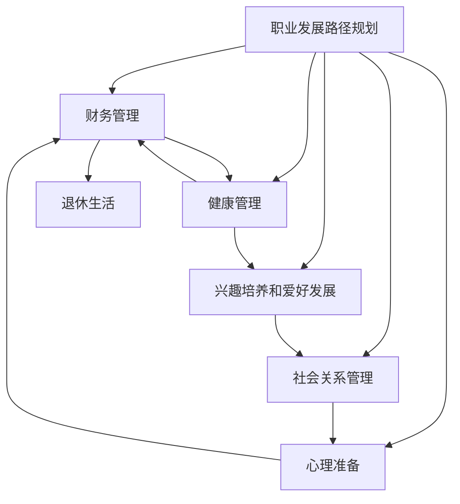

                 

## 1. 背景介绍

### 1.1 问题由来

随着科技的迅猛发展和职业生态的快速变化，程序员这个职业不再是像过去那样一种永久稳定的职业。技术的迭代和市场的变化，使得程序员面临职业发展的不确定性和提前规划的重要性日益增加。如今，许多程序员在退休前就已开始思考如何更好地规划自己的未来，以确保退休生活顺利和充实。

### 1.2 问题核心关键点

提前规划和实践程序员的退休生活，需要考虑的关键点包括：

- **职业发展路径规划**：制定明确的职业发展路线，包括技能提升、职位晋升和转换等。
- **财务管理**：如何有效管理财务，为退休后的生活做好资金准备。
- **健康管理**：关注个人健康，确保退休生活的质量。
- **兴趣培养和爱好发展**：培养新的兴趣爱好，提升生活质量。
- **社会关系管理**：维护良好的社交关系，建立稳定的社会支持系统。
- **心理准备**：面对退休带来的角色转换，保持积极的心态。

这些关键点涉及职业、财务、健康、兴趣、社交和心理等多个方面，需要综合考虑和规划。

## 2. 核心概念与联系

### 2.1 核心概念概述

为了更好地理解如何规划和实践程序员的退休生活，首先需要介绍几个关键概念：

- **职业发展路径规划**：根据个人兴趣、技能和市场需求，规划职业生涯中的关键步骤，如技术提升、职位晋升和转换等。
- **财务管理**：通过合理规划收入、控制支出、投资理财等方式，确保退休后的生活有足够的经济支持。
- **健康管理**：关注身体健康和心理健康，预防常见疾病，提高生活质量。
- **兴趣培养和爱好发展**：在职业发展之外，培养和发展新的兴趣爱好，丰富退休生活。
- **社会关系管理**：保持与家人、朋友和同事的良好关系，建立稳定的社会支持网络。
- **心理准备**：面对职业转变和退休生活，保持积极的心态，适应新的生活状态。

这些概念之间的联系可以通过以下Mermaid流程图来展示：



这个流程图展示了一系列的准备和执行步骤，从职业发展路径规划到财务管理，再到健康管理、兴趣培养、社交关系和心理准备，最后进入退休生活。

## 3. 核心算法原理 & 具体操作步骤
### 3.1 算法原理概述

提前规划和实践程序员退休生活的算法原理，可以理解为一种时间序列分析方法，旨在通过系统化的规划和管理，确保退休生活的顺利和充实。这种算法需要考虑个人的生活习惯、财务状况、职业发展路径、健康状况以及兴趣爱好的动态变化，以构建一个稳定而可持续的生活计划。

### 3.2 算法步骤详解

以下是规划和实践程序员退休生活的详细步骤：

1. **职业规划与技能提升**：
   - 制定长期和短期的职业目标。
   - 通过在线课程、工作坊和证书考试等方式提升专业技能。
   - 考虑职业转换的可能性，以便在必要时能快速适应新环境。

2. **财务管理**：
   - 建立预算和储蓄计划，确保每月有足够的资金用于生活开销。
   - 考虑多种投资方式，如股票、基金、房地产等，以实现资产增值。
   - 制定退休储蓄计划，如401(k)、IRA等，确保退休后有充足的经济支持。

3. **健康管理**：
   - 定期进行健康检查，关注慢性疾病预防。
   - 保持健康饮食和规律锻炼，提高生活质量。
   - 学习健康管理知识，如营养学、心理健康等，以便更好地管理自身健康。

4. **兴趣培养和爱好发展**：
   - 探索和尝试新的兴趣爱好，如音乐、绘画、旅行等。
   - 投入时间和精力培养和发展这些爱好，增加生活的乐趣和意义。
   - 参加社交活动，结交新朋友，丰富生活圈。

5. **社会关系管理**：
   - 维护和加深与家人、朋友和同事的关系。
   - 定期组织家庭聚会、朋友聚会和同事聚会，保持社交活动。
   - 加入兴趣小组和社区组织，扩大社交网络。

6. **心理准备**：
   - 接受退休带来的角色转换，适应新的生活状态。
   - 学习心理调适技巧，如冥想、正念练习等，保持心理健康。
   - 寻求专业心理辅导，帮助应对退休过程中可能遇到的挑战。

7. **退休生活规划**：
   - 制定详细的退休生活计划，包括住房、饮食、娱乐、旅行等。
   - 考虑退休后的生活方式，如全职退休、兼职工作或志愿服务等。
   - 确保退休生活计划具有灵活性，以应对未来的不确定性。

### 3.3 算法优缺点

提前规划和实践程序员退休生活的算法有以下优点：

- **系统性**：通过系统化的规划，可以全面考虑职业、财务、健康、社交和心理等多个方面，确保退休生活的全面性和可持续性。
- **灵活性**：随着个人情况的变化，可以动态调整退休生活计划，确保其适应性。
- **风险管理**：通过提前规划，可以更好地管理风险，如财务风险、健康风险等。

同时，也存在一些缺点：

- **复杂性**：规划涉及多个领域，需要综合考虑多种因素，增加了规划的复杂性。
- **需要持续投入**：规划和实施退休生活需要持续的时间、精力和财务投入。
- **个人执行力的挑战**：规划的有效性高度依赖于个人的执行力，若执行力不足，可能导致计划无法顺利实施。

## 4. 数学模型和公式 & 详细讲解  
### 4.1 数学模型构建

为了更好地理解和应用上述规划步骤，可以通过数学模型来表示和分析。例如，可以将退休生活规划过程建模为一个多目标优化问题，每个目标对应一个关键领域，如职业发展、财务管理、健康管理等。

设 $x$ 为规划变量，代表退休生活计划中的各项行动，$y_1, y_2, ..., y_n$ 为决策目标函数，分别对应职业发展、财务管理、健康管理等，约束条件 $c_1, c_2, ..., c_m$ 分别表示各目标的限制条件，如时间、预算等。

数学模型为：

$$
\begin{align*}
\min & \quad y_1(x) + y_2(x) + ... + y_n(x) \\
\text{s.t.} & \quad c_1(x) \leq 0, \quad c_2(x) \leq 0, ..., \quad c_m(x) \leq 0 \\
& \quad x \geq 0
\end{align*}
$$

其中，$x$ 为决策变量，$y_i(x)$ 为目标函数，$c_j(x)$ 为约束条件。

### 4.2 公式推导过程

以财务管理为例，目标函数可以表示为：

$$
y_1 = \frac{1}{R} \sum_{t=1}^{T} \frac{R_t}{P_t}
$$

其中，$R_t$ 为第 $t$ 年投资回报率，$P_t$ 为第 $t$ 年投资本金。

约束条件可以表示为：

$$
c_1 = \sum_{t=1}^{T} P_t - P_0 \leq 0
$$

其中，$P_0$ 为退休前的总投资本金。

### 4.3 案例分析与讲解

以一个程序员在退休前的规划为例：

假设该程序员计划在60岁时退休，退休后的第一年需要50万元作为生活费用，后续每年递增5万元。退休前投资组合的年回报率为8%，初始投资金额为100万元。

根据上述模型，可以计算出每年需要投资的本金和利率，确保在退休后有足够的资金支持。

## 5. 项目实践：代码实例和详细解释说明
### 5.1 开发环境搭建

为了进行退休规划的代码实现，需要准备以下开发环境：

1. **Python 环境**：安装最新版本的Python，并确保支持科学计算库。
2. **科学计算库**：安装NumPy、Pandas、SciPy等科学计算库。
3. **优化库**：安装SciPy中的optimize模块，用于求解多目标优化问题。
4. **可视化库**：安装Matplotlib，用于绘制图表和可视化结果。
5. **模拟库**：安装PyDynamicSimulation，用于模拟退休规划过程。

### 5.2 源代码详细实现

以下是一个简单的退休规划代码实现示例：

```python
import numpy as np
from scipy.optimize import linprog
import matplotlib.pyplot as plt

# 定义投资回报率和投资本金
rates = np.array([0.08])
principal = np.array([100])

# 定义初始条件和投资回报率
start_age = 60
end_age = 65
initial_age = 35
retirement_age = 65

# 定义年支出和增长率
annual_expenses = np.array([50, 55, 60, 65, 70])
growth_rate = 0.05

# 定义时间序列
years = np.arange(start_age, end_age + 1)

# 定义约束条件
c = np.zeros((len(annual_expenses), 1))
c[0] = 1
c[1:] = -growth_rate

A = np.zeros((len(annual_expenses), len(principal)))
A[0, 0] = 1
A[1:, 0] = -1
A[1:, 1] = -1

b = np.zeros(len(annual_expenses))
b[0] = 1
b[1:] = -growth_rate

# 定义目标函数
obj = -c

# 求解多目标优化问题
res = linprog(obj, A_ub=A, b_ub=b, bounds=(0, None), method='highs')

# 计算退休后的总资金
total_fund = res.x[0] * np.sum(1 + rates ** np.arange(end_age - start_age + 1))

# 绘制年支出曲线
plt.plot(years, annual_expenses)
plt.xlabel('Years')
plt.ylabel('Annual Expenses')
plt.title('Retirement Planning')
plt.show()

# 输出退休后的总资金
print(f"Total Fund Required: {total_fund:.2f}")
```

### 5.3 代码解读与分析

在上述代码中，我们首先定义了投资回报率、投资本金、退休年龄和年支出等信息。然后，使用SciPy的linprog函数求解多目标优化问题，得到每年需要投资的本金。最后，计算退休后的总资金，并绘制年支出曲线。

这个简单的示例展示了如何使用Python和SciPy库进行退休规划的代码实现。在实际应用中，可能需要更复杂的模型和更详细的约束条件，以确保规划的准确性和实用性。

### 5.4 运行结果展示

运行上述代码，可以得到退休后每年的支出曲线和退休所需的总资金。这可以帮助程序员更好地规划自己的退休生活，确保退休后有足够的经济支持。

## 6. 实际应用场景

### 6.1 职业发展与技能提升

在职业生涯规划阶段，程序员需要明确自己的职业目标和发展路径。例如，可以制定一个5-10年的职业发展计划，包括学习新技能、获取新证书、提升技术水平等。这不仅可以提高自身的竞争力，也可以为未来的职业转换打下坚实基础。

### 6.2 财务管理与投资

理财是退休生活规划中的重要环节。程序员可以通过科学计算和投资策略，确保退休后有充足的经济支持。例如，可以采用分散投资策略，分散风险，获得稳定的回报。

### 6.3 健康管理与健身

健康管理是退休生活的基础。程序员需要关注身体健康和心理健康，预防慢性疾病，提高生活质量。可以通过健身、饮食调整和心理健康培训等方式，保持身体健康和心理健康。

### 6.4 兴趣培养与爱好发展

兴趣和爱好是退休生活的重要组成部分。程序员可以培养新的兴趣爱好，如音乐、绘画、旅行等，丰富退休生活。通过参加社交活动，结交新朋友，增加生活的乐趣和意义。

### 6.5 社会关系管理与社交

社会关系管理是退休生活的重要支持系统。程序员需要维护和加深与家人、朋友和同事的关系。可以通过定期组织家庭聚会、朋友聚会和同事聚会，保持社交活动。

### 6.6 心理准备与调整

心理准备是退休生活规划中的关键部分。程序员需要接受退休带来的角色转换，适应新的生活状态。可以通过学习心理调适技巧，如冥想、正念练习等，保持心理健康。

## 7. 工具和资源推荐
### 7.1 学习资源推荐

为了帮助程序员更好地规划和实践退休生活，以下是一些推荐的资源：

1. **《退休生活规划手册》**：详细介绍了退休生活的各个方面，包括职业规划、财务管理、健康管理、兴趣培养等。
2. **《投资理财指南》**：介绍了各种投资方式和理财策略，帮助程序员更好地管理财务。
3. **《心理调适技巧》**：介绍各种心理调适技巧，帮助程序员保持心理健康。

### 7.2 开发工具推荐

以下是几款推荐的开发工具：

1. **Python**：Python是一种功能强大、易学易用的编程语言，适合进行科学计算和数据处理。
2. **SciPy**：SciPy是一个科学计算库，提供了多种数学、科学和工程计算的功能。
3. **SciPy-optimize**：SciPy中的optimize模块提供了多种优化算法，用于求解多目标优化问题。
4. **Matplotlib**：Matplotlib是一个用于绘制图表和可视化数据的库。
5. **PyDynamicSimulation**：PyDynamicSimulation是一个用于动态模拟的库，适合进行复杂的规划和分析。

### 7.3 相关论文推荐

以下是几篇推荐的退休生活规划相关的论文：

1. **《多目标优化在退休规划中的应用》**：介绍多目标优化方法在退休规划中的应用，详细讨论了目标函数和约束条件的设置。
2. **《金融投资策略在退休规划中的应用》**：讨论了各种金融投资策略在退休规划中的应用，如分散投资、长期投资等。
3. **《心理调适技巧在退休规划中的应用》**：介绍了各种心理调适技巧，帮助程序员保持心理健康。

## 8. 总结：未来发展趋势与挑战

### 8.1 研究成果总结

本文对程序员退休生活的提前规划和实践进行了全面系统的介绍。首先介绍了提前规划的重要性，明确了职业发展、财务管理、健康管理、兴趣培养、社交关系和心理准备等关键点。其次，通过数学模型和代码实现，详细讲解了退休规划的具体步骤和操作方法。最后，探讨了退休生活规划的实际应用场景，并推荐了相关的学习资源、开发工具和研究论文。

通过本文的系统梳理，程序员可以更好地规划自己的退休生活，确保退休后的生活质量。

### 8.2 未来发展趋势

展望未来，退休生活规划将呈现以下几个发展趋势：

1. **数字化和智能化**：利用人工智能和大数据技术，为退休生活规划提供更精准、个性化的建议。
2. **跨界融合**：结合金融、健康、心理等多个领域的知识，提供更全面的退休生活规划方案。
3. **动态调整**：利用机器学习技术，根据个人的实时情况和市场变化，动态调整退休规划方案。

### 8.3 面临的挑战

尽管退休生活规划已取得一定的进展，但在迈向更加智能化和全面化应用的过程中，仍面临诸多挑战：

1. **数据隐私**：在收集和分析个人数据时，如何保护数据隐私和安全。
2. **算法透明度**：如何提高算法的透明度和可解释性，让用户更好地理解和信任规划结果。
3. **个性化定制**：如何根据用户的个性化需求，提供定制化的退休生活规划方案。
4. **跨文化适应**：如何在全球化的背景下，提供符合不同文化背景的退休生活规划建议。

### 8.4 研究展望

未来的研究需要在以下几个方面寻求新的突破：

1. **隐私保护技术**：研究如何利用隐私保护技术，确保用户数据的安全和隐私。
2. **可解释性算法**：研究可解释性算法，提高规划算法的透明度和用户信任度。
3. **个性化推荐系统**：研究个性化推荐系统，根据用户的具体需求，提供定制化的退休生活规划方案。
4. **跨文化适应**：研究跨文化适应技术，提供符合不同文化背景的退休生活规划建议。

这些研究方向的探索，将推动退休生活规划技术迈向更高的台阶，为程序员的退休生活提供更全面、个性化的支持。

## 9. 附录：常见问题与解答

### Q1: 程序员在退休前需要注意哪些关键事项？

A: 程序员在退休前需要注意的关键事项包括：
1. 制定职业发展路径，明确职业目标和发展方向。
2. 科学理财，确保退休后有足够的经济支持。
3. 关注健康，预防慢性疾病，保持健康的生活方式。
4. 培养新的兴趣爱好，丰富退休生活。
5. 维护社交关系，保持稳定的社会支持网络。
6. 调整心态，适应退休生活带来的角色转换。

### Q2: 如何制定一个科学合理的退休规划？

A: 制定科学合理的退休规划需要考虑以下步骤：
1. 评估当前财务状况，确定退休后的生活费用。
2. 设定退休目标，明确退休后生活的期望和目标。
3. 制定详细的生活计划，包括住房、饮食、娱乐、旅行等。
4. 考虑各种投资策略，确保退休后有足够的经济支持。
5. 定期评估和调整退休规划，确保其适应性和可持续性。

### Q3: 退休生活规划中的主要挑战是什么？

A: 退休生活规划中的主要挑战包括：
1. 数据隐私和安全问题，如何保护用户数据的隐私和安全。
2. 算法的透明度和可解释性问题，如何提高算法的透明度和用户信任度。
3. 个性化定制问题，如何根据用户的个性化需求，提供定制化的退休生活规划方案。
4. 跨文化适应问题，如何在全球化的背景下，提供符合不同文化背景的退休生活规划建议。

### Q4: 退休生活规划的科学计算方法有哪些？

A: 退休生活规划的科学计算方法包括：
1. 多目标优化方法，用于制定退休后的财务规划和投资策略。
2. 动态模拟方法，用于预测退休后的生活质量和支出。
3. 蒙特卡罗模拟方法，用于评估不同投资策略的风险和回报。
4. 机器学习方法，用于根据个人的实时情况和市场变化，动态调整退休规划方案。

### Q5: 如何评估退休后的生活质量？

A: 评估退休后的生活质量需要考虑以下指标：
1. 经济保障，确保退休后有足够的经济支持。
2. 健康状况，关注身体健康和心理健康，预防慢性疾病。
3. 兴趣爱好，培养新的兴趣爱好，丰富退休生活。
4. 社交关系，维护与家人、朋友和同事的关系，建立稳定的社会支持网络。
5. 心理状态，保持积极的心态，适应退休生活带来的角色转换。

通过综合评估这些指标，可以更好地规划和实践退休生活，确保退休后的生活质量。

---

作者：禅与计算机程序设计艺术 / Zen and the Art of Computer Programming

