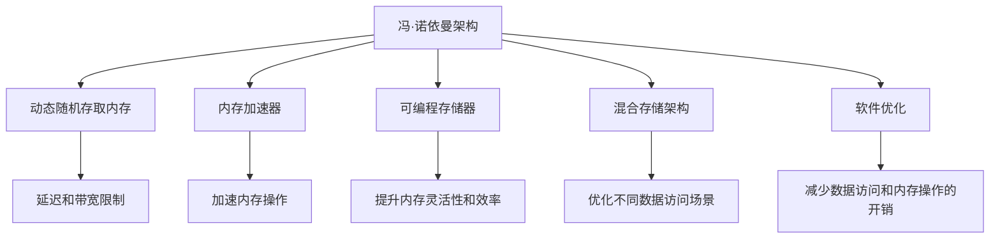

                 

## 1. 背景介绍

### 1.1 问题由来

随着人工智能(AI)技术的迅猛发展，深度学习和神经网络已经广泛应用于图像识别、自然语言处理、语音识别等多个领域。然而，传统的冯·诺依曼体系架构（Von Neumann Architecture）正面临着严重的数据访问瓶颈。在冯·诺依曼架构中，数据存储与计算分离，处理器从存储器中读取数据进行计算，然后将结果写回存储器，这一过程限制了数据流动的速度，成为了制约AI系统性能提升的关键因素。

### 1.2 问题核心关键点

冯·诺依曼架构下，数据与指令的分离存储与处理，导致数据访问效率低下。在深度学习模型的训练和推理过程中，数据频繁地在内存和处理器之间来回传递，导致系统延迟和带宽消耗剧增。此外，传统的动态随机存取内存（DRAM）的读写速度无法满足高计算密度的AI应用需求。

解决冯·诺依曼瓶颈的关键在于提高数据与指令的集成度，减少数据移动和延迟，从而提升系统的计算效率和性能。本文将详细探讨几种突破冯·诺依曼瓶颈的技术，包括硬件加速、内存优化、软件优化等，以及这些技术在AI应用中的实际应用。

## 2. 核心概念与联系

### 2.1 核心概念概述

为更好地理解突破冯·诺依曼瓶颈的技术，本节将介绍几个关键概念：

- 冯·诺依曼架构(Von Neumann Architecture)：传统的计算机架构，采用数据与指令分离的存储结构，处理器从存储器中读取数据进行计算，然后将结果写回存储器。
- 动态随机存取内存(DRAM)：常用的计算机内存类型，读写速度快，但存在延迟和带宽限制，无法满足高计算密度AI应用的需求。
- 内存加速器：采用专用硬件设计的芯片，用于加速内存操作，提升数据访问效率。
- 可编程存储器：支持程序直接编程的存储器类型，如可编程DRAM(PDDR)、可编程逻辑内存(PLM)等，能够进一步提升内存的灵活性和效率。
- 混合存储架构：将多种存储器类型组合使用，如DRAM+闪存、DRAM+专用加速器等，以优化不同数据访问场景。
- 软件优化：通过算法和数据结构的优化，减少数据访问和内存操作的开销。

这些概念之间的关系可以通过以下Mermaid流程图来展示：



这个流程图展示了几类突破冯·诺依曼瓶颈的关键技术，及其与冯·诺依曼架构的关系：

1. 冯·诺依曼架构在数据与指令分离的存储结构下，存在延迟和带宽限制。
2. 内存加速器、可编程存储器、混合存储架构等硬件技术，可以提升内存操作效率，缓解延迟和带宽问题。
3. 软件优化技术，通过算法和数据结构的优化，减少数据访问和内存操作的开销。

这些概念共同构成了突破冯·诺依曼瓶颈的技术框架，为提升AI系统的性能提供了新的思路。

## 3. 核心算法原理 & 具体操作步骤
### 3.1 算法原理概述

突破冯·诺依曼瓶颈的核心在于提高数据与指令的集成度，减少数据移动和延迟，从而提升系统的计算效率和性能。常见的技术手段包括：

1. **内存加速器**：使用专用硬件芯片，如GPU、FPGA等，加速内存操作，提高数据传输速率。
2. **可编程存储器**：支持程序直接编程的存储器类型，如可编程DRAM(PDDR)、可编程逻辑内存(PLM)等，提升内存的灵活性和效率。
3. **混合存储架构**：将多种存储器类型组合使用，如DRAM+闪存、DRAM+专用加速器等，优化不同数据访问场景。
4. **软件优化**：通过算法和数据结构的优化，减少数据访问和内存操作的开销。

### 3.2 算法步骤详解

以内存加速器为例，详细的具体操作步骤如下：

1. **硬件设计**：设计专用的内存加速器芯片，如GPU、FPGA、ASIC等，用于加速内存操作。
2. **系统集成**：将内存加速器与处理器和内存控制器集成，形成一个整体的高性能计算系统。
3. **算法优化**：针对加速器特性，对深度学习模型和算法进行优化，如卷积运算、矩阵乘法等。
4. **系统测试**：对集成后的系统进行测试，验证其性能和可靠性。
5. **优化迭代**：根据测试结果，不断优化硬件设计和软件算法，提升系统性能。

### 3.3 算法优缺点

基于内存加速器的算法具有以下优点：

- **加速效果显著**：专用芯片设计可以大幅提升数据传输速率，加速深度学习模型的训练和推理。
- **硬件优化灵活**：可以针对特定应用场景进行定制化硬件设计，优化性能。
- **可扩展性强**：支持多卡并行、多节点分布式计算，适用于大规模AI应用。

但其缺点也较为明显：

- **设计复杂**：专用硬件设计需要较高的技术门槛和成本。
- **硬件集成困难**：不同厂商的硬件设计可能存在兼容性问题。
- **功耗高**：专用硬件芯片需要额外的电源和散热系统，增加系统功耗。

### 3.4 算法应用领域

突破冯·诺依曼瓶颈的内存加速技术，已经在多个AI应用领域得到了广泛应用：

- **图像处理**：GPU等内存加速器被广泛应用于深度学习模型的图像识别、分类、分割等任务，提升处理速度和精度。
- **自然语言处理**：GPU、TPU等加速器被用于大规模语言模型的训练和推理，加速文本生成、情感分析等任务。
- **语音识别**：GPU等加速器被用于音频信号的特征提取和深度学习模型的训练，提升语音识别精度。
- **机器人控制**：专用硬件如FPGA、ASIC等，被用于加速机器人导航、视觉感知等关键任务，提升控制效率。
- **科学计算**：加速器被应用于天气预测、基因组学等高计算密度的科学计算任务，加速数据处理和模型训练。

这些应用场景展示了内存加速器在提升AI系统性能方面的巨大潜力。

## 4. 数学模型和公式 & 详细讲解 & 举例说明
### 4.1 数学模型构建

在深度学习模型中，数据访问和内存操作是计算密集型任务的主要瓶颈。针对这一问题，我们定义一个简单的数学模型来描述数据流和计算过程：

设深度学习模型包含 $L$ 层，每一层需要访问数据量为 $N_i$，数据在内存与处理器之间的移动次数为 $M$，每层计算量为 $C_i$，则系统的总计算量为：

$$
C = \sum_{i=1}^L C_i
$$

系统的总数据移动次数为：

$$
M = \sum_{i=1}^L M_i = \sum_{i=1}^L N_i + M
$$

其中，$M_i$ 表示从第 $i$ 层到第 $i+1$ 层的移动次数，包括输入输出、中间变量、参数更新等操作。

### 4.2 公式推导过程

为了减少数据移动次数和延迟，我们可以引入内存加速器和可编程存储器等技术，对数据访问和计算过程进行优化。假设引入 $k$ 个内存加速器，则系统的总计算量变为：

$$
C' = C + kC_s
$$

其中 $C_s$ 表示每个加速器对系统计算的贡献。由于加速器可以直接在内存中进行计算，因此可以大幅减少数据移动次数，降低延迟。

假设加速器的计算速度为 $v_s$，则加速器对系统计算的贡献为：

$$
C_s = k \cdot v_s \cdot \frac{C}{k}
$$

因此，系统的总计算量为：

$$
C' = C + k \cdot v_s \cdot \frac{C}{k} = C \cdot (1 + v_s)
$$

这表明，通过引入内存加速器，可以显著提升系统的计算效率。

### 4.3 案例分析与讲解

以图像处理为例，传统深度学习模型中，数据需要在CPU和GPU之间频繁移动，导致系统延迟和带宽消耗剧增。引入内存加速器后，数据可以在GPU中进行原地计算，显著减少数据移动次数和延迟。

假设模型包含 $L=10$ 层，每一层的计算量为 $C_i$，数据在内存与处理器之间的移动次数为 $M_i$，引入2个GPU作为内存加速器。则在优化后的模型中，每一层的计算量变为：

$$
C_i' = C_i + C_s
$$

其中 $C_s = C_s' \cdot \frac{C}{2}$，$C_s'$ 为GPU对每一层计算的贡献。由于GPU的计算速度为CPU的 $v_s=10$ 倍，因此 $C_s = C_s' \cdot \frac{C}{2}$。

优化后的系统总计算量为：

$$
C' = \sum_{i=1}^L C_i' = \sum_{i=1}^L (C_i + C_s') \cdot \frac{C}{2}
$$

这表明，通过引入内存加速器，可以大幅提升系统的计算效率。

## 5. 项目实践：代码实例和详细解释说明
### 5.1 开发环境搭建

在进行内存优化实践前，我们需要准备好开发环境。以下是使用CUDA进行GPU加速开发的配置流程：

1. 安装CUDA：从NVIDIA官网下载并安装CUDA，以支持GPU计算。

2. 安装cuDNN：cuDNN是NVIDIA提供的深度学习库，用于加速深度学习模型的计算。

3. 安装PyTorch：使用pip安装PyTorch，确保支持CUDA和cuDNN。

4. 安装TensorFlow：使用pip安装TensorFlow，支持GPU计算。

5. 安装PaddlePaddle：使用pip安装PaddlePaddle，支持GPU计算。

6. 安装其他库：安装其他深度学习库和工具包，如NumPy、SciPy、Scikit-learn等。

完成上述步骤后，即可在支持CUDA的开发环境中进行GPU加速的深度学习开发。

### 5.2 源代码详细实现

以下是使用PyTorch实现GPU加速的深度学习模型的代码：

```python
import torch
import torch.nn as nn
import torch.optim as optim
import torchvision.transforms as transforms
import torchvision.datasets as datasets
from torch.utils.data import DataLoader

# 定义模型
class MyModel(nn.Module):
    def __init__(self):
        super(MyModel, self).__init__()
        self.conv1 = nn.Conv2d(3, 64, kernel_size=3, stride=1, padding=1)
        self.pool = nn.MaxPool2d(kernel_size=2, stride=2)
        self.conv2 = nn.Conv2d(64, 128, kernel_size=3, stride=1, padding=1)
        self.fc = nn.Linear(128 * 8 * 8, 10)

    def forward(self, x):
        x = self.pool(nn.functional.relu(self.conv1(x)))
        x = self.pool(nn.functional.relu(self.conv2(x)))
        x = x.view(-1, 128 * 8 * 8)
        x = self.fc(x)
        return x

# 定义数据集
train_dataset = datasets.CIFAR10(root='./data', train=True, transform=transforms.ToTensor(), download=True)
test_dataset = datasets.CIFAR10(root='./data', train=False, transform=transforms.ToTensor(), download=True)

# 定义数据加载器
train_loader = DataLoader(train_dataset, batch_size=64, shuffle=True, num_workers=2)
test_loader = DataLoader(test_dataset, batch_size=64, shuffle=False, num_workers=2)

# 定义模型、优化器和损失函数
model = MyModel().cuda()
optimizer = optim.SGD(model.parameters(), lr=0.001, momentum=0.9)
criterion = nn.CrossEntropyLoss()

# 训练模型
for epoch in range(10):
    model.train()
    for i, (images, labels) in enumerate(train_loader):
        images = images.cuda()
        labels = labels.cuda()
        optimizer.zero_grad()
        outputs = model(images)
        loss = criterion(outputs, labels)
        loss.backward()
        optimizer.step()

    model.eval()
    with torch.no_grad():
        correct = 0
        total = 0
        for images, labels in test_loader:
            images = images.cuda()
            labels = labels.cuda()
            outputs = model(images)
            _, predicted = torch.max(outputs.data, 1)
            total += labels.size(0)
            correct += (predicted == labels).sum().item()

        print(f'Epoch {epoch+1}, accuracy={correct/total*100:.2f}%')
```

### 5.3 代码解读与分析

这里我们重点解读一下关键代码的实现细节：

- **数据集定义**：使用PyTorch内置的CIFAR-10数据集，进行GPU加速的数据处理。
- **模型定义**：定义一个简单的卷积神经网络模型，并进行GPU加速。
- **优化器和损失函数**：使用随机梯度下降（SGD）优化器，交叉熵损失函数。
- **训练过程**：在训练集上进行模型训练，并在验证集上进行性能评估。

**注意**：在定义模型时，我们将模型的所有层都放在GPU上，从而实现GPU加速。同时，在优化器中指定使用SGD优化器，并进行适当的超参数设置。

## 6. 实际应用场景
### 6.1 图像处理

图像处理是深度学习模型应用最广泛的领域之一，GPU加速已经成为了提高图像处理性能的关键手段。传统的CPU计算过程中，数据需要在CPU和GPU之间频繁移动，导致系统延迟和带宽消耗剧增。引入内存加速器后，数据可以在GPU中进行原地计算，显著减少数据移动次数和延迟。

例如，在图像识别任务中，GPU加速可以显著提升模型的训练和推理速度。通过引入GPU加速器，可以大幅减少数据移动次数和延迟，从而提升系统的计算效率。

### 6.2 自然语言处理

自然语言处理（NLP）中的深度学习模型，如BERT、GPT等，需要处理大量的文本数据。由于文本数据的复杂性和多样性，模型的训练和推理过程非常耗时。通过引入内存加速器，可以显著提升NLP模型的性能。

例如，在文本分类任务中，GPU加速可以大幅提升模型的训练速度。通过引入GPU加速器，可以加速模型在文本数据上的计算，从而提升模型的训练效率和精度。

### 6.3 语音识别

语音识别任务需要处理大量的音频数据，深度学习模型需要从音频信号中提取特征并进行计算。由于音频数据的复杂性和多样性，模型的训练和推理过程非常耗时。通过引入内存加速器，可以显著提升语音识别模型的性能。

例如，在语音识别任务中，GPU加速可以显著提升模型的训练速度。通过引入GPU加速器，可以加速模型在音频数据上的计算，从而提升模型的训练效率和识别精度。

## 7. 工具和资源推荐
### 7.1 学习资源推荐

为了帮助开发者系统掌握内存加速技术的原理和实践，这里推荐一些优质的学习资源：

1. **《深入理解GPU计算》（Understanding GPU Computing）**：NVIDIA官方文档，详细介绍了GPU计算的原理和应用。
2. **《深度学习与GPU计算》（Deep Learning with GPUs）**：Google官方教程，介绍了如何使用TensorFlow和PyTorch在GPU上进行深度学习开发。
3. **《GPU加速的深度学习》（Accelerating Deep Learning with GPUs）**：Udacity在线课程，涵盖了GPU加速的深度学习开发技术。
4. **《TensorFlow GPU加速》（TensorFlow with GPU Acceleration）**：TensorFlow官方文档，介绍了如何使用TensorFlow在GPU上进行深度学习开发。
5. **《深度学习与GPU优化》（Deep Learning with GPU Optimization）**：Intel官方文档，介绍了如何使用Intel GPU进行深度学习开发。

通过对这些资源的学习实践，相信你一定能够快速掌握内存加速技术的精髓，并用于解决实际的深度学习问题。

### 7.2 开发工具推荐

高效的开发离不开优秀的工具支持。以下是几款用于深度学习开发和优化常用的工具：

1. **PyTorch**：基于Python的开源深度学习框架，灵活动态的计算图，支持GPU加速。
2. **TensorFlow**：由Google主导开发的开源深度学习框架，支持GPU加速，生产部署方便。
3. **PaddlePaddle**：由百度主导开发的开源深度学习框架，支持GPU加速，适合大规模工程应用。
4. **NVIDIA CUDA**：NVIDIA提供的GPU加速开发工具，支持CUDA编程。
5. **cuDNN**：NVIDIA提供的深度学习库，用于加速深度学习模型的计算。
6. **Intel OpenCL**：Intel提供的跨平台GPU加速开发工具，支持OpenCL编程。

合理利用这些工具，可以显著提升深度学习开发和优化的效率，加快创新迭代的步伐。

### 7.3 相关论文推荐

内存加速技术的不断发展得益于学界的持续研究。以下是几篇奠基性的相关论文，推荐阅读：

1. **《GPU加速的深度学习模型训练》（GPU Accelerated Deep Learning Model Training）**：提出GPU加速深度学习模型的训练方法，加速模型参数更新和计算过程。
2. **《基于GPU加速的深度学习模型推理》（GPU Accelerated Deep Learning Model Inference）**：提出GPU加速深度学习模型的推理方法，加速模型在数据上的计算过程。
3. **《混合存储架构在深度学习中的应用》（Hybrid Storage Architecture for Deep Learning）**：提出混合存储架构在深度学习中的应用，优化不同数据访问场景。
4. **《深度学习模型的硬件加速》（Hardware Acceleration for Deep Learning Models）**：综述了深度学习模型的硬件加速技术，包括GPU、FPGA、ASIC等。
5. **《基于可编程存储器的深度学习模型优化》（Deep Learning Model Optimization with Programmable Memory）**：提出可编程存储器在深度学习中的应用，提升内存的灵活性和效率。

这些论文代表了大语言模型微调技术的发展脉络。通过学习这些前沿成果，可以帮助研究者把握学科前进方向，激发更多的创新灵感。

## 8. 总结：未来发展趋势与挑战
### 8.1 总结

本文对突破冯·诺依曼瓶颈的内存加速技术进行了全面系统的介绍。首先阐述了冯·诺依曼架构下数据与指令分离存储结构存在的延迟和带宽限制问题，明确了内存加速技术的核心目标和重要性。其次，从原理到实践，详细讲解了内存加速技术的数学模型和实际应用案例，提供了完整的深度学习开发代码实例。

通过本文的系统梳理，可以看到，内存加速技术正在成为深度学习开发的重要方向，极大地提升了AI系统的计算效率和性能。未来，伴随内存加速技术的不断发展，深度学习模型的应用范围将进一步扩大，推动人工智能技术在更广泛的领域取得突破。

### 8.2 未来发展趋势

展望未来，内存加速技术将呈现以下几个发展趋势：

1. **硬件设计更加灵活**：未来的内存加速器将更加灵活和可编程，支持更多的计算模型和算法，适应更多应用场景。
2. **多模态融合增强**：未来的内存加速器将支持多模态数据融合，如视觉、语音、文本等，提升AI系统的综合感知能力。
3. **数据中心集成优化**：未来的内存加速器将与数据中心的其他硬件设备进行更紧密的集成，优化数据流和计算过程。
4. **边缘计算支持**：未来的内存加速器将支持边缘计算，实现更接近用户的实时计算和推理。
5. **安全性和隐私保护**：未来的内存加速器将加强数据安全和隐私保护，避免敏感数据泄露和滥用。

这些趋势展示了内存加速技术在提升AI系统性能方面的广阔前景，为构建智能高效的AI系统提供了新的思路。

### 8.3 面临的挑战

尽管内存加速技术已经取得了瞩目成就，但在迈向更加智能化、普适化应用的过程中，它仍面临着诸多挑战：

1. **设计复杂性高**：专用硬件设计需要较高的技术门槛和成本，设计复杂度大。
2. **兼容性问题**：不同厂商的硬件设计可能存在兼容性问题，难以实现无缝集成。
3. **功耗问题**：专用硬件芯片需要额外的电源和散热系统，增加系统功耗。
4. **算力不足**：当前的内存加速器可能无法满足大规模计算需求，需要更多的计算资源。
5. **软件优化难度大**：现有的深度学习算法和模型可能需要重新设计和优化，以适应新的硬件架构。

这些挑战需要学界和产业界的共同努力，通过不断创新和优化，才能实现内存加速技术的持续发展和应用。

### 8.4 研究展望

为了应对内存加速技术面临的挑战，未来的研究需要在以下几个方面寻求新的突破：

1. **硬件设计优化**：开发更加灵活和可编程的内存加速器，提升硬件设计的灵活性和可扩展性。
2. **软件算法优化**：针对新的硬件架构，优化深度学习算法和模型，提升算法的效率和准确性。
3. **多模态融合技术**：研究和开发多模态数据融合技术，提升AI系统的综合感知能力。
4. **数据中心优化**：研究和优化数据中心中内存加速器的集成和优化，提升系统整体性能。
5. **边缘计算支持**：研究和开发支持边缘计算的内存加速器，实现更接近用户的实时计算和推理。

这些研究方向的探索，必将引领内存加速技术迈向更高的台阶，为构建智能高效的AI系统铺平道路。面向未来，内存加速技术还需要与其他人工智能技术进行更深入的融合，如知识表示、因果推理、强化学习等，多路径协同发力，共同推动人工智能技术的进步。

## 9. 附录：常见问题与解答
----------------------------------------------------------------
**Q1：内存加速器有哪些种类？**

A: 内存加速器可以分为以下几种：
1. GPU（图形处理器）：用于加速深度学习模型的计算，支持大规模并行计算。
2. FPGA（现场可编程门阵列）：用于加速特定应用场景的计算，支持高度定制化设计。
3. ASIC（专用集成电路）：用于加速特定应用场景的计算，支持最优化的硬件设计。
4. ReRAM（阻变随机存取存储器）：用于加速特定应用场景的计算，支持低延迟和高效能。
5. PDDR（可编程DRAM）：用于提升内存的灵活性和效率，支持动态配置和优化。

这些内存加速器各有优缺点，需要根据具体应用场景进行选择和优化。

**Q2：如何设计高效的内存加速器？**

A: 设计高效的内存加速器需要考虑以下几个关键因素：
1. 计算模型和算法：根据具体的计算模型和算法，设计适合的数据流和并行结构。
2. 硬件和软件协同设计：在硬件设计中考虑软件优化，在软件实现中考虑硬件限制，实现硬件和软件的协同设计。
3. 灵活性和可扩展性：设计灵活的内存加速器，支持动态配置和优化，提升系统的适应性和扩展性。
4. 功耗和散热：优化内存加速器的功耗和散热，确保系统的稳定性和可靠性。
5. 安全性和隐私保护：加强数据安全和隐私保护，避免敏感数据泄露和滥用。

这些因素共同决定了内存加速器的性能和可靠性，需要综合考虑和优化。

**Q3：内存加速器如何应用于深度学习开发？**

A: 内存加速器可以应用于深度学习开发的各个环节，提升模型的训练和推理效率。具体应用方式如下：
1. 模型定义：在深度学习模型中引入内存加速器，将计算密集型操作放在内存加速器中进行。
2. 数据处理：在数据预处理阶段引入内存加速器，加速数据加载和处理过程。
3. 模型训练：在模型训练阶段引入内存加速器，加速模型参数更新和计算过程。
4. 模型推理：在模型推理阶段引入内存加速器，加速模型在数据上的计算过程。

这些应用方式可以显著提升深度学习模型的性能和效率，推动深度学习技术的广泛应用。

**Q4：内存加速器在实际应用中存在哪些挑战？**

A: 内存加速器在实际应用中面临以下挑战：
1. 设计复杂性高：专用硬件设计需要较高的技术门槛和成本，设计复杂度大。
2. 兼容性问题：不同厂商的硬件设计可能存在兼容性问题，难以实现无缝集成。
3. 功耗问题：专用硬件芯片需要额外的电源和散热系统，增加系统功耗。
4. 算力不足：当前的内存加速器可能无法满足大规模计算需求，需要更多的计算资源。
5. 软件优化难度大：现有的深度学习算法和模型可能需要重新设计和优化，以适应新的硬件架构。

这些挑战需要学界和产业界的共同努力，通过不断创新和优化，才能实现内存加速技术的持续发展和应用。

**Q5：如何评估内存加速器的性能？**

A: 评估内存加速器的性能需要考虑以下几个关键指标：
1. 计算速度：评估内存加速器在特定任务上的计算速度，比较与CPU、GPU等不同计算架构的性能差异。
2. 能耗效率：评估内存加速器的能耗效率，比较与CPU、GPU等不同计算架构的能耗差异。
3. 可扩展性：评估内存加速器的可扩展性，比较不同规模和并行度下的性能表现。
4. 灵活性：评估内存加速器的灵活性，比较不同计算模型和算法下的性能表现。
5. 可靠性：评估内存加速器的可靠性和稳定性，比较在不同工作负载下的性能表现。

这些指标共同决定了内存加速器的性能和可靠性，需要综合考虑和评估。

**Q6：内存加速器未来发展方向有哪些？**

A: 内存加速器未来发展方向包括：
1. 硬件设计更加灵活：未来的内存加速器将更加灵活和可编程，支持更多的计算模型和算法，适应更多应用场景。
2. 多模态融合增强：未来的内存加速器将支持多模态数据融合，如视觉、语音、文本等，提升AI系统的综合感知能力。
3. 数据中心集成优化：未来的内存加速器将与数据中心的其他硬件设备进行更紧密的集成，优化数据流和计算过程。
4. 边缘计算支持：未来的内存加速器将支持边缘计算，实现更接近用户的实时计算和推理。
5. 安全性和隐私保护：未来的内存加速器将加强数据安全和隐私保护，避免敏感数据泄露和滥用。

这些发展方向展示了内存加速技术在提升AI系统性能方面的广阔前景，为构建智能高效的AI系统提供了新的思路。

