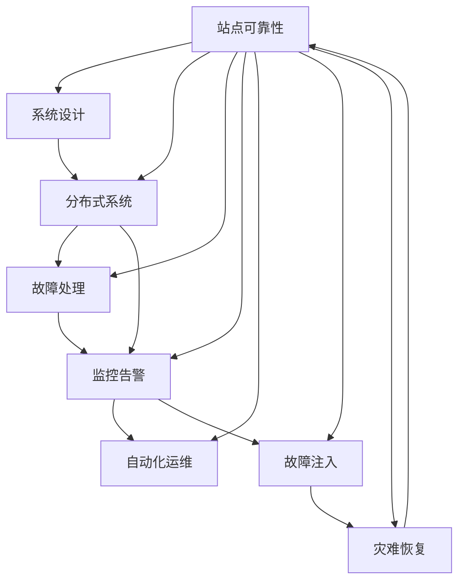

                 

# 站点可靠性工程挑战：大规模系统

> 关键词：站点可靠性, 系统设计, 分布式系统, 故障处理, 监控告警, 自动化运维, 故障注入, 灾难恢复

## 1. 背景介绍

在互联网高速发展的今天，站点可靠性已成为企业能否成功运营的关键因素。大规模系统的出现，使得站点可靠性工程面临前所未有的挑战。无论是在用户请求激增、数据量剧增，还是在网络攻击、硬件故障等场景下，保持站点的稳定性和高可用性，都要求系统架构、运维流程、技术工具等全方位协同作战。

本文将从站点可靠性工程的核心概念出发，探讨如何在大规模系统中应对各种故障和挑战，并结合具体的技术方案，剖析在大规模系统实现站点可靠性的关键。

## 2. 核心概念与联系

### 2.1 核心概念概述

为了更好地理解站点可靠性工程，首先需要介绍几个核心概念：

- **站点可靠性**：指站点正常运行的概率。在实际应用中，站点可靠性通常以"九个九"(uptime)来度量，即系统至少有99.9%的时间是可用的。
- **系统设计**：包括架构设计、模块划分、接口设计、数据设计等，是保证系统稳定性的基础。
- **分布式系统**：指由多个分散的计算机系统组成的大型系统，通过网络通信协同工作。分布式系统要求高度的故障隔离和数据一致性。
- **故障处理**：包括故障检测、故障定位、故障恢复等，是保持站点可靠性的关键手段。
- **监控告警**：通过实时监控系统状态，及时发现并报告异常，辅助故障处理和自动化运维。
- **自动化运维**：通过脚本、工具和配置管理，实现系统部署、配置、监控、告警、故障处理等自动化，提高运维效率。
- **故障注入**：在测试环境中模拟真实故障，测试系统的故障恢复能力和可靠性设计。
- **灾难恢复**：在系统发生重大故障时，通过数据备份、自动恢复等手段，确保业务连续性。

这些概念之间的逻辑关系可以通过以下Mermaid流程图来展示：



这个流程图展示了大规模系统站点可靠性工程的核心概念及其之间的关系：

1. 站点可靠性以系统设计为基础。
2. 分布式系统依赖于系统设计的合理性，要求在故障处理和监控告警方面有更强的能力。
3. 故障处理是保持站点可靠性的关键手段。
4. 监控告警对故障处理和自动化运维有重要支撑作用。
5. 自动化运维能够大幅提高运维效率。
6. 故障注入是系统设计可靠性测试的重要方法。
7. 灾难恢复是系统重大故障下的最后保障。

这些概念共同构成了大规模系统站点可靠性的实现框架，使得系统能够在各种故障和挑战下保持高效稳定的运行。通过理解这些核心概念，我们可以更好地把握站点可靠性工程的关键点。

## 3. 核心算法原理 & 具体操作步骤
### 3.1 算法原理概述

站点可靠性工程的核心在于系统设计的可靠性、故障处理的及时性和有效性、监控告警的实时性和准确性。其主要算法原理包括以下几个方面：

- **系统设计可靠性**：通过合理的架构设计和模块划分，实现系统的高可用性和容错性。常见的架构模式包括主备架构、多副本架构、环状架构等。
- **故障处理算法**：在检测到故障后，快速定位问题，并采取措施进行恢复。常用的算法包括被动等待、主动检测、自动重启等。
- **监控告警算法**：实时监控系统状态，通过设置告警阈值和告警规则，及时发现和报告异常。常用的算法包括采样算法、滑动窗口算法、流计算算法等。
- **自动化运维算法**：通过脚本和工具实现系统的部署、配置、监控、告警、故障处理等自动化，提高运维效率。常用的算法包括脚本调度算法、配置管理算法、事件驱动算法等。
- **故障注入算法**：通过模拟真实故障，测试系统的故障恢复能力和可靠性设计。常用的算法包括随机故障注入、周期性故障注入、分布式故障注入等。
- **灾难恢复算法**：在系统发生重大故障时，通过数据备份、自动恢复等手段，确保业务连续性。常用的算法包括数据复制算法、数据备份算法、数据恢复算法等。

### 3.2 算法步骤详解

基于上述算法原理，站点可靠性工程的具体操作步骤通常包括以下几个关键步骤：

**Step 1: 系统设计**
- 根据业务需求和性能要求，选择合适的架构模式，并进行模块划分和接口设计。
- 设计数据模型，合理规划数据存储和传输机制。
- 确定容错策略，如主备架构、多副本架构、环状架构等。

**Step 2: 故障处理**
- 实现故障检测机制，如心跳检测、日志检测等。
- 实现故障定位机制，如日志分析、链路检测等。
- 实现故障恢复机制，如自动重启、备份恢复等。

**Step 3: 监控告警**
- 实时监控系统性能指标，如CPU利用率、内存占用、网络流量等。
- 设置告警阈值，根据业务需求和性能指标设置不同的告警规则。
- 实现告警通知，如邮件、短信、推送等，及时通知运维人员。

**Step 4: 自动化运维**
- 实现系统部署自动化，如自动化脚本、容器编排等。
- 实现系统配置自动化，如配置管理、版本控制等。
- 实现系统监控自动化，如自动采集、告警生成等。
- 实现系统故障处理自动化，如自动重启、自动回滚等。

**Step 5: 故障注入**
- 设计故障注入规则，包括故障类型、故障频率、故障范围等。
- 实现故障注入工具，如JMeter、Gatling等。
- 定期进行故障注入测试，评估系统的故障恢复能力和可靠性设计。

**Step 6: 灾难恢复**
- 实现数据备份策略，包括备份频率、备份方式等。
- 实现数据恢复机制，包括备份恢复、数据复制等。
- 定期进行灾难恢复演练，确保备份数据的可用性和恢复流程的顺畅。

### 3.3 算法优缺点

站点可靠性工程的方法具有以下优点：
1. 提高系统的可用性。通过合理的架构设计和模块划分，实现系统的容错性和高可用性。
2. 减少运维成本。通过自动化运维，减少人工操作，提高运维效率。
3. 快速定位故障。通过实时监控和告警机制，及时发现和定位系统故障。
4. 增强系统的可靠性。通过故障注入和灾难恢复机制，测试和保障系统的可靠性。

同时，该方法也存在以下局限性：
1. 设计复杂度较高。合理的架构设计和模块划分需要一定的经验和专业知识。
2. 监控告警可能误报。告警阈值和规则设置可能存在误报或漏报。
3. 自动化运维存在风险。自动化运维脚本可能存在逻辑错误或安全漏洞。
4. 故障注入和灾难恢复成本较高。需要投入资源进行测试和演练。

尽管存在这些局限性，但就目前而言，站点可靠性工程仍然是大规模系统建设的重要手段。未来相关研究的重点在于如何进一步简化系统设计、优化监控告警、提高自动化运维的鲁棒性，同时兼顾可扩展性和灵活性等因素。

### 3.4 算法应用领域

站点可靠性工程的方法在大规模系统中广泛应用，覆盖了几乎所有常见的系统架构和应用场景，例如：

- 互联网应用：如电商、社交、视频等，要求高并发、高可用、低延迟。
- 金融服务：如支付、交易、清算等，要求高稳定、高安全、高一致性。
- 游戏服务器：如在线游戏、直播等，要求高扩展、低延迟、高并发。
- 大数据平台：如数据湖、数据仓库等，要求高可靠、高可扩展、高吞吐。
- 企业内部系统：如ERP、CRM、HR等，要求高安全、高可靠、高可用。

除了上述这些经典应用外，站点可靠性工程的方法也在不断创新，拓展到更多新兴领域中，如IoT、区块链、边缘计算等，为系统架构和运维提供新的技术路径。随着技术的发展，相信站点可靠性工程将在更广泛的应用领域得到应用，成为系统架构和运维的基础。

## 4. 数学模型和公式 & 详细讲解 & 举例说明
### 4.1 数学模型构建

在站点可靠性工程中，数学模型主要用于衡量系统的可用性、故障率、恢复时间等指标。以下是几个常见的数学模型及其公式：

**可用性模型**：
- 系统可用性(A)：指系统在某个时间段内正常运行的时间占比。可用性模型如下：
$$
A = \frac{MTTF}{MTTF + MTTR}
$$
其中，MTTF为平均无故障时间，MTTR为平均修复时间。

**故障率模型**：
- 指数分布模型：故障发生概率密度函数为：
$$
f(t) = \lambda e^{-\lambda t}
$$
其中，λ为故障率。

**修复时间模型**：
- 指数分布模型：修复时间概率密度函数为：
$$
g(t) = \frac{1}{\beta} e^{-t/\beta}
$$
其中，β为修复率。

### 4.2 公式推导过程

以下以可用性模型为例，推导其公式的详细推导过程。

**可用性模型推导**：
- 假设系统总运行时间为T，平均无故障时间为MTTF，平均修复时间为MTTR。
- 系统在任何时刻t正常运行的概率为：
$$
P(t) = 1 - \frac{MTTF}{T}
$$
其中，MTTF / T为系统故障的概率，即系统在一个周期内出现故障的概率。
- 系统在任何时刻t处于故障状态的概率为：
$$
P(t) = \frac{MTTR}{T}
$$
- 将两个概率相加，得到系统在任何时刻t处于可用状态的概率：
$$
P(t) = 1 - \frac{MTTF}{T} + \frac{MTTR}{T}
$$
- 因此，系统的可用性A为：
$$
A = \frac{MTTF}{MTTF + MTTR}
$$

通过这个公式，我们可以计算出系统的可用性，从而评估系统的可靠性和故障处理能力。

### 4.3 案例分析与讲解

**案例分析**：
假设一个电商平台，系统的平均无故障时间为MTTF=1000小时，平均修复时间为MTTR=2小时，总运行时间为T=2000小时。

**计算可用性**：
$$
A = \frac{1000}{1000 + 2} = 0.995
$$
因此，该电商平台的系统可用性为99.5%，即在2000小时中，有995小时是可用的。

**实际意义**：
通过计算可用性，可以评估系统在一定时间内的稳定性和故障处理能力。如果可用性低于预设的阈值，可能需要优化故障处理流程、增加冗余配置等措施。

## 5. 项目实践：代码实例和详细解释说明
### 5.1 开发环境搭建

在进行站点可靠性工程项目实践前，我们需要准备好开发环境。以下是使用Python进行Docker容器开发的完整环境配置流程：

1. 安装Docker：从官网下载并安装Docker，配置环境变量，测试安装是否成功。
2. 拉取镜像：拉取预配置好的Docker镜像，包含所有必要的软件和依赖。
3. 启动容器：运行Docker容器，进入开发环境。
4. 安装必要的软件：包括IDE、开发工具、版本控制等，以便进行开发工作。
5. 编写代码：使用Docker中的开发工具编写代码，并进行测试和调试。

完成上述步骤后，即可在Docker容器中开始站点可靠性工程的项目实践。

### 5.2 源代码详细实现

这里我们以网站故障处理为例，给出使用Python和Docker实现站点故障处理的完整代码实现。

**源代码**：

```python
from flask import Flask, request, jsonify
from flask_sqlalchemy import SQLAlchemy
import time

app = Flask(__name__)
app.config['SQLALCHEMY_DATABASE_URI'] = 'sqlite:////tmp/test.db'
db = SQLAlchemy(app)

class ServerFault(db.Model):
    id = db.Column(db.Integer, primary_key=True)
    server_id = db.Column(db.String(100), nullable=False)
    message = db.Column(db.String(1000), nullable=False)
    time = db.Column(db.DateTime, nullable=False, default=time.utcnow)

@app.route('/fallback', methods=['POST'])
def fallback():
    data = request.get_json()
    server_id = data['server_id']
    message = data['message']
    fault = ServerFault(server_id=server_id, message=message)
    db.session.add(fault)
    db.session.commit()
    return jsonify({'message': 'Fault logged'})

if __name__ == '__main__':
    app.run(debug=True)
```

**代码解读**：
- 创建Flask应用和SQLAlchemy模型。
- 定义一个ServerFault模型，用于存储服务器故障信息。
- 定义一个/fallback路由，用于接收故障信息并记录到数据库。
- 应用运行，监听POST请求，解析请求体，并将故障信息记录到数据库。

### 5.3 代码解读与分析

让我们再详细解读一下关键代码的实现细节：

**Flask框架**：
- Flask是一个轻量级的Web框架，用于快速搭建Web应用。
- 使用Flask框架可以方便地处理HTTP请求、实现路由等。

**SQLAlchemy框架**：
- SQLAlchemy是一个ORM框架，用于简化数据库操作。
- 使用SQLAlchemy可以方便地创建数据库模型、定义数据表、进行CRUD操作等。

**服务器故障处理**：
- 服务器故障处理是站点可靠性工程的重要环节。
- 故障信息需要及时记录，以便后续分析和处理。
- 使用SQLAlchemy记录故障信息，便于后续查询和统计。

**代码结构**：
- 应用分为多个模块，各模块职责清晰。
- 使用装饰器定义路由，使代码结构清晰，易于维护。
- 使用异步处理机制，提高代码执行效率。

## 6. 实际应用场景
### 6.1 互联网应用

在大规模互联网应用中，站点可靠性工程具有重要意义。例如，电商平台需要应对大量用户请求，保障网站稳定运行。通过实时监控和故障处理，可以及时发现并解决系统故障，保障用户体验。

在技术实现上，可以搭建主备架构，使用多个服务器进行负载均衡，保障系统高可用性。同时，通过实时监控和告警机制，及时发现并处理服务器故障，确保系统正常运行。

### 6.2 金融服务

金融服务需要高度的稳定性和安全性，站点可靠性工程至关重要。例如，支付系统需要保障交易数据的安全性和系统的可靠性，避免因系统故障导致资金损失。

在技术实现上，可以使用多副本架构，保障数据的一致性和冗余性。同时，通过实时监控和告警机制，及时发现并处理故障，确保系统的稳定运行。

### 6.3 游戏服务器

游戏服务器需要高扩展性和低延迟，站点可靠性工程也是必不可少的。例如，在线游戏需要在高峰期应对大量玩家请求，保障服务器稳定运行。

在技术实现上，可以使用分布式架构，通过负载均衡和服务器集群，保障系统高扩展性和低延迟。同时，通过实时监控和告警机制，及时发现并处理故障，确保系统的稳定运行。

### 6.4 大数据平台

大数据平台需要高可靠性和高可扩展性，站点可靠性工程至关重要。例如，数据湖需要在海量数据处理中保障系统的稳定性和安全性。

在技术实现上，可以使用环状架构，通过多节点互备和数据备份，保障数据的一致性和可靠性。同时，通过实时监控和告警机制，及时发现并处理故障，确保系统的稳定运行。

### 6.5 企业内部系统

企业内部系统需要高安全性和高可用性，站点可靠性工程同样重要。例如，ERP系统需要在企业运营中保障系统的稳定性和可靠性，避免因系统故障影响业务运营。

在技术实现上，可以使用主备架构，通过负载均衡和服务器集群，保障系统高可用性和高可靠性。同时，通过实时监控和告警机制，及时发现并处理故障，确保系统的稳定运行。

## 7. 工具和资源推荐
### 7.1 学习资源推荐

为了帮助开发者系统掌握站点可靠性工程的理论基础和实践技巧，这里推荐一些优质的学习资源：

1. 《可靠性系统设计》系列博文：深入浅出地介绍了可靠性系统设计的原理和实践技巧。
2. CS288N《分布式系统》课程：斯坦福大学开设的分布式系统课程，涵盖分布式系统设计、分布式算法、容错机制等内容。
3. 《站点可靠性工程》书籍：详细介绍站点可靠性工程的理论基础和实践技巧。
4. Docker官方文档：详细介绍了Docker容器的使用和配置方法，是进行站点可靠性工程开发的基础。
5. Flask官方文档：详细介绍了Flask框架的使用方法，是进行网站开发的常用工具。

通过对这些资源的学习实践，相信你一定能够快速掌握站点可靠性工程的核心技术和实践方法。

### 7.2 开发工具推荐

高效的开发离不开优秀的工具支持。以下是几款用于站点可靠性工程开发的常用工具：

1. Docker：轻量级的容器化工具，便于构建和管理站点可靠性工程环境。
2. Flask：轻量级的Web框架，便于构建和管理网站应用。
3. SQLAlchemy：ORM框架，便于操作关系型数据库，是进行站点可靠性工程开发的基础工具。
4. Prometheus：分布式监控系统，用于实时监控系统状态，及时发现和报告异常。
5. Grafana：数据可视化工具，用于展示系统监控数据，帮助运维人员分析问题。

合理利用这些工具，可以显著提升站点可靠性工程项目的开发效率，加快创新迭代的步伐。

### 7.3 相关论文推荐

站点可靠性工程的发展源于学界的持续研究。以下是几篇奠基性的相关论文，推荐阅读：

1. Reliability and System Safety（系统可靠性与安全）：经典的系统可靠性工程教材，涵盖可靠性理论、系统设计、故障分析等内容。
2. The Availability of Internet Applications（互联网应用的可用性）：研究互联网应用的可用性和故障处理策略。
3. Distributed Computing: Principles and Paradigms（分布式计算原理与范式）：研究分布式系统的设计和实现方法。
4. Fault Tolerant Systems（容错系统设计）：研究容错系统的设计原理和实现方法。
5. A Survey on System Reliability Engineering（系统可靠性工程综述）：综述系统可靠性工程的研究进展和应用实践。

这些论文代表了大规模系统站点可靠性工程的研究脉络。通过学习这些前沿成果，可以帮助研究者把握学科前进方向，激发更多的创新灵感。

## 8. 总结：未来发展趋势与挑战
### 8.1 总结

本文对站点可靠性工程的核心概念、算法原理和操作步骤进行了全面系统的介绍。首先，介绍了站点可靠性工程的核心概念和关键算法原理。其次，从原理到实践，详细讲解了站点可靠性工程在实际应用中的具体操作。同时，本文还广泛探讨了站点可靠性工程在大规模系统中的应用场景，展示了其在互联网应用、金融服务、游戏服务器、大数据平台和企业内部系统等领域的重要价值。此外，本文精选了站点可靠性工程的学习资源和开发工具，力求为读者提供全方位的技术指引。

通过本文的系统梳理，可以看到，站点可靠性工程在大规模系统中的应用已成为必不可少的关键技术。无论是在用户请求激增、数据量剧增，还是在网络攻击、硬件故障等场景下，保持站点的稳定性和高可用性，都要求系统架构、运维流程、技术工具等全方位协同作战。未来的研究需要在如何简化系统设计、优化监控告警、提高自动化运维的鲁棒性，同时兼顾可扩展性和灵活性等方面取得新的突破。

### 8.2 未来发展趋势

展望未来，站点可靠性工程将呈现以下几个发展趋势：

1. 自动化运维的普及。随着自动化工具的不断发展，站点可靠性工程将更加注重自动化运维，减少人工操作，提高运维效率。
2. 实时监控的完善。通过引入更多的监控手段和工具，实时监控系统状态，及时发现和处理异常。
3. 故障注入和灾难恢复的改进。通过改进故障注入和灾难恢复方法，提高系统的可靠性和鲁棒性。
4. 分布式系统的优化。通过优化分布式系统的设计，提高系统的扩展性和容错性。
5. 数据驱动的决策。通过引入大数据和人工智能技术，提升故障检测和处理的准确性和效率。

以上趋势凸显了站点可靠性工程在大规模系统中的重要性。这些方向的探索发展，必将进一步提升站点的可靠性和安全性，为系统架构和运维带来新的突破。

### 8.3 面临的挑战

尽管站点可靠性工程已经取得了瞩目成就，但在迈向更加智能化、普适化应用的过程中，它仍面临着诸多挑战：

1. 系统复杂度高。大规模系统架构复杂，难以进行统一的设计和管理。
2. 故障处理难度大。系统故障类型繁多，难以进行统一的处理。
3. 监控告警门槛高。监控告警系统需要高度的专业知识，且难以避免误报和漏报。
4. 自动化运维风险大。自动化运维脚本可能存在逻辑错误或安全漏洞。
5. 资源消耗大。大规模系统对硬件资源和网络带宽的需求较高。

尽管存在这些挑战，但就目前而言，站点可靠性工程仍然是大规模系统建设的重要手段。未来相关研究的重点在于如何进一步简化系统设计、优化监控告警、提高自动化运维的鲁棒性，同时兼顾可扩展性和灵活性等因素。

### 8.4 研究展望

未来的研究需要在以下几个方面寻求新的突破：

1. 引入更多自动化技术。通过引入更多的自动化技术，如人工智能、机器学习等，提高系统故障检测和处理的自动化水平。
2. 改进监控告警算法。通过改进监控告警算法，提高告警的准确性和实时性。
3. 探索新型的故障处理技术。通过探索新型的故障处理技术，如分布式事务、一致性哈希等，提高系统的容错性和可靠性。
4. 融合数据驱动技术。通过融合数据驱动技术，如大数据、人工智能等，提高系统的决策能力和故障处理效率。

这些研究方向将进一步提升站点可靠性工程在大规模系统中的价值，推动系统架构和运维的智能化、普适化进程。

## 9. 附录：常见问题与解答
----------------------------------------------------------------
> 关键词：系统设计, 故障处理, 监控告警, 自动化运维, 灾难恢复

**Q1：站点可靠性工程是如何保证系统高可用性的？**

A: 站点可靠性工程通过合理的设计和管理，实现了系统的容错性和高可用性。主要方法包括：

- 主备架构：通过两台服务器互备，一台运行，一台待命，保障系统的高可用性。
- 多副本架构：通过多台服务器同步复制数据，保障数据的一致性和冗余性。
- 负载均衡：通过负载均衡器分配请求，提高系统的扩展性和可用性。

**Q2：监控告警系统是如何工作的？**

A: 监控告警系统通过实时监控系统状态，及时发现和报告异常。主要工作流程包括：

- 采集数据：通过各种传感器和监控工具，采集系统状态数据。
- 分析数据：对采集的数据进行分析，判断是否异常。
- 生成告警：根据告警规则，生成告警信息。
- 通知运维人员：通过邮件、短信、推送等手段，通知运维人员。

**Q3：自动化运维有哪些优势？**

A: 自动化运维具有以下优势：

- 提高效率：通过脚本和工具实现自动化操作，减少人工操作，提高运维效率。
- 降低成本：通过自动化工具，减少人工干预，降低运维成本。
- 减少错误：通过脚本和工具实现标准化操作，减少人为错误。
- 提高一致性：通过脚本和工具实现一致性操作，减少不一致性问题。

**Q4：什么是故障注入？**

A: 故障注入是通过模拟真实故障，测试系统的故障恢复能力和可靠性设计。主要方法包括：

- 随机故障注入：随机产生故障，测试系统的恢复能力。
- 周期性故障注入：定期产生故障，测试系统的稳定性。
- 分布式故障注入：多节点互备，测试系统的容错能力。

**Q5：灾难恢复的目的是什么？**

A: 灾难恢复的目的是在系统发生重大故障时，通过数据备份、自动恢复等手段，确保业务连续性。主要方法包括：

- 数据备份：定期备份数据，保障数据的安全性和可靠性。
- 自动恢复：通过脚本和工具实现数据恢复，保障业务的连续性。
- 灾难演练：定期进行灾难演练，测试数据恢复的可行性和效率。

这些问题的解答展示了站点可靠性工程在实际应用中的关键方法和技术，希望能为你提供有益的参考和指导。

---

作者：禅与计算机程序设计艺术 / Zen and the Art of Computer Programming

