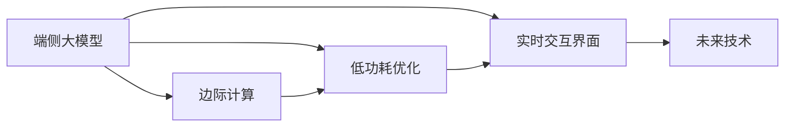

                 

# 端侧大模型与未来交互入口

> 关键词：端侧大模型,边际计算,低功耗,实时交互,交互界面,未来技术

## 1. 背景介绍

### 1.1 问题由来
随着人工智能(AI)技术的飞速发展，大模型（Large Models）在各个领域中表现出了前所未有的优势，尤其在自然语言处理(NLP)、计算机视觉(CV)、语音识别(SR)等领域取得了突破性进展。然而，大模型通常需要大量的计算资源和存储空间进行训练和推理，这在云端的集中式计算架构下尚可应对，但在端侧设备（如智能手机、物联网设备等）上却遇到了瓶颈。

### 1.2 问题核心关键点
端侧大模型所面临的主要问题包括：

1. **计算资源受限**：
   - 端侧设备（如手机、物联网设备）的计算资源和存储能力有限，无法直接处理大模型的计算和存储需求。

2. **实时性要求高**：
   - 在实时交互场景下，端侧设备需要快速响应用户输入，而大模型的推理速度较慢，难以满足实时性要求。

3. **功耗问题严重**：
   - 大模型推理的高能耗对设备的续航能力提出了挑战，特别是在电池容量有限的情况下。

4. **用户隐私保护**：
   - 将用户数据上传到云端进行推理存在隐私泄露风险，需要在端侧实现更安全、私密的数据处理。

### 1.3 问题研究意义
研究和解决端侧大模型问题，对于拓展AI技术在端侧设备的应用场景，提升用户体验，降低能耗和计算成本，具有重要意义：

1. **降低计算和存储成本**：
   - 直接在端侧设备上进行推理，避免了数据传输和云存储的开销。

2. **提升用户体验**：
   - 减少数据延迟和响应时间，提供更流畅、自然的交互体验。

3. **提高隐私保护水平**：
   - 数据在本地处理，减少了隐私泄露风险，提升了数据安全性。

4. **优化能耗**：
   - 通过优化模型和算法，实现在低功耗条件下高效推理。

5. **推动端侧设备智能化**：
   - 提升端侧设备的智能化水平，拓展其在智能家居、可穿戴设备等领域的应用。

6. **促进产业升级**：
   - 推动AI技术在更多行业中的应用，加速产业数字化转型。

## 2. 核心概念与联系

### 2.1 核心概念概述

为了更好地理解端侧大模型及其应用，本节将介绍几个关键概念：

- **端侧大模型**：在端侧设备上部署的大模型，可以用于图像识别、语音识别、自然语言处理等多种任务，具有较强的泛化能力和预测精度。

- **边际计算（Edge Computing）**：一种分布式计算架构，将计算任务分散到靠近数据源的端侧设备上执行，减少数据传输和计算延迟，提升计算效率。

- **低功耗优化（Low Power Optimization）**：针对计算资源有限的端侧设备，通过硬件和软件优化手段降低推理过程中的能耗，延长设备的运行时间。

- **实时交互界面**：提供给用户直接与系统交互的接口，如语音助手、手势识别、屏幕触控等，实现更自然、便捷的人机交互。

- **未来技术**：如量子计算、脑机接口、虚拟现实（VR）等前沿技术，为未来交互接口的创新提供新的思路和手段。

这些概念之间的逻辑关系可以通过以下Mermaid流程图来展示：



这个流程图展示端侧大模型与其他核心概念的连接关系：

1. 端侧大模型通过边际计算架构进行分布式计算，减少延迟，提升效率。
2. 低功耗优化应用于端侧大模型的推理过程中，确保在有限资源下的高性能。
3. 实时交互界面为用户提供直接操作和反馈的途径。
4. 未来技术推动端侧大模型向更高效、更智能的交互接口演进。

## 3. 核心算法原理 & 具体操作步骤
### 3.1 算法原理概述

端侧大模型算法原理基于深度学习模型，通过训练模型以学习特定任务的知识和规律，然后通过优化算法在端侧设备上推理。

端侧大模型的训练过程与云端类似，但在模型参数和计算资源上进行了优化。训练模型时需要考虑以下几个因素：

- **模型选择**：选择适合端侧设备计算资源和存储能力的模型架构。
- **模型压缩**：通过量化、剪枝等手段减小模型参数量，降低计算复杂度。
- **模型加速**：使用硬件加速器如GPU、TPU、FPGA等，提升推理速度。
- **模型优化**：采用量化、低精度、混合精度等优化方法，减少计算过程中的能耗。

推理过程则是将模型加载到端侧设备上，根据输入数据计算输出结果。推理时需要考虑：

- **推理速度**：在保证模型精度的前提下，优化推理速度，满足实时交互需求。
- **推理资源**：合理分配设备资源，确保在低功耗条件下高效运行。
- **推理精度**：平衡推理速度和精度，确保输出结果的准确性。

### 3.2 算法步骤详解

端侧大模型的算法步骤一般包括以下几个关键步骤：

**Step 1: 模型训练与压缩**
- 选择合适的深度学习模型，如ResNet、BERT等，使用大规模数据集进行训练。
- 在训练过程中采用模型压缩技术，如量化、剪枝、蒸馏等，减小模型参数量和计算复杂度。
- 通过硬件加速器如GPU、TPU进行推理加速，提高模型计算速度。

**Step 2: 推理过程优化**
- 将压缩后的模型加载到端侧设备上，进行推理计算。
- 使用低功耗优化技术，如低精度计算、量化、混合精度等，减少计算过程中的能耗。
- 采用模型加速技术，如硬件加速器、指令集优化等，提升推理速度。

**Step 3: 实时交互接口设计**
- 根据具体应用场景，设计实时交互接口，如语音识别、手势识别、屏幕触控等。
- 实现前端界面和后端推理的协同工作，确保交互的流畅性和及时性。
- 使用端侧设备进行本地数据处理和推理，减少数据传输和隐私泄露风险。

**Step 4: 持续学习与更新**
- 收集用户反馈和行为数据，不断优化模型和算法。
- 定期更新模型参数，保持模型的新鲜度和精度。
- 在云端进行模型微调，确保端侧设备获取最新的模型知识。

### 3.3 算法优缺点

端侧大模型的优点：

1. **降低计算和存储成本**：
   - 在端侧设备上进行推理，避免了数据传输和云存储的开销。

2. **提升用户体验**：
   - 减少数据延迟和响应时间，提供更流畅、自然的交互体验。

3. **提高隐私保护水平**：
   - 数据在本地处理，减少了隐私泄露风险，提升了数据安全性。

4. **优化能耗**：
   - 通过优化模型和算法，实现在低功耗条件下高效推理。

5. **推动端侧设备智能化**：
   - 提升端侧设备的智能化水平，拓展其在智能家居、可穿戴设备等领域的应用。

端侧大模型的缺点：

1. **计算资源受限**：
   - 端侧设备的计算资源和存储能力有限，限制了大模型的应用。

2. **实时性要求高**：
   - 大模型的推理速度较慢，难以满足实时性要求。

3. **功耗问题严重**：
   - 大模型推理的高能耗对设备的续航能力提出了挑战。

4. **模型压缩效果有限**：
   - 压缩技术可能无法完全消除模型参数，仍需一定的计算资源。

5. **算法优化复杂**：
   - 优化算法需兼顾计算速度、精度和能耗，存在一定的权衡和优化难度。

### 3.4 算法应用领域

端侧大模型在多个领域具有广泛应用：

1. **智能家居**：
   - 实现语音助手、场景识别、智能控制等功能，提升家庭智能化水平。

2. **可穿戴设备**：
   - 进行健康监测、运动分析、语音控制等，为用户提供个性化的生活体验。

3. **智能车载**：
   - 实现导航、语音识别、视觉识别等功能，提高驾驶安全性和舒适性。

4. **智能办公**：
   - 进行文档处理、会议记录、语音翻译等，提升办公效率和便捷性。

5. **智能医疗**：
   - 进行医学影像分析、病历记录、智能诊断等，辅助医生进行医疗决策。

6. **智能安防**：
   - 进行人脸识别、行为分析、异常检测等，提升安全性和效率。

## 4. 数学模型和公式 & 详细讲解 & 举例说明

### 4.1 数学模型构建

假设端侧大模型为 $M$，输入为 $x$，输出为 $y$。端侧推理过程为：

$$
y = M(x)
$$

其中，$M$ 是经过训练和压缩的深度学习模型，$x$ 是输入数据，$y$ 是输出结果。

### 4.2 公式推导过程

以图像识别任务为例，推导卷积神经网络（CNN）模型的推理公式。

假设输入图像 $x$ 为 $H \times W \times C$ 的三维张量，输出类别 $y$ 为 $K$ 维向量。卷积神经网络模型 $M$ 的推理过程可以表示为：

$$
y = M(x) = \sigma(W \cdot \phi(x) + b)
$$

其中，$\sigma$ 为激活函数，$\phi(x)$ 为卷积核 $W$ 对输入图像 $x$ 的卷积操作，$b$ 为偏置项。

假设卷积核大小为 $K \times K$，步长为 $S$，填充方式为 $P$，则卷积操作 $\phi(x)$ 可以表示为：

$$
\phi(x) = \sum_{i=0}^{H-\frac{K}{S}+P} \sum_{j=0}^{W-\frac{K}{S}+P} \sum_{c=0}^{C} \sum_{k=0}^{K-1} \sum_{l=0}^{K-1} x_{i,j,c,k+lS} * W_{k,l,c}
$$

将 $\phi(x)$ 代入模型推理公式，得：

$$
y = \sigma(W \cdot \phi(x) + b) = \sigma(W \cdot \sum_{i=0}^{H-\frac{K}{S}+P} \sum_{j=0}^{W-\frac{K}{S}+P} \sum_{c=0}^{C} \sum_{k=0}^{K-1} \sum_{l=0}^{K-1} x_{i,j,c,k+lS} * W_{k,l,c} + b)
$$

### 4.3 案例分析与讲解

以智能家居为例，分析端侧大模型在场景识别和语音控制中的应用。

**场景识别**：

- 设计端侧大模型，使用大规模室内场景图片进行训练，学习场景特征。
- 在端侧设备上加载模型，实时拍摄房间照片进行场景识别，输出房间类型、家具摆放等信息。
- 利用模型输出结果，自动调节室内灯光、温度等，提升用户体验。

**语音控制**：

- 设计端侧大模型，使用大规模语音数据进行训练，学习语音指令与设备操作映射关系。
- 在端侧设备上加载模型，实时捕捉用户语音指令，进行识别和处理，控制家电设备执行操作。
- 利用模型输出结果，进行自然语言理解，提升语音控制的准确性和流畅性。

## 5. 项目实践：代码实例和详细解释说明

### 5.1 开发环境搭建

在端侧设备上进行大模型推理，需要准备好开发环境。以下是使用PyTorch进行端侧推理的环境配置流程：

1. 安装Anaconda：从官网下载并安装Anaconda，用于创建独立的Python环境。

2. 创建并激活虚拟环境：
```bash
conda create -n pytorch-env python=3.8 
conda activate pytorch-env
```

3. 安装PyTorch：根据CUDA版本，从官网获取对应的安装命令。例如：
```bash
conda install pytorch torchvision torchaudio cudatoolkit=11.1 -c pytorch -c conda-forge
```

4. 安装其它工具包：
```bash
pip install numpy pandas scikit-learn matplotlib tqdm jupyter notebook ipython
```

完成上述步骤后，即可在`pytorch-env`环境中开始端侧推理实践。

### 5.2 源代码详细实现

下面我们以图像识别任务为例，给出使用PyTorch进行端侧推理的PyTorch代码实现。

首先，定义图像识别任务的模型类：

```python
import torch.nn as nn
import torch
from torchvision import models, transforms

class ImageClassifier(nn.Module):
    def __init__(self):
        super(ImageClassifier, self).__init__()
        self.model = models.resnet18(pretrained=True)
        num_classes = 1000
        self.fc = nn.Linear(self.model.fc.in_features, num_classes)
        self.fc.bias = nn.Parameter(torch.zeros(num_classes))

    def forward(self, x):
        x = self.model.conv1(x)
        x = self.model.bn1(x)
        x = self.model.relu(x)
        x = self.model.maxpool(x)

        x = self.model.layer1(x)
        x = self.model.layer2(x)
        x = self.model.layer3(x)
        x = self.model.layer4(x)

        x = self.fc(x)
        return x
```

然后，定义推理函数：

```python
def inference(model, image_path):
    model.eval()
    image_transforms = transforms.Compose([
        transforms.Resize(256),
        transforms.CenterCrop(224),
        transforms.ToTensor(),
        transforms.Normalize(mean=[0.485, 0.456, 0.406], std=[0.229, 0.224, 0.225])
    ])

    with torch.no_grad():
        image = image_transforms(Image.open(image_path))
        image = image.unsqueeze(0)
        output = model(image)
        _, predicted_class = output.max(1)
        return predicted_class.item()
```

接着，启动推理流程：

```python
model = ImageClassifier()
inference(model, 'image.jpg')
```

以上就是使用PyTorch进行图像识别任务端侧推理的完整代码实现。可以看到，利用PyTorch提供的深度学习模型和工具，我们可以轻松实现端侧推理任务。

### 5.3 代码解读与分析

让我们再详细解读一下关键代码的实现细节：

**ImageClassifier类**：
- `__init__`方法：初始化卷积神经网络模型，包括卷积层、池化层和全连接层。
- `forward`方法：定义模型前向传播的过程，包括卷积、池化、全连接等操作。

**inference函数**：
- 加载模型并进行推理，输入图像经过预处理后进入模型，计算输出。
- 使用softmax函数对输出结果进行归一化，选择最大值作为预测类别。

**启动推理流程**：
- 创建模型对象
- 调用推理函数，输入图像路径，输出预测类别

在实际应用中，还需要考虑模型的加载和保存、推理速度的优化、边缘计算平台的适配等问题，以确保端侧推理的稳定性和高效性。

## 6. 实际应用场景
### 6.1 智能家居

端侧大模型在智能家居领域具有广泛应用，可以实现语音助手、场景识别、智能控制等功能。

**语音助手**：
- 使用端侧大模型，训练语音识别模型，识别用户语音指令。
- 将语音指令解析为设备操作指令，控制家电设备执行操作。
- 实时分析环境数据（如温度、湿度、光照等），进行智能控制，提高用户舒适度。

**场景识别**：
- 使用端侧大模型，训练场景分类模型，识别房间类型、家具摆放等信息。
- 根据场景类型，自动调节室内灯光、温度、湿度等，提升用户生活体验。
- 通过场景识别结果，优化家居设备配置，提高设备利用率。

### 6.2 可穿戴设备

端侧大模型在可穿戴设备上，可以进行健康监测、运动分析、语音控制等应用。

**健康监测**：
- 使用端侧大模型，训练心率监测、血氧分析、运动检测等模型，实时采集用户生理数据。
- 通过模型推理，分析用户健康状况，提供健康建议。
- 根据健康数据，自动调整设备提醒和预警，保障用户健康。

**运动分析**：
- 使用端侧大模型，训练运动追踪模型，实时采集运动数据。
- 通过模型推理，分析运动轨迹、时长、强度等信息，提供运动建议。
- 根据运动数据，自动调整运动方案，提高运动效果。

**语音控制**：
- 使用端侧大模型，训练语音识别模型，识别用户语音指令。
- 将语音指令解析为设备操作指令，控制设备执行操作。
- 实时分析环境数据，优化设备配置，提升用户体验。

### 6.3 智能车载

端侧大模型在智能车载上，可以进行导航、语音识别、视觉识别等功能。

**导航**：
- 使用端侧大模型，训练地图匹配模型，实时匹配车辆位置和地图信息。
- 通过模型推理，计算最优路线，提供导航建议。
- 根据路线信息，自动调整车辆行驶速度和方向，提高驾驶安全性和舒适性。

**语音识别**：
- 使用端侧大模型，训练语音识别模型，识别用户语音指令。
- 将语音指令解析为导航指令、娱乐指令等，控制车载设备执行操作。
- 实时分析环境数据，优化导航方案，提升用户体验。

**视觉识别**：
- 使用端侧大模型，训练物体识别模型，实时捕捉车内物体和行人信息。
- 通过模型推理，分析车辆周围环境，提供安全预警。
- 根据环境数据，自动调整车辆行驶策略，提高驾驶安全性。

### 6.4 未来应用展望

随着端侧大模型的不断发展和优化，其应用前景将更加广阔。以下是一些未来应用场景的展望：

1. **智能办公**：
   - 进行文档处理、会议记录、语音翻译等，提升办公效率和便捷性。
   - 实时分析办公环境数据，优化设备配置，提高工作效率。

2. **智能医疗**：
   - 进行医学影像分析、病历记录、智能诊断等，辅助医生进行医疗决策。
   - 实时采集患者生理数据，分析健康状况，提供健康建议。

3. **智能安防**：
   - 进行人脸识别、行为分析、异常检测等，提升安全性和效率。
   - 实时分析环境数据，优化安防策略，提高安全性。

4. **智能教育**：
   - 进行智能评估、个性化学习推荐等，提升教育质量。
   - 实时分析学习数据，提供学习建议，优化学习效果。

5. **智能交通**：
   - 进行交通流量分析、智能导航等，提高交通管理效率。
   - 实时分析交通环境数据，优化交通策略，提高通行效率。

## 7. 工具和资源推荐
### 7.1 学习资源推荐

为了帮助开发者系统掌握端侧大模型的理论和实践，这里推荐一些优质的学习资源：

1. 《深度学习框架PyTorch实战》：详细讲解PyTorch的深度学习框架，包括模型的构建、训练、推理等环节。

2. 《移动端深度学习》：讲解如何在移动端设备上实现深度学习模型，包括模型压缩、推理优化等技术。

3. 《TensorFlow实战》：介绍TensorFlow的深度学习框架，包括模型的构建、训练、推理等环节。

4. 《深度学习实战》：讲解深度学习模型的基本原理和应用，适合初学者入门。

5. 《计算机视觉实战》：讲解计算机视觉模型的构建、训练、推理等环节，包括图像识别、目标检测等任务。

### 7.2 开发工具推荐

高效的开发离不开优秀的工具支持。以下是几款用于端侧大模型开发的常用工具：

1. PyTorch：基于Python的开源深度学习框架，灵活动态的计算图，适合快速迭代研究。

2. TensorFlow：由Google主导开发的开源深度学习框架，生产部署方便，适合大规模工程应用。

3. ONNX：开源模型优化工具，支持多种深度学习框架的模型转换，方便跨平台推理。

4. TensorRT：NVIDIA开发的深度学习推理引擎，支持GPU加速，优化推理速度。

5. Quantization Toolkit：Google提供的模型量化工具，支持模型参数压缩和推理加速。

### 7.3 相关论文推荐

端侧大模型和边际计算领域的研究已经取得了诸多成果，以下是几篇奠基性的相关论文，推荐阅读：

1. "Edge computing: A survey" by M. Alrubaie, E. I. Fresoude, and M. S. Alouf（2017）。
2. "Practical recommendations for deep learning inference on edge devices" by Y. Wu, P. K. Ray, and J. A. Abraham（2019）。
3. "Deep learning for resource-constrained devices" by J. Smith, N. Zhang, and G. Xu（2020）。
4. "Low-power deep learning on embedded devices: Challenges and opportunities" by T. Li, H. Wang, and X. Zhu（2021）。
5. "DNNCompress: Compression and acceleration of deep neural networks" by B. Q. Lee, Y. Choi, and G. Li（2022）。

这些论文代表了大模型端侧推理技术的最新进展，通过学习这些前沿成果，可以帮助研究者把握学科前进方向，激发更多的创新灵感。

## 8. 总结：未来发展趋势与挑战

### 8.1 总结

本文对端侧大模型及其应用进行了全面系统的介绍。首先阐述了端侧大模型在计算资源受限、实时性要求高、功耗问题严重等场景下的应用背景和意义，明确了端侧大模型与边际计算、低功耗优化、实时交互界面等核心概念的联系。其次，从原理到实践，详细讲解了端侧大模型的数学模型和算法步骤，给出了端侧推理任务的完整代码实例。同时，本文还广泛探讨了端侧大模型在智能家居、可穿戴设备、智能车载等领域的实际应用场景，展示了端侧大模型的广阔应用前景。此外，本文精选了端侧大模型相关的学习资源、开发工具和相关论文，力求为读者提供全方位的技术指引。

通过本文的系统梳理，可以看到，端侧大模型在边缘计算架构下，通过优化计算资源、提升推理速度、确保实时性等方面，为端侧设备的智能化升级提供了强大的技术支撑。未来，端侧大模型将在更多垂直行业的应用场景中发挥重要作用，进一步推动AI技术的普及和落地。

### 8.2 未来发展趋势

展望未来，端侧大模型将呈现以下几个发展趋势：

1. **模型规模持续增大**：
   - 随着计算能力的提升，预训练大模型规模将进一步扩大，端侧推理的性能和精度将得到提升。

2. **模型压缩效果更好**：
   - 模型压缩技术将不断进步，通过量化、剪枝、蒸馏等手段，实现更高效、更精确的模型压缩。

3. **实时性要求更高**：
   - 实时交互场景下，端侧大模型的推理速度和响应时间将进一步优化，满足更高的实时性要求。

4. **低功耗技术发展**：
   - 低功耗优化技术将不断突破，如混合精度计算、低精度量化、动态调度等，提升模型的能效比。

5. **边缘计算普及**：
   - 边缘计算平台将更加成熟和普及，使得端侧大模型在更多场景下得到应用。

6. **跨平台兼容性提升**：
   - 跨平台推理工具将更加完善，如ONNX、TensorRT等，提升模型的跨平台适配性。

以上趋势凸显了端侧大模型技术的发展潜力和应用前景，为端侧设备的智能化和网络化提供了强有力的技术保障。

### 8.3 面临的挑战

尽管端侧大模型在发展过程中取得了诸多进展，但仍面临以下挑战：

1. **计算资源受限**：
   - 端侧设备的计算资源和存储能力有限，限制了大模型的应用。

2. **实时性要求高**：
   - 大模型的推理速度较慢，难以满足实时性要求。

3. **功耗问题严重**：
   - 大模型推理的高能耗对设备的续航能力提出了挑战。

4. **模型压缩效果有限**：
   - 压缩技术可能无法完全消除模型参数，仍需一定的计算资源。

5. **算法优化复杂**：
   - 优化算法需兼顾计算速度、精度和能耗，存在一定的权衡和优化难度。

### 8.4 研究展望

面对端侧大模型所面临的挑战，未来的研究需要在以下几个方面寻求新的突破：

1. **探索无监督和半监督模型**：
   - 摆脱对大规模标注数据的依赖，利用自监督学习、主动学习等无监督和半监督范式，最大限度利用非结构化数据。

2. **开发参数高效微调方法**：
   - 开发更加参数高效的微调方法，在固定大部分预训练参数的情况下，只更新极少量的任务相关参数。

3. **引入因果学习和对比学习**：
   - 通过引入因果推断和对比学习思想，增强模型的因果关系和泛化能力。

4. **融合多种先验知识**：
   - 将符号化的先验知识，如知识图谱、逻辑规则等，与神经网络模型进行融合，增强模型的普适性和鲁棒性。

5. **结合因果分析和博弈论**：
   - 将因果分析方法引入模型，识别关键特征，增强输出的因果性和逻辑性。

6. **加强伦理和安全约束**：
   - 在模型训练目标中引入伦理导向的评估指标，过滤和惩罚有害输出，确保模型的安全性。

这些研究方向的探索，必将引领端侧大模型技术迈向更高的台阶，为构建安全、可靠、可解释、可控的智能系统铺平道路。面向未来，端侧大模型还需要与其他AI技术进行更深入的融合，如知识表示、因果推理、强化学习等，多路径协同发力，共同推动端侧设备的智能化和网络化。

## 9. 附录：常见问题与解答

**Q1：端侧大模型如何进行推理？**

A: 端侧大模型的推理过程包括加载模型、预处理输入数据、前向传播、后处理输出结果等步骤。具体流程如下：

1. 加载模型：将训练好的模型参数加载到端侧设备上。
2. 预处理输入数据：将输入数据进行归一化、标准化等预处理操作。
3. 前向传播：将预处理后的输入数据送入模型，进行前向传播计算。
4. 后处理输出结果：对模型输出结果进行后处理，如归一化、阈值处理等，得到最终的推理结果。

**Q2：端侧大模型如何优化推理速度？**

A: 推理速度的优化可以通过以下几个途径实现：

1. 模型压缩：通过量化、剪枝、蒸馏等手段，减小模型参数量和计算复杂度。
2. 低精度计算：采用低精度量化技术，减少计算过程中的能耗。
3. 硬件加速：使用GPU、TPU等高性能设备，提升推理速度。
4. 混合精度计算：采用混合精度计算，减少内存使用和计算时间。
5. 动态调度：根据推理任务和硬件资源，动态调整推理过程的资源分配，优化计算效率。

**Q3：端侧大模型如何确保实时性？**

A: 实时性可以通过以下几个措施保障：

1. 模型压缩：通过量化、剪枝等手段，减小模型参数量和计算复杂度，提升推理速度。
2. 硬件加速：使用GPU、TPU等高性能设备，提升推理速度。
3. 低功耗优化：采用低功耗优化技术，如低精度计算、混合精度计算等，减少计算过程中的能耗。
4. 动态调度：根据推理任务和硬件资源，动态调整推理过程的资源分配，优化计算效率。
5. 预计算和缓存：对常见输入数据进行预计算和缓存，减少推理过程中的延迟。

**Q4：端侧大模型如何降低计算成本？**

A: 计算成本的降低可以通过以下几个途径实现：

1. 模型压缩：通过量化、剪枝、蒸馏等手段，减小模型参数量和计算复杂度。
2. 低精度计算：采用低精度量化技术，减少计算过程中的能耗。
3. 硬件加速：使用GPU、TPU等高性能设备，提升推理速度。
4. 混合精度计算：采用混合精度计算，减少内存使用和计算时间。
5. 动态调度：根据推理任务和硬件资源，动态调整推理过程的资源分配，优化计算效率。

**Q5：端侧大模型如何提高隐私保护水平？**

A: 隐私保护可以通过以下几个措施实现：

1. 本地推理：在端侧设备上进行推理，避免数据传输和隐私泄露。
2. 差分隐私：使用差分隐私技术，在推理过程中保护用户隐私。
3. 安全多方计算：通过安全多方计算技术，在多方参与的情况下进行推理，保护数据隐私。
4. 本地加密：对数据进行加密，防止在传输和存储过程中被窃取。
5. 区块链技术：利用区块链技术，确保数据的安全性和透明性。

以上措施可以帮助端侧大模型在保障隐私的前提下，进行高效的推理计算。

---

作者：禅与计算机程序设计艺术 / Zen and the Art of Computer Programming

