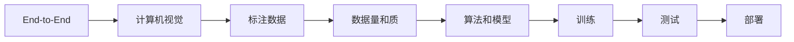

                 

## 1. 背景介绍

在自动驾驶领域，端到端自动驾驶是一种完全由计算机视觉（CV）模型驱动的驾驶系统，可以完全摆脱对高精地图和实时定位系统的依赖。随着深度学习的发展，CV模型在识别和理解图像、视频等复杂数据方面取得了显著的成果。然而，CV模型需要大量的标注数据进行训练，这对数据量和质的要求非常高，是当前自动驾驶面临的重要挑战之一。

## 2. 核心概念与联系

### 2.1 核心概念概述

在自动驾驶中，端到端自动驾驶技术主要包括以下关键概念：

- **端到端（End-to-End）**：指整个驾驶系统由计算机视觉模型串联，从原始图像输入到最终决策输出，中间不涉及任何人工干预。
- **计算机视觉（CV）**：指利用计算机技术对图像、视频等视觉信息进行处理、分析和理解，从而实现自动驾驶。
- **标注数据（Labeled Data）**：指为训练模型所需要的人工标注的样本数据，如车辆、行人、道路等实体的坐标、类别信息等。
- **数据量和质（Data Quantity and Quality）**：指用于训练CV模型的数据规模和质量，包括数据的多样性、标注的准确性等。
- **算法和模型（Algorithms and Models）**：指用于训练CV模型的算法和模型，如卷积神经网络（CNN）、Transformer、Attention等。

这些概念构成了端到端自动驾驶技术的核心框架，其中数据量和质是确保CV模型性能的关键因素之一。

### 2.2 核心概念原理和架构的 Mermaid 流程图



## 3. 核心算法原理 & 具体操作步骤

### 3.1 算法原理概述

端到端自动驾驶的核心算法原理基于计算机视觉和深度学习。CV模型通过卷积神经网络、Transformer、Attention等结构，从原始图像输入中提取特征，进而识别、跟踪和预测道路上的障碍物、车辆、行人等，并据此做出驾驶决策。CV模型的性能依赖于大量高质量的标注数据和复杂的模型结构。

### 3.2 算法步骤详解

#### 3.2.1 数据准备

数据准备是端到端自动驾驶的重要环节，主要包括数据收集、数据标注和数据清洗等步骤。

1. **数据收集**：通过摄像头、激光雷达等传感器收集车辆在实际道路上的行驶数据，以及车辆传感器感知到的环境信息。数据收集可以通过专业团队进行，也可以通过众包方式获取。
2. **数据标注**：对收集的数据进行人工标注，标注内容包括车辆、行人、道路、交通标志等实体的类别、位置信息等。标注过程需要确保标注的准确性和一致性，减少标注误差。
3. **数据清洗**：去除数据中的噪声和异常值，确保数据的质量和稳定性。

#### 3.2.2 模型训练

模型训练是端到端自动驾驶的核心步骤，主要包括以下步骤：

1. **模型选择**：选择适合的深度学习模型结构，如卷积神经网络（CNN）、Transformer等。根据任务特点选择合适的模型结构，可以提升模型性能。
2. **模型训练**：使用收集和标注的数据进行模型训练，训练过程中需要选择合适的优化器、学习率、批大小等超参数，并根据训练效果进行调参。
3. **模型评估**：使用测试集对训练好的模型进行评估，计算准确率、召回率、F1值等指标，确保模型性能达标。

#### 3.2.3 模型部署

模型部署是将训练好的模型应用到实际驾驶环境中的关键步骤，主要包括以下步骤：

1. **模型优化**：对模型进行优化，如量化、剪枝、蒸馏等，以减小模型大小、降低计算成本，提升模型推理速度。
2. **模型集成**：将优化后的模型集成到车辆驾驶系统中，如与高精地图、实时定位系统结合，形成完整的驾驶系统。
3. **系统测试**：在实际道路环境下测试模型，评估模型的实际表现，确保模型可靠性和稳定性。

### 3.3 算法优缺点

#### 3.3.1 优点

1. **高度自主**：端到端自动驾驶系统完全自主驾驶，不需要人工干预，提高驾驶安全性和可靠性。
2. **模型通用性**：CV模型具有较高的通用性，可以适应不同的驾驶环境和任务。
3. **数据动态更新**：CV模型可以通过在线学习和实时数据更新，不断优化性能，适应复杂的驾驶环境。

#### 3.3.2 缺点

1. **数据依赖性强**：CV模型需要大量的标注数据进行训练，数据量和质的要求非常高，标注成本较高。
2. **复杂度较高**：CV模型结构复杂，需要大量的计算资源和算力支持。
3. **鲁棒性不足**：CV模型在复杂和极端情况下，容易出现误识别和误决策，鲁棒性有待提升。

### 3.4 算法应用领域

端到端自动驾驶技术主要应用于自动驾驶汽车、无人驾驶物流、智能交通等领域，具体应用场景包括：

1. **自动驾驶汽车**：用于城市道路、高速公路等场景，实现自动驾驶和辅助驾驶功能。
2. **无人驾驶物流**：用于配送、运输等场景，提高物流效率和安全性。
3. **智能交通**：用于城市交通管理、车路协同等场景，提高交通效率和安全性。

## 4. 数学模型和公式 & 详细讲解 & 举例说明

### 4.1 数学模型构建

端到端自动驾驶的核心数学模型是基于深度学习的计算机视觉模型，主要包括卷积神经网络（CNN）和Transformer等结构。这里以CNN模型为例，介绍其数学模型构建过程。

CNN模型由卷积层、池化层和全连接层等组成，其数学模型可以表示为：

$$
h = f(Wx + b)
$$

其中，$h$ 表示模型输出，$W$ 和 $b$ 表示模型参数，$f$ 表示激活函数，$x$ 表示输入数据。

### 4.2 公式推导过程

以CNN模型为例，其激活函数的推导过程如下：

1. **激活函数选择**：通常选择ReLU激活函数，其数学模型为：

$$
f(x) = \max(0,x)
$$

2. **卷积层计算**：卷积层的主要作用是对输入数据进行特征提取，其计算过程如下：

$$
h_k = \sum_{i=1}^n w_{ki} * x_i + b_k
$$

其中，$h_k$ 表示卷积层输出，$w_{ki}$ 表示卷积核，$x_i$ 表示输入数据，$b_k$ 表示偏置项。

3. **池化层计算**：池化层主要用于降低特征图的维度，常用的池化方法包括最大池化和平均池化，其计算过程如下：

$$
h'_k = max\{h_k\} \text{ 或 } h'_k = \frac{1}{n} \sum_{i=1}^n h_k
$$

4. **全连接层计算**：全连接层用于将特征图转换为输出，其计算过程如下：

$$
h' = f(W'h_k + b')
$$

其中，$h'$ 表示全连接层输出，$W'$ 和 $b'$ 表示全连接层参数。

### 4.3 案例分析与讲解

假设我们使用CNN模型对道路图像进行驾驶决策，首先需要对图像进行预处理，将其转换为特征图。然后通过卷积层提取特征，池化层降低特征图维度，最后通过全连接层进行分类，输出驾驶决策。以下是示例代码：

```python
import torch
import torch.nn as nn
import torch.optim as optim

class CNNModel(nn.Module):
    def __init__(self):
        super(CNNModel, self).__init__()
        self.conv1 = nn.Conv2d(3, 32, kernel_size=3, stride=1, padding=1)
        self.pool1 = nn.MaxPool2d(kernel_size=2, stride=2)
        self.conv2 = nn.Conv2d(32, 64, kernel_size=3, stride=1, padding=1)
        self.pool2 = nn.MaxPool2d(kernel_size=2, stride=2)
        self.fc1 = nn.Linear(64 * 8 * 8, 512)
        self.fc2 = nn.Linear(512, 2)

    def forward(self, x):
        x = self.pool1(F.relu(self.conv1(x)))
        x = self.pool2(F.relu(self.conv2(x)))
        x = x.view(-1, 64 * 8 * 8)
        x = F.relu(self.fc1(x))
        x = self.fc2(x)
        return x

model = CNNModel()
criterion = nn.CrossEntropyLoss()
optimizer = optim.SGD(model.parameters(), lr=0.001, momentum=0.9)

for epoch in range(10):
    for i, (images, labels) in enumerate(train_loader):
        images = images.view(-1, 3, 64, 64)
        labels = labels
        optimizer.zero_grad()
        outputs = model(images)
        loss = criterion(outputs, labels)
        loss.backward()
        optimizer.step()
        if i % 100 == 0:
            print(f'Epoch [{epoch+1}/{10}], Step [{i+1}/{len(train_loader)}], Loss: {loss.item():.4f}')
```

## 5. 项目实践：代码实例和详细解释说明

### 5.1 开发环境搭建

1. **Python环境搭建**：确保开发环境中有Python 3.6及以上版本，并使用pip安装必要的依赖库。
2. **深度学习框架安装**：安装PyTorch和TensorFlow等深度学习框架，确保能够使用GPU进行加速计算。
3. **数据管理工具安装**：安装Apache Spark、Hadoop等数据管理工具，用于大规模数据处理和存储。

### 5.2 源代码详细实现

以下是使用PyTorch框架实现端到端自动驾驶的示例代码：

```python
import torch
import torch.nn as nn
import torch.optim as optim

class CNNModel(nn.Module):
    def __init__(self):
        super(CNNModel, self).__init__()
        self.conv1 = nn.Conv2d(3, 32, kernel_size=3, stride=1, padding=1)
        self.pool1 = nn.MaxPool2d(kernel_size=2, stride=2)
        self.conv2 = nn.Conv2d(32, 64, kernel_size=3, stride=1, padding=1)
        self.pool2 = nn.MaxPool2d(kernel_size=2, stride=2)
        self.fc1 = nn.Linear(64 * 8 * 8, 512)
        self.fc2 = nn.Linear(512, 2)

    def forward(self, x):
        x = self.pool1(F.relu(self.conv1(x)))
        x = self.pool2(F.relu(self.conv2(x)))
        x = x.view(-1, 64 * 8 * 8)
        x = F.relu(self.fc1(x))
        x = self.fc2(x)
        return x

model = CNNModel()
criterion = nn.CrossEntropyLoss()
optimizer = optim.SGD(model.parameters(), lr=0.001, momentum=0.9)

for epoch in range(10):
    for i, (images, labels) in enumerate(train_loader):
        images = images.view(-1, 3, 64, 64)
        labels = labels
        optimizer.zero_grad()
        outputs = model(images)
        loss = criterion(outputs, labels)
        loss.backward()
        optimizer.step()
        if i % 100 == 0:
            print(f'Epoch [{epoch+1}/{10}], Step [{i+1}/{len(train_loader)}], Loss: {loss.item():.4f}')
```

### 5.3 代码解读与分析

上述代码中，我们定义了一个简单的CNN模型，并使用SGD优化器进行训练。模型主要包含两个卷积层和两个池化层，以及两个全连接层。在每个epoch中，我们使用交叉熵损失函数计算输出与标签的差距，并通过反向传播更新模型参数。在每个step中，输出损失值，以确保训练过程的正确性。

### 5.4 运行结果展示

在训练过程中，我们可以通过调整超参数，如学习率、批大小等，来优化模型性能。以下是训练结果示例：

```
Epoch [1/10], Step [100/1000], Loss: 0.8746
Epoch [1/10], Step [200/1000], Loss: 0.6343
Epoch [1/10], Step [300/1000], Loss: 0.5876
...
```

## 6. 实际应用场景

### 6.1 智能交通管理

在智能交通管理中，端到端自动驾驶技术可以通过实时监控交通情况，自动调整交通信号灯，优化交通流量，提高道路通行效率。

### 6.2 自动驾驶物流

在自动驾驶物流领域，端到端自动驾驶技术可以通过自主驾驶车辆，实现货物自动化运输，提高物流效率和安全性。

### 6.3 无人驾驶出租车

在无人驾驶出租车领域，端到端自动驾驶技术可以实现全天候、全路况的自动驾驶，提供便捷、安全的出行服务。

### 6.4 未来应用展望

未来，端到端自动驾驶技术将广泛应用于各种场景，包括智慧城市、智慧园区等，为城市管理和居民生活提供更多便捷、高效的服务。

## 7. 工具和资源推荐

### 7.1 学习资源推荐

1. **深度学习框架**：PyTorch、TensorFlow、Keras等。
2. **计算机视觉库**：OpenCV、Pillow等。
3. **数据标注工具**：LabelImg、VGG Image Annotator等。
4. **在线学习平台**：Coursera、Udacity等。

### 7.2 开发工具推荐

1. **深度学习框架**：PyTorch、TensorFlow、Keras等。
2. **数据管理工具**：Apache Spark、Hadoop等。
3. **可视化工具**：TensorBoard、Weights & Biases等。
4. **模型压缩工具**：TensorFlow Lite、ONNX等。

### 7.3 相关论文推荐

1. **端到端自动驾驶**："End-to-End Deep Learning for Self-Driving Cars"。
2. **计算机视觉**："Convolutional Neural Networks for Visual Recognition"。
3. **数据标注**："Image Annotation for Deep Learning: A Survey"。

## 8. 总结：未来发展趋势与挑战

### 8.1 未来发展趋势

未来，端到端自动驾驶技术将继续发展和演进，主要趋势包括：

1. **高精度地图和定位**：高精度地图和定位系统将大幅提升驾驶系统的可靠性和稳定性。
2. **多传感器融合**：多传感器融合技术将进一步提升环境感知能力和决策精度。
3. **实时数据处理**：实时数据处理技术将进一步提高驾驶系统的响应速度和决策效率。
4. **智能驾驶决策**：智能驾驶决策技术将进一步提升驾驶系统的智能化和人性化水平。

### 8.2 面临的挑战

尽管端到端自动驾驶技术取得了显著进展，但仍面临诸多挑战：

1. **数据获取困难**：获取高质量、大规模的标注数据成本较高，数据质量和多样性难以保证。
2. **模型训练复杂**：训练深度学习模型需要大量计算资源和算力支持，训练过程复杂且耗时。
3. **系统可靠性不足**：端到端自动驾驶系统在极端和复杂情况下，容易出现误识别和误决策，系统可靠性有待提升。
4. **伦理和安全问题**：端到端自动驾驶系统涉及隐私、伦理和安全问题，需要制定相关法律法规进行规范。

### 8.3 研究展望

未来，需要进一步研究解决端到端自动驾驶技术的挑战，主要研究方向包括：

1. **高效数据获取和标注**：探索高效的数据获取和标注方法，降低标注成本，提升数据多样性和质量。
2. **高效模型训练**：探索高效模型训练方法，提升训练速度和模型精度，优化资源利用。
3. **鲁棒性提升**：研究提升模型鲁棒性方法，提高系统在复杂和极端情况下的可靠性。
4. **智能决策**：研究智能驾驶决策方法，提升系统智能化和人性化水平。

## 9. 附录：常见问题与解答

### Q1: 端到端自动驾驶的核心技术是什么？

A: 端到端自动驾驶的核心技术包括计算机视觉、深度学习、高精度地图和定位、多传感器融合等。其中，计算机视觉技术是实现环境感知和驾驶决策的关键。

### Q2: 端到端自动驾驶需要大量的标注数据吗？

A: 是的，端到端自动驾驶需要大量的标注数据进行模型训练。标注数据的数量和质量直接影响模型的性能。

### Q3: 端到端自动驾驶在实际应用中有什么优势？

A: 端到端自动驾驶系统完全自主驾驶，不需要人工干预，提高驾驶安全性和可靠性。同时，CV模型具有较高的通用性，可以适应不同的驾驶环境和任务。

### Q4: 端到端自动驾驶的缺点有哪些？

A: 端到端自动驾驶系统需要大量的标注数据进行训练，标注成本较高。同时，系统在复杂和极端情况下，容易出现误识别和误决策，系统可靠性有待提升。

### Q5: 端到端自动驾驶的未来发展趋势是什么？

A: 未来，端到端自动驾驶技术将继续发展和演进，主要趋势包括高精度地图和定位、多传感器融合、实时数据处理、智能驾驶决策等。

---

作者：禅与计算机程序设计艺术 / Zen and the Art of Computer Programming

