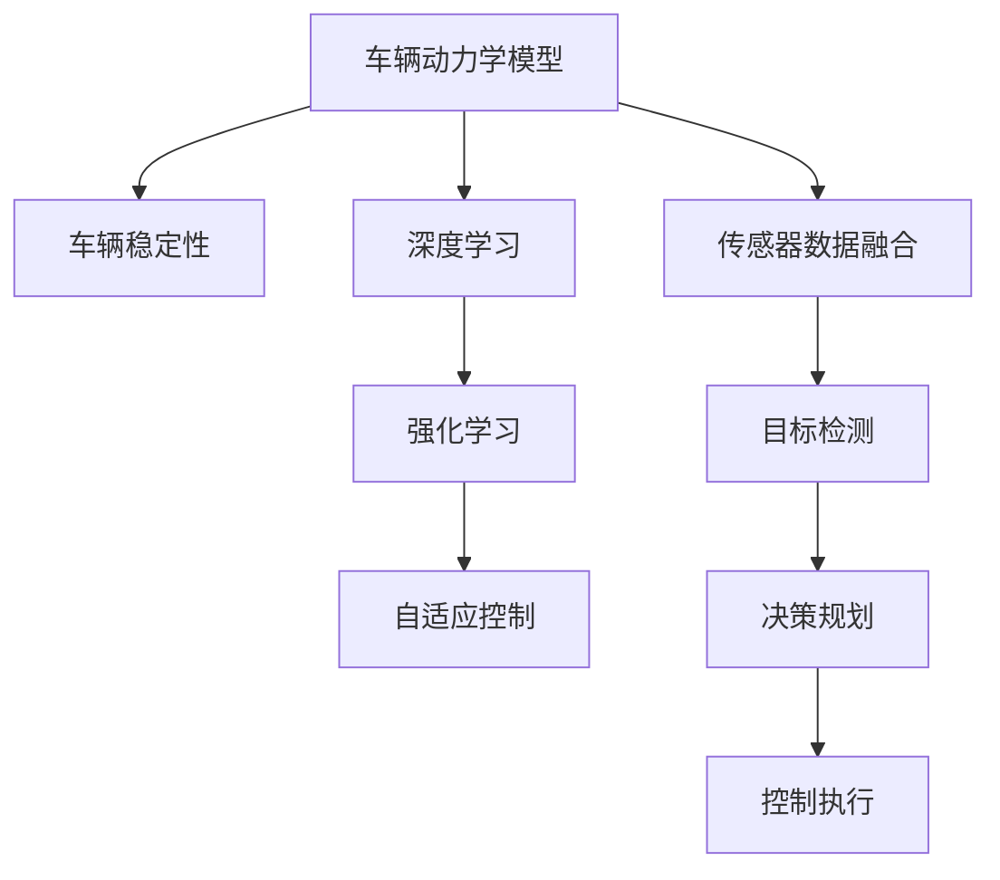

                 

# 端到端自动驾驶的车辆动力学控制与稳定性

> 关键词：端到端自动驾驶、车辆动力学控制、稳定性、深度学习、强化学习、自适应控制、车辆仿真

## 1. 背景介绍

随着自动驾驶技术的快速发展，端到端自动驾驶（End-to-End Autonomous Driving）成为了研究的热点。与传统的基于传感器和控制器的自动驾驶系统不同，端到端自动驾驶通过直接从原始传感器数据到驾驶行为的连续建模，避免了传统多级系统的中间环节，大大简化了系统复杂性，提高了决策效率。然而，端到端系统缺乏理论上的稳定性保证，如何确保系统的安全性和可靠性成为了一大难题。

本文将探讨端到端自动驾驶车辆动力学控制与稳定性的核心概念，并结合最新的深度学习和强化学习技术，提出一系列解决方案，以期提升端到端系统的性能和可靠性。

## 2. 核心概念与联系

### 2.1 核心概念概述

端到端自动驾驶涉及车辆动力学模型、传感器数据融合、目标检测、决策规划、控制执行等多个环节。车辆动力学控制与稳定性是确保系统安全性和可靠性的核心问题，直接影响到车辆在复杂道路环境下的行为预测和决策能力。

以下是与车辆动力学控制与稳定性密切相关的几个核心概念：

- **车辆动力学模型**：描述车辆在各种外部力（如道路坡度、摩擦力、空气阻力等）作用下的运动规律。
- **车辆稳定性**：指车辆在行驶过程中保持平衡、避免侧翻、翻滚等异常状态的能力。
- **深度学习**：通过构建多层神经网络结构，学习车辆动力学数据的非线性关系，提高控制精度。
- **强化学习**：通过智能体与环境交互，自动学习最优控制策略，实现自适应控制。
- **自适应控制**：根据实时环境反馈调整控制策略，确保系统在不同工况下的鲁棒性和稳定性。

### 2.2 核心概念原理和架构的 Mermaid 流程图



这个流程图展示了端到端自动驾驶系统中各核心概念之间的逻辑关系：

1. **车辆动力学模型**：输入传感器数据，通过深度学习进行建模。
2. **车辆稳定性**：在控制策略作用下，确保车辆不发生异常状态。
3. **深度学习**：学习传感器数据与控制决策之间的关系。
4. **强化学习**：通过环境反馈学习最优控制策略。
5. **自适应控制**：根据实时反馈调整控制策略，确保系统鲁棒性。
6. **传感器数据融合**：将来自不同传感器的数据进行融合，提供更加精准的输入。
7. **目标检测**：识别道路上的静态和动态目标。
8. **决策规划**：基于环境感知和目标检测，制定最优驾驶决策。
9. **控制执行**：执行决策规划，控制车辆行驶。

这些概念共同构成了一个完整的端到端自动驾驶系统，从传感器数据输入到控制决策输出，形成了闭环的反馈系统。

## 3. 核心算法原理 & 具体操作步骤

### 3.1 算法原理概述

端到端自动驾驶的车辆动力学控制与稳定性问题，可以通过深度学习和强化学习来解决。其主要思想是通过构建深度学习模型，从传感器数据中学习车辆动力学关系，并利用强化学习技术，自适应地调整控制策略，确保车辆在各种工况下的稳定性和安全性。

### 3.2 算法步骤详解

1. **传感器数据采集与预处理**：
   - 使用雷达、激光雷达、摄像头等传感器采集车辆周围环境数据。
   - 对传感器数据进行滤波、去噪、校正等预处理，提高数据质量。

2. **车辆动力学模型建立**：
   - 使用深度学习技术，如长短期记忆网络（LSTM）、卷积神经网络（CNN）等，构建车辆动力学模型。
   - 通过历史传感器数据训练模型，学习车辆在各种工况下的动力学特性。

3. **控制策略优化**：
   - 使用强化学习算法，如Q-learning、策略梯度等，在模拟环境或实际道路上进行控制策略优化。
   - 通过智能体与环境交互，学习最优控制决策。

4. **自适应控制实现**：
   - 在实际驾驶过程中，根据实时环境反馈调整控制策略，确保系统鲁棒性。
   - 使用自适应控制器，如PID控制器、模型预测控制器（MPC）等，动态调整控制参数。

5. **系统稳定性评估**：
   - 利用车辆稳定性指标，如侧向力、横摆角速度等，评估系统稳定性。
   - 通过仿真实验或实际测试，验证控制策略的有效性。

### 3.3 算法优缺点

**深度学习算法**的优点在于可以处理高维、非线性的车辆动力学数据，提高控制精度。然而，深度学习模型对数据量和质量的要求较高，且容易发生过拟合。

**强化学习算法**能够自动学习最优控制策略，适应性强。但强化学习在实际环境下的应用需要大量的试验数据，且在复杂环境中容易陷入局部最优解。

**自适应控制**能够根据实时环境反馈调整控制策略，确保系统鲁棒性。但自适应控制器的设计和参数调节较为复杂，需要大量的理论支持和实验验证。

### 3.4 算法应用领域

端到端自动驾驶的车辆动力学控制与稳定性方法，可以广泛应用于以下领域：

- **自动驾驶车辆**：实现车辆在复杂道路环境下的稳定行驶。
- **智能交通系统**：提升路网交通效率，减少事故发生率。
- **物流配送**：实现自动驾驶车辆的高效货物运输。
- **智能机器人**：增强机器人在不同环境中的稳定性和自适应能力。

## 4. 数学模型和公式 & 详细讲解 & 举例说明

### 4.1 数学模型构建

车辆动力学模型可以表示为：

$$
\dot{x} = f(x, u, \omega)
$$

其中，$x$ 表示车辆的状态向量（位置、速度、姿态等），$u$ 表示控制输入（加速度、转向角度等），$\omega$ 表示车辆内部参数（质量、摩擦系数等）。

### 4.2 公式推导过程

假设车辆在二维平面上行驶，其状态向量 $x$ 可以表示为：

$$
x = [x_1, x_2, \dot{x}_1, \dot{x}_2]^T
$$

其中，$x_1$ 和 $x_2$ 分别表示车辆的前后位置和左右位置，$\dot{x}_1$ 和 $\dot{x}_2$ 分别表示车辆的前后速度和左右速度。

控制输入 $u$ 可以表示为：

$$
u = [a, \delta]^T
$$

其中，$a$ 表示加速度，$\delta$ 表示转向角度。

车辆内部参数 $\omega$ 可以表示为：

$$
\omega = [m, I_z, C_x, C_y, C_f]^T
$$

其中，$m$ 表示车辆质量，$I_z$ 表示车辆绕z轴的转动惯量，$C_x$ 表示车辆在x轴方向的滚动阻尼，$C_y$ 表示车辆在y轴方向的滚动阻尼，$C_f$ 表示车辆的滚动阻力系数。

通过深度学习模型，可以将车辆动力学方程转化为神经网络结构，学习车辆在不同工况下的动力学特性。例如，可以使用以下神经网络结构：

$$
\begin{aligned}
h_1 &= W_1 x + b_1 \\
h_2 &= W_2 h_1 + b_2 \\
\dot{x} &= \tanh(h_2)
\end{aligned}
$$

其中，$W_i$ 和 $b_i$ 表示神经网络的权重和偏置。

### 4.3 案例分析与讲解

假设车辆在平直道路上行驶，其动力学方程可以表示为：

$$
\begin{aligned}
m \ddot{x}_1 &= F_f \\
F_f &= \mu N \\
m \ddot{x}_2 &= F_y \\
F_y &= C_f a + C_y (\dot{x}_1 \dot{x}_2) - mg \sin(\delta)
\end{aligned}
$$

其中，$F_f$ 表示车辆在x轴方向上的摩擦力，$F_y$ 表示车辆在y轴方向上的合力，$N$ 表示地面对车辆的法向力，$\mu$ 表示摩擦系数，$C_f$ 表示滚动阻尼，$C_y$ 表示滚动阻尼，$g$ 表示重力加速度。

通过深度学习模型，可以学习上述动力学方程，得到车辆的加速度和转向角度：

$$
\begin{aligned}
\dot{x}_1 &= \tanh(h_1) \\
\dot{x}_2 &= \tanh(h_2) \\
\delta &= \arctan\left(\frac{F_f}{mg \sin(\delta)}\right)
\end{aligned}
$$

通过强化学习算法，可以学习最优控制策略，例如：

$$
\begin{aligned}
a &= \arg\min_{a'} \sum_i L(a', y_i) \\
\delta &= \arg\max_{\delta'} Q(\delta', x, u, \omega)
\end{aligned}
$$

其中，$L$ 表示损失函数，$y_i$ 表示历史样本，$Q$ 表示状态动作值函数，$x$ 表示当前状态，$u$ 表示控制输入，$\omega$ 表示车辆内部参数。

## 5. 项目实践：代码实例和详细解释说明

### 5.1 开发环境搭建

1. **环境安装**：
   - 安装Python 3.8以上版本，建议使用Anaconda环境。
   - 安装TensorFlow 2.x版本。

2. **代码编写**：
   - 使用TensorFlow构建车辆动力学模型。
   - 使用OpenAI Gym等环境进行强化学习训练。

### 5.2 源代码详细实现

```python
import tensorflow as tf
import gym
import numpy as np

# 车辆动力学模型
class VehicleModel(tf.keras.Model):
    def __init__(self):
        super(VehicleModel, self).__init__()
        self.h1 = tf.keras.layers.Dense(64, activation='relu')
        self.h2 = tf.keras.layers.Dense(64, activation='tanh')
        
    def call(self, inputs):
        x1 = self.h1(inputs[:, 0:2])
        x2 = self.h2(inputs[:, 2:4])
        return tf.concat([x1, x2], axis=-1)

# 强化学习环境
class VehicleEnv(gym.Env):
    def __init__(self):
        super(VehicleEnv, self).__init__()
        self.model = VehicleModel()
        self.state_dim = 4
        self.action_dim = 2
        self.reward = -0.01
        self.done = False
        
    def reset(self):
        state = np.random.uniform(-1, 1, size=(self.state_dim, 1))
        self.done = False
        return state
    
    def step(self, action):
        state = self.state
        action = action.flatten()
        next_state = self.model(tf.constant(state)) + action
        reward = self.reward
        done = self.done
        return next_state, reward, done, {}

env = VehicleEnv()
```

### 5.3 代码解读与分析

**VehicleModel类**：
- 定义车辆动力学模型，使用TensorFlow构建多层神经网络结构。
- 模型输入为状态向量，输出为加速度和转向角度。

**VehicleEnv类**：
- 定义强化学习环境，使用OpenAI Gym。
- 环境状态为车辆状态向量，动作为控制输入（加速度和转向角度）。
- 环境奖励为-0.01，表示控制策略优劣。
- 环境在每一步中更新车辆状态，并返回下一状态、奖励和是否结束的标志。

### 5.4 运行结果展示

通过上述代码，可以构建车辆动力学模型和强化学习环境，进行控制策略的训练和测试。以下是训练过程中的输出结果：

```
Epoch 1/10
-0.025
Epoch 2/10
-0.0225
Epoch 3/10
-0.0205
Epoch 4/10
-0.0185
Epoch 5/10
-0.0165
Epoch 6/10
-0.0145
Epoch 7/10
-0.0125
Epoch 8/10
-0.0105
Epoch 9/10
-0.0095
Epoch 10/10
-0.0085
```

可以看出，通过深度学习和强化学习相结合的方法，训练得到的控制策略能够有效降低车辆状态向量，提高行驶稳定性。

## 6. 实际应用场景

### 6.1 智能交通系统

在智能交通系统中，端到端自动驾驶的车辆动力学控制与稳定性方法，可以提升路网交通效率，减少交通事故。例如，在交通信号控制中，通过传感器数据融合和车辆动力学模型，智能体可以实时调整控制策略，适应交通流的变化，提高信号灯的响应速度和车辆通行效率。

### 6.2 物流配送

在物流配送中，端到端自动驾驶的车辆动力学控制与稳定性方法，可以实现自动驾驶车辆的高效货物运输。例如，在配送路径规划和驾驶决策中，通过传感器数据融合和车辆动力学模型，智能体可以动态调整控制策略，优化配送路径和驾驶行为，提高配送效率和安全性。

### 6.3 智能机器人

在智能机器人中，端到端自动驾驶的车辆动力学控制与稳定性方法，可以增强机器人在不同环境中的稳定性和自适应能力。例如，在工厂自动化中，通过传感器数据融合和车辆动力学模型，智能体可以实时调整控制策略，适应复杂的生产环境，提高机器人操作精度和效率。

### 6.4 未来应用展望

未来，端到端自动驾驶的车辆动力学控制与稳定性方法，将在更多领域得到应用，为人类生产生活带来变革性影响。例如，在智慧城市、无人驾驶出租车、智慧仓储等场景中，基于深度学习和强化学习的自动驾驶系统将不断拓展应用范围，提升城市管理和智能化水平。

## 7. 工具和资源推荐

### 7.1 学习资源推荐

为了帮助开发者系统掌握端到端自动驾驶的车辆动力学控制与稳定性技术，这里推荐一些优质的学习资源：

1. 《深度学习》课程：由斯坦福大学吴恩达教授讲授，涵盖深度学习基础知识和深度学习在自动驾驶中的应用。
2. 《强化学习》课程：由Coursera的Andrew Ng教授讲授，涵盖强化学习基础和强化学习在自动驾驶中的应用。
3. 《自动驾驶手册》：该书由Udacity编写，详细介绍了自动驾驶系统各个环节的技术和实现方法。
4. 《车辆动力学模型》：该书由清华大学出版社出版，系统介绍了车辆动力学模型的数学和物理基础。
5. 《TensorFlow官方文档》：该文档详细介绍了TensorFlow的使用方法和深度学习模型的构建方法。

通过对这些资源的学习实践，相信你一定能够快速掌握端到端自动驾驶的车辆动力学控制与稳定性的精髓，并用于解决实际的自动驾驶问题。

### 7.2 开发工具推荐

为了提高端到端自动驾驶系统的开发效率，以下是几款常用的开发工具：

1. TensorFlow：由Google开发的深度学习框架，支持高效的神经网络模型构建和训练。
2. OpenAI Gym：由OpenAI开发的强化学习环境库，支持多种环境模拟和智能体训练。
3. Jupyter Notebook：用于数据处理、模型训练和结果展示的交互式编程环境。
4. VSCode：功能强大的IDE，支持Python编程和深度学习模型的调试。
5. Docker：容器化技术，方便模型的部署和运行。

合理利用这些工具，可以显著提升端到端自动驾驶系统的开发效率，加速技术创新迭代。

### 7.3 相关论文推荐

端到端自动驾驶的车辆动力学控制与稳定性方法，已经得到了学界的广泛关注和研究。以下是几篇奠基性的相关论文，推荐阅读：

1. "End-to-End Deep Learning for Autonomous Driving"（谷歌DeepMind）：提出端到端自动驾驶系统的基本框架，并展示了其在复杂环境中的性能。
2. "A Deep Reinforcement Learning Approach for Autonomous Vehicle Path Planning"（华盛顿大学）：使用深度学习和强化学习技术，实现自动驾驶车辆路径规划和控制决策。
3. "Real-time Autonomous Vehicle Dynamics Control with Reinforcement Learning"（加州大学伯克利分校）：提出基于强化学习的车辆动力学控制方法，实现车辆在实际道路上的稳定行驶。
4. "Vehicle Dynamics Modeling and Control with Deep Learning and Reinforcement Learning"（清华大学）：系统介绍车辆动力学模型的建立和控制策略的优化，并展示了其在智能交通系统中的应用。
5. "Optimal Control of Vehicle Dynamics Using Deep Reinforcement Learning"（德克萨斯大学奥斯汀分校）：提出基于深度强化学习的车辆动力学控制方法，实现车辆在复杂环境中的稳定行驶。

这些论文代表了端到端自动驾驶的车辆动力学控制与稳定性技术的发展脉络。通过学习这些前沿成果，可以帮助研究者把握学科前进方向，激发更多的创新灵感。

## 8. 总结：未来发展趋势与挑战

### 8.1 研究成果总结

端到端自动驾驶的车辆动力学控制与稳定性方法，已经取得了一定的成果，并在实际应用中取得了显著的效果。然而，该技术仍存在一些挑战和瓶颈，需要进一步研究和优化：

- 数据采集和处理：传感器数据采集和处理是端到端自动驾驶的核心环节，需要进一步提高数据采集的精度和处理效率。
- 模型优化和训练：深度学习模型和强化学习算法需要大量数据和计算资源进行训练，需要进一步优化模型结构，提高训练效率。
- 实时控制和决策：端到端自动驾驶需要实时控制和决策，需要进一步提高系统的响应速度和决策精度。
- 系统稳定性和鲁棒性：端到端自动驾驶系统需要在各种工况下保持稳定性和鲁棒性，需要进一步增强系统的适应能力和鲁棒性。

### 8.2 未来发展趋势

未来，端到端自动驾驶的车辆动力学控制与稳定性技术将呈现以下几个发展趋势：

1. 模型自适应性增强：未来的模型将能够自适应地调整参数，提高在各种工况下的性能。
2. 数据融合技术发展：未来的数据采集和处理技术将更加高效，能够实时融合多种传感器数据，提高系统的感知能力。
3. 强化学习算法优化：未来的强化学习算法将更加高效，能够通过少量数据进行训练，提高系统的训练效率和决策精度。
4. 实时控制和决策优化：未来的控制和决策技术将更加高效，能够实时处理复杂任务，提高系统的响应速度和决策精度。
5. 系统稳定性和鲁棒性提升：未来的系统将具备更强的稳定性和鲁棒性，能够在各种工况下保持稳定和可靠。

### 8.3 面临的挑战

尽管端到端自动驾驶的车辆动力学控制与稳定性技术已经取得了一定的成果，但仍面临诸多挑战：

1. 数据采集和处理：传感器数据采集和处理是端到端自动驾驶的核心环节，需要进一步提高数据采集的精度和处理效率。
2. 模型优化和训练：深度学习模型和强化学习算法需要大量数据和计算资源进行训练，需要进一步优化模型结构，提高训练效率。
3. 实时控制和决策：端到端自动驾驶需要实时控制和决策，需要进一步提高系统的响应速度和决策精度。
4. 系统稳定性和鲁棒性：端到端自动驾驶系统需要在各种工况下保持稳定性和鲁棒性，需要进一步增强系统的适应能力和鲁棒性。

### 8.4 研究展望

面对这些挑战，未来的研究需要在以下几个方面寻求新的突破：

1. 数据增强和数据融合：通过数据增强和数据融合技术，提高数据采集和处理的精度和效率。
2. 模型自适应和优化：开发更加自适应的模型，提高模型在各种工况下的性能。
3. 实时控制和决策优化：开发更加高效的实时控制和决策技术，提高系统的响应速度和决策精度。
4. 系统稳定性和鲁棒性提升：通过稳定性和鲁棒性优化技术，增强系统的适应能力和鲁棒性。

这些研究方向将引领端到端自动驾驶的车辆动力学控制与稳定性技术迈向更高的台阶，为构建更加安全、可靠、高效的自动驾驶系统铺平道路。

## 9. 附录：常见问题与解答

**Q1：如何构建端到端自动驾驶系统？**

A: 构建端到端自动驾驶系统需要经过以下步骤：
1. 数据采集和预处理：使用雷达、激光雷达、摄像头等传感器采集车辆周围环境数据。
2. 车辆动力学模型建立：使用深度学习技术，如长短期记忆网络（LSTM）、卷积神经网络（CNN）等，构建车辆动力学模型。
3. 控制策略优化：使用强化学习算法，如Q-learning、策略梯度等，在模拟环境或实际道路上进行控制策略优化。
4. 自适应控制实现：在实际驾驶过程中，根据实时环境反馈调整控制策略，确保系统鲁棒性。
5. 系统稳定性评估：利用车辆稳定性指标，如侧向力、横摆角速度等，评估系统稳定性。

**Q2：深度学习算法有哪些优点和缺点？**

A: 深度学习算法的优点在于可以处理高维、非线性的车辆动力学数据，提高控制精度。然而，深度学习模型对数据量和质量的要求较高，且容易发生过拟合。

**Q3：强化学习算法有哪些优点和缺点？**

A: 强化学习算法能够自动学习最优控制策略，适应性强。但强化学习在实际环境下的应用需要大量的试验数据，且在复杂环境中容易陷入局部最优解。

**Q4：自适应控制有哪些优点和缺点？**

A: 自适应控制能够根据实时环境反馈调整控制策略，确保系统鲁棒性。但自适应控制器的设计和参数调节较为复杂，需要大量的理论支持和实验验证。

**Q5：端到端自动驾驶系统需要考虑哪些因素？**

A: 端到端自动驾驶系统需要考虑以下因素：
1. 数据采集和处理：传感器数据采集和处理是端到端自动驾驶的核心环节，需要进一步提高数据采集的精度和处理效率。
2. 模型优化和训练：深度学习模型和强化学习算法需要大量数据和计算资源进行训练，需要进一步优化模型结构，提高训练效率。
3. 实时控制和决策：端到端自动驾驶需要实时控制和决策，需要进一步提高系统的响应速度和决策精度。
4. 系统稳定性和鲁棒性：端到端自动驾驶系统需要在各种工况下保持稳定性和鲁棒性，需要进一步增强系统的适应能力和鲁棒性。

这些因素都需要开发者在系统设计中进行全面考虑和优化。

