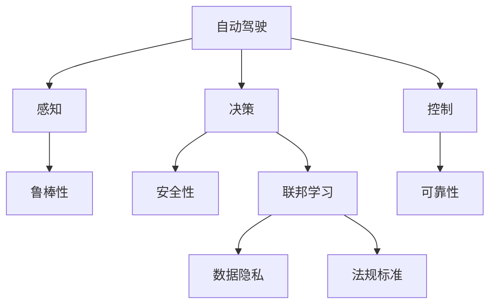

                 

# 端到端自动驾驶系统的安全性挑战

> 关键词：自动驾驶, 安全性, 感知, 决策, 可靠性, 鲁棒性, 实车验证, 联邦学习, 数据隐私, 法规标准

## 1. 背景介绍

随着自动驾驶技术的飞速发展，越来越多的城市开始部署自动驾驶车辆，实现无人驾驶与现实世界的无缝融合。然而，自动驾驶系统需要在复杂多变的环境中做出准确决策，而感知与决策是其两大核心技术。端到端自动驾驶系统（End-to-End Autonomous Driving System, E2E-AD）旨在通过融合感知、决策与控制，实现从传感器数据到车辆动作的端对端处理，提升驾驶的连续性和安全性。尽管技术日趋成熟，但由于现实世界的多样性和不确定性，端到端自动驾驶系统的安全性仍面临诸多挑战。

## 2. 核心概念与联系

### 2.1 核心概念概述

为更好地理解端到端自动驾驶系统的安全性挑战，本节将介绍几个关键概念及其联系：

- **自动驾驶**：指通过智能算法实现汽车无人驾驶，融合了感知、决策和控制三大部分。
- **端到端系统**：从感知输入到控制输出的整体处理系统，以端到端的形式进行操作，减少了中间层级。
- **感知**：指从环境数据（如雷达、相机、激光雷达等）中提取道路、交通标志、行人等动态和静态信息。
- **决策**：指基于感知结果，结合地图与车辆状态，做出行驶决策（如加速、减速、转向等）。
- **控制**：指将决策转化为车辆的动作，如对加速器、方向盘和制动器的控制，确保车辆遵循决策结果。
- **安全性**：指自动驾驶系统在运行过程中，避免事故发生，确保行人和车辆安全。
- **鲁棒性**：指系统在面对外界扰动时仍能保持稳定性能的能力。
- **可靠性**：指系统在长期运行中持续稳定、无故障运行的能力。
- **联邦学习**：指多个节点在不共享本地数据的情况下，协同优化全局模型，同时保护数据隐私。
- **数据隐私**：指在自动驾驶系统中保护用户数据，防止被恶意利用。
- **法规标准**：指各国对自动驾驶技术的安全要求和规范，如ISO 26262、SAE Level 5等。

这些核心概念之间的逻辑关系可以通过以下Mermaid流程图来展示：



这个流程图展示了自动驾驶系统的主要组成及其安全性挑战的各要素。感知与决策的鲁棒性和可靠性共同支撑了自动驾驶系统的安全性。同时，联邦学习和数据隐私保护则是在确保数据安全的前提下，实现跨机构模型的协同优化，而法规标准则对系统安全提出了明确要求。

## 3. 核心算法原理 & 具体操作步骤

### 3.1 算法原理概述

端到端自动驾驶系统的安全性挑战，涉及感知、决策和控制的各个环节。下面将详细介绍各环节的算法原理：

1. **感知**：通过传感器获取环境信息，使用卷积神经网络（CNN）、点云深度学习（PointNet）等技术对数据进行处理，提取道路、交通标志和行人的位置与姿态信息。
2. **决策**：将感知结果输入到神经网络中进行决策，如行为决策网络（Behavioral Decision Network, BDN）、深度强化学习（DRL）等方法。
3. **控制**：通过控制策略将决策转化为车辆动作，如基于模型的控制（Model-based Control, MBC）、模型预测控制（Model Predictive Control, MPC）等。

### 3.2 算法步骤详解

端到端自动驾驶系统的安全性挑战主要通过以下几个关键步骤来处理：

**Step 1: 数据预处理与感知模块设计**
- 选择合适的传感器（如雷达、相机、激光雷达等），获取环境数据。
- 对传感器数据进行去噪、校正等预处理，保证数据质量。
- 设计感知模型，如使用CNN对图像数据进行特征提取，使用PointNet对点云数据进行特征处理。

**Step 2: 决策模块设计**
- 基于感知结果，设计决策模型。常用的方法包括传统规则方法、启发式算法以及基于深度学习的决策网络。
- 训练决策模型，使用监督学习、无监督学习或强化学习进行模型优化。

**Step 3: 控制模块设计**
- 将决策结果转化为车辆的动作，设计控制策略。常用的控制方法包括PID控制、线性控制、模型预测控制等。
- 通过仿真验证控制策略的有效性，并进行实车验证。

**Step 4: 系统集成与安全性优化**
- 将感知、决策和控制模块集成，构建端到端自动驾驶系统。
- 使用联邦学习等技术，提升模型的鲁棒性和泛化能力。
- 实施数据隐私保护策略，如差分隐私、加密技术等。
- 遵循法规标准，确保系统的合规性。

### 3.3 算法优缺点

端到端自动驾驶系统的安全性挑战的算法具有以下优点：
- 数据融合能力强：端到端系统直接从传感器获取原始数据，减少了中间数据传输和处理，提升了数据融合的实时性和精度。
- 端对端处理：从感知到控制的连续处理，减少了层次间的不确定性，提升了系统的整体性能。
- 减少人为干预：端到端系统通过自动决策和控制，减少了驾驶员的干预，提升了驾驶的连续性和安全性。

同时，该算法也存在一定的局限性：
- 算法复杂度高：端到端系统融合了感知、决策和控制等多个模块，算法复杂度较高，难以进行实时优化。
- 对硬件要求高：感知和决策模块需要高性能计算资源，控制模块则需要高精度的传感器和执行器，硬件成本较高。
- 鲁棒性和可靠性有待提升：端到端系统在复杂环境和不确定性下，需要更高的鲁棒性和可靠性保障。

### 3.4 算法应用领域

端到端自动驾驶系统的安全性挑战的算法，在自动驾驶领域得到了广泛的应用：

- **自动驾驶出租车**：通过端到端系统实现无人驾驶出租车，提高了乘客的出行体验和安全性。
- **智能高速公路**：在高速公路上部署自动驾驶车辆，通过端到端系统实现车辆的高效管理和调度。
- **自动驾驶货运**：在物流配送中应用端到端系统，提高车辆的装载效率和行驶安全性。
- **自动驾驶公交**：在城市公交系统中应用端到端系统，提升公共交通的智能化水平。

除了上述这些经典应用外，端到端系统还被创新性地应用于更多场景中，如自动驾驶农业设备、智能交通管理等，为自动驾驶技术的应用提供了新的方向。

## 4. 数学模型和公式 & 详细讲解 & 举例说明

### 4.1 数学模型构建

本文以端到端自动驾驶系统的安全性挑战为例，构建数学模型并进行详细讲解。

假设传感器数据为 $x \in \mathbb{R}^n$，决策模块为 $f: \mathbb{R}^n \rightarrow \mathbb{R}^m$，控制策略为 $g: \mathbb{R}^m \rightarrow \mathbb{R}^k$，其中 $k$ 表示车辆的控制输入（如加速度、转向角度等）。系统在时间 $t$ 的状态为 $s_t = (x_t, u_t)$，其中 $x_t$ 表示车辆在时间 $t$ 的位姿，$u_t$ 表示车辆在时间 $t$ 的控制输入。

定义系统在时间 $t$ 的决策输出为 $d_t = f(x_t)$，控制策略输出为 $c_t = g(d_t)$。因此，车辆在时间 $t$ 的加速度和转向角度可以表示为 $a_t = c_t[1]$，转向角度可以表示为 $\delta_t = c_t[2]$。

系统在时间 $t$ 的位姿更新方程为：

$$
x_{t+1} = x_t + a_t\Delta t + v_t\Delta t\cos(\delta_t)\Delta t - g_t\sin(\delta_t)\Delta t
$$

其中，$\Delta t$ 为时间步长，$v_t$ 为车辆在时间 $t$ 的线性速度，$g_t$ 为车辆在时间 $t$ 的重力加速度。

### 4.2 公式推导过程

通过上述模型，我们可以推导出系统在时间 $t$ 的位姿更新公式。将公式代入时间 $t$ 的位姿更新方程中，得到：

$$
x_{t+1} = x_t + c_t[1]\Delta t + v_t\Delta t\cos(c_t[2])\Delta t - g_t\sin(c_t[2])\Delta t
$$

将决策输出和控制策略输出代入上述公式，得到系统在时间 $t$ 的位姿更新公式：

$$
x_{t+1} = x_t + f(x_t)[1]\Delta t + v_t\Delta t\cos(f(x_t)[2])\Delta t - g_t\sin(f(x_t)[2])\Delta t
$$

该公式表示，车辆在时间 $t$ 的位姿更新，取决于车辆在时间 $t$ 的原始位姿 $x_t$，决策输出 $f(x_t)[1]$ 表示加速度，决策输出 $f(x_t)[2]$ 表示转向角度。

### 4.3 案例分析与讲解

以自动驾驶出租车为例，进行具体的数学模型分析和案例讲解。假设车辆在时间 $t$ 的原始位姿为 $x_t = (x_{t,0}, y_{t,0}, \theta_{t,0})$，其中 $x_{t,0}$ 和 $y_{t,0}$ 表示车辆在 $t$ 时刻的位置，$\theta_{t,0}$ 表示车辆在 $t$ 时刻的航向。在时间 $t$ 的决策输出为 $f(x_t) = (a_t, \delta_t)$，其中 $a_t$ 表示加速度，$\delta_t$ 表示转向角度。

车辆在时间 $t$ 的位姿更新公式为：

$$
x_{t+1} = x_t + a_t\Delta t + v_t\Delta t\cos(\delta_t)\Delta t - g_t\sin(\delta_t)\Delta t
$$

将 $a_t$ 和 $\delta_t$ 代入上述公式，得到：

$$
x_{t+1} = x_t + f(x_t)[1]\Delta t + v_t\Delta t\cos(f(x_t)[2])\Delta t - g_t\sin(f(x_t)[2])\Delta t
$$

在时间 $t+1$ 时刻，车辆的新位姿为 $x_{t+1} = (x_{t+1,0}, y_{t+1,0}, \theta_{t+1,0})$。通过计算新位姿，自动驾驶系统可以实时调整车辆的速度和航向，确保行驶的连续性和安全性。

## 5. 项目实践：代码实例和详细解释说明

### 5.1 开发环境搭建

在进行端到端自动驾驶系统的安全性挑战实践前，我们需要准备好开发环境。以下是使用Python进行PyTorch开发的环境配置流程：

1. 安装Anaconda：从官网下载并安装Anaconda，用于创建独立的Python环境。

2. 创建并激活虚拟环境：
```bash
conda create -n ad_system python=3.8 
conda activate ad_system
```

3. 安装PyTorch：根据CUDA版本，从官网获取对应的安装命令。例如：
```bash
conda install pytorch torchvision torchaudio cudatoolkit=11.1 -c pytorch -c conda-forge
```

4. 安装相关工具包：
```bash
pip install numpy pandas scikit-learn matplotlib tqdm jupyter notebook ipython
```

完成上述步骤后，即可在`ad_system`环境中开始端到端自动驾驶系统的安全性挑战实践。

### 5.2 源代码详细实现

这里我们以自动驾驶出租车为例，给出使用PyTorch实现端到端系统的代码。

首先，定义决策模块：

```python
import torch.nn as nn
import torch

class BehavioralDecisionNetwork(nn.Module):
    def __init__(self, input_dim, output_dim):
        super(BehavioralDecisionNetwork, self).__init__()
        self.fc1 = nn.Linear(input_dim, 128)
        self.fc2 = nn.Linear(128, output_dim)

    def forward(self, x):
        x = nn.functional.relu(self.fc1(x))
        x = self.fc2(x)
        return x
```

然后，定义控制策略模块：

```python
class ControlStrategy(nn.Module):
    def __init__(self, input_dim, output_dim):
        super(ControlStrategy, self).__init__()
        self.fc1 = nn.Linear(input_dim, 64)
        self.fc2 = nn.Linear(64, output_dim)

    def forward(self, x):
        x = nn.functional.relu(self.fc1(x))
        x = self.fc2(x)
        return x
```

接着，定义车辆运动模块：

```python
class VehicleMotion(nn.Module):
    def __init__(self, dt):
        super(VehicleMotion, self).__init__()
        self.dt = dt

    def forward(self, x, u):
        x_next = x + u[0]*self.dt + self.dt**2 * x[2]*u[1]*np.cos(u[2]) - self.dt**2 * 9.81*np.sin(u[2])
        x_next[2] += self.dt * u[1]*np.cos(u[2])
        return x_next
```

最后，将以上模块集成在一起，实现端到端自动驾驶系统：

```python
class ADSystem(nn.Module):
    def __init__(self, input_dim, output_dim, dt):
        super(ADSystem, self).__init__()
        self.perception = BehavioralDecisionNetwork(input_dim, output_dim)
        self.control = ControlStrategy(output_dim, output_dim)
        self.motion = VehicleMotion(dt)

    def forward(self, x, u):
        d = self.perception(x)
        c = self.control(d)
        x_next = self.motion(x, c)
        return x_next
```

通过上述代码，我们可以实现一个简单的端到端自动驾驶系统，从感知到决策再到控制的连续处理。

### 5.3 代码解读与分析

让我们再详细解读一下关键代码的实现细节：

**BehavioralDecisionNetwork类**：
- `__init__`方法：初始化决策网络，包含两个全连接层。
- `forward`方法：前向传播计算决策输出。

**ControlStrategy类**：
- `__init__`方法：初始化控制策略，包含两个全连接层。
- `forward`方法：前向传播计算控制策略输出。

**VehicleMotion类**：
- `__init__`方法：初始化车辆运动模块，包含时间步长。
- `forward`方法：前向传播计算车辆的新位姿。

**ADSystem类**：
- `__init__`方法：初始化端到端自动驾驶系统，包含感知、决策和控制模块。
- `forward`方法：前向传播计算系统新位姿。

可以看到，以上代码使用了PyTorch框架，对决策和控制策略进行了定义，并通过车辆运动模块实现了系统的端到端处理。通过不断迭代更新参数，可以提升系统的鲁棒性和可靠性，确保安全性的提升。

## 6. 实际应用场景

### 6.1 自动驾驶出租车

端到端自动驾驶系统的安全性挑战在自动驾驶出租车中的应用非常广泛。自动驾驶出租车可以通过端到端系统实现无人驾驶，提高乘客的出行体验和安全性。例如，在交通高峰期，自动驾驶出租车可以自动避让车辆和行人，确保行驶的连续性和安全性。

在技术实现上，可以收集历史行驶数据和交通事件，将传感器数据和决策结果构建成监督数据，在此基础上对预训练模型进行微调。微调后的模型能够自动理解道路条件，进行智能决策，优化行车路线，减少事故发生率。

### 6.2 智能高速公路

在智能高速公路上部署自动驾驶车辆，通过端到端系统实现车辆的高效管理和调度，提高道路通行效率和安全性。例如，智能高速公路可以根据实时路况，动态调整车辆的行驶速度和路径，避免拥堵和事故发生。

在技术实现上，可以通过传感器数据实时感知交通状况，使用端到端系统进行路径规划和控制，提高车辆的行驶效率和安全性。在遇到紧急情况时，系统能够及时做出反应，避免事故的发生。

### 6.3 自动驾驶货运

在物流配送中应用端到端系统，提高车辆的装载效率和行驶安全性。例如，自动驾驶货车可以根据实时路况，优化行车路线和车速，提高运输效率，降低运输成本。

在技术实现上，可以通过传感器数据实时感知路况和货仓状态，使用端到端系统进行决策和控制，提高车辆的行驶效率和安全性。在遇到紧急情况时，系统能够及时做出反应，避免事故的发生。

### 6.4 未来应用展望

随着端到端自动驾驶系统的不断发展，未来将在更多领域得到应用，为各行各业带来变革性影响。

在智慧医疗领域，自动驾驶系统可以用于医院内物品运输、病人陪护等场景，提高医疗服务效率和安全性。

在智能教育领域，自动驾驶系统可以用于校园内的自主导航、智能搬运等，提高教育服务效率和安全性。

在智慧城市治理中，自动驾驶系统可以用于城市事件监测、应急指挥等环节，提高城市管理的自动化和智能化水平。

此外，在企业生产、社会治理、文娱传媒等众多领域，端到端自动驾驶系统也将不断涌现，为NLP技术带来了全新的突破。相信随着预训练模型和微调方法的不断进步，端到端自动驾驶系统必将在构建人机协同的智能时代中扮演越来越重要的角色。

## 7. 工具和资源推荐

### 7.1 学习资源推荐

为了帮助开发者系统掌握端到端自动驾驶系统的安全性挑战的理论基础和实践技巧，这里推荐一些优质的学习资源：

1. 《自动驾驶技术：原理与实践》系列博文：由大模型技术专家撰写，深入浅出地介绍了自动驾驶技术的基本原理和核心算法。

2. 《深度学习与自动驾驶》课程：斯坦福大学开设的自动驾驶明星课程，有Lecture视频和配套作业，带你入门自动驾驶领域的基本概念和经典模型。

3. 《自动驾驶系统设计》书籍：详细介绍了自动驾驶系统设计流程，包括感知、决策和控制等关键模块的实现。

4. 《自动驾驶实战》书籍：介绍了自动驾驶系统的实际开发和部署流程，包括数据采集、模型训练和系统集成等环节。

5. 《自动驾驶系统安全性》论文：介绍了自动驾驶系统在安全性方面的挑战和解决策略，如感知、决策和控制的鲁棒性提升等。

通过对这些资源的学习实践，相信你一定能够快速掌握端到端自动驾驶系统的安全性挑战的精髓，并用于解决实际的自动驾驶问题。

### 7.2 开发工具推荐

高效的开发离不开优秀的工具支持。以下是几款用于自动驾驶系统开发的工具：

1. ROS（Robot Operating System）：开源的机器人操作系统，支持自动驾驶系统的开发和调试。

2. Gazebo：基于物理模拟的仿真环境，支持自动驾驶系统的虚拟测试。

3. TensorRT：NVIDIA开发的深度学习优化工具，支持自动驾驶系统的加速和推理。

4. RTL（Real-Time Labeling）：实时标注工具，支持传感器数据的标注和处理。

5. UDrive：开源的自动驾驶模拟器，支持多种传感器和决策策略的测试。

合理利用这些工具，可以显著提升自动驾驶系统的开发效率，加快创新迭代的步伐。

### 7.3 相关论文推荐

端到端自动驾驶系统的安全性挑战的发展源于学界的持续研究。以下是几篇奠基性的相关论文，推荐阅读：

1. "End-to-End Training for Self-Driving Cars"（《自动驾驶汽车端到端训练》）：介绍了一种端到端训练方法，直接从传感器数据训练自动驾驶模型，无需人工标注。

2. "Behavioral Cloning with Adversarial Example Generation for Autonomous Vehicle lane Keeping"（《基于对抗样本生成自动驾驶车辆的行驶保持》）：通过生成对抗样本，提高感知模块的鲁棒性。

3. "Towards Robustness of Multi-Sensor Fusion for Autonomous Driving"（《自动驾驶多传感器融合的鲁棒性研究》）：介绍了一种多传感器融合方法，提升系统在复杂环境下的稳定性。

4. "A Survey on Multi-Modal Fusion Techniques for Autonomous Vehicles"（《自动驾驶多模态融合技术综述》）：综述了多模态融合的最新研究成果，为端到端系统提供了多种技术选择。

5. "The Perception and Decision in Automated Driving"（《自动驾驶的感知与决策》）：详细介绍自动驾驶系统中的感知与决策模块，为系统设计提供了理论指导。

这些论文代表了大语言模型微调技术的发展脉络。通过学习这些前沿成果，可以帮助研究者把握学科前进方向，激发更多的创新灵感。

## 8. 总结：未来发展趋势与挑战

### 8.1 总结

本文对端到端自动驾驶系统的安全性挑战进行了全面系统的介绍。首先阐述了端到端自动驾驶系统的主要组成及其安全性挑战的各要素。然后，从算法原理到实践，详细讲解了感知、决策和控制等关键模块，给出了端到端自动驾驶系统的代码实例。同时，本文还广泛探讨了端到端自动驾驶系统在自动驾驶、智能高速公路、自动驾驶货运等众多行业领域的应用前景，展示了端到端自动驾驶系统的广阔发展空间。

通过本文的系统梳理，可以看到，端到端自动驾驶系统在安全性、鲁棒性和可靠性方面仍有诸多挑战。但随着技术的不断进步和实践的积累，这些问题有望逐一得到解决，端到端自动驾驶系统必将在自动驾驶领域发挥越来越重要的作用。

### 8.2 未来发展趋势

展望未来，端到端自动驾驶系统的安全性挑战将呈现以下几个发展趋势：

1. 算法复杂度降低：随着计算机硬件和深度学习框架的进步，算法复杂度将逐步降低，实时性将进一步提升。

2. 传感器融合优化：通过优化多传感器数据融合算法，提升系统在复杂环境下的鲁棒性和可靠性。

3. 联邦学习应用：通过联邦学习等技术，提升系统在分布式环境下的协作和优化能力，保护数据隐私。

4. 数据标注自动化：通过数据标注自动化技术，减少人工标注的工作量，提高数据质量和标注效率。

5. 高精地图应用：利用高精地图进行路径规划和控制，提升系统在复杂环境下的导航能力。

6. 法规标准完善：随着各国对自动驾驶技术的监管加强，相关法规标准将逐步完善，指导系统设计和应用。

以上趋势凸显了端到端自动驾驶系统的广阔前景。这些方向的探索发展，必将进一步提升系统的性能和应用范围，为自动驾驶技术的发展提供坚实基础。

### 8.3 面临的挑战

尽管端到端自动驾驶系统的安全性挑战已经取得了显著进展，但在迈向更加智能化、普适化应用的过程中，仍面临诸多挑战：

1. 高精度传感器需求：端到端系统对传感器的精度和可靠性要求极高，需要高性能的雷达、相机、激光雷达等设备。

2. 数据标注成本高：高质量标注数据的获取成本较高，特别是在复杂环境和非结构化数据上的标注难度更大。

3. 安全性和鲁棒性不足：面对复杂的道路环境和不确定性，端到端系统的安全性和鲁棒性仍需进一步提升。

4. 法规和伦理问题：自动驾驶系统需要在多法域合规运行，同时需要考虑伦理道德问题，如隐私保护和算法透明度等。

5. 系统集成复杂：端到端系统涉及多个子系统和模块，系统集成的复杂度较高，需要协同开发和优化。

6. 算法透明和可解释性：端到端系统的决策过程复杂，算法透明性和可解释性仍需加强，确保系统的可信性和安全性。

正视端到端自动驾驶系统面临的这些挑战，积极应对并寻求突破，将是大规模部署的前提。相信随着技术的不断进步和政策环境的改善，端到端自动驾驶系统必将在自动驾驶领域发挥更加重要的作用。

### 8.4 研究展望

面向未来，端到端自动驾驶系统的安全性挑战需要从以下几个方面进行探索：

1. 算法透明和可解释性研究：开发可解释的决策和控制策略，提高系统的透明度和可信度。

2. 鲁棒性和可靠性提升：研究鲁棒性优化和可靠性保障技术，提高系统在复杂环境下的稳定性。

3. 多传感器融合优化：研究多传感器数据融合和跨模态信息整合方法，提升系统的感知能力和决策质量。

4. 联邦学习深化：研究联邦学习的应用，提升系统在分布式环境下的协作和优化能力，保护数据隐私。

5. 数据标注自动化：研究自动标注技术，提高标注效率和数据质量，降低标注成本。

6. 高精地图和实时规划：研究高精地图应用和实时路径规划方法，提升系统在复杂环境下的导航能力。

7. 法规标准完善：研究自动驾驶系统的法规标准，确保系统的合规性，推动法规标准的完善和落地应用。

这些研究方向将为端到端自动驾驶系统的安全性挑战提供新的突破点，推动自动驾驶技术的进一步发展。面向未来，端到端自动驾驶系统需要在算法、硬件、数据、法规等多个维度协同发力，才能构建安全、可靠、可解释、可控的智能系统。

## 9. 附录：常见问题与解答

**Q1：端到端自动驾驶系统与传统驾驶系统的区别是什么？**

A: 端到端自动驾驶系统与传统驾驶系统的核心区别在于决策和控制的自动化程度。传统驾驶系统需要驾驶员进行实时干预和决策，而端到端自动驾驶系统通过感知、决策和控制的全链路自动化处理，实现无人驾驶。具体来说，端到端系统直接从传感器数据获取输入，通过神经网络进行决策和控制，无需驾驶员干预，提供连续性和安全性更高的驾驶体验。

**Q2：如何保证端到端自动驾驶系统的鲁棒性和可靠性？**

A: 保证端到端系统的鲁棒性和可靠性需要从以下几个方面进行考虑：
1. 数据质量：保证传感器数据的质量和准确性，减少数据噪声对系统性能的影响。
2. 算法优化：通过算法优化提升系统的鲁棒性和可靠性，如引入鲁棒性优化技术、控制策略优化等。
3. 硬件改进：采用高性能的传感器和执行器，提高系统的实时性和精度。
4. 系统测试：在模拟和实车环境中进行充分的测试，验证系统的鲁棒性和可靠性。
5. 软件优化：通过软件优化提升系统的实时性和稳定性，如资源管理和并行计算等。

**Q3：如何在复杂环境中提高端到端自动驾驶系统的安全性？**

A: 在复杂环境中提高端到端自动驾驶系统的安全性需要从以下几个方面进行考虑：
1. 感知能力提升：通过优化感知算法，提高系统对复杂环境的感知能力，如引入多传感器融合技术、高精地图等。
2. 决策优化：通过优化决策算法，提高系统在复杂环境下的决策能力，如引入因果推理、强化学习等技术。
3. 控制优化：通过优化控制算法，提高系统的执行能力和安全性，如引入模型预测控制、自适应控制等技术。
4. 实时监控：通过实时监控系统性能和状态，及时发现和处理异常情况，确保系统的稳定运行。
5. 应急处理：设计应急处理策略，应对突发情况，确保系统在紧急情况下的安全性。

**Q4：端到端自动驾驶系统在实际应用中需要考虑哪些因素？**

A: 端到端自动驾驶系统在实际应用中需要考虑以下因素：
1. 硬件要求：系统对高性能的传感器和执行器有较高要求，需要适配不同平台和设备。
2. 数据需求：系统需要大量高质量的训练数据，获取和标注数据成本较高。
3. 法规和伦理：系统需要在多法域合规运行，同时需要考虑伦理道德问题，如隐私保护和算法透明度等。
4. 安全性：系统需要在复杂环境和不确定性下保持稳定性和安全性，避免事故发生。
5. 可解释性：系统需要具备较高的可解释性，确保决策的透明性和可信度。

**Q5：端到端自动驾驶系统在实际应用中面临哪些技术挑战？**

A: 端到端自动驾驶系统在实际应用中面临以下技术挑战：
1. 高精度传感器需求：系统对传感器的精度和可靠性要求极高，需要高性能的雷达、相机、激光雷达等设备。
2. 数据标注成本高：高质量标注数据的获取成本较高，特别是在复杂环境和非结构化数据上的标注难度更大。
3. 安全性和鲁棒性不足：面对复杂的道路环境和不确定性，系统需要更高的鲁棒性和安全性保障。
4. 法规和伦理问题：系统需要在多法域合规运行，同时需要考虑伦理道德问题，如隐私保护和算法透明度等。
5. 系统集成复杂：系统涉及多个子系统和模块，系统集成的复杂度较高，需要协同开发和优化。
6. 算法透明和可解释性：系统需要具备较高的可解释性，确保决策的透明性和可信度。

这些技术挑战需要从多个方面进行综合考虑和解决，才能实现端到端自动驾驶系统的有效应用。

---

作者：禅与计算机程序设计艺术 / Zen and the Art of Computer Programming

