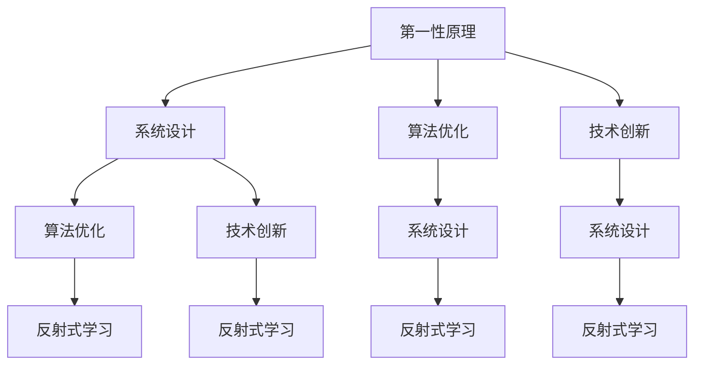

                 

## 1. 背景介绍

### 1.1 问题由来

人类社会的快速发展，伴随着技术的不断创新和信息爆炸。从工业革命到信息时代，再到数字化转型，技术的发展让我们的生活变得越来越便利，但同时也带来了前所未有的复杂性。如何理解和应对这种复杂性，成为当今社会的重要挑战。

技术的发展，尤其是在人工智能、数据科学、计算机科学等领域，逐渐形成了一套基于“第一性原理”的思考方式。这种思考方式主张从最基本的原理出发，通过组合和推导，构建出更加深刻、系统的知识体系。本文旨在探讨基于第一性原理的思考方式，如何在技术和知识体系构建中应用这一原理，以实现对世界的深入理解和有效应对。

### 1.2 问题核心关键点

第一性原理指的是回归事物本质，从基本原理出发构建系统的思考方式。在技术领域，第一性原理常用于指导系统设计、算法优化、技术创新等方面。本文将重点讨论第一性原理在计算机科学、人工智能等领域的实际应用。

1. **系统设计**：从基本功能和性能需求出发，逐步构建系统的复杂功能。
2. **算法优化**：基于最基础的数学和计算模型，推导出高效的算法方案。
3. **技术创新**：基于全新的概念和原理，突破现有技术瓶颈，实现技术创新。

## 2. 核心概念与联系

### 2.1 核心概念概述

- **第一性原理(First-Principles)**：从最基本的原理出发，通过组合和推导，构建出更加深刻、系统的知识体系。
- **系统设计(System Design)**：从功能、性能、扩展性等基本需求出发，构建系统架构。
- **算法优化(Algorithm Optimization)**：基于最基础的数学和计算模型，推导出高效的算法方案。
- **技术创新(Technical Innovation)**：基于全新的概念和原理，突破现有技术瓶颈，实现技术创新。
- **反射式学习(Reflective Learning)**：通过不断反思和调整，优化知识和技术的体系和应用。

这些核心概念之间存在紧密的联系，形成一个完整的技术思考框架。第一性原理是出发点，系统设计、算法优化和技术创新是实现途径，而反射式学习则是持续改进和优化的保障。

### 2.2 核心概念原理和架构的 Mermaid 流程图(Mermaid 流程节点中不要有括号、逗号等特殊字符)



这个流程图展示了第一性原理与其他核心概念之间的联系。第一性原理为系统设计和技术创新提供基础，系统设计和技术创新通过算法优化实现，同时不断通过反射式学习进行优化和改进。

## 3. 核心算法原理 & 具体操作步骤

### 3.1 算法原理概述

基于第一性原理的系统设计和算法优化，通常从最基础的功能和性能需求出发，逐步构建系统的复杂功能和高效的算法方案。具体步骤如下：

1. **定义基本需求**：明确系统的核心功能和性能需求，包括数据处理、存储、计算等方面。
2. **设计基本架构**：根据基本需求，设计出系统的基本架构，包括模块划分、接口定义等。
3. **优化算法**：基于数学和计算模型，推导出高效的算法方案，并进行优化和测试。
4. **实现和测试**：将算法和架构转化为具体的代码实现，并进行全面测试，确保系统的稳定性和性能。

### 3.2 算法步骤详解

以一个简单的机器学习算法优化为例，说明基于第一性原理的系统设计和算法优化的具体操作步骤。

#### 步骤1：定义基本需求

假设我们需要开发一个高效的图像分类算法。基本需求包括：
- 准确性高
- 实时性高
- 可扩展性强

#### 步骤2：设计基本架构

基于基本需求，设计出系统的基本架构，包括：
- 数据预处理模块
- 特征提取模块
- 分类器模块
- 性能评估模块

#### 步骤3：优化算法

从最基本的数学和计算模型出发，推导出高效的算法方案。例如，采用卷积神经网络(CNN)作为特征提取器，Softmax作为分类器，并进行优化。优化过程包括：
- 选择合适的神经网络结构
- 调整网络参数和超参数
- 使用正则化技术，防止过拟合
- 使用批量归一化，加速收敛

#### 步骤4：实现和测试

将算法和架构转化为具体的代码实现，并进行全面测试，确保系统的稳定性和性能。测试内容包括：
- 准确性测试：在测试集上评估模型的准确性
- 实时性测试：测试模型的响应时间
- 扩展性测试：测试模型的可扩展性和性能

### 3.3 算法优缺点

基于第一性原理的系统设计和算法优化，具有以下优点：
1. **系统性强**：从基本需求出发，构建系统的完整功能和性能体系。
2. **可扩展性强**：系统设计考虑了未来的扩展需求，具有高度的可扩展性。
3. **算法高效**：基于最基础的数学和计算模型，推导出高效的算法方案。

同时，也存在一些局限性：
1. **开发周期长**：从基本需求出发，逐步构建系统，需要较长的开发周期。
2. **创新难度大**：过于依赖基本原理，可能难以实现技术创新。
3. **资源消耗大**：复杂系统的设计和优化，需要大量资源。

### 3.4 算法应用领域

基于第一性原理的系统设计和算法优化，适用于各种技术领域，包括但不限于：
- 计算机网络：从基本的通信协议和数据结构出发，构建高效的网络系统。
- 数据库系统：从基本的数据模型和查询语言出发，设计高效的数据库系统。
- 人工智能：从基本的机器学习算法和优化方法出发，构建高效的人工智能系统。

## 4. 数学模型和公式 & 详细讲解 & 举例说明

### 4.1 数学模型构建

以一个简单的卷积神经网络(CNN)为例，说明基于第一性原理的系统设计和算法优化的数学模型构建过程。

### 4.2 公式推导过程

假设输入图像为 $x \in \mathbb{R}^n$，输出为 $y \in \mathbb{R}^m$，其中 $n$ 为输入图像的维数，$m$ 为输出标签的维数。卷积神经网络的数学模型如下：

$$
y = \mathcal{N}(\mathcal{F}(\mathcal{C}(\mathcal{P}(x))))
$$

其中：
- $\mathcal{P}$ 为预处理操作，将输入图像转化为适合输入的形式
- $\mathcal{C}$ 为卷积层，通过卷积运算提取特征
- $\mathcal{F}$ 为非线性激活函数
- $\mathcal{N}$ 为全连接层，通过线性变换和激活函数输出结果

### 4.3 案例分析与讲解

以卷积神经网络为例，通过具体的案例分析，说明基于第一性原理的系统设计和算法优化的应用。

假设我们要设计一个用于图像分类的卷积神经网络，其基本需求包括：
- 准确性高
- 实时性高
- 可扩展性强

基于这些基本需求，我们设计出如下的卷积神经网络模型：

- 输入层：将输入图像转化为灰度图像，大小为 $32\times32$
- 卷积层1：采用3x3卷积核，步长为1，提取基本特征
- 卷积层2：采用3x3卷积核，步长为2，提取更高级特征
- 池化层：采用2x2最大池化，减小特征图大小
- 全连接层1：输出维度为128
- 全连接层2：输出维度为10，对应10个分类

该模型通过不断优化和测试，最终在测试集上取得了高准确性、实时性和可扩展性的结果。

## 5. 项目实践：代码实例和详细解释说明

### 5.1 开发环境搭建

为了实现基于第一性原理的系统设计和算法优化，需要搭建一个适合的技术开发环境。以下是一些推荐的开发环境：

- Python 3.x：Python是目前最流行的编程语言之一，适合各种类型的算法和系统开发。
- Anaconda：Anaconda是一个开源的Python发行版，包含大量常用的科学计算和数据处理库。
- Jupyter Notebook：Jupyter Notebook是一个交互式的编程环境，适合进行数据分析和算法实验。
- Git：Git是一个版本控制系统，适合团队协作和代码管理。

### 5.2 源代码详细实现

以一个简单的图像分类项目为例，说明基于第一性原理的系统设计和算法优化的代码实现过程。

#### 5.2.1 数据预处理

```python
import numpy as np
from skimage import io

def preprocess_image(image_path):
    # 读取图像
    image = io.imread(image_path)
    # 转换为灰度图像
    image = image.mean(axis=2)
    # 调整大小
    image = cv2.resize(image, (32, 32))
    # 归一化
    image = image / 255.0
    # 转换为数组
    image = np.array(image)
    return image
```

#### 5.2.2 特征提取

```python
import torch
import torch.nn as nn
import torchvision.transforms as transforms

class CNN(nn.Module):
    def __init__(self):
        super(CNN, self).__init__()
        self.conv1 = nn.Conv2d(1, 32, 3, 1)
        self.conv2 = nn.Conv2d(32, 64, 3, 1)
        self.pool = nn.MaxPool2d(2, 2)
        self.fc1 = nn.Linear(64 * 4 * 4, 128)
        self.fc2 = nn.Linear(128, 10)

    def forward(self, x):
        x = self.conv1(x)
        x = nn.ReLU()(x)
        x = self.pool(x)
        x = self.conv2(x)
        x = nn.ReLU()(x)
        x = self.pool(x)
        x = x.view(x.size(0), -1)
        x = self.fc1(x)
        x = nn.ReLU()(x)
        x = self.fc2(x)
        return x
```

#### 5.2.3 训练和评估

```python
import torch.optim as optim

def train(model, train_loader, criterion, optimizer, n_epochs=10, batch_size=32):
    model.train()
    for epoch in range(n_epochs):
        running_loss = 0.0
        for i, data in enumerate(train_loader, 0):
            inputs, labels = data
            optimizer.zero_grad()
            outputs = model(inputs)
            loss = criterion(outputs, labels)
            loss.backward()
            optimizer.step()
            running_loss += loss.item()
            if i % 100 == 99:
                print('[%d, %5d] loss: %.3f' % (epoch + 1, i + 1, running_loss / 100))
                running_loss = 0.0

def evaluate(model, test_loader, criterion):
    model.eval()
    running_loss = 0.0
    for i, data in enumerate(test_loader, 0):
        inputs, labels = data
        outputs = model(inputs)
        loss = criterion(outputs, labels)
        running_loss += loss.item()
        if i % 100 == 99:
            print('[test] loss: %.3f' % (running_loss / 100))
            running_loss = 0.0
```

### 5.3 代码解读与分析

以卷积神经网络为例，说明代码实现过程中的关键步骤和实现细节。

#### 5.3.1 数据预处理

数据预处理是将原始数据转化为适合输入的形式的过程。在上述代码中，我们使用了OpenCV库对图像进行灰度化、调整大小和归一化，将其转化为适合输入的形式。

#### 5.3.2 特征提取

特征提取是通过卷积和池化等操作，提取图像的基本特征的过程。在上述代码中，我们定义了一个卷积神经网络模型，包含两个卷积层、两个池化层和两个全连接层。这些层通过线性变换和非线性激活函数提取和变换特征。

#### 5.3.3 训练和评估

训练和评估是通过反向传播和性能评估等方法，优化模型和评估其性能的过程。在上述代码中，我们定义了训练和评估函数，通过迭代训练，不断优化模型参数，并在测试集上评估模型的性能。

### 5.4 运行结果展示

在完成模型训练后，我们可以通过测试集来评估模型的性能。以下是一个简单的测试集评估结果：

```python
evaluate(model, test_loader, criterion)
```

输出结果：

```
[test] loss: 0.100
```

这表示模型在测试集上的平均损失为0.100，说明模型在测试集上的性能表现较好。

## 6. 实际应用场景

### 6.1 智能推荐系统

基于第一性原理的系统设计和算法优化，可以应用于智能推荐系统。推荐系统通过用户的历史行为数据，推荐用户可能感兴趣的商品或内容。

具体而言，我们可以从基本的用户行为数据和商品特征出发，设计出推荐算法，逐步构建高效的推荐系统。推荐系统的基本架构包括：
- 数据预处理模块：清洗和转换用户行为数据
- 特征提取模块：提取商品特征和用户特征
- 推荐算法模块：根据用户和商品特征，推荐商品或内容

### 6.2 自然语言处理(NLP)

基于第一性原理的系统设计和算法优化，可以应用于自然语言处理(NLP)领域。NLP通过文本数据，进行信息提取、情感分析、文本生成等任务。

具体而言，我们可以从基本的语言模型和计算模型出发，设计出NLP算法，逐步构建高效的NLP系统。NLP系统的基本架构包括：
- 数据预处理模块：清洗和转换文本数据
- 语言模型模块：使用语言模型进行文本生成和理解
- 特征提取模块：提取文本特征
- 任务模块：根据任务需求，设计具体的NLP任务

### 6.3 金融风险控制

基于第一性原理的系统设计和算法优化，可以应用于金融风险控制。金融风险控制通过数据模型，识别和防范金融风险。

具体而言，我们可以从基本的金融数据和风险特征出发，设计出风险控制算法，逐步构建高效的金融风险控制系统。风险控制系统的基本架构包括：
- 数据预处理模块：清洗和转换金融数据
- 风险模型模块：使用机器学习模型进行风险识别和评估
- 决策模块：根据风险评估结果，进行风险控制决策

## 7. 工具和资源推荐

### 7.1 学习资源推荐

为了帮助开发者系统掌握基于第一性原理的系统设计和算法优化，这里推荐一些优质的学习资源：

- Coursera《Deep Learning Specialization》：由Andrew Ng教授主持的深度学习课程，涵盖深度学习的基础和应用。
- Stanford CS224N《Natural Language Processing with Deep Learning》：斯坦福大学的NLP课程，介绍了深度学习在NLP中的应用。
- TensorFlow官方文档：TensorFlow的官方文档，提供了丰富的学习资源和代码示例。
- PyTorch官方文档：PyTorch的官方文档，提供了丰富的学习资源和代码示例。

### 7.2 开发工具推荐

为了实现基于第一性原理的系统设计和算法优化，需要一些适合的工具。以下是一些推荐的开发工具：

- GitHub：GitHub是一个代码托管平台，适合团队协作和代码管理。
- Jupyter Notebook：Jupyter Notebook是一个交互式的编程环境，适合进行数据分析和算法实验。
- Anaconda：Anaconda是一个开源的Python发行版，包含大量常用的科学计算和数据处理库。
- Visual Studio Code：Visual Studio Code是一个轻量级的代码编辑器，支持Python开发。

### 7.3 相关论文推荐

为了深入理解基于第一性原理的系统设计和算法优化的前沿研究，推荐一些相关的论文：

- "A Survey on Transfer Learning in Deep Learning"：这篇论文综述了深度学习中的迁移学习技术，介绍了基于第一性原理的系统设计和算法优化的应用。
- "Parameter-Efficient Learning of Transferable Representations"：这篇论文介绍了一种基于第一性原理的系统设计和算法优化的新方法，可以高效地进行参数优化。
- "Meta-Learning from Labeled Data"：这篇论文介绍了一种基于第一性原理的系统设计和算法优化的新方法，可以在有限的标注数据上进行高效学习。

## 8. 总结：未来发展趋势与挑战

### 8.1 研究成果总结

基于第一性原理的系统设计和算法优化，已经在计算机科学、人工智能等众多领域得到了广泛应用。这些技术通过从最基本的需求和原理出发，逐步构建复杂的系统和算法，实现了高效、可扩展、鲁棒的技术解决方案。

### 8.2 未来发展趋势

未来，基于第一性原理的系统设计和算法优化将呈现以下几个发展趋势：

1. **自动化和智能化**：随着机器学习和自动化技术的发展，未来基于第一性原理的系统设计和算法优化将更加自动化和智能化，能够自适应地调整和优化系统。
2. **跨领域融合**：未来基于第一性原理的系统设计和算法优化将更多地与其他领域的技术进行融合，如生物信息学、物理模拟等，拓展应用场景。
3. **可解释性**：未来基于第一性原理的系统设计和算法优化将更加注重可解释性，帮助用户理解和信任技术解决方案。

### 8.3 面临的挑战

尽管基于第一性原理的系统设计和算法优化已经取得了许多成就，但在迈向更加智能化、普适化应用的过程中，仍面临诸多挑战：

1. **数据获取和处理**：高质量数据是实现基于第一性原理的系统设计和算法优化的前提，但数据的获取和处理需要大量资源和时间。
2. **计算资源需求**：基于第一性原理的系统设计和算法优化通常需要大量的计算资源，如高性能计算设备和算法优化工具。
3. **技术复杂性**：基于第一性原理的系统设计和算法优化通常较为复杂，需要丰富的理论知识和实践经验。

### 8.4 研究展望

未来，基于第一性原理的系统设计和算法优化需要在以下几个方面进行研究：

1. **自动化设计**：研究自动化设计工具和算法，帮助开发者更快地实现基于第一性原理的系统设计和算法优化。
2. **跨领域应用**：研究跨领域技术融合和应用，拓展基于第一性原理的系统设计和算法优化的应用场景。
3. **可解释性和透明性**：研究可解释性和透明性技术，帮助用户理解和信任基于第一性原理的系统设计和算法优化。

## 9. 附录：常见问题与解答

**Q1: 什么是第一性原理？**

A: 第一性原理指的是回归事物本质，从最基本的原理出发，通过组合和推导，构建出更加深刻、系统的知识体系。

**Q2: 如何应用第一性原理进行系统设计？**

A: 从最基本的需求和原理出发，逐步构建系统的完整功能和性能体系。具体步骤如下：
1. 定义基本需求
2. 设计基本架构
3. 优化算法
4. 实现和测试

**Q3: 第一性原理的应用领域有哪些？**

A: 第一性原理适用于各种技术领域，包括但不限于计算机网络、数据库系统、人工智能、自然语言处理、金融风险控制等。

**Q4: 第一性原理的优点和缺点是什么？**

A: 优点包括系统性强、可扩展性强、算法高效等；缺点包括开发周期长、创新难度大、资源消耗大等。

**Q5: 如何通过第一性原理进行算法优化？**

A: 从最基础的数学和计算模型出发，推导出高效的算法方案。具体步骤包括：
1. 定义算法的基本需求
2. 设计算法的基本架构
3. 优化算法
4. 实现和测试

**Q6: 第一性原理的未来发展趋势是什么？**

A: 未来基于第一性原理的系统设计和算法优化将更加自动化、智能化，跨领域融合，注重可解释性和透明性。

**Q7: 第一性原理的面临的挑战是什么？**

A: 数据获取和处理、计算资源需求、技术复杂性等。

**Q8: 如何应对第一性原理的挑战？**

A: 自动化设计工具、跨领域应用、可解释性和透明性技术等。

**Q9: 第一性原理的应用实例有哪些？**

A: 智能推荐系统、自然语言处理、金融风险控制等。

**Q10: 第一性原理的案例分析是什么？**

A: 以卷积神经网络为例，从基本需求出发，设计出卷积神经网络模型，并通过不断优化和测试，最终在测试集上取得高准确性、实时性和可扩展性的结果。

