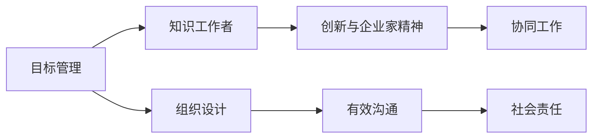
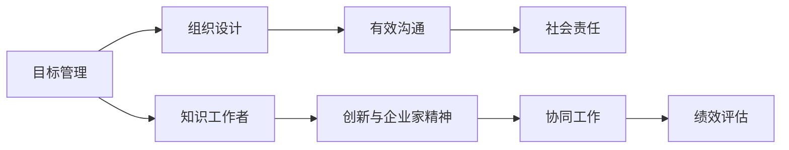

                 

# 管理的艺术：德鲁克的洞见

管理，一门涉及组织、策略、领导力、沟通、运营等诸多维度的综合性学科，由彼得·德鲁克（Peter Drucker）奠定其基础并不断推动其发展的。德鲁克的管理思想，从组织设计、知识工作者管理、创新与企业家精神等方面，对全球管理实践产生了深远影响。本文将深入探讨德鲁克的核心管理理念，并通过合法的分析，阐述其思想在当今商业环境下的应用价值和挑战。

## 1. 背景介绍

彼得·德鲁克（Peter F. Drucker），被尊称为“现代管理学之父”，其管理思想影响了无数企业家和组织领导者。在20世纪50年代，德鲁克提出了“知识工作者”的概念，强调在信息社会中，知识工作者（即需要利用知识和信息来工作的人）的重要性。他指出，传统的组织结构和管理方法已无法适应知识经济的需要，并提出了一系列新的管理策略和工具。

德鲁克的管理思想体系庞大，涉及组织战略、人力资源管理、创新与创业、社会责任等多个方面。本文将重点讨论德鲁克的核心管理理念，并结合现代商业环境，对其思想进行应用分析。

## 2. 核心概念与联系

### 2.1 核心概念概述

德鲁克的核心管理理念包括但不限于以下概念：

- **目标管理（Management by Objectives, MBO）**：通过设定明确的目标，激励员工和组织达成一致，从而提升组织绩效。
- **知识工作者（Knowledge Worker）**：在信息社会中，利用知识和信息进行工作的员工，强调知识管理的必要性。
- **创新与企业家精神（Innovation and Entrepreneurship）**：企业应将创新视为战略核心，鼓励员工创业精神，推动组织不断前进。
- **组织设计（Organization Design）**：通过科学的设计，使组织结构适应变化的环境，实现高效运作。
- **有效沟通（Effective Communication）**：沟通是管理的基础，有效的沟通能提高组织的凝聚力和执行力。
- **社会责任（Social Responsibility）**：企业不仅要追求经济效益，还需关注社会和环境的影响，实现可持续发展。

德鲁克的管理理念彼此之间具有紧密的联系，共同构成了一个系统化的管理框架。以下是一个Mermaid流程图，展示了这些核心概念之间的关系：



### 2.2 核心概念原理和架构的 Mermaid 流程图

德鲁克的核心管理理念通过一系列概念、策略和工具，形成了一个系统化的管理框架。以下是一个简化版的Mermaid流程图，展示了核心概念及其相互关系：



## 3. 核心算法原理 & 具体操作步骤

### 3.1 算法原理概述

德鲁克的管理理念，虽然不涉及具体的算法，但可视为一种组织管理的“算法”。其核心思想是通过系统化的管理方法和工具，提升组织效率和绩效。本文将从目标管理、知识工作者、创新与企业家精神等方面，探讨德鲁克的管理理念及其应用。

### 3.2 算法步骤详解

#### 3.2.1 目标管理（MBO）

目标管理强调通过设定明确的目标，激励员工和组织达成一致。具体步骤如下：

1. **目标设定**：高层管理者与员工共同设定明确的目标，确保目标可衡量、可达成。
2. **行动计划**：制定详细的行动计划，明确实现目标所需的步骤和方法。
3. **绩效评估**：定期对目标达成情况进行评估，及时调整策略和方法。

#### 3.2.2 知识工作者管理

知识工作者强调对信息、知识和信息的有效利用和管理。具体步骤如下：

1. **知识获取**：通过培训、学习等方式，提升员工的知识水平。
2. **知识应用**：将知识应用于实际工作中，解决实际问题。
3. **知识共享**：建立知识共享平台，促进员工之间的知识交流。

#### 3.2.3 创新与企业家精神

创新与企业家精神强调将创新视为企业战略的核心，鼓励员工创业精神。具体步骤如下：

1. **创新文化**：营造鼓励创新的企业文化，激励员工提出新想法。
2. **资源投入**：提供必要的资源和支持，如时间、资金等，保障创新项目的实施。
3. **绩效激励**：对创新成果进行奖励和认可，鼓励持续创新。

### 3.3 算法优缺点

德鲁克的管理理念在实践中具有显著的优势，但同时也有其局限性。以下是对其优缺点的详细分析：

#### 3.3.1 优点

- **系统性**：德鲁克的管理理念强调系统化的管理方法，使组织运营更加有序和高效。
- **员工激励**：通过目标管理和创新激励，提升员工的工作积极性和创造力。
- **持续改进**：目标管理和绩效评估机制，使组织能够不断改进和优化。

#### 3.3.2 缺点

- **实施难度**：目标管理需要高层管理者与员工共同协作，实施难度较大。
- **资源消耗**：创新和知识管理需要大量资源投入，可能对小型企业造成负担。
- **文化变革**：创新和创业精神的推广，需要改变现有企业文化，可能面临阻力。

### 3.4 算法应用领域

德鲁克的管理理念在多个领域中得到应用，如制造业、服务业、非营利组织等。以下是对几个典型应用领域的分析：

#### 3.4.1 制造业

在制造业中，目标管理和创新精神尤为重要。通过设定明确的生产目标和质量标准，提升生产效率和产品质量。同时，鼓励员工提出改进建议，推动工艺创新，提高企业竞争力。

#### 3.4.2 服务业

服务业中，知识工作者管理尤为关键。通过培训和知识共享，提升员工的服务能力和客户满意度。同时，鼓励创新思维，优化服务流程，提升服务质量。

#### 3.4.3 非营利组织

非营利组织通过目标管理和创新精神，提升组织效率和社会影响力。通过明确的任务和目标，激发员工的工作热情和奉献精神。同时，鼓励创新活动，推动组织使命的实现。

## 4. 数学模型和公式 & 详细讲解 & 举例说明

### 4.1 数学模型构建

德鲁克的管理理念主要关注组织管理和员工激励，并不涉及具体的数学模型。但我们可以从目标管理和绩效评估的角度，构建一个简单的数学模型。

假设一个组织的目标是提高销售额。设定目标值为$T$，实际销售额为$S$，则目标完成率$\alpha$为：

$$
\alpha = \frac{S}{T}
$$

#### 4.2 公式推导过程

设目标完成率$\alpha$为0.8，则目标完成率的平方$\alpha^2$为：

$$
\alpha^2 = 0.8^2 = 0.64
$$

### 4.3 案例分析与讲解

假设一个公司设定了全年销售额目标为$T=100$万，第一季度实际销售额为$S=20$万。则目标完成率为$\alpha = \frac{S}{T} = 0.2$。

通过目标完成率的平方$\alpha^2 = 0.64$，可以发现该公司在第一季度未达成目标的70%。因此，公司应调整销售策略，优化产品结构，提高销售效率，确保后续季度的目标达成。

## 5. 项目实践：代码实例和详细解释说明

### 5.1 开发环境搭建

德鲁克的管理理念主要涉及组织管理和员工激励，不涉及具体的编程实现。但我们可以使用Python和Pandas等工具，模拟德鲁克管理理念的应用场景。

### 5.2 源代码详细实现

以下是一个简单的Python代码示例，模拟德鲁克的目标管理过程：

```python
import pandas as pd

# 设定目标和实际销售额
target_sales = 100
actual_sales = 20

# 计算目标完成率
target_completetion_rate = actual_sales / target_sales
target_completetion_rate_squared = target_completetion_rate ** 2

# 输出结果
print(f"目标完成率：{target_completetion_rate}")
print(f"目标完成率平方：{target_completetion_rate_squared}")
```

### 5.3 代码解读与分析

代码实现了一个简单的目标管理过程，通过设定目标和实际销售额，计算目标完成率和目标完成率平方。目标完成率平方可以帮助管理者评估实际工作与目标之间的偏差程度。

## 6. 实际应用场景

### 6.1 智能制造

德鲁克的管理理念在智能制造中具有广泛应用。通过目标管理和创新精神，智能制造企业能够提升生产效率和产品质量。同时，知识工作者管理，通过培训和知识共享，提升员工的技能水平，推动技术创新。

### 6.2 智慧城市

智慧城市中，目标管理和知识工作者管理尤为重要。通过设定明确的城市发展目标，提升城市的治理效率和居民的生活质量。同时，鼓励创新和创业精神，推动智慧城市的技术进步和社会发展。

### 6.3 在线教育

在线教育中，目标管理和创新精神可以帮助教育机构提升教学质量和学生学习效果。通过设定明确的教学目标和学习目标，提升学生的学习动力和参与度。同时，知识工作者管理，通过培训和知识共享，提升教师的教学能力和教育机构的整体水平。

## 7. 工具和资源推荐

### 7.1 学习资源推荐

1. **《卓有成效的管理者》**：彼得·德鲁克的经典著作，系统介绍了目标管理、知识工作者管理等核心管理理念。
2. **《创新与创业》**：德鲁克探讨了创新与创业精神的重要性和实践方法。
3. **《管理学》**：德鲁克的管理学经典教材，涵盖组织设计、有效沟通等核心概念。
4. **《知识社会与管理》**：探讨知识工作者管理和知识共享的方法。
5. **《第三次浪潮》**：探讨了未来社会和企业的变革方向，强调创新和创业精神的重要性。

### 7.2 开发工具推荐

1. **Microsoft Excel**：支持表格、图表等数据分析工具，方便目标管理和绩效评估。
2. **JIRA**：项目管理工具，支持任务设定和进度跟踪，适合目标管理。
3. **Slack**：沟通工具，支持实时消息和知识共享，适合知识工作者管理。
4. **Trello**：项目管理工具，支持任务卡片和进度跟踪，适合目标管理和创新活动。

### 7.3 相关论文推荐

1. **《管理的实践》**：德鲁克的管理实践总结，涵盖目标管理、知识工作者管理等核心内容。
2. **《创新与企业家精神》**：探讨创新与创业精神的重要性和实践方法。
3. **《组织设计》**：德鲁克对组织设计的理论和实践分析。
4. **《有效沟通》**：探讨有效沟通的方法和技巧。

## 8. 总结：未来发展趋势与挑战

### 8.1 研究成果总结

德鲁克的管理理念，通过目标管理、知识工作者管理、创新与企业家精神等核心概念，形成了系统化的管理框架。其思想在现代管理实践中仍具有重要价值。

### 8.2 未来发展趋势

德鲁克的管理理念在未来的应用中，将面临以下趋势：

1. **数字化转型**：在数字化时代，目标管理和知识管理工作将更加依赖信息技术。
2. **全球化管理**：德鲁克的管理理念将应用于全球化经营的企业，提升跨国管理的效率和效果。
3. **可持续发展**：德鲁克的社会责任理念，将进一步推动企业可持续发展的实践。

### 8.3 面临的挑战

德鲁克的管理理念在应用中也面临以下挑战：

1. **文化差异**：德鲁克的管理理念在不同文化背景的企业中可能存在差异，需要根据实际情况进行调整。
2. **资源分配**：创新和知识管理需要大量资源投入，可能对小型企业造成负担。
3. **数据驱动**：目标管理和绩效评估需要大量数据支持，数据质量和数据隐私问题需要关注。

### 8.4 研究展望

未来，德鲁克的管理理念将在数字化、全球化、可持续发展等方面进一步发展。研究如何结合现代技术和理念，提升管理实践的有效性和普适性，将是重要的研究方向。

## 9. 附录：常见问题与解答

### 9.1 常见问题与解答

**Q1: 如何理解德鲁克的目标管理理念？**

A: 德鲁克的目标管理理念强调通过设定明确的目标，激励员工和组织达成一致。具体步骤如下：

1. **目标设定**：高层管理者与员工共同设定明确的目标，确保目标可衡量、可达成。
2. **行动计划**：制定详细的行动计划，明确实现目标所需的步骤和方法。
3. **绩效评估**：定期对目标达成情况进行评估，及时调整策略和方法。

**Q2: 德鲁克的知识工作者管理有哪些具体措施？**

A: 德鲁克的知识工作者管理主要包括以下措施：

1. **知识获取**：通过培训、学习等方式，提升员工的知识水平。
2. **知识应用**：将知识应用于实际工作中，解决实际问题。
3. **知识共享**：建立知识共享平台，促进员工之间的知识交流。

**Q3: 德鲁克的创新与企业家精神如何落地实施？**

A: 德鲁克的创新与企业家精神强调将创新视为企业战略的核心，鼓励员工创业精神。具体措施包括：

1. **创新文化**：营造鼓励创新的企业文化，激励员工提出新想法。
2. **资源投入**：提供必要的资源和支持，如时间、资金等，保障创新项目的实施。
3. **绩效激励**：对创新成果进行奖励和认可，鼓励持续创新。

---

作者：禅与计算机程序设计艺术 / Zen and the Art of Computer Programming

