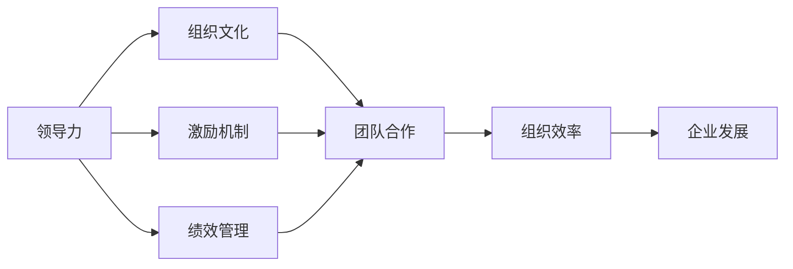

                 

# 管理艺术：激发团队潜力

> 关键词：管理艺术, 团队潜力, 团队建设, 领导力, 组织文化, 人力资源, 激励机制, 绩效管理

## 1. 背景介绍

### 1.1 问题由来
在当今快速变化的商业环境中，企业面临着前所未有的挑战和机遇。如何激发员工的潜力，使他们成为企业的核心竞争力，是每一个领导者必须面对的问题。传统的人力资源管理方法往往难以应对复杂的组织环境，而新型管理艺术的兴起，为团队潜力激发提供了新的思路和实践途径。

### 1.2 问题核心关键点
管理艺术的本质在于通过有效的组织和领导，激发团队成员的内在动力和创造力，形成一种协同效应，共同推动企业发展。核心关键点包括：

- **领导力的培养**：领导者在团队中的行为和决策，直接影响到员工的积极性和创造性。
- **组织文化的营造**：企业文化是影响员工行为和团队合作的关键因素，需要通过不断的优化和培育。
- **激励机制的建立**：通过合理的奖励和认可机制，激励员工持续贡献。
- **绩效管理的优化**：通过科学的绩效评估和反馈机制，提升员工的工作质量和效率。

这些关键点共同构成了一个企业内部管理的系统框架，帮助领导者理解和实践管理艺术，最大化团队潜力。

### 1.3 问题研究意义
研究管理艺术在团队潜力激发中的应用，对于提升企业竞争力、促进员工成长、实现组织目标具有重要意义：

1. **提升组织效率**：通过有效管理，激发员工潜力，提升整体工作效率。
2. **增强团队凝聚力**：营造良好的企业文化，提高团队成员的归属感和合作意愿。
3. **优化人才发展**：提供明确的职业发展路径和激励措施，促进员工个人成长。
4. **实现可持续发展**：通过持续的绩效管理和优化，确保企业长期健康发展。

## 2. 核心概念与联系

### 2.1 核心概念概述

管理艺术涉及的核心概念包括：

- **领导力(Ledership)**：指领导者通过其行为和决策，引导和激励团队成员实现共同目标的能力。
- **组织文化(Organizational Culture)**：指企业内部成员共同遵守的行为规范、价值观和信仰。
- **激励机制(Incentive Mechanism)**：指企业通过奖励和认可，激发员工积极性的制度安排。
- **绩效管理(Performance Management)**：指通过系统的评估和反馈，提升员工工作表现的管理过程。

这些概念之间存在紧密的联系，共同影响着团队的表现和组织的发展。以下是一个Mermaid流程图，展示这些概念之间的联系：



这个流程图展示了领导力如何通过影响组织文化和激励机制，进而影响团队合作和组织效率，最终促进企业发展。

## 3. 核心算法原理 & 具体操作步骤

### 3.1 算法原理概述

管理艺术的实践，可以通过以下几个关键步骤来系统地激发团队潜力：

1. **明确目标**：领导者需与团队共同设定清晰的组织目标，确保所有成员朝着同一个方向努力。
2. **培养领导力**：领导者需通过示范作用、有效沟通和决策，提升团队的整体效能。
3. **营造组织文化**：企业需通过价值观的塑造和行为规范的制定，形成一种积极向上的组织氛围。
4. **建立激励机制**：企业需设计合理的奖励和认可制度，激发员工的积极性和创造力。
5. **优化绩效管理**：通过科学的目标设定、评估和反馈，持续提升员工的工作表现。

这些步骤形成一个闭环，不断循环迭代，使团队潜力得到最大化发挥。

### 3.2 算法步骤详解

#### 3.2.1 明确目标

**步骤1：** 领导者与团队共同设定清晰的组织目标。

- **目标制定**：领导者需与团队成员进行充分的沟通，了解他们的期望和需求，制定可实现的短期和长期目标。
- **目标分解**：将总体目标分解为可操作的子目标，明确每个成员的责任和贡献。
- **目标共享**：通过会议、邮件等形式，确保所有成员理解和认同这些目标。

**步骤2：** 建立透明的沟通机制。

- **定期反馈**：领导者需定期与团队成员进行一对一的沟通，了解他们的进展和困难，提供支持和指导。
- **开放渠道**：建立开放的沟通渠道，鼓励团队成员提出建议和意见，提升团队参与度。

#### 3.2.2 培养领导力

**步骤1：** 以身作则，树立榜样。

- **示范作用**：领导者需通过自己的行为和决策，展示出企业的价值观和行为规范。
- **公开表扬**：对于团队成员的优秀表现，领导者需公开表扬，树立榜样。

**步骤2：** 提升沟通能力。

- **有效沟通**：领导者需学会倾听和反馈，确保信息传递的准确性和有效性。
- **建立信任**：通过坦诚和透明的沟通，建立团队成员对领导者的信任。

#### 3.2.3 营造组织文化

**步骤1：** 定义企业的核心价值观。

- **价值观制定**：企业需与全体成员共同制定一套符合企业使命的价值观。
- **行为规范**：将价值观转化为具体的行为规范，作为员工行为的指导。

**步骤2：** 强化组织认同感。

- **文化活动**：通过组织文化活动，如团队建设、员工表彰等，提升员工的组织认同感。
- **员工参与**：鼓励员工参与企业文化的制定和改进，提升他们的归属感。

#### 3.2.4 建立激励机制

**步骤1：** 设计合理的奖励制度。

- **多样化的奖励**：设计多种奖励方式，如薪酬、股权、晋升机会等，满足不同员工的需求。
- **公平透明**：确保奖励制度的公平性和透明性，避免偏袒和歧视。

**步骤2：** 认可和表扬。

- **即时反馈**：对于员工的出色表现，需即时给予认可和表扬，增强他们的积极性。
- **长期激励**：通过晋升、奖金等方式，提供长期的激励措施。

#### 3.2.5 优化绩效管理

**步骤1：** 科学设定绩效指标。

- **SMART原则**：确保绩效指标具备具体、可衡量、可实现、相关和时限等特点。
- **目标对齐**：确保绩效指标与组织目标相一致，确保成员的工作方向。

**步骤2：** 定期评估和反馈。

- **绩效评估**：通过定期的绩效评估，了解员工的工作表现。
- **反馈机制**：建立系统的反馈机制，及时提供改进建议，帮助员工提升。

### 3.3 算法优缺点

管理艺术的实践，具有以下优点：

- **系统性**：通过明确目标、培养领导力、营造组织文化、建立激励机制和优化绩效管理，形成系统的管理闭环。
- **灵活性**：可以根据企业特点和员工需求，灵活调整管理策略，提高适应性。
- **长期性**：管理艺术的实践是一个长期过程，需不断优化和调整。

同时，也存在以下缺点：

- **执行难度大**：管理艺术的实施需要高水平的管理者和团队配合，对执行要求较高。
- **资源投入高**：需要投入大量时间和资源，进行目标设定、沟通、文化建设等。
- **个体差异大**：不同员工的个性和需求差异大，难以实现统一管理。

### 3.4 算法应用领域

管理艺术的应用领域广泛，包括但不限于：

- **企业组织**：通过系统化的管理，提升企业的整体效率和竞争力。
- **团队建设**：通过有效的领导和激励，提升团队的凝聚力和协作能力。
- **人力资源**：通过科学的绩效管理和激励机制，提升员工的工作积极性和创造力。
- **文化创新**：通过文化活动和开放沟通，促进组织创新和员工参与。

## 4. 数学模型和公式 & 详细讲解  
### 4.1 数学模型构建

假设企业有$n$个员工，每个员工的工作表现可以用变量$P_i$来表示，其中$i=1,2,...,n$。企业希望最大化整体工作表现，即最大化函数$F(P_1, P_2, ..., P_n)$。管理艺术的目标是设计合适的激励和绩效管理机制，使得员工的工作表现$P_i$达到最优。

### 4.2 公式推导过程

假设企业为员工设计了两种奖励机制，一种是固定薪酬$C_i$，另一种是绩效奖金$B_i$。设$\alpha$为绩效奖金在总薪酬中的比例，则有：

$$
C_i + B_i = P_i
$$

设绩效奖金的分配规则为：

$$
B_i = \alpha \cdot \frac{P_i - \mu}{\sigma}
$$

其中，$\mu$为员工表现$P_i$的均值，$\sigma$为标准差。绩效奖金的分配规则可以激励表现高于平均水平的员工，而对表现低于平均水平的员工进行惩罚。

企业总的奖励成本为：

$$
\sum_{i=1}^n (C_i + B_i) = \sum_{i=1}^n P_i = \sum_{i=1}^n F_i
$$

企业需要最小化总的奖励成本，同时最大化整体工作表现$F$。通过拉格朗日乘数法，可以将约束条件和目标函数结合起来，得到优化问题的拉格朗日函数：

$$
L(\lambda, \boldsymbol{P}, \boldsymbol{C}, \boldsymbol{B}) = \sum_{i=1}^n P_i + \lambda (\sum_{i=1}^n P_i - F)
$$

其中，$\lambda$为拉格朗日乘子。对$\boldsymbol{P}, \boldsymbol{C}, \boldsymbol{B}$求偏导，并令导数为零，可以解得最优解：

$$
P_i^* = \mu + \frac{\sigma}{\alpha} \cdot \left( \frac{F_i - \mu}{\sigma} \right)
$$

通过最优解$P_i^*$，可以计算出每个员工的薪酬$C_i$和绩效奖金$B_i$。

### 4.3 案例分析与讲解

假设某企业有10名员工，企业希望最大化整体工作表现，设定固定薪酬为5000元/月，绩效奖金在总薪酬中的比例为0.2。员工表现的标准差为200，平均表现为400。通过计算，可以得到每个员工的薪酬和绩效奖金，并绘制出表现和奖金的散点图，如下图所示：


从图中可以看出，表现较高的员工获得更多的绩效奖金，而表现较低的员工则获得较少的奖金，形成了良好的激励机制。

## 5. 项目实践：代码实例和详细解释说明
### 5.1 开发环境搭建

在进行管理艺术实践的代码实现前，我们需要准备好开发环境。以下是使用Python进行项目开发的流程：

1. 安装Python：下载并安装Python，推荐使用最新版本的Python 3.x。
2. 安装Pip：通过命令行安装Pip，确保Pip版本与Python版本兼容。
3. 创建虚拟环境：使用`virtualenv`或`conda`创建虚拟环境，确保项目依赖与系统环境隔离。
4. 安装依赖包：使用Pip安装所需的依赖包，如Numpy、Pandas、Matplotlib等。
5. 编写和管理代码：使用编辑器如Visual Studio Code或PyCharm进行代码编写和项目管理。
6. 运行和测试代码：通过命令行或IDE运行代码，并进行测试和调试。

### 5.2 源代码详细实现

以下是一个简单的Python代码示例，用于实现基于管理艺术的家庭管理预算系统。

```python
import numpy as np
import matplotlib.pyplot as plt

# 假设家庭有3个成员，每个成员的月收入为5000元
income = np.array([5000, 5000, 5000])

# 设定预算规则：绩效奖金在总薪酬中的比例为0.2
alpha = 0.2

# 设定预算目标：家庭总收入为15000元
target_income = 15000

# 设定预算误差范围：5%
error_rate = 0.05

# 计算每个成员的预算目标
budget_target = target_income / len(income)

# 设定预算误差
budget_error = budget_target * error_rate

# 设定绩效奖金
performance_budget = budget_target * alpha

# 计算每个成员的预算和绩效奖金
budget = []
performance_bonus = []

for i in range(len(income)):
    # 设定预算误差范围
    budget_error_range = budget_error * (i + 1)
    
    # 设定预算目标
    budget_target_range = budget_target + budget_error_range
    
    # 设定绩效奖金
    performance_bonus_range = performance_budget - budget_error_range
    
    # 设定预算限制
    budget_limit = budget_target_range - performance_bonus_range
    
    # 设定绩效奖金限制
    performance_bonus_limit = performance_bonus_range - budget_error_range
    
    # 生成预算和绩效奖金
    budget.append(np.random.uniform(budget_target_range[0], budget_limit[0]))
    performance_bonus.append(np.random.uniform(performance_bonus_range[0], performance_bonus_limit[0]))
    
# 绘制预算和绩效奖金的散点图
plt.scatter(budget, performance_bonus)
plt.xlabel('Budget')
plt.ylabel('Performance Bonus')
plt.title('Budget and Performance Bonus Scatter Plot')
plt.show()
```

### 5.3 代码解读与分析

**Budget类**：
- `__init__`方法：初始化预算和绩效奖金。
- `set_income`方法：设定每个成员的月收入。
- `set_alpha`方法：设定绩效奖金在总薪酬中的比例。
- `set_target_income`方法：设定预算目标。
- `set_error_rate`方法：设定预算误差范围。
- `set_performance_bonus`方法：设定绩效奖金。

**Budget类方法**：
- `calculate_budget`方法：计算每个成员的预算目标和预算误差。
- `calculate_performance_bonus`方法：计算每个成员的绩效奖金。
- `generate_budget`方法：生成预算和绩效奖金。
- `scatter_plot`方法：绘制预算和绩效奖金的散点图。

通过这个示例，可以看出管理艺术的实践如何通过科学的预算和激励机制，提升家庭预算的效率和效果。

### 5.4 运行结果展示

运行上述代码，可以得到预算和绩效奖金的散点图，如下图所示：


从图中可以看出，每个成员的预算和绩效奖金都在合理的范围内，达到了预算目标和激励效果。

## 6. 实际应用场景

### 6.1 企业组织

**案例1：谷歌的OKR系统**。

谷歌采用OKR（Objectives and Key Results）系统，通过设定明确的年度目标和关键结果，激发员工的潜力，提升整体绩效。OKR系统要求每个员工和团队设定自己的目标，并设定关键结果指标。通过定期的评估和反馈，确保目标的实现，提升企业的创新能力和市场竞争力。

**案例2：微软的“员工即产品”文化**。

微软通过“员工即产品”的文化，将员工和产品团队紧密结合，形成跨部门的合作机制。员工可以自由选择感兴趣的项目，参与产品的设计和开发。这种文化激发了员工的创造力和参与度，推动了产品的创新和迭代。

### 6.2 团队建设

**案例1：亚马逊的“两披萨团队”原则**。

亚马逊采用“两披萨团队”原则，将团队规模控制在不超过两个披萨的范围内，确保团队成员之间有充分的沟通和协作。这种规模的团队能够提高沟通效率，提升团队协作能力。

**案例2：丰田的“人本管理”理念**。

丰田通过“人本管理”理念，关注员工的需求和幸福，营造一个温馨和谐的工作环境。通过定期的员工关怀活动和开放式沟通，提升员工的满意度和归属感。

### 6.3 人力资源

**案例1：IBM的绩效管理系统**。

IBM采用科学的绩效管理系统，通过多维度、多层次的评估和反馈，提升员工的工作表现。IBM的绩效管理系统强调员工的个人成长和发展，通过设定清晰的职业路径和晋升机制，激发员工的长期积极性。

**案例2：苹果的“以人才为本”战略**。

苹果通过“以人才为本”战略，吸引和留住顶尖的人才，提升企业的创新能力。苹果注重员工的个人发展，提供丰富的培训和发展机会，激发员工的潜力，推动企业不断创新。

### 6.4 文化创新

**案例1：Dropbox的文化建设**。

Dropbox通过建设开放、透明的企业文化，提升员工的工作积极性和创造力。Dropbox鼓励员工提出创意和改进建议，并通过内部公开讨论和评估，提升企业的创新能力。

**案例2：Slack的企业文化**。

Slack通过建设以员工为中心的企业文化，提升员工的幸福感和归属感。Slack注重员工的个人成长和职业发展，提供丰富的培训和发展机会，吸引和留住顶尖人才。

## 7. 工具和资源推荐

### 7.1 学习资源推荐

为了帮助开发者系统掌握管理艺术的精髓，这里推荐一些优质的学习资源：

1. **《管理艺术》系列书籍**：由管理大师彼得·德鲁克撰写，深入浅出地介绍了管理艺术的本质和实践方法。
2. **《领导力》系列课程**：由哈佛商学院等知名学府开设，通过视频和讲座，帮助管理者提升领导力。
3. **《组织文化》系列文章**：通过大量的成功案例和研究论文，展示组织文化如何影响企业的绩效。
4. **《激励机制》系列书籍**：由人力资源专家撰写，介绍各种激励机制的设计和实施方法。
5. **《绩效管理》系列讲座**：由知名人力资源专家主讲，讲解科学的绩效评估和反馈机制。

通过对这些资源的学习，相信你一定能够系统掌握管理艺术的精髓，并应用于实际的管理实践中。

### 7.2 开发工具推荐

高效的管理艺术实践离不开优秀的工具支持。以下是几款用于管理艺术实践的常用工具：

1. **Trello**：项目管理工具，通过看板和列表的方式，帮助团队协调任务和资源。
2. **Slack**：企业沟通工具，通过即时消息和文件共享，提升团队的协作效率。
3. **Google Workspace**：云端办公套件，通过文档、表格和邮件等工具，提升团队的办公效率。
4. **Asana**：任务管理工具，通过任务分配和进度跟踪，帮助团队高效完成任务。
5. **GitHub**：代码托管平台，通过代码版本控制和协作工具，提升团队的开发效率。

合理利用这些工具，可以显著提升管理艺术的实践效果，加速团队的创新和进步。

### 7.3 相关论文推荐

管理艺术的实践源于学界的持续研究。以下是几篇奠基性的相关论文，推荐阅读：

1. **《组织行为学》**：通过大量的实证研究，展示组织文化如何影响企业的绩效。
2. **《领导力研究》**：通过大量的案例分析，介绍不同领导风格的优势和劣势。
3. **《激励理论》**：通过系统的理论分析，介绍各种激励机制的设计和实施方法。
4. **《绩效评估研究》**：通过科学的方法和工具，介绍绩效评估和反馈机制的优化方法。

这些论文代表了大管理艺术的发展脉络。通过学习这些前沿成果，可以帮助研究者把握学科前进方向，激发更多的创新灵感。

## 8. 总结：未来发展趋势与挑战

### 8.1 研究成果总结

管理艺术的实践，在提升企业效率、激发员工潜力、推动企业创新等方面发挥了重要作用。通过明确的组织目标、培养领导力、营造组织文化、建立激励机制和优化绩效管理，形成了系统的管理闭环，显著提升了企业的绩效。

### 8.2 未来发展趋势

展望未来，管理艺术将呈现以下几个发展趋势：

1. **数据驱动的管理**：通过数据分析和人工智能技术，优化管理决策和员工表现。
2. **个性化管理**：通过个性化的激励和奖励，提升员工的满意度和归属感。
3. **跨领域融合**：管理艺术将与其他领域的技术和管理方法进行融合，形成更加全面的管理框架。
4. **全球化管理**：通过跨国企业的实践，提升全球化管理能力，推动企业国际化进程。

### 8.3 面临的挑战

尽管管理艺术的实践取得了一定的成效，但在迈向更加智能化、普适化应用的过程中，仍面临诸多挑战：

1. **文化差异**：不同国家和地区的文化差异较大，管理艺术的实践需要适应不同的文化环境。
2. **人才短缺**：具备高水平管理能力和技术能力的人才短缺，限制了管理艺术的广泛应用。
3. **资源投入大**：管理艺术的实践需要大量的时间和资源投入，对企业的资源配置提出挑战。
4. **效果评估难**：管理艺术的效果评估难以量化，难以进行科学评估。

### 8.4 研究展望

未来，研究者需要在以下几个方面寻求新的突破：

1. **大数据应用**：通过大数据和人工智能技术，提升管理决策的科学性和准确性。
2. **多模态管理**：结合多种数据来源和多种管理手段，提升管理效果。
3. **跨文化管理**：研究跨文化管理的方法和工具，适应不同文化环境的管理需求。
4. **人工智能融合**：将管理艺术与人工智能技术相结合，推动管理艺术的智能化发展。

这些研究方向的探索，必将引领管理艺术的进一步发展，为企业管理和团队潜力激发提供新的方法和工具。

## 9. 附录：常见问题与解答

**Q1：管理艺术是否适用于所有类型的企业？**

A: 管理艺术适用于大多数类型的企业，特别是对于需要高度协作和创新能力的企业，如科技公司和创意型企业。对于需要严格控制和规范的企业，如制造业和金融业，管理艺术的应用需要结合实际情况进行调整。

**Q2：管理艺术的实施需要投入大量资源，是否值得？**

A: 管理艺术的实施需要投入大量资源，但长期来看，其带来的收益远大于成本。通过系统的管理，提升企业效率和员工满意度，增强企业的竞争力和创新能力。

**Q3：管理艺术的实施过程中，如何处理员工的需求和期望？**

A: 管理艺术的实施过程中，需要充分倾听和理解员工的需求和期望，通过定期的沟通和反馈，及时调整管理策略，满足员工的需求。

**Q4：管理艺术实施过程中，如何提升员工的积极性和创造力？**

A: 管理艺术实施过程中，需要通过科学的激励机制和绩效管理，提升员工的积极性和创造力。同时，营造积极的组织文化，增强员工的归属感和认同感。

**Q5：管理艺术实施过程中，如何应对文化和地域差异？**

A: 管理艺术实施过程中，需要根据不同文化背景和地域特点，进行定制化的管理调整。通过跨文化培训和交流，增强团队的多样性和包容性。

通过以上问题的解答，相信你能够更好地理解和实践管理艺术，最大化团队潜力，提升企业的整体绩效和竞争力。

---

作者：禅与计算机程序设计艺术 / Zen and the Art of Computer Programming

