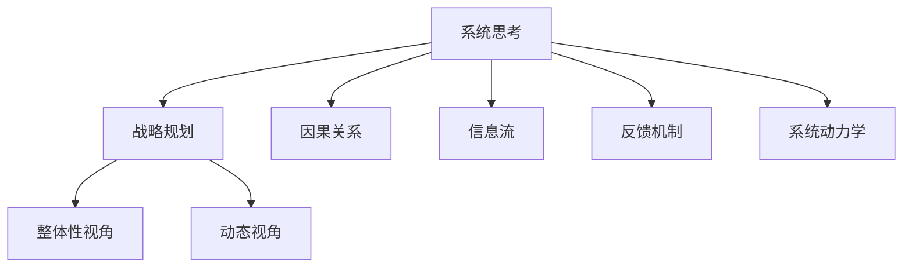

                 

# 系统思考在战略规划中的应用

## 1. 背景介绍

### 1.1 问题由来

在当今复杂多变的商业环境中，企业面对着内外部各种挑战和不确定性。战略规划作为指导企业未来发展的核心工具，其科学性和有效性直接影响到企业的发展轨迹和成果。然而，传统战略规划方法，如SWOT分析、PEST分析等，往往难以全面综合考虑企业运营的各个方面，导致决策偏颇。因此，如何在复杂环境中制定全面、科学、可持续的战略规划，成为企业发展中的一个重要课题。

### 1.2 问题核心关键点

系统思考（Systems Thinking）提供了一种全新的思维方式，旨在帮助人们全面理解复杂系统的结构和动态，从而制定出更为系统和科学的战略规划。系统思考强调系统整体的视角，注重不同要素之间的相互关系和影响，并能够在复杂系统中识别出关键驱动因素和反馈机制。

系统思考方法的核心包括：
1. **整体性视角**：将系统视为一个整体，识别系统中各要素之间的相互作用关系。
2. **动态视角**：认识到系统是不断变化的，动态系统中各要素的相互作用方式也在不断变化。
3. **因果关系**：深入分析系统中各要素之间的因果关系，识别出关键驱动因素和反馈机制。
4. **信息流视角**：理解系统中的信息流，包括数据的收集、处理和传播方式，以及信息流在决策过程中的作用。
5. **变革管理**：通过系统思考，理解变革的潜在影响和需要采取的行动，制定变革方案。

系统思考方法在战略规划中的应用，能够帮助企业更全面、系统地分析和预测市场环境变化，从而制定出更加科学、可持续的战略规划。

## 2. 核心概念与联系

### 2.1 核心概念概述

为更好地理解系统思考在战略规划中的应用，本节将介绍几个密切相关的核心概念：

- **系统思考（Systems Thinking）**：一种全面、系统的思维方式，旨在帮助人们理解和处理复杂系统，识别系统中的关键驱动因素和反馈机制。
- **战略规划（Strategic Planning）**：企业为实现其长期目标和任务，系统性地制定和执行规划的过程。
- **因果关系（Causal Relationships）**：系统中的元素之间相互影响、相互依赖的关系。
- **信息流（Information Flow）**：数据在系统中的传递和处理方式。
- **反馈机制（Feedback Mechanism）**：系统内部或系统与环境之间，通过信息交换，对原有状态进行修正和调节的过程。
- **系统动力学（System Dynamics）**：研究系统内部动态变化规律的学科，包括反馈机制、因果关系等。

这些核心概念之间的逻辑关系可以通过以下Mermaid流程图来展示：



这个流程图展示了一个复杂系统内部各个核心概念之间的关系，以及它们如何共同作用于系统思考和战略规划。

## 3. 核心算法原理 & 具体操作步骤

### 3.1 算法原理概述

系统思考在战略规划中的应用，主要基于系统动力学模型（System Dynamics Model）。系统动力学模型通过建立系统的因果关系和反馈机制，模拟系统在不同条件下的动态变化，从而帮助制定科学、可行的战略规划。

系统动力学模型假设系统内部存在因果关系和反馈机制，这些关系和机制决定了系统的行为和演变。通过对系统的动态行为进行分析，可以识别出影响系统行为的关键因素，并制定出应对策略。

系统动力学模型通常包括以下几个步骤：
1. 定义系统边界：明确系统的范围和界限，识别出系统内外的关键要素。
2. 建立因果关系图：识别系统内各要素之间的因果关系，建立系统的因果关系图。
3. 确定关键变量：识别出影响系统行为的关键变量，并设置相应的参数。
4. 建立模型：通过因果关系图，建立系统的动力学模型。
5. 仿真分析：通过仿真，模拟系统在各种条件下的行为，识别出系统的关键动态特性。
6. 制定策略：根据仿真分析结果，制定出系统的优化策略。

### 3.2 算法步骤详解

以下将详细介绍系统动力学模型在战略规划中的应用步骤：

**Step 1: 定义系统边界**

在定义系统边界时，需要明确系统的范围和界限，识别出系统内外的关键要素。系统边界应当根据战略规划的特定需求进行调整，以确保系统模型能够全面反映系统的实际情况。

例如，对于一家零售企业，系统边界可以包括：
- 内部要素：员工、库存、订单、成本、营销策略等。
- 外部要素：市场需求、竞争环境、供应商、顾客、政策法规等。

**Step 2: 建立因果关系图**

在建立因果关系图时，需要识别系统内各要素之间的因果关系，建立系统的因果关系图。因果关系图通常使用因果箭头表示要素之间的关系，箭头方向表示因果关系的方向。

例如，对于一家零售企业，可以建立如下因果关系图：

```plaintext
库存 -> 订单量 -> 销售额 -> 利润
市场需求 -> 竞争环境 -> 订单量 -> 库存
营销策略 -> 顾客满意度 -> 重复购买率 -> 销售额
```

**Step 3: 确定关键变量**

在确定关键变量时，需要识别出影响系统行为的关键变量，并设置相应的参数。关键变量应当是能够影响系统行为，并且对战略规划具有重要意义的变量。

例如，对于一家零售企业，关键变量可以包括：
- 订单量：影响销售额和利润的关键变量。
- 库存：影响订单量和利润的关键变量。
- 市场需求：影响订单量和库存的关键变量。
- 竞争环境：影响订单量和利润的关键变量。
- 营销策略：影响顾客满意度和重复购买率的关键变量。

**Step 4: 建立模型**

在建立模型时，需要根据因果关系图，建立系统的动力学模型。系统动力学模型通常使用差分方程或代数方程表示，描述系统中各关键变量的动态变化关系。

例如，对于一家零售企业，可以建立如下差分方程模型：

$$
\frac{d\text{库存}}{dt} = \text{订单量} - \text{销售量} - \text{损耗率} \times \text{库存}
$$

$$
\frac{d\text{订单量}}{dt} = \text{市场需求} \times \text{市场增长率} - \text{竞争环境} \times \text{订单量}
$$

$$
\frac{d\text{销售额}}{dt} = \text{订单量} \times \text{平均单价}
$$

$$
\frac{d\text{利润}}{dt} = \text{销售额} - \text{成本率} \times \text{销售额} - \text{库存成本}
$$

**Step 5: 仿真分析**

在仿真分析时，需要利用建立的模型，模拟系统在各种条件下的行为，识别出系统的关键动态特性。仿真分析通常使用系统动力学软件，如Vensim、Stella等，对系统模型进行模拟。

例如，对于一家零售企业，可以通过仿真分析识别出订单量、库存、销售额、利润等关键变量的动态特性，从而制定出相应的优化策略。

**Step 6: 制定策略**

在制定策略时，需要根据仿真分析结果，制定出系统的优化策略。优化策略应当能够应对系统中的关键动态特性，实现系统行为的改善和优化。

例如，对于一家零售企业，可以制定如下优化策略：
- 增加市场需求监测，调整营销策略，提升订单量。
- 优化库存管理，降低损耗率，提高库存周转率。
- 控制成本，提升利润率。

### 3.3 算法优缺点

系统动力学模型在战略规划中的应用，具有以下优点：
1. **全面性**：系统动力学模型能够全面考虑系统内外的各个要素，识别出因果关系和反馈机制。
2. **动态性**：系统动力学模型能够模拟系统在各种条件下的动态变化，识别出系统的关键动态特性。
3. **灵活性**：系统动力学模型可以根据实际情况进行调整和优化，适应不同的战略规划需求。
4. **可视化**：系统动力学模型通常以因果关系图的形式呈现，易于理解和分析。

系统动力学模型同样存在一些缺点：
1. **建模复杂**：系统动力学模型的建立和仿真分析较为复杂，需要较高的专业知识和技能。
2. **数据需求**：系统动力学模型需要大量的数据支持，数据的收集和处理较为繁琐。
3. **不确定性**：系统动力学模型的仿真结果受参数设置和模型假设的影响较大，存在一定的不确定性。
4. **实施难度**：系统动力学模型的实施需要企业内部的多部门协作，涉及技术和业务层面，实施难度较大。

尽管存在这些局限性，但系统动力学模型在战略规划中的应用仍然具有显著优势，尤其适用于需要全面考虑系统动态变化的企业。

### 3.4 算法应用领域

系统动力学模型在战略规划中的应用领域非常广泛，以下是几个典型的应用场景：

**零售企业**：通过系统动力学模型，零售企业可以全面分析市场需求、库存、订单量、成本等关键变量，制定出优化库存管理、提升销售额和利润的策略。

**制造业**：制造业企业可以通过系统动力学模型，分析供应链、生产、库存、质量等关键变量，优化生产流程，提高生产效率和质量。

**金融行业**：金融行业可以通过系统动力学模型，分析市场波动、风险管理、客户行为等关键变量，制定出优化投资组合、风险控制和客户服务的策略。

**医疗行业**：医疗行业可以通过系统动力学模型，分析患者流量、诊疗流程、资源分配等关键变量，优化诊疗流程，提高医疗服务质量和效率。

**能源行业**：能源企业可以通过系统动力学模型，分析能源需求、供应、成本等关键变量，优化能源配置，提高能源利用效率和安全性。

系统动力学模型在各个行业的战略规划中均发挥了重要作用，帮助企业更全面、系统地分析问题，制定出科学、可行的战略规划。

## 4. 数学模型和公式 & 详细讲解 & 举例说明

### 4.1 数学模型构建

系统动力学模型通常使用差分方程或代数方程表示，描述系统中各关键变量的动态变化关系。以下是系统动力学模型的一个简化示例：

假设一个生态系统中，存在三种生物：植物、食草动物和食肉动物。生物之间的关系为：
- 植物通过光合作用产生，并被食草动物和食肉动物食用。
- 食草动物通过食用植物生长，并被食肉动物食用。
- 食肉动物通过食用食草动物生存。

系统动力学模型可以建立如下差分方程模型：

$$
\frac{d\text{植物}}{dt} = \alpha - \beta \times \text{食草动物} - \gamma \times \text{食肉动物}
$$

$$
\frac{d\text{食草动物}}{dt} = \delta \times \text{植物} - \epsilon \times \text{食肉动物}
$$

$$
\frac{d\text{食肉动物}}{dt} = \zeta \times \text{食草动物}
$$

其中，$\alpha$、$\beta$、$\gamma$、$\delta$、$\epsilon$、$\zeta$为参数，分别表示光合作用系数、食草动物食植物系数、食肉动物食植物系数、食草动物食植物系数、食肉动物食草动物系数、食肉动物食草动物系数。

### 4.2 公式推导过程

以下是系统动力学模型中差分方程的推导过程：

假设系统中的关键变量 $x$ 随时间 $t$ 的变化量为 $\Delta x$，则有：

$$
\Delta x = f(x)
$$

将 $\Delta x$ 表示为 $x$ 的增量，则有：

$$
\Delta x = \frac{x(t+\Delta t) - x(t)}{\Delta t}
$$

将上式代入 $f(x)$，得：

$$
\frac{x(t+\Delta t) - x(t)}{\Delta t} = f(x)
$$

将上式整理并取极限 $\Delta t \to 0$，得：

$$
\frac{dx}{dt} = f(x)
$$

其中，$f(x)$ 为 $x$ 的导数，表示 $x$ 的动态变化率。

通过差分方程和导数之间的关系，可以建立系统动力学模型，并通过仿真分析预测系统的动态变化。

### 4.3 案例分析与讲解

以下是一个系统动力学模型的案例分析：

**案例背景**：某河流的水质受多种因素影响，包括工业废水、农业化肥、生活污水等。需要建立一个系统动力学模型，分析各种因素对水质的影响，并制定相应的治理策略。

**步骤**：
1. **定义系统边界**：明确河流边界，识别出系统内外的关键要素，如工业废水、农业化肥、生活污水、水体自然净化、污染物浓度等。
2. **建立因果关系图**：识别系统内各要素之间的因果关系，建立系统的因果关系图。
3. **确定关键变量**：识别出影响水质关键变量，并设置相应的参数。
4. **建立模型**：通过因果关系图，建立系统的动力学模型。
5. **仿真分析**：利用建立的模型，模拟不同治理策略下的水质变化，识别出系统的关键动态特性。
6. **制定策略**：根据仿真分析结果，制定出相应的优化策略。

**因果关系图**：

```plaintext
工业废水 -> 生活污水 -> 污染物浓度
农业化肥 -> 污染物浓度
生活污水 -> 污染物浓度
水体自然净化 -> 污染物浓度
污染物浓度 -> 水质
```

**动力学模型**：

$$
\frac{d\text{污染物浓度}}{dt} = \text{工业废水} + \text{农业化肥} + \text{生活污水} - \text{水体自然净化} \times \text{污染物浓度}
$$

**仿真分析**：通过仿真分析，可以预测不同治理策略下污染物浓度的变化，从而选择最优策略。

**策略**：根据仿真分析结果，可以制定出如下治理策略：
- 加强工业废水处理，减少工业废水排放。
- 推广农业化肥的合理使用，减少农业化肥的流失。
- 加强生活污水治理，减少生活污水排放。
- 增加水体自然净化，提高水体的自净能力。

## 5. 项目实践：代码实例和详细解释说明

### 5.1 开发环境搭建

在进行系统动力学模型开发前，我们需要准备好开发环境。以下是使用Python进行Vensim开发的环境配置流程：

1. 安装Anaconda：从官网下载并安装Anaconda，用于创建独立的Python环境。

2. 创建并激活虚拟环境：
```bash
conda create -n vensim-env python=3.8 
conda activate vensim-env
```

3. 安装Vensim：
```bash
conda install vensim
```

4. 安装各类工具包：
```bash
pip install numpy pandas matplotlib scipy jupyter notebook ipython
```

完成上述步骤后，即可在`vensim-env`环境中开始系统动力学模型的开发。

### 5.2 源代码详细实现

这里我们以一个简化的系统动力学模型为例，使用Vensim语言进行代码实现。

首先，定义系统边界和关键变量：

```python
from vensim import Model

m = Model()

# 定义关键变量
plant = m.add_variable('Plant', 'Plants', 'kg')
grazing_animal = m.add_variable('Grazing Animal', 'kg')
carnivore = m.add_variable('Carnivore', 'kg')

# 定义参数
alpha = m.add_parameter('Alpha', 'kg/year')
beta = m.add_parameter('Beta', 'kg/kg')
gamma = m.add_parameter('Gamma', 'kg/kg')
delta = m.add_parameter('Delta', 'kg/kg')
epsilon = m.add_parameter('Epsilon', 'kg/kg')
zeta = m.add_parameter('Zeta', 'kg/kg')
```

然后，建立因果关系图并设置方程：

```python
# 建立因果关系图
m.add_flow(alpha, plant, -beta*grazing_animal - gamma*carnivore)
m.add_flow(delta*plant, grazing_animal, -epsilon*carnivore)
m.add_flow(zeta*grazing_animal, carnivore, 0)

# 设置方程
m.add_rate_equation('Plant Growth', 'Differential Equation', 'alpha - beta*Grazing Animal - gamma*Carnivore')
m.add_rate_equation('Grazing Animal Growth', 'Differential Equation', 'delta*Plant - epsilon*Carnivore')
m.add_rate_equation('Carnivore Growth', 'Differential Equation', 'zeta*Grazing Animal')
```

最后，启动仿真分析：

```python
from vensim.run import create_run

run = create_run(m)
results = run.solve(0, 100)
results.plot()
```

以上就是使用Vensim进行系统动力学模型开发的完整代码实现。可以看到，通过Vensim，我们可以很方便地构建和仿真系统动力学模型，并分析系统的动态变化。

### 5.3 代码解读与分析

让我们再详细解读一下关键代码的实现细节：

**Model类**：
- `__init__`方法：创建并返回一个新的Model对象。
- `add_variable`方法：添加一个变量，用于表示系统中的关键变量。
- `add_parameter`方法：添加一个参数，用于表示系统中的常数。
- `add_flow`方法：添加一个物质流，表示物质在两个变量之间的流动。
- `add_rate_equation`方法：添加一个微分方程，用于描述关键变量的动态变化。

**仿真分析**：
- `create_run`函数：创建一个新的运行实例，用于对系统动力学模型进行仿真分析。
- `solve`方法：对模型进行求解，得到系统的动态变化结果。
- `plot`方法：绘制系统的动态变化结果，可视化关键变量的变化趋势。

通过Vensim进行系统动力学模型的开发，可以显著提升建模和仿真的效率，便于分析和调试。在实际应用中，还需要根据具体的系统需求，进一步扩展和优化系统动力学模型，实现更加复杂的系统分析。

## 6. 实际应用场景

### 6.1 智能交通系统

智能交通系统通过系统动力学模型，能够全面分析交通流量、车速、交通事故等关键变量，优化交通信号控制，减少拥堵，提高交通效率。

例如，通过建立智能交通系统动力学模型，可以分析不同交通信号控制策略下的交通流量和车速变化，从而选择最优策略。系统动力学模型可以模拟各种交通条件下的动态变化，识别出系统的关键动态特性，为交通管理提供科学的决策依据。

### 6.2 能源管理系统

能源管理系统通过系统动力学模型，能够全面分析能源需求、供应、消耗等关键变量，优化能源配置，提高能源利用效率。

例如，通过建立能源管理系统的动力学模型，可以分析不同能源配置策略下的能源需求和供应变化，从而选择最优策略。系统动力学模型可以模拟各种能源条件下的动态变化，识别出系统的关键动态特性，为能源管理提供科学的决策依据。

### 6.3 金融风险管理系统

金融风险管理系统通过系统动力学模型，能够全面分析市场波动、风险管理、资本流动等关键变量，识别出系统中的风险点，制定出风险控制策略。

例如，通过建立金融风险管理系统的动力学模型，可以分析不同风险管理策略下的市场波动和资本流动变化，从而选择最优策略。系统动力学模型可以模拟各种市场条件下的动态变化，识别出系统的关键动态特性，为风险管理提供科学的决策依据。

### 6.4 未来应用展望

随着系统动力学模型的不断发展，其在战略规划中的应用将更加广泛和深入，推动各行业的智能化转型和升级。

在智能交通系统中，系统动力学模型可以进一步扩展到智能驾驶、车联网等领域，提升交通系统的智能化水平，构建更安全、高效的未来交通。

在能源管理系统中，系统动力学模型可以进一步扩展到智能电网、可再生能源等领域，提升能源系统的智能化水平，构建更可持续、高效的未来能源。

在金融风险管理系统中，系统动力学模型可以进一步扩展到量化交易、金融市场预测等领域，提升金融系统的智能化水平，构建更稳定、高效的未来金融。

系统动力学模型在未来各行业的应用前景广阔，必将为各行业的智能化转型提供有力的技术支持。

## 7. 工具和资源推荐

### 7.1 学习资源推荐

为了帮助开发者系统掌握系统动力学模型和应用技术，这里推荐一些优质的学习资源：

1. **Vensim官方文档**：Vensim官方文档提供了详细的教程和案例分析，帮助用户深入理解系统动力学模型的建立和仿真。

2. **System Dynamics Basics**：一本介绍系统动力学基本原理和应用方法的经典书籍，适合初学者阅读。

3. **System Dynamics for Practitioners**：一本介绍系统动力学在实际问题中的应用方法和案例分析的书籍，适合从业者阅读。

4. **MIT System Dynamics Group**：麻省理工学院系统动力学研究组的网站，提供了大量的学习资源和案例分析，帮助用户深入理解系统动力学模型。

5. **Simulink**：Simulink是Matlab中的系统仿真工具，支持复杂系统的仿真分析，适合用户进一步学习和实践。

通过对这些资源的学习，相信你一定能够系统掌握系统动力学模型和应用技术，并用于解决实际的系统问题。

### 7.2 开发工具推荐

系统动力学模型的开发通常使用专业的系统仿真软件，如Vensim、Simulink等。这些工具提供了丰富的功能，支持复杂的系统仿真和分析。

以下是一些常用的系统仿真软件：

1. **Vensim**：Vensim是一款功能强大的系统仿真软件，支持系统动力学模型的建立和仿真分析，适用于各种规模的系统分析。

2. **Simulink**：Simulink是Matlab中的系统仿真工具，支持复杂系统的仿真分析，适合用户进一步学习和实践。

3. **STEPS**：STEPS是一款开源的系统仿真软件，支持系统动力学模型的建立和仿真分析，适用于用户研究和实践。

4. **AnyLogic**：AnyLogic是一款集成了多种仿真方法的综合仿真软件，支持系统动力学模型的建立和仿真分析，适用于用户研究和实践。

合理利用这些工具，可以显著提升系统动力学模型的开发效率，加快创新迭代的步伐。

### 7.3 相关论文推荐

系统动力学模型的发展源于学界的持续研究。以下是几篇奠基性的相关论文，推荐阅读：

1. **Dynamic Systems Theory: An Introduction**：一本介绍动态系统理论和系统动力学方法的经典书籍，适合系统动力学研究的入门读者。

2. **Systems Thinking and Practice**：一本介绍系统动力学基本原理和应用方法的经典书籍，适合从业者阅读。

3. **System Dynamics in the Study of Business Strategy**：一篇介绍系统动力学在商业战略研究中的应用方法和案例分析的论文，适合用户进一步学习和实践。

4. **System Dynamics in Planning and Control of Manufacturing Systems**：一篇介绍系统动力学在制造系统规划和控制中的应用方法和案例分析的论文，适合用户进一步学习和实践。

5. **A Computational Framework for Discrete-Event Systems and System Dynamics**：一篇介绍系统动力学和离散事件系统仿真的论文，适合用户进一步学习和实践。

这些论文代表了大系统动力学模型和方法的发展脉络，通过学习这些前沿成果，可以帮助研究者把握学科前进方向，激发更多的创新灵感。

## 8. 总结：未来发展趋势与挑战

### 8.1 总结

本文对系统动力学模型在战略规划中的应用进行了全面系统的介绍。首先阐述了系统动力学方法的基本原理和核心概念，明确了系统动力学在战略规划中的应用优势和局限性。其次，从原理到实践，详细讲解了系统动力学模型的建立和仿真分析步骤，给出了系统动力学模型开发的完整代码实例。同时，本文还广泛探讨了系统动力学模型在多个行业领域的应用前景，展示了系统动力学方法的巨大潜力。此外，本文精选了系统动力学模型的各类学习资源，力求为读者提供全方位的技术指引。

通过本文的系统梳理，可以看到，系统动力学模型在战略规划中的应用，能够帮助企业更全面、系统地分析和预测市场环境变化，从而制定出科学、可行的战略规划。随着系统动力学模型的不断发展，其在各行业的应用将更加广泛和深入，推动各行业的智能化转型和升级。

### 8.2 未来发展趋势

展望未来，系统动力学模型在战略规划中的应用将呈现以下几个发展趋势：

1. **跨学科融合**：系统动力学模型将与更多学科相结合，如人工智能、大数据、物联网等，形成跨学科的协同创新。
2. **实时化仿真**：系统动力学模型将逐步实现实时化仿真，通过在线监测和分析，实时调整战略规划，适应动态变化的环境。
3. **多尺度分析**：系统动力学模型将支持多尺度分析，从微观到宏观，从局部到全局，全面理解系统的动态变化规律。
4. **人工智能融合**：系统动力学模型将与人工智能技术相结合，形成智能决策系统，提高决策的自动化和智能化水平。
5. **可视化和交互式分析**：系统动力学模型将支持可视化和交互式分析，用户可以通过交互界面，实时查看系统动态变化，进行数据分析和决策。

以上趋势凸显了系统动力学模型在战略规划中的未来发展方向，将推动其在更多领域和场景中的应用。

### 8.3 面临的挑战

尽管系统动力学模型在战略规划中的应用已经取得了显著进展，但在迈向更加智能化、普适化应用的过程中，仍然面临一些挑战：

1. **建模复杂性**：系统动力学模型的建立和仿真分析较为复杂，需要较高的专业知识和技能，可能存在较高的门槛。
2. **数据需求**：系统动力学模型需要大量的数据支持，数据的收集和处理较为繁琐，可能存在数据获取的难度。
3. **不确定性**：系统动力学模型的仿真结果受参数设置和模型假设的影响较大，存在一定的不确定性，需要更多实验验证。
4. **实施难度**：系统动力学模型的实施需要企业内部的多部门协作，涉及技术和业务层面，实施难度较大，需要更多的资源和支持。
5. **持续更新**：系统动力学模型需要不断更新和优化，以适应动态变化的市场环境，需要持续投入研发资源。

尽管存在这些挑战，但系统动力学模型在战略规划中的应用仍然具有显著优势，尤其在需要全面考虑系统动态变化的企业中，将发挥更大的作用。

### 8.4 研究展望

面对系统动力学模型面临的挑战，未来的研究需要在以下几个方面寻求新的突破：

1. **建模自动化**：开发自动化的建模工具和算法，降低建模难度，提高建模效率。
2. **数据获取**：研究更加高效的数据获取和处理方法，提高数据的质量和可用性。
3. **模型优化**：研究更加先进的模型优化算法，提高模型的仿真精度和稳定性。
4. **实时仿真**：研究实时化仿真技术，实现实时监测和分析，提高系统的决策效率。
5. **跨学科融合**：研究系统动力学与其他学科的融合方法，推动跨学科的协同创新。
6. **人工智能融合**：研究系统动力学与人工智能的融合方法，提升系统的智能化水平。

这些研究方向的探索，必将引领系统动力学模型迈向更高的台阶，为战略规划提供更加全面、科学的决策支持。面向未来，系统动力学模型还需要与其他人工智能技术进行更深入的融合，多路径协同发力，共同推动战略规划系统的进步。只有勇于创新、敢于突破，才能不断拓展系统动力学模型的边界，让系统动力学方法更好地服务于企业的战略规划和决策。

## 9. 附录：常见问题与解答

**Q1：系统动力学模型是否适用于所有系统分析？**

A: 系统动力学模型适用于分析动态变化的系统，但对于静态系统或系统变化不明显的场景，可能不太适用。

**Q2：系统动力学模型的参数设置如何确定？**

A: 系统动力学模型的参数设置需要结合实际问题和数据情况进行确定。通常可以通过实证研究和专家咨询，结合数据分析结果，确定合理的参数值。

**Q3：系统动力学模型如何处理不确定性和风险？**

A: 系统动力学模型可以通过设置不同的参数值，进行情景分析和风险评估，识别出系统的关键动态特性，从而制定出应对策略。

**Q4：系统动力学模型在实际应用中如何调整和优化？**

A: 系统动力学模型需要根据实际问题和反馈结果，进行不断的调整和优化。可以通过迭代模拟和数据分析，不断优化模型参数和结构，提高模型的仿真精度和稳定性。

**Q5：系统动力学模型在应用中如何与其他技术结合？**

A: 系统动力学模型可以与人工智能、大数据、物联网等技术结合，形成智能决策系统。通过数据驱动和模型驱动的协同创新，提升决策的自动化和智能化水平。

通过对系统动力学模型的深入学习和实践，相信你一定能够系统掌握系统动力学模型的应用技术，并用于解决实际的系统问题。系统动力学方法将为企业的战略规划提供有力的技术支持，推动企业的智能化转型和升级。

---

作者：禅与计算机程序设计艺术 / Zen and the Art of Computer Programming

