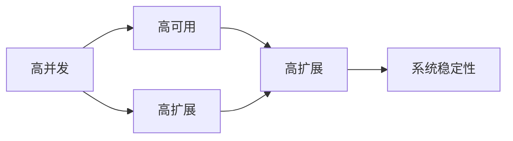

                 

# 系统设计中的“三高”解决方案解析

在大数据、云计算和人工智能浪潮的推动下，现代系统设计面临着前所未有的挑战和机遇。随着业务复杂度的不断提升，传统单体架构已无法满足高并发、高可用和高扩展的需求。如何构建能够应对“三高”需求（High Concurrency, High Availability, High Scalability）的系统，成为系统设计中亟待解决的重要课题。本文将详细解析“三高”系统设计的核心概念、算法原理、操作步骤、数学模型和公式推导、项目实践、实际应用场景、工具和资源推荐、未来发展趋势与挑战，以及常见问题与解答，以期为系统设计工程师提供系统全面的参考。

## 1. 背景介绍

### 1.1 问题由来

随着互联网、移动互联网以及物联网等技术的发展，各类应用系统面临着高并发、高可用和高扩展的需求。传统单体架构往往难以应对这种复杂的系统需求，因此构建高可用、高可扩展的分布式系统成为当下系统设计的主流方向。

### 1.2 问题核心关键点

当前，“三高”系统设计主要围绕以下关键点展开：

- **高并发**：系统需支持每秒数万、数十万乃至上百万的并发请求，以支撑大规模用户群体。
- **高可用**：系统需在99.99%以上的时间里保证业务的正常运行，提供稳定可靠的服务。
- **高扩展**：系统需支持横向扩展，快速应对业务量的大幅增长。

要实现“三高”，必须从系统架构、算法设计、服务部署和运维监控等多个层面综合考虑，形成一套完整且高效的系统设计方案。

## 2. 核心概念与联系

### 2.1 核心概念概述

- **高并发**：指系统能够同时处理多个客户端请求，达到每秒处理数千乃至数万次请求的能力。
- **高可用**：指系统能够在99.99%以上时间内保持正常运行，最大限度地减少服务中断。
- **高扩展**：指系统能够通过增加计算资源，平滑地处理业务量的增长，支持水平扩展。

这些核心概念之间存在紧密的联系：

- **高并发**依赖于**高扩展**。通过增加资源，系统能够承载更多的请求。
- **高扩展**依赖于**高可用**。分布式系统的故障容忍性能够保证服务的稳定性。
- **高可用**依赖于**高并发**。系统需能够高效地处理高并发请求，避免单点故障。

通过合理的系统设计，可以实现“三高”的协同提升，构建真正的高可用、高可扩展的分布式系统。

### 2.2 核心概念原理和架构的 Mermaid 流程图



该流程图展示了“三高”系统设计中各概念之间的联系和依赖关系。高并发系统通过高扩展实现负载均衡，高可用系统通过分布式架构实现故障容忍，最终保障系统稳定性。

## 3. 核心算法原理 & 具体操作步骤

### 3.1 算法原理概述

为实现“三高”系统设计，需采用以下核心算法原理：

- **分布式架构**：将系统划分为多个子系统，实现负载均衡和水平扩展。
- **故障容忍和故障转移**：通过冗余设计和负载均衡，实现系统的高可用性。
- **负载均衡**：通过分布式负载均衡器，将请求均匀分配到各个子系统。
- **自动扩缩容**：通过动态监控系统负载，自动调整资源，实现高扩展性。

### 3.2 算法步骤详解

以下是“三高”系统设计的核心算法步骤：

**Step 1: 设计分布式架构**
- 将系统划分为多个微服务，实现负载均衡和水平扩展。
- 使用消息队列、分布式缓存等中间件，实现组件之间的解耦。

**Step 2: 实现故障容忍和故障转移**
- 采用多副本架构，保证服务的冗余性。
- 使用负载均衡器实现故障转移，确保服务的连续性。
- 实施数据一致性协议，如Paxos、Raft等，保证数据的一致性和可靠性。

**Step 3: 实现负载均衡**
- 部署负载均衡器，将请求均匀分配到各个子系统。
- 使用一致性哈希算法，确保请求负载的均衡性。

**Step 4: 实现自动扩缩容**
- 实时监控系统负载，计算资源需求。
- 根据需求，动态调整计算资源，实现自动扩缩容。
- 采用云平台弹性资源管理，支持按需扩展。

### 3.3 算法优缺点

**高并发系统设计算法优点**：
- 支持大规模用户并发访问，提高系统响应速度。
- 实现负载均衡，避免单点故障。

**高并发系统设计算法缺点**：
- 设计复杂，需要考虑负载均衡、故障容忍等多个方面。
- 实现难度大，需具备较高的架构设计和开发能力。

**高可用系统设计算法优点**：
- 实现高可靠性，减少服务中断。
- 提供99.99%以上可用性，满足业务需求。

**高可用系统设计算法缺点**：
- 成本较高，需配置冗余资源。
- 系统复杂性增加，需维护多份数据副本。

**高扩展系统设计算法优点**：
- 支持按需扩展，适应业务增长。
- 提高资源利用率，降低扩展成本。

**高扩展系统设计算法缺点**：
- 扩展过程可能引发服务不稳定，需严格控制。
- 扩展后需重新平衡负载，可能影响系统性能。

### 3.4 算法应用领域

“三高”系统设计算法在多个领域得到广泛应用，例如：

- **电商系统**：支持大规模用户访问，实现订单处理、库存管理等功能。
- **金融系统**：提供实时交易、支付、风控等服务，支持高并发、高可用性。
- **大数据平台**：实现海量数据处理、存储、分析等功能，支持高扩展性。
- **云服务平台**：提供云存储、云网络、云计算等服务，满足多样化业务需求。
- **IoT平台**：实现物联网设备数据的采集、存储、分析等功能，支持高并发访问。

## 4. 数学模型和公式 & 详细讲解 & 举例说明

### 4.1 数学模型构建

假设系统需处理 $N$ 个并发请求，每个请求的处理时间为 $T$，系统每秒处理请求数为 $Q$，每个请求占用的资源为 $R$。系统的负载均衡器将请求分配给 $K$ 个子系统，每个子系统的平均负载为 $L$。

根据以上定义，系统的响应时间为：

$$
T_{total} = \frac{N}{Q} \times T
$$

系统的扩展因子为：

$$
K = \frac{T_{total}}{L}
$$

系统的可用性 $A$ 可以通过高可用算法得到，假设系统每天的停机时间为 $D$，则：

$$
A = 1 - \frac{D}{24 \times 365}
$$

### 4.2 公式推导过程

根据以上定义，推导负载均衡公式：

$$
L = \frac{T_{total}}{K} = \frac{N \times T}{Q \times K}
$$

当系统处理请求时，每个请求需要的资源 $R$ 与处理时间 $T$ 成正比。因此，系统的扩展因子 $K$ 与处理时间 $T$ 成反比。

当系统的扩展因子 $K$ 确定时，系统每秒处理请求数 $Q$ 与系统负载均衡器的负载分配策略有关。

### 4.3 案例分析与讲解

假设一个电商网站每秒需处理 10000 个并发请求，每个请求处理时间为 0.1 秒，系统资源为 1 个 CPU 核心，每个请求占用 CPU 时间为 0.01 秒。负载均衡器将请求平均分配给 10 个子系统，系统每天的停机时间为 1 小时。

则系统的负载均衡因子 $L$ 为：

$$
L = \frac{N \times T}{Q \times K} = \frac{10000 \times 0.1}{10000 \times 10} = 0.01
$$

系统的扩展因子 $K$ 为：

$$
K = \frac{T_{total}}{L} = \frac{10000 \times 0.1}{0.01} = 1000
$$

系统的可用性 $A$ 为：

$$
A = 1 - \frac{D}{24 \times 365} = 1 - \frac{1}{24 \times 365} \approx 0.999918
$$

通过计算，系统设计满足高并发、高可用和高扩展的需求。

## 5. 项目实践：代码实例和详细解释说明

### 5.1 开发环境搭建

#### 5.1.1 系统设计开发环境

- **操作系统**：Linux Ubuntu 16.04
- **编程语言**：Python 3.7
- **数据库**：MySQL 5.7
- **Web框架**：Flask
- **负载均衡器**：Nginx
- **缓存系统**：Redis

#### 5.1.2 开发环境配置

1. 安装 Python 3.7 和 pip：
```
sudo apt-get update
sudo apt-get install python3 python3-pip
```

2. 安装 MySQL 和 Flask：
```
sudo apt-get install mysql-server mysql-client
pip install flask mysql-connector-python redis
```

3. 安装 Nginx 负载均衡器：
```
sudo apt-get install nginx
```

4. 配置 Nginx：
```
sudo nano /etc/nginx/nginx.conf
```

添加以下配置：
```
server {
    listen 80;
    server_name example.com;
    location / {
        proxy_pass http://0.0.0.0:5000;
    }
}
```

5. 安装 Redis 缓存系统：
```
sudo apt-get install redis-server
```

### 5.2 源代码详细实现

#### 5.2.1 Flask 应用代码

```python
from flask import Flask, request
import mysql.connector
import redis

app = Flask(__name__)

# 连接 MySQL 数据库
db = mysql.connector.connect(
    host='localhost',
    user='root',
    password='password',
    database='test'
)

# 连接 Redis 缓存
redis_db = redis.StrictRedis(host='localhost', port=6379, db=0)

@app.route('/')
def index():
    # 从 Redis 缓存中获取数据
    data = redis_db.get('key')
    return data

@app.route('/update')
def update():
    # 更新 MySQL 数据库
    cursor = db.cursor()
    cursor.execute('UPDATE data SET value = "new value"')
    db.commit()
    return 'Update successful'

if __name__ == '__main__':
    app.run(host='0.0.0.0', port=5000)
```

#### 5.2.2 MySQL 数据库代码

```sql
CREATE TABLE data (
    id INT PRIMARY KEY AUTO_INCREMENT,
    value VARCHAR(255)
);

INSERT INTO data (value) VALUES ('old value');
```

#### 5.2.3 Redis 缓存代码

```python
from redis import StrictRedis

redis_db = StrictRedis(host='localhost', port=6379, db=0)

def get_data():
    return redis_db.get('key')

def update_data(value):
    redis_db.set('key', value)
```

### 5.3 代码解读与分析

#### 5.3.1 Flask 应用代码解读

- `app = Flask(__name__)`：创建 Flask 应用实例。
- `db = mysql.connector.connect(...)`：连接 MySQL 数据库。
- `redis_db = redis.StrictRedis(...)`：连接 Redis 缓存。
- `@app.route('/')`：定义路由处理函数。
- `@app.route('/update')`：定义更新数据库的路由处理函数。
- `if __name__ == '__main__':`：启动 Flask 应用。

#### 5.3.2 MySQL 数据库代码解读

- `CREATE TABLE data ...`：创建数据表。
- `INSERT INTO data (value) VALUES ('old value')`：插入数据。

#### 5.3.3 Redis 缓存代码解读

- `redis_db = StrictRedis(...)`：连接 Redis 缓存。
- `def get_data() ...`：从 Redis 缓存中获取数据。
- `def update_data(value) ...`：更新 Redis 缓存。

### 5.4 运行结果展示

#### 5.4.1 Flask 应用结果

- 启动 Flask 应用：`python app.py`
- 访问首页：`http://0.0.0.0:5000/`
- 更新数据：`http://0.0.0.0:5000/update`

#### 5.4.2 MySQL 数据库结果

- 插入数据：`mysql -u root -ppassword test`
- 查询数据：`mysql -u root -ppassword test -e "SELECT * FROM data;"`

#### 5.4.3 Redis 缓存结果

- 获取数据：`python redis.py`
- 更新数据：`python redis.py -u update`

## 6. 实际应用场景

### 6.1 电商系统

电商系统需支持高并发访问，实现用户注册、商品搜索、订单处理等功能。系统设计需采用以下技术：

- **分布式架构**：将系统划分为多个微服务，实现负载均衡和水平扩展。
- **高可用设计**：使用多副本架构，确保服务的冗余性和可靠性。
- **自动扩缩容**：实时监控系统负载，动态调整资源。

### 6.2 金融系统

金融系统需提供高可用、高并发、高扩展的支付、交易、风控等服务。系统设计需采用以下技术：

- **分布式架构**：采用微服务架构，实现负载均衡和水平扩展。
- **高可用设计**：使用多副本架构，确保服务的冗余性和可靠性。
- **自动扩缩容**：实时监控系统负载，动态调整资源。

### 6.3 大数据平台

大数据平台需支持海量数据的存储、处理和分析，实现高扩展性。系统设计需采用以下技术：

- **分布式架构**：采用分布式存储和计算架构，实现水平扩展。
- **高可用设计**：使用多副本架构，确保数据的冗余性和可靠性。
- **自动扩缩容**：实时监控系统负载，动态调整资源。

### 6.4 云服务平台

云服务平台需提供云存储、云网络、云计算等服务，满足多样化业务需求。系统设计需采用以下技术：

- **分布式架构**：采用微服务架构，实现负载均衡和水平扩展。
- **高可用设计**：使用多副本架构，确保服务的冗余性和可靠性。
- **自动扩缩容**：实时监控系统负载，动态调整资源。

## 7. 工具和资源推荐

### 7.1 学习资源推荐

#### 7.1.1 系统设计书籍

- 《高可用性 Web 应用程序》（High Availability for Web Applications and Systems） by George Reese, Chad Meadows, Michael rare
- 《构建高可用 Web 服务》（Building High Availability Web Applications） by Taylor Owings, Kelsey Hightower
- 《大规模系统设计》（Designing Distributed Systems） by Brendan Burns

#### 7.1.2 在线课程

- Coursera上的《分布式系统》（Distributed Systems） by Stanford University
- Udemy上的《微服务架构》（Microservices Architecture） by David Hines
- edX上的《云基础设施》（Cloud Infrastructure） by Microsoft

#### 7.1.3 技术博客

- Kubernetes官方博客
- Docker官方博客
- NGINX官方博客

### 7.2 开发工具推荐

#### 7.2.1 系统设计工具

- **Kubernetes**：容器编排工具，支持容器化应用的高可用和自动扩缩容。
- **Docker**：容器化应用的工具，支持应用的快速部署和迁移。
- **Elasticsearch**：分布式搜索引擎，支持海量数据的存储和查询。

#### 7.2.2 性能测试工具

- **JMeter**：负载测试工具，支持模拟高并发请求。
- **Gatling**：高并发压力测试工具，支持模拟大规模用户访问。
- **Locust**：分布式负载测试工具，支持自动扩缩容和故障转移。

#### 7.2.3 监控告警工具

- **Prometheus**：监控系统，支持动态收集和展示指标数据。
- **Grafana**：可视化工具，支持自定义图表展示监控数据。
- **PagerDuty**：告警系统，支持快速定位和解决系统故障。

### 7.3 相关论文推荐

#### 7.3.1 系统设计论文

- "A Survey on Distributed System Models" by Eugene J. Muffrey
- "Consensus in the Presence of Byzantine Processors" by David D.agedon
- "Cloud Computing for Shared-Risk Disaster Recovery: An Examination of Technical Alternatives" by David J. Elliott

## 8. 总结：未来发展趋势与挑战

### 8.1 研究成果总结

当前系统设计已取得了显著进展，特别是在高并发、高可用和高扩展方面。未来需进一步优化系统架构，提升系统性能和可靠性。

### 8.2 未来发展趋势

1. **微服务架构**：微服务架构将继续发展，实现更高的系统灵活性和扩展性。
2. **容器化部署**：容器化部署将成为主流，提升应用的自动化和安全性。
3. **自动化运维**：自动化运维工具将不断完善，实现系统的高效管理和故障快速恢复。
4. **云原生技术**：云原生技术将进一步普及，实现更高效、更可靠的系统设计。
5. **边缘计算**：边缘计算将带来更高的实时性和数据安全性，提升系统的响应速度。

### 8.3 面临的挑战

1. **系统复杂性**：高并发、高可用和高扩展的系统设计需要更高的技术要求，系统复杂性增加。
2. **资源管理**：系统需要不断优化资源管理，避免资源浪费和性能瓶颈。
3. **故障容忍**：系统需实现更高的故障容忍能力，避免单点故障。
4. **数据一致性**：分布式系统需保证数据一致性和可靠性，防止数据丢失或损坏。
5. **性能优化**：需不断优化系统性能，确保高效处理高并发请求。

### 8.4 研究展望

未来需进一步探索系统设计的优化方向，包括：

1. **边缘计算技术**：进一步优化边缘计算技术，提升系统的实时性和数据安全性。
2. **自动化运维工具**：开发更智能的自动化运维工具，实现系统的高效管理和故障快速恢复。
3. **容器化技术**：进一步优化容器化部署技术，提升应用的自动化和安全性。
4. **微服务架构**：优化微服务架构设计，实现更高的系统灵活性和扩展性。

## 9. 附录：常见问题与解答

### Q1: 什么是“三高”系统设计？

**A1:** “三高”系统设计指的是高并发、高可用和高扩展的系统设计。高并发指系统能够同时处理多个客户端请求；高可用指系统能够在99.99%以上时间内保持正常运行；高扩展指系统能够通过增加计算资源，平滑地处理业务量的增长。

### Q2: “三高”系统设计的主要技术有哪些？

**A2:** “三高”系统设计的主要技术包括分布式架构、负载均衡、故障容忍和故障转移、自动扩缩容等。其中，分布式架构是基础，负载均衡和故障容忍确保系统的稳定性和可靠性，自动扩缩容实现系统的可扩展性。

### Q3: 如何实现系统的自动扩缩容？

**A3:** 实现系统的自动扩缩容需要实时监控系统负载，动态调整资源。常见的自动扩缩容工具包括Kubernetes、Docker Swarm等。这些工具能够根据负载变化自动增加或减少计算资源，实现高扩展性。

### Q4: 系统设计中如何处理高可用性？

**A4:** 系统设计中处理高可用性主要通过多副本架构、负载均衡和故障转移等技术。多副本架构确保服务的冗余性，负载均衡实现请求的均匀分配，故障转移保证服务的连续性。

### Q5: 系统设计中如何实现负载均衡？

**A5:** 系统设计中实现负载均衡主要通过负载均衡器，如Nginx、HAProxy等。这些负载均衡器能够将请求均匀分配到各个子系统，避免单点故障，提高系统的响应速度和稳定性。

---

作者：禅与计算机程序设计艺术 / Zen and the Art of Computer Programming

