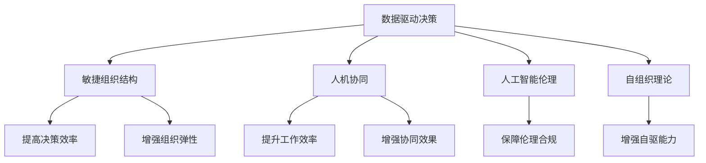

                 

# 经典管理理论在现代企业中的创新应用

## 1. 背景介绍

### 1.1 问题由来
经典管理理论是过去百年管理实践的智慧结晶，包含了如泰勒的科学管理、韦伯的官僚制、马斯洛的需求层次理论等众多思想，在提升生产效率、优化组织结构、激发员工潜力等方面发挥了巨大的作用。然而，随着现代企业环境的快速变化，以及新技术的不断涌现，传统管理理论在一些场景下已显得不够灵活。

在数字化、网络化、智能化的大背景下，现代企业面临着全新的管理挑战：
- 数据驱动决策：越来越多的业务决策需要基于大数据和人工智能的分析，传统管理理论难以应对这种高数据量、高复杂度的场景。
- 灵活组织结构：现代企业需要快速适应市场变化，灵活调整组织结构，传统官僚制管理难以适应这一需求。
- 人工智能与人的协同：现代企业需要人工智能与人类工作者更好地协同工作，这需要新的管理思维。

因此，创新地应用经典管理理论，并将其与现代信息技术、大数据分析、人工智能等技术深度融合，成为管理科学和企业管理实践的迫切需求。

### 1.2 问题核心关键点
本节将重点关注以下几个经典管理理论在现代企业中的应用：

1. **数据驱动的决策管理**：如何利用大数据和人工智能技术，辅助决策者进行基于数据的科学管理。
2. **敏捷组织结构**：在动态市场环境下，如何构建灵活、可扩展的组织结构，提升企业应对市场变化的能力。
3. **人机协同的管理机制**：如何构建支持人工智能与人类工作者协同工作的管理机制，确保人机无缝衔接。

## 2. 核心概念与联系

### 2.1 核心概念概述

为更好地理解经典管理理论在现代企业中的应用，本节将介绍几个密切相关的核心概念：

- **数据驱动决策**：通过收集、整理、分析大量数据，辅助管理者进行科学决策。
- **敏捷组织结构**：在动态变化的市场环境中，灵活调整组织结构以提升企业竞争力。
- **人机协同**：人工智能与人类工作者协同工作，形成优势互补的管理机制。
- **人工智能伦理**：在使用人工智能技术时，需考虑其对企业社会责任、员工伦理的影响。
- **自组织理论**：通过自我管理、自驱动的团队，提升组织灵活性和创新能力。

这些核心概念之间的逻辑关系可以通过以下Mermaid流程图来展示：



这个流程图展示了这个核心概念体系之间的相互关系：

1. 数据驱动决策通过收集和分析数据，提高决策的科学性和效率。
2. 敏捷组织结构通过灵活的组织调整，提升企业的市场适应能力。
3. 人机协同使得人工智能与人类工作者能够更好地协作，提高工作质量。
4. 人工智能伦理确保技术应用过程中对企业社会责任和员工权益的保障。
5. 自组织理论引导团队自我管理和驱动，提升团队灵活性和创新性。

## 3. 核心算法原理 & 具体操作步骤
### 3.1 算法原理概述

现代企业中应用经典管理理论，主要是通过将其与现代技术进行深度融合，构建数据驱动、灵活、协同的管理系统。以下将详细介绍几种关键的算法原理和操作步骤。

### 3.2 算法步骤详解

#### 3.2.1 数据驱动决策
**数据采集与清洗**
- 收集企业内外部的业务数据，如销售数据、生产数据、市场数据等。
- 对数据进行清洗、去重、归一化处理，确保数据质量。

**数据分析与建模**
- 利用机器学习、深度学习等技术，构建预测模型，如回归模型、分类模型、序列模型等。
- 应用统计分析方法，提取数据中的规律和趋势。

**决策支持**
- 将分析结果可视化，提供给管理者直观的决策依据。
- 建立决策模型，辅助管理者进行决策。

#### 3.2.2 敏捷组织结构
**组织结构调整**
- 根据市场需求和技术变化，及时调整组织结构，如扁平化管理、跨部门团队等。
- 使用敏捷方法论，如Scrum、Kanban等，提升团队灵活性和响应速度。

**人才流动与培养**
- 建立灵活的人才流动机制，鼓励人才跨部门、跨团队流动。
- 制定全面的员工培训计划，提升员工技能和知识水平。

**绩效管理与激励**
- 建立公平、透明的绩效评估体系，激励员工表现。
- 使用数据驱动的薪酬激励，根据员工绩效和个人贡献进行激励。

#### 3.2.3 人机协同
**协同工作平台**
- 建立支持人机协同的智能工作平台，如协作机器人、自动化流程等。
- 确保人工智能系统与人类工作者之间的无缝衔接。

**协同工作机制**
- 建立协同工作流程，明确人机工作的职责和协作方式。
- 培养员工对人工智能技术的接受和适应能力。

**人机协同的绩效评估**
- 制定人机协同的绩效评估标准，综合评估人工智能与人类工作者的协同效果。
- 利用数据分析工具，监测和优化人机协同过程。

#### 3.2.4 人工智能伦理
**伦理审查机制**
- 建立人工智能应用的伦理审查机制，确保技术应用符合伦理规范。
- 定期评估人工智能系统对社会、企业、员工的影响。

**伦理培训**
- 对管理者和员工进行人工智能伦理培训，提升其伦理意识。
- 制定人工智能伦理规范，指导技术应用。

**数据隐私保护**
- 保护用户数据隐私，避免数据滥用和泄露。
- 建立数据使用透明度机制，确保数据使用符合法律和道德规范。

#### 3.2.5 自组织理论
**自主管理机制**
- 建立自主管理团队，赋予团队自主决策权。
- 制定自主管理流程和规范，确保团队高效运作。

**团队自驱能力**
- 培养团队的创新能力和自我驱动能力，激发团队潜力。
- 提供充足的资源和支持，确保团队能够自主推进项目。

**团队协作**
- 建立团队协作机制，促进团队内部交流与合作。
- 利用团队协作工具，提升团队协作效率。

### 3.3 算法优缺点

经典管理理论在现代企业中的应用具有以下优点：

1. **科学决策**：通过数据驱动决策，减少人为因素的干扰，提高决策的科学性和客观性。
2. **灵活应变**：敏捷组织结构能够快速响应市场变化，提升企业的市场适应能力。
3. **协同效率**：人机协同机制能够充分利用人工智能与人类工作者的优势，提高工作质量和效率。
4. **伦理合规**：通过建立伦理审查机制，确保人工智能应用符合伦理规范，保障企业社会责任。
5. **团队创新**：自组织理论能够激发团队自主管理和创新，提升团队灵活性和自驱能力。

同时，这些应用方法也存在一些局限性：

1. **数据质量问题**：数据驱动决策对数据质量要求高，数据缺失、噪声等问题可能影响决策结果。
2. **技术成本高**：敏捷组织结构、人机协同、人工智能伦理等应用需要较高的技术投入。
3. **文化冲突**：新管理方式可能与现有企业文化产生冲突，需逐步推进。
4. **员工适应**：员工对新技术的接受和适应能力不足，可能影响应用效果。

## 4. 数学模型和公式 & 详细讲解 & 举例说明
### 4.1 数学模型构建

为更好地说明经典管理理论在现代企业中的应用，以下将构建几个关键的数学模型：

- **回归模型**：用于预测销售量、利润等连续变量。
- **分类模型**：用于预测客户流失、产品分类等离散变量。
- **序列模型**：用于预测需求、库存等时间序列数据。

**回归模型**：
- 假设数据集为 $\{(x_i, y_i)\}_{i=1}^N$，其中 $x_i \in \mathbb{R}^d$ 为输入特征，$y_i \in \mathbb{R}$ 为输出标签。
- 构建线性回归模型 $y_i = \theta_0 + \sum_{j=1}^d \theta_j x_{ij}$。
- 最小化均方误差损失函数 $\frac{1}{N} \sum_{i=1}^N (y_i - \hat{y}_i)^2$，通过梯度下降等优化算法求解 $\theta$。

**分类模型**：
- 假设数据集为 $\{(x_i, y_i)\}_{i=1}^N$，其中 $x_i \in \mathbb{R}^d$ 为输入特征，$y_i \in \{0,1\}$ 为二分类标签。
- 构建逻辑回归模型 $\hat{y}_i = \frac{1}{1+\exp(-\sum_{j=1}^d \theta_j x_{ij} + \theta_0)}$。
- 最小化交叉熵损失函数 $\frac{1}{N} \sum_{i=1}^N -y_i \log \hat{y}_i - (1-y_i) \log (1-\hat{y}_i)$，通过梯度下降等优化算法求解 $\theta$。

**序列模型**：
- 假设数据集为 $\{(x_t, y_t)\}_{t=1}^T$，其中 $x_t \in \mathbb{R}^d$ 为时间步长 $t$ 的输入特征，$y_t \in \mathbb{R}$ 为时间步长 $t$ 的输出标签。
- 构建循环神经网络 (RNN) 模型 $y_t = \theta_{t-1} + \theta_{t-2} \cdot \sigma(\theta_{t-1} \cdot x_t)$。
- 最小化均方误差损失函数 $\frac{1}{T} \sum_{t=1}^T (y_t - \hat{y}_t)^2$，通过梯度下降等优化算法求解 $\theta$。

### 4.2 公式推导过程

以回归模型为例，以下将推导其损失函数和梯度计算公式：

- 假设数据集为 $\{(x_i, y_i)\}_{i=1}^N$，其中 $x_i \in \mathbb{R}^d$ 为输入特征，$y_i \in \mathbb{R}$ 为输出标签。
- 构建线性回归模型 $y_i = \theta_0 + \sum_{j=1}^d \theta_j x_{ij}$。
- 最小化均方误差损失函数 $\frac{1}{N} \sum_{i=1}^N (y_i - \hat{y}_i)^2$。

**梯度下降算法**：
- 设 $\theta$ 为模型参数，$\eta$ 为学习率。
- 最小化损失函数 $\mathcal{L}(\theta) = \frac{1}{N} \sum_{i=1}^N (y_i - \hat{y}_i)^2$。
- 梯度计算公式：$\nabla_{\theta}\mathcal{L}(\theta) = \frac{2}{N} \sum_{i=1}^N (\hat{y}_i - y_i) x_i$。
- 参数更新公式：$\theta \leftarrow \theta - \eta \nabla_{\theta}\mathcal{L}(\theta)$。

通过上述推导，可以理解回归模型的最小化损失函数和梯度计算过程，从而应用于实际的企业管理问题。

### 4.3 案例分析与讲解

以下以一家制造企业为例，展示数据驱动决策在企业中的应用：

**数据驱动决策案例**：

一家制造企业通过收集其销售数据，利用回归模型预测下季度销售额。具体步骤如下：

1. **数据采集**：收集过去一年的月度销售额数据，包括产品种类、销售渠道、市场环境等。
2. **数据清洗**：去除异常值、缺失值，进行数据归一化处理。
3. **模型构建**：构建线性回归模型，使用历史数据进行训练。
4. **预测与决策**：利用训练好的模型，对下季度的销售额进行预测。
5. **决策支持**：将预测结果提供给决策者，辅助其进行销售策略调整。

通过上述案例，可以看到数据驱动决策在现代企业中的应用流程和效果。

## 5. 项目实践：代码实例和详细解释说明
### 5.1 开发环境搭建

在进行项目实践前，我们需要准备好开发环境。以下是使用Python进行数据驱动决策的开发环境配置流程：

1. 安装Anaconda：从官网下载并安装Anaconda，用于创建独立的Python环境。

2. 创建并激活虚拟环境：
```bash
conda create -n py3k python=3.8 
conda activate py3k
```

3. 安装相关依赖：
```bash
conda install numpy pandas sklearn matplotlib seaborn jupyter notebook
```

完成上述步骤后，即可在`py3k`环境中开始项目实践。

### 5.2 源代码详细实现

以下是一个简单的数据驱动决策项目，使用线性回归模型进行销售额预测。

```python
import numpy as np
import pandas as pd
from sklearn.linear_model import LinearRegression
from sklearn.metrics import mean_squared_error

# 准备数据集
data = pd.read_csv('sales_data.csv')
X = data[['market', 'channel', 'cost']].values
y = data['sales'].values

# 构建线性回归模型
model = LinearRegression()
model.fit(X, y)

# 预测下季度销售额
future_sales = model.predict(np.array([[np.mean(market), np.mean(channel), np.mean(cost)]).reshape(1))

# 输出预测结果
print('预测销售额为：', future_sales[0])
```

### 5.3 代码解读与分析

让我们再详细解读一下关键代码的实现细节：

**数据准备**：
- 使用pandas库读取数据集，并进行初步的数据处理。
- 选取与销售额相关的输入特征，构建特征矩阵 $X$ 和输出标签向量 $y$。

**模型训练**：
- 使用sklearn库中的LinearRegression模型，对数据进行线性回归训练。
- 使用训练数据集 $X, y$，调用 `fit` 方法训练模型。

**预测输出**：
- 使用训练好的模型，对新的输入数据进行预测。
- 使用 `predict` 方法，输入新的数据集，得到预测结果。

**结果输出**：
- 打印预测结果，供决策者参考。

这个示例代码展示了数据驱动决策的基本流程，包括数据准备、模型训练、预测输出等关键步骤。在实际项目中，还需要考虑更多细节，如数据清洗、模型选择、结果验证等。

## 6. 实际应用场景
### 6.1 智能制造

数据驱动决策在智能制造中具有重要应用。传统制造业往往依赖经验决策，难以快速响应市场变化。通过引入数据驱动决策，可以优化生产流程，提升生产效率，降低成本。

在具体实践中，可以利用传感器数据、设备状态数据、质量检测数据等，构建各种预测模型，如需求预测、设备故障预测、生产调度等。通过对这些模型的应用，智能制造系统能够自动优化生产计划，减少资源浪费，提升生产效率。

### 6.2 供应链管理

敏捷组织结构在供应链管理中的应用也非常广泛。传统的供应链管理往往依赖层级化的管理方式，难以快速响应市场变化。通过引入敏捷组织结构，可以提高供应链的灵活性和响应速度，确保及时供货。

在实际应用中，可以建立跨部门的敏捷团队，通过敏捷方法论（如Scrum、Kanban）进行协作，实时监控供应链状态，快速调整生产计划和库存管理，确保供应链的高效运行。

### 6.3 客户服务

人机协同在客户服务中的应用，可以大幅提升客户满意度。传统客户服务依赖人工客服，无法24小时不间断服务，且难以快速响应客户需求。通过引入人工智能技术，可以建立智能客服系统，实现全天候服务，提升客户体验。

在具体实践中，可以利用自然语言处理技术，构建智能客服聊天机器人，实现自动回答客户咨询、处理投诉、推荐产品等任务。通过智能客服系统，企业可以大幅提升客户服务效率，降低人力成本。

## 7. 工具和资源推荐
### 7.1 学习资源推荐

为帮助开发者系统掌握经典管理理论在现代企业中的应用，以下推荐一些优质的学习资源：

1. 《数据驱动管理：大数据与智能决策》：介绍如何使用数据驱动决策进行企业管理。
2. 《敏捷项目管理》：详细介绍敏捷方法论和敏捷组织结构。
3. 《人机协同管理》：探讨人工智能与人类工作者协同工作的方法。
4. 《人工智能伦理与法律》：分析人工智能技术在企业应用中的伦理与法律问题。
5. 《自组织理论与应用》：介绍自组织理论在企业管理中的应用。

通过对这些资源的学习实践，相信你一定能够全面掌握经典管理理论在现代企业中的应用。

### 7.2 开发工具推荐

高效的开发离不开优秀的工具支持。以下是几款用于数据驱动决策、敏捷组织结构、人机协同开发的常用工具：

1. Python：灵活动态的编程语言，广泛用于数据分析、机器学习等领域。
2. R语言：专门用于统计分析和数据建模的工具，拥有丰富的统计函数和可视化库。
3. Jupyter Notebook：开源的交互式笔记本工具，支持Python、R等多种编程语言，方便数据建模和展示。
4. Tableau：商业智能工具，支持数据的可视化分析和报告生成。
5. Power BI：微软的商业智能平台，提供丰富的数据可视化功能和仪表盘设计。

合理利用这些工具，可以显著提升经典管理理论在现代企业中的应用效率，加快创新迭代的步伐。

### 7.3 相关论文推荐

经典管理理论在现代企业中的应用涉及众多前沿领域，以下是几篇奠基性的相关论文，推荐阅读：

1. 《数据驱动管理：大数据与智能决策》：介绍如何使用数据驱动决策进行企业管理。
2. 《敏捷项目管理》：详细介绍敏捷方法论和敏捷组织结构。
3. 《人机协同管理》：探讨人工智能与人类工作者协同工作的方法。
4. 《人工智能伦理与法律》：分析人工智能技术在企业应用中的伦理与法律问题。
5. 《自组织理论与应用》：介绍自组织理论在企业管理中的应用。

这些论文代表了大数据、人工智能在企业管理中的应用方向，是全面理解经典管理理论在现代企业中应用的重要参考。

## 8. 总结：未来发展趋势与挑战
### 8.1 总结

本文对经典管理理论在现代企业中的应用进行了全面系统的介绍。首先阐述了数据驱动决策、敏捷组织结构、人机协同等核心概念及其应用场景，明确了其在提升企业决策效率、灵活性和协同能力方面的独特价值。其次，从原理到实践，详细讲解了基于数据驱动决策、敏捷组织结构、人机协同的管理系统和操作步骤，给出了实际项目开发的具体代码实现。同时，本文还广泛探讨了这些经典管理理论在智能制造、供应链管理、客户服务等多个行业领域的应用前景，展示了其在现代企业中的巨大潜力。最后，本文精选了相关学习资源和开发工具，力求为读者提供全方位的技术指引。

通过本文的系统梳理，可以看到，经典管理理论在现代企业中的应用将为企业决策、组织结构、人机协同等方面带来颠覆性的变革。伴随数字化、网络化、智能化技术的不断进步，经典管理理论与现代技术的深度融合，必将在未来企业管理中发挥更加重要的作用。

### 8.2 未来发展趋势

展望未来，经典管理理论在现代企业中的应用将呈现以下几个发展趋势：

1. **智能决策支持**：通过大数据和人工智能技术，构建智能决策支持系统，提供辅助决策的科学依据。
2. **灵活敏捷管理**：引入敏捷组织结构和方法论，提升企业在动态市场环境下的灵活性和响应速度。
3. **人机协同优化**：构建更加高效的人机协同机制，充分发挥人工智能与人类工作者的优势，提高工作效率。
4. **数据驱动管理**：全面推广数据驱动决策，利用数据挖掘、机器学习等技术，辅助企业进行科学管理。
5. **自组织理论与实践**：引入自组织理论，构建自我管理和驱动的团队，提升组织灵活性和创新能力。

这些趋势凸显了经典管理理论在现代企业管理中的广泛应用前景，为企业管理科学和技术创新带来了新的思路和方向。

### 8.3 面临的挑战

尽管经典管理理论在现代企业中的应用已经取得了一定的进展，但在迈向更加智能化、普适化应用的过程中，仍面临诸多挑战：

1. **数据质量问题**：数据驱动决策对数据质量要求高，数据缺失、噪声等问题可能影响决策结果。
2. **技术成本高**：敏捷组织结构、人机协同、数据驱动决策等应用需要较高的技术投入。
3. **文化冲突**：新管理方式可能与现有企业文化产生冲突，需逐步推进。
4. **员工适应**：员工对新技术的接受和适应能力不足，可能影响应用效果。

这些挑战需要企业在实际应用中灵活应对，积极探索新的管理模式和技术手段，以推动经典管理理论在现代企业中的深度应用。

### 8.4 研究展望

面对经典管理理论在现代企业中应用所面临的挑战，未来的研究需要在以下几个方面寻求新的突破：

1. **数据质量保障**：研究如何构建高质量的数据采集和处理机制，确保数据的准确性和完整性。
2. **技术手段优化**：开发更加高效的数据驱动决策、敏捷组织结构、人机协同技术，降低技术成本，提高应用效果。
3. **文化融合策略**：制定逐步推进新管理方式的文化融合策略，确保企业平稳过渡。
4. **员工培训与支持**：建立全面的员工培训和支持体系，提升员工对新技术的接受和适应能力。

通过这些研究方向的探索发展，相信经典管理理论在现代企业管理中的创新应用必将在未来取得更大突破，推动企业管理科学和技术水平的提升。

## 9. 附录：常见问题与解答

**Q1：经典管理理论在现代企业中的应用是否适用于所有场景？**

A: 经典管理理论在现代企业中的应用，具有较高的普适性，但不同场景的适用程度有所差异。例如，数据驱动决策适合用于对数据依赖度高的企业，而敏捷组织结构则适用于快速变化的市场环境。在具体应用时，需要结合企业实际情况进行灵活选择和调整。

**Q2：数据驱动决策在企业中的应用需要注意哪些问题？**

A: 数据驱动决策在企业中的应用需要注意以下问题：
1. 数据采集的全面性和准确性。确保数据来源多样，涵盖生产、销售、市场等各个环节。
2. 数据清洗和预处理。去除异常值、缺失值，进行数据归一化处理，确保数据质量。
3. 模型选择和优化。根据具体应用场景选择合适的模型，并进行模型优化和验证。
4. 结果解释和决策支持。提供可视化的结果展示，辅助决策者进行科学决策。

**Q3：敏捷组织结构在企业中的应用需要注意哪些问题？**

A: 敏捷组织结构在企业中的应用需要注意以下问题：
1. 组织结构调整的灵活性。确保组织结构能够快速适应市场变化。
2. 跨部门协作的效率。建立高效的跨部门协作机制，促进信息共享和团队协作。
3. 团队激励机制的公平性。制定公平、透明的绩效评估体系，激励员工表现。
4. 知识共享和传承。建立知识共享平台，确保团队知识传承和创新。

**Q4：人机协同在企业中的应用需要注意哪些问题？**

A: 人机协同在企业中的应用需要注意以下问题：
1. 人工智能系统的可靠性和鲁棒性。确保人工智能系统能够在各种情况下稳定运行。
2. 人工智能与人类工作者的协同机制。建立明确的人机协同流程，确保系统与人类工作者无缝衔接。
3. 人机协同的绩效评估。制定人机协同的绩效评估标准，综合评估人工智能与人类工作者的协同效果。
4. 人机协同的安全性和隐私保护。确保人工智能系统符合伦理规范，保护数据隐私和用户权益。

**Q5：经典管理理论在现代企业中的应用是否存在局限性？**

A: 经典管理理论在现代企业中的应用，虽然具有较高的普适性，但也存在一定的局限性：
1. 数据质量问题。数据驱动决策对数据质量要求高，数据缺失、噪声等问题可能影响决策结果。
2. 技术成本高。敏捷组织结构、人机协同、数据驱动决策等应用需要较高的技术投入。
3. 文化冲突。新管理方式可能与现有企业文化产生冲突，需逐步推进。
4. 员工适应。员工对新技术的接受和适应能力不足，可能影响应用效果。

通过这些常见问题的解答，可以帮助读者更全面地理解经典管理理论在现代企业中的应用，在实际应用中规避潜在的风险和挑战。

---

作者：禅与计算机程序设计艺术 / Zen and the Art of Computer Programming

