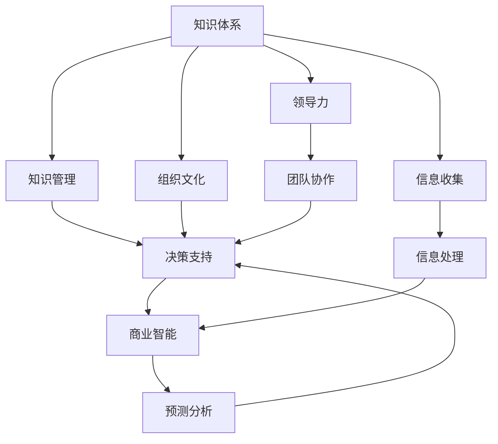

                 

# 经典著作:管理者构筑知识体系

> 关键词：知识体系构建,管理者,决策支持,组织文化,领导力,商业智能,知识管理

## 1. 背景介绍

### 1.1 问题由来
在当前快速变化和复杂多变的商业环境中，企业面临着前所未有的挑战，包括市场竞争加剧、客户需求变化、技术创新加速等。如何帮助管理者构建有效的知识体系，提升决策支持能力，成为企业数字化转型的重要课题。

管理者在企业的日常运营中扮演着核心角色，其决策直接影响着企业的发展方向和竞争力。然而，由于信息过载和知识碎片化，管理者在面对复杂问题时，往往难以快速获取关键信息，形成有效的决策支撑。这就需要通过系统化的知识管理，帮助管理者构建全面的知识体系，提高信息处理和决策效率。

### 1.2 问题核心关键点
构建管理者知识体系的核心在于：
- **系统化**：构建全面的、结构化的知识体系，将零散的知识碎片整合为系统化的结构。
- **结构化**：通过分类、分层、关联等手段，使知识体系具备清晰的层次和结构，易于理解和应用。
- **应用化**：将知识体系转化为具体的业务指导和操作方案，为管理者的决策提供支持。
- **动态化**：知识体系应随时间和环境变化而动态更新，保持其时效性和相关性。
- **普适性**：构建的知识体系应具备普适性，能广泛适用于各类管理场景和问题。

本文将深入探讨如何通过系统化的知识管理，帮助管理者构筑全面的知识体系，提升其决策支持能力。

## 2. 核心概念与联系

### 2.1 核心概念概述

构建管理者知识体系需要围绕几个核心概念展开，包括：
- **知识体系(Knowledge System)**：通过系统化的方式，将知识进行分类、整理、关联，构建起全面的知识结构。
- **知识管理(Knowledge Management)**：通过技术和管理手段，促进知识的获取、组织、共享和应用。
- **决策支持(Decision Support)**：利用知识体系和商业智能工具，帮助管理者进行决策分析，提升决策效率和准确性。
- **组织文化(Organizational Culture)**：企业的知识管理体系应与企业文化相结合，促进知识共享和应用，提升团队协作和创新能力。
- **领导力(Leadership)**：管理者在知识体系构建中应发挥领导作用，引导团队学习和知识应用，形成良好的知识管理氛围。

这些概念之间的关系可以通过以下Mermaid流程图来展示：



这个流程图展示了知识体系构建的核心流程和相关概念的关系：

1. 知识体系构建基于组织文化，由领导力引导。
2. 知识管理体系包括信息收集和处理，通过技术手段支持。
3. 决策支持系统利用知识体系和商业智能进行预测和分析，辅助管理者决策。
4. 团队协作和领导力是知识体系构建和应用的关键要素。

## 3. 核心算法原理 & 具体操作步骤

### 3.1 算法原理概述

构建管理者知识体系的核心算法是**知识分类与组织**，其基本思想是通过分类、分层、关联等手段，将零散的知识碎片整合为系统化的结构。主要步骤包括：

1. **信息收集**：从内外部环境中收集各类知识，包括文档、数据、经验等。
2. **知识分类**：对收集到的知识进行分类，如战略知识、流程知识、操作知识等。
3. **知识分层**：对分类后的知识进行分层，如基本知识、中级知识、高级知识等。
4. **知识关联**：通过关联技术，将不同类别的知识进行连接，形成知识网络。
5. **知识整合**：将分类、分层、关联后的知识进行整合，构建起全面的知识体系。

### 3.2 算法步骤详解

构建管理者知识体系的具体步骤如下：

**Step 1: 信息收集**
- 定义知识收集的范围和渠道，确保覆盖全面且准确。
- 设计知识收集工具，如问卷调查、数据爬虫、专家访谈等。

**Step 2: 知识分类**
- 根据业务领域和专业内容，定义知识分类标准和维度。
- 对收集到的知识进行分类，形成知识目录。

**Step 3: 知识分层**
- 确定知识层级结构，如基本知识、中级知识、高级知识等。
- 对分类后的知识进行分层，形成知识层次结构。

**Step 4: 知识关联**
- 引入知识关联技术，如语义网、本体图等，将不同类别的知识进行连接。
- 构建知识网络，促进知识的共享和应用。

**Step 5: 知识整合**
- 对分类、分层、关联后的知识进行整合，构建起全面的知识体系。
- 将知识体系转化为具体的业务指导和操作方案，为管理者的决策提供支持。

### 3.3 算法优缺点

知识体系构建的算法具有以下优点：
1. **系统化**：构建全面的、结构化的知识体系，便于管理者获取和应用。
2. **结构化**：通过分类、分层、关联等手段，使知识体系具备清晰的层次和结构，易于理解和应用。
3. **应用化**：将知识体系转化为具体的业务指导和操作方案，为管理者的决策提供支持。
4. **动态化**：知识体系应随时间和环境变化而动态更新，保持其时效性和相关性。

同时，该算法也存在以下局限性：
1. **复杂度**：构建知识体系需要大量的时间和资源投入，且需反复迭代优化。
2. **适用性**：不同行业的知识体系构建方法可能有所不同，需要根据行业特点进行定制。
3. **技术要求**：需要引入高级技术手段，如语义网、本体图等，对技术要求较高。
4. **维护成本**：知识体系需定期维护和更新，否则可能失去其时效性和相关性。

### 3.4 算法应用领域

知识体系构建的算法主要应用于以下几个领域：

1. **企业知识管理**：帮助企业构建全面的知识体系，提升知识共享和应用能力。
2. **决策支持系统**：通过知识体系和商业智能工具，辅助管理者进行决策分析，提升决策效率和准确性。
3. **组织文化建设**：将知识管理体系与企业文化相结合，促进知识共享和应用，提升团队协作和创新能力。
4. **领导力发展**：通过知识体系构建和应用，提升管理者的领导力和决策能力。
5. **商业智能**：利用知识体系和商业智能技术，进行数据挖掘和预测分析，提供业务洞察。

## 4. 数学模型和公式 & 详细讲解 & 举例说明

### 4.1 数学模型构建

构建管理者知识体系的主要数学模型包括：

1. **知识分类模型**：通过层次聚类等技术，对知识进行分类和分层。
2. **知识关联模型**：通过图模型或语义网模型，构建知识之间的关联关系。
3. **知识整合模型**：通过数据融合技术，将分类、分层、关联后的知识进行整合。

### 4.2 公式推导过程

以知识分类模型为例，假设知识集合为 $K$，分类的维度为 $D$，知识分类函数为 $f$，则知识分类模型可以表示为：

$$
\text{分类结果} = f(K, D)
$$

其中，$f$ 为分类函数，可以通过层次聚类、K-means等算法实现。例如，层次聚类的公式为：

$$
\text{分类结果} = \text{层次聚类}(K, D)
$$

### 4.3 案例分析与讲解

以企业知识管理为例，假设某企业需要构建知识体系以支持其决策支持系统。具体步骤如下：

**Step 1: 信息收集**
- 定义知识收集的范围和渠道，如业务文档、员工经验、市场调研等。
- 设计知识收集工具，如问卷调查、数据爬虫、专家访谈等。

**Step 2: 知识分类**
- 根据业务领域和专业内容，定义知识分类标准和维度，如战略知识、流程知识、操作知识等。
- 对收集到的知识进行分类，形成知识目录。

**Step 3: 知识分层**
- 确定知识层级结构，如基本知识、中级知识、高级知识等。
- 对分类后的知识进行分层，形成知识层次结构。

**Step 4: 知识关联**
- 引入知识关联技术，如语义网、本体图等，将不同类别的知识进行连接。
- 构建知识网络，促进知识的共享和应用。

**Step 5: 知识整合**
- 对分类、分层、关联后的知识进行整合，构建起全面的知识体系。
- 将知识体系转化为具体的业务指导和操作方案，为管理者的决策提供支持。

## 5. 项目实践：代码实例和详细解释说明

### 5.1 开发环境搭建

构建管理者知识体系需要涉及多个技术栈，包括知识管理工具、数据处理工具、自然语言处理工具等。以下是开发环境的搭建步骤：

1. **安装知识管理工具**：如Confluence、SharePoint等，用于知识文档的存储和管理。
2. **安装数据处理工具**：如Python、R等，用于数据收集和处理。
3. **安装自然语言处理工具**：如NLTK、SpaCy等，用于文本数据的分类和关联。
4. **安装商业智能工具**：如Tableau、Power BI等，用于数据可视化和决策支持。

### 5.2 源代码详细实现

以构建企业知识体系为例，以下是使用Python进行知识管理的代码实现：

```python
from sklearn.cluster import KMeans
from sklearn.feature_extraction.text import TfidfVectorizer
import pandas as pd

# 定义知识集合
knowledge = [
    "公司战略", "流程管理", "客户服务", "市场分析", "产品开发"
]

# 定义知识分类维度
dim = ["战略", "流程", "操作"]

# 定义知识分类函数
def classify(k, d):
    # 使用K-means进行层次聚类
    vectorizer = TfidfVectorizer()
    X = vectorizer.fit_transform(k)
    kmeans = KMeans(n_clusters=len(d))
    kmeans.fit(X)
    result = []
    for i, doc in enumerate(k):
        cluster = kmeans.predict([vectorizer.transform([doc])])[0]
        result.append(d[cluster])
    return result

# 对知识进行分类
classified_knowledge = classify(knowledge, dim)

# 输出分类结果
print(classified_knowledge)
```

### 5.3 代码解读与分析

上述代码主要使用了K-means聚类算法进行知识分类。通过将知识文本转换为TF-IDF向量，然后应用K-means算法进行聚类，得到每个知识的分类结果。该方法简单易懂，适用于初步的知识分类需求。

## 6. 实际应用场景

### 6.1 企业决策支持系统

通过构建全面的知识体系，企业决策支持系统可以更准确地提供业务洞察和决策支持。例如，某公司通过构建知识体系，可以快速获取市场需求、产品开发、客户服务等关键信息，辅助高层管理者的决策。

**案例分析**：某科技公司构建了全面的知识体系，涵盖战略知识、流程知识、操作知识等。通过引入商业智能工具，对知识体系进行数据挖掘和预测分析，生成业务洞察报告，帮助高层管理者进行市场分析和产品规划。

### 6.2 知识管理平台

知识管理平台通过构建全面的知识体系，帮助企业实现知识的共享和应用。例如，某制造企业通过构建知识体系，实现了跨部门的知识共享，提高了工作效率和创新能力。

**案例分析**：某制造企业构建了知识管理体系，通过知识分类和分层，将知识分为战略、流程、操作三类。然后，将知识体系整合到知识管理平台，实现了跨部门的协作和知识共享。员工可以在平台上快速查找和应用知识，提升了工作效率和创新能力。

### 6.3 组织文化建设

知识管理体系的构建和应用，可以提升企业文化的建设和传播。例如，某公司通过构建知识体系，推广了企业价值观和文化理念，提高了员工的工作积极性和团队协作能力。

**案例分析**：某公司构建了知识管理体系，通过知识分类和关联，将企业文化、价值观、行为规范等知识进行整合。然后，通过知识共享平台，将知识传递给员工，提高了员工对企业文化的认同和遵循。

## 7. 工具和资源推荐

### 7.1 学习资源推荐

为了帮助管理者系统掌握知识体系构建的理论基础和实践技巧，这里推荐一些优质的学习资源：

1. **《知识管理与组织变革》**：该书详细介绍了知识管理的基本概念、方法和实践，是知识管理的经典之作。
2. **《组织文化与领导力》**：该书探讨了组织文化对知识管理的影响，以及如何通过文化建设提升知识共享和应用。
3. **《商业智能与决策支持系统》**：该书介绍了商业智能的基本概念、技术和应用，是商业智能领域的权威指南。
4. **《企业知识管理实践》**：该书提供了大量企业知识管理的成功案例和实践经验，具有很高的实战价值。
5. **《自然语言处理与信息检索》**：该书介绍了自然语言处理的基本原理和应用，对知识分类的技术支持有重要参考价值。

通过这些资源的学习实践，相信管理者能够快速掌握知识体系构建的理论基础和实践技巧，提升其决策支持能力。

### 7.2 开发工具推荐

高效的开发离不开优秀的工具支持。以下是几款用于知识体系构建的常用工具：

1. **Confluence**：Atlassian公司推出的知识管理工具，支持文档的存储和管理，具有强大的协作和搜索功能。
2. **SharePoint**：Microsoft推出的知识管理平台，支持文档、文件、邮件等多种数据类型，具备强大的数据管理和搜索功能。
3. **Tableau**：Tableau公司推出的商业智能工具，支持数据可视化、分析和决策支持。
4. **Power BI**：Microsoft推出的商业智能工具，支持数据可视化、分析和决策支持，具备强大的数据集成和处理能力。
5. **NLTK**：自然语言处理工具包，提供了丰富的文本处理和分析功能。
6. **SpaCy**：自然语言处理工具包，支持文本分类、实体识别、依存句法分析等功能。

合理利用这些工具，可以显著提升知识体系构建的开发效率，加快创新迭代的步伐。

### 7.3 相关论文推荐

知识体系构建和管理的理论研究已经取得许多重要成果，以下是几篇奠基性的相关论文，推荐阅读：

1. **Knowledge Sharing and Organizational Performance**：该文探讨了知识共享对组织绩效的影响，是知识管理领域的重要文献。
2. **Organizational Knowledge Management: A Review**：该文综述了知识管理的研究进展，对知识管理实践有重要参考价值。
3. **A Framework for Knowledge Management in Organizations**：该文提出了知识管理的框架，为知识管理体系的构建提供了理论指导。
4. **Decision Support Systems for Organizations**：该文介绍了决策支持系统在组织中的应用，是商业智能领域的经典文献。
5. **Semantic Web for Knowledge Management**：该文探讨了语义网在知识管理中的应用，提供了知识关联的技术支持。

这些论文代表了大规模知识管理理论的发展脉络。通过学习这些前沿成果，可以帮助管理者把握学科前进方向，激发更多的创新灵感。

## 8. 总结：未来发展趋势与挑战

### 8.1 总结

本文对管理者知识体系构建的理论基础和实践技巧进行了全面系统的介绍。首先阐述了知识体系构建的背景和意义，明确了知识体系构建在提升决策支持能力方面的重要作用。其次，从原理到实践，详细讲解了知识体系构建的数学模型和具体操作步骤，给出了知识体系构建的完整代码实例。同时，本文还探讨了知识体系在企业决策支持、知识管理平台、组织文化建设等实际应用场景中的应用前景，展示了知识体系构建的广阔前景。

通过本文的系统梳理，可以看到，知识体系构建是提升管理者决策支持能力的重要手段，在企业数字化转型中具有重要意义。未来，伴随知识管理体系的不断发展，知识体系的普适性和动态化将进一步提升，为管理者的决策提供更强大的支持。

### 8.2 未来发展趋势

展望未来，知识体系构建将呈现以下几个发展趋势：

1. **普适性**：知识管理体系将更加普适，适用于各类管理场景和问题。
2. **动态化**：知识体系将更加动态化，能够实时更新和扩展。
3. **智能化**：知识管理体系将引入人工智能技术，实现知识自动分类和关联。
4. **可视化**：知识体系将更加可视化，提供丰富的图形和图表展示。
5. **移动化**：知识管理体系将更加移动化，支持随时随地的知识获取和应用。

这些趋势将推动知识管理体系的发展，提升管理者的决策效率和效果。

### 8.3 面临的挑战

尽管知识体系构建已经取得了不少进展，但在迈向更加智能化、普适化应用的过程中，仍面临以下挑战：

1. **知识碎片化**：在知识收集和整理过程中，如何有效整合分散的知识，构建起系统化的知识体系。
2. **技术复杂度**：知识管理体系的构建和维护需要引入高级技术手段，对技术要求较高。
3. **文化冲突**：知识管理体系的推广和应用需要与企业文化相结合，需要解决文化冲突问题。
4. **资源投入**：知识管理体系的构建和维护需要大量的时间、人力和资金投入。
5. **数据安全**：知识体系中的敏感数据需要得到妥善保护，避免信息泄露和滥用。

这些挑战需要通过系统化的解决方案和技术手段来解决，才能推动知识管理体系的普及和应用。

### 8.4 研究展望

面向未来，知识体系构建需要在以下几个方面进行进一步研究：

1. **智能化技术**：引入人工智能和机器学习技术，实现知识自动分类和关联，提升知识管理的效率和效果。
2. **普适性设计**：设计通用的知识管理体系框架，适应不同行业和场景的需求。
3. **文化融合**：将知识管理体系与企业文化相结合，促进知识共享和应用。
4. **移动化部署**：开发移动端知识管理应用，支持随时随地的知识获取和应用。
5. **数据安全**：设计数据安全机制，确保知识体系中的敏感数据得到妥善保护。

这些研究方向的探索，将推动知识管理体系的进一步发展，为管理者的决策提供更强大的支持。

## 9. 附录：常见问题与解答

**Q1：知识体系构建是否适用于所有类型的组织？**

A: 知识体系构建主要适用于具有一定规模和复杂度的组织，特别是需要协调和管理大量知识的企业。对于小型组织或个人，知识管理工具可以更加灵活应用，如简单的文档管理系统。

**Q2：知识体系构建是否需要引入高级技术手段？**

A: 知识体系构建需要引入高级技术手段，如自然语言处理、语义网等，以实现知识的自动分类和关联。但对于一些简单的知识管理需求，如文档存储和检索，可以直接使用现有的知识管理工具。

**Q3：知识体系构建的维护成本是否过高？**

A: 知识体系的构建和维护确实需要大量的时间和资源投入，但随着技术的进步，知识管理体系的维护成本正在逐渐降低。同时，通过系统化的管理，可以减少维护工作的复杂度和难度。

**Q4：如何确保知识体系中的数据安全？**

A: 知识体系中的敏感数据需要得到妥善保护，可以通过加密、权限控制等手段实现数据安全。同时，制定明确的数据安全政策和操作流程，提高员工的数据安全意识。

**Q5：知识体系构建的成果如何衡量？**

A: 知识体系构建的成果可以通过以下几个方面衡量：
- **知识共享率**：知识体系的共享率越高，说明知识管理的成效越好。
- **知识应用率**：知识体系的应用率越高，说明知识管理的效果越好。
- **决策支持效果**：通过知识体系提供的决策支持，管理者能够快速获取关键信息，提升决策效率和准确性。

通过这些指标，可以评估知识体系构建的成效，并进行持续优化和改进。

---

作者：禅与计算机程序设计艺术 / Zen and the Art of Computer Programming

