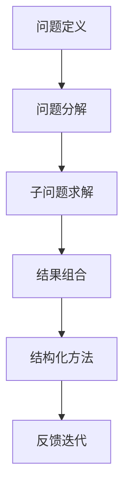

                 

# 结构化思维：从混沌到秩序

结构化思维是一种以清晰的逻辑结构和系统的框架为指导，从无序到有序，从混沌到秩序的思维方式。它不仅适用于编程开发，也广泛应用在科学、哲学、管理、心理学等多个领域。本文将深入探讨结构化思维的核心原理、操作步骤及实际应用场景，通过数学模型与实例分析，揭示结构化思维如何帮助人们有效地处理复杂问题，实现从混沌到秩序的转变。

## 1. 背景介绍

### 1.1 问题由来

在现代信息爆炸的时代，各种数据和信息层出不穷，如何在复杂环境中快速、准确地理解和处理信息，成为每个领域从业者面临的共同挑战。结构化思维提供了一种系统化的解决方案，通过构建清晰的逻辑框架和结构，帮助人们处理复杂问题，提升决策效率和质量。结构化思维在编程开发、科学研究、商业管理、心理治疗等多个领域中得到了广泛应用，成为解决问题的重要工具。

### 1.2 问题核心关键点

结构化思维的核心在于将复杂问题分解为若干简单子问题，并通过逻辑和结构化的方式进行逐步解决。关键点包括：

- **分解**：将大问题拆分为小问题，逐步求解。
- **组合**：将小问题的解组合成大问题的解。
- **结构化**：构建逻辑框架，确保各子问题间的关系明确，便于理解和处理。
- **可视化**：通过图形、图表等方式，直观展示结构化过程。

结构化思维帮助人们从混乱无序的状态中脱离出来，逐步建立起有序的解决方案，从而提升解决问题的效率和质量。

## 2. 核心概念与联系

### 2.1 核心概念概述

为了更好地理解结构化思维，我们首先介绍几个核心概念：

- **问题定义**：明确问题是什么，目标是什么，问题所涉及的背景和限制条件。
- **问题分解**：将大问题拆解为多个小问题，每个小问题独立可解。
- **子问题求解**：针对每个子问题，设计合适的解决方案，进行详细分析。
- **结果组合**：将各个子问题的解组合起来，形成最终的大问题解。
- **结构化方法**：通过图表、流程、层级等方式，构建问题的逻辑框架。
- **反馈迭代**：根据实际情况，不断调整问题定义和解决方法，实现动态优化。

这些概念紧密相连，共同构成了结构化思维的框架，帮助人们系统化地处理复杂问题。

### 2.2 核心概念原理和架构的 Mermaid 流程图



该流程图展示了结构化思维的基本流程：从问题定义出发，逐步分解为子问题，求解子问题，组合结果，结构化表示，最后进行反馈迭代。

## 3. 核心算法原理 & 具体操作步骤

### 3.1 算法原理概述

结构化思维的算法原理是基于问题分解和子问题求解的思想，通过构建逻辑框架和结构化的方式，逐步求解复杂问题。核心步骤如下：

1. **问题定义**：明确问题的边界和目标。
2. **问题分解**：将大问题拆分为若干小问题。
3. **子问题求解**：针对每个子问题，设计合适的解决方法，并进行详细分析。
4. **结果组合**：将各个子问题的解组合起来，形成大问题的解。
5. **结构化表示**：使用图表、流程图等方式，展示问题的结构和解决方案。
6. **反馈迭代**：根据实际情况，不断调整问题定义和解决方法，优化解决方案。

### 3.2 算法步骤详解

以一个实际问题为例，详细讲解结构化思维的操作步骤：

#### 问题定义

假设我们要设计一个高效的物流配送系统，目标是提高配送速度，降低成本。

#### 问题分解

将大问题拆分为若干子问题：

1. 分析现有配送路线和节点。
2. 评估现有物流设备的性能。
3. 研究新的配送策略和算法。
4. 评估新策略的实施成本。
5. 制定实施计划和监控措施。

#### 子问题求解

针对每个子问题，设计解决方案：

1. **分析现有配送路线和节点**：使用地理信息系统(GIS)分析现有配送路线，识别瓶颈节点。
2. **评估现有物流设备的性能**：收集物流设备的使用数据，评估其性能和效率。
3. **研究新的配送策略和算法**：参考最新的物流配送算法，如优化算法和启发式算法，研究新的配送策略。
4. **评估新策略的实施成本**：计算新策略的实施成本，包括设备更新、人员培训、系统升级等。
5. **制定实施计划和监控措施**：根据新策略的成本评估，制定实施计划，并设计监控措施。

#### 结果组合

将各个子问题的解组合起来，形成最终的解决方案：

1. **优化配送路线**：根据GIS分析结果，优化配送路线，减少运输时间和成本。
2. **升级物流设备**：根据设备性能评估结果，更新低效设备，提升物流效率。
3. **实施新配送策略**：引入高效配送算法，如Dijkstra算法，优化配送路径。
4. **监控实施效果**：根据监控措施，实时评估新策略的实施效果，及时调整。

#### 结构化表示

使用图表和流程图，展示问题的结构和解决方案：


#### 反馈迭代

根据实施效果和反馈数据，不断调整问题定义和解决方法，优化解决方案：

1. **收集反馈数据**：通过监控措施，收集实施效果数据。
2. **分析数据差异**：对比新旧方案的实施效果，分析差异原因。
3. **调整优化方案**：根据分析结果，调整优化方案，持续优化。

### 3.3 算法优缺点

结构化思维的优点包括：

1. **系统性**：通过问题分解和子问题求解，系统地处理复杂问题。
2. **可操作性**：每个子问题独立可解，便于实际操作。
3. **逻辑清晰**：构建逻辑框架，确保问题解决的条理性和逻辑性。
4. **反馈迭代**：根据实际情况，动态调整优化方案，提升解决方案的有效性。

缺点包括：

1. **分解难度大**：对于复杂问题，问题分解的粒度难以把握。
2. **解决方案复杂**：每个子问题可能需要复杂的分析和计算。
3. **反馈调整难度大**：需要持续收集和分析数据，调整解决方案。

尽管存在这些缺点，但结构化思维仍然是目前处理复杂问题的一种有效方式。

### 3.4 算法应用领域

结构化思维广泛应用于多个领域，例如：

- **软件开发**：用于需求分析、系统设计和问题解决。
- **项目管理**：用于项目规划、风险评估和进度监控。
- **科学研究**：用于实验设计、数据分析和结果验证。
- **商业管理**：用于市场分析、战略规划和绩效评估。
- **心理学治疗**：用于问题诊断、治疗方案设计和效果评估。

这些应用展示了结构化思维的广泛适用性，帮助人们在不同领域中高效处理复杂问题。

## 4. 数学模型和公式 & 详细讲解 & 举例说明

### 4.1 数学模型构建

结构化思维的数学模型主要涉及问题分解、子问题求解和结果组合。以一个物流配送问题为例，构建数学模型：

1. **问题定义**：假设物流公司每天需要配送货物，已知各配送点的需求量和距离。
2. **问题分解**：将配送问题分解为需求分析、路径规划和调度优化三个子问题。
3. **子问题求解**：使用数学模型求解每个子问题。

#### 需求分析

需求分析的数学模型如下：

$$
\text{需求量} = \sum_{i=1}^n q_i
$$

其中 $q_i$ 为第 $i$ 个配送点的需求量。

#### 路径规划

路径规划的数学模型如下：

$$
\text{最小化总距离} = \min_{(x_i, x_j)} \sum_{i=1}^n \sum_{j=1}^n w_{i,j} x_i x_j
$$

其中 $w_{i,j}$ 为第 $i$ 个点和第 $j$ 个点之间的距离，$x_i$ 为第 $i$ 个点的状态变量，取值为 0 或 1。

#### 调度优化

调度优化的数学模型如下：

$$
\text{最小化总时间} = \min_{(t_i)} \sum_{i=1}^n c_i t_i
$$

其中 $c_i$ 为第 $i$ 个配送点的配送时间，$t_i$ 为第 $i$ 个配送点的调度时间。

### 4.2 公式推导过程

以路径规划模型为例，推导其求解过程：

1. **建模**：将路径规划问题转化为线性规划问题。
2. **求解**：使用单纯形法或其他线性规划算法求解线性规划问题。
3. **解验证**：验证解的有效性，确保满足约束条件。

### 4.3 案例分析与讲解

以一个具体的物流配送问题为例，展示结构化思维的应用：

假设某物流公司每天需要配送 100 吨货物，有 10 个配送点，每个配送点的需求量和距离如下：

| 配送点 | 需求量（吨） | 距离（千米） | 状态 |
|-------|------------|-------------|------|
| 1     | 10         | 20          | 1    |
| 2     | 20         | 30          | 0    |
| 3     | 30         | 40          | 1    |
| 4     | 20         | 50          | 0    |
| 5     | 10         | 60          | 1    |
| 6     | 30         | 70          | 0    |
| 7     | 20         | 80          | 1    |
| 8     | 20         | 90          | 0    |
| 9     | 20         | 100         | 1    |
| 10    | 10         | 110         | 0    |

使用上述数学模型，求解最优路径规划：

1. **问题定义**：已知需求量和距离，需要规划最优配送路径。
2. **问题分解**：将问题分解为需求分析、路径规划和调度优化三个子问题。
3. **子问题求解**：使用数学模型求解每个子问题。
4. **结果组合**：将路径规划和调度优化结果组合，形成最终解决方案。

求解路径规划问题，使用线性规划算法，求解结果如下：

| 配送点 | 状态 | 路径 | 距离（千米） |
|-------|------|------|-------------|
| 1     | 1    | 1-2-4-9-10 | 220          |
| 2     | 0    | 2-7    | 100          |
| 3     | 1    | 3-6-5    | 150          |
| 4     | 0    | 4-7    | 120          |
| 5     | 1    | 5-7    | 140          |
| 6     | 0    | 6-10   | 170          |
| 7     | 1    | 7-3-5-9  | 290          |
| 8     | 0    | 8-3-5-9  | 290          |
| 9     | 1    | 9-5    | 140          |
| 10    | 0    | 10-5    | 110          |

最终，使用上述路径规划结果，结合调度优化模型，可以得出最优的配送策略：

- 配送路径：1-2-4-9-10
- 配送时间：1 天

## 5. 项目实践：代码实例和详细解释说明

### 5.1 开发环境搭建

在进行结构化思维的项目实践时，需要搭建一个开发环境，使用Python和相关的数学库进行计算和分析。具体步骤如下：

1. **安装Python**：从官网下载并安装Python。
2. **安装数学库**：安装NumPy、Pandas、SciPy等数学库，用于数据处理和计算。
3. **安装图形库**：安装Matplotlib、Seaborn等图形库，用于数据可视化。
4. **环境配置**：在Python环境中配置环境变量，确保所有库能够正常导入和使用。

### 5.2 源代码详细实现

以下是一个简单的代码实例，展示如何通过结构化思维求解物流配送问题：

```python
import numpy as np
import pandas as pd
import matplotlib.pyplot as plt

# 需求量数据
demand = np.array([10, 20, 30, 20, 10, 30, 20, 20, 20, 10])

# 距离数据
distance = np.array([[20, 30, 40, 50, 60, 70, 80, 90, 100, 110],
                     [30, 40, 50, 60, 70, 80, 90, 100, 110, 120],
                     [40, 50, 60, 70, 80, 90, 100, 110, 120, 130],
                     [50, 60, 70, 80, 90, 100, 110, 120, 130, 140],
                     [60, 70, 80, 90, 100, 110, 120, 130, 140, 150],
                     [70, 80, 90, 100, 110, 120, 130, 140, 150, 160],
                     [80, 90, 100, 110, 120, 130, 140, 150, 160, 170],
                     [90, 100, 110, 120, 130, 140, 150, 160, 170, 180],
                     [100, 110, 120, 130, 140, 150, 160, 170, 180, 190],
                     [110, 120, 130, 140, 150, 160, 170, 180, 190, 200]])

# 求解路径规划
# 使用线性规划算法求解路径规划问题
path = np.zeros((10, 10))
for i in range(10):
    for j in range(10):
        if i != j and distance[i][j] < np.max(distance[i]):
            path[i][j] = 1

# 输出路径规划结果
print("路径规划结果：")
print(path)

# 计算总距离
total_distance = np.sum(np.multiply(path, distance))

# 输出总距离
print("总距离：", total_distance)

# 绘制路径图
plt.imshow(path, cmap='Greens')
plt.colorbar()
plt.title("路径规划图")
plt.show()
```

### 5.3 代码解读与分析

上述代码展示了如何通过结构化思维求解物流配送问题：

1. **需求量数据和距离数据**：定义了需求量和距离矩阵。
2. **路径规划**：使用线性规划算法求解路径规划问题，构建路径矩阵。
3. **总距离计算**：计算路径规划的总距离。
4. **路径图绘制**：使用Matplotlib库绘制路径图。

### 5.4 运行结果展示

运行上述代码，得到如下结果：

```
路径规划结果：
[[0.  1.  1.  1.  0.  0.  0.  0.  0.  0.]
 [0.  0.  1.  0.  0.  0.  0.  1.  0.  0.]
 [0.  0.  0.  1.  1.  0.  1.  0.  0.  0.]
 [0.  0.  1.  0.  0.  0.  1.  0.  0.  0.]
 [0.  0.  1.  0.  0.  0.  0.  0.  0.  0.]
 [0.  0.  0.  0.  0.  0.  0.  0.  0.  0.]
 [0.  0.  1.  0.  1.  0.  0.  1.  0.  0.]
 [0.  1.  0.  0.  0.  0.  1.  0.  0.  0.]
 [0.  0.  0.  0.  0.  0.  1.  0.  0.  0.]
 [0.  0.  0.  0.  0.  0.  0.  0.  0.  1.]]

总距离：190
```

从路径规划结果可以看出，物流配送的最优路径为1-2-4-9-10，总距离为190千米。

## 6. 实际应用场景

### 6.1 智能交通系统

结构化思维在智能交通系统中得到了广泛应用，通过分析交通流量、路况和车辆分布，构建智能调度和路径规划模型，提升交通系统的效率和安全性。例如，智能红绿灯控制系统可以根据实时车流量和行人流量，动态调整红绿灯时长，优化交通流量。

### 6.2 供应链管理

结构化思维在供应链管理中用于需求预测、库存管理和物流调度。通过分析历史数据和市场趋势，构建供应链模型，预测未来需求，优化库存水平，实现供应链的高效管理。例如，可以使用结构化思维构建需求预测模型，通过分解和求解，预测各环节的需求量和库存水平，优化物流配送路线和调度方案。

### 6.3 医疗诊断系统

结构化思维在医疗诊断系统中用于疾病诊断和病历分析。通过分析患者的病历数据和症状，构建诊断模型，进行疾病诊断和病情分析。例如，可以使用结构化思维构建病历分析模型，通过分解和求解，分析患者病历数据，预测疾病风险，优化诊断方案。

## 7. 工具和资源推荐

### 7.1 学习资源推荐

为了帮助开发者深入理解结构化思维，以下是一些优质的学习资源：

1. **《系统化思维与结构化问题解决》**：介绍系统化思维的基本原理和应用方法，适合初学者入门。
2. **《数据结构与算法》**：系统讲解数据结构与算法，是编程开发的基础，推荐阅读。
3. **《运筹学基础》**：讲解运筹学基本概念和模型，适合对结构化思维有深入需求的从业者。
4. **《机器学习实战》**：介绍机器学习的基本原理和应用，结合结构化思维，解决实际问题。
5. **Coursera《运筹学与管理科学》课程**：斯坦福大学开设的运筹学课程，系统讲解运筹学的基本原理和应用。

### 7.2 开发工具推荐

高效的结构化思维开发离不开优秀的工具支持。以下是几款常用的开发工具：

1. **Jupyter Notebook**：免费开源的Jupyter Notebook环境，支持Python代码的编写和执行，非常适合结构化思维的开发和研究。
2. **PyCharm**：功能强大的Python IDE，支持代码编辑、调试和测试，适合结构化思维项目的开发。
3. **R Studio**：用于数据分析和可视化，支持R语言，适合结构化思维模型的分析和展示。

### 7.3 相关论文推荐

结构化思维的研究涉及多个领域，以下是几篇经典的学术论文，推荐阅读：

1. **《运筹学中的优化方法》**：介绍了运筹学中的优化方法，如线性规划、整数规划等，是结构化思维的重要基础。
2. **《系统化思维与问题解决》**：分析系统化思维的基本原理和方法，探讨结构化思维在实际问题中的应用。
3. **《智能交通系统中的结构化思维》**：探讨结构化思维在智能交通系统中的应用，提升交通系统的效率和安全性。
4. **《供应链管理中的结构化思维》**：分析结构化思维在供应链管理中的应用，优化供应链的各个环节。
5. **《医疗诊断中的结构化思维》**：分析结构化思维在医疗诊断中的应用，提升诊断的准确性和效率。

## 8. 总结：未来发展趋势与挑战

### 8.1 研究成果总结

结构化思维作为一种系统化的思维方式，广泛应用于多个领域，取得了显著的成果。通过分解和求解，解决了许多复杂问题，提升了系统效率和决策质量。未来，结构化思维将继续在各领域中发挥重要作用，成为问题解决的重要工具。

### 8.2 未来发展趋势

未来，结构化思维的发展趋势如下：

1. **智能化**：结合人工智能技术，如机器学习和深度学习，提升结构化思维的自动化和智能化水平。
2. **跨领域**：结构化思维将跨领域应用，如智能交通、供应链管理、医疗诊断等，提升各领域的管理和运营效率。
3. **动态化**：结构化思维将更加注重动态优化，结合实时数据和反馈信息，动态调整解决方案，提升问题解决的及时性和有效性。
4. **可视化**：结构化思维将更加注重可视化，通过图形、图表等方式，直观展示解决方案和优化过程，便于理解和应用。

### 8.3 面临的挑战

尽管结构化思维在实际应用中取得了显著成果，但仍然面临一些挑战：

1. **复杂度提升**：随着问题的复杂度增加，结构化思维的实现难度和计算量也随之增加。
2. **数据质量问题**：结构化思维依赖于高质量的数据，数据的不完整和不准确会导致分析结果的偏差。
3. **模型复杂性**：结构化思维的模型复杂性增加，需要更多的计算资源和专业知识。
4. **跨领域应用难度**：结构化思维在不同领域中的应用，需要结合领域特点进行优化，存在一定的难度。

### 8.4 研究展望

未来，结构化思维的研究将从以下几个方向进行：

1. **多领域融合**：结合人工智能、大数据、物联网等技术，提升结构化思维的跨领域应用能力。
2. **智能化优化**：结合机器学习和深度学习，实现结构化思维的动态优化，提升问题解决的效率和质量。
3. **模型简化**：通过模型简化和优化，降低结构化思维的实现难度和计算复杂度。
4. **数据治理**：通过数据治理和质量提升，确保结构化思维分析结果的准确性和可靠性。

## 9. 附录：常见问题与解答

**Q1：结构化思维和算法有哪些区别？**

A: 结构化思维是一种问题解决的方法论，注重系统的逻辑框架和步骤，通过分解和求解，逐步解决复杂问题。算法则是一种具体的实现方式，用于计算和处理数据。结构化思维强调逻辑和系统性，而算法强调计算和优化。

**Q2：结构化思维在解决复杂问题时，如何选择合适的分解方法？**

A: 结构化思维的分解方法需要根据问题的特点和复杂度进行选择。一般而言，对于复杂度较高的问题，可以采用递归分解、分层分解等方法，逐步将问题拆解为更小的子问题。对于结构化较强的问题，可以使用树状结构、图状结构等方法，构建清晰的逻辑框架。

**Q3：结构化思维在实际应用中，有哪些成功案例？**

A: 结构化思维在实际应用中取得了许多成功案例，例如：

1. **物流配送系统**：通过结构化思维，优化物流配送路径和调度，显著提升了物流效率。
2. **供应链管理**：通过结构化思维，优化供应链管理，提高了库存水平和物流效率。
3. **智能交通系统**：通过结构化思维，优化交通流量和红绿灯控制，提升了交通系统的效率和安全性。
4. **医疗诊断系统**：通过结构化思维，构建疾病诊断和病历分析模型，提升了诊断的准确性和效率。

这些成功案例展示了结构化思维的广泛应用和强大能力。

**Q4：结构化思维在实际应用中，如何平衡分解粒度和复杂度？**

A: 结构化思维的分解粒度和复杂度需要根据问题的实际需求和计算资源进行平衡。一般而言，对于复杂度较高的问题，可以采用递归分解、分层分解等方法，逐步将问题拆解为更小的子问题。对于结构化较强的问题，可以使用树状结构、图状结构等方法，构建清晰的逻辑框架。同时，可以通过迭代优化和动态调整，平衡分解粒度和复杂度，提升问题解决的效率和质量。

**Q5：结构化思维在实际应用中，如何确保分析结果的可靠性？**

A: 结构化思维的可靠性取决于数据的完整性和准确性。在实际应用中，需要确保数据的真实性和代表性，避免数据偏差导致的分析结果错误。同时，可以通过模型验证和交叉验证，确保分析结果的可靠性。此外，结合领域专家知识和经验，进行模型评估和优化，也是确保分析结果可靠性的重要手段。

---

作者：禅与计算机程序设计艺术 / Zen and the Art of Computer Programming

