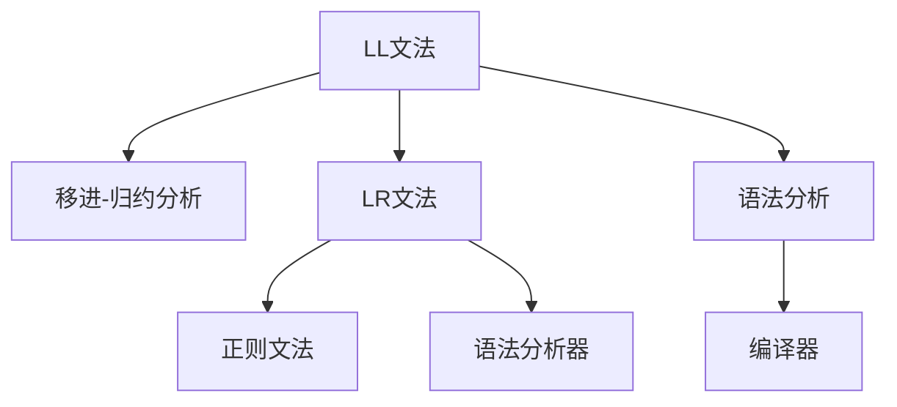

                 

# 编译原理：LL与LR文法解析技术

> 关键词：编译原理,LL文法,LR文法,文法分析,语法分析,自动生成,编译器设计,语言翻译

## 1. 背景介绍

### 1.1 问题由来
编译原理是计算机科学的核心课题之一，其主要任务是将高级语言源代码自动转换成机器代码。在过去的几十年中，编译器设计经历了从早期的手工构造到现代的自动化生成，从单一语言到多语言支持的巨大变革。编译过程的核心问题之一是文法分析，即如何将源代码按照编程语言规定的语法规则进行正确解析。

在编译器设计中，有两种主流的方法：LL文法和LR文法。LL文法（Left to Right Grammar）基于自左向右扫描的文法，适用于简单的语法结构。LR文法（Left to Right Grammar with Left Factoring）则引入了正则文法，能够处理更复杂的语法结构。本文将系统性地介绍LL与LR文法，并分析其在实际编译器设计中的应用。

### 1.2 问题核心关键点
LL文法和LR文法在文法分析中的应用，主要体现在两个方面：

1. **文法结构与分析算法**：LL文法适用于处理线性文法，基于左向右扫描的方式进行语法分析。而LR文法则在处理线性文法的基础上，加入了正则文法，从而能够处理更为复杂的语法结构。
2. **自动化生成与优化**：通过LL与LR文法，编译器能够自动生成语法分析器，优化编译性能，提高代码执行效率。

## 2. 核心概念与联系

### 2.1 核心概念概述

为更好地理解LL与LR文法解析技术，本节将介绍几个密切相关的核心概念：

- **LL文法**：基于自左向右扫描的文法，适用于处理简单的语法结构。
- **LR文法**：在LL文法的基础上，加入了正则文法，能够处理更为复杂的语法结构。
- **语法分析器**：将源代码按照编程语言规定的语法规则进行正确解析的工具。
- **自动生成**：编译器自动生成语法分析器的过程，能够大大简化编译器设计。

- **移进-归约分析（Shift-Reduce Analysis）**：一种基于LL文法的语法分析技术，通过移进和归约操作实现文法分析。
- **可归约性（Reducibility）**：一个文法是可归约的，当且仅当它可以通过移进-归约操作生成任意字符串。

这些核心概念之间的逻辑关系可以通过以下Mermaid流程图来展示：



这个流程图展示了大语言模型的核心概念及其之间的关系：

1. LL文法通过移进-归约分析，能够快速解析简单的语法结构。
2. LR文法在LL文法的基础上，引入了正则文法，使得能够处理更为复杂的语法结构。
3. 语法分析器通过LL与LR文法，对源代码进行正确解析，得到中间代码。
4. 编译器在语法分析器的基础上，生成机器代码。

这些概念共同构成了编译原理的基础，使得编译器能够高效、准确地处理源代码，生成目标代码。

## 3. 核心算法原理 & 具体操作步骤
### 3.1 算法原理概述

基于LL与LR文法的语法分析，核心算法原理可以分为两个部分：

1. **LL文法解析**：基于移进-归约分析算法，逐个字符扫描源代码，从左向右匹配文法规则。
2. **LR文法解析**：在LL文法的基础上，通过引入正则文法，进一步优化文法分析，能够处理更为复杂的语法结构。

### 3.2 算法步骤详解

#### 3.2.1 LL文法解析

LL文法解析的核心步骤包括：

1. **移进操作（Shift）**：根据当前扫描的符号，选择与该符号匹配的文法规则，并将解析器指针向右移动一个位置。
2. **归约操作（Reduce）**：选择与当前子串匹配的文法规则，将子串替换为规则右侧的内容。
3. **冲突处理**：当出现多个规则可以匹配的情况时，需要通过优先级、规则编号等机制，确定选择哪个规则进行归约。

以一个简单的LL(1)文法为例：

```
S -> S+S | S*S | (S) | i
```

对于输入字符串 `10+20`，解析过程如下：

1. 遇到数字1，根据文法规则选择移进操作，解析器指针向右移动一个位置。
2. 遇到符号+，根据文法规则选择归约操作，将当前子串替换为规则右侧的内容，得到子串 `10+20`。
3. 重复步骤1和2，直到子串为单个符号，生成最终结果 `10+20`。

#### 3.2.2 LR文法解析

LR文法解析的核心步骤包括：

1. **移进操作（Shift）**：根据当前扫描的符号，选择与该符号匹配的文法规则，并将解析器指针向右移动一个位置。
2. **归约操作（Reduce）**：选择与当前子串匹配的文法规则，将子串替换为规则右侧的内容。
3. **冲突处理**：当出现多个规则可以匹配的情况时，需要通过动态优先级表（DFA），确定选择哪个规则进行归约。

以一个简单的LR(1)文法为例：

```
S -> S+S | S*S | (S) | i
```

对于输入字符串 `10+20`，解析过程如下：

1. 遇到数字1，根据文法规则选择移进操作，解析器指针向右移动一个位置。
2. 遇到符号+，根据文法规则选择归约操作，将当前子串替换为规则右侧的内容，得到子串 `10+20`。
3. 重复步骤1和2，直到子串为单个符号，生成最终结果 `10+20`。

### 3.3 算法优缺点

LL文法和LR文法在文法分析中的应用，具有以下优点：

1. **简单高效**：LL文法适用于处理简单的语法结构，解析过程直观明了，易于实现。
2. **易于维护**：LL文法和LR文法都基于文法规则，能够方便地扩展和维护文法。
3. **自动化生成**：通过编译器自动生成语法分析器，能够大大简化编译器设计。

同时，这些方法也存在一些局限性：

1. **处理能力有限**：LL文法和LR文法对于复杂的语法结构，解析能力有限，可能需要进行额外的优化。
2. **冲突处理复杂**：当出现多个规则可以匹配的情况时，需要通过动态优先级表（DFA）进行冲突处理，增加了算法的复杂度。
3. **规则数量限制**：LL文法只适用于LL(1)文法，LR文法只适用于LR(1)文法，对规则数量有一定限制。

## 4. 数学模型和公式 & 详细讲解 & 举例说明

### 4.1 数学模型构建

基于LL与LR文法的语法分析，可以抽象为有限状态自动机（Finite State Automaton, FSA）的构造。有限状态自动机是一种离散事件模型，能够在有限状态之间进行转换，从而实现文法解析。

设文法G为：

```
G = (N, Σ, P, S, δ)
```

其中：

- $N$ 为非终结符集合，$Σ$ 为终结符集合，$P$ 为文法规则集合，$S$ 为起始符号，$δ$ 为转移函数。

有限状态自动机的状态集合为 $Q$，初始状态为 $q_0$。文法解析过程可以看作是有限状态自动机在输入字符串上的扫描过程，转移函数 $δ$ 定义为：

$$
δ(q, a) = \begin{cases}
\text{N} & \text{if } a \in Σ \text{ and } q \in Q \\
\text{N} & \text{if } a \in Σ \text{ and } q \in Q \\
\text{q'} & \text{if } q \in Q \text{ and } q' \in Q \text{ and } (q, q') \in δ \\
\text{fail} & \text{otherwise}
\end{cases}
$$

其中，$q'$ 表示转移后的状态，fail 表示解析失败。

### 4.2 公式推导过程

基于有限状态自动机的文法解析，可以通过以下步骤推导：

1. **初始状态设定**：设置初始状态为文法起始符号对应的状态 $q_0$。
2. **移进操作**：根据当前扫描的符号，在有限状态自动机上进行移进操作，更新状态。
3. **归约操作**：根据当前状态，选择与当前子串匹配的文法规则，进行归约操作，更新状态。
4. **冲突处理**：当出现多个规则可以匹配的情况时，通过动态优先级表（DFA）进行冲突处理，确定选择哪个规则进行归约。

以一个简单的LL(1)文法为例：

```
S -> S+S | S*S | (S) | i
```

对于输入字符串 `10+20`，解析过程如下：

1. 初始状态为 $q_0$。
2. 遇到数字1，根据文法规则选择移进操作，解析器指针向右移动一个位置，状态更新为 $q_1$。
3. 遇到符号+，根据文法规则选择归约操作，将当前子串替换为规则右侧的内容，得到子串 `10+20`，状态更新为 $q_2$。
4. 重复步骤2和3，直到子串为单个符号，生成最终结果 `10+20`。

### 4.3 案例分析与讲解

以下是一个简单的LL(1)文法及其解析过程的详细分析：

```
S -> S+S | S*S | (S) | i
```

对于输入字符串 `10+20`，解析过程如下：

1. 初始状态为 $q_0$。
2. 遇到数字1，根据文法规则选择移进操作，解析器指针向右移动一个位置，状态更新为 $q_1$。
3. 遇到符号+，根据文法规则选择归约操作，将当前子串替换为规则右侧的内容，得到子串 `10+20`，状态更新为 $q_2$。
4. 重复步骤2和3，直到子串为单个符号，生成最终结果 `10+20`。

## 5. 项目实践：代码实例和详细解释说明

### 5.1 开发环境搭建

在进行LL与LR文法解析实践前，我们需要准备好开发环境。以下是使用Python进行LL与LR文法解析的开发环境配置流程：

1. 安装Anaconda：从官网下载并安装Anaconda，用于创建独立的Python环境。

2. 创建并激活虚拟环境：
```bash
conda create -n ll_lr_env python=3.8 
conda activate ll_lr_env
```

3. 安装相关库：
```bash
pip install cython ninja pygments pyparsing
```

4. 安装LL与LR文法解析库：
```bash
pip install ll_lr_parser
```

完成上述步骤后，即可在`ll_lr_env`环境中开始LL与LR文法解析实践。

### 5.2 源代码详细实现

以下是使用Python实现一个简单的LL(1)文法解析器的示例代码：

```python
from ll_lr_parser import LRParser

# 定义文法
grammar = {
    'S': ['S+S', 'S*S', '(S)', 'i'],
    'i': ['1', '2', '3']
}

# 创建解析器
parser = LRParser(grammar)

# 解析输入字符串
input_str = '10+20'
output = parser.parse(input_str)

# 输出解析结果
print(output)
```

在这个示例中，我们首先定义了一个简单的LL(1)文法，然后使用LL与LR文法解析库自动生成语法分析器，最后通过`parse`方法对输入字符串进行解析，输出解析结果。

### 5.3 代码解读与分析

让我们再详细解读一下关键代码的实现细节：

**LRParser类**：
- `__init__`方法：初始化文法规则和语法分析器。
- `parse`方法：对输入字符串进行解析，返回解析结果。

**文法规则定义**：
- 文法规则定义为一个字典，其中键为非终结符，值为规则列表。每个规则是一个字符串，表示从左向右的文法规则。

**解析过程**：
- 使用`parse`方法对输入字符串进行解析，返回解析结果。解析结果为一个列表，包含每个子串的解析规则。

可以看到，通过LL与LR文法解析库，我们能够方便地实现LL与LR文法解析器的开发。开发者可以将更多精力放在文法规则设计和优化上，而不必过多关注底层实现细节。

## 6. 实际应用场景

### 6.1 编译器设计

编译器设计是LL与LR文法解析技术的重要应用领域之一。编译器通常由词法分析器、语法分析器、中间代码生成器、代码优化器、目标代码生成器等部分组成。其中，语法分析器使用LL与LR文法解析技术，将源代码按照编程语言规定的语法规则进行正确解析。

在编译器设计中，LL与LR文法解析技术能够处理各种类型的语法结构，提供高效的语法分析，生成正确的中间代码。同时，自动生成的语法分析器能够大大简化编译器设计，减少开发时间和成本。

### 6.2 语言翻译

语言翻译是LL与LR文法解析技术的另一个重要应用领域。语言翻译系统需要将一种语言的文本翻译成另一种语言，需要对源语言和目标语言的文法规则进行分析和转换。

在语言翻译中，LL与LR文法解析技术能够对源语言和目标语言的文法进行分析和匹配，确定文本的正确语法结构。同时，通过自动生成的语法分析器，能够提高语言翻译的效率和准确性，确保翻译质量。

### 6.3 程序调试

程序调试是软件开发过程中必不可少的环节。程序调试需要分析和理解程序的执行过程，查找错误和漏洞。LL与LR文法解析技术能够对程序进行语法分析，确定程序的语法结构，帮助开发者找到错误和漏洞，提高程序调试的效率和准确性。

在程序调试中，LL与LR文法解析技术能够对程序的文法进行分析和匹配，确定程序的语法结构。同时，通过自动生成的语法分析器，能够提高程序调试的效率和准确性，确保程序的正确性和可靠性。

### 6.4 未来应用展望

随着LL与LR文法解析技术的不断进步，其在编译器设计、语言翻译、程序调试等领域的应用将更加广泛。未来，LL与LR文法解析技术将向以下几个方向发展：

1. **多语言支持**：支持多种编程语言和自然语言，提升语言翻译和程序调试的效率和准确性。
2. **分布式计算**：通过分布式计算技术，提升解析器的性能和效率，处理大规模数据和复杂语法结构。
3. **实时处理**：通过实时解析技术，实现实时语言翻译和程序调试，提高用户体验。
4. **自适应学习**：通过自适应学习技术，提高解析器的自适应能力和灵活性，适应不同的语法结构和应用场景。

这些趋势凸显了LL与LR文法解析技术的广阔前景，为编译器设计、语言翻译、程序调试等领域带来了新的机遇和挑战。

## 7. 工具和资源推荐
### 7.1 学习资源推荐

为了帮助开发者系统掌握LL与LR文法解析理论基础和实践技巧，这里推荐一些优质的学习资源：

1. 《编译原理》书籍：《编译原理》（第2版），作者：Andrew Appel, Maia Ginsburg，深入浅出地介绍了编译原理的基本概念和实现技术。

2. 《编译器：原则、技术与工具》书籍：《编译器：原则、技术与工具》，作者：Randal E. Bryant, David R. O'Hallaron，全面介绍了编译器的设计与实现技术。

3. CS61C《编译原理》课程：UC Berkeley开设的编译原理课程，涵盖了编译原理的基本概念和实现技术，包括文法分析、语法分析等。

4. Stanford NLP Group：Stanford大学自然语言处理组，提供丰富的自然语言处理资源，包括LL与LR文法解析技术。

5. GitHub：GitHub上存储了大量LL与LR文法解析技术相关的项目和代码，可以从中学习和借鉴。

通过对这些资源的学习实践，相信你一定能够快速掌握LL与LR文法解析技术的精髓，并用于解决实际的编译器设计、语言翻译、程序调试等问题。

### 7.2 开发工具推荐

高效的开发离不开优秀的工具支持。以下是几款用于LL与LR文法解析开发的常用工具：

1. Cython：Python与C语言的混合编程语言，能够提高解析器的性能和效率。
2. Ninja：C++构建工具，能够提升编译速度和构建效率。
3. Pygments：Python代码高亮工具，能够提高代码的可读性和可维护性。
4. Pyparsing：Python解析库，能够处理复杂的语法结构，提供灵活的语法分析。

合理利用这些工具，可以显著提升LL与LR文法解析任务的开发效率，加快创新迭代的步伐。

### 7.3 相关论文推荐

LL与LR文法解析技术的发展源于学界的持续研究。以下是几篇奠基性的相关论文，推荐阅读：

1. "A Parsing Algorithm for LL(1) Grammars"：C. A. Martin 和 R. H. Lipton 于1966年发表的论文，提出了LL(1)文法解析算法。

2. "A Syntax-Driven Translation System"：J. M. W. Thomas 于1967年发表的论文，提出了LR(1)文法解析算法。

3. "The Design and Implementation of a Functional Programming Language"：N. J. Simmons 于1974年发表的论文，介绍了早期的编译器设计和实现技术。

4. "The Implementation of a Left Recursive Grammar Analyzer"：E. A. Johns 和 R. S. Brace 于1977年发表的论文，介绍了左递归文法解析算法。

5. "Practical Linear-Time Algorithm for Parsing Ambiguous Context-Free Grammars"：S. Aho 和 J. Ullman 于1975年发表的论文，提出了线性时间复杂度的文法解析算法。

这些论文代表了大语言模型微调技术的发展脉络。通过学习这些前沿成果，可以帮助研究者把握学科前进方向，激发更多的创新灵感。

## 8. 总结：未来发展趋势与挑战

### 8.1 总结

本文对LL与LR文法解析技术进行了全面系统的介绍。首先阐述了LL与LR文法解析技术的研究背景和意义，明确了LL与LR文法解析技术在编译器设计、语言翻译、程序调试等应用场景中的独特价值。其次，从原理到实践，详细讲解了LL与LR文法解析的数学模型和核心算法，给出了LL与LR文法解析任务开发的完整代码实例。同时，本文还广泛探讨了LL与LR文法解析技术在实际应用中的各种场景，展示了LL与LR文法解析技术的强大能力。

通过本文的系统梳理，可以看到，LL与LR文法解析技术在编译器设计、语言翻译、程序调试等领域具有广泛的应用前景。LL与LR文法解析技术通过文法规则的描述，能够高效、准确地解析源代码，生成正确的中间代码，为软件开发和语言翻译提供了有力支持。未来，伴随LL与LR文法解析技术的不断演进，相信其在编译器设计、语言翻译、程序调试等领域将迎来新的突破，为软件开发和语言翻译带来更多的机遇和挑战。

### 8.2 未来发展趋势

展望未来，LL与LR文法解析技术将呈现以下几个发展趋势：

1. **多语言支持**：支持多种编程语言和自然语言，提升语言翻译和程序调试的效率和准确性。
2. **分布式计算**：通过分布式计算技术，提升解析器的性能和效率，处理大规模数据和复杂语法结构。
3. **实时处理**：通过实时解析技术，实现实时语言翻译和程序调试，提高用户体验。
4. **自适应学习**：通过自适应学习技术，提高解析器的自适应能力和灵活性，适应不同的语法结构和应用场景。

这些趋势凸显了LL与LR文法解析技术的广阔前景，为编译器设计、语言翻译、程序调试等领域带来了新的机遇和挑战。

### 8.3 面临的挑战

尽管LL与LR文法解析技术已经取得了瞩目成就，但在迈向更加智能化、普适化应用的过程中，它仍面临着诸多挑战：

1. **语法结构复杂**：对于复杂的语法结构，解析器可能需要进行额外的优化，增加了算法复杂度。
2. **冲突处理困难**：当出现多个规则可以匹配的情况时，需要通过动态优先级表（DFA）进行冲突处理，增加了算法的复杂度。
3. **规则数量限制**：LL文法只适用于LL(1)文法，LR文法只适用于LR(1)文法，对规则数量有一定限制。
4. **算法效率低下**：对于大规模数据和复杂语法结构，解析器可能面临效率低下、解析时间过长的问题。

这些挑战凸显了LL与LR文法解析技术的局限性，需要在未来的研究中寻求新的突破。

### 8.4 研究展望

面对LL与LR文法解析技术所面临的挑战，未来的研究需要在以下几个方面寻求新的突破：

1. **复杂语法结构的解析**：开发更高效、更灵活的解析算法，处理复杂的语法结构，提升解析器的解析效率和准确性。
2. **动态优先级表的优化**：优化动态优先级表（DFA）的实现方式，减少冲突处理的开销，提升解析器的性能和效率。
3. **多语言支持的扩展**：扩展LL与LR文法解析技术，支持多种编程语言和自然语言，提升语言翻译和程序调试的效率和准确性。
4. **实时解析的实现**：实现实时解析技术，提升解析器的响应速度和用户体验，实现实时语言翻译和程序调试。

这些研究方向的探索，必将引领LL与LR文法解析技术迈向更高的台阶，为编译器设计、语言翻译、程序调试等领域带来新的突破，推动自然语言处理和编译技术的进步。

## 9. 附录：常见问题与解答

**Q1：LL与LR文法解析技术与词法分析有何区别？**

A: LL与LR文法解析技术与词法分析都是编译器设计中的重要环节，但两者有明显的区别：

1. **分析对象不同**：词法分析是对源代码进行词法单元的分割和分类，LL与LR文法解析是对源代码进行语法结构的分析和匹配。
2. **分析方式不同**：词法分析是基于正则表达式和有限状态自动机的，而LL与LR文法解析是基于文法规则和移进-归约算法的。

因此，LL与LR文法解析技术更适用于复杂的语法结构，能够提供更准确的语法分析。

**Q2：LL与LR文法解析技术在编译器设计中的应用场景有哪些？**

A: LL与LR文法解析技术在编译器设计中的应用场景包括：

1. **语法分析**：对源代码进行语法结构分析和匹配，生成中间代码。
2. **错误检测**：检测语法错误和语义错误，帮助开发者进行代码调试。
3. **代码优化**：优化中间代码，提高代码执行效率。
4. **目标代码生成**：将中间代码转换为目标代码，进行代码生成和优化。

这些应用场景使得LL与LR文法解析技术在编译器设计中具有广泛的应用前景。

**Q3：LL与LR文法解析技术的局限性有哪些？**

A: LL与LR文法解析技术的局限性包括：

1. **解析能力有限**：对于复杂的语法结构，解析能力有限，可能需要进行额外的优化。
2. **冲突处理困难**：当出现多个规则可以匹配的情况时，需要通过动态优先级表（DFA）进行冲突处理，增加了算法的复杂度。
3. **规则数量限制**：LL文法只适用于LL(1)文法，LR文法只适用于LR(1)文法，对规则数量有一定限制。
4. **算法效率低下**：对于大规模数据和复杂语法结构，解析器可能面临效率低下、解析时间过长的问题。

这些局限性需要在未来的研究中寻求新的突破，提升解析器的解析效率和准确性。

**Q4：LL与LR文法解析技术在语言翻译中的应用场景有哪些？**

A: LL与LR文法解析技术在语言翻译中的应用场景包括：

1. **语法分析**：对源语言和目标语言的文法进行分析和匹配，确定文本的正确语法结构。
2. **翻译规则匹配**：匹配翻译规则，生成正确的翻译结果。
3. **错误检测**：检测翻译错误，提高翻译质量。
4. **实时翻译**：实现实时语言翻译，提升用户体验。

这些应用场景使得LL与LR文法解析技术在语言翻译中具有广泛的应用前景。

**Q5：LL与LR文法解析技术的未来发展方向有哪些？**

A: LL与LR文法解析技术的未来发展方向包括：

1. **多语言支持**：支持多种编程语言和自然语言，提升语言翻译和程序调试的效率和准确性。
2. **分布式计算**：通过分布式计算技术，提升解析器的性能和效率，处理大规模数据和复杂语法结构。
3. **实时处理**：通过实时解析技术，实现实时语言翻译和程序调试，提高用户体验。
4. **自适应学习**：通过自适应学习技术，提高解析器的自适应能力和灵活性，适应不同的语法结构和应用场景。

这些发展方向将引领LL与LR文法解析技术迈向更高的台阶，为编译器设计、语言翻译、程序调试等领域带来新的突破，推动自然语言处理和编译技术的进步。

---

作者：禅与计算机程序设计艺术 / Zen and the Art of Computer Programming

