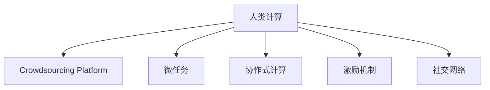

                 

# 群体智慧的力量：探索人类计算的潜力

## 1. 背景介绍

### 1.1 问题由来
人类计算（Human Computation）是一种利用人类集体智慧解决问题的计算范式，其核心在于动员大量人类参与计算任务，利用人类感知、认知、协同和创造性等能力，来解决一些复杂或传统计算机难以处理的问题。随着互联网、社交媒体和智能设备的普及，人类计算的概念逐渐得到普及和应用。

在过去的几十年中，计算机科学和人工智能领域取得了巨大的突破，如深度学习、强化学习、自然语言处理等技术的飞速发展，但与此同时，我们也面临着计算资源的紧缺、能源消耗巨大以及一些复杂问题难以解决的挑战。在这种背景下，人类计算作为一种新型的计算方式，将传统计算与人类智慧结合，有望在解决这些挑战中发挥重要作用。

### 1.2 问题核心关键点
人类计算的核心在于如何高效地动员和利用人类的智慧，将人类的认知能力和计算能力结合起来，共同解决复杂问题。这涉及到以下几个关键点：

1. **众包平台**：作为人类计算的基础设施，众包平台需要高效、易用且易于扩展，能够快速动员大量的人类参与者。
2. **任务分解与分配**：如何有效地将复杂的计算任务分解成适合人类处理的小任务，并将这些任务分配给合适的人类参与者。
3. **数据收集与处理**：如何高效地收集和处理人类参与者提供的数据，确保数据的质量和一致性。
4. **协同与协作**：如何促进人类参与者之间的协同与协作，提高任务完成的效率和质量。
5. **激励机制**：如何设计有效的激励机制，激发人类参与者的积极性和创造性。

## 2. 核心概念与联系

### 2.1 核心概念概述

为了更好地理解人类计算的力量，本节将介绍几个关键的概念及其相互联系：

- **人类计算（Human Computation）**：指通过动员人类参与计算任务，利用人类的感知、认知、协同和创造性能力，来解决问题的一种计算范式。
- **众包平台（Crowdsourcing Platform）**：提供任务发布、管理和支付等功能，连接任务提供者和参与者，是实现人类计算的基础设施。
- **微任务（Microtask）**：将复杂的计算任务分解成多个简单的小任务，适合人类个体完成。
- **协作式计算（Collaborative Computing）**：多个个体协同合作，共同完成一个复杂的计算任务。
- **激励机制（Incentive Mechanism）**：通过奖励和惩罚等手段，激发人类参与者的积极性和创造性。
- **社交网络（Social Network）**：提供社交功能，促进参与者之间的交流与协作。

这些概念之间的逻辑关系可以通过以下Mermaid流程图来展示：



这个流程图展示了几个人类计算的核心概念及其相互联系：

1. 人类计算通过众包平台动员和利用人类的智慧。
2. 任务被分解成多个微任务，适合人类个体完成。
3. 多个个体通过协作式计算共同完成任务。
4. 激励机制促进参与者的积极性和创造性。
5. 社交网络提供交流与协作的平台。

这些概念共同构成了人类计算的计算框架，使得利用人类智慧解决复杂问题成为可能。

## 3. 核心算法原理 & 具体操作步骤
### 3.1 算法原理概述

人类计算的核心算法原理可以分为以下几个方面：

- **任务分解**：将复杂的计算任务分解成多个小任务，适合人类处理。
- **分配与调度**：将小任务分配给合适的人类参与者，并调度任务的执行。
- **数据收集与处理**：收集人类参与者提供的数据，并进行处理。
- **协同与协作**：促进参与者之间的协同与协作，提高任务完成的效率和质量。
- **结果汇总与验证**：汇总和验证结果，确保任务完成的准确性和一致性。

### 3.2 算法步骤详解

以下是实现人类计算的关键算法步骤：

**Step 1: 任务定义与分解**
- 定义计算任务：确定任务的目标、输入和输出。
- 任务分解：将任务分解成多个小任务，每个小任务具有清晰的输入和输出。

**Step 2: 任务分配与调度**
- 任务分配：根据任务特点和参与者的能力，将小任务分配给合适的参与者。
- 任务调度：对分配的任务进行调度，确定任务的执行顺序和时间。

**Step 3: 数据收集与处理**
- 数据收集：通过众包平台收集人类参与者提供的数据。
- 数据处理：对收集到的数据进行清洗、去重、预处理等操作，确保数据的质量。

**Step 4: 协同与协作**
- 协同任务：多个参与者协同完成任务，进行分工与合作。
- 协作机制：建立协作机制，促进参与者之间的交流与协作。

**Step 5: 结果汇总与验证**
- 结果汇总：汇总各个参与者的计算结果。
- 结果验证：对汇总的结果进行验证，确保任务完成的准确性和一致性。

### 3.3 算法优缺点

人类计算具有以下优点：

1. **灵活性和可扩展性**：利用人类的智慧和创造力，可以灵活地解决各种问题，同时可以轻松扩展任务规模。
2. **成本低**：相比于传统计算，人类计算成本较低，特别是在处理非结构化数据和复杂问题时更具优势。
3. **人机结合**：结合了人类智慧和计算能力，能够解决一些传统计算难以处理的问题。

同时，人类计算也存在一些缺点：

1. **任务执行速度慢**：由于人类参与者的个体差异，任务的执行速度可能较慢。
2. **数据质量不稳定**：人类参与者提供的数据可能存在偏差和不一致，影响结果的准确性。
3. **协同难度大**：多个人协同完成任务可能存在协调困难，影响任务完成的效率。
4. **激励机制设计复杂**：设计有效的激励机制，激发参与者的积极性和创造性，是一个复杂且重要的任务。

尽管存在这些局限性，但人类计算作为一种新型的计算方式，其潜力巨大，值得进一步探索和应用。

### 3.4 算法应用领域

人类计算已经被广泛应用于以下几个领域：

- **众包标注**：利用人类标注数据，如图像分类、语音识别等。
- **创新设计**：利用众包平台征集创意和设计方案，如产品设计、广告创意等。
- **数据分析与挖掘**：利用众包平台进行大规模数据标注和分析，如文本分类、情感分析等。
- **复杂计算**：利用人类计算解决一些复杂的计算问题，如蛋白质折叠、药物筛选等。
- **社会计算**：利用社交网络平台，进行社会问题的分析和解决，如公共卫生、环境保护等。

## 4. 数学模型和公式 & 详细讲解 & 举例说明
### 4.1 数学模型构建

在人类计算中，数学模型主要用于描述和优化任务分解、分配、调度、协同和结果验证等环节。下面以众包标注为例，介绍数学模型构建的基本方法。

假设有一个众包平台，平台上有 $N$ 个任务和 $M$ 个人类参与者。每个任务 $i$ 需要 $d_i$ 个标注，每个参与者 $j$ 的标注质量服从正态分布 $N(\mu_j,\sigma_j^2)$。我们的目标是最大化平台标注的准确性和效率。

### 4.2 公式推导过程

假设每个任务 $i$ 需要 $d_i$ 个标注，参与者 $j$ 的标注质量服从正态分布 $N(\mu_j,\sigma_j^2)$。设平台上的任务总数为 $N$，参与者总数为 $M$，参与者 $j$ 分配的任务数为 $a_j$。设参与者 $j$ 的标注质量为 $q_j$，平台标注的平均质量为 $q$。

任务分配问题可以表示为：

$$
\min_{a_j} \sum_{j=1}^{M} a_j(\mu_j - q)
$$

约束条件为：

$$
\sum_{j=1}^{M} a_j = N
$$

任务完成的准确性可以通过以下公式计算：

$$
q = \frac{\sum_{i=1}^{N} d_i \mu_i}{\sum_{i=1}^{N} d_i}
$$

其中 $\mu_i$ 为任务 $i$ 的标注质量。

### 4.3 案例分析与讲解

以众包平台上的图像分类任务为例，说明人类计算的实现过程。

1. **任务定义与分解**：定义图像分类任务，将大量图片分解成多个小任务，每个小任务包含一定数量的图片分类。
2. **任务分配与调度**：根据每个参与者的标注能力和经验，将小任务分配给合适的人类参与者，并确定任务的执行顺序和时间。
3. **数据收集与处理**：通过众包平台收集参与者提供的图片分类结果，并进行数据清洗和去重。
4. **协同与协作**：多个参与者协同完成图片分类任务，通过交流和讨论，提高标注质量。
5. **结果汇总与验证**：汇总各个参与者的分类结果，通过多轮验证和修正，确保分类结果的准确性和一致性。

## 5. 项目实践：代码实例和详细解释说明
### 5.1 开发环境搭建

在进行人类计算项目实践前，我们需要准备好开发环境。以下是使用Python进行开发的环境配置流程：

1. 安装Anaconda：从官网下载并安装Anaconda，用于创建独立的Python环境。

2. 创建并激活虚拟环境：
```bash
conda create -n human_computation_env python=3.8 
conda activate human_computation_env
```

3. 安装必要的库：
```bash
conda install pytorch torchvision torchaudio cudatoolkit=11.1 -c pytorch -c conda-forge
```

4. 安装社交网络相关的库：
```bash
pip install networkx scikit-learn matplotlib
```

完成上述步骤后，即可在`human_computation_env`环境中开始人类计算的实践。

### 5.2 源代码详细实现

这里以众包平台上的图像分类任务为例，展示如何使用Python和PyTorch实现人类计算的代码实现。

```python
import torch
import torch.nn as nn
import torch.optim as optim
from torch.utils.data import DataLoader
from torchvision import datasets, transforms
import networkx as nx
import matplotlib.pyplot as plt
import numpy as np

# 定义任务函数
def task_definition(task_id, num_labels):
    inputs = torch.randn(1, num_labels)
    labels = torch.randint(0, num_labels, (1,))
    return inputs, labels

# 定义参与者函数
def participant_function(participant_id, task_func, num_tasks):
    for i in range(num_tasks):
        inputs, labels = task_func(i)
        # 模拟参与者的标注结果
        participant_results = torch.randn_like(inputs)
        yield participant_results

# 定义任务分配函数
def task_allocation(num_tasks, num_participants):
    allocation = {}
    for j in range(num_participants):
        allocation[j] = 0
    remaining_tasks = num_tasks
    while remaining_tasks > 0:
        participants = list(allocation.keys())
        if len(participants) == 0:
            break
        random.shuffle(participants)
        for participant in participants:
            if allocation[participant] < 3:
                allocation[participant] += 1
                remaining_tasks -= 1
    return allocation

# 定义任务执行函数
def task_execution(participant_results, allocation):
    num_tasks = len(allocation)
    num_participants = len(allocation)
    results = [[] for _ in range(num_tasks)]
    for result, participant in zip(participant_results, allocation):
        task_id = participant
        result = result[task_id]
        results[task_id].append(result)
    return results

# 定义结果汇总函数
def result_aggregation(results):
    aggregated_results = []
    for result in results:
        aggregated_result = torch.mean(result, dim=0)
        aggregated_results.append(aggregated_result)
    return aggregated_results

# 定义结果验证函数
def result_validation(aggregated_results, true_labels):
    num_tasks = len(aggregated_results)
    accuracy = 0
    for i in range(num_tasks):
        true_label = true_labels[i]
        predicted_label = aggregated_results[i]
        if predicted_label == true_label:
            accuracy += 1
    return accuracy / num_tasks

# 定义模拟数据
num_tasks = 10
num_participants = 5
true_labels = torch.randint(0, 3, (num_tasks,))

# 定义参与者
participants = [participant_function(i, task_definition, num_tasks) for i in range(num_participants)]

# 定义任务分配
allocation = task_allocation(num_tasks, num_participants)

# 定义任务执行
results = task_execution(participants, allocation)

# 定义结果汇总
aggregated_results = result_aggregation(results)

# 定义结果验证
accuracy = result_validation(aggregated_results, true_labels)

print(f"Accuracy: {accuracy:.2f}")
```

### 5.3 代码解读与分析

让我们再详细解读一下关键代码的实现细节：

**task_definition函数**：
- 定义了任务的输入和标签，用于生成模拟数据。

**participant_function函数**：
- 模拟参与者的标注结果，通过随机生成数值，模拟参与者的标注质量。

**task_allocation函数**：
- 定义了任务分配的策略，将任务分配给合适的参与者。

**task_execution函数**：
- 将参与者的标注结果汇总，生成最终的标注结果。

**result_aggregation函数**：
- 汇总所有参与者的标注结果，计算每个任务的平均标注结果。

**result_validation函数**：
- 验证标注结果的准确性，计算任务的准确率。

**simulation loop**：
- 模拟人类计算的过程，从任务定义到结果验证，完成一次完整的计算过程。

可以看到，人类计算的代码实现相对简洁，但实际应用中需要更复杂的模型和算法，如优化任务分配、设计有效的激励机制等，这些需要在实际应用中进一步优化和完善。

## 6. 实际应用场景
### 6.1 智能交通系统

智能交通系统利用人类计算来解决交通流量预测和优化问题，提高交通系统的效率和安全性。具体应用包括：

- **实时交通流量预测**：通过收集实时交通数据，利用人类计算进行流量预测和优化，避免交通拥堵和事故发生。
- **事故应急响应**：利用人类计算快速收集事故信息，预测事故发展趋势，制定应急响应计划。

### 6.2 公共卫生系统

公共卫生系统利用人类计算来处理和分析大规模的健康数据，提供疾病监测和预防服务。具体应用包括：

- **疾病监测与预警**：利用人类计算分析医疗数据，监测疾病爆发和扩散趋势，预警可能的疫情。
- **健康数据分析**：利用人类计算进行健康数据分析，发现潜在的健康问题，提供个性化的健康建议。

### 6.3 环境保护系统

环境保护系统利用人类计算来解决环境监测和治理问题，提高环境管理的效率和效果。具体应用包括：

- **水质监测**：利用人类计算分析水质数据，预测水质变化趋势，制定治理措施。
- **森林监测**：利用人类计算监测森林覆盖和砍伐情况，制定保护措施。

### 6.4 未来应用展望

随着人类计算技术的不断进步，其在以下领域的应用将更加广泛：

- **全球气候变化监测**：利用人类计算分析全球气候数据，预测气候变化趋势，制定应对策略。
- **地球科学研究**：利用人类计算分析地球科学数据，进行地质灾害预测、地球物理探测等。
- **太空探索**：利用人类计算分析太空数据，进行天体运动预测、星际通信等。

未来，人类计算有望在更多领域发挥其独特优势，成为解决复杂问题的重要工具。

## 7. 工具和资源推荐
### 7.1 学习资源推荐

为了帮助开发者系统掌握人类计算的理论基础和实践技巧，这里推荐一些优质的学习资源：

1. **《Human Computation and Crowdsourcing》课程**：由Coursera提供，介绍了人类计算的基本概念、技术和应用。
2. **《Human Computation in Business and Science》书籍**：介绍了人类计算在商业和科学中的应用，包括众包、社交网络、数据分析等。
3. **《Human Computation in Science》论文**：综述了人类计算在科学中的应用，包括天文学、生物学、环境科学等。
4. **Human Computation Foundation**：一个致力于推动人类计算研究和应用的非营利组织，提供丰富的学习资源和研究论文。

通过对这些资源的学习实践，相信你一定能够快速掌握人类计算的精髓，并用于解决实际的计算问题。

### 7.2 开发工具推荐

高效的开发离不开优秀的工具支持。以下是几款用于人类计算开发的常用工具：

1. **Jupyter Notebook**：一个交互式的开发环境，适合进行数据分析和实验。
2. **Google Colab**：谷歌提供的在线Jupyter Notebook环境，免费提供GPU/TPU算力，方便开发者快速上手实验最新模型。
3. **Amazon Mechanical Turk**：一个众包平台，用于发布和管理任务，连接任务提供者和参与者。
4. **Elastic Stack**：一个分布式计算框架，用于处理和分析大规模数据。

合理利用这些工具，可以显著提升人类计算任务的开发效率，加快创新迭代的步伐。

### 7.3 相关论文推荐

人类计算领域的研究源于学界的持续探索。以下是几篇奠基性的相关论文，推荐阅读：

1. **Crowdsourcing Scientific Discovery: A Framework for Collaborative Research**：提出了一种新的科学发现框架，利用人类计算加速科学研究和数据处理。
2. **Human Computation and Collaborative Problem Solving: A Survey**：综述了人类计算在问题解决和协同工作中的应用，提供了丰富的案例和实践经验。
3. **Human Computation: A Survey**：综述了人类计算的基本概念、技术和应用，介绍了当前的研究进展和趋势。

这些论文代表了大计算研究的发展脉络，通过学习这些前沿成果，可以帮助研究者把握学科前进方向，激发更多的创新灵感。

## 8. 总结：未来发展趋势与挑战
### 8.1 总结

本文对人类计算的基本概念、实现方法和实际应用进行了全面系统的介绍。首先阐述了人类计算在解决复杂问题中的重要作用，明确了其研究背景和意义。其次，从原理到实践，详细讲解了人类计算的数学模型和关键步骤，给出了人类计算任务开发的完整代码实例。同时，本文还广泛探讨了人类计算在智能交通、公共卫生、环境保护等多个领域的应用前景，展示了人类计算的巨大潜力。此外，本文精选了人类计算相关的学习资源，力求为读者提供全方位的技术指引。

通过本文的系统梳理，可以看到，人类计算作为一种新型的计算方式，其潜力巨大，将传统计算与人类智慧结合，能够解决一些复杂问题。未来，伴随技术的发展和应用的深入，人类计算必将在更多领域大放异彩。

### 8.2 未来发展趋势

展望未来，人类计算的发展趋势将呈现以下几个方向：

1. **智能化和自动化**：利用人工智能技术优化任务分配和协同过程，提高人类计算的效率和准确性。
2. **跨领域应用**：人类计算的应用范围将进一步扩大，涉及更多领域，如医疗、环境、金融等。
3. **分布式计算**：利用分布式计算技术，处理和分析大规模数据，提升人类计算的计算能力。
4. **社会计算**：利用社交网络平台，促进人类计算中的协同与协作，增强任务完成的效率和质量。
5. **众包平台优化**：开发更高效、更易用的众包平台，降低人类计算的门槛，吸引更多参与者。

这些发展趋势将推动人类计算技术不断进步，拓展其应用边界，带来更大的社会和经济价值。

### 8.3 面临的挑战

尽管人类计算在解决问题方面具有巨大潜力，但在实际应用中仍面临诸多挑战：

1. **数据质量不稳定**：参与者提供的数据可能存在偏差和不一致，影响结果的准确性。
2. **任务执行效率低**：由于人类参与者的个体差异，任务的执行速度可能较慢。
3. **协同难度大**：多个人协同完成任务可能存在协调困难，影响任务完成的效率。
4. **激励机制设计复杂**：设计有效的激励机制，激发参与者的积极性和创造性，是一个复杂且重要的任务。
5. **技术复杂度高**：人类计算涉及多个领域的知识，需要多学科协作，技术复杂度高。

尽管存在这些挑战，但人类计算作为一种新型的计算方式，其潜力巨大，值得进一步探索和应用。

### 8.4 研究展望

面对人类计算面临的挑战，未来的研究需要在以下几个方面寻求新的突破：

1. **数据质量提升**：开发更高效的数据清洗和去重技术，确保数据的质量和一致性。
2. **任务分解优化**：利用人工智能技术优化任务分解策略，提高任务的执行效率。
3. **协同机制设计**：建立更加灵活和高效的协同机制，促进参与者之间的交流与协作。
4. **激励机制优化**：设计更有效的激励机制，激发参与者的积极性和创造性。
5. **技术融合**：将人类计算与人工智能、大数据等技术进行融合，提高人类计算的计算能力和应用范围。

这些研究方向的探索，必将引领人类计算技术迈向更高的台阶，为解决复杂问题提供新的解决方案。

## 9. 附录：常见问题与解答

**Q1：人类计算的效率和准确性如何保障？**

A: 人类计算的效率和准确性主要依赖于任务分解、任务分配、数据收集和结果验证等环节的优化。通过有效的任务分解策略，将复杂的计算任务分解成多个适合人类处理的小任务。利用任务分配算法，将任务分配给合适的参与者，并优化任务执行过程。通过数据收集和清洗，确保数据的质量和一致性。通过结果验证，确保任务完成的准确性和一致性。这些环节的优化，可以显著提高人类计算的效率和准确性。

**Q2：如何设计有效的激励机制？**

A: 设计有效的激励机制，需要考虑参与者的贡献、任务的难度和完成时间等因素。可以通过设置任务奖励、任务排名、任务反馈等方式，激励参与者的积极性和创造性。同时，需要建立透明公正的激励机制，确保参与者能够公平地获得报酬和认可。

**Q3：人类计算和人工智能的结合如何实现？**

A: 人类计算和人工智能的结合，可以通过任务分解和任务分配等环节的优化，利用人工智能技术进行任务分配和协同优化。同时，可以利用人工智能进行数据清洗和预处理，提高数据的质量和一致性。通过结果验证，利用人工智能进行结果分析和优化，提升任务完成的准确性和一致性。

**Q4：人类计算在实际应用中如何保证数据隐私和安全？**

A: 在实际应用中，保护参与者的数据隐私和安全是至关重要的。可以通过数据匿名化、去标识化等技术，保护参与者的隐私。同时，建立透明公正的激励机制，确保参与者的数据安全。利用区块链技术，进行数据记录和验证，防止数据篡改和泄露。

**Q5：人类计算在实际应用中如何处理数据偏差和不一致？**

A: 在实际应用中，数据偏差和不一致是不可避免的。可以通过数据清洗和去重等技术，提高数据的质量和一致性。同时，建立透明公正的激励机制，确保参与者的数据贡献能够得到公平的认可。通过结果验证，利用人工智能进行结果分析和优化，提高任务完成的准确性和一致性。

---

作者：禅与计算机程序设计艺术 / Zen and the Art of Computer Programming

