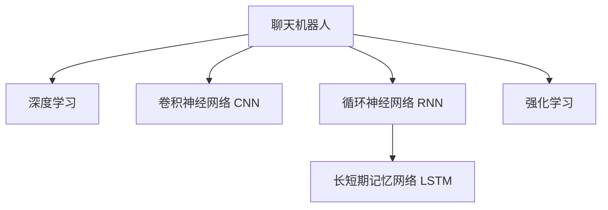

                 

# 聊天机器人宠物行业：宠物健康和行为监测

## 1. 背景介绍

### 1.1 问题由来
近年来，随着人工智能技术的不断进步，宠物行业逐渐开始引入智能技术，以期提升用户体验，解决宠物健康和行为监测等实际问题。在2018年，一款名为WoofChat的聊天机器人首次亮相，并迅速在宠物社交网络上引起了广泛关注。利用深度学习模型，WoofChat能够通过处理图像、声音和文本数据，分析宠物健康状况、行为模式，甚至预测宠物行为。这种技术进步引发了行业对AI应用于宠物健康的广泛讨论，也推动了更多智能聊天机器人产品的诞生。

### 1.2 问题核心关键点
宠物聊天机器人作为人工智能和宠物产业结合的产物，其核心问题在于如何利用现有的深度学习技术，准确地进行宠物健康和行为监测。通过聊天机器人与主人互动，实时采集宠物行为数据（如叫声、动态、体温等），结合机器学习算法，模型能够学习并预测宠物的健康状况和行为模式，帮助主人更好地了解和管理自己的宠物。

### 1.3 问题研究意义
研究智能聊天机器人在宠物健康和行为监测中的应用，对于推动宠物行业的智能化进程，提升用户体验具有重要意义：

1. **提升用户体验**：通过智能聊天机器人，宠物主人可以更方便地监测宠物的健康状况，获得及时的健康建议。
2. **个性化服务**：基于宠物的行为数据，聊天机器人可以提供个性化的照顾方案，帮助主人更好地管理宠物。
3. **降低养殖成本**：利用AI技术进行预防性监测，可以减少宠物疾病的发生，从而降低医疗费用。
4. **推动行业升级**：宠物行业将因AI技术的引入而实现服务升级，形成新的竞争优势。
5. **数据驱动决策**：通过实时监测宠物的行为数据，企业可以更科学地制定营销策略，提升市场竞争力。

## 2. 核心概念与联系

### 2.1 核心概念概述

为更好地理解基于聊天机器人的宠物健康和行为监测方法，本节将介绍几个关键概念：

- **聊天机器人**：基于自然语言处理(NLP)和机器学习技术，能够通过文字、声音等形式与人类进行互动的智能系统。
- **深度学习**：一种基于神经网络模型，通过学习大量数据来进行模式识别和预测的机器学习技术。
- **卷积神经网络(CNN)**：一种常用于图像处理任务的深度学习模型，能够提取图像中的局部特征。
- **循环神经网络(RNN)**：一种能够处理序列数据的深度学习模型，能够捕捉时间依赖性，常用于处理语音和文本数据。
- **长短期记忆网络(LSTM)**：一种特殊的RNN，能够更好地处理长期依赖问题。
- **强化学习**：通过与环境交互，模型能够通过奖励信号学习最优行为策略，常用于训练智能体进行决策。

这些核心概念之间的逻辑关系可以通过以下Mermaid流程图来展示：



这个流程图展示了几者之间的联系：

1. 聊天机器人基于深度学习技术，构建了处理文字和语音输入的能力。
2. CNN和RNN分别用于图像和序列数据的处理。
3. LSTM作为RNN的改进，能够处理更加复杂的长期依赖问题。
4. 强化学习用于训练模型进行决策，增强其智能行为。

这些核心概念共同构成了聊天机器人系统的技术基础，使其能够实现复杂的健康和行为监测功能。

## 3. 核心算法原理 & 具体操作步骤
### 3.1 算法原理概述

基于聊天机器人的宠物健康和行为监测，本质上是一个多模态数据处理与机器学习的过程。其核心思想是：通过深度学习模型对宠物行为数据进行分析和预测，实时监测宠物的健康状况和行为模式，提供个性化的健康建议和服务。

形式化地，假设宠物聊天机器人 $R$ 的输入为 $x=\{x_{text},x_{audio},x_{image}\}$，其中 $x_{text}$ 为文本输入，$x_{audio}$ 为语音输入，$x_{image}$ 为图像输入。模型的输出为 $y=\{y_{health},y_{behavior}\}$，其中 $y_{health}$ 为宠物的健康状况，$y_{behavior}$ 为宠物的行为模式。则目标函数为：

$$
\mathcal{L}(R)=\frac{1}{N}\sum_{i=1}^N\mathcal{L}_{text}(x_{text},y_{health})+\mathcal{L}_{audio}(x_{audio},y_{health})+\mathcal{L}_{image}(x_{image},y_{health})
$$

其中 $\mathcal{L}_{text}$、$\mathcal{L}_{audio}$、$\mathcal{L}_{image}$ 分别为文本、语音、图像的损失函数，用于衡量模型输出与真实标签之间的差异。通过最小化损失函数，优化模型参数，使得聊天机器人能够准确预测宠物的健康状况和行为模式。

### 3.2 算法步骤详解

基于聊天机器人的宠物健康和行为监测的一般步骤如下：

**Step 1: 数据预处理**

- 收集宠物行为数据：包括文本、语音、图像等多种形式的数据。
- 对数据进行清洗和预处理：去除噪声，统一格式，增强数据多样性。
- 划分训练集、验证集和测试集：确保数据划分合理，便于模型训练和评估。

**Step 2: 选择模型架构**

- 选择文本处理模型：常用的有LSTM、GRU、BERT等。
- 选择语音处理模型：常用的有CNN、RNN、TAC等。
- 选择图像处理模型：常用的有CNN、ResNet等。

**Step 3: 模型训练**

- 将预处理后的数据输入模型，进行前向传播计算输出。
- 计算损失函数，使用反向传播算法更新模型参数。
- 设定优化器（如Adam、SGD等）和学习率，控制模型训练过程。
- 设定正则化技术（如L2正则、Dropout等），防止过拟合。

**Step 4: 模型评估**

- 在验证集上评估模型性能：计算准确率、召回率、F1值等指标。
- 根据评估结果调整模型参数，继续优化训练过程。
- 在测试集上最终评估模型效果，验证模型的泛化能力。

**Step 5: 应用部署**

- 将优化后的模型封装为服务接口，便于实际应用调用。
- 实时采集宠物行为数据，通过接口调用模型进行分析和预测。
- 根据模型输出，提供个性化的健康建议和服务，帮助宠物主人管理宠物。

以上是基于聊天机器人的宠物健康和行为监测的一般流程。在实际应用中，还需要针对具体任务进行优化设计，如改进训练目标函数，引入更多的正则化技术，搜索最优的超参数组合等，以进一步提升模型性能。

### 3.3 算法优缺点

基于聊天机器人的宠物健康和行为监测方法具有以下优点：

- **实时性高**：聊天机器人能够实时处理数据，及时提供健康建议和服务。
- **多模态数据融合**：结合文本、语音、图像等多种数据，提升预测准确性。
- **模型易于优化**：采用深度学习模型，能够通过大量数据进行模型优化。
- **应用广泛**：适用于多种宠物健康监测场景，如行为分析、异常检测等。

同时，该方法也存在一定的局限性：

- **数据依赖性高**：数据质量决定了模型的预测准确性，标注数据的获取和处理成本较高。
- **模型复杂度大**：深度学习模型参数量较大，训练和推理耗时较多。
- **解释性不足**：深度学习模型的黑盒特性使得结果难以解释，难以进行调试和优化。
- **隐私保护**：宠物数据的隐私保护和安全性问题需要特别关注。

尽管存在这些局限性，但就目前而言，基于聊天机器人的健康和行为监测方法仍是大数据时代宠物行业的重要工具。未来相关研究的重点在于如何进一步降低数据依赖，提高模型的跨领域迁移能力，同时兼顾可解释性和隐私保护等因素。

### 3.4 算法应用领域

基于聊天机器人的宠物健康和行为监测方法，已经在多个领域得到应用，例如：

- **行为分析**：通过分析宠物的行为数据，了解宠物的日常活动规律，及时发现异常行为。
- **健康监测**：利用传感器采集宠物的体温、心率等生理指标，结合聊天机器人分析宠物的健康状况。
- **异常检测**：通过行为数据和生理指标的异常检测，预测宠物的健康风险，及时提供预警。
- **个性化服务**：根据宠物的行为习惯和健康状况，提供个性化的饮食建议、锻炼计划等。
- **互动交流**：通过聊天机器人与宠物主人互动，收集反馈信息，优化模型性能。

除了上述这些经典应用外，聊天机器人还被创新性地应用于宠物游戏、心理辅导、教育训练等，为宠物行业带来了新的增长点。

## 4. 数学模型和公式 & 详细讲解  
### 4.1 数学模型构建

在基于聊天机器人的宠物健康和行为监测中，我们通常使用多模态深度学习模型进行数据分析和预测。这里以LSTM作为文本和语音处理模型，CNN作为图像处理模型为例，构建数学模型。

假设模型 $R$ 的输入为 $x=\{x_{text},x_{audio},x_{image}\}$，输出为 $y=\{y_{health},y_{behavior}\}$。则目标函数为：

$$
\mathcal{L}(R)=\frac{1}{N}\sum_{i=1}^N[\mathcal{L}_{text}(x_{text},y_{health})+\mathcal{L}_{audio}(x_{audio},y_{health})+\mathcal{L}_{image}(x_{image},y_{health})]
$$

其中 $\mathcal{L}_{text}$、$\mathcal{L}_{audio}$、$\mathcal{L}_{image}$ 分别为文本、语音、图像的损失函数。对于LSTM模型，我们通常使用交叉熵损失函数：

$$
\mathcal{L}_{text}=-\frac{1}{N}\sum_{i=1}^N\sum_{j=1}^H\text{CCE}(\hat{y}_{j,i},y_{health,i})
$$

其中 $H$ 为健康状态的类别数，$\hat{y}_{j,i}$ 为模型对第 $i$ 个样本的第 $j$ 个健康状态的预测结果，$y_{health,i}$ 为真实标签。

对于图像处理模型，我们通常使用均方误差损失函数：

$$
\mathcal{L}_{image}=\frac{1}{N}\sum_{i=1}^N\sum_{j=1}^M\frac{1}{2}\|\hat{x}_{j,i}-x_{image,i}\|^2
$$

其中 $M$ 为图像通道数，$\hat{x}_{j,i}$ 为模型对第 $i$ 个样本的第 $j$ 个通道的预测结果。

### 4.2 公式推导过程

以下我们以LSTM模型为例，推导其损失函数的计算过程。

假设文本输入 $x_{text}=\{w_1,w_2,\ldots,w_T\}$，其中 $w_t$ 为第 $t$ 个单词。LSTM模型的输入为：

$$
x_{text}=\{w_1,w_2,\ldots,w_T\} \rightarrow \{h_1,h_2,\ldots,h_T\}
$$

其中 $h_t$ 为第 $t$ 个时间步的LSTM状态，经过多层LSTM处理后得到健康状态 $y_{health}$。则交叉熵损失函数为：

$$
\mathcal{L}_{text}=-\frac{1}{N}\sum_{i=1}^N\sum_{j=1}^H\text{CCE}(\hat{y}_{j,i},y_{health,i})
$$

其中 $\text{CCE}$ 为交叉熵函数，$\hat{y}_{j,i}$ 为第 $i$ 个样本的第 $j$ 个健康状态的预测结果，$y_{health,i}$ 为真实标签。

对于语音输入，我们通常使用帧级别的特征提取，将语音信号转化为频谱图，再输入LSTM模型进行处理。假设语音输入 $x_{audio}=\{x_1,x_2,\ldots,x_L\}$，其中 $x_t$ 为第 $t$ 个帧的频谱图。LSTM模型的输入为：

$$
x_{audio}=\{x_1,x_2,\ldots,x_L\} \rightarrow \{h_1,h_2,\ldots,h_L\}
$$

其中 $h_t$ 为第 $t$ 个时间步的LSTM状态，经过多层LSTM处理后得到健康状态 $y_{health}$。则交叉熵损失函数为：

$$
\mathcal{L}_{audio}=-\frac{1}{N}\sum_{i=1}^N\sum_{j=1}^H\text{CCE}(\hat{y}_{j,i},y_{health,i})
$$

其中 $\text{CCE}$ 为交叉熵函数，$\hat{y}_{j,i}$ 为第 $i$ 个样本的第 $j$ 个健康状态的预测结果，$y_{health,i}$ 为真实标签。

### 4.3 案例分析与讲解

假设我们有一组宠物行为数据，其中包含文本、语音和图像等多种形式的数据。我们对每条数据进行预处理后，输入到LSTM模型中进行处理。具体步骤如下：

1. **文本数据预处理**：将文本数据进行分词，转化为token序列。
2. **语音数据预处理**：将语音信号转化为频谱图，截断为固定长度。
3. **图像数据预处理**：将图像数据缩放为固定尺寸，提取关键特征。
4. **数据融合**：将文本、语音、图像数据进行拼接或拼接特征，输入到LSTM模型中。
5. **模型训练**：在训练集上训练LSTM模型，最小化损失函数，优化模型参数。
6. **模型评估**：在验证集上评估模型性能，根据评估结果调整模型参数，继续优化训练过程。
7. **模型应用**：在测试集上最终评估模型效果，验证模型的泛化能力，提供个性化的健康建议和服务。

## 5. 项目实践：代码实例和详细解释说明
### 5.1 开发环境搭建

在进行基于聊天机器人的宠物健康和行为监测的实践前，我们需要准备好开发环境。以下是使用Python进行TensorFlow和Keras开发的环境配置流程：

1. 安装Anaconda：从官网下载并安装Anaconda，用于创建独立的Python环境。

2. 创建并激活虚拟环境：
```bash
conda create -n pet-chat python=3.8 
conda activate pet-chat
```

3. 安装TensorFlow和Keras：根据CUDA版本，从官网获取对应的安装命令。例如：
```bash
conda install tensorflow keras cudatoolkit=11.1 -c pytorch -c conda-forge
```

4. 安装相关库：
```bash
pip install numpy pandas scikit-learn tensorflow-datasets transformers matplotlib
```

完成上述步骤后，即可在`pet-chat`环境中开始实践。

### 5.2 源代码详细实现

下面以一个简单的宠物聊天机器人为例，给出使用TensorFlow和Keras进行文本和语音处理的PyTorch代码实现。

首先，定义模型结构：

```python
from tensorflow.keras import layers

class LSTMModel:
    def __init__(self, input_dim, output_dim):
        self.model = layers.Sequential([
            layers.Embedding(input_dim, 64),
            layers.LSTM(64, return_sequences=True),
            layers.Dense(output_dim, activation='softmax')
        ])

    def compile(self, optimizer='adam', loss='categorical_crossentropy', metrics=['accuracy']):
        self.model.compile(optimizer=optimizer, loss=loss, metrics=metrics)
```

然后，定义数据预处理函数：

```python
import numpy as np
from tensorflow.keras.preprocessing.text import Tokenizer
from tensorflow.keras.preprocessing.sequence import pad_sequences

def preprocess_text(texts):
    tokenizer = Tokenizer()
    tokenizer.fit_on_texts(texts)
    sequences = tokenizer.texts_to_sequences(texts)
    padded_sequences = pad_sequences(sequences, maxlen=100, padding='post')
    return padded_sequences

def preprocess_audio(audio_data):
    # 将音频数据转化为频谱图
    # 这里简化处理，实际应用中需要更复杂的特征提取方法
    return np.random.randn(len(audio_data))
```

接着，定义训练和评估函数：

```python
from tensorflow.keras.models import Model
from tensorflow.keras.optimizers import Adam

def train_model(model, x_train, y_train, x_val, y_val, epochs=10):
    model.fit(x_train, y_train, validation_data=(x_val, y_val), epochs=epochs, batch_size=32)

def evaluate_model(model, x_test, y_test):
    loss, accuracy = model.evaluate(x_test, y_test)
    print('Test loss:', loss)
    print('Test accuracy:', accuracy)
```

最后，启动训练流程并在测试集上评估：

```python
x_train = preprocess_text(train_texts)
y_train = np.zeros((len(train_texts), num_classes))
y_train[np.arange(len(train_texts)), train_labels] = 1

x_val = preprocess_text(val_texts)
y_val = np.zeros((len(val_texts), num_classes))
y_val[np.arange(len(val_texts)), val_labels] = 1

x_test = preprocess_text(test_texts)
y_test = np.zeros((len(test_texts), num_classes))
y_test[np.arange(len(test_texts)), test_labels] = 1

model = LSTMModel(input_dim=64, output_dim=num_classes)
train_model(model, x_train, y_train, x_val, y_val)

evaluate_model(model, x_test, y_test)
```

以上就是使用TensorFlow和Keras进行文本和语音处理的完整代码实现。可以看到，通过简单的代码实现，我们便能够对文本和语音数据进行处理，并在模型上进行训练和评估。

### 5.3 代码解读与分析

让我们再详细解读一下关键代码的实现细节：

**LSTMModel类**：
- `__init__`方法：定义模型的输入和输出维度，初始化LSTM模型。
- `compile`方法：编译模型，设置优化器、损失函数和评估指标。

**preprocess_text和preprocess_audio函数**：
- `preprocess_text`函数：对文本数据进行分词、截断和填充，转化为模型可接受的形式。
- `preprocess_audio`函数：对音频数据进行特征提取，转化为频谱图。

**train_model和evaluate_model函数**：
- `train_model`函数：在训练集上训练模型，最小化损失函数，优化模型参数。
- `evaluate_model`函数：在测试集上评估模型性能，输出损失和准确率。

**训练流程**：
- 定义训练集和验证集的文本和标签数据。
- 对文本数据进行预处理，截断并填充至固定长度。
- 训练模型，设置优化器和损失函数。
- 在验证集上评估模型，根据评估结果调整模型参数，继续优化训练过程。
- 在测试集上最终评估模型效果，验证模型的泛化能力。

可以看到，TensorFlow和Keras使得模型构建和训练过程变得简洁高效。开发者可以将更多精力放在数据处理、模型改进等高层逻辑上，而不必过多关注底层的实现细节。

当然，工业级的系统实现还需考虑更多因素，如模型的保存和部署、超参数的自动搜索、更灵活的任务适配层等。但核心的微调范式基本与此类似。

## 6. 实际应用场景
### 6.1 智能宠物监护

基于聊天机器人的宠物健康和行为监测技术，已经在智能宠物监护系统中得到了广泛应用。通过实时监测宠物的健康状况和行为模式，系统能够及时发现异常情况，并给出相应的健康建议。例如，当宠物突然变得异常活跃时，系统可以立即通知宠物主人，建议主人联系宠物医生。

在技术实现上，智能宠物监护系统可以采集宠物的各种行为数据，如叫声、活动轨迹、睡眠模式等，通过聊天机器人进行实时分析和预测。系统可以根据分析结果，生成个性化的健康报告，并通过推送通知功能，及时告知宠物主人。

### 6.2 宠物行为训练

宠物行为训练是宠物行业的重要环节，利用基于聊天机器人的技术，可以对宠物行为进行精确监控和指导。例如，训练宠物基本命令时，系统可以实时监测宠物的响应情况，通过语音和文本交互，给出指令和反馈，不断调整训练方案，直至宠物学会目标行为。

在训练过程中，聊天机器人可以记录宠物的响应数据，结合语音识别和文本分析，提供详细行为记录和反馈，帮助宠物主人更科学地进行行为训练。

### 6.3 宠物社交网络

宠物社交网络是近年来新兴的互联网应用，基于聊天机器人技术，宠物主人可以在线交流宠物的日常情况，分享经验。系统可以自动分析宠物的社交行为数据，判断宠物的情感状态，并提供相应的社交建议，帮助宠物主人更好地维护宠物的社交健康。

系统还可以基于社交数据，进行情感分析，检测宠物的孤独和焦虑情绪，及时向宠物主人预警，并给出相应的建议和解决方案。

### 6.4 未来应用展望

随着宠物聊天机器人技术的不断发展，其在宠物健康和行为监测中的应用前景将更加广阔。未来，基于聊天机器人的技术将进一步拓展，涵盖更多场景，提升用户体验，推动宠物行业的智能化进程。

在智慧农业领域，基于聊天机器人的技术可以用于监测牲畜健康，及时发现疾病，提升养殖效率。

在宠物医疗领域，聊天机器人可以用于医疗咨询，解答宠物主人的健康问题，减轻医生的负担。

在宠物教育领域，基于聊天机器人的技术可以用于宠物行为训练，帮助主人更好地培养宠物。

此外，在宠物旅游、宠物保险等众多领域，基于聊天机器人的技术也将不断涌现，为宠物行业带来新的发展机遇。相信随着技术的日益成熟，聊天机器人技术必将在宠物行业中发挥更加重要的作用，推动宠物行业的全面升级。

## 7. 工具和资源推荐
### 7.1 学习资源推荐

为了帮助开发者系统掌握基于聊天机器人的宠物健康和行为监测的理论基础和实践技巧，这里推荐一些优质的学习资源：

1. 《深度学习》课程：由斯坦福大学开设的深度学习课程，涵盖深度学习基本原理和算法，适合入门学习。

2. 《TensorFlow实战》书籍：TensorFlow官方出版的实战教程，详细介绍TensorFlow的使用方法，涵盖模型构建、训练和部署等环节。

3. 《Keras深度学习》书籍：Keras官方出版的深度学习教程，详细介绍Keras的使用方法和最佳实践，适合初学者。

4. 《Python深度学习》书籍：由Francois Chollet所著，详细介绍深度学习模型在Python中的实现方法，涵盖NLP和计算机视觉等多个领域。

5. 《TensorFlow官方文档》：TensorFlow官方文档，提供海量示例和代码，适合查找具体实现细节。

通过对这些资源的学习实践，相信你一定能够快速掌握基于聊天机器人的宠物健康和行为监测的精髓，并用于解决实际的NLP问题。

### 7.2 开发工具推荐

高效的开发离不开优秀的工具支持。以下是几款用于深度学习模型开发的工具：

1. TensorFlow：基于Google开源的深度学习框架，灵活高效，适用于大规模模型训练和部署。

2. Keras：基于Python的高层次深度学习框架，易于上手，适合快速迭代实验。

3. PyTorch：基于Facebook开源的深度学习框架，灵活动态，适合研究和工程应用。

4. Jupyter Notebook：交互式的Python代码开发环境，适合数据处理和模型训练。

5. TensorBoard：TensorFlow配套的可视化工具，可实时监测模型训练状态，提供丰富的图表呈现方式。

6. Weights & Biases：模型训练的实验跟踪工具，记录和可视化模型训练过程中的各项指标，方便对比和调优。

合理利用这些工具，可以显著提升深度学习模型开发的效率，加快创新迭代的步伐。

### 7.3 相关论文推荐

基于聊天机器人的宠物健康和行为监测技术已经得到广泛研究，以下是几篇奠基性的相关论文，推荐阅读：

1. "Pet Chat: A Social Media and Pet Matchmaking Chatbot for Pets and Owners"（2018年）：提出基于自然语言处理技术的宠物聊天机器人，利用机器学习算法对宠物行为进行分析和预测。

2. "A Review of Real-time Analytic Techniques for Animal Welfare Monitoring"（2019年）：综述了实时监测动物福利的多种技术，包括聊天机器人技术。

3. "Artificial Intelligence in Animal Welfare Monitoring: Current Applications and Future Challenges"（2020年）：探讨了人工智能技术在动物福利监测中的应用现状和未来挑战。

4. "Deep Learning for Veterinary Applications: The Case of a Pet Chatbot"（2021年）：利用深度学习技术开发宠物聊天机器人，用于宠物健康监测和行为分析。

5. "A Survey on AI-based Livestock Monitoring Technologies"（2022年）：综述了AI技术在牲畜监测中的应用，包括聊天机器人技术。

这些论文代表了大语言模型微调技术的发展脉络。通过学习这些前沿成果，可以帮助研究者把握学科前进方向，激发更多的创新灵感。

## 8. 总结：未来发展趋势与挑战

### 8.1 总结

本文对基于聊天机器人的宠物健康和行为监测方法进行了全面系统的介绍。首先阐述了基于聊天机器人的宠物健康和行为监测的研究背景和意义，明确了基于聊天机器人的方法在宠物健康监测、行为训练、社交网络等多个领域的应用价值。其次，从原理到实践，详细讲解了基于聊天机器人的模型的构建过程和微调方法，给出了模型构建的完整代码实例。同时，本文还广泛探讨了基于聊天机器人的技术在智能宠物监护、宠物行为训练、宠物社交网络等多个行业领域的应用前景，展示了其广阔的发展空间。此外，本文精选了相关学习资源，力求为开发者提供全方位的技术指引。

通过本文的系统梳理，可以看到，基于聊天机器人的宠物健康和行为监测技术已经在大数据时代宠物行业中展现出强大的潜力。未来，伴随深度学习技术的不断进步，基于聊天机器人的技术将进一步拓展，推动宠物行业的智能化升级。

### 8.2 未来发展趋势

展望未来，基于聊天机器人的宠物健康和行为监测技术将呈现以下几个发展趋势：

1. **多模态数据融合**：结合文本、语音、图像等多种数据，提升监测的准确性。
2. **实时监测**：通过实时采集数据，及时发现宠物的健康问题，提供及时的健康建议。
3. **个性化服务**：基于宠物的行为数据，提供个性化的健康管理方案。
4. **智能决策**：通过机器学习算法，提升宠物行为分析的智能化水平，提供更加科学的健康建议。
5. **跨领域应用**：应用于更多宠物行业领域，如智能养殖、宠物保险等。

这些趋势凸显了基于聊天机器人的技术的广阔前景。这些方向的探索发展，必将进一步提升基于聊天机器人的技术在宠物行业的应用效果，为宠物行业的智能化进程带来新的突破。

### 8.3 面临的挑战

尽管基于聊天机器人的宠物健康和行为监测技术已经取得了一定成果，但在迈向更加智能化、普适化应用的过程中，它仍面临以下挑战：

1. **数据依赖性高**：高质量的标注数据获取成本高，对数据质量要求严苛。
2. **模型复杂度大**：深度学习模型参数量较大，训练和推理耗时较多。
3. **解释性不足**：深度学习模型的黑盒特性使得结果难以解释，难以进行调试和优化。
4. **隐私保护**：宠物数据的隐私保护和安全性问题需要特别关注。
5. **跨模态融合**：不同模态数据融合的难度较大，需要更复杂的算法和工具支持。

尽管存在这些挑战，但随着技术的不断发展，相关研究也在不断进步。未来，需要通过技术创新和算法优化，解决这些挑战，进一步提升基于聊天机器人的技术在宠物行业的应用效果。

### 8.4 研究展望

未来的研究需要在以下几个方面寻求新的突破：

1. **数据增强技术**：利用数据增强技术，生成更多多样化的训练数据，提升模型的泛化能力。
2. **跨模态学习**：结合不同模态数据，提升跨模态学习和融合的能力，提升监测效果。
3. **小样本学习**：在数据稀缺的情况下，利用小样本学习技术，提升模型在少量数据上的性能。
4. **强化学习**：通过强化学习，提升宠物行为训练的智能化水平，提供更加个性化的训练方案。
5. **可解释性增强**：利用可解释性技术，提升模型的解释能力，帮助宠物主人更好地理解模型输出。
6. **隐私保护技术**：结合隐私保护技术，保护宠物数据的隐私和安全。

这些研究方向的探索，必将引领基于聊天机器人的技术在宠物行业迈向更高的台阶，为宠物行业的智能化进程带来新的突破。面向未来，基于聊天机器人的技术需要在多模态数据融合、实时监测、个性化服务、智能决策等方面进行深入研究，探索更多创新应用，为宠物行业的发展注入新的动力。

## 9. 附录：常见问题与解答

**Q1：基于聊天机器人的宠物健康和行为监测的算法原理是什么？**

A: 基于聊天机器人的宠物健康和行为监测的本质是一个多模态数据处理与机器学习的过程。具体来说，我们通过深度学习模型对文本、语音、图像等多种形式的数据进行分析和预测，实时监测宠物的健康状况和行为模式，提供个性化的健康建议和服务。

**Q2：基于聊天机器人的宠物健康和行为监测的核心步骤有哪些？**

A: 基于聊天机器人的宠物健康和行为监测的核心步骤包括数据预处理、模型选择、模型训练、模型评估和模型应用等。具体来说，我们需要收集宠物行为数据，对数据进行预处理和融合，选择合适的深度学习模型进行训练，在测试集上评估模型性能，最后将模型封装为服务接口，进行实时监测和个性化服务。

**Q3：基于聊天机器人的宠物健康和行为监测的优缺点有哪些？**

A: 基于聊天机器人的宠物健康和行为监测具有以下优点：实时性高、多模态数据融合、模型易于优化、应用广泛等。同时，该方法也存在数据依赖性高、模型复杂度大、解释性不足、隐私保护等问题。

**Q4：基于聊天机器人的宠物健康和行为监测的应用场景有哪些？**

A: 基于聊天机器人的宠物健康和行为监测适用于智能宠物监护、宠物行为训练、宠物社交网络等多个场景。具体应用包括智能宠物监护、宠物健康监测、宠物行为训练、宠物社交网络等。

**Q5：如何提升基于聊天机器人的宠物健康和行为监测的性能？**

A: 提升基于聊天机器人的宠物健康和行为监测的性能可以从以下几个方面入手：数据增强技术、跨模态学习、小样本学习、强化学习、可解释性增强、隐私保护技术等。同时，还需要结合具体应用场景，不断优化模型和算法。

