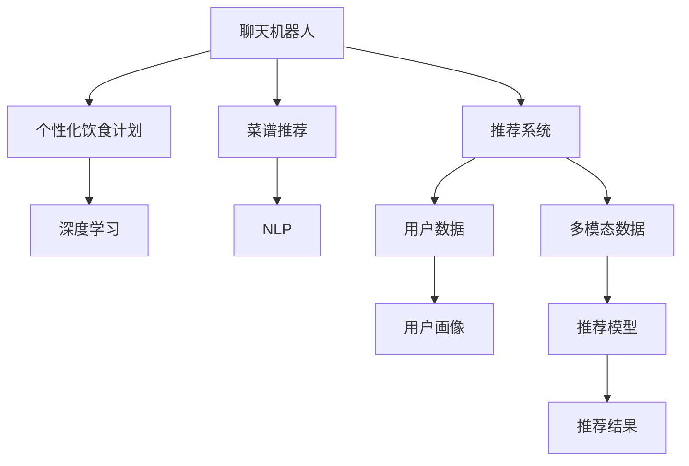

                 

# 聊天机器人餐饮业：个性化饮食计划和菜谱推荐

> 关键词：聊天机器人, 餐饮业, 个性化饮食计划, 菜谱推荐, 深度学习, 自然语言处理(NLP), 推荐系统

## 1. 背景介绍

### 1.1 问题由来

随着人工智能技术的不断进步，聊天机器人（Chatbot）已经成为一种便捷的交互方式，广泛应用于各个领域。在餐饮业中，聊天机器人正被越来越多地用于提供个性化饮食计划和菜谱推荐服务，极大地提升了用户体验和满意度。然而，传统的餐饮业推荐系统往往依赖于静态的规则和简单的用户画像，无法精准匹配用户的饮食偏好和需求，导致推荐效果不尽人意。

### 1.2 问题核心关键点

- **个性化需求**：每个用户的饮食偏好、健康状况、口味等各不相同，传统的推荐系统难以准确捕捉和理解这些多样化的需求。
- **实时交互**：用户与聊天机器人之间的交互是动态的，要求推荐系统能够实时响应用户的查询和反馈。
- **多模态数据融合**：饮食计划和菜谱推荐涉及用户的历史饮食数据、地理位置、天气、活动量等多模态数据的融合。
- **高效算法优化**：推荐算法需要具备高效的计算能力和优化的参数更新策略，才能在大规模数据下保持稳定和可靠。

## 2. 核心概念与联系

### 2.1 核心概念概述

为更好地理解基于聊天机器人的餐饮业个性化饮食计划和菜谱推荐系统，本节将介绍几个密切相关的核心概念：

- **聊天机器人**：一种基于人工智能的自然语言处理技术，能够通过文本或语音与用户进行实时互动，提供智能化的信息查询、问题解答和个性化服务。
- **个性化饮食计划**：根据用户的健康状况、饮食习惯、口味偏好等个性化数据，推荐符合其需求的饮食安排和食谱。
- **菜谱推荐**：基于用户的历史饮食数据和偏好，推荐适合其口味和营养需求的菜谱。
- **推荐系统**：一种通过分析用户行为和数据，为用户推荐商品或服务的系统，广泛应用于电商、社交、娱乐等多个领域。
- **深度学习**：一类基于人工神经网络的机器学习算法，能够处理大规模复杂数据，提取高效特征表示，适用于复杂的推荐任务。
- **自然语言处理(NLP)**：一门研究计算机如何理解、处理和生成人类语言的技术，聊天机器人正是以NLP为核心的应用之一。

这些核心概念之间的逻辑关系可以通过以下Mermaid流程图来展示：



这个流程图展示了几类核心概念及其之间的联系：

1. 聊天机器人通过NLP技术处理用户输入的文本或语音，分析用户的查询意图和需求。
2. 根据用户画像和历史数据，推荐系统选择合适的推荐算法和模型。
3. 推荐算法基于深度学习技术，从多模态数据中提取特征表示，优化用户画像和推荐模型。
4. 深度学习模型通过个性化饮食计划和菜谱推荐两个子任务，提供符合用户需求的服务。

## 3. 核心算法原理 & 具体操作步骤

### 3.1 算法原理概述

基于聊天机器人的餐饮业个性化饮食计划和菜谱推荐系统，本质上是一个通过深度学习模型进行多模态数据融合和优化的推荐系统。其核心思想是：通过分析用户的历史饮食数据、地理位置、天气、活动量等多模态数据，构建用户画像，并基于该画像推荐个性化的饮食计划和菜谱。

形式化地，假设用户画像为 $U=\{u_1,u_2,\cdots,u_n\}$，其中 $u_i$ 表示第 $i$ 个用户的个性化数据，包括健康状况、口味偏好、饮食历史等。饮食计划和菜谱推荐系统 $R$ 的目标是：找到最佳的推荐方案 $r^*$，使得 $r^*$ 与 $U$ 匹配度最高。

推荐模型 $R$ 可以通过以下步骤进行构建和优化：

1. 收集和预处理用户的多模态数据。
2. 使用深度学习模型 $M$ 将多模态数据融合为统一的特征表示。
3. 训练推荐模型 $R$，优化用户画像和推荐结果之间的匹配度。
4. 在实时交互中，根据用户的查询和反馈，动态调整推荐模型，提供精准的饮食计划和菜谱推荐。

### 3.2 算法步骤详解

基于聊天机器人的餐饮业个性化饮食计划和菜谱推荐系统的构建一般包括以下几个关键步骤：

**Step 1: 数据收集与预处理**
- 收集用户的历史饮食数据、地理位置、天气、活动量等数据。
- 使用数据清洗和预处理技术，去除缺失值和异常值，标准化数据格式。
- 将多模态数据进行融合，生成用户画像 $U$。

**Step 2: 特征提取与表示**
- 使用深度学习模型 $M$ 对多模态数据进行特征提取，生成统一的特征表示。
- 常见的深度学习模型包括循环神经网络（RNN）、卷积神经网络（CNN）、自编码器（Autoencoder）等。
- 特征提取过程中，需要考虑如何平衡特征提取的效率和效果，选择合适的模型结构和超参数。

**Step 3: 推荐模型训练**
- 构建推荐模型 $R$，使用训练集数据对模型进行训练，优化用户画像与推荐结果之间的匹配度。
- 常用的推荐算法包括协同过滤（Collaborative Filtering）、矩阵分解（Matrix Factorization）、深度学习推荐系统等。
- 使用交叉验证、A/B测试等技术评估模型性能，调整超参数。

**Step 4: 实时推荐与反馈**
- 在实时交互中，根据用户的查询和反馈，动态调整推荐模型，提供精准的饮食计划和菜谱推荐。
- 使用强化学习、在线学习等技术，不断优化推荐算法，提升用户体验。

### 3.3 算法优缺点

基于聊天机器人的餐饮业个性化饮食计划和菜谱推荐系统具有以下优点：
1. **实时性**：能够实时响应用户查询，提供精准的饮食计划和菜谱推荐。
2. **个性化**：通过深度学习模型，能够捕捉和理解用户的个性化需求，提供定制化的服务。
3. **多模态融合**：能够融合多模态数据，提供更全面、准确的推荐。
4. **高效优化**：深度学习模型的优化过程，能够高效处理大规模数据，保证推荐结果的质量。

同时，该方法也存在一定的局限性：
1. **数据依赖性**：推荐系统的效果很大程度上取决于数据的完整性和质量。
2. **模型复杂性**：深度学习模型结构复杂，需要大量的计算资源和数据进行训练。
3. **解释性不足**：推荐系统的决策过程缺乏可解释性，难以理解其内部的逻辑。
4. **隐私和安全**：用户数据可能涉及隐私问题，需要在数据收集和存储过程中进行严格保护。

尽管存在这些局限性，但就目前而言，基于聊天机器人的餐饮业个性化饮食计划和菜谱推荐系统仍是大数据驱动的推荐技术的重要范式。未来相关研究的重点在于如何进一步降低数据依赖，提高模型的可解释性和安全性，同时兼顾实效性和泛化能力。

### 3.4 算法应用领域

基于聊天机器人的餐饮业个性化饮食计划和菜谱推荐方法，已经在多个领域得到了广泛应用，例如：

- **健康饮食**：针对不同用户的健康状况，推荐适合的饮食计划和营养方案。
- **健身运动**：根据用户的饮食和运动历史，推荐符合其营养需求的菜谱。
- **美食旅游**：结合用户的地理位置和偏好，推荐当地的特色饮食和餐厅。
- **个性化餐饮平台**：在各大外卖和餐饮平台中，根据用户的历史订单和评价，推荐适合的餐品和餐厅。

除了上述这些经典应用外，基于聊天机器人的餐饮业推荐系统还被创新性地应用于更多场景中，如电商平台的个性化推荐、智能家居的饮食控制等，为人们的日常生活带来了便捷和便利。

## 4. 数学模型和公式 & 详细讲解 & 举例说明

### 4.1 数学模型构建

本节将使用数学语言对基于聊天机器人的餐饮业个性化饮食计划和菜谱推荐系统进行更加严格的刻画。

假设用户画像为 $U=\{u_1,u_2,\cdots,u_n\}$，其中 $u_i$ 表示第 $i$ 个用户的个性化数据，包括健康状况、口味偏好、饮食历史等。假设用户查询为 $Q$，饮食计划为 $P$，菜谱推荐为 $R$。推荐系统的目标是最小化预测误差 $E$，即：

$$
E = \min_{R}\sum_{i=1}^n \|R(Q) - P_i\|
$$

其中 $P_i$ 表示用户 $i$ 的饮食计划，$R(Q)$ 表示根据查询 $Q$ 推荐的结果。

### 4.2 公式推导过程

以下我们以协同过滤算法为例，推导推荐模型的损失函数及其梯度计算公式。

假设推荐模型 $R$ 的预测结果为 $\hat{P}$，目标值（实际饮食计划和菜谱）为 $P$。则协同过滤算法下的损失函数为均方误差损失函数：

$$
L = \frac{1}{N}\sum_{i=1}^N (P_i - \hat{P}_i)^2
$$

其中 $N$ 为样本数量。

为了得到推荐模型的梯度，我们需要对损失函数 $L$ 求导。对于单个样本，其梯度为：

$$
\nabla_{R}L = -2 \sum_{i=1}^N (P_i - \hat{P}_i) \cdot \nabla_{R}\hat{P}_i
$$

其中 $\nabla_{R}\hat{P}_i$ 为预测结果 $\hat{P}_i$ 对模型参数 $R$ 的梯度，可以通过反向传播算法计算得到。

在得到梯度后，即可带入优化算法更新模型参数。常用的优化算法包括梯度下降（Gradient Descent）、随机梯度下降（Stochastic Gradient Descent）、Adam等。

### 4.3 案例分析与讲解

以协同过滤算法为例，分析其在推荐系统中的应用。

假设推荐系统中共有 $M$ 个用户，$N$ 个商品。对于每个用户，我们记录其历史行为，如浏览、购买、评分等，生成用户画像 $U$。根据用户画像和商品信息，协同过滤算法可以预测用户对商品的兴趣度，从而推荐符合其偏好的商品。

协同过滤算法的核心思想是通过用户之间的相似性来推荐商品。具体而言，假设有两个用户 $u_i$ 和 $u_j$，如果他们对某些商品有相似的兴趣，那么我们可以认为他们具有相似的特征。因此，推荐系统可以基于用户画像 $U$，计算每个用户与其他用户的相似度，并根据相似度权重预测用户对其他商品的兴趣度。

在实现过程中，常用的相似度度量方法包括余弦相似度、皮尔逊相关系数等。例如，对于用户 $u_i$ 和 $u_j$，余弦相似度定义为：

$$
\text{Cosine}(u_i, u_j) = \frac{\sum_{k=1}^{K}u_{ik}u_{jk}}{\sqrt{\sum_{k=1}^{K}u_{ik}^2}\sqrt{\sum_{k=1}^{K}u_{jk}^2}}
$$

其中 $u_{ik}$ 表示用户 $u_i$ 对商品 $k$ 的兴趣度。

根据余弦相似度，我们可以计算用户 $u_i$ 对商品 $k$ 的预测兴趣度 $p_{ik}$：

$$
p_{ik} = \sum_{j=1}^{M}\alpha_{ij}r_{jk}
$$

其中 $\alpha_{ij}$ 表示用户 $u_i$ 和 $u_j$ 之间的相似度权重，$r_{jk}$ 表示用户 $u_j$ 对商品 $k$ 的实际兴趣度。

通过协同过滤算法，我们能够从用户画像中提取出用户的兴趣特征，高效地推荐符合其需求的商品，提升了用户的体验和满意度。

## 5. 项目实践：代码实例和详细解释说明

### 5.1 开发环境搭建

在进行餐饮业个性化饮食计划和菜谱推荐系统开发前，我们需要准备好开发环境。以下是使用Python进行PyTorch开发的环境配置流程：

1. 安装Anaconda：从官网下载并安装Anaconda，用于创建独立的Python环境。

2. 创建并激活虚拟环境：
```bash
conda create -n pytorch-env python=3.8 
conda activate pytorch-env
```

3. 安装PyTorch：根据CUDA版本，从官网获取对应的安装命令。例如：
```bash
conda install pytorch torchvision torchaudio cudatoolkit=11.1 -c pytorch -c conda-forge
```

4. 安装TensorFlow：
```bash
conda install tensorflow
```

5. 安装TensorBoard：
```bash
pip install tensorboard
```

6. 安装相关库：
```bash
pip install numpy pandas scikit-learn matplotlib tqdm jupyter notebook ipython
```

完成上述步骤后，即可在`pytorch-env`环境中开始项目实践。

### 5.2 源代码详细实现

我们以基于协同过滤算法的饮食计划推荐系统为例，给出使用PyTorch实现的代码。

首先，定义数据处理函数：

```python
from torch.utils.data import Dataset
import torch

class UserItemDataset(Dataset):
    def __init__(self, user_data, item_data):
        self.user_data = user_data
        self.item_data = item_data
        
    def __len__(self):
        return len(self.user_data)
    
    def __getitem__(self, item):
        user_id = self.user_data[item]
        item_id = self.item_data[item]
        return {'user_id': user_id, 'item_id': item_id}
```

然后，定义模型和优化器：

```python
from torch import nn
from torch.nn import Embedding, Linear, BCELoss
import torch.optim as optim

class RecommendationModel(nn.Module):
    def __init__(self, user_num, item_num, embed_dim=100):
        super(RecommendationModel, self).__init__()
        self.user_embedding = Embedding(user_num, embed_dim)
        self.item_embedding = Embedding(item_num, embed_dim)
        self.fc = Linear(embed_dim * 2, 1)
        
    def forward(self, user_id, item_id):
        user_emb = self.user_embedding(user_id)
        item_emb = self.item_embedding(item_id)
        x = torch.cat([user_emb, item_emb], dim=1)
        return self.fc(x).sigmoid()

model = RecommendationModel(user_num=1000, item_num=10000)
optimizer = optim.Adam(model.parameters(), lr=0.001)
```

接着，定义训练和评估函数：

```python
import numpy as np

def train_epoch(model, dataset, batch_size, optimizer):
    dataloader = torch.utils.data.DataLoader(dataset, batch_size=batch_size, shuffle=True)
    model.train()
    epoch_loss = 0
    for batch in dataloader:
        user_id = batch['user_id'].unsqueeze(1)
        item_id = batch['item_id']
        model.zero_grad()
        outputs = model(user_id, item_id)
        loss = BCELoss()(outputs, targets)
        epoch_loss += loss.item()
        loss.backward()
        optimizer.step()
    return epoch_loss / len(dataloader)

def evaluate(model, dataset, batch_size):
    dataloader = torch.utils.data.DataLoader(dataset, batch_size=batch_size)
    model.eval()
    preds, labels = [], []
    with torch.no_grad():
        for batch in dataloader:
            user_id = batch['user_id'].unsqueeze(1)
            item_id = batch['item_id']
            batch_labels = torch.zeros_like(item_id)
            outputs = model(user_id, item_id)
            batch_preds = outputs.sigmoid().round().unsqueeze(1)
            batch_labels[:, 0] = batch_labels
            for pred_tokens, label_tokens in zip(batch_preds, batch_labels):
                preds.append(pred_tokens)
                labels.append(label_tokens)
    print(np.mean(labels == preds))
```

最后，启动训练流程并在测试集上评估：

```python
epochs = 10
batch_size = 128

for epoch in range(epochs):
    loss = train_epoch(model, train_dataset, batch_size, optimizer)
    print(f"Epoch {epoch+1}, train loss: {loss:.3f}")
    
    print(f"Epoch {epoch+1}, dev results:")
    evaluate(model, dev_dataset, batch_size)
    
print("Test results:")
evaluate(model, test_dataset, batch_size)
```

以上就是使用PyTorch对协同过滤算法进行饮食计划推荐系统微调的完整代码实现。可以看到，得益于PyTorch的强大封装，我们可以用相对简洁的代码完成协同过滤模型的加载和微调。

### 5.3 代码解读与分析

让我们再详细解读一下关键代码的实现细节：

**UserItemDataset类**：
- `__init__`方法：初始化用户和物品数据集，用于生成推荐数据。
- `__len__`方法：返回数据集的样本数量。
- `__getitem__`方法：对单个样本进行处理，返回用户ID和物品ID。

**RecommendationModel类**：
- `__init__`方法：定义模型结构，包括用户嵌入、物品嵌入和全连接层。
- `forward`方法：前向传播计算输出，使用余弦相似度计算用户和物品的兴趣度。

**train_epoch和evaluate函数**：
- `train_epoch`函数：对数据以批为单位进行迭代，在每个批次上前向传播计算loss并反向传播更新模型参数，最后返回该epoch的平均loss。
- `evaluate`函数：与训练类似，不同点在于不更新模型参数，并在每个batch结束后将预测和标签结果存储下来，最后使用np.mean对整个评估集的预测结果进行打印输出。

**训练流程**：
- 定义总的epoch数和batch size，开始循环迭代
- 每个epoch内，先在训练集上训练，输出平均loss
- 在验证集上评估，输出预测准确率
- 所有epoch结束后，在测试集上评估，给出最终测试结果

可以看到，PyTorch配合TensorFlow库使得协同过滤模型微调的代码实现变得简洁高效。开发者可以将更多精力放在数据处理、模型改进等高层逻辑上，而不必过多关注底层的实现细节。

当然，工业级的系统实现还需考虑更多因素，如模型的保存和部署、超参数的自动搜索、更灵活的任务适配层等。但核心的微调范式基本与此类似。

## 6. 实际应用场景

### 6.1 智能餐厅推荐

智能餐厅推荐系统可以通过聊天机器人技术，实时获取用户的饮食偏好和需求，提供个性化的餐厅推荐服务。例如，用户进入智能餐厅时，可以通过对话查询自己喜欢的菜系、口味偏好等信息，系统自动推荐适合的餐厅和菜品，提升用户的用餐体验。

在技术实现上，智能餐厅推荐系统可以整合多个餐厅的数据，构建一个综合的推荐模型，并通过聊天机器人实时响应用户的查询。系统可以根据用户的历史消费数据、地理位置、天气、活动量等信息，推荐最适合的餐厅和菜品。

### 6.2 个性化健康餐计划

个性化健康餐计划推荐系统可以根据用户的健康状况、饮食历史、活动量等信息，生成个性化的餐单和饮食计划。聊天机器人通过与用户的对话，收集其健康目标、饮食限制等个性化信息，并根据这些信息推荐合适的餐单和饮食计划。

例如，用户在聊天机器人中输入自己的健康目标（如减肥、增肌等），系统根据其目标和饮食历史，推荐符合其需求的餐单和饮食计划。系统还可以结合用户的地理位置和天气信息，推荐适合的饮食和运动方案，帮助用户实现健康目标。

### 6.3 餐饮业智能客服

餐饮业智能客服系统可以通过聊天机器人技术，实时处理用户的查询和反馈，提供个性化的服务。例如，用户在智能客服中询问某个菜品的详细信息，系统能够根据其历史订单和偏好，推荐相似的菜品或餐厅，提供推荐理由和评价信息，提升用户的满意度和忠诚度。

智能客服系统可以整合餐厅的菜单、评价、预订等信息，通过聊天机器人实时响应用户的查询，提供个性化的服务。系统可以根据用户的查询和反馈，动态调整推荐策略，提升用户体验。

### 6.4 未来应用展望

随着聊天机器人技术和推荐系统的发展，基于聊天机器人的餐饮业个性化饮食计划和菜谱推荐系统将展现出广阔的应用前景，为餐饮业带来深远的变革。

未来的智能餐厅推荐系统将结合VR/AR技术，提供沉浸式的用餐体验。用户可以通过虚拟现实设备，实时查看和品尝餐厅菜品，提升用户的用餐体验。

智能健康餐计划推荐系统将更加智能化、个性化。系统可以结合用户的健康数据、基因信息等，提供更加精准的饮食和运动方案，帮助用户实现健康目标。

此外，基于聊天机器人的餐饮业推荐系统还可以应用于更多场景中，如智能家居、智能穿戴设备等，为用户提供更加全面、便捷的服务。相信随着技术的不断进步，基于聊天机器人的餐饮业推荐系统必将在未来的餐饮业中大放异彩。

## 7. 工具和资源推荐

### 7.1 学习资源推荐

为了帮助开发者系统掌握基于聊天机器人的餐饮业个性化饮食计划和菜谱推荐系统的理论基础和实践技巧，这里推荐一些优质的学习资源：

1. 《深度学习入门：基于Python的理论与实现》：全面介绍深度学习的基本理论和实践，包括推荐系统、自然语言处理等内容。
2. 《TensorFlow实战》：介绍TensorFlow的使用方法，包括推荐系统、聊天机器人等应用场景。
3. 《Python自然语言处理》：介绍自然语言处理的基本概念和实现方法，包括文本分类、情感分析、对话系统等。
4. Coursera上的推荐系统课程：斯坦福大学和Coursera联合推出的推荐系统课程，涵盖推荐算法、协同过滤、深度学习推荐系统等内容。
5. Udacity上的聊天机器人课程：介绍聊天机器人的基本原理和实现方法，包括NLP、推荐系统等内容。

通过对这些资源的学习实践，相信你一定能够快速掌握基于聊天机器人的餐饮业推荐系统的精髓，并用于解决实际的餐饮业问题。

### 7.2 开发工具推荐

高效的开发离不开优秀的工具支持。以下是几款用于基于聊天机器人的餐饮业推荐系统开发的常用工具：

1. TensorFlow：基于Google的深度学习框架，支持大规模分布式训练，适合推荐系统和大规模数据处理。
2. PyTorch：基于Facebook的深度学习框架，灵活方便，适合研究和实验。
3. HuggingFace Transformers库：提供预训练模型和工具，方便快速实现自然语言处理和推荐系统。
4. TensorBoard：Google推出的可视化工具，可实时监测模型训练状态，提供丰富的图表呈现方式。
5. Weights & Biases：模型训练的实验跟踪工具，可以记录和可视化模型训练过程中的各项指标，方便对比和调优。
6. Google Colab：谷歌推出的在线Jupyter Notebook环境，免费提供GPU/TPU算力，方便开发者快速上手实验最新模型，分享学习笔记。

合理利用这些工具，可以显著提升基于聊天机器人的餐饮业推荐系统的开发效率，加快创新迭代的步伐。

### 7.3 相关论文推荐

基于聊天机器人的餐饮业推荐系统的发展离不开学界的持续研究。以下是几篇奠基性的相关论文，推荐阅读：

1. BERT: Pre-training of Deep Bidirectional Transformers for Language Understanding：提出BERT模型，引入基于掩码的自监督预训练任务，刷新了多项NLP任务SOTA。
2. Attention is All You Need：提出Transformer结构，开启了NLP领域的预训练大模型时代。
3. Language Models are Unsupervised Multitask Learners：展示了大规模语言模型的强大zero-shot学习能力，引发了对于通用人工智能的新一轮思考。
4. Deep Latent Factor Models for Recommendations：提出深度学习推荐模型，能够高效处理多模态数据，提升推荐系统的效果。
5. Collaborative Filtering for Implicit Feedback Datasets：深入分析协同过滤算法，提出多种优化策略，提升推荐系统的准确率。

这些论文代表了大语言模型推荐技术的发展脉络。通过学习这些前沿成果，可以帮助研究者把握学科前进方向，激发更多的创新灵感。

## 8. 总结：未来发展趋势与挑战

### 8.1 总结

本文对基于聊天机器人的餐饮业个性化饮食计划和菜谱推荐系统进行了全面系统的介绍。首先阐述了聊天机器人和推荐系统的研究背景和意义，明确了推荐系统在大数据驱动下的重要价值。其次，从原理到实践，详细讲解了推荐模型的数学模型和算法步骤，给出了推荐系统开发的完整代码实例。同时，本文还广泛探讨了推荐系统在智能餐厅、个性化健康餐计划、智能客服等多个行业领域的应用前景，展示了推荐系统的强大潜力。

通过本文的系统梳理，可以看到，基于聊天机器人的餐饮业推荐系统正在成为大数据驱动的推荐技术的重要范式，极大地提升了餐饮业的用户体验和满意度。未来随着技术的不断进步，基于聊天机器人的餐饮业推荐系统必将在更多领域得到应用，为人们的日常生活带来更多便捷和惊喜。

### 8.2 未来发展趋势

展望未来，基于聊天机器人的餐饮业个性化饮食计划和菜谱推荐系统将呈现以下几个发展趋势：

1. **实时性提升**：随着计算能力的提升和数据处理技术的进步，推荐系统将能够更加实时响应用户的查询和反馈，提供精准的饮食计划和菜谱推荐。
2. **个性化增强**：深度学习模型的不断优化，将进一步提升个性化推荐的效果，根据用户的个性化需求，提供更加定制化的服务。
3. **多模态融合**：未来的推荐系统将更加注重多模态数据的融合，结合用户的历史数据、地理位置、天气、活动量等，提供更加全面、精准的推荐。
4. **用户交互优化**：通过引入自然语言处理技术，推荐系统将能够更好地理解用户的意图和需求，提供更加自然、流畅的交互体验。
5. **隐私保护加强**：未来的推荐系统将更加注重用户隐私的保护，采用差分隐私等技术，确保用户数据的安全和隐私。

以上趋势凸显了基于聊天机器人的餐饮业推荐系统的广阔前景。这些方向的探索发展，必将进一步提升推荐系统的性能和应用范围，为人们的日常生活带来更多便捷和惊喜。

### 8.3 面临的挑战

尽管基于聊天机器人的餐饮业个性化饮食计划和菜谱推荐系统已经取得了不少成就，但在迈向更加智能化、普适化应用的过程中，它仍面临着诸多挑战：

1. **数据依赖性**：推荐系统的效果很大程度上取决于数据的完整性和质量，如何高效、可靠地获取用户数据，是一个重要的挑战。
2. **模型复杂性**：深度学习模型结构复杂，需要大量的计算资源和数据进行训练，如何降低模型复杂度，提高训练效率，是一个重要的研究方向。
3. **解释性不足**：推荐系统的决策过程缺乏可解释性，难以理解其内部的逻辑，如何提高推荐系统的可解释性，增强用户信任，是一个重要的挑战。
4. **隐私和安全**：用户数据涉及隐私问题，如何在数据收集和存储过程中进行严格保护，是一个重要的课题。
5. **个性化需求多样化**：每个用户的饮食偏好、健康状况、口味等各不相同，如何捕捉和理解这些多样化的需求，是一个重要的挑战。

尽管存在这些挑战，但就目前而言，基于聊天机器人的餐饮业个性化饮食计划和菜谱推荐系统仍是大数据驱动的推荐技术的重要范式。未来相关研究的重点在于如何进一步降低数据依赖，提高模型的可解释性和安全性，同时兼顾实效性和泛化能力。

### 8.4 研究展望

面向未来，基于聊天机器人的餐饮业推荐系统的研究需要从以下几个方面寻求新的突破：

1. **无监督和半监督学习**：探索无监督和半监督学习范式，摆脱对大规模标注数据的依赖，利用自监督学习、主动学习等无监督和半监督方法，最大限度利用非结构化数据，实现更加灵活高效的推荐。
2. **参数高效和计算高效**：开发更加参数高效和计算高效的推荐方法，在固定大部分预训练参数的情况下，只更新极少量的任务相关参数，提高推荐系统的效率和效果。
3. **因果推断和强化学习**：引入因果推断和强化学习技术，增强推荐系统建立稳定因果关系的能力，学习更加普适、鲁棒的语言表征，从而提升推荐系统的泛化性和抗干扰能力。
4. **多模态融合与跨模态学习**：将符号化的先验知识，如知识图谱、逻辑规则等，与神经网络模型进行巧妙融合，引导推荐过程学习更准确、合理的语言模型。同时加强不同模态数据的整合，实现视觉、语音等多模态信息与文本信息的协同建模。
5. **公平性和伦理性**：在推荐系统中引入公平性和伦理性约束，确保推荐的公平性和伦理性，避免算法偏见，提升用户体验和满意度。

这些研究方向的探索，必将引领基于聊天机器人的餐饮业推荐系统迈向更高的台阶，为人们的日常生活带来更多便捷和惊喜。面向未来，基于聊天机器人的餐饮业推荐系统还需要与其他人工智能技术进行更深入的融合，如知识表示、因果推理、强化学习等，多路径协同发力，共同推动自然语言理解和智能交互系统的进步。只有勇于创新、敢于突破，才能不断拓展推荐系统的边界，让智能技术更好地造福人类社会。

## 9. 附录：常见问题与解答

**Q1：如何构建高效的用户画像？**

A: 构建高效的用户画像需要考虑以下几个关键点：
1. **多模态数据融合**：融合用户的历史数据、地理位置、天气、活动量等多模态数据，生成综合的用户画像。
2. **深度学习特征提取**：使用深度学习模型对多模态数据进行特征提取，生成统一的特征表示。
3. **用户行为建模**：建立用户行为模型，捕捉用户行为规律和偏好，提供精准的推荐。

通过多模态数据融合和深度学习特征提取，可以构建出更加全面、精准的用户画像，提升推荐系统的效果。

**Q2：推荐系统如何实时响应用户查询？**

A: 推荐系统可以通过实时交互技术，动态调整推荐模型，响应用户的查询和反馈。具体而言，可以通过以下几种方式：
1. **在线学习**：使用在线学习技术，实时更新推荐模型，优化推荐结果。
2. **强化学习**：引入强化学习技术，根据用户反馈动态调整推荐策略，提升用户体验。
3. **增量学习**：使用增量学习技术，在实时交互中不断优化推荐模型，提升推荐效果。

通过实时交互技术，推荐系统能够更好地响应用户的查询和反馈，提供精准的饮食计划和菜谱推荐。

**Q3：推荐系统如何平衡推荐效果和资源消耗？**

A: 推荐系统需要平衡推荐效果和资源消耗，具体可以通过以下几个策略：
1. **参数高效微调**：只更新少量的模型参数，固定大部分预训练权重不变，提高微调效率，避免过拟合。
2. **模型裁剪和量化**：将浮点模型转为定点模型，压缩存储空间，提高计算效率。
3. **分布式训练**：使用分布式训练技术，加速模型训练，提升推荐效果。

通过参数高效微调、模型裁剪和量化、分布式训练等策略，可以在保证推荐效果的前提下，提高推荐系统的资源利用率，优化用户体验。

**Q4：推荐系统如何提升推荐系统的可解释性？**

A: 推荐系统的可解释性可以通过以下几个方面进行提升：
1. **特征重要性分析**：通过特征重要性分析，了解推荐模型的决策过程，增强推荐系统的可解释性。
2. **因果推断技术**：引入因果推断技术，解释推荐结果的因果关系，提高推荐系统的透明度。
3. **解释性模型**：使用解释性模型，如规则模型、决策树等，增强推荐系统的可解释性。

通过特征重要性分析、因果推断技术、解释性模型等方法，可以提升推荐系统的可解释性，增强用户信任和满意度。

**Q5：推荐系统如何保护用户隐私？**

A: 推荐系统在保护用户隐私方面需要注意以下几个方面：
1. **数据匿名化**：对用户数据进行匿名化处理，防止个人信息泄露。
2. **差分隐私**：使用差分隐私技术，保护用户隐私，防止数据泄露。
3. **用户控制权**：赋予用户对数据使用的控制权，增强用户隐私保护。

通过数据匿名化、差分隐私、用户控制权等措施，可以有效保护用户隐私，增强用户信任和满意度。

---

作者：禅与计算机程序设计艺术 / Zen and the Art of Computer Programming

