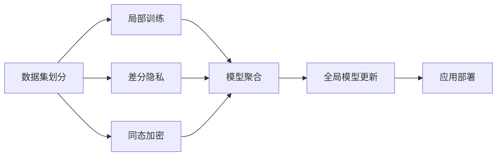

                 

## 1. 背景介绍

### 1.1 问题由来

随着城市化进程的加速，交通拥堵、环境污染、能源浪费等问题日益凸显。智能交通系统（Intelligent Transportation System, ITS）的建设，成为缓解城市交通问题的有效途径。智能交通系统依托互联网、大数据、人工智能等先进技术，通过实时监测、数据融合、路径优化、智能决策等手段，提升交通管理效率，改善城市交通环境，保障出行安全。

在智能交通系统中，数据是最核心的资产之一。为了保障数据隐私和安全，对数据的收集、存储、处理和分析必须遵循严格的安全规范。联邦学习（Federated Learning, FL）作为新兴的隐私保护学习范式，能够在不泄露数据的前提下，通过分布式的方式在多个参与者之间协同训练模型，具有广阔的应用前景。

### 1.2 问题核心关键点

联邦学习是一种分布式机器学习范式，它允许多个设备或节点在没有共享本地数据的情况下，联合训练一个全局模型。每个节点利用本地数据进行局部训练，并通过交换模型参数的方式实现全球模型参数的更新。这种分布式训练方式，使得联邦学习在保护数据隐私的同时，可以有效利用本地数据的优势，提升全局模型的性能。

联邦学习在智能交通系统中的应用，主要体现在以下几个方面：

1. **交通流量预测**：通过联邦学习模型，可以综合多个城市不同路段的交通流量数据，实现对未来交通流量的精准预测，从而优化信号灯控制和路况管理。
2. **路径规划与优化**：利用联邦学习模型，可以在不同城市的出行数据中提取出通用的交通路径信息，优化出行路线，减少拥堵和能源消耗。
3. **事件检测与预警**：通过联邦学习模型，可以联合多个城市的监控摄像头数据，实时检测交通违规和异常事件，及时发出预警，提升交通管理的安全性。
4. **智能车辆协作**：联邦学习模型可以在车联网中发挥重要作用，通过联合车辆数据，实现车辆的协同决策和路径规划，提升智能车辆的安全性和效率。

### 1.3 问题研究意义

联邦学习在智能交通系统中的应用，具有重要意义：

1. **数据隐私保护**：联邦学习通过分布式训练方式，使得模型参数在本地训练和交换的过程中，数据不被泄露，有效保障了数据隐私和安全。
2. **提高模型性能**：联邦学习可以充分利用本地数据的优势，提升全局模型的泛化能力和性能，更好地适应复杂的交通场景。
3. **减少计算成本**：联邦学习可以分布式训练模型，避免在单个中心服务器上进行大规模计算，减少了计算成本和资源消耗。
4. **提升系统可靠性**：联邦学习可以在多个节点间协同训练模型，提升了系统整体的鲁棒性和可靠性，减少了单点故障的风险。

## 2. 核心概念与联系

### 2.1 核心概念概述

为了更好地理解联邦学习在智能交通系统中的应用，我们需要先介绍几个核心概念：

- **联邦学习**：一种分布式机器学习范式，允许多个设备或节点在没有共享本地数据的情况下，联合训练一个全局模型。
- **数据集划分**：将全局数据集划分为多个本地数据集，每个节点仅访问本地数据集，进行局部训练。
- **模型聚合**：将各个节点的模型参数汇总，更新全局模型的参数。
- **模型隐私保护**：通过差分隐私、同态加密等技术，保护模型训练过程中的数据隐私。
- **联邦学习框架**：如TensorFlow Federated（TFF）、PySyft等，提供了联邦学习模型的封装和优化工具。

### 2.2 核心概念原理和架构的 Mermaid 流程图



这个流程图展示了联邦学习的核心流程：首先对数据进行划分，每个节点进行局部训练；然后通过模型聚合，更新全局模型参数；最后部署全局模型进行应用。在模型聚合过程中，可以引入差分隐私、同态加密等技术，保护数据隐私。

## 3. 核心算法原理 & 具体操作步骤

### 3.1 算法原理概述

联邦学习的核心思想是通过分布式的方式，联合多个设备或节点的数据，共同训练一个全局模型。其基本流程包括：

1. **数据集划分**：将全局数据集划分为多个本地数据集，每个节点仅访问本地数据集，进行局部训练。
2. **局部模型训练**：在每个本地数据集上，训练一个局部模型，得到局部模型参数。
3. **模型聚合**：将各个节点的局部模型参数汇总，更新全局模型的参数。
4. **全局模型更新**：根据聚合后的全局模型参数，更新全局模型。
5. **应用部署**：部署全局模型进行实际应用，如交通流量预测、路径优化等。

### 3.2 算法步骤详解

联邦学习在智能交通系统中的应用，主要分为以下几个步骤：

**Step 1: 数据集划分**

首先需要将全局交通数据集划分为多个本地数据集。划分方式可以采用空间划分、时间划分、用户划分等，根据实际应用场景选择合适的划分方式。

**Step 2: 本地模型训练**

在每个本地数据集上，利用联邦学习框架进行局部模型的训练。常用的联邦学习框架包括TensorFlow Federated（TFF）、PySyft等。

**Step 3: 模型聚合**

将各个节点的局部模型参数汇总，更新全局模型的参数。聚合方式包括模型参数的平均值、加权平均值、梯度平均值等。

**Step 4: 全局模型更新**

根据聚合后的全局模型参数，更新全局模型。更新方式包括使用全局模型参数覆盖局部模型参数，或通过加权融合的方式更新全局模型。

**Step 5: 应用部署**

部署全局模型进行实际应用，如交通流量预测、路径优化等。在应用过程中，需要根据实时数据进行模型更新，保证模型输出的准确性和实时性。

### 3.3 算法优缺点

联邦学习在智能交通系统中的应用，具有以下优点：

1. **数据隐私保护**：联邦学习通过分布式训练方式，使得模型参数在本地训练和交换的过程中，数据不被泄露，有效保障了数据隐私和安全。
2. **提高模型性能**：联邦学习可以充分利用本地数据的优势，提升全局模型的泛化能力和性能，更好地适应复杂的交通场景。
3. **减少计算成本**：联邦学习可以分布式训练模型，避免在单个中心服务器上进行大规模计算，减少了计算成本和资源消耗。
4. **提升系统可靠性**：联邦学习可以在多个节点间协同训练模型，提升了系统整体的鲁棒性和可靠性，减少了单点故障的风险。

同时，联邦学习也存在以下缺点：

1. **通信开销大**：在模型参数交换过程中，需要频繁的通信，增加了通信开销和延迟。
2. **本地数据质量影响全局模型**：如果某个节点的数据质量较差，可能会影响全局模型的性能。
3. **模型同步困难**：在联邦学习过程中，多个节点需要进行同步，确保模型参数的一致性，增加了复杂度和难度。
4. **差分隐私和安全问题**：如何在保护数据隐私的前提下，保证模型的性能和可靠性，还需要进一步研究和优化。

### 3.4 算法应用领域

联邦学习在智能交通系统中的应用，主要包括以下几个领域：

1. **交通流量预测**：通过联邦学习模型，可以综合多个城市不同路段的交通流量数据，实现对未来交通流量的精准预测，从而优化信号灯控制和路况管理。
2. **路径规划与优化**：利用联邦学习模型，可以在不同城市的出行数据中提取出通用的交通路径信息，优化出行路线，减少拥堵和能源消耗。
3. **事件检测与预警**：通过联邦学习模型，可以联合多个城市的监控摄像头数据，实时检测交通违规和异常事件，及时发出预警，提升交通管理的安全性。
4. **智能车辆协作**：联邦学习模型可以在车联网中发挥重要作用，通过联合车辆数据，实现车辆的协同决策和路径规划，提升智能车辆的安全性和效率。

## 4. 数学模型和公式 & 详细讲解 & 举例说明

### 4.1 数学模型构建

在智能交通系统中，联邦学习模型可以用于交通流量预测、路径规划、事件检测等多个任务。以交通流量预测为例，假设全局数据集为 $\mathcal{D} = \{(x_i, y_i)\}_{i=1}^N$，其中 $x_i$ 为输入特征，$y_i$ 为输出标签。假设每个节点 $k$ 的本地数据集为 $\mathcal{D}_k = \{(x_{ik}, y_{ik})\}_{i=1}^{N_k}$，其中 $N_k$ 为节点 $k$ 的本地数据集大小。

假设全局模型为 $M(\theta)$，本地模型为 $M_k(\theta_k)$。联邦学习模型通过分布式训练，优化全局模型参数 $\theta$ 和节点本地模型参数 $\theta_k$。

### 4.2 公式推导过程

假设联邦学习采用迭代优化算法进行训练，每个节点 $k$ 的本地模型更新公式为：

$$
\theta_k \leftarrow \theta_k - \eta \nabla_{\theta_k}L_k(\theta_k, \mathcal{D}_k)
$$

其中 $\eta$ 为学习率，$L_k(\theta_k, \mathcal{D}_k)$ 为节点 $k$ 的局部损失函数。全局模型的更新公式为：

$$
\theta \leftarrow \theta - \eta \nabla_{\theta}L_g(\theta, \mathcal{D})
$$

其中 $L_g(\theta, \mathcal{D})$ 为全局损失函数。

假设每个节点的局部模型参数 $\theta_k$ 和全局模型参数 $\theta$ 之间存在线性关系，即 $\theta_k = B\theta + \delta_k$，其中 $B$ 为权重矩阵，$\delta_k$ 为噪声向量。则全局模型参数的更新公式为：

$$
\theta \leftarrow \theta - \eta \nabla_{\theta}L_g(\theta, \mathcal{D})
$$

其中 $L_g(\theta, \mathcal{D})$ 为全局损失函数。

### 4.3 案例分析与讲解

假设我们有一个包含多个城市的交通流量数据集，每个城市的数据分为不同的时间段进行划分。我们选择每个城市的若干时间段数据作为本地数据集，每个本地数据集包含5个时间段。

假设我们采用联邦学习模型进行交通流量预测。首先，将全局数据集划分为多个本地数据集，每个本地数据集包含5个时间段的数据。然后，在每个本地数据集上，训练一个局部模型 $M_k(\theta_k)$。假设每个节点 $k$ 的本地数据集大小为 $N_k$，每个节点 $k$ 的本地模型参数为 $\theta_k$。

在每个本地数据集上，利用联邦学习框架进行局部模型的训练，得到局部模型参数 $\theta_k$。然后，将各个节点的局部模型参数汇总，更新全局模型参数 $\theta$。假设每个节点 $k$ 的本地模型参数 $\theta_k$ 和全局模型参数 $\theta$ 之间存在线性关系，即 $\theta_k = B\theta + \delta_k$，其中 $B$ 为权重矩阵，$\delta_k$ 为噪声向量。则全局模型参数的更新公式为：

$$
\theta \leftarrow \theta - \eta \nabla_{\theta}L_g(\theta, \mathcal{D})
$$

其中 $L_g(\theta, \mathcal{D})$ 为全局损失函数。

通过联邦学习模型，可以综合多个城市不同路段的交通流量数据，实现对未来交通流量的精准预测，从而优化信号灯控制和路况管理。

## 5. 项目实践：代码实例和详细解释说明

### 5.1 开发环境搭建

在进行联邦学习实践前，我们需要准备好开发环境。以下是使用Python进行PyTorch开发的环境配置流程：

1. 安装Anaconda：从官网下载并安装Anaconda，用于创建独立的Python环境。

2. 创建并激活虚拟环境：
```bash
conda create -n pytorch-env python=3.8 
conda activate pytorch-env
```

3. 安装PyTorch：根据CUDA版本，从官网获取对应的安装命令。例如：
```bash
conda install pytorch torchvision torchaudio cudatoolkit=11.1 -c pytorch -c conda-forge
```

4. 安装TensorFlow Federated（TFF）库：
```bash
pip install tff
```

5. 安装各类工具包：
```bash
pip install numpy pandas scikit-learn matplotlib tqdm jupyter notebook ipython
```

完成上述步骤后，即可在`pytorch-env`环境中开始联邦学习实践。

### 5.2 源代码详细实现

下面我们以交通流量预测任务为例，给出使用TensorFlow Federated进行联邦学习的PyTorch代码实现。

首先，定义交通流量预测任务的数据处理函数：

```python
import tensorflow_federated as tff
import tensorflow as tf

def preprocess(inputs, labels):
    features, labels = inputs, labels
    return tf.dtypes.cast(features, tf.float32), tf.dtypes.cast(labels, tf.float32)
```

然后，定义联邦学习模型：

```python
class TrafficPredictor(tf.keras.Model):
    def __init__(self, input_shape, output_shape):
        super().__init__()
        self.dense = tf.keras.layers.Dense(64, activation='relu')
        self.output = tf.keras.layers.Dense(output_shape)

    @tf.function
    def call(self, inputs):
        x = self.dense(inputs)
        return self.output(x)
```

接着，定义优化器：

```python
optimizer = tf.keras.optimizers.Adam(learning_rate=0.001)
```

然后，定义联邦学习模型的训练函数：

```python
def train_step(model, dataset):
    def step_fn(next):
        input_fn = lambda: next.repeat(1)
        input_data = tff.model.experimental.builder.build(input_fn)
        return model(input_data), tf.keras.losses.MeanSquaredError()(model(input_data), next)
    
    train_result = tff.learning联邦平均(
        train_step_fn=step_fn,
        train_data=dataset,
        model_fn=lambda: TrafficPredictor(input_shape, output_shape),
        optimizer=optimizer
    )
    return train_result
```

最后，启动训练流程并在测试集上评估：

```python
epochs = 10

for epoch in range(epochs):
    train_result = train_step(model, train_dataset)
    print(f"Epoch {epoch+1}, train loss: {train_result.loss_mean:.4f}")
    
print(f"Epoch {epoch+1}, test results:")
test_result = tff.learning联邦平均(
    train_step_fn=step_fn,
    train_data=train_dataset,
    model_fn=lambda: TrafficPredictor(input_shape, output_shape),
    optimizer=optimizer
)
print(f"Test loss: {test_result.loss_mean:.4f}")
```

以上就是使用TensorFlow Federated进行交通流量预测任务的联邦学习代码实现。可以看到，TensorFlow Federated提供了便捷的联邦学习API，使得联邦学习模型的实现变得简单高效。

### 5.3 代码解读与分析

让我们再详细解读一下关键代码的实现细节：

**preprocess函数**：
- 对输入数据进行预处理，将特征和标签转换为浮点数类型。

**TrafficPredictor模型**：
- 定义了一个简单的神经网络模型，包含一个全连接层和一个输出层。

**train_step函数**：
- 定义了联邦学习模型的训练步骤。在每个本地数据集上，进行局部模型的训练，计算损失并更新模型参数。

**联邦平均函数**：
- 使用联邦平均方法进行全局模型的更新，将所有节点的局部模型参数平均，更新全局模型参数。

**训练流程**：
- 在每个epoch内，在训练集上训练模型，输出训练损失。
- 在测试集上评估模型性能，输出测试损失。

可以看到，TensorFlow Federated通过简单易用的API，使得联邦学习模型的实现变得非常容易。开发者可以将更多精力放在模型设计、数据处理等核心环节上，而不必过多关注底层实现的细节。

当然，工业级的系统实现还需考虑更多因素，如模型的保存和部署、超参数的自动搜索、更灵活的训练接口等。但核心的联邦学习范式基本与此类似。

## 6. 实际应用场景

### 6.1 智能交通系统

联邦学习在智能交通系统中的应用，可以极大地提升交通管理效率，改善出行体验。具体而言，联邦学习可以在多个城市的交通数据中提取通用的交通模式和特征，优化信号灯控制、路线规划等决策过程，提升交通系统的智能化水平。

在实际应用中，联邦学习可以联合多个城市的交通监控数据、车载数据、路径数据等，通过分布式训练方式，训练出全局最优的交通管理模型。这种模型可以在多个城市共享使用，提升整个交通系统的整体性能。

### 6.2 车联网与自动驾驶

联邦学习在车联网和自动驾驶领域也有着广泛的应用前景。通过联合多个车辆的数据，联邦学习模型可以学习到通用的交通行为模式，优化车辆的路径规划、自动驾驶决策等。

在自动驾驶场景中，联邦学习可以联合多个车辆的传感器数据、驾驶记录等，训练出更精确的感知模型和决策模型。通过不断迭代优化，联邦学习模型可以提升车辆在复杂交通环境中的安全和效率，降低事故风险。

### 6.3 智能公交系统

联邦学习在智能公交系统中的应用，可以提升公交运行的效率和安全性。通过联合多个公交站的乘客流量数据、车辆位置数据等，联邦学习模型可以学习到公交运营的规律和需求，优化公交线路规划、车辆调度等。

在实际应用中，联邦学习可以联合多个公交站的乘客流量数据，训练出更准确的乘客需求预测模型。通过实时调整公交线路和车辆调度，提升公交系统的服务质量和运营效率，降低乘客等待时间。

## 7. 工具和资源推荐

### 7.1 学习资源推荐

为了帮助开发者系统掌握联邦学习理论基础和实践技巧，这里推荐一些优质的学习资源：

1. TensorFlow Federated官方文档：TensorFlow Federated的官方文档，提供了丰富的联邦学习教程、样例代码和API文档，是入门联邦学习的不二选择。

2. Federated Learning: Concepts and Applications by George Chen：乔治·陈（George Chen）教授撰写的联邦学习专著，深入浅出地介绍了联邦学习的原理、应用和实现方法。

3. Deep Learning for Privacy-Preserving Healthcare by Google Research：谷歌研究团队撰写的联邦学习专著，专注于医疗领域的应用，介绍了联邦学习在隐私保护、数据共享等方面的应用。

4. Online Learning and Federated Learning by Facebook AI Research：Facebook AI研究团队撰写的在线课程，介绍了联邦学习的基础知识、算法原理和实际应用。

5. Federated Learning Workshop by NeurIPS：NeurIPS会议上的联邦学习专题研讨会，汇集了联邦学习领域的顶级专家，分享最新的研究成果和实践经验。

通过对这些资源的学习实践，相信你一定能够快速掌握联邦学习的精髓，并用于解决实际的智能交通问题。

### 7.2 开发工具推荐

联邦学习的应用开发离不开优秀的工具支持。以下是几款用于联邦学习开发的常用工具：

1. TensorFlow Federated（TFF）：由谷歌开发的联邦学习框架，提供了便捷的联邦学习API和高效的分布式训练支持。

2. PySyft：由OpenMined社区维护的联邦学习框架，支持差分隐私和同态加密技术，保护数据隐私和安全。

3. Horovod：由华为开发的分布式深度学习框架，支持联邦学习模型的分布式训练和优化。

4. PyTorch Federated：由Facebook开发的联邦学习框架，支持多任务学习、参数服服等高级联邦学习特性。

5. Cloud TPU：谷歌提供的TPU计算平台，支持联邦学习模型的分布式训练和优化。

合理利用这些工具，可以显著提升联邦学习模型的开发效率，加快创新迭代的步伐。

### 7.3 相关论文推荐

联邦学习在智能交通系统中的应用，得益于学界的持续研究。以下是几篇奠基性的相关论文，推荐阅读：

1. A Communication-Efficient Parallel Stochastic Training Algorithm with Model-Averaging for Distributed Deep Learning by Pang et al.：介绍了联邦学习的通信效率优化方法，提出了分布式训练算法。

2. Federated Learning in Smart City: A Survey by Balakrishnan et al.：对智能交通领域中的联邦学习应用进行了全面综述，介绍了联邦学习在智能交通系统中的多种应用场景。

3. A Survey of Federated Learning in Healthcare: Concepts, Methodologies, and Applications by Rohan et al.：对医疗领域中的联邦学习应用进行了系统综述，介绍了联邦学习在医疗数据共享、隐私保护等方面的应用。

4. Federated Learning with Proximal Stochastic Gradient Methods by Huang et al.：提出了基于梯度算法的联邦学习算法，并证明其在分布式训练中的收敛性和收敛速度。

5. Robustness and Confidentiality of Federated Learning: Tutorial and Survey by Provost：对联邦学习的鲁棒性和隐私保护进行了系统综述，介绍了差分隐私、同态加密等技术在联邦学习中的应用。

这些论文代表了大规模分布式学习的研究脉络。通过学习这些前沿成果，可以帮助研究者把握学科前进方向，激发更多的创新灵感。

## 8. 总结：未来发展趋势与挑战

### 8.1 总结

本文对联邦学习在智能交通系统中的应用进行了全面系统的介绍。首先阐述了联邦学习的核心思想和应用背景，明确了联邦学习在保护数据隐私、提升模型性能方面的独特价值。其次，从原理到实践，详细讲解了联邦学习的数学原理和核心步骤，给出了联邦学习任务开发的完整代码实例。同时，本文还广泛探讨了联邦学习在智能交通、车联网、智能公交等领域的实际应用，展示了联邦学习范式的巨大潜力。最后，本文精选了联邦学习技术的各类学习资源，力求为读者提供全方位的技术指引。

通过本文的系统梳理，可以看到，联邦学习在智能交通系统中的应用，具有重要的实践意义和技术价值。这种分布式训练方式，可以最大化利用本地数据的优势，提升全局模型的性能，同时保障数据隐私和安全。未来，联邦学习必将在更广泛的智能交通场景中发挥重要作用，成为智能交通系统的重要基础。

### 8.2 未来发展趋势

展望未来，联邦学习在智能交通系统中的应用，将呈现以下几个发展趋势：

1. **数据融合与共享**：联邦学习可以联合多个城市的交通数据，进行更深层次的数据融合和共享，提升全局模型的泛化能力和性能。
2. **多模态数据融合**：联邦学习可以联合多种数据源（如交通监控数据、车载数据、路径数据等），进行多模态数据的融合和分析，提升交通系统的智能化水平。
3. **隐私保护技术**：联邦学习将更多地引入差分隐私、同态加密等隐私保护技术，保护数据隐私和安全。
4. **联邦学习算法优化**：联邦学习算法将在分布式训练、通信效率、模型收敛性等方面进行优化，提升联邦学习模型的性能和可靠性。
5. **联邦学习应用拓展**：联邦学习将拓展到更多智能交通场景中，如智能公交系统、智慧停车系统、城市管理等，提升交通系统的整体效率和质量。

这些趋势凸显了联邦学习在智能交通系统中的广泛应用前景，为交通管理智能化、数字化、智能化带来了新的机遇。

### 8.3 面临的挑战

尽管联邦学习在智能交通系统中的应用前景广阔，但在实际落地过程中，仍面临诸多挑战：

1. **通信开销大**：在联邦学习中，各节点之间的通信开销较大，影响训练效率和模型性能。如何优化通信开销，提高训练速度，是联邦学习面临的一大挑战。
2. **数据质量差异**：各节点的本地数据质量和分布差异较大，可能会影响全局模型的性能。如何在数据质量不均衡的情况下，保证全局模型的泛化能力，是联邦学习需要解决的问题。
3. **模型一致性**：在联邦学习中，各节点的模型参数需要保持一致，以实现全局模型的高效更新。如何在分布式训练过程中，保持模型一致性，是一个技术难题。
4. **隐私保护**：联邦学习需要在保护数据隐私的前提下，实现模型的高效训练和更新。如何在隐私保护和模型性能之间取得平衡，还需要进一步研究。
5. **可解释性不足**：联邦学习模型通常是"黑盒"系统，难以解释其内部工作机制和决策逻辑。如何在保护隐私的前提下，增强模型的可解释性，是联邦学习面临的另一大挑战。

### 8.4 研究展望

未来联邦学习在智能交通系统中的应用，需要在以下几个方面进行突破：

1. **联邦学习算法优化**：开发更加高效的联邦学习算法，优化通信开销，提高训练速度，确保模型的一致性和可靠性。
2. **隐私保护技术创新**：引入更多隐私保护技术，如差分隐私、同态加密等，保护数据隐私和安全。
3. **模型可解释性增强**：通过引入可解释性技术，增强联邦学习模型的可解释性，使其更具透明性和可信度。
4. **多模态数据融合**：联合多种数据源进行多模态数据的融合和分析，提升交通系统的智能化水平。
5. **联邦学习应用拓展**：将联邦学习拓展到更多智能交通场景中，提升交通系统的整体效率和质量。

这些研究方向的研究成果，必将推动联邦学习技术在智能交通系统中的广泛应用，带来交通管理的智能化、高效化和安全性。相信通过不断的技术创新和优化，联邦学习必将在智能交通系统中发挥更加重要的作用，推动智慧城市的建设进程。

## 9. 附录：常见问题与解答

**Q1：联邦学习是否适用于所有智能交通场景？**

A: 联邦学习适用于智能交通系统中的多种场景，如交通流量预测、路径规划、事件检测等。然而，对于一些特定的场景，如特定路段的交通流量预测、特殊环境下的自动驾驶等，可能需要进一步的优化和改进。

**Q2：联邦学习中的通信开销如何优化？**

A: 联邦学习中的通信开销可以通过多种方式进行优化：
1. 减少通信次数：通过增加训练次数，减少每次通信的数据量，提高通信效率。
2. 压缩模型参数：通过参数压缩、剪枝等技术，减小模型参数量，减少通信开销。
3. 使用异步通信：通过异步通信方式，减少通信延迟，提高训练速度。
4. 数据本地化：将部分模型参数或训练数据本地化，减少通信开销。

**Q3：联邦学习中的模型一致性如何保障？**

A: 联邦学习中的模型一致性可以通过以下方式进行保障：
1. 使用联邦平均方法：通过联邦平均方法，将各节点的模型参数平均，确保全局模型的一致性。
2. 引入同步技术：通过同步技术，确保各节点的模型参数同步更新，保持一致性。
3. 设计分布式优化算法：通过设计分布式优化算法，确保模型参数的一致性和可靠性。

**Q4：联邦学习中的隐私保护技术有哪些？**

A: 联邦学习中的隐私保护技术包括：
1. 差分隐私：通过添加噪声，使得数据分布无法区分单个样本和全局数据分布，保护数据隐私。
2. 同态加密：在加密数据上训练模型，实现模型训练过程中的数据保护。
3. 安全聚合：通过安全聚合技术，确保模型参数在聚合过程中的隐私保护。
4. 多方安全计算：在多方之间联合计算，保护数据隐私和安全。

**Q5：联邦学习中的模型可解释性如何增强？**

A: 联邦学习中的模型可解释性可以通过以下方式进行增强：
1. 引入可解释性技术：如可解释性模型、可解释性算法等，增强模型的透明性和可信度。
2. 设计可解释性友好的模型：通过设计可解释性友好的模型，便于分析和解释模型输出。
3. 提供模型解释接口：通过提供模型解释接口，帮助用户理解模型的决策过程和输出结果。

这些问题的解答，展示了联邦学习在智能交通系统中的多种应用场景和技术挑战。相信通过不断的技术创新和优化，联邦学习必将在智能交通系统中发挥更加重要的作用，推动智慧城市的建设进程。

---

作者：禅与计算机程序设计艺术 / Zen and the Art of Computer Programming

