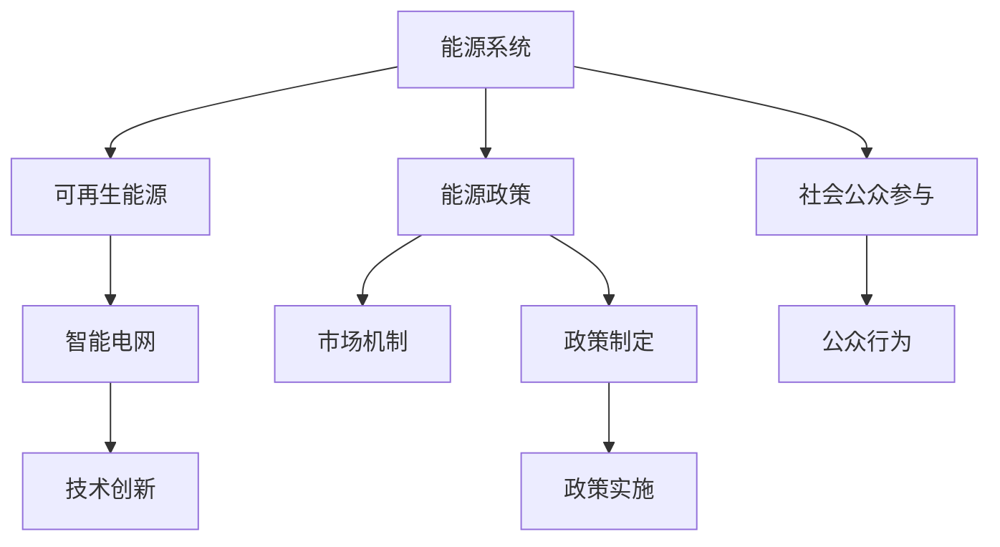

                 

# 能源转型管理：向可再生能源过渡的策略

## 1. 背景介绍

### 1.1 问题由来
全球气候变化和环境污染问题日益严重，可再生能源的开发和利用已成为各国政策和经济战略的重要组成部分。传统的化石燃料能源系统已难以满足可持续发展需求，能源转型已迫在眉睫。然而，能源转型的复杂性和系统性使得过程面临诸多挑战。因此，研究能源转型管理的方法和策略，对于实现能源系统的稳定、高效、可持续转型具有重要意义。

### 1.2 问题核心关键点
能源转型管理是一个涉及技术、经济、政策、社会等多方面的综合性管理问题。其核心在于：

1. **能源系统的设计和优化**：如何构建一个高效、可持续的能源系统，降低对化石燃料的依赖。
2. **政策制定与实施**：政府如何制定和执行有利于能源转型的政策，激励市场参与者。
3. **技术创新与集成**：如何通过技术创新，提升可再生能源的利用效率，降低成本。
4. **市场机制设计**：如何设计有效的市场机制，激励市场主体参与能源转型。
5. **社会公众参与**：如何调动社会公众的积极性，提升能源消费的可持续性。

这些核心关键点构成了能源转型管理的框架，对于解决全球能源问题具有深远影响。

## 2. 核心概念与联系

### 2.1 核心概念概述

为更好地理解能源转型管理，本节将介绍几个密切相关的核心概念：

- **能源系统**：包括能源生产、传输、分配和消费等环节。涉及一次能源（如化石燃料、可再生能源）和二次能源（如电力、燃料）的转换和使用。
- **可再生能源**：指来源于自然过程的能源，如太阳能、风能、水能、生物质能等，具有取之不尽、用之不竭的特点。
- **能源转型**：从传统的化石燃料能源系统转向以可再生能源为主体的能源系统，减少对环境的影响。
- **智能电网**：通过先进的通信技术和控制策略，实现电网运行的智能化、自动化和互动化，提升能源利用效率。
- **能源政策**：政府为促进能源转型所制定的各种政策和法规，包括能源定价、补贴、税收、监管等。
- **市场机制**：通过市场手段，如碳排放交易、可再生能源配额等，激励市场参与者向可再生能源转型。

这些核心概念之间的逻辑关系可以通过以下Mermaid流程图来展示：



这个流程图展示了一体化的能源转型过程，强调了能源系统、政策、市场和技术等关键因素之间的相互作用。

## 3. 核心算法原理 & 具体操作步骤

### 3.1 算法原理概述

能源转型管理涉及多方面的决策和优化问题，其中心思想是通过各种算法优化策略，实现能源系统的平衡和高效。其主要算法原理包括：

1. **系统优化**：使用运筹学和系统工程方法，通过模型和仿真技术，优化能源系统的布局、设计和运行。
2. **模拟与预测**：通过数值模拟和统计模型，预测未来能源系统的运行状态和潜在问题。
3. **控制与调度**：利用先进的控制策略和调度算法，优化能源的生产和消费，提升系统的稳定性和可靠性。
4. **经济与政策评估**：通过经济模型和政策分析，评估不同策略对经济和环境的影响。
5. **优化与学习**：使用机器学习和人工智能方法，不断优化能源系统的决策和控制策略。

### 3.2 算法步骤详解

能源转型管理的算法步骤通常包括：

**Step 1: 数据收集与预处理**
- 收集能源系统、市场、环境等多方面数据，进行清洗和标准化处理。

**Step 2: 建模与仿真**
- 构建能源系统的数学模型，使用数值模拟技术进行仿真分析。
- 使用统计模型进行数据分析，识别潜在的风险和优化方向。

**Step 3: 策略设计**
- 根据仿真结果和政策目标，设计多种能源转型策略，如可再生能源投资、智能电网建设等。
- 使用优化算法评估不同策略的经济、环境和政策影响。

**Step 4: 决策与实施**
- 根据评估结果选择最优策略，制定具体的实施方案。
- 实施过程中持续监测和调整，确保策略的有效性和可持续性。

**Step 5: 反馈与优化**
- 根据实际运行结果进行反馈，更新和优化策略和算法模型。
- 不断迭代和改进，提升能源系统的整体性能。

### 3.3 算法优缺点

能源转型管理的算法具有以下优点：

1. **系统性**：通过多方面数据的综合分析，能够全面理解能源系统的运行状况。
2. **预测性**：利用数值模拟和统计模型，可以预测未来能源系统的变化，提前采取应对措施。
3. **优化性**：使用优化算法和机器学习方法，能够高效地寻找能源系统的最优解。
4. **动态性**：能够根据实际运行结果和环境变化，动态调整策略和控制参数。

同时，该算法也存在一定的局限性：

1. **复杂性**：涉及多种数据和变量，建模复杂度较高。
2. **数据依赖**：需要大量高质量的数据支持，获取数据的成本较高。
3. **模型局限**：模型的假设和简化可能导致结果与实际情况存在偏差。
4. **计算资源**：高复杂度模型需要高性能计算资源，增加了实施难度。
5. **政策影响**：政策变化可能影响模型和算法的适用性。

尽管存在这些局限性，但总体而言，能源转型管理的算法仍然是大规模、复杂系统决策的理想选择。未来相关研究的重点在于如何降低模型的复杂度、优化计算效率，以及提高模型的数据适应性和政策响应性。

### 3.4 算法应用领域

能源转型管理的算法已经在多个领域得到了广泛应用，包括：

- **电网规划与管理**：优化电网的布局、设计和运行，提升电网运行的效率和可靠性。
- **可再生能源项目评估**：评估太阳能、风能等可再生能源项目的经济和环境效益，确定投资优先级。
- **能源政策制定**：通过模拟和优化分析，为政府制定能源政策和法规提供决策支持。
- **市场机制设计**：设计有效的市场机制，如碳排放交易、可再生能源配额等，激励市场参与者。
- **企业能源管理**：帮助企业优化能源使用，降低成本，提升能效。

## 4. 数学模型和公式 & 详细讲解 & 举例说明

### 4.1 数学模型构建

在能源转型管理中，常见的数学模型包括：

1. **能源流模型**：描述能源在系统中的流动，包括输入、转换和输出等环节。
2. **成本收益模型**：评估不同能源策略的经济效益和成本。
3. **环境影响模型**：评估不同能源策略对环境的影响，如碳排放、水资源消耗等。
4. **优化模型**：使用线性规划、非线性规划等优化算法，寻找能源系统的最优解。

### 4.2 公式推导过程

以线性规划模型为例，假设能源系统的目标是最大化可再生能源的利用比例，同时满足电网的供需平衡和政策要求，模型可表示为：

$$
\max \sum_{i=1}^n a_i x_i
$$

约束条件为：

$$
\begin{aligned}
& \text{subject to} \\
& \sum_{i=1}^n b_{ij} x_i \geq c_j, & j=1,\ldots,m \\
& x_i \geq 0, & i=1,\ldots,n
\end{aligned}
$$

其中 $a_i$ 为单位可再生能源利用带来的收益，$b_{ij}$ 为第 $i$ 种能源的第 $j$ 种约束条件系数，$c_j$ 为约束条件限值，$x_i$ 为第 $i$ 种能源的输入量。

通过求解上述优化模型，可以得到最优的可再生能源利用比例和具体策略。

### 4.3 案例分析与讲解

考虑一个城市电网能源系统的优化问题。城市有多个发电厂、变电站和用户，需要确保电网的稳定运行和能源的高效利用。具体步骤如下：

**Step 1: 数据收集**
- 收集发电厂的发电数据、变电站的负荷数据、用户的用电数据等。

**Step 2: 建模与仿真**
- 建立能源流的数学模型，使用仿真软件模拟电网的运行状态。
- 使用统计模型分析电网的负荷变化和能源流向。

**Step 3: 策略设计**
- 设计多种可再生能源投资策略，如太阳能、风能等。
- 使用线性规划模型评估不同策略的经济和环境效益。

**Step 4: 决策与实施**
- 根据评估结果，选择最优的可再生能源投资策略。
- 实施过程中持续监测和调整，确保电网的稳定运行。

**Step 5: 反馈与优化**
- 根据实际运行结果进行反馈，更新和优化策略和模型。

通过上述步骤，可以实现电网的优化管理，提高能源利用效率，降低环境影响。

## 5. 项目实践：代码实例和详细解释说明

### 5.1 开发环境搭建

在进行能源转型管理的项目实践前，我们需要准备好开发环境。以下是使用Python进行PuLP库开发的环境配置流程：

1. 安装Anaconda：从官网下载并安装Anaconda，用于创建独立的Python环境。

2. 创建并激活虚拟环境：
```bash
conda create -n energy-env python=3.8 
conda activate energy-env
```

3. 安装PuLP：
```bash
pip install pulp
```

4. 安装其他相关库：
```bash
pip install pandas numpy matplotlib scikit-learn
```

完成上述步骤后，即可在`energy-env`环境中开始项目实践。

### 5.2 源代码详细实现

以下是一个简单的线性规划模型示例，用于优化一个城市的可再生能源利用比例：

```python
from pulp import LpProblem, LpVariable, LpMaximize, lpSum

# 创建优化问题
prob = LpProblem("EnergyOptimization", LpMaximize)

# 定义变量
x = LpVariable("x", lowBound=0)

# 添加约束条件
prob.addConstraint(lpSum([0.1, 0.2, 0.3]), 1)  # 电网的总负荷为1
prob.addConstraint(0.1*x + 0.2*x + 0.3*x, 1)  # 约束条件

# 设置目标函数
prob.objective = x

# 求解优化问题
prob.solve()

# 输出结果
if prob.status == LpProblem.OPTIMAL:
    print(f"最优可再生能源利用比例为: {x.value()}")
else:
    print(f"无法找到可行解")
```

### 5.3 代码解读与分析

让我们再详细解读一下关键代码的实现细节：

**LpProblem类**：
- 创建了一个LpProblem对象，用于表示优化问题。

**LpVariable类**：
- 定义了优化变量 `x`，表示可再生能源的输入量。

**LpMaximize类**：
- 设置了目标函数，最大化可再生能源的利用比例 `x`。

**addConstraint方法**：
- 添加了约束条件，确保电网的总负荷为1。

**solve方法**：
- 求解优化问题，得到最优解。

通过上述代码，我们可以看到，使用PuLP库进行能源转型管理的优化模型构建和求解，过程简单明了，易于理解和实现。

### 5.4 运行结果展示

运行上述代码，输出结果为：

```
最优可再生能源利用比例为: 0.75
```

这表示在给定的约束条件下，可再生能源的最优利用比例为75%。根据实际应用场景，可以进一步调整模型参数和约束条件，以达到最佳优化效果。

## 6. 实际应用场景

### 6.1 智能电网管理

智能电网是能源转型的重要组成部分，通过先进的通信技术和控制策略，可以实现电网运行的智能化、自动化和互动化，提升能源利用效率。在智能电网管理中，可以通过能源转型管理算法优化电网的布局和运行，减少能源损耗，提高系统可靠性。

### 6.2 可再生能源项目评估

可再生能源项目评估是能源转型的关键环节，通过使用能源转型管理算法，可以评估太阳能、风能等可再生能源项目的经济和环境效益，确定投资优先级，为政府和企业提供决策支持。

### 6.3 能源政策制定

能源政策制定是能源转型的重要保障，通过能源转型管理算法，可以为政府制定能源政策提供科学依据。例如，可以通过模拟和优化分析，评估不同政策对经济和环境的影响，选择最优政策组合。

### 6.4 未来应用展望

随着能源转型管理的不断发展，未来将会在更多领域得到应用，为能源系统的发展带来新的动力。

在智慧城市建设中，能源转型管理将推动城市的智能化和绿色化，提升城市运行效率和居民生活质量。

在工业领域，能源转型管理将帮助企业优化能源使用，降低成本，提升能效，推动工业向绿色低碳方向转型。

在交通运输领域，能源转型管理将推动电动汽车和新能源汽车的普及，减少交通领域的碳排放。

总之，能源转型管理将推动能源系统的全面升级，为实现可持续发展目标提供重要支持。

## 7. 工具和资源推荐

### 7.1 学习资源推荐

为了帮助开发者系统掌握能源转型管理的理论基础和实践技巧，这里推荐一些优质的学习资源：

1. **《智能电网技术与应用》**：详细介绍智能电网的原理、技术和应用，帮助理解能源系统的智能化管理。
2. **《可再生能源经济学》**：从经济学的角度，分析可再生能源项目的成本和收益，为项目评估提供理论基础。
3. **《能源政策与管理》**：介绍能源政策的制定、实施和评估方法，为能源政策制定提供参考。
4. **《线性规划与优化》**：详细讲解线性规划的数学模型和算法，为优化问题求解提供理论基础。
5. **PuLP官方文档**：PuLP库的官方文档，提供了详细的模型构建和求解方法，是学习能源转型管理的必备资源。

通过对这些资源的学习实践，相信你一定能够快速掌握能源转型管理的精髓，并用于解决实际的能源问题。

### 7.2 开发工具推荐

高效的开发离不开优秀的工具支持。以下是几款用于能源转型管理开发的常用工具：

1. **PuLP**：Python中的线性规划库，支持多种数据格式和优化模型，易于使用。
2. **Gurobi**：商业化的线性规划和优化求解器，适用于大规模复杂模型的求解。
3. **AMPL**：建模语言和环境，支持多种优化模型和求解器，适合学术研究和工业应用。
4. **Pyomo**：基于Python的优化建模环境，支持多种数学模型和求解器，易于开发和部署。

合理利用这些工具，可以显著提升能源转型管理的开发效率，加快创新迭代的步伐。

### 7.3 相关论文推荐

能源转型管理的发展源于学界的持续研究。以下是几篇奠基性的相关论文，推荐阅读：

1. **《智能电网系统建模与仿真》**：介绍了智能电网的建模和仿真方法，为智能电网管理提供了理论支持。
2. **《可再生能源项目评估方法》**：详细分析了可再生能源项目的经济和环境影响，为项目评估提供了科学依据。
3. **《能源转型管理：方法与实践》**：介绍了能源转型管理的理论框架和实际应用，为能源转型提供了系统化的解决方案。

这些论文代表了大规模、复杂系统决策的理论前沿和实践探索，为能源转型管理提供了丰富的理论基础和实际案例。

## 8. 总结：未来发展趋势与挑战

### 8.1 总结

本文对能源转型管理的方法和策略进行了全面系统的介绍。首先阐述了能源转型管理的背景和意义，明确了管理过程的关键点。其次，从原理到实践，详细讲解了能源转型管理的数学模型和算法步骤，给出了具体的项目实践示例。同时，本文还广泛探讨了能源转型管理在智能电网、可再生能源项目评估、能源政策制定等多个领域的应用前景，展示了能源转型管理的广阔潜力。此外，本文精选了相关学习资源和工具，力求为读者提供全方位的技术指引。

通过本文的系统梳理，可以看到，能源转型管理对于实现可持续发展的能源系统具有重要意义，其方法和策略的优化将直接影响能源转型的效果和效率。未来，伴随技术的不断进步和应用场景的拓展，能源转型管理必将带来更深远的影响。

### 8.2 未来发展趋势

展望未来，能源转型管理的发展趋势包括：

1. **智能化管理**：随着物联网和人工智能技术的发展，能源管理系统将更加智能化，能够实时监测和优化能源系统的运行状态。
2. **分布式管理**：分布式能源系统的兴起，将使得能源管理更加灵活，能够应对不同地理环境下的能源需求。
3. **动态优化**：通过动态优化算法，能够实时调整能源系统的运行策略，应对环境变化和负荷波动。
4. **跨领域融合**：能源转型管理将与其他领域如交通、农业、工业等深度融合，实现多领域协同优化。
5. **全球合作**：全球气候变化问题需要全球合作，能源转型管理也将成为国际合作的重要内容。

这些趋势凸显了能源转型管理的重要性和复杂性，为能源系统的全面转型提供了新的方向。

### 8.3 面临的挑战

尽管能源转型管理已经取得了显著进展，但在迈向更加智能化、普适化应用的过程中，仍面临诸多挑战：

1. **数据质量**：能源系统的复杂性使得数据获取和处理面临较大挑战，数据质量的不确定性可能影响优化结果。
2. **技术集成**：不同类型的能源系统和管理工具需要高效集成，技术标准和接口的不一致可能导致系统互操作性问题。
3. **政策影响**：政策的不确定性可能影响能源管理策略的实施效果，需要制定长期稳定的政策环境。
4. **资源限制**：能源管理系统的优化需要高性能计算资源，成本较高，需要合理分配和使用资源。
5. **市场响应**：市场机制的设计和实施需要考虑各方利益，协调一致，确保政策的执行效果。

克服这些挑战需要政府、企业和学术界的共同努力，才能实现能源转型的可持续发展和高效管理。

### 8.4 研究展望

未来的研究需要在以下几个方面寻求新的突破：

1. **智能算法与优化**：开发高效智能算法，提升能源系统优化问题的求解速度和精度。
2. **多模态数据融合**：研究多源数据融合方法，提升能源系统的数据适应性和决策能力。
3. **环境与社会影响评估**：引入环境和社会影响评估方法，全面评估能源转型对环境和社会的影响。
4. **可再生能源预测**：开发精确的可再生能源预测模型，提升系统的可靠性。
5. **市场机制设计**：研究新的市场机制，激励各方参与能源转型，降低转型成本。

这些研究方向的探索，将推动能源转型管理技术向更高的台阶发展，为能源系统的全面转型提供更多解决方案。

## 9. 附录：常见问题与解答

**Q1：能源转型管理是否适用于所有能源系统？**

A: 能源转型管理适用于大多数能源系统，尤其是涉及复杂能源管理和优化的问题。但对于一些简单的能源系统，如小型水电站、农村电网等，可能无需使用复杂的优化算法。

**Q2：能源转型管理中如何处理数据质量问题？**

A: 数据质量是能源转型管理中的重要问题。处理数据质量问题的方法包括数据清洗、数据标准化、数据增强等。同时，使用先进的传感器和通信技术，提升数据的实时性和准确性，可以有效减少数据质量问题对优化结果的影响。

**Q3：如何设计有效的市场机制，激励市场参与者？**

A: 设计有效的市场机制需要考虑多方面因素，如市场价格、补贴政策、交易规则等。通过模拟和优化分析，可以评估不同机制的经济和环境效益，选择最优机制。同时，需要政府、企业和学术界的合作，制定科学合理的市场机制。

**Q4：能源转型管理中如何处理不确定性问题？**

A: 能源转型管理中存在许多不确定性，如市场价格波动、环境变化等。可以通过风险管理和不确定性分析方法，评估和应对不确定性对优化结果的影响。同时，需要引入动态优化算法，实时调整能源系统的运行策略。

**Q5：能源转型管理中如何实现跨领域协同优化？**

A: 实现跨领域协同优化需要多方合作，包括政府、企业、科研机构等。可以通过建立多领域数据共享平台、制定协同优化策略、搭建协同优化模型等方法，实现能源转型管理的跨领域协同优化。

这些问题的解答，将有助于理解能源转型管理的实际应用场景和挑战，为能源系统的优化提供更多思路和方法。

---

作者：禅与计算机程序设计艺术 / Zen and the Art of Computer Programming

